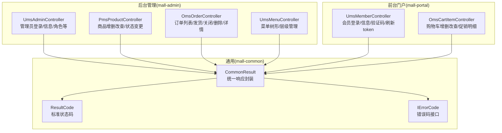
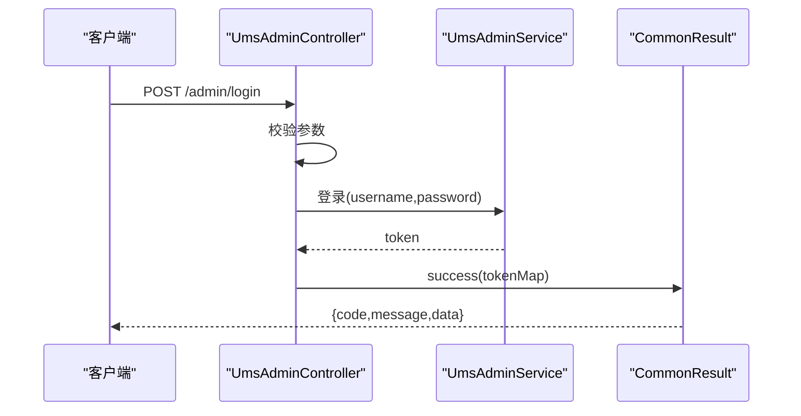
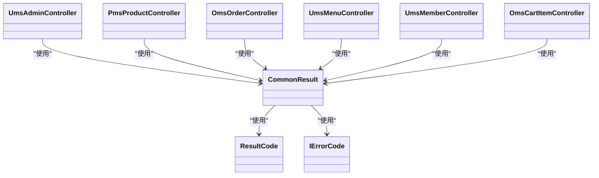

# API接口文档

<cite>
**本文引用的文件**
- [README.md](file://README.md)
- [mall-common/src/main/java/com/macro/mall/common/api/CommonResult.java](file://mall-common/src/main/java/com/macro/mall/common/api/CommonResult.java)
- [mall-common/src/main/java/com/macro/mall/common/api/IErrorCode.java](file://mall-common/src/main/java/com/macro/mall/common/api/IErrorCode.java)
- [mall-common/src/main/java/com/macro/mall/common/api/ResultCode.java](file://mall-common/src/main/java/com/macro/mall/common/api/ResultCode.java)
- [mall-admin/src/main/java/com/macro/mall/controller/UmsAdminController.java](file://mall-admin/src/main/java/com/macro/mall/controller/UmsAdminController.java)
- [mall-admin/src/main/java/com/macro/mall/controller/PmsProductController.java](file://mall-admin/src/main/java/com/macro/mall/controller/PmsProductController.java)
- [mall-admin/src/main/java/com/macro/mall/controller/OmsOrderController.java](file://mall-admin/src/main/java/com/macro/mall/controller/OmsOrderController.java)
- [mall-admin/src/main/java/com/macro/mall/controller/UmsMenuController.java](file://mall-admin/src/main/java/com/macro/mall/controller/UmsMenuController.java)
- [mall-portal/src/main/java/com/macro/mall/portal/controller/UmsMemberController.java](file://mall-portal/src/main/java/com/macro/mall/portal/controller/UmsMemberController.java)
- [mall-portal/src/main/java/com/macro/mall/portal/controller/OmsCartItemController.java](file://mall-portal/src/main/java/com/macro/mall/portal/controller/OmsCartItemController.java)
- [document/postman/mall-admin.postman_collection.json](file://document/postman/mall-admin.postman_collection.json)
- [document/postman/mall-portal.postman_collection.json](file://document/postman/mall-portal.postman_collection.json)
</cite>

## 目录
1. [简介](#简介)
2. [项目结构](#项目结构)
3. [核心组件](#核心组件)
4. [架构总览](#架构总览)
5. [详细组件分析](#详细组件分析)
6. [依赖关系分析](#依赖关系分析)
7. [性能与扩展性建议](#性能与扩展性建议)
8. [故障排查指南](#故障排查指南)
9. [结论](#结论)
10. [附录](#附录)

## 简介
本文件为 Mall 项目的 API 接口文档，覆盖后台管理与前台门户两大模块的 RESTful 接口规范，统一说明响应格式、鉴权方式、典型使用场景与常见问题排查。文档同时提供 Postman 集合的使用说明，便于前后端联调与集成。

## 项目结构
- 后台管理模块（mall-admin）：面向管理员的运营与管理接口，如商品管理、订单管理、菜单与权限管理等。
- 前台门户模块（mall-portal）：面向终端用户的业务接口，如会员登录注册、购物车、订单流程、优惠券等。
- 通用模块（mall-common）：统一的响应体封装、错误码定义与全局异常处理等基础设施。

**图表来源**
- [mall-admin/src/main/java/com/macro/mall/controller/UmsAdminController.java:34-191](file://mall-admin/src/main/java/com/macro/mall/controller/UmsAdminController.java#L34-L191)
- [mall-admin/src/main/java/com/macro/mall/controller/PmsProductController.java:24-133](file://mall-admin/src/main/java/com/macro/mall/controller/PmsProductController.java#L24-L133)
- [mall-admin/src/main/java/com/macro/mall/controller/OmsOrderController.java:22-103](file://mall-admin/src/main/java/com/macro/mall/controller/OmsOrderController.java#L22-L103)
- [mall-admin/src/main/java/com/macro/mall/controller/UmsMenuController.java:22-94](file://mall-admin/src/main/java/com/macro/mall/controller/UmsMenuController.java#L22-L94)
- [mall-portal/src/main/java/com/macro/mall/portal/controller/UmsMemberController.java:26-99](file://mall-portal/src/main/java/com/macro/mall/portal/controller/UmsMemberController.java#L26-L99)
- [mall-portal/src/main/java/com/macro/mall/portal/controller/OmsCartItemController.java:22-100](file://mall-portal/src/main/java/com/macro/mall/portal/controller/OmsCartItemController.java#L22-L100)
- [mall-common/src/main/java/com/macro/mall/common/api/CommonResult.java:7-133](file://mall-common/src/main/java/com/macro/mall/common/api/CommonResult.java#L7-L133)
- [mall-common/src/main/java/com/macro/mall/common/api/ResultCode.java:7-28](file://mall-common/src/main/java/com/macro/mall/common/api/ResultCode.java#L7-L28)
- [mall-common/src/main/java/com/macro/mall/common/api/IErrorCode.java:7-17](file://mall-common/src/main/java/com/macro/mall/common/api/IErrorCode.java#L7-L17)

**章节来源**
- [README.md:51-62](file://README.md#L51-L62)

## 核心组件
- 统一响应体：所有接口返回统一结构，包含状态码、消息与数据体。
- 标准状态码：成功、失败、参数校验失败、未登录、无权限等。
- 错误码接口：通过 IErrorCode 规范错误码与消息。

关键要点
- 成功响应：使用统一的成功构造方法，返回数据体。
- 失败/校验失败/未登录/无权限：使用对应静态方法，返回状态码与消息。
- 分页：商品列表等接口返回分页包装对象。

**章节来源**
- [mall-common/src/main/java/com/macro/mall/common/api/CommonResult.java:35-108](file://mall-common/src/main/java/com/macro/mall/common/api/CommonResult.java#L35-L108)
- [mall-common/src/main/java/com/macro/mall/common/api/ResultCode.java:8-28](file://mall-common/src/main/java/com/macro/mall/common/api/ResultCode.java#L8-L28)
- [mall-common/src/main/java/com/macro/mall/common/api/IErrorCode.java:7-17](file://mall-common/src/main/java/com/macro/mall/common/api/IErrorCode.java#L7-L17)

## 架构总览
- 后台管理接口：以 /admin、/product、/order、/menu 等前缀组织，多数需要管理员身份令牌。
- 前台门户接口：以 /sso、/cart 等前缀组织，面向会员用户，部分接口需要登录态。
- 统一响应：所有接口均遵循 mall-common 的统一响应体。

**图表来源**
- [mall-admin/src/main/java/com/macro/mall/controller/UmsAdminController.java:54-65](file://mall-admin/src/main/java/com/macro/mall/controller/UmsAdminController.java#L54-L65)
- [mall-common/src/main/java/com/macro/mall/common/api/CommonResult.java:35-47](file://mall-common/src/main/java/com/macro/mall/common/api/CommonResult.java#L35-L47)

## 详细组件分析

### 后台管理接口

#### 管理员登录与信息
- 登录
  - 方法与路径：POST /admin/login
  - 请求体：用户名、密码
  - 响应：返回 token 与 tokenHead
- 刷新 Token
  - 方法与路径：GET /admin/refreshToken
  - 请求头：携带 Authorization
  - 响应：返回新的 token 与 tokenHead
- 获取管理员信息
  - 方法与路径：GET /admin/info
  - 请求头：携带 Authorization
  - 响应：返回用户名、菜单、头像、角色列表
- 注销
  - 方法与路径：POST /admin/logout
  - 请求头：携带 Authorization
  - 响应：返回成功

权限与场景
- 需要管理员身份令牌；用于后台管理系统的登录态维护与菜单渲染。

**章节来源**
- [mall-admin/src/main/java/com/macro/mall/controller/UmsAdminController.java:54-99](file://mall-admin/src/main/java/com/macro/mall/controller/UmsAdminController.java#L54-L99)

#### 商品管理
- 创建商品
  - 方法与路径：POST /product/create
  - 请求体：商品参数对象
  - 响应：返回受影响行数
- 更新商品
  - 方法与路径：POST /product/update/{id}
  - 请求体：商品参数对象
  - 响应：返回受影响行数
- 查询商品更新信息
  - 方法与路径：GET /product/updateInfo/{id}
  - 响应：返回商品更新信息对象
- 列表查询
  - 方法与路径：GET /product/list
  - 查询参数：分页与筛选条件
  - 响应：分页包装后的商品列表
- 简易列表
  - 方法与路径：GET /product/simpleList
  - 查询参数：关键词
  - 响应：商品列表
- 批量审核/上架/推荐/新品/逻辑删除
  - 方法与路径：POST /product/update/verifyStatus、/publishStatus、/recommendStatus、/newStatus、/deleteStatus
  - 请求参数：ids、状态值、详情（审核）
  - 响应：受影响行数

权限与场景
- 需要管理员身份令牌；用于后台商品的全生命周期管理。

**章节来源**
- [mall-admin/src/main/java/com/macro/mall/controller/PmsProductController.java:28-132](file://mall-admin/src/main/java/com/macro/mall/controller/PmsProductController.java#L28-L132)

#### 订单管理
- 订单列表
  - 方法与路径：GET /order/list
  - 查询参数：分页与筛选条件
  - 响应：分页包装后的订单列表
- 发货
  - 方法与路径：POST /order/update/delivery
  - 请求体：发货参数列表
  - 响应：受影响行数
- 关闭订单
  - 方法与路径：POST /order/update/close
  - 请求参数：ids、备注
  - 响应：受影响行数
- 删除订单
  - 方法与路径：POST /order/delete
  - 请求参数：ids
  - 响应：受影响行数
- 订单详情
  - 方法与路径：GET /order/{id}
  - 响应：订单详情对象
- 修改收货人信息
  - 方法与路径：POST /order/update/receiverInfo
  - 请求体：收货人信息参数
  - 响应：受影响行数
- 修改金额信息
  - 方法与路径：POST /order/update/moneyInfo
  - 请求体：金额信息参数
  - 响应：受影响行数
- 修改备注与状态
  - 方法与路径：POST /order/update/note
  - 请求参数：id、note、status
  - 响应：受影响行数

权限与场景
- 需要管理员身份令牌；用于后台订单的处理与维护。

**章节来源**
- [mall-admin/src/main/java/com/macro/mall/controller/OmsOrderController.java:26-102](file://mall-admin/src/main/java/com/macro/mall/controller/OmsOrderController.java#L26-L102)

#### 菜单管理
- 新增菜单
  - 方法与路径：POST /menu/create
  - 请求体：菜单对象
  - 响应：受影响行数
- 更新菜单
  - 方法与路径：POST /menu/update/{id}
  - 请求体：菜单对象
  - 响应：受影响行数
- 获取菜单
  - 方法与路径：GET /menu/{id}
  - 响应：菜单对象
- 删除菜单
  - 方法与路径：POST /menu/delete/{id}
  - 响应：受影响行数
- 列表查询
  - 方法与路径：GET /menu/list/{parentId}
  - 查询参数：分页
  - 响应：分页包装后的菜单列表
- 树形列表
  - 方法与路径：GET /menu/treeList
  - 响应：菜单树节点列表
- 更新隐藏状态
  - 方法与路径：POST /menu/updateHidden/{id}
  - 请求参数：hidden
  - 响应：受影响行数

权限与场景
- 需要管理员身份令牌；用于后台菜单的配置与导航管理。

**章节来源**
- [mall-admin/src/main/java/com/macro/mall/controller/UmsMenuController.java:27-93](file://mall-admin/src/main/java/com/macro/mall/controller/UmsMenuController.java#L27-L93)

### 前台门户接口

#### 会员登录与信息
- 注册
  - 方法与路径：POST /sso/register
  - 查询参数：username、password、telephone、authCode
  - 响应：返回成功消息
- 登录
  - 方法与路径：POST /sso/login
  - 查询参数：username、password
  - 响应：返回 token 与 tokenHead
- 获取会员信息
  - 方法与路径：GET /sso/info
  - 请求头：携带 Authorization
  - 响应：返回当前会员对象
- 获取验证码
  - 方法与路径：GET /sso/getAuthCode
  - 查询参数：telephone
  - 响应：返回验证码与消息
- 修改密码
  - 方法与路径：POST /sso/updatePassword
  - 查询参数：telephone、password、authCode
  - 响应：返回成功消息
- 刷新 Token
  - 方法与路径：GET /sso/refreshToken
  - 请求头：携带 Authorization
  - 响应：返回新的 token 与 tokenHead

权限与场景
- 部分接口需要登录态；用于会员的登录态维护与个人信息管理。

**章节来源**
- [mall-portal/src/main/java/com/macro/mall/portal/controller/UmsMemberController.java:35-98](file://mall-portal/src/main/java/com/macro/mall/portal/controller/UmsMemberController.java#L35-L98)

#### 购物车管理
- 加入购物车
  - 方法与路径：POST /cart/add
  - 请求体：购物车项对象
  - 响应：返回受影响行数
- 获取购物车列表
  - 方法与路径：GET /cart/list
  - 响应：返回当前会员的购物车列表
- 获取购物车促销明细
  - 方法与路径：GET /cart/list/promotion
  - 查询参数：cartIds（可选）
  - 响应：返回促销明细列表
- 修改数量
  - 方法与路径：GET /cart/update/quantity
  - 查询参数：id、quantity
  - 响应：返回受影响行数
- 获取商品购物车信息
  - 方法与路径：GET /cart/getProduct/{productId}
  - 响应：返回购物车商品信息
- 修改规格属性
  - 方法与路径：POST /cart/update/attr
  - 请求体：购物车项对象
  - 响应：返回受影响行数
- 删除购物车项
  - 方法与路径：POST /cart/delete
  - 请求参数：ids
  - 响应：返回受影响行数
- 清空购物车
  - 方法与路径：POST /cart/clear
  - 响应：返回受影响行数

权限与场景
- 需要会员登录态；用于购物车的增删改与促销计算。

**章节来源**
- [mall-portal/src/main/java/com/macro/mall/portal/controller/OmsCartItemController.java:29-99](file://mall-portal/src/main/java/com/macro/mall/portal/controller/OmsCartItemController.java#L29-L99)

### 统一响应格式
- 成功：包含 code（200）、message（操作成功）、data（具体数据）
- 失败：包含 code（500）、message（操作失败）、data（null）
- 参数校验失败：包含 code（404）、message（参数检验失败）、data（null）
- 未登录：包含 code（401）、message（暂未登录或token已经过期）、data（null）
- 无权限：包含 code（403）、message（没有相关权限）、data（null）

字段说明
- code：业务状态码
- message：提示信息
- data：数据体，可能为对象、数组或分页包装

**章节来源**
- [mall-common/src/main/java/com/macro/mall/common/api/CommonResult.java:35-108](file://mall-common/src/main/java/com/macro/mall/common/api/CommonResult.java#L35-L108)
- [mall-common/src/main/java/com/macro/mall/common/api/ResultCode.java:8-12](file://mall-common/src/main/java/com/macro/mall/common/api/ResultCode.java#L8-L12)

### 权限要求与使用场景
- 后台管理接口：通常需要管理员身份令牌（Authorization），用于商品、订单、菜单等后台管理。
- 前台门户接口：部分接口需要会员登录态，如购物车、订单流程等；部分公开接口如验证码获取。
- 令牌刷新：两个模块均提供刷新接口，避免过期导致的频繁重新登录。

**章节来源**
- [mall-admin/src/main/java/com/macro/mall/controller/UmsAdminController.java:67-78](file://mall-admin/src/main/java/com/macro/mall/controller/UmsAdminController.java#L67-L78)
- [mall-portal/src/main/java/com/macro/mall/portal/controller/UmsMemberController.java:86-98](file://mall-portal/src/main/java/com/macro/mall/portal/controller/UmsMemberController.java#L86-L98)

### 接口测试与 Postman 集成
- 后台管理集合：包含登录、商品列表、批量删除状态、分类树、品牌列表、刷新 token 等示例。
- 前台门户集合：包含会员登录、购物车增删改、促销明细、收货地址、优惠券、订单流程等示例。
- 使用说明：
  - 导入对应集合文件至 Postman；
  - 在环境变量中配置域名与端口（如 {{admin.mall}}、{{portal.mall}}）；
  - 登录后将返回的 token 填写到请求头 Authorization 中（格式见各接口说明）。

**章节来源**
- [document/postman/mall-admin.postman_collection.json:1-188](file://document/postman/mall-admin.postman_collection.json#L1-L188)
- [document/postman/mall-portal.postman_collection.json:1-328](file://document/postman/mall-portal.postman_collection.json#L1-L328)

## 依赖关系分析
- 控制器依赖服务层，服务层依赖 DAO/持久层与模型；
- 统一响应体由 mall-common 提供，所有模块共享；
- 错误码通过 ResultCode 与 IErrorCode 统一管理。

**图表来源**
- [mall-admin/src/main/java/com/macro/mall/controller/UmsAdminController.java:34-191](file://mall-admin/src/main/java/com/macro/mall/controller/UmsAdminController.java#L34-L191)
- [mall-admin/src/main/java/com/macro/mall/controller/PmsProductController.java:24-133](file://mall-admin/src/main/java/com/macro/mall/controller/PmsProductController.java#L24-L133)
- [mall-admin/src/main/java/com/macro/mall/controller/OmsOrderController.java:22-103](file://mall-admin/src/main/java/com/macro/mall/controller/OmsOrderController.java#L22-L103)
- [mall-admin/src/main/java/com/macro/mall/controller/UmsMenuController.java:22-94](file://mall-admin/src/main/java/com/macro/mall/controller/UmsMenuController.java#L22-L94)
- [mall-portal/src/main/java/com/macro/mall/portal/controller/UmsMemberController.java:26-99](file://mall-portal/src/main/java/com/macro/mall/portal/controller/UmsMemberController.java#L26-L99)
- [mall-portal/src/main/java/com/macro/mall/portal/controller/OmsCartItemController.java:22-100](file://mall-portal/src/main/java/com/macro/mall/portal/controller/OmsCartItemController.java#L22-L100)
- [mall-common/src/main/java/com/macro/mall/common/api/CommonResult.java:7-133](file://mall-common/src/main/java/com/macro/mall/common/api/CommonResult.java#L7-L133)
- [mall-common/src/main/java/com/macro/mall/common/api/ResultCode.java:7-28](file://mall-common/src/main/java/com/macro/mall/common/api/ResultCode.java#L7-L28)
- [mall-common/src/main/java/com/macro/mall/common/api/IErrorCode.java:7-17](file://mall-common/src/main/java/com/macro/mall/common/api/IErrorCode.java#L7-L17)

## 性能与扩展性建议
- 分页查询：商品与订单列表已采用分页包装，建议前端按需加载，避免一次性拉取大量数据。
- 缓存策略：购物车与促销明细可结合缓存提升性能，注意与登录态绑定。
- 幂等性：对幂等接口（如刷新 token、查询）可增加缓存与去重机制。
- 接口版本：建议引入路径版本前缀（如 /api/v1/...），便于未来演进与兼容。

## 故障排查指南
- 未登录或 token 过期
  - 现象：返回 401 或统一未登录响应
  - 处理：调用刷新 token 接口获取新 token，或重新登录
- 无权限
  - 现象：返回 403 或统一无权限响应
  - 处理：检查管理员角色与权限配置
- 参数校验失败
  - 现象：返回 404 或统一参数校验失败响应
  - 处理：核对请求参数类型与必填项
- 业务失败
  - 现象：返回 500 或统一失败响应
  - 处理：查看后端日志与服务链路，定位具体异常

**章节来源**
- [mall-common/src/main/java/com/macro/mall/common/api/CommonResult.java:84-108](file://mall-common/src/main/java/com/macro/mall/common/api/CommonResult.java#L84-L108)
- [mall-common/src/main/java/com/macro/mall/common/api/ResultCode.java:8-12](file://mall-common/src/main/java/com/macro/mall/common/api/ResultCode.java#L8-L12)

## 结论
本接口文档梳理了 Mall 项目后台管理与前台门户的核心 RESTful 接口，明确了统一响应格式、鉴权方式与典型使用场景，并提供了 Postman 集合的使用说明。建议在后续迭代中引入接口版本前缀与更完善的文档生成工具，以提升前后端协作效率与接口稳定性。

## 附录

### 响应体字段说明
- code：业务状态码（200 成功、500 失败、404 校验失败、401 未登录、403 无权限）
- message：提示信息
- data：数据体（对象、数组或分页包装）

**章节来源**
- [mall-common/src/main/java/com/macro/mall/common/api/CommonResult.java:11-28](file://mall-common/src/main/java/com/macro/mall/common/api/CommonResult.java#L11-L28)

### Postman 集成步骤
- 导入 mall-admin.postman_collection.json 与 mall-portal.postman_collection.json 至 Postman
- 在环境变量中配置域名与端口（如 {{admin.mall}}、{{portal.mall}}）
- 登录后将返回的 token 填写到请求头 Authorization 中，格式为 Bearer {token}

**章节来源**
- [document/postman/mall-admin.postman_collection.json:1-188](file://document/postman/mall-admin.postman_collection.json#L1-L188)
- [document/postman/mall-portal.postman_collection.json:1-328](file://document/postman/mall-portal.postman_collection.json#L1-L328)