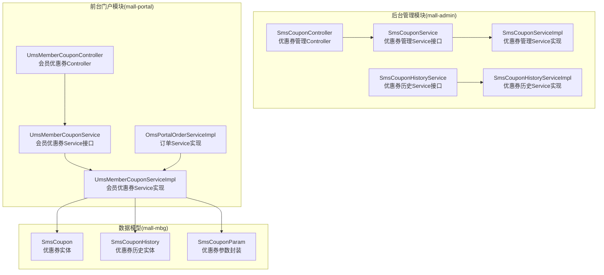
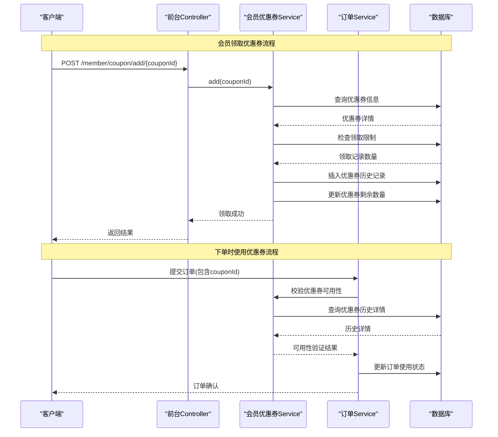
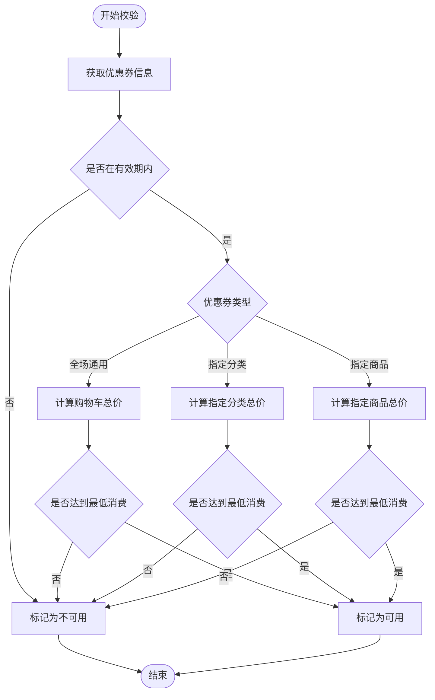
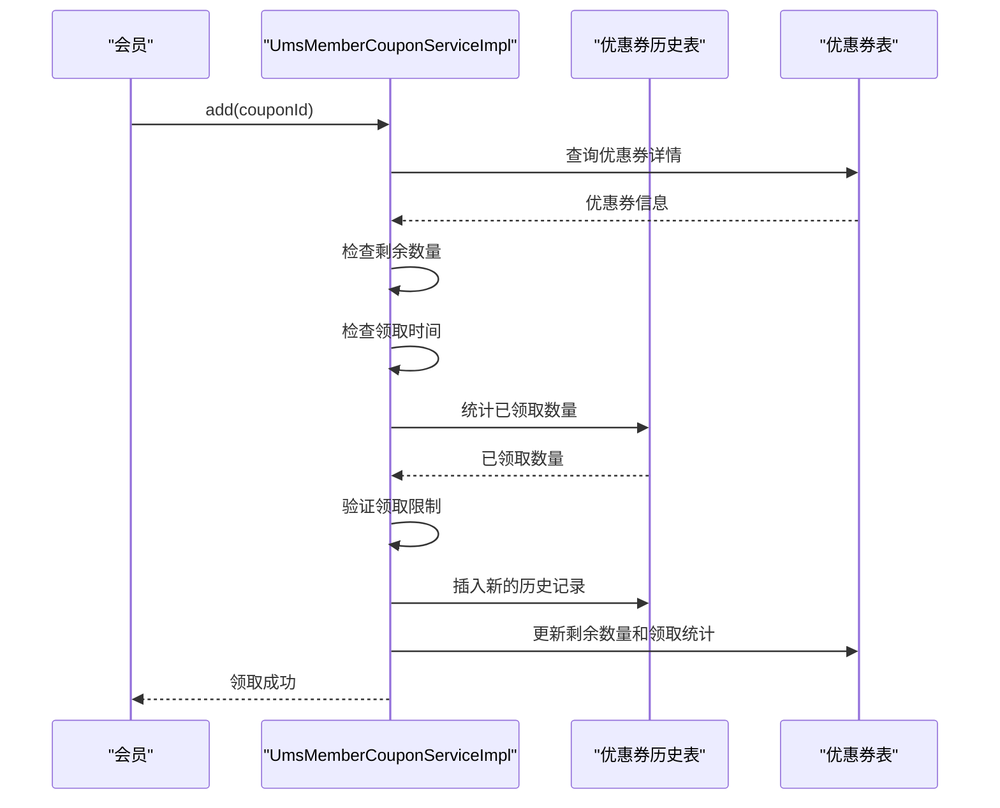
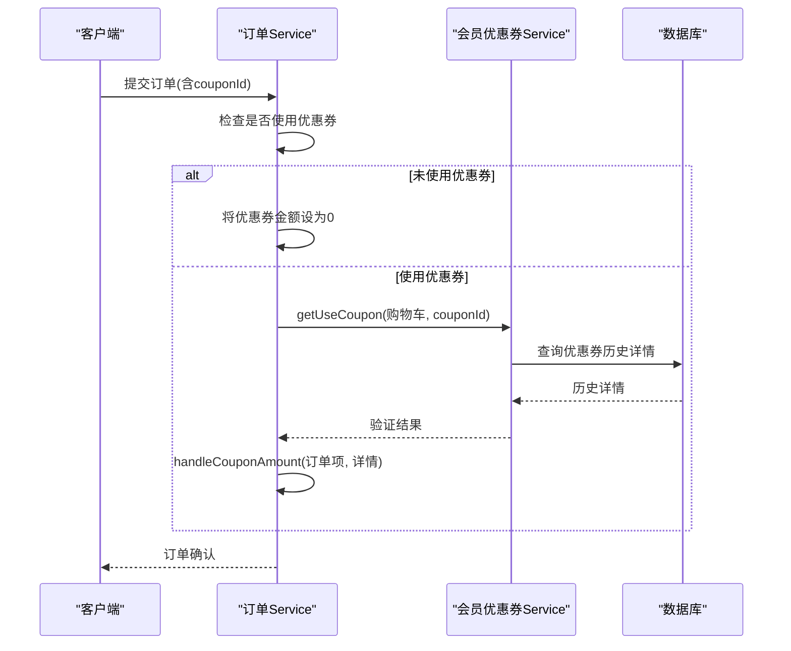
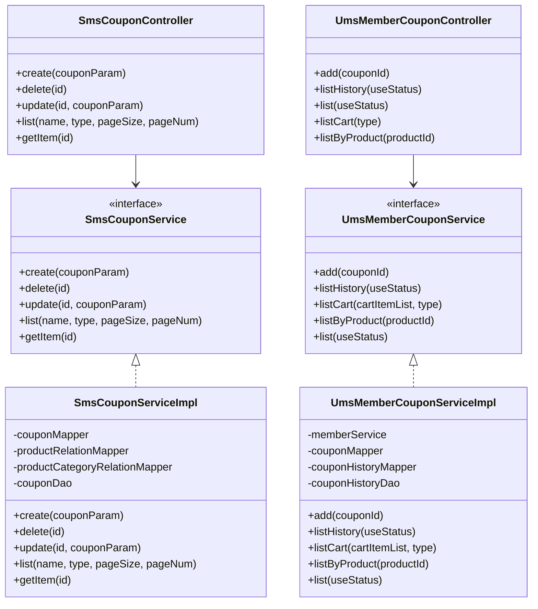

# 优惠券管理API

<cite>
**本文档引用的文件**
- [SmsCouponController.java](file://mall-admin/src/main/java/com/macro/mall/controller/SmsCouponController.java)
- [SmsCouponService.java](file://mall-admin/src/main/java/com/macro/mall/service/SmsCouponService.java)
- [SmsCouponServiceImpl.java](file://mall-admin/src/main/java/com/macro/mall/service/impl/SmsCouponServiceImpl.java)
- [SmsCouponHistoryService.java](file://mall-admin/src/main/java/com/macro/mall/service/SmsCouponHistoryService.java)
- [SmsCouponHistoryServiceImpl.java](file://mall-admin/src/main/java/com/macro/mall/service/impl/SmsCouponHistoryServiceImpl.java)
- [UmsMemberCouponController.java](file://mall-portal/src/main/java/com/macro/mall/portal/controller/UmsMemberCouponController.java)
- [UmsMemberCouponService.java](file://mall-portal/src/main/java/com/macro/mall/portal/service/UmsMemberCouponService.java)
- [UmsMemberCouponServiceImpl.java](file://mall-portal/src/main/java/com/macro/mall/portal/service/impl/UmsMemberCouponServiceImpl.java)
- [OmsPortalOrderServiceImpl.java](file://mall-portal/src/main/java/com/macro/mall/portal/service/impl/OmsPortalOrderServiceImpl.java)
- [SmsCoupon.java](file://mall-mbg/src/main/java/com/macro/mall/model/SmsCoupon.java)
- [SmsCouponHistory.java](file://mall-mbg/src/main/java/com/macro/mall/model/SmsCouponHistory.java)
- [SmsCouponParam.java](file://mall-admin/src/main/java/com/macro/mall/dto/SmsCouponParam.java)
- [mall-portal.postman_collection.json](file://document/postman/mall-portal.postman_collection.json)
</cite>

## 目录
1. [简介](#简介)
2. [项目结构](#项目结构)
3. [核心组件](#核心组件)
4. [架构概览](#架构概览)
5. [详细组件分析](#详细组件分析)
6. [依赖关系分析](#依赖关系分析)
7. [性能考虑](#性能考虑)
8. [故障排除指南](#故障排除指南)
9. [结论](#结论)
10. [附录](#附录)

## 简介
本文件为电商系统中的优惠券管理API综合文档，涵盖会员优惠券的查询、领取、使用、失效处理等完整功能流程。文档详细说明优惠券类型分类（全场通用、指定分类、指定商品）、使用条件判断、叠加规则限制、有效期管理等业务逻辑，并提供购物车和下单页面的优惠券应用示例，包括可用优惠券筛选、满减计算、使用状态更新等场景。同时记录优惠券发放策略、领取限制和使用追踪机制。

## 项目结构
优惠券管理功能主要分布在两个模块：
- 后台管理模块（mall-admin）：负责优惠券的创建、编辑、查询以及优惠券领取记录的管理
- 前台门户模块（mall-portal）：负责会员优惠券的领取、可用性校验、购物车应用、下单时的优惠券使用

**图表来源**
- [SmsCouponController.java:1-73](file://mall-admin/src/main/java/com/macro/mall/controller/SmsCouponController.java#L1-L73)
- [SmsCouponService.java:1-43](file://mall-admin/src/main/java/com/macro/mall/service/SmsCouponService.java#L1-L43)
- [SmsCouponServiceImpl.java:1-126](file://mall-admin/src/main/java/com/macro/mall/service/impl/SmsCouponServiceImpl.java#L1-L126)
- [SmsCouponHistoryService.java:1-20](file://mall-admin/src/main/java/com/macro/mall/service/SmsCouponHistoryService.java#L1-L20)
- [SmsCouponHistoryServiceImpl.java:1-39](file://mall-admin/src/main/java/com/macro/mall/service/impl/SmsCouponHistoryServiceImpl.java#L1-L39)
- [UmsMemberCouponController.java:1-69](file://mall-portal/src/main/java/com/macro/mall/portal/controller/UmsMemberCouponController.java#L1-L69)
- [UmsMemberCouponService.java:1-42](file://mall-portal/src/main/java/com/macro/mall/portal/service/UmsMemberCouponService.java#L1-L42)
- [UmsMemberCouponServiceImpl.java:1-245](file://mall-portal/src/main/java/com/macro/mall/portal/service/impl/UmsMemberCouponServiceImpl.java#L1-L245)
- [OmsPortalOrderServiceImpl.java:117-147](file://mall-portal/src/main/java/com/macro/mall/portal/service/impl/OmsPortalOrderServiceImpl.java#L117-L147)
- [SmsCoupon.java:1-218](file://mall-mbg/src/main/java/com/macro/mall/model/SmsCoupon.java#L1-L218)
- [SmsCouponHistory.java:1-140](file://mall-mbg/src/main/java/com/macro/mall/model/SmsCouponHistory.java#L1-L140)
- [SmsCouponParam.java:1-23](file://mall-admin/src/main/java/com/macro/mall/dto/SmsCouponParam.java#L1-L23)

**章节来源**
- [SmsCouponController.java:1-73](file://mall-admin/src/main/java/com/macro/mall/controller/SmsCouponController.java#L1-L73)
- [UmsMemberCouponController.java:1-69](file://mall-portal/src/main/java/com/macro/mall/portal/controller/UmsMemberCouponController.java#L1-L69)

## 核心组件
本节详细介绍优惠券管理API的核心组件及其职责：

### 后台优惠券管理组件
- **SmsCouponController**：提供优惠券的增删改查接口，支持分页查询和详情获取
- **SmsCouponService**：定义优惠券管理的业务接口，包含创建、删除、更新、查询等方法
- **SmsCouponServiceImpl**：实现优惠券的业务逻辑，处理优惠券与商品、分类的关系映射

### 优惠券历史管理组件
- **SmsCouponHistoryService**：提供优惠券领取记录的查询接口
- **SmsCouponHistoryServiceImpl**：实现优惠券历史记录的分页查询功能

### 会员优惠券管理组件
- **UmsMemberCouponController**：提供会员优惠券的领取、查询、购物车可用性筛选等接口
- **UmsMemberCouponService**：定义会员优惠券管理的业务接口
- **UmsMemberCouponServiceImpl**：实现会员优惠券的领取逻辑、可用性校验、购物车应用等功能

### 订单处理组件
- **OmsPortalOrderServiceImpl**：在下单过程中处理优惠券的使用验证和金额计算

**章节来源**
- [SmsCouponService.java:1-43](file://mall-admin/src/main/java/com/macro/mall/service/SmsCouponService.java#L1-L43)
- [SmsCouponServiceImpl.java:1-126](file://mall-admin/src/main/java/com/macro/mall/service/impl/SmsCouponServiceImpl.java#L1-L126)
- [SmsCouponHistoryService.java:1-20](file://mall-admin/src/main/java/com/macro/mall/service/SmsCouponHistoryService.java#L1-L20)
- [SmsCouponHistoryServiceImpl.java:1-39](file://mall-admin/src/main/java/com/macro/mall/service/impl/SmsCouponHistoryServiceImpl.java#L1-L39)
- [UmsMemberCouponService.java:1-42](file://mall-portal/src/main/java/com/macro/mall/portal/service/UmsMemberCouponService.java#L1-L42)
- [UmsMemberCouponServiceImpl.java:1-245](file://mall-portal/src/main/java/com/macro/mall/portal/service/impl/UmsMemberCouponServiceImpl.java#L1-L245)
- [OmsPortalOrderServiceImpl.java:117-147](file://mall-portal/src/main/java/com/macro/mall/portal/service/impl/OmsPortalOrderServiceImpl.java#L117-L147)

## 架构概览
优惠券管理采用分层架构设计，前后端分离，通过RESTful API进行交互：

**图表来源**
- [UmsMemberCouponController.java:33-38](file://mall-portal/src/main/java/com/macro/mall/portal/controller/UmsMemberCouponController.java#L33-L38)
- [UmsMemberCouponServiceImpl.java:43-80](file://mall-portal/src/main/java/com/macro/mall/portal/service/impl/UmsMemberCouponServiceImpl.java#L43-L80)
- [OmsPortalOrderServiceImpl.java:129-143](file://mall-portal/src/main/java/com/macro/mall/portal/service/impl/OmsPortalOrderServiceImpl.java#L129-L143)

## 详细组件分析

### 优惠券类型与使用条件
系统支持三种优惠券使用类型：
- **全场通用（useType=0）**：适用于所有商品
- **指定分类（useType=1）**：仅适用于特定商品分类
- **指定商品（useType=2）**：仅适用于特定商品

每种类型的优惠券都必须满足以下条件：
- 在有效期内（startTime < 当前时间 < endTime）
- 达到最低消费门槛（minPoint）
- 有足够库存（count > 0）

**图表来源**
- [UmsMemberCouponServiceImpl.java:115-170](file://mall-portal/src/main/java/com/macro/mall/portal/service/impl/UmsMemberCouponServiceImpl.java#L115-L170)

**章节来源**
- [UmsMemberCouponServiceImpl.java:115-170](file://mall-portal/src/main/java/com/macro/mall/portal/service/impl/UmsMemberCouponServiceImpl.java#L115-L170)
- [SmsCoupon.java:28-42](file://mall-mbg/src/main/java/com/macro/mall/model/SmsCoupon.java#L28-L42)

### 优惠券领取流程
会员领取优惠券需要满足以下条件：
- 优惠券存在且有剩余数量
- 领取时间已到（enableTime）
- 会员领取数量未超过perLimit限制

**图表来源**
- [UmsMemberCouponServiceImpl.java:43-80](file://mall-portal/src/main/java/com/macro/mall/portal/service/impl/UmsMemberCouponServiceImpl.java#L43-L80)

**章节来源**
- [UmsMemberCouponServiceImpl.java:43-80](file://mall-portal/src/main/java/com/macro/mall/portal/service/impl/UmsMemberCouponServiceImpl.java#L43-L80)

### 购物车优惠券应用
购物车页面的优惠券应用分为两个列表：
- **可用优惠券列表（type=1）**：满足使用条件的优惠券
- **不可用优惠券列表（type≠1）**：不满足使用条件的优惠券

系统会根据购物车中的商品计算满足条件的优惠券：
- 全场通用：计算购物车商品总价
- 指定分类：计算指定分类商品总价
- 指定商品：计算指定商品总价

**章节来源**
- [UmsMemberCouponServiceImpl.java:115-170](file://mall-portal/src/main/java/com/macro/mall/portal/service/impl/UmsMemberCouponServiceImpl.java#L115-L170)

### 下单时优惠券使用
下单流程中对优惠券的处理：
1. 检查订单中是否选择了优惠券
2. 如果未选择优惠券，将订单项的优惠券金额设为0
3. 如果选择了优惠券，调用getUseCoupon验证优惠券可用性
4. 调用handleCouponAmount对订单项进行优惠券金额处理

**图表来源**
- [OmsPortalOrderServiceImpl.java:129-143](file://mall-portal/src/main/java/com/macro/mall/portal/service/impl/OmsPortalOrderServiceImpl.java#L129-L143)

**章节来源**
- [OmsPortalOrderServiceImpl.java:129-143](file://mall-portal/src/main/java/com/macro/mall/portal/service/impl/OmsPortalOrderServiceImpl.java#L129-L143)

### 后台优惠券管理
后台管理员可以进行以下操作：
- 创建优惠券：设置类型、名称、平台、数量、金额、使用限制等
- 删除优惠券：同时清理相关的商品和分类关系
- 更新优惠券：支持修改优惠券信息和关联关系
- 查询优惠券：支持按名称、类型分页查询
- 查看优惠券历史：按优惠券ID、使用状态、订单号查询

**章节来源**
- [SmsCouponController.java:25-71](file://mall-admin/src/main/java/com/macro/mall/controller/SmsCouponController.java#L25-L71)
- [SmsCouponServiceImpl.java:38-105](file://mall-admin/src/main/java/com/macro/mall/service/impl/SmsCouponServiceImpl.java#L38-L105)
- [SmsCouponHistoryServiceImpl.java:23-37](file://mall-admin/src/main/java/com/macro/mall/service/impl/SmsCouponHistoryServiceImpl.java#L23-L37)

## 依赖关系分析

**图表来源**
- [SmsCouponController.java:22-72](file://mall-admin/src/main/java/com/macro/mall/controller/SmsCouponController.java#L22-L72)
- [SmsCouponService.java:13-42](file://mall-admin/src/main/java/com/macro/mall/service/SmsCouponService.java#L13-L42)
- [SmsCouponServiceImpl.java:24-125](file://mall-admin/src/main/java/com/macro/mall/service/impl/SmsCouponServiceImpl.java#L24-L125)
- [UmsMemberCouponController.java:25-68](file://mall-portal/src/main/java/com/macro/mall/portal/controller/UmsMemberCouponController.java#L25-L68)
- [UmsMemberCouponService.java:15-41](file://mall-portal/src/main/java/com/macro/mall/portal/service/UmsMemberCouponService.java#L15-L41)
- [UmsMemberCouponServiceImpl.java:27-244](file://mall-portal/src/main/java/com/macro/mall/portal/service/impl/UmsMemberCouponServiceImpl.java#L27-L244)

**章节来源**
- [SmsCouponController.java:1-73](file://mall-admin/src/main/java/com/macro/mall/controller/SmsCouponController.java#L1-L73)
- [UmsMemberCouponController.java:1-69](file://mall-portal/src/main/java/com/macro/mall/portal/controller/UmsMemberCouponController.java#L1-L69)

## 性能考虑
1. **数据库查询优化**：使用分页查询和索引优化，避免全表扫描
2. **批量操作**：优惠券与商品、分类关系的批量插入和删除
3. **缓存策略**：可考虑对热门优惠券信息进行缓存
4. **并发控制**：在优惠券领取时使用数据库锁或乐观锁防止超发
5. **计算优化**：购物车总价计算采用流式处理，减少内存占用

## 故障排除指南
常见问题及解决方案：

### 领取失败
- **原因**：优惠券不存在或已领完
- **解决**：检查优惠券状态和剩余数量
- **参考路径**：[UmsMemberCouponServiceImpl.java:47-52](file://mall-portal/src/main/java/com/macro/mall/portal/service/impl/UmsMemberCouponServiceImpl.java#L47-L52)

### 领取受限
- **原因**：超过个人领取上限
- **解决**：检查perLimit设置和用户历史领取记录
- **参考路径**：[UmsMemberCouponServiceImpl.java:61-63](file://mall-portal/src/main/java/com/macro/mall/portal/service/impl/UmsMemberCouponServiceImpl.java#L61-L63)

### 优惠券不可用
- **原因**：不在有效期内或未达到最低消费
- **解决**：检查优惠券有效期和购物车总价
- **参考路径**：[UmsMemberCouponServiceImpl.java:132-136](file://mall-portal/src/main/java/com/macro/mall/portal/service/impl/UmsMemberCouponServiceImpl.java#L132-L136)

### 下单失败
- **原因**：优惠券在下单时被验证为不可用
- **解决**：重新获取可用优惠券列表
- **参考路径**：[OmsPortalOrderServiceImpl.java:138-140](file://mall-portal/src/main/java/com/macro/mall/portal/service/impl/OmsPortalOrderServiceImpl.java#L138-L140)

**章节来源**
- [UmsMemberCouponServiceImpl.java:47-52](file://mall-portal/src/main/java/com/macro/mall/portal/service/impl/UmsMemberCouponServiceImpl.java#L47-L52)
- [UmsMemberCouponServiceImpl.java:61-63](file://mall-portal/src/main/java/com/macro/mall/portal/service/impl/UmsMemberCouponServiceImpl.java#L61-L63)
- [UmsMemberCouponServiceImpl.java:132-136](file://mall-portal/src/main/java/com/macro/mall/portal/service/impl/UmsMemberCouponServiceImpl.java#L132-L136)
- [OmsPortalOrderServiceImpl.java:138-140](file://mall-portal/src/main/java/com/macro/mall/portal/service/impl/OmsPortalOrderServiceImpl.java#L138-L140)

## 结论
本优惠券管理API提供了完整的会员优惠券生命周期管理功能，包括创建、发放、使用、查询等核心流程。系统通过灵活的优惠券类型设计和严格的使用条件校验，确保了业务逻辑的正确性和用户体验的流畅性。前后端分离的架构设计使得功能扩展和维护更加便捷。

## 附录

### API接口清单
- **后台管理接口**
  - 创建优惠券：POST /coupon/create
  - 删除优惠券：POST /coupon/delete/{id}
  - 更新优惠券：POST /coupon/update/{id}
  - 查询优惠券：GET /coupon/list
  - 获取优惠券详情：GET /coupon/{id}

- **前台会员接口**
  - 领取优惠券：POST /member/coupon/add/{couponId}
  - 查询优惠券历史：GET /member/coupon/listHistory
  - 查询会员优惠券：GET /member/coupon/list
  - 获取购物车可用优惠券：GET /member/coupon/list/cart/{type}
  - 获取商品相关优惠券：GET /member/coupon/listByProduct/{productId}

### 数据模型说明
- **SmsCoupon**：优惠券基本信息，包括类型、金额、有效期、使用门槛等
- **SmsCouponHistory**：优惠券领取历史，记录使用状态、订单关联等
- **SmsCouponParam**：优惠券参数封装，包含商品和分类关联关系

### 使用示例
可在Postman集合中找到完整的接口测试用例，包括会员登录、购物车操作、优惠券领取、订单提交等完整流程。

**章节来源**
- [mall-portal.postman_collection.json:195-226](file://document/postman/mall-portal.postman_collection.json#L195-L226)