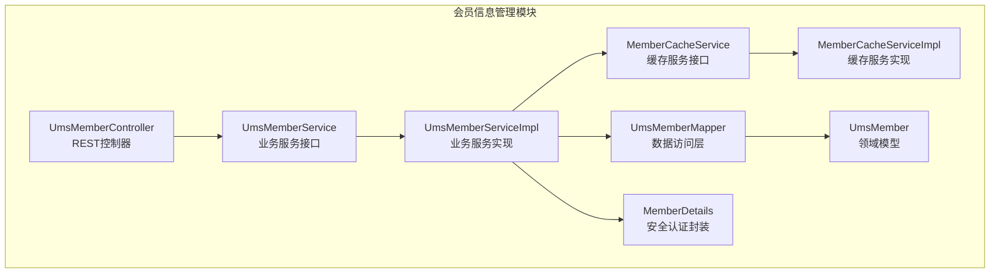
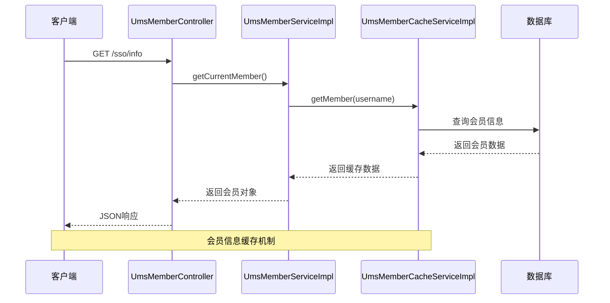
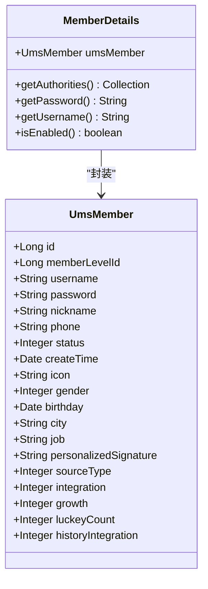
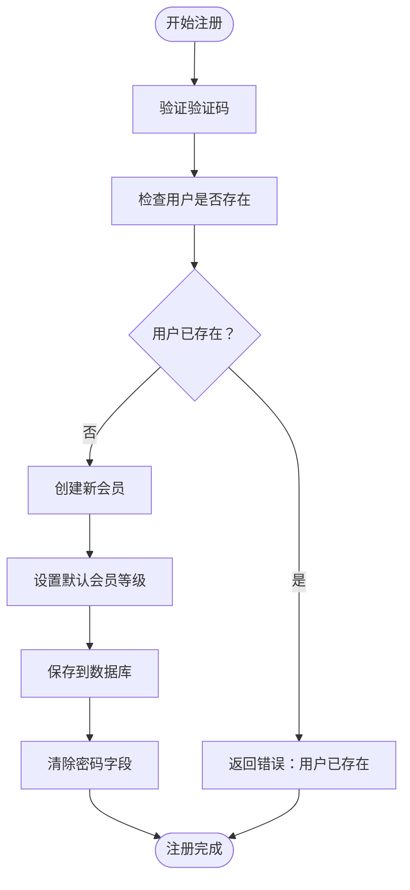
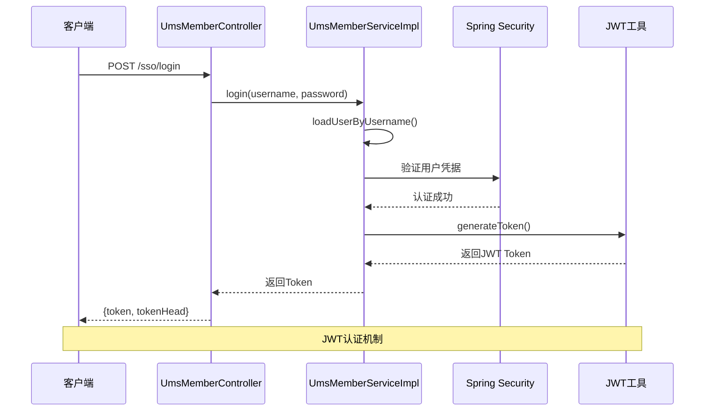
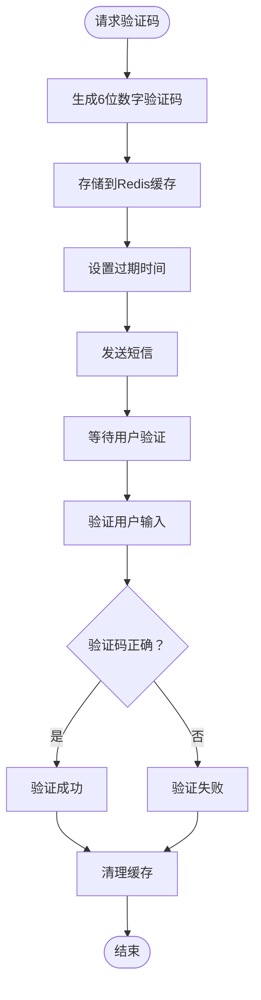
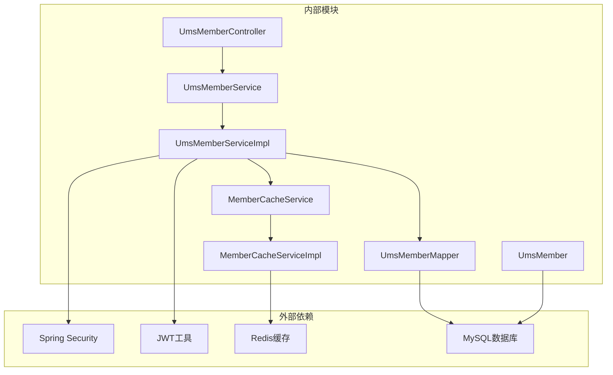

# 会员信息管理API

<cite>
**本文档引用的文件**
- [UmsMemberController.java](file://mall-portal/src/main/java/com/macro/mall/portal/controller/UmsMemberController.java)
- [UmsMemberService.java](file://mall-portal/src/main/java/com/macro/mall/portal/service/UmsMemberService.java)
- [UmsMemberServiceImpl.java](file://mall-portal/src/main/java/com/macro/mall/portal/service/impl/UmsMemberServiceImpl.java)
- [UmsMemberCacheService.java](file://mall-portal/src/main/java/com/macro/mall/portal/service/UmsMemberCacheService.java)
- [UmsMemberCacheServiceImpl.java](file://mall-portal/src/main/java/com/macro/mall/portal/service/impl/UmsMemberCacheServiceImpl.java)
- [MemberDetails.java](file://mall-portal/src/main/java/com/macro/mall/portal/domain/MemberDetails.java)
- [UmsMember.java](file://mall-mbg/src/main/java/com/macro/mall/model/UmsMember.java)
- [mall.sql](file://document/sql/mall.sql)
</cite>

## 目录
1. [简介](#简介)
2. [项目结构](#项目结构)
3. [核心组件](#核心组件)
4. [架构概览](#架构概览)
5. [详细组件分析](#详细组件分析)
6. [依赖关系分析](#依赖关系分析)
7. [性能考虑](#性能考虑)
8. [故障排除指南](#故障排除指南)
9. [结论](#结论)

## 简介
本文件为会员信息管理API的综合技术文档，涵盖会员个人信息查询、更新、头像上传、性别设置、生日管理等基础功能，以及会员等级权益查询、成长值积分管理、账户安全设置等高级功能。文档同时提供会员中心页面的数据接口调用示例，包括个人资料展示、实名认证状态、绑定手机邮箱等信息的获取和更新方法，并记录了数据验证规则、字段约束和安全检查机制。

## 项目结构
会员信息管理功能主要位于 mall-portal 模块中，采用典型的分层架构：
- 控制器层：处理HTTP请求，定义RESTful API接口
- 服务层：实现业务逻辑，包含会员注册、登录、信息管理等核心功能
- 数据访问层：通过MyBatis映射器访问数据库
- 领域模型：定义会员实体及相关数据结构
- 缓存服务：基于Redis的会员信息缓存机制



**图表来源**
- [UmsMemberController.java:1-100](file://mall-portal/src/main/java/com/macro/mall/portal/controller/UmsMemberController.java#L1-L100)
- [UmsMemberService.java:1-65](file://mall-portal/src/main/java/com/macro/mall/portal/service/UmsMemberService.java#L1-L65)
- [UmsMemberServiceImpl.java:1-197](file://mall-portal/src/main/java/com/macro/mall/portal/service/impl/UmsMemberServiceImpl.java#L1-L197)

**章节来源**
- [UmsMemberController.java:1-100](file://mall-portal/src/main/java/com/macro/mall/portal/controller/UmsMemberController.java#L1-L100)
- [UmsMemberService.java:1-65](file://mall-portal/src/main/java/com/macro/mall/portal/service/UmsMemberService.java#L1-L65)

## 核心组件
会员信息管理API的核心组件包括：

### 1. 会员控制器 (UmsMemberController)
负责处理所有会员相关的HTTP请求，提供以下接口：
- 用户注册：POST /sso/register
- 用户登录：POST /sso/login
- 获取会员信息：GET /sso/info
- 获取验证码：GET /sso/getAuthCode
- 修改密码：POST /sso/updatePassword
- 刷新Token：GET /sso/refreshToken

### 2. 会员服务接口 (UmsMemberService)
定义会员管理的核心业务方法：
- 用户注册与验证
- 密码修改与验证
- 会员信息查询
- Token生成与刷新
- 积分管理

### 3. 会员服务实现 (UmsMemberServiceImpl)
实现具体的业务逻辑，包括：
- 验证码生成与验证
- 密码加密存储
- 会员信息缓存管理
- JWT Token生成与刷新

### 4. 会员缓存服务
提供基于Redis的缓存机制：
- 会员信息缓存
- 验证码缓存
- 自动过期管理

**章节来源**
- [UmsMemberController.java:24-99](file://mall-portal/src/main/java/com/macro/mall/portal/controller/UmsMemberController.java#L24-L99)
- [UmsMemberService.java:11-64](file://mall-portal/src/main/java/com/macro/mall/portal/service/UmsMemberService.java#L11-L64)
- [UmsMemberServiceImpl.java:39-196](file://mall-portal/src/main/java/com/macro/mall/portal/service/impl/UmsMemberServiceImpl.java#L39-L196)

## 架构概览
会员信息管理采用分层架构设计，确保关注点分离和代码可维护性：



**图表来源**
- [UmsMemberController.java:59-67](file://mall-portal/src/main/java/com/macro/mall/portal/controller/UmsMemberController.java#L59-L67)
- [UmsMemberServiceImpl.java:57-75](file://mall-portal/src/main/java/com/macro/mall/portal/service/impl/UmsMemberServiceImpl.java#L57-L75)
- [UmsMemberCacheServiceImpl.java:43-52](file://mall-portal/src/main/java/com/macro/mall/portal/service/impl/UmsMemberCacheServiceImpl.java#L43-L52)

## 详细组件分析

### 1. 会员信息模型 (UmsMember)
会员实体包含完整的个人信息字段：



**图表来源**
- [UmsMember.java:6-228](file://mall-mbg/src/main/java/com/macro/mall/model/UmsMember.java#L6-L228)
- [MemberDetails.java:15-61](file://mall-portal/src/main/java/com/macro/mall/portal/domain/MemberDetails.java#L15-L61)

会员信息字段说明：
- 基本信息：用户名、密码、昵称、手机号
- 个人资料：头像、性别、生日、城市、职业
- 账户状态：状态、创建时间
- 等级权益：会员等级ID、积分、成长值
- 其他：个性化签名、来源类型等

**章节来源**
- [UmsMember.java:6-228](file://mall-mbg/src/main/java/com/macro/mall/model/UmsMember.java#L6-L228)

### 2. 会员注册流程
会员注册涉及多步骤验证和数据持久化：



**图表来源**
- [UmsMemberServiceImpl.java:77-107](file://mall-portal/src/main/java/com/macro/mall/portal/service/impl/UmsMemberServiceImpl.java#L77-L107)

注册流程的关键验证规则：
- 验证码必须正确且未过期
- 用户名和手机号唯一性检查
- 默认会员等级自动分配
- 密码使用BCrypt加密存储

**章节来源**
- [UmsMemberServiceImpl.java:77-107](file://mall-portal/src/main/java/com/macro/mall/portal/service/impl/UmsMemberServiceImpl.java#L77-L107)

### 3. 会员登录认证
登录认证采用JWT Token机制：



**图表来源**
- [UmsMemberController.java:45-57](file://mall-portal/src/main/java/com/macro/mall/portal/controller/UmsMemberController.java#L45-L57)
- [UmsMemberServiceImpl.java:164-180](file://mall-portal/src/main/java/com/macro/mall/portal/service/impl/UmsMemberServiceImpl.java#L164-L180)

登录安全机制：
- 密码使用BCrypt加密验证
- JWT Token包含用户权限信息
- 支持Token刷新机制
- 账号状态验证

**章节来源**
- [UmsMemberController.java:45-57](file://mall-portal/src/main/java/com/macro/mall/portal/controller/UmsMemberController.java#L45-L57)
- [UmsMemberServiceImpl.java:164-180](file://mall-portal/src/main/java/com/macro/mall/portal/service/impl/UmsMemberServiceImpl.java#L164-L180)

### 4. 会员信息缓存机制
系统采用Redis缓存提升性能：

```mermaid
graph LR
subgraph "缓存层"
CacheKey[Redis Key: member:{username}]
CacheData[会员缓存数据]
Expire[过期时间: 通用配置]
end
subgraph "业务层"
Service[UmsMemberServiceImpl]
CacheService[UmsMemberCacheServiceImpl]
end
subgraph "数据源"
DB[MySQL数据库]
end
Service --> CacheService
CacheService --> CacheKey
CacheKey --> CacheData
CacheData --> DB
DB --> CacheData
```

**图表来源**
- [UmsMemberCacheServiceImpl.java:43-52](file://mall-portal/src/main/java/com/macro/mall/portal/service/impl/UmsMemberCacheServiceImpl.java#L43-L52)

缓存策略：
- 会员信息缓存：用户名作为键，支持快速查询
- 验证码缓存：手机号作为键，支持短信验证
- 自动过期：不同数据设置不同的过期时间
- 缓存失效：数据更新时自动清理相关缓存

**章节来源**
- [UmsMemberCacheService.java:9-34](file://mall-portal/src/main/java/com/macro/mall/portal/service/UmsMemberCacheService.java#L9-L34)
- [UmsMemberCacheServiceImpl.java:16-67](file://mall-portal/src/main/java/com/macro/mall/portal/service/impl/UmsMemberCacheServiceImpl.java#L16-L67)

### 5. 验证码管理系统
验证码系统提供短信验证功能：



**图表来源**
- [UmsMemberServiceImpl.java:109-136](file://mall-portal/src/main/java/com/macro/mall/portal/service/impl/UmsMemberServiceImpl.java#L109-L136)
- [UmsMemberCacheServiceImpl.java:54-66](file://mall-portal/src/main/java/com/macro/mall/portal/service/impl/UmsMemberCacheServiceImpl.java#L54-L66)

验证码安全特性：
- 6位数字随机生成
- Redis缓存存储，支持过期控制
- 验证码一次性使用
- 防暴力破解机制

**章节来源**
- [UmsMemberServiceImpl.java:109-136](file://mall-portal/src/main/java/com/macro/mall/portal/service/impl/UmsMemberServiceImpl.java#L109-L136)
- [UmsMemberCacheServiceImpl.java:54-66](file://mall-portal/src/main/java/com/macro/mall/portal/service/impl/UmsMemberCacheServiceImpl.java#L54-L66)

## 依赖关系分析



**图表来源**
- [UmsMemberController.java:1-100](file://mall-portal/src/main/java/com/macro/mall/portal/controller/UmsMemberController.java#L1-L100)
- [UmsMemberServiceImpl.java:1-197](file://mall-portal/src/main/java/com/macro/mall/portal/service/impl/UmsMemberServiceImpl.java#L1-L197)

**章节来源**
- [UmsMemberController.java:1-100](file://mall-portal/src/main/java/com/macro/mall/portal/controller/UmsMemberController.java#L1-L100)
- [UmsMemberServiceImpl.java:1-197](file://mall-portal/src/main/java/com/macro/mall/portal/service/impl/UmsMemberServiceImpl.java#L1-L197)

## 性能考虑
1. **缓存优化**：会员信息采用Redis缓存，减少数据库查询压力
2. **连接池管理**：合理配置数据库连接池参数
3. **异步处理**：验证码发送等耗时操作可考虑异步处理
4. **索引优化**：对常用查询字段建立合适的数据库索引
5. **Token缓存**：JWT Token可考虑缓存以减少重复计算

## 故障排除指南

### 常见问题及解决方案

**1. 验证码错误**
- 检查验证码是否过期
- 确认手机号格式正确
- 验证Redis缓存是否正常

**2. 登录失败**
- 检查用户名密码是否正确
- 确认用户账号状态正常
- 验证密码加密方式是否匹配

**3. 会员信息查询异常**
- 检查Redis连接状态
- 验证数据库连接配置
- 确认缓存键值格式正确

**章节来源**
- [UmsMemberServiceImpl.java:187-194](file://mall-portal/src/main/java/com/macro/mall/portal/service/impl/UmsMemberServiceImpl.java#L187-L194)

## 结论
会员信息管理API采用现代化的分层架构设计，结合JWT认证、Redis缓存和Spring Security等技术，提供了完整的会员生命周期管理能力。系统具有良好的扩展性和安全性，能够满足电商场景下的会员管理需求。通过合理的缓存策略和安全机制，确保了系统的高性能和高可用性。