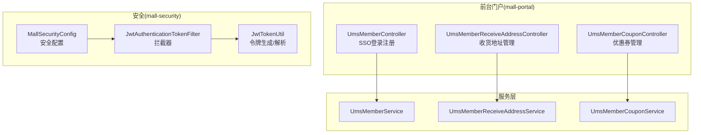
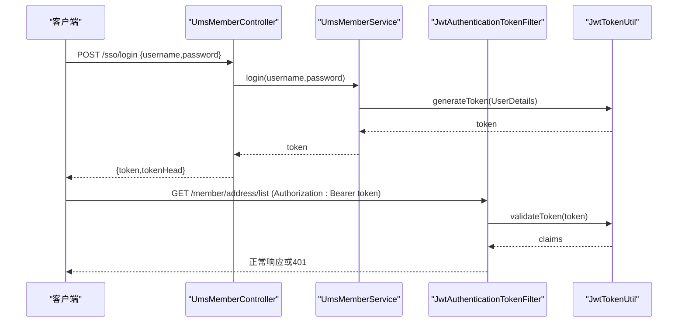
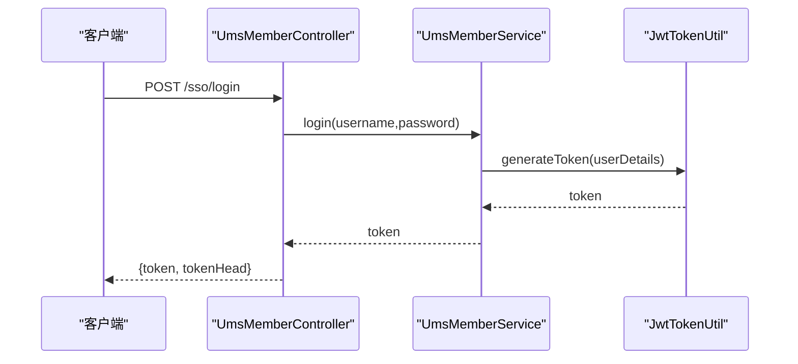
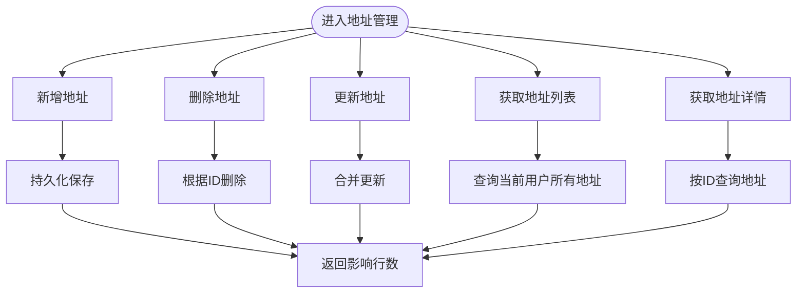
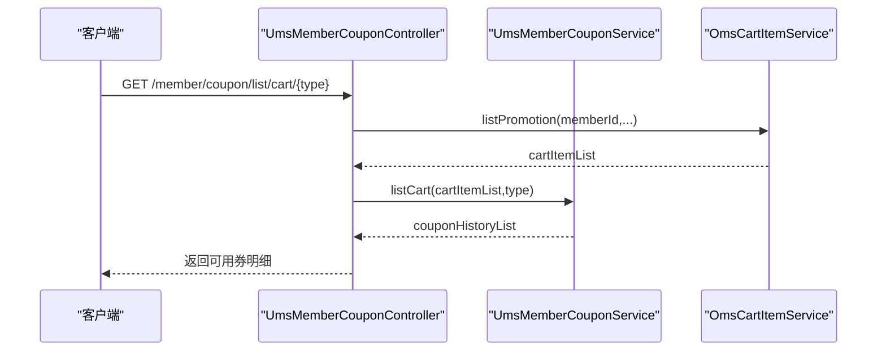
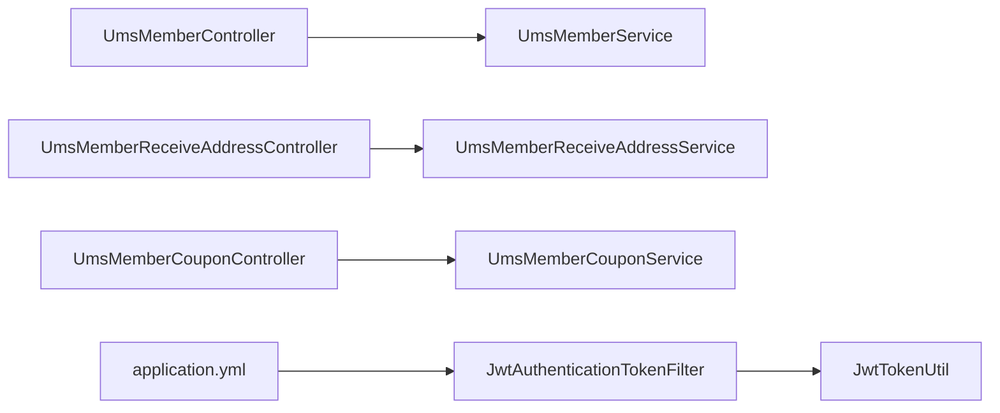

# 会员相关API

<cite>
**本文引用的文件**
- [UmsMemberController.java](file://mall-portal/src/main/java/com/macro/mall/portal/controller/UmsMemberController.java)
- [UmsMemberService.java](file://mall-portal/src/main/java/com/macro/mall/portal/service/UmsMemberService.java)
- [UmsMemberReceiveAddressController.java](file://mall-portal/src/main/java/com/macro/mall/portal/controller/UmsMemberReceiveAddressController.java)
- [UmsMemberReceiveAddressService.java](file://mall-portal/src/main/java/com/macro/mall/portal/service/UmsMemberReceiveAddressService.java)
- [UmsMemberCouponController.java](file://mall-portal/src/main/java/com/macro/mall/portal/controller/UmsMemberCouponController.java)
- [UmsMemberCouponService.java](file://mall-portal/src/main/java/com/macro/mall/portal/service/UmsMemberCouponService.java)
- [JwtTokenUtil.java](file://mall-security/src/main/java/com/macro/mall/security/util/JwtTokenUtil.java)
- [JwtAuthenticationTokenFilter.java](file://mall-security/src/main/java/com/macro/mall/security/component/JwtAuthenticationTokenFilter.java)
- [MallSecurityConfig.java](file://mall-admin/src/main/java/com/macro/mall/config/MallSecurityConfig.java)
- [application.yml](file://mall-portal/src/main/resources/application.yml)
- [mall-portal Postman 集合](file://document/postman/mall-portal.postman_collection.json)
</cite>

## 目录
1. [简介](#简介)
2. [项目结构](#项目结构)
3. [核心组件](#核心组件)
4. [架构总览](#架构总览)
5. [详细组件分析](#详细组件分析)
6. [依赖关系分析](#依赖关系分析)
7. [性能考虑](#性能考虑)
8. [故障排查指南](#故障排查指南)
9. [结论](#结论)
10. [附录](#附录)

## 简介
本文件面向会员相关API的综合文档，覆盖以下能力范围：
- 会员注册与登录、密码找回、令牌刷新
- 个人信息查询与认证流程
- 收货地址的增删改查
- 优惠券的查询、领取与使用明细
- 会员中心页面典型场景的数据接口调用示例
- 会员数据安全保护与权限控制机制说明

## 项目结构
会员相关API主要位于 mall-portal 模块，配合 mall-security 提供的JWT认证过滤与配置，以及 mall-mbg 的数据模型与映射。

**图表来源**
- [UmsMemberController.java:1-100](file://mall-portal/src/main/java/com/macro/mall/portal/controller/UmsMemberController.java#L1-L100)
- [UmsMemberReceiveAddressController.java:1-68](file://mall-portal/src/main/java/com/macro/mall/portal/controller/UmsMemberReceiveAddressController.java#L1-L68)
- [UmsMemberCouponController.java:1-69](file://mall-portal/src/main/java/com/macro/mall/portal/controller/UmsMemberCouponController.java#L1-L69)
- [JwtTokenUtil.java](file://mall-security/src/main/java/com/macro/mall/security/util/JwtTokenUtil.java)
- [JwtAuthenticationTokenFilter.java](file://mall-security/src/main/java/com/macro/mall/security/component/JwtAuthenticationTokenFilter.java)
- [MallSecurityConfig.java](file://mall-admin/src/main/java/com/macro/mall/config/MallSecurityConfig.java)

**章节来源**
- [UmsMemberController.java:1-100](file://mall-portal/src/main/java/com/macro/mall/portal/controller/UmsMemberController.java#L1-L100)
- [UmsMemberReceiveAddressController.java:1-68](file://mall-portal/src/main/java/com/macro/mall/portal/controller/UmsMemberReceiveAddressController.java#L1-L68)
- [UmsMemberCouponController.java:1-69](file://mall-portal/src/main/java/com/macro/mall/portal/controller/UmsMemberCouponController.java#L1-L69)

## 核心组件
- 会员登录注册与信息
  - 控制器：UmsMemberController
  - 服务接口：UmsMemberService
  - 关键方法：注册、登录、获取当前用户信息、获取验证码、修改密码、刷新令牌
- 收货地址管理
  - 控制器：UmsMemberReceiveAddressController
  - 服务接口：UmsMemberReceiveAddressService
  - 关键方法：新增、删除、修改、列表、详情
- 优惠券管理
  - 控制器：UmsMemberCouponController
  - 服务接口：UmsMemberCouponService
  - 关键方法：领取、历史列表、用户可用券、购物车可用券、按商品查询券

**章节来源**
- [UmsMemberController.java:1-100](file://mall-portal/src/main/java/com/macro/mall/portal/controller/UmsMemberController.java#L1-L100)
- [UmsMemberService.java:1-65](file://mall-portal/src/main/java/com/macro/mall/portal/service/UmsMemberService.java#L1-L65)
- [UmsMemberReceiveAddressController.java:1-68](file://mall-portal/src/main/java/com/macro/mall/portal/controller/UmsMemberReceiveAddressController.java#L1-L68)
- [UmsMemberReceiveAddressService.java:1-43](file://mall-portal/src/main/java/com/macro/mall/portal/service/UmsMemberReceiveAddressService.java#L1-L43)
- [UmsMemberCouponController.java:1-69](file://mall-portal/src/main/java/com/macro/mall/portal/controller/UmsMemberCouponController.java#L1-L69)
- [UmsMemberCouponService.java:1-42](file://mall-portal/src/main/java/com/macro/mall/portal/service/UmsMemberCouponService.java#L1-L42)

## 架构总览
会员相关API遵循“控制器-服务-安全过滤器-令牌工具”的分层架构。登录成功后返回JWT令牌，后续请求通过请求头携带令牌进行认证。

**图表来源**
- [UmsMemberController.java:45-57](file://mall-portal/src/main/java/com/macro/mall/portal/controller/UmsMemberController.java#L45-L57)
- [UmsMemberService.java:55-63](file://mall-portal/src/main/java/com/macro/mall/portal/service/UmsMemberService.java#L55-L63)
- [JwtAuthenticationTokenFilter.java](file://mall-security/src/main/java/com/macro/mall/security/component/JwtAuthenticationTokenFilter.java)
- [JwtTokenUtil.java](file://mall-security/src/main/java/com/macro/mall/security/util/JwtTokenUtil.java)

## 详细组件分析

### 会员登录注册与信息接口
- 接口定义
  - 注册：POST /sso/register
  - 登录：POST /sso/login
  - 获取当前用户：GET /sso/info
  - 获取验证码：GET /sso/getAuthCode
  - 修改密码：POST /sso/updatePassword
  - 刷新令牌：GET /sso/refreshToken
- 请求参数与返回
  - 登录成功返回token与tokenHead；失败返回校验失败消息
  - 获取当前用户在未认证时返回401
  - 刷新令牌在token过期时返回失败消息
- 安全要点
  - 密码在服务端进行匹配验证
  - 令牌生成与校验由JwtTokenUtil负责
  - 请求头需携带令牌以通过JwtAuthenticationTokenFilter

**图表来源**
- [UmsMemberController.java:45-57](file://mall-portal/src/main/java/com/macro/mall/portal/controller/UmsMemberController.java#L45-L57)
- [UmsMemberService.java:55-63](file://mall-portal/src/main/java/com/macro/mall/portal/service/UmsMemberService.java#L55-L63)
- [JwtTokenUtil.java](file://mall-security/src/main/java/com/macro/mall/security/util/JwtTokenUtil.java)

**章节来源**
- [UmsMemberController.java:35-99](file://mall-portal/src/main/java/com/macro/mall/portal/controller/UmsMemberController.java#L35-L99)
- [UmsMemberService.java:22-63](file://mall-portal/src/main/java/com/macro/mall/portal/service/UmsMemberService.java#L22-L63)

### 收货地址管理接口
- 接口定义
  - 新增：POST /member/address/add
  - 删除：POST /member/address/delete/{id}
  - 更新：POST /member/address/update/{id}
  - 列表：GET /member/address/list
  - 详情：GET /member/address/{id}
- 请求参数与返回
  - 新增/更新/删除返回受影响行数
  - 列表返回地址集合
  - 详情返回单个地址对象
- 权限控制
  - 通过JWT过滤器确保已登录用户可访问

**图表来源**
- [UmsMemberReceiveAddressController.java:24-66](file://mall-portal/src/main/java/com/macro/mall/portal/controller/UmsMemberReceiveAddressController.java#L24-L66)
- [UmsMemberReceiveAddressService.java:14-41](file://mall-portal/src/main/java/com/macro/mall/portal/service/UmsMemberReceiveAddressService.java#L14-L41)

**章节来源**
- [UmsMemberReceiveAddressController.java:1-68](file://mall-portal/src/main/java/com/macro/mall/portal/controller/UmsMemberReceiveAddressController.java#L1-L68)
- [UmsMemberReceiveAddressService.java:1-43](file://mall-portal/src/main/java/com/macro/mall/portal/service/UmsMemberReceiveAddressService.java#L1-L43)

### 优惠券管理接口
- 接口定义
  - 领取：POST /member/coupon/add/{couponId}
  - 历史列表：GET /member/coupon/listHistory
  - 用户券列表：GET /member/coupon/list
  - 购物车可用券：GET /member/coupon/list/cart/{type}
  - 按商品查询券：GET /member/coupon/listByProduct/{productId}
- 请求参数与返回
  - 领取成功返回成功消息
  - 列表接口支持useStatus筛选
  - 购物车可用券结合购物车促销计算
- 业务要点
  - 领取逻辑在服务层执行事务
  - 历史与可用券分别对应不同维度的数据聚合

**图表来源**
- [UmsMemberCouponController.java:54-60](file://mall-portal/src/main/java/com/macro/mall/portal/controller/UmsMemberCouponController.java#L54-L60)
- [UmsMemberCouponService.java:28-30](file://mall-portal/src/main/java/com/macro/mall/portal/service/UmsMemberCouponService.java#L28-L30)

**章节来源**
- [UmsMemberCouponController.java:1-69](file://mall-portal/src/main/java/com/macro/mall/portal/controller/UmsMemberCouponController.java#L1-L69)
- [UmsMemberCouponService.java:1-42](file://mall-portal/src/main/java/com/macro/mall/portal/service/UmsMemberCouponService.java#L1-L42)

### 会员中心页面数据接口调用示例
以下为常见会员中心场景的接口调用路径（以路径为主，不含具体代码）：
- 个人资料展示
  - GET /sso/info
- 历史订单查询
  - GET /order/list（假设存在）
- 收藏夹管理
  - GET /favorite/list（假设存在）
  - POST /favorite/add（假设存在）
  - POST /favorite/remove（假设存在）
- 优惠券中心
  - GET /member/coupon/list
  - GET /member/coupon/listHistory
  - POST /member/coupon/add/{couponId}
- 收货地址管理
  - GET /member/address/list
  - GET /member/address/{id}
  - POST /member/address/add
  - POST /member/address/update/{id}
  - POST /member/address/delete/{id}

说明：
- 所有需要认证的接口均需在请求头携带 Authorization: Bearer {token}
- tokenHead与tokenHeader来源于配置，用于标识令牌前缀

**章节来源**
- [UmsMemberController.java:59-67](file://mall-portal/src/main/java/com/macro/mall/portal/controller/UmsMemberController.java#L59-L67)
- [UmsMemberReceiveAddressController.java:54-66](file://mall-portal/src/main/java/com/macro/mall/portal/controller/UmsMemberReceiveAddressController.java#L54-L66)
- [UmsMemberCouponController.java:33-67](file://mall-portal/src/main/java/com/macro/mall/portal/controller/UmsMemberCouponController.java#L33-L67)

## 依赖关系分析
- 控制器依赖服务接口，服务接口依赖数据访问与工具类
- 安全过滤器依赖JWT工具进行令牌校验
- 配置文件提供JWT相关属性

**图表来源**
- [UmsMemberController.java:1-100](file://mall-portal/src/main/java/com/macro/mall/portal/controller/UmsMemberController.java#L1-L100)
- [UmsMemberReceiveAddressController.java:1-68](file://mall-portal/src/main/java/com/macro/mall/portal/controller/UmsMemberReceiveAddressController.java#L1-L68)
- [UmsMemberCouponController.java:1-69](file://mall-portal/src/main/java/com/macro/mall/portal/controller/UmsMemberCouponController.java#L1-L69)
- [JwtAuthenticationTokenFilter.java](file://mall-security/src/main/java/com/macro/mall/security/component/JwtAuthenticationTokenFilter.java)
- [JwtTokenUtil.java](file://mall-security/src/main/java/com/macro/mall/security/util/JwtTokenUtil.java)
- [application.yml](file://mall-portal/src/main/resources/application.yml)

**章节来源**
- [JwtAuthenticationTokenFilter.java](file://mall-security/src/main/java/com/macro/mall/security/component/JwtAuthenticationTokenFilter.java)
- [application.yml](file://mall-portal/src/main/resources/application.yml)

## 性能考虑
- 令牌缓存与校验
  - 建议在Redis中缓存近期活跃令牌，避免频繁解析
- 分页与筛选
  - 列表接口建议增加分页参数，避免一次性返回大量数据
- 事务边界
  - 领取优惠券等写操作应保持事务一致性，减少并发冲突
- 缓存策略
  - 当前用户信息可在会话或缓存中短期缓存，降低数据库压力

## 故障排查指南
- 401 未认证
  - 检查请求头是否包含正确的Authorization: Bearer token
  - 确认tokenHead与tokenHeader配置一致
- 登录失败
  - 核对用户名/密码是否正确
  - 检查密码编码匹配逻辑
- 令牌过期
  - 使用刷新接口获取新令牌
- 接口无响应或超时
  - 检查服务健康状态与数据库连接
  - 查看安全过滤器是否正确放行

**章节来源**
- [UmsMemberController.java:86-98](file://mall-portal/src/main/java/com/macro/mall/portal/controller/UmsMemberController.java#L86-L98)
- [JwtAuthenticationTokenFilter.java](file://mall-security/src/main/java/com/macro/mall/security/component/JwtAuthenticationTokenFilter.java)

## 结论
本文档梳理了会员相关API的功能边界、接口规范与安全机制，明确了登录认证、地址管理、优惠券管理等核心能力的调用方式与注意事项。建议在实际集成时严格遵循令牌传递规范与权限控制策略，确保接口安全与性能。

## 附录

### JWT配置与使用说明
- 配置项
  - jwt.tokenHeader：请求头名称
  - jwt.tokenHead：令牌前缀标识
- 使用方式
  - 登录成功后返回token与tokenHead
  - 后续请求在Authorization头中使用Bearer {token}
- 刷新机制
  - 通过刷新接口获取新的token

**章节来源**
- [UmsMemberController.java:28-31](file://mall-portal/src/main/java/com/macro/mall/portal/controller/UmsMemberController.java#L28-L31)
- [UmsMemberController.java:86-98](file://mall-portal/src/main/java/com/macro/mall/portal/controller/UmsMemberController.java#L86-L98)
- [application.yml](file://mall-portal/src/main/resources/application.yml)

### Postman 集合参考
- 前台门户接口集合可用于快速验证各接口行为
- 建议先执行登录获取token，再调用受保护接口

**章节来源**
- [mall-portal Postman 集合](file://document/postman/mall-portal.postman_collection.json)