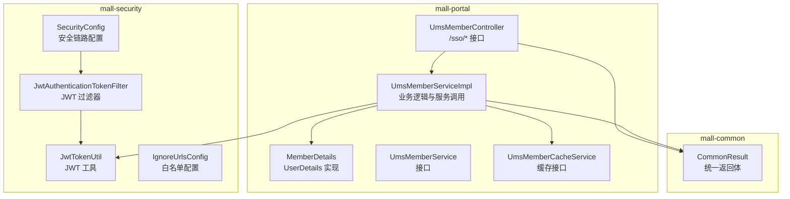
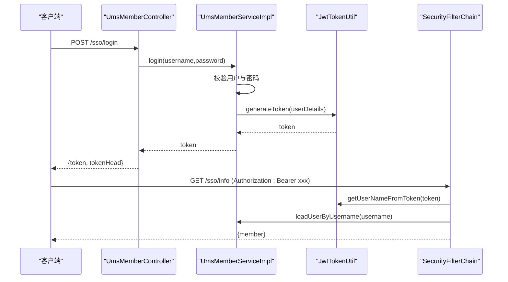
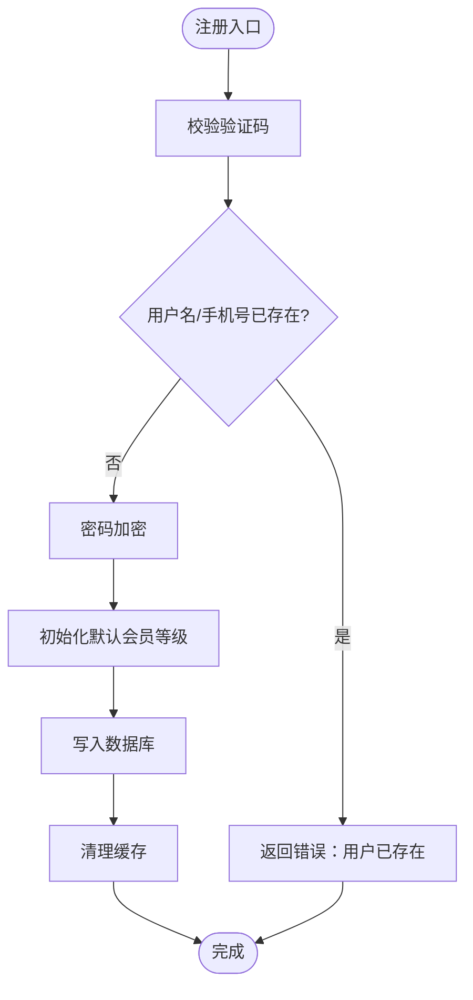
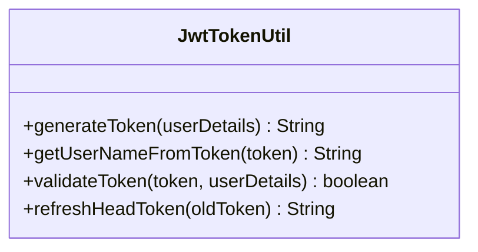
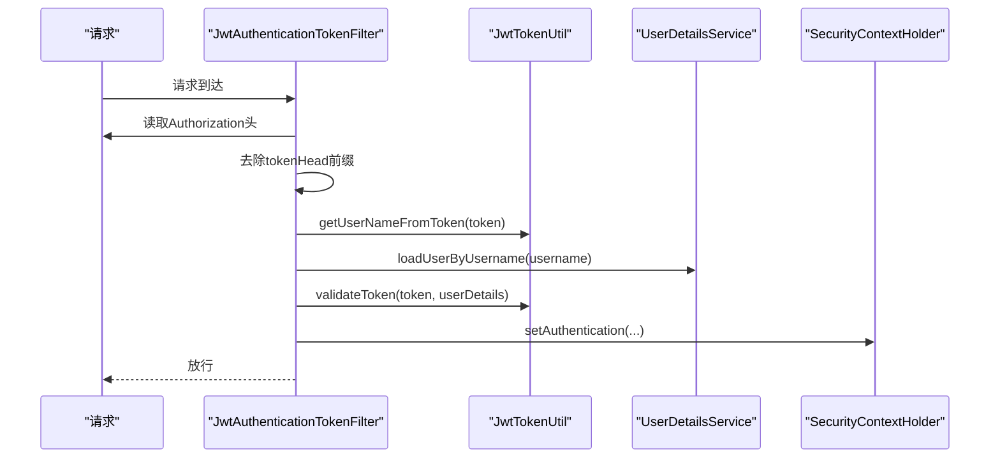
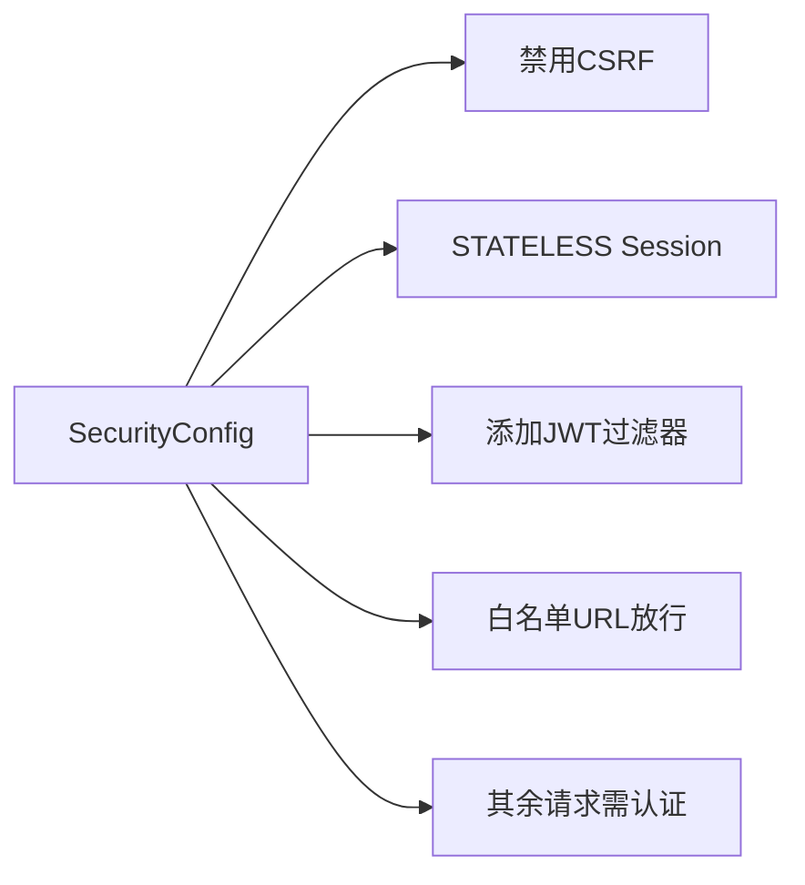
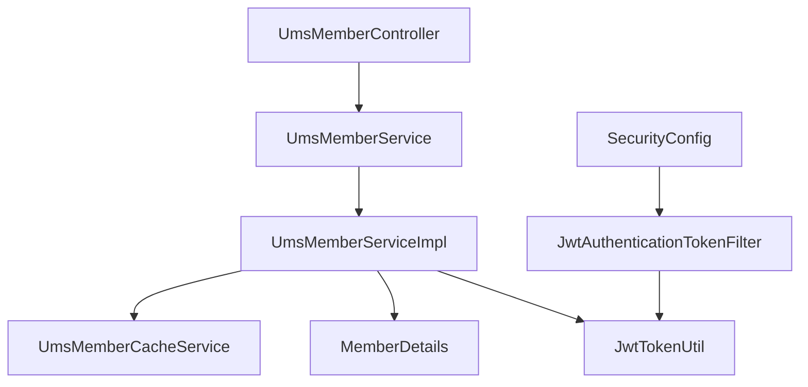

# 会员认证API

<cite>
**本文引用的文件**
- [UmsMemberController.java](file://mall-portal/src/main/java/com/macro/mall/portal/controller/UmsMemberController.java)
- [UmsMemberServiceImpl.java](file://mall-portal/src/main/java/com/macro/mall/portal/service/impl/UmsMemberServiceImpl.java)
- [UmsMemberService.java](file://mall-portal/src/main/java/com/macro/mall/portal/service/UmsMemberService.java)
- [JwtTokenUtil.java](file://mall-security/src/main/java/com/macro/mall/security/util/JwtTokenUtil.java)
- [JwtAuthenticationTokenFilter.java](file://mall-security/src/main/java/com/macro/mall/security/component/JwtAuthenticationTokenFilter.java)
- [SecurityConfig.java](file://mall-security/src/main/java/com/macro/mall/security/config/SecurityConfig.java)
- [application.yml](file://mall-portal/src/main/resources/application.yml)
- [CommonResult.java](file://mall-common/src/main/java/com/macro/mall/common/api/CommonResult.java)
- [MemberDetails.java](file://mall-portal/src/main/java/com/macro/mall/portal/domain/MemberDetails.java)
- [UmsMemberCacheService.java](file://mall-portal/src/main/java/com/macro/mall/portal/service/UmsMemberCacheService.java)
- [IgnoreUrlsConfig.java](file://mall-security/src/main/java/com/macro/mall/security/config/IgnoreUrlsConfig.java)
</cite>

## 目录
1. [简介](#简介)
2. [项目结构](#项目结构)
3. [核心组件](#核心组件)
4. [架构总览](#架构总览)
5. [详细组件分析](#详细组件分析)
6. [依赖分析](#依赖分析)
7. [性能考虑](#性能考虑)
8. [故障排查指南](#故障排查指南)
9. [结论](#结论)
10. [附录](#附录)

## 简介
本文件面向会员认证API的使用者与维护者，系统性梳理会员注册、登录、退出登录、密码修改、验证码获取、令牌刷新等认证相关接口。重点说明JWT令牌的生成、验证、刷新机制，以及tokenHeader与tokenHead的配置与使用方式；覆盖注册流程中的手机号与用户名重复校验、密码加密存储、用户状态管理；提供接口调用示例（请求参数、响应格式、错误处理）；解释认证中间件工作原理与安全防护措施。

## 项目结构
会员认证功能主要分布在以下模块与包中：
- mall-portal：会员认证控制器、服务实现、领域模型与配置
- mall-security：安全配置、JWT工具与过滤器
- mall-common：统一返回体封装

图表来源
- [UmsMemberController.java:1-100](file://mall-portal/src/main/java/com/macro/mall/portal/controller/UmsMemberController.java#L1-L100)
- [UmsMemberServiceImpl.java:1-197](file://mall-portal/src/main/java/com/macro/mall/portal/service/impl/UmsMemberServiceImpl.java#L1-L197)
- [MemberDetails.java:1-62](file://mall-portal/src/main/java/com/macro/mall/portal/domain/MemberDetails.java#L1-L62)
- [UmsMemberService.java:1-65](file://mall-portal/src/main/java/com/macro/mall/portal/service/UmsMemberService.java#L1-L65)
- [UmsMemberCacheService.java:1-35](file://mall-portal/src/main/java/com/macro/mall/portal/service/UmsMemberCacheService.java#L1-L35)
- [JwtTokenUtil.java:1-182](file://mall-security/src/main/java/com/macro/mall/security/util/JwtTokenUtil.java#L1-L182)
- [JwtAuthenticationTokenFilter.java:1-58](file://mall-security/src/main/java/com/macro/mall/security/component/JwtAuthenticationTokenFilter.java#L1-L58)
- [SecurityConfig.java:1-70](file://mall-security/src/main/java/com/macro/mall/security/config/SecurityConfig.java#L1-L70)
- [IgnoreUrlsConfig.java:1-22](file://mall-security/src/main/java/com/macro/mall/security/config/IgnoreUrlsConfig.java#L1-L22)
- [CommonResult.java:1-134](file://mall-common/src/main/java/com/macro/mall/common/api/CommonResult.java#L1-L134)

章节来源
- [UmsMemberController.java:1-100](file://mall-portal/src/main/java/com/macro/mall/portal/controller/UmsMemberController.java#L1-L100)
- [UmsMemberServiceImpl.java:1-197](file://mall-portal/src/main/java/com/macro/mall/portal/service/impl/UmsMemberServiceImpl.java#L1-L197)
- [application.yml:1-64](file://mall-portal/src/main/resources/application.yml#L1-L64)

## 核心组件
- 会员认证控制器：提供注册、登录、获取用户信息、获取验证码、修改密码、刷新令牌等接口，均位于“/sso”路径下。
- 会员认证服务：实现注册、登录、密码修改、验证码生成与校验、当前用户查询、令牌刷新等业务逻辑。
- JWT工具：负责令牌生成、解析、校验、过期判断与刷新。
- 认证过滤器：从请求头读取令牌，解析用户信息并注入Spring Security上下文。
- 安全配置：禁用CSRF与Session，启用无状态JWT认证，配置白名单与异常处理器。
- 统一返回体：规范所有接口的响应结构。

章节来源
- [UmsMemberController.java:24-100](file://mall-portal/src/main/java/com/macro/mall/portal/controller/UmsMemberController.java#L24-L100)
- [UmsMemberServiceImpl.java:39-197](file://mall-portal/src/main/java/com/macro/mall/portal/service/impl/UmsMemberServiceImpl.java#L39-L197)
- [JwtTokenUtil.java:31-182](file://mall-security/src/main/java/com/macro/mall/security/util/JwtTokenUtil.java#L31-L182)
- [JwtAuthenticationTokenFilter.java:25-58](file://mall-security/src/main/java/com/macro/mall/security/component/JwtAuthenticationTokenFilter.java#L25-L58)
- [SecurityConfig.java:23-70](file://mall-security/src/main/java/com/macro/mall/security/config/SecurityConfig.java#L23-L70)
- [CommonResult.java:7-134](file://mall-common/src/main/java/com/macro/mall/common/api/CommonResult.java#L7-L134)

## 架构总览
会员认证采用前后端分离的无状态JWT方案：
- 客户端通过HTTP Basic或表单提交用户名/密码进行登录，服务端签发JWT。
- 后续请求携带Authorization头（值为tokenHead + token），由过滤器解析并鉴权。
- 白名单路径无需认证；除白名单外的所有请求均需认证。
- 密码在服务端以BCrypt等安全算法加密存储；验证码通过缓存短期保存并校验。

图表来源
- [UmsMemberController.java:45-67](file://mall-portal/src/main/java/com/macro/mall/portal/controller/UmsMemberController.java#L45-L67)
- [UmsMemberServiceImpl.java:165-180](file://mall-portal/src/main/java/com/macro/mall/portal/service/impl/UmsMemberServiceImpl.java#L165-L180)
- [JwtTokenUtil.java:87-133](file://mall-security/src/main/java/com/macro/mall/security/util/JwtTokenUtil.java#L87-L133)
- [JwtAuthenticationTokenFilter.java:36-56](file://mall-security/src/main/java/com/macro/mall/security/component/JwtAuthenticationTokenFilter.java#L36-L56)
- [SecurityConfig.java:38-67](file://mall-security/src/main/java/com/macro/mall/security/config/SecurityConfig.java#L38-L67)

## 详细组件分析

### 1) 会员认证控制器（UmsMemberController）
- 路径前缀：/sso
- 主要接口：
  - POST /sso/register：注册
  - POST /sso/login：登录获取token
  - GET /sso/info：获取当前登录会员信息
  - GET /sso/getAuthCode：发送短信验证码（基于手机号）
  - POST /sso/updatePassword：通过验证码修改密码
  - GET /sso/refreshToken：刷新token
- 请求头与令牌：
  - 登录成功返回token与tokenHead，客户端后续请求需将token拼接在tokenHead之后放入Authorization请求头。
  - 刷新token时，从Authorization头读取旧token并返回新token。

章节来源
- [UmsMemberController.java:26-99](file://mall-portal/src/main/java/com/macro/mall/portal/controller/UmsMemberController.java#L26-L99)

### 2) 会员认证服务（UmsMemberServiceImpl）
- 注册流程要点：
  - 验证验证码（从缓存读取并比对）
  - 校验用户名与手机号唯一性
  - 使用密码编码器加密密码
  - 初始化默认会员等级与状态
  - 写入数据库并清理缓存
- 登录流程要点：
  - 加载用户详情，校验密码
  - 生成JWT令牌
- 密码修改流程要点：
  - 根据手机号查询用户
  - 验证验证码
  - 加密新密码并更新
- 令牌刷新：
  - 从旧token中去除tokenHead，校验格式与有效期，支持在一定时间窗口内刷新
- 缓存策略：
  - 验证码缓存带过期时间
  - 会员信息缓存提升查询性能

图表来源
- [UmsMemberServiceImpl.java:78-107](file://mall-portal/src/main/java/com/macro/mall/portal/service/impl/UmsMemberServiceImpl.java#L78-L107)

章节来源
- [UmsMemberServiceImpl.java:77-136](file://mall-portal/src/main/java/com/macro/mall/portal/service/impl/UmsMemberServiceImpl.java#L77-L136)

### 3) JWT工具（JwtTokenUtil）
- 关键能力：
  - 生成token：包含用户名与创建时间，按配置过期时间计算过期时间
  - 解析与校验：从token提取负载，校验用户名与过期时间
  - 刷新token：在未过期前提下，支持刷新并更新创建时间
- 配置项：
  - secret：签名密钥
  - expiration：过期时间（秒）
  - tokenHead：令牌前缀（用于从请求头剥离）

图表来源
- [JwtTokenUtil.java:31-182](file://mall-security/src/main/java/com/macro/mall/security/util/JwtTokenUtil.java#L31-L182)

章节来源
- [JwtTokenUtil.java:35-182](file://mall-security/src/main/java/com/macro/mall/security/util/JwtTokenUtil.java#L35-L182)

### 4) 认证过滤器（JwtAuthenticationTokenFilter）
- 工作流程：
  - 从请求头读取Authorization
  - 去除tokenHead前缀得到token
  - 从token解析用户名
  - 若上下文无认证且用户存在，则加载UserDetails并注入SecurityContext
- 配置项：
  - tokenHeader：请求头名称（默认Authorization）
  - tokenHead：令牌前缀（默认Bearer ）

图表来源
- [JwtAuthenticationTokenFilter.java:36-56](file://mall-security/src/main/java/com/macro/mall/security/component/JwtAuthenticationTokenFilter.java#L36-L56)
- [JwtTokenUtil.java:87-107](file://mall-security/src/main/java/com/macro/mall/security/util/JwtTokenUtil.java#L87-L107)

章节来源
- [JwtAuthenticationTokenFilter.java:25-58](file://mall-security/src/main/java/com/macro/mall/security/component/JwtAuthenticationTokenFilter.java#L25-L58)

### 5) 安全配置（SecurityConfig）
- 关键点：
  - 禁用CSRF与Session，启用STATELESS
  - 添加JWT过滤器到过滤链
  - 允许OPTIONS预检请求
  - 白名单URL放行
  - 动态权限过滤器可选接入

图表来源
- [SecurityConfig.java:38-67](file://mall-security/src/main/java/com/macro/mall/security/config/SecurityConfig.java#L38-L67)
- [IgnoreUrlsConfig.java:14-22](file://mall-security/src/main/java/com/macro/mall/security/config/IgnoreUrlsConfig.java#L14-L22)

章节来源
- [SecurityConfig.java:23-70](file://mall-security/src/main/java/com/macro/mall/security/config/SecurityConfig.java#L23-L70)
- [IgnoreUrlsConfig.java:14-22](file://mall-security/src/main/java/com/macro/mall/security/config/IgnoreUrlsConfig.java#L14-L22)

### 6) 统一返回体（CommonResult）
- 所有接口返回统一结构，包含code、message、data三部分，便于前端统一处理。
- 常见状态：
  - 成功：SUCCESS
  - 失败：FAILED
  - 参数校验失败：VALIDATE_FAILED
  - 未登录：UNAUTHORIZED
  - 未授权：FORBIDDEN

章节来源
- [CommonResult.java:7-134](file://mall-common/src/main/java/com/macro/mall/common/api/CommonResult.java#L7-L134)

## 依赖分析
- 控制器依赖服务接口与统一返回体
- 服务实现依赖密码编码器、JWT工具、Mapper与缓存服务
- 过滤器依赖JWT工具与UserDetailsService
- 安全配置依赖过滤器、白名单配置与异常处理器

图表来源
- [UmsMemberController.java:32-33](file://mall-portal/src/main/java/com/macro/mall/portal/controller/UmsMemberController.java#L32-L33)
- [UmsMemberServiceImpl.java:42-51](file://mall-portal/src/main/java/com/macro/mall/portal/service/impl/UmsMemberServiceImpl.java#L42-L51)
- [JwtAuthenticationTokenFilter.java:27-34](file://mall-security/src/main/java/com/macro/mall/security/component/JwtAuthenticationTokenFilter.java#L27-L34)
- [SecurityConfig.java:32-36](file://mall-security/src/main/java/com/macro/mall/security/config/SecurityConfig.java#L32-L36)

章节来源
- [UmsMemberController.java:32-33](file://mall-portal/src/main/java/com/macro/mall/portal/controller/UmsMemberController.java#L32-L33)
- [UmsMemberServiceImpl.java:42-51](file://mall-portal/src/main/java/com/macro/mall/portal/service/impl/UmsMemberServiceImpl.java#L42-L51)
- [JwtAuthenticationTokenFilter.java:27-34](file://mall-security/src/main/java/com/macro/mall/security/component/JwtAuthenticationTokenFilter.java#L27-L34)
- [SecurityConfig.java:32-36](file://mall-security/src/main/java/com/macro/mall/security/config/SecurityConfig.java#L32-L36)

## 性能考虑
- 缓存优化：验证码与会员信息缓存减少数据库压力，注意合理设置过期时间。
- 无状态设计：避免Session带来的扩展性问题，适合分布式部署。
- 密码加密：使用强哈希算法（如BCrypt）存储密码，降低泄露风险。
- 过滤器链：仅在必要处进行校验，白名单放行减少开销。

## 故障排查指南
- 登录失败
  - 可能原因：用户名不存在、密码不匹配、账户被禁用
  - 排查步骤：确认用户名与密码、检查MemberDetails的isEnabled状态
- 令牌无效
  - 可能原因：tokenHead不匹配、token已过期、签名不一致
  - 排查步骤：确认Authorization头格式、检查tokenHead配置、核对secret与expiration
- 刷新失败
  - 可能原因：旧token已过期、token格式不正确
  - 排查步骤：确认旧token未过期、确保去除tokenHead后再传给刷新接口
- 验证码错误
  - 可能原因：验证码过期或不一致
  - 排查步骤：确认缓存key与过期时间配置

章节来源
- [UmsMemberServiceImpl.java:165-180](file://mall-portal/src/main/java/com/macro/mall/portal/service/impl/UmsMemberServiceImpl.java#L165-L180)
- [JwtTokenUtil.java:104-107](file://mall-security/src/main/java/com/macro/mall/security/util/JwtTokenUtil.java#L104-L107)
- [application.yml:15-19](file://mall-portal/src/main/resources/application.yml#L15-L19)

## 结论
本认证体系以JWT为核心，结合Spring Security实现无状态认证；通过白名单与过滤器链保障安全与性能。注册流程严格校验验证码与用户唯一性，密码加密存储，用户状态参与鉴权；登录、刷新、修改密码等接口均提供清晰的请求与响应约定，配合统一返回体便于前端集成与调试。

## 附录

### A. 接口定义与调用示例

- 注册
  - 方法与路径：POST /sso/register
  - 请求参数：
    - username：用户名
    - password：明文密码（客户端应加密传输）
    - telephone：手机号
    - authCode：验证码
  - 返回示例：
    - 成功：{code: 成功码, message: "注册成功", data: null}
    - 失败：{code: 错误码, message: "错误信息", data: null}
  - 注意：注册成功后不会自动返回token，需另行登录获取

- 登录
  - 方法与路径：POST /sso/login
  - 请求参数：
    - username：用户名
    - password：明文密码（客户端应加密传输）
  - 返回示例：
    - 成功：{code: 成功码, message: "成功", data: {token: "xxx", tokenHead: "Bearer "}}
    - 失败：{code: 验证码错误码, message: "用户名或密码错误", data: null}

- 获取验证码
  - 方法与路径：GET /sso/getAuthCode
  - 请求参数：
    - telephone：手机号
  - 返回示例：
    - 成功：{code: 成功码, message: "获取验证码成功", data: "123456"}

- 修改密码
  - 方法与路径：POST /sso/updatePassword
  - 请求参数：
    - telephone：手机号
    - password：新密码（客户端应加密传输）
    - authCode：验证码
  - 返回示例：
    - 成功：{code: 成功码, message: "密码修改成功", data: null}
    - 失败：{code: 错误码, message: "错误信息", data: null}

- 获取当前用户信息
  - 方法与路径：GET /sso/info
  - 请求头：
    - Authorization: Bearer {token}
  - 返回示例：
    - 成功：{code: 成功码, message: "成功", data: {member对象}}
    - 未登录：{code: 未登录码, message: "未登录", data: null}

- 刷新令牌
  - 方法与路径：GET /sso/refreshToken
  - 请求头：
    - Authorization: Bearer {token}
  - 返回示例：
    - 成功：{code: 成功码, message: "成功", data: {token: "newToken", tokenHead: "Bearer "}}
    - 失败：{code: 失败码, message: "token已经过期！", data: null}

章节来源
- [UmsMemberController.java:35-99](file://mall-portal/src/main/java/com/macro/mall/portal/controller/UmsMemberController.java#L35-L99)
- [CommonResult.java:35-101](file://mall-common/src/main/java/com/macro/mall/common/api/CommonResult.java#L35-L101)

### B. JWT配置说明
- tokenHeader：请求头名称，默认"Authorization"
- tokenHead：令牌前缀，默认"Bear "
- secret：JWT签名密钥
- expiration：过期时间（秒），默认604800（7天）
- 白名单：secure.ignored.urls 下的路径无需认证

章节来源
- [application.yml:15-42](file://mall-portal/src/main/resources/application.yml#L15-L42)
- [JwtAuthenticationTokenFilter.java:31-34](file://mall-security/src/main/java/com/macro/mall/security/component/JwtAuthenticationTokenFilter.java#L31-L34)
- [JwtTokenUtil.java:35-40](file://mall-security/src/main/java/com/macro/mall/security/util/JwtTokenUtil.java#L35-L40)

### C. 用户状态与权限
- 用户状态参与鉴权：MemberDetails.isEnabled根据会员状态决定是否允许登录
- 权限：当前实现返回固定权限，实际项目可根据角色扩展

章节来源
- [MemberDetails.java:54-56](file://mall-portal/src/main/java/com/macro/mall/portal/domain/MemberDetails.java#L54-L56)