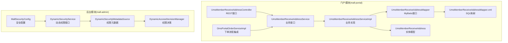
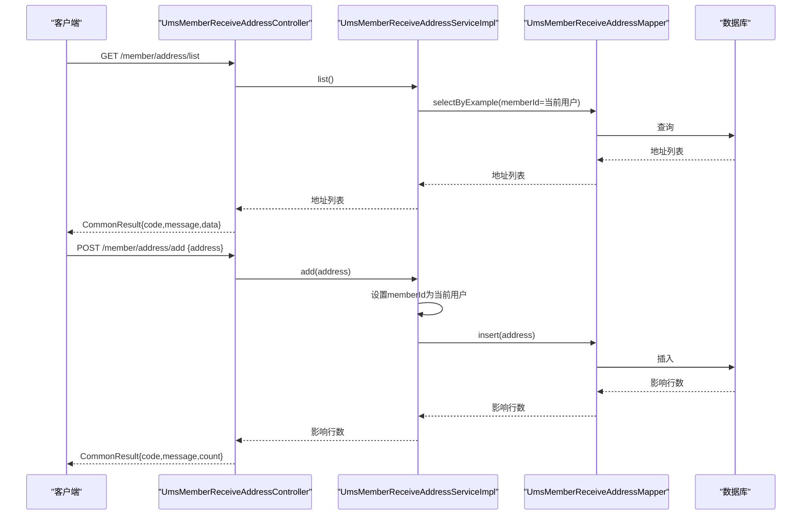
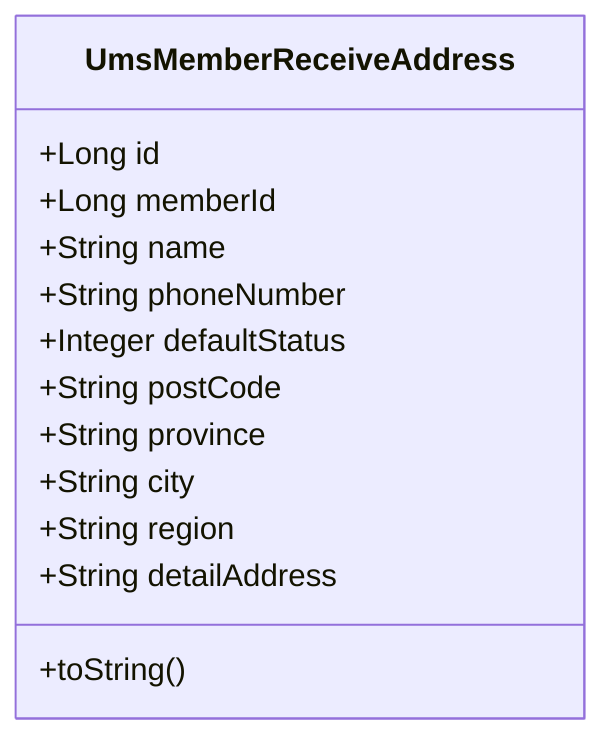
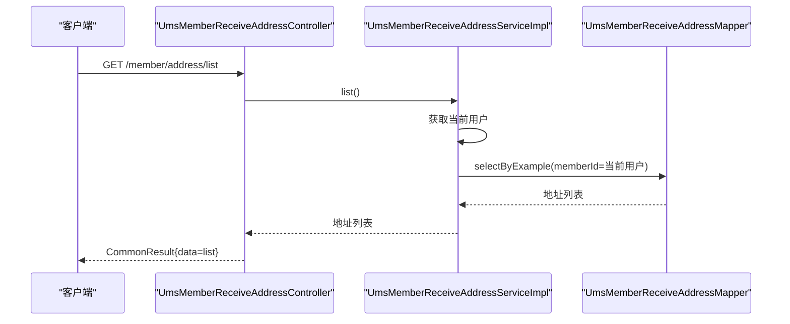
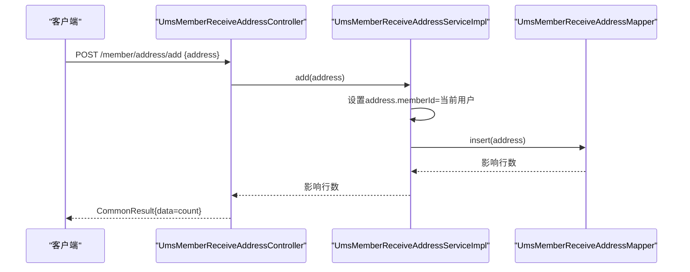
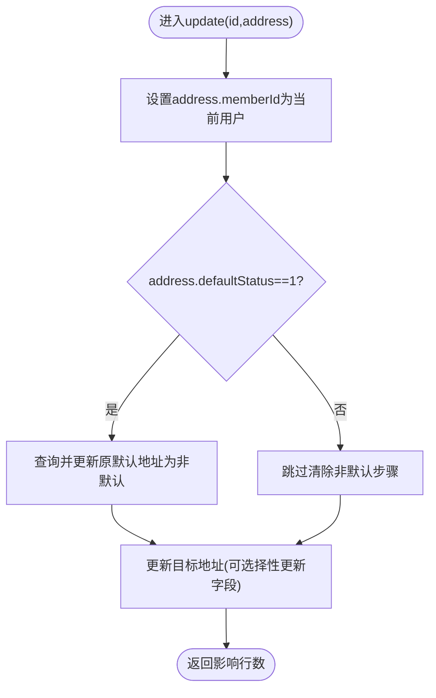
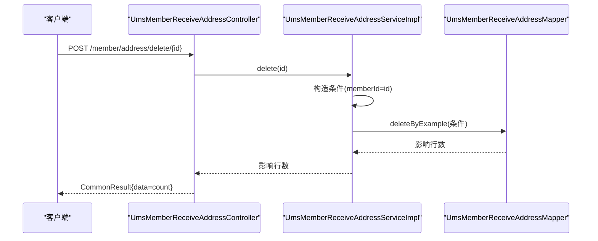
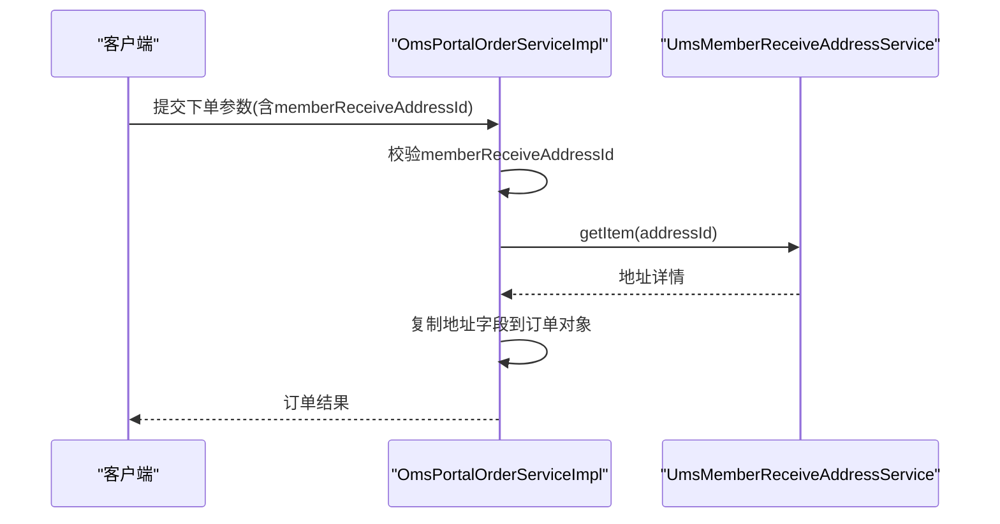
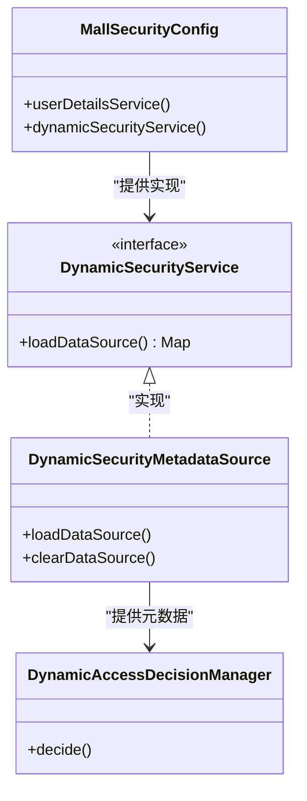
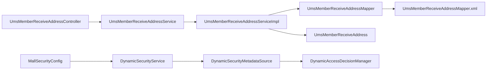

# 收货地址管理API

<cite>
**本文档引用的文件**
- [UmsMemberReceiveAddressController.java](file://mall-portal/src/main/java/com/macro/mall/portal/controller/UmsMemberReceiveAddressController.java)
- [UmsMemberReceiveAddressService.java](file://mall-portal/src/main/java/com/macro/mall/portal/service/UmsMemberReceiveAddressService.java)
- [UmsMemberReceiveAddressServiceImpl.java](file://mall-portal/src/main/java/com/macro/mall/portal/service/impl/UmsMemberReceiveAddressServiceImpl.java)
- [UmsMemberReceiveAddress.java](file://mall-mbg/src/main/java/com/macro/mall/model/UmsMemberReceiveAddress.java)
- [UmsMemberReceiveAddressMapper.java](file://mall-mbg/src/main/java/com/macro/mall/mapper/UmsMemberReceiveAddressMapper.java)
- [UmsMemberReceiveAddressMapper.xml](file://mall-mbg/src/main/resources/com/macro/mall/mapper/UmsMemberReceiveAddressMapper.xml)
- [OmsPortalOrderServiceImpl.java](file://mall-portal/src/main/java/com/macro/mall/portal/service/impl/OmsPortalOrderServiceImpl.java)
- [MallSecurityConfig.java](file://mall-admin/src/main/java/com/macro/mall/config/MallSecurityConfig.java)
- [DynamicSecurityService.java](file://mall-security/src/main/java/com/macro/mall/security/component/DynamicSecurityService.java)
- [DynamicAccessDecisionManager.java](file://mall-security/src/main/java/com/macro/mall/security/component/DynamicAccessDecisionManager.java)
- [DynamicSecurityMetadataSource.java](file://mall-security/src/main/java/com/macro/mall/security/component/DynamicSecurityMetadataSource.java)
</cite>

## 目录
1. [简介](#简介)
2. [项目结构](#项目结构)
3. [核心组件](#核心组件)
4. [架构概览](#架构概览)
5. [详细组件分析](#详细组件分析)
6. [依赖关系分析](#依赖关系分析)
7. [性能考虑](#性能考虑)
8. [故障排除指南](#故障排除指南)
9. [结论](#结论)
10. [附录](#附录)

## 简介
本文件详细描述电商系统中的收货地址管理API，覆盖以下功能：
- 增删改查（CRUD）：新增、删除、修改、查询收货地址
- 默认地址设置：同一会员下仅允许一个默认地址
- 地区选择联动：省市区三级联动字段（province、city、region）
- 地址信息数据结构：包含省市区、详细地址、收货人姓名、电话号码、邮政编码等
- 订单流程集成：下单时校验并使用收货地址
- 权限控制与数据安全：基于Spring Security的动态权限控制

## 项目结构
收货地址管理涉及前端门户(mall-portal)与后台管理(mall-admin)两个模块，核心代码分布如下：
- 控制器层：负责HTTP请求处理与响应封装
- 服务层：负责业务逻辑（默认地址互斥、当前用户上下文）
- 数据访问层：MyBatis映射，提供CRUD能力
- 模型层：实体类定义字段与序列化
- 安全配置：动态权限加载与决策

**图表来源**
- [UmsMemberReceiveAddressController.java:1-68](file://mall-portal/src/main/java/com/macro/mall/portal/controller/UmsMemberReceiveAddressController.java#L1-L68)
- [UmsMemberReceiveAddressService.java:1-43](file://mall-portal/src/main/java/com/macro/mall/portal/service/UmsMemberReceiveAddressService.java#L1-L43)
- [UmsMemberReceiveAddressServiceImpl.java:1-82](file://mall-portal/src/main/java/com/macro/mall/portal/service/impl/UmsMemberReceiveAddressServiceImpl.java#L1-L82)
- [UmsMemberReceiveAddress.java:1-128](file://mall-mbg/src/main/java/com/macro/mall/model/UmsMemberReceiveAddress.java#L1-L128)
- [UmsMemberReceiveAddressMapper.java:1-30](file://mall-mbg/src/main/java/com/macro/mall/mapper/UmsMemberReceiveAddressMapper.java#L1-L30)
- [UmsMemberReceiveAddressMapper.xml:1-291](file://mall-mbg/src/main/resources/com/macro/mall/mapper/UmsMemberReceiveAddressMapper.xml#L1-L291)
- [OmsPortalOrderServiceImpl.java:71-252](file://mall-portal/src/main/java/com/macro/mall/portal/service/impl/OmsPortalOrderServiceImpl.java#L71-L252)
- [MallSecurityConfig.java:1-50](file://mall-admin/src/main/java/com/macro/mall/config/MallSecurityConfig.java#L1-L50)
- [DynamicSecurityService.java:1-16](file://mall-security/src/main/java/com/macro/mall/security/component/DynamicSecurityService.java#L1-L16)
- [DynamicSecurityMetadataSource.java:1-32](file://mall-security/src/main/java/com/macro/mall/security/component/DynamicSecurityMetadataSource.java#L1-L32)
- [DynamicAccessDecisionManager.java:1-18](file://mall-security/src/main/java/com/macro/mall/security/component/DynamicAccessDecisionManager.java#L1-L18)

**章节来源**
- [UmsMemberReceiveAddressController.java:1-68](file://mall-portal/src/main/java/com/macro/mall/portal/controller/UmsMemberReceiveAddressController.java#L1-L68)
- [UmsMemberReceiveAddressService.java:1-43](file://mall-portal/src/main/java/com/macro/mall/portal/service/UmsMemberReceiveAddressService.java#L1-L43)
- [UmsMemberReceiveAddressServiceImpl.java:1-82](file://mall-portal/src/main/java/com/macro/mall/portal/service/impl/UmsMemberReceiveAddressServiceImpl.java#L1-L82)
- [UmsMemberReceiveAddress.java:1-128](file://mall-mbg/src/main/java/com/macro/mall/model/UmsMemberReceiveAddress.java#L1-L128)
- [UmsMemberReceiveAddressMapper.java:1-30](file://mall-mbg/src/main/java/com/macro/mall/mapper/UmsMemberReceiveAddressMapper.java#L1-L30)
- [UmsMemberReceiveAddressMapper.xml:1-291](file://mall-mbg/src/main/resources/com/macro/mall/mapper/UmsMemberReceiveAddressMapper.xml#L1-L291)
- [OmsPortalOrderServiceImpl.java:71-252](file://mall-portal/src/main/java/com/macro/mall/portal/service/impl/OmsPortalOrderServiceImpl.java#L71-L252)
- [MallSecurityConfig.java:1-50](file://mall-admin/src/main/java/com/macro/mall/config/MallSecurityConfig.java#L1-L50)
- [DynamicSecurityService.java:1-16](file://mall-security/src/main/java/com/macro/mall/security/component/DynamicSecurityService.java#L1-L16)
- [DynamicSecurityMetadataSource.java:1-32](file://mall-security/src/main/java/com/macro/mall/security/component/DynamicSecurityMetadataSource.java#L1-L32)
- [DynamicAccessDecisionManager.java:1-18](file://mall-security/src/main/java/com/macro/mall/security/component/DynamicAccessDecisionManager.java#L1-L18)

## 核心组件
- 控制器：提供REST接口，统一返回CommonResult包装
- 服务接口与实现：处理默认地址互斥逻辑、当前用户上下文校验
- 数据访问：MyBatis接口与XML映射，支持条件查询、更新、插入
- 实体模型：定义地址字段（省市区、详细地址、收货人、电话、默认状态等）
- 订单集成：下单时校验并复制地址信息到订单表

**章节来源**
- [UmsMemberReceiveAddressController.java:1-68](file://mall-portal/src/main/java/com/macro/mall/portal/controller/UmsMemberReceiveAddressController.java#L1-L68)
- [UmsMemberReceiveAddressService.java:1-43](file://mall-portal/src/main/java/com/macro/mall/portal/service/UmsMemberReceiveAddressService.java#L1-L43)
- [UmsMemberReceiveAddressServiceImpl.java:1-82](file://mall-portal/src/main/java/com/macro/mall/portal/service/impl/UmsMemberReceiveAddressServiceImpl.java#L1-L82)
- [UmsMemberReceiveAddress.java:1-128](file://mall-mbg/src/main/java/com/macro/mall/model/UmsMemberReceiveAddress.java#L1-L128)
- [UmsMemberReceiveAddressMapper.java:1-30](file://mall-mbg/src/main/java/com/macro/mall/mapper/UmsMemberReceiveAddressMapper.java#L1-L30)
- [UmsMemberReceiveAddressMapper.xml:1-291](file://mall-mbg/src/main/resources/com/macro/mall/mapper/UmsMemberReceiveAddressMapper.xml#L1-L291)
- [OmsPortalOrderServiceImpl.java:71-252](file://mall-portal/src/main/java/com/macro/mall/portal/service/impl/OmsPortalOrderServiceImpl.java#L71-L252)

## 架构概览
收货地址管理采用经典的三层架构：
- 表现层：Controller接收请求，封装响应
- 领域层：Service实现业务规则（默认地址唯一性、当前用户隔离）
- 持久层：Mapper通过XML映射执行SQL

**图表来源**
- [UmsMemberReceiveAddressController.java:1-68](file://mall-portal/src/main/java/com/macro/mall/portal/controller/UmsMemberReceiveAddressController.java#L1-L68)
- [UmsMemberReceiveAddressServiceImpl.java:1-82](file://mall-portal/src/main/java/com/macro/mall/portal/service/impl/UmsMemberReceiveAddressServiceImpl.java#L1-L82)
- [UmsMemberReceiveAddressMapper.java:1-30](file://mall-mbg/src/main/java/com/macro/mall/mapper/UmsMemberReceiveAddressMapper.java#L1-L30)
- [UmsMemberReceiveAddressMapper.xml:1-291](file://mall-mbg/src/main/resources/com/macro/mall/mapper/UmsMemberReceiveAddressMapper.xml#L1-L291)

## 详细组件分析

### 数据模型与字段定义
- 关键字段：memberId、name、phoneNumber、defaultStatus、postCode、province、city、region、detailAddress
- 字段约束：defaultStatus用于标识默认地址（同一会员下仅允许一个默认地址）
- 序列化：提供toString便于日志输出与调试

**图表来源**
- [UmsMemberReceiveAddress.java:1-128](file://mall-mbg/src/main/java/com/macro/mall/model/UmsMemberReceiveAddress.java#L1-L128)

**章节来源**
- [UmsMemberReceiveAddress.java:1-128](file://mall-mbg/src/main/java/com/macro/mall/model/UmsMemberReceiveAddress.java#L1-L128)

### 接口定义与调用流程

#### 列表查询
- 接口：GET /member/address/list
- 流程：获取当前用户，按memberId过滤，返回地址列表

**图表来源**
- [UmsMemberReceiveAddressController.java:54-59](file://mall-portal/src/main/java/com/macro/mall/portal/controller/UmsMemberReceiveAddressController.java#L54-L59)
- [UmsMemberReceiveAddressServiceImpl.java:62-68](file://mall-portal/src/main/java/com/macro/mall/portal/service/impl/UmsMemberReceiveAddressServiceImpl.java#L62-L68)
- [UmsMemberReceiveAddressMapper.xml:78-91](file://mall-mbg/src/main/resources/com/macro/mall/mapper/UmsMemberReceiveAddressMapper.xml#L78-L91)

#### 新增地址
- 接口：POST /member/address/add
- 流程：设置memberId为当前用户，插入数据库

**图表来源**
- [UmsMemberReceiveAddressController.java:24-32](file://mall-portal/src/main/java/com/macro/mall/portal/controller/UmsMemberReceiveAddressController.java#L24-L32)
- [UmsMemberReceiveAddressServiceImpl.java:26-29](file://mall-portal/src/main/java/com/macro/mall/portal/service/impl/UmsMemberReceiveAddressServiceImpl.java#L26-L29)
- [UmsMemberReceiveAddressMapper.xml:108-120](file://mall-mbg/src/main/resources/com/macro/mall/mapper/UmsMemberReceiveAddressMapper.xml#L108-L120)

#### 更新地址（含默认地址互斥）
- 接口：POST /member/address/update/{id}
- 流程：若设置defaultStatus=1，则先将该用户的其他地址置为非默认，再更新目标地址

**图表来源**
- [UmsMemberReceiveAddressServiceImpl.java:41-59](file://mall-portal/src/main/java/com/macro/mall/portal/service/impl/UmsMemberReceiveAddressServiceImpl.java#L41-L59)
- [UmsMemberReceiveAddressMapper.xml:191-244](file://mall-mbg/src/main/resources/com/macro/mall/mapper/UmsMemberReceiveAddressMapper.xml#L191-L244)

#### 删除地址
- 接口：POST /member/address/delete/{id}
- 流程：按当前用户+地址ID删除

**图表来源**
- [UmsMemberReceiveAddressController.java:34-42](file://mall-portal/src/main/java/com/macro/mall/portal/controller/UmsMemberReceiveAddressController.java#L34-L42)
- [UmsMemberReceiveAddressServiceImpl.java:33-38](file://mall-portal/src/main/java/com/macro/mall/portal/service/impl/UmsMemberReceiveAddressServiceImpl.java#L33-L38)
- [UmsMemberReceiveAddressMapper.xml:102-107](file://mall-mbg/src/main/resources/com/macro/mall/mapper/UmsMemberReceiveAddressMapper.xml#L102-L107)

#### 获取详情
- 接口：GET /member/address/{id}
- 流程：按当前用户+地址ID查询

**章节来源**
- [UmsMemberReceiveAddressController.java:1-68](file://mall-portal/src/main/java/com/macro/mall/portal/controller/UmsMemberReceiveAddressController.java#L1-L68)
- [UmsMemberReceiveAddressServiceImpl.java:70-80](file://mall-portal/src/main/java/com/macro/mall/portal/service/impl/UmsMemberReceiveAddressServiceImpl.java#L70-L80)
- [UmsMemberReceiveAddressMapper.xml:92-97](file://mall-mbg/src/main/resources/com/macro/mall/mapper/UmsMemberReceiveAddressMapper.xml#L92-L97)

### 默认地址设置机制
- 同一会员下仅允许一个默认地址
- 当设置某地址为默认时，系统会自动将该会员的其他地址的默认状态清零
- 若未显式设置，默认状态为非默认

**章节来源**
- [UmsMemberReceiveAddressServiceImpl.java:46-59](file://mall-portal/src/main/java/com/macro/mall/portal/service/impl/UmsMemberReceiveAddressServiceImpl.java#L46-L59)

### 地区选择联动
- 字段：province、city、region构成省市区三级联动
- 使用方式：在新增/编辑表单中，先选择省份，再根据后端提供的区域数据选择城市与区县
- 注意：当前仓库未提供独立的地区联动API，建议在前端实现级联选择，并通过地址表的省市区字段存储

**章节来源**
- [UmsMemberReceiveAddress.java:18-24](file://mall-mbg/src/main/java/com/macro/mall/model/UmsMemberReceiveAddress.java#L18-L24)

### 地址批量导入导出
- 当前仓库未提供批量导入导出接口
- 建议方案：
  - 导入：提供Excel模板，后端解析并批量写入地址表
  - 导出：按当前用户筛选导出地址列表
- 安全建议：导入需鉴权与数据校验，导出需脱敏敏感字段

[本节为通用建议，不直接分析具体文件]

### 订单流程中的地址使用
- 下单时必须选择收货地址
- 从地址表读取姓名、电话、邮编、省市区、详细地址，填充到订单表
- 若未选择地址，下单流程会抛出错误

**图表来源**
- [OmsPortalOrderServiceImpl.java:95-210](file://mall-portal/src/main/java/com/macro/mall/portal/service/impl/OmsPortalOrderServiceImpl.java#L95-L210)

**章节来源**
- [OmsPortalOrderServiceImpl.java:71-252](file://mall-portal/src/main/java/com/macro/mall/portal/service/impl/OmsPortalOrderServiceImpl.java#L71-L252)

### 权限控制与数据安全
- 动态权限加载：后台启动时加载资源URL与权限映射
- 运行时决策：根据请求URL匹配资源，结合用户角色判断访问权限
- 安全配置：通过SecurityConfig注入UserDetailsService与DynamicSecurityService

**图表来源**
- [MallSecurityConfig.java:1-50](file://mall-admin/src/main/java/com/macro/mall/config/MallSecurityConfig.java#L1-L50)
- [DynamicSecurityService.java:1-16](file://mall-security/src/main/java/com/macro/mall/security/component/DynamicSecurityService.java#L1-L16)
- [DynamicSecurityMetadataSource.java:1-32](file://mall-security/src/main/java/com/macro/mall/security/component/DynamicSecurityMetadataSource.java#L1-L32)
- [DynamicAccessDecisionManager.java:1-18](file://mall-security/src/main/java/com/macro/mall/security/component/DynamicAccessDecisionManager.java#L1-L18)

**章节来源**
- [MallSecurityConfig.java:1-50](file://mall-admin/src/main/java/com/macro/mall/config/MallSecurityConfig.java#L1-L50)
- [DynamicSecurityService.java:1-16](file://mall-security/src/main/java/com/macro/mall/security/component/DynamicSecurityService.java#L1-L16)
- [DynamicSecurityMetadataSource.java:1-32](file://mall-security/src/main/java/com/macro/mall/security/component/DynamicSecurityMetadataSource.java#L1-L32)
- [DynamicAccessDecisionManager.java:1-18](file://mall-security/src/main/java/com/macro/mall/security/component/DynamicAccessDecisionManager.java#L1-L18)

## 依赖关系分析
- 控制器依赖服务接口
- 服务实现依赖Mapper与当前用户服务
- Mapper依赖XML映射与数据库
- 安全配置依赖动态权限服务与资源服务

**图表来源**
- [UmsMemberReceiveAddressController.java:1-68](file://mall-portal/src/main/java/com/macro/mall/portal/controller/UmsMemberReceiveAddressController.java#L1-L68)
- [UmsMemberReceiveAddressService.java:1-43](file://mall-portal/src/main/java/com/macro/mall/portal/service/UmsMemberReceiveAddressService.java#L1-L43)
- [UmsMemberReceiveAddressServiceImpl.java:1-82](file://mall-portal/src/main/java/com/macro/mall/portal/service/impl/UmsMemberReceiveAddressServiceImpl.java#L1-L82)
- [UmsMemberReceiveAddressMapper.java:1-30](file://mall-mbg/src/main/java/com/macro/mall/mapper/UmsMemberReceiveAddressMapper.java#L1-L30)
- [UmsMemberReceiveAddressMapper.xml:1-291](file://mall-mbg/src/main/resources/com/macro/mall/mapper/UmsMemberReceiveAddressMapper.xml#L1-L291)
- [MallSecurityConfig.java:1-50](file://mall-admin/src/main/java/com/macro/mall/config/MallSecurityConfig.java#L1-L50)
- [DynamicSecurityService.java:1-16](file://mall-security/src/main/java/com/macro/mall/security/component/DynamicSecurityService.java#L1-L16)
- [DynamicSecurityMetadataSource.java:1-32](file://mall-security/src/main/java/com/macro/mall/security/component/DynamicSecurityMetadataSource.java#L1-L32)
- [DynamicAccessDecisionManager.java:1-18](file://mall-security/src/main/java/com/macro/mall/security/component/DynamicAccessDecisionManager.java#L1-L18)

**章节来源**
- [UmsMemberReceiveAddressController.java:1-68](file://mall-portal/src/main/java/com/macro/mall/portal/controller/UmsMemberReceiveAddressController.java#L1-L68)
- [UmsMemberReceiveAddressServiceImpl.java:1-82](file://mall-portal/src/main/java/com/macro/mall/portal/service/impl/UmsMemberReceiveAddressServiceImpl.java#L1-L82)
- [UmsMemberReceiveAddressMapper.xml:1-291](file://mall-mbg/src/main/resources/com/macro/mall/mapper/UmsMemberReceiveAddressMapper.xml#L1-L291)
- [MallSecurityConfig.java:1-50](file://mall-admin/src/main/java/com/macro/mall/config/MallSecurityConfig.java#L1-L50)
- [DynamicSecurityService.java:1-16](file://mall-security/src/main/java/com/macro/mall/security/component/DynamicSecurityService.java#L1-L16)
- [DynamicSecurityMetadataSource.java:1-32](file://mall-security/src/main/java/com/macro/mall/security/component/DynamicSecurityMetadataSource.java#L1-L32)
- [DynamicAccessDecisionManager.java:1-18](file://mall-security/src/main/java/com/macro/mall/security/component/DynamicAccessDecisionManager.java#L1-L18)

## 性能考虑
- 数据库索引：建议在member_id、default_status上建立索引以提升查询效率
- 分页查询：列表接口可扩展分页参数，避免一次性返回大量数据
- 缓存策略：默认地址可缓存于Redis，减少频繁查询
- 批量操作：导入导出建议采用异步任务与分批处理

[本节为通用建议，不直接分析具体文件]

## 故障排除指南
- 新增失败：检查请求体字段是否完整，确保必填字段（姓名、电话、省市区、详细地址）正确
- 设置默认失败：确认同一会员下仅有一个默认地址，查看更新逻辑是否成功清除旧默认
- 删除失败：确认删除条件包含当前用户ID，避免误删他人地址
- 订单下单报错：检查memberReceiveAddressId是否传入且有效

**章节来源**
- [UmsMemberReceiveAddressServiceImpl.java:26-59](file://mall-portal/src/main/java/com/macro/mall/portal/service/impl/UmsMemberReceiveAddressServiceImpl.java#L26-L59)
- [OmsPortalOrderServiceImpl.java:95-101](file://mall-portal/src/main/java/com/macro/mall/portal/service/impl/OmsPortalOrderServiceImpl.java#L95-L101)

## 结论
本收货地址管理API提供了完整的CRUD能力与默认地址互斥机制，支持省市区三级联动字段与订单流程集成。通过动态权限配置，系统具备良好的安全性与扩展性。建议后续完善批量导入导出与更细粒度的校验规则。

## 附录

### API接口清单
- 新增地址：POST /member/address/add
- 删除地址：POST /member/address/delete/{id}
- 更新地址：POST /member/address/update/{id}
- 地址列表：GET /member/address/list
- 获取详情：GET /member/address/{id}

**章节来源**
- [UmsMemberReceiveAddressController.java:24-66](file://mall-portal/src/main/java/com/macro/mall/portal/controller/UmsMemberReceiveAddressController.java#L24-L66)