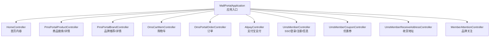
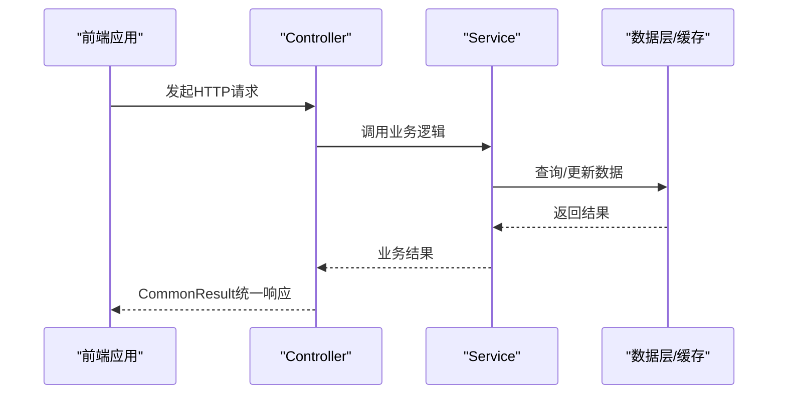
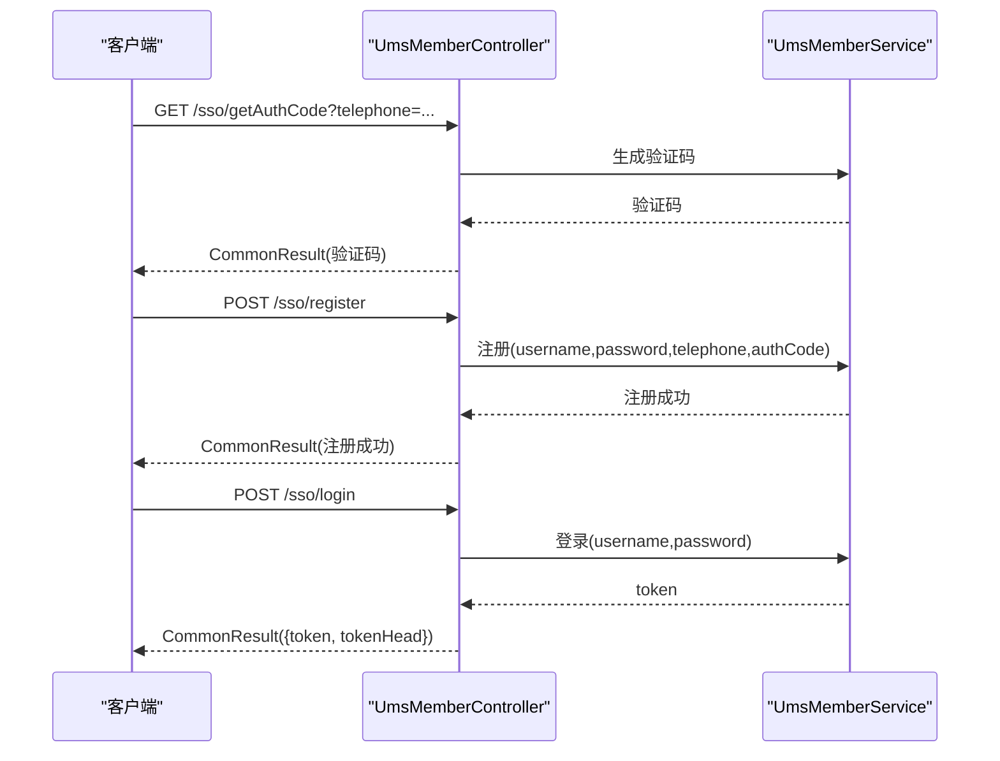
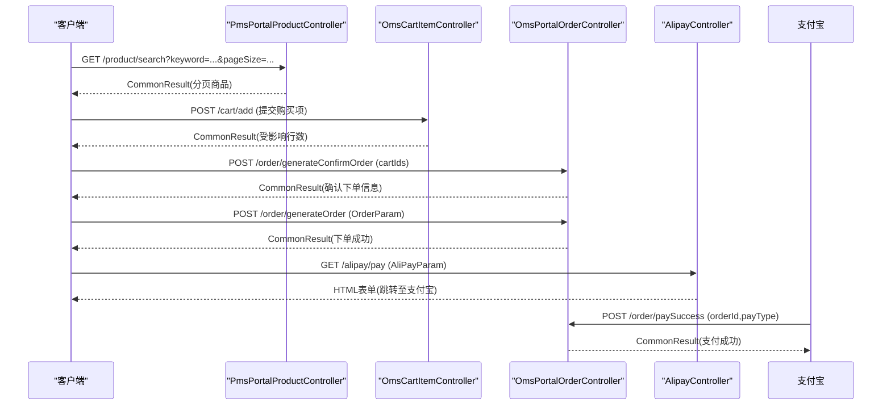
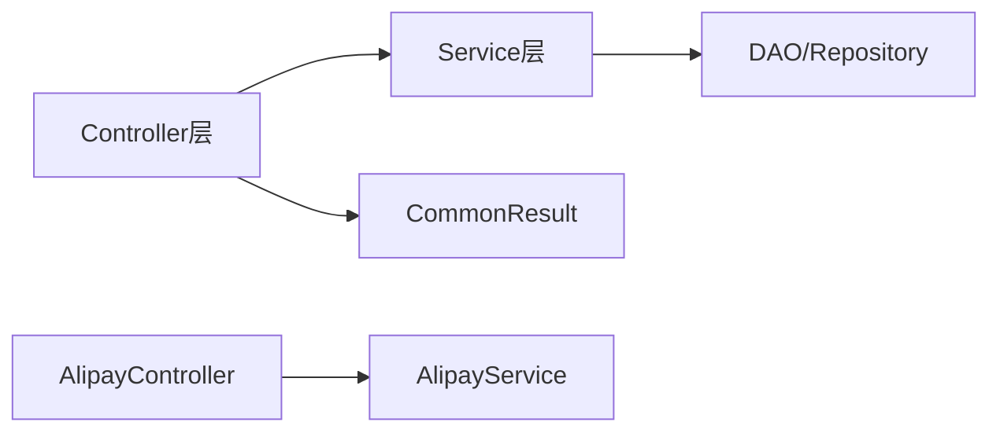

# 前台门户API

<cite>
**本文引用的文件**
- [README.md](file://README.md)
- [MallPortalApplication.java](file://mall-portal/src/main/java/com/macro/mall/portal/MallPortalApplication.java)
- [CommonResult.java](file://mall-common/src/main/java/com/macro/mall/common/api/CommonResult.java)
- [IErrorCode.java](file://mall-common/src/main/java/com/macro/mall/common/api/IErrorCode.java)
- [HomeController.java](file://mall-portal/src/main/java/com/macro/mall/portal/controller/HomeController.java)
- [PmsPortalProductController.java](file://mall-portal/src/main/java/com/macro/mall/portal/controller/PmsPortalProductController.java)
- [PmsPortalBrandController.java](file://mall-portal/src/main/java/com/macro/mall/portal/controller/PmsPortalBrandController.java)
- [OmsCartItemController.java](file://mall-portal/src/main/java/com/macro/mall/portal/controller/OmsCartItemController.java)
- [OmsPortalOrderController.java](file://mall-portal/src/main/java/com/macro/mall/portal/controller/OmsPortalOrderController.java)
- [AlipayController.java](file://mall-portal/src/main/java/com/macro/mall/portal/controller/AlipayController.java)
- [UmsMemberController.java](file://mall-portal/src/main/java/com/macro/mall/portal/controller/UmsMemberController.java)
- [UmsMemberCouponController.java](file://mall-portal/src/main/java/com/macro/mall/portal/controller/UmsMemberCouponController.java)
- [UmsMemberReceiveAddressController.java](file://mall-portal/src/main/java/com/macro/mall/portal/controller/UmsMemberReceiveAddressController.java)
- [MemberAttentionController.java](file://mall-portal/src/main/java/com/macro/mall/portal/controller/MemberAttentionController.java)
</cite>

## 目录
1. [简介](#简介)
2. [项目结构](#项目结构)
3. [核心组件](#核心组件)
4. [架构总览](#架构总览)
5. [详细组件分析](#详细组件分析)
6. [依赖关系分析](#依赖关系分析)
7. [性能考虑](#性能考虑)
8. [故障排查指南](#故障排查指南)
9. [结论](#结论)
10. [附录](#附录)

## 简介
本文件为Mall前台门户系统的API接口文档，覆盖商品展示、会员中心、购物车、订单处理与支付等前台相关的核心能力。文档提供每个接口的HTTP方法、URL路径、请求参数、响应格式说明，并标注权限要求与匿名访问限制。同时给出会员注册登录、商品搜索、下单支付等典型业务流程的接口调用示例，以及性能优化建议与缓存策略。

## 项目结构
前台门户模块位于 mall-portal，入口应用类为 MallPortalApplication。通用返回体定义在 mall-common 中，统一返回结构包含状态码、消息与数据体。各功能通过Controller暴露REST接口，遵循统一的返回规范。

**图表来源**
- [MallPortalApplication.java:1-14](file://mall-portal/src/main/java/com/macro/mall/portal/MallPortalApplication.java#L1-L14)
- [HomeController.java:1-74](file://mall-portal/src/main/java/com/macro/mall/portal/controller/HomeController.java#L1-L74)
- [PmsPortalProductController.java:1-54](file://mall-portal/src/main/java/com/macro/mall/portal/controller/PmsPortalProductController.java#L1-L54)
- [PmsPortalBrandController.java:1-51](file://mall-portal/src/main/java/com/macro/mall/portal/controller/PmsPortalBrandController.java#L1-L51)
- [OmsCartItemController.java:1-101](file://mall-portal/src/main/java/com/macro/mall/portal/controller/OmsCartItemController.java#L1-L101)
- [OmsPortalOrderController.java:1-100](file://mall-portal/src/main/java/com/macro/mall/portal/controller/OmsPortalOrderController.java#L1-L100)
- [AlipayController.java:1-68](file://mall-portal/src/main/java/com/macro/mall/portal/controller/AlipayController.java#L1-L68)
- [UmsMemberController.java:1-100](file://mall-portal/src/main/java/com/macro/mall/portal/controller/UmsMemberController.java#L1-L100)
- [UmsMemberCouponController.java:1-69](file://mall-portal/src/main/java/com/macro/mall/portal/controller/UmsMemberCouponController.java#L1-L69)
- [UmsMemberReceiveAddressController.java:1-68](file://mall-portal/src/main/java/com/macro/mall/portal/controller/UmsMemberReceiveAddressController.java#L1-L68)
- [MemberAttentionController.java:1-67](file://mall-portal/src/main/java/com/macro/mall/portal/controller/MemberAttentionController.java#L1-L67)

**章节来源**
- [README.md:29-62](file://README.md#L29-L62)
- [MallPortalApplication.java:1-14](file://mall-portal/src/main/java/com/macro/mall/portal/MallPortalApplication.java#L1-L14)

## 核心组件
- 统一返回体 CommonResult：封装 code、message、data 字段，提供 success、failed、unauthorized、forbidden 等静态工厂方法，确保前后端一致的响应格式。
- 接口权限与认证：会员相关接口通常需要登录态；部分公开接口如首页内容、商品搜索、验证码获取等允许匿名访问。

**章节来源**
- [CommonResult.java:1-134](file://mall-common/src/main/java/com/macro/mall/common/api/CommonResult.java#L1-L134)
- [IErrorCode.java:1-18](file://mall-common/src/main/java/com/macro/mall/common/api/IErrorCode.java#L1-L18)

## 架构总览
前台门户API采用前后端分离架构，Controller负责接收HTTP请求，调用对应Service进行业务处理，最终以CommonResult统一返回。安全方面通过Spring Security与JWT过滤器链实现认证与授权。

[此图为概念性流程示意，不直接映射具体源码文件，故无“图表来源”]

## 详细组件分析

### 会员中心与SSO
- 登录注册
  - POST /sso/register
    - 请求参数：username、password、telephone、authCode
    - 响应：CommonResult
    - 权限：匿名
  - POST /sso/login
    - 请求参数：username、password
    - 响应：{ token, tokenHead }
    - 权限：匿名
  - GET /sso/getAuthCode
    - 请求参数：telephone
    - 响应：验证码字符串
    - 权限：匿名
  - POST /sso/updatePassword
    - 请求参数：telephone、password、authCode
    - 响应：CommonResult
    - 权限：匿名
  - GET /sso/info
    - 请求参数：无
    - 响应：当前会员信息
    - 权限：需要登录
  - GET /sso/refreshToken
    - 请求参数：无（从请求头读取token）
    - 响应：新的token与tokenHead
    - 权限：需要登录

- 优惠券
  - POST /member/coupon/add/{couponId}
    - 请求参数：路径参数 couponId
    - 响应：CommonResult
    - 权限：需要登录
  - GET /member/coupon/list
    - 请求参数：useStatus（可选）
    - 响应：优惠券列表
    - 权限：需要登录
  - GET /member/coupon/listHistory
    - 请求参数：useStatus（可选）
    - 响应：历史记录列表
    - 权限：需要登录
  - GET /member/coupon/list/cart/{type}
    - 请求参数：type
    - 响应：购物车可用优惠券明细
    - 权限：需要登录
  - GET /member/coupon/listByProduct/{productId}
    - 请求参数：productId
    - 响应：可用优惠券列表
    - 权限：需要登录

- 收货地址
  - POST /member/address/add
    - 请求参数：JSON体（UmsMemberReceiveAddress）
    - 响应：受影响行数
    - 权限：需要登录
  - POST /member/address/delete/{id}
    - 请求参数：id
    - 响应：受影响行数
    - 权限：需要登录
  - POST /member/address/update/{id}
    - 请求参数：id + JSON体
    - 响应：受影响行数
    - 权限：需要登录
  - GET /member/address/list
    - 请求参数：无
    - 响应：地址列表
    - 权限：需要登录
  - GET /member/address/{id}
    - 请求参数：id
    - 响应：单个地址
    - 权限：需要登录

- 品牌关注
  - POST /member/attention/add
    - 请求参数：JSON体（MemberBrandAttention）
    - 响应：受影响行数
    - 权限：需要登录
  - POST /member/attention/delete
    - 请求参数：brandId
    - 响应：受影响行数
    - 权限：需要登录
  - GET /member/attention/list
    - 请求参数：pageNum、pageSize
    - 响应：分页结果
    - 权限：需要登录
  - GET /member/attention/detail
    - 请求参数：brandId
    - 响应：关注详情
    - 权限：需要登录
  - POST /member/attention/clear
    - 请求参数：无
    - 响应：清空结果
    - 权限：需要登录

**章节来源**
- [UmsMemberController.java:35-98](file://mall-portal/src/main/java/com/macro/mall/portal/controller/UmsMemberController.java#L35-L98)
- [UmsMemberCouponController.java:33-67](file://mall-portal/src/main/java/com/macro/mall/portal/controller/UmsMemberCouponController.java#L33-L67)
- [UmsMemberReceiveAddressController.java:24-66](file://mall-portal/src/main/java/com/macro/mall/portal/controller/UmsMemberReceiveAddressController.java#L24-L66)
- [MemberAttentionController.java:23-65](file://mall-portal/src/main/java/com/macro/mall/portal/controller/MemberAttentionController.java#L23-L65)

### 商品展示
- 首页内容
  - GET /home/content
    - 请求参数：无
    - 响应：首页内容聚合结果
    - 权限：匿名
  - GET /home/recommendProductList
    - 请求参数：pageSize、pageNum
    - 响应：推荐商品列表
    - 权限：匿名
  - GET /home/productCateList/{parentId}
    - 请求参数：parentId
    - 响应：商品分类列表
    - 权限：匿名
  - GET /home/subjectList
    - 请求参数：cateId（可选）、pageSize、pageNum
    - 响应：专题列表
    - 权限：匿名
  - GET /home/hotProductList
    - 请求参数：pageNum、pageSize
    - 响应：热门商品列表
    - 权限：匿名
  - GET /home/newProductList
    - 请求参数：pageNum、pageSize
    - 响应：新品列表
    - 权限：匿名

- 商品搜索与详情
  - GET /product/search
    - 请求参数：keyword（可选）、brandId（可选）、productCategoryId（可选）、pageNum、pageSize、sort
    - 响应：分页商品列表
    - 权限：匿名
  - GET /product/categoryTreeList
    - 请求参数：无
    - 响应：分类树形结构
    - 权限：匿名
  - GET /product/detail/{id}
    - 请求参数：id
    - 响应：商品详情聚合
    - 权限：匿名

- 品牌
  - GET /brand/recommendList
    - 请求参数：pageSize、pageNum
    - 响应：推荐品牌列表
    - 权限：匿名
  - GET /brand/detail/{brandId}
    - 请求参数：brandId
    - 响应：品牌详情
    - 权限：匿名
  - GET /brand/productList
    - 请求参数：brandId、pageNum、pageSize
    - 响应：品牌商品分页
    - 权限：匿名

**章节来源**
- [HomeController.java:27-72](file://mall-portal/src/main/java/com/macro/mall/portal/controller/HomeController.java#L27-L72)
- [PmsPortalProductController.java:28-52](file://mall-portal/src/main/java/com/macro/mall/portal/controller/PmsPortalProductController.java#L28-L52)
- [PmsPortalBrandController.java:27-49](file://mall-portal/src/main/java/com/macro/mall/portal/controller/PmsPortalBrandController.java#L27-L49)

### 购物车
- 购物车管理
  - POST /cart/add
    - 请求参数：JSON体（OmsCartItem）
    - 响应：受影响行数
    - 权限：需要登录
  - GET /cart/list
    - 请求参数：无
    - 响应：当前会员购物车项列表
    - 权限：需要登录
  - GET /cart/list/promotion
    - 请求参数：cartIds（可选）
    - 响应：带促销信息的购物车项
    - 权限：需要登录
  - GET /cart/update/quantity
    - 请求参数：id、quantity
    - 响应：受影响行数
    - 权限：需要登录
  - GET /cart/getProduct/{productId}
    - 请求参数：productId
    - 响应：指定商品的购物车组合
    - 权限：需要登录
  - POST /cart/update/attr
    - 请求参数：JSON体（OmsCartItem）
    - 响应：受影响行数
    - 权限：需要登录
  - POST /cart/delete
    - 请求参数：ids（数组）
    - 响应：受影响行数
    - 权限：需要登录
  - POST /cart/clear
    - 请求参数：无
    - 响应：清理结果
    - 权限：需要登录

**章节来源**
- [OmsCartItemController.java:29-99](file://mall-portal/src/main/java/com/macro/mall/portal/controller/OmsCartItemController.java#L29-L99)

### 订单处理
- 订单管理
  - POST /order/generateConfirmOrder
    - 请求参数：JSON体（cartIds 数组）
    - 响应：确认下单信息
    - 权限：需要登录
  - POST /order/generateOrder
    - 请求参数：JSON体（OrderParam）
    - 响应：下单结果（含业务标识）
    - 权限：需要登录
  - POST /order/paySuccess
    - 请求参数：orderId、payType
    - 响应：受影响行数
    - 权限：需要登录
  - POST /order/cancelTimeOutOrder
    - 请求参数：无
    - 响应：取消超时订单结果
    - 权限：需要登录
  - POST /order/cancelOrder
    - 请求参数：orderId
    - 响应：取消订单结果
    - 权限：需要登录
  - POST /order/cancelUserOrder
    - 请求参数：orderId
    - 响应：取消结果
    - 权限：需要登录
  - POST /order/confirmReceiveOrder
    - 请求参数：orderId
    - 响应：确认收货结果
    - 权限：需要登录
  - POST /order/deleteOrder
    - 请求参数：orderId
    - 响应：删除结果
    - 权限：需要登录
  - GET /order/list
    - 请求参数：status、pageNum、pageSize
    - 响应：订单分页列表
    - 权限：需要登录
  - GET /order/detail/{orderId}
    - 请求参数：orderId
    - 响应：订单详情
    - 权限：需要登录

**章节来源**
- [OmsPortalOrderController.java:28-98](file://mall-portal/src/main/java/com/macro/mall/portal/controller/OmsPortalOrderController.java#L28-L98)

### 支付
- 支付宝支付
  - GET /alipay/pay
    - 请求参数：AliPayParam（由AlipayService构造参数）
    - 响应：HTML表单（用于发起支付）
    - 权限：需要登录
  - GET /alipay/webPay
    - 请求参数：AliPayParam
    - 响应：HTML表单（网页支付）
    - 权限：需要登录
  - POST /alipay/notify
    - 请求参数：异步回调参数（由支付宝POST）
    - 响应：通知处理结果（字符串）
    - 权限：匿名（来自支付宝回调）
  - GET /alipay/query
    - 请求参数：outTradeNo、tradeNo
    - 响应：交易查询结果
    - 权限：需要登录

**章节来源**
- [AlipayController.java:36-66](file://mall-portal/src/main/java/com/macro/mall/portal/controller/AlipayController.java#L36-L66)

### 典型业务流程示例

#### 会员注册登录流程

**图表来源**
- [UmsMemberController.java:35-74](file://mall-portal/src/main/java/com/macro/mall/portal/controller/UmsMemberController.java#L35-L74)

#### 商品搜索与下单流程

**图表来源**
- [PmsPortalProductController.java:28-52](file://mall-portal/src/main/java/com/macro/mall/portal/controller/PmsPortalProductController.java#L28-L52)
- [OmsCartItemController.java:29-37](file://mall-portal/src/main/java/com/macro/mall/portal/controller/OmsCartItemController.java#L29-L37)
- [OmsPortalOrderController.java:28-47](file://mall-portal/src/main/java/com/macro/mall/portal/controller/OmsPortalOrderController.java#L28-L47)
- [AlipayController.java:36-42](file://mall-portal/src/main/java/com/macro/mall/portal/controller/AlipayController.java#L36-L42)

## 依赖关系分析
- 控制器依赖Service层，Service层依赖DAO/Repository与领域模型。
- 统一返回体 CommonResult 作为所有接口的输出标准，简化前端处理。
- 支付模块通过AlipayController对接第三方支付网关，内部调用AlipayService处理参数与回调。

**图表来源**
- [CommonResult.java:1-134](file://mall-common/src/main/java/com/macro/mall/common/api/CommonResult.java#L1-L134)
- [AlipayController.java:31-34](file://mall-portal/src/main/java/com/macro/mall/portal/controller/AlipayController.java#L31-L34)

**章节来源**
- [CommonResult.java:1-134](file://mall-common/src/main/java/com/macro/mall/common/api/CommonResult.java#L1-L134)

## 性能考虑
- 分页与排序
  - 商品搜索与首页列表均支持分页参数，建议前端按需加载，避免一次性拉取大量数据。
- 缓存策略
  - 首页内容、热门商品、新品推荐等静态或低频变更内容可引入Redis缓存，设置合理TTL。
  - 商品详情与分类树可做本地缓存或CDN加速，结合ETag/Last-Modified实现条件请求。
- 并发与幂等
  - 下单与支付接口需保证幂等性，防止重复提交；可通过订单号去重或分布式锁控制。
- 异步处理
  - 超时取消订单可采用消息队列延迟消息机制，降低实时调用压力。
- 前端优化
  - 使用骨架屏与懒加载提升首屏体验；对高频接口启用浏览器缓存与协商缓存。

[本节为通用性能建议，无需特定文件来源]

## 故障排查指南
- 统一异常与返回
  - 所有接口返回统一结构，前端可根据 code 判断是否成功；失败场景可结合 message 快速定位问题。
- 认证失败
  - /sso/info 无 Principal 时返回未登录；检查请求头携带的token与tokenHead配置是否正确。
- 支付回调
  - /alipay/notify 为异步回调，需确保回调地址可达且服务端正确解析参数；回调成功后需更新订单状态。
- 购物车与订单
  - 若受影响行数为0，检查当前登录会员ID与传入参数是否匹配；确认库存与促销规则。

**章节来源**
- [CommonResult.java:99-108](file://mall-common/src/main/java/com/macro/mall/common/api/CommonResult.java#L99-L108)
- [UmsMemberController.java:59-67](file://mall-portal/src/main/java/com/macro/mall/portal/controller/UmsMemberController.java#L59-L67)
- [AlipayController.java:52-60](file://mall-portal/src/main/java/com/macro/mall/portal/controller/AlipayController.java#L52-L60)

## 结论
本文档梳理了Mall前台门户系统的关键API，明确了接口职责、权限与统一返回格式，并提供了典型业务流程的调用序列与时序图。建议在生产环境中结合缓存、异步与幂等策略提升性能与稳定性，同时完善监控与日志以便快速定位问题。

[本节为总结性内容，无需特定文件来源]

## 附录
- 统一返回体字段说明
  - code：业务状态码
  - message：提示信息
  - data：业务数据对象或集合
- 常见状态码
  - 成功：SUCCESS
  - 失败：FAILED
  - 参数校验失败：VALIDATE_FAILED
  - 未登录：UNAUTHORIZED
  - 未授权：FORBIDDEN

**章节来源**
- [CommonResult.java:30-108](file://mall-common/src/main/java/com/macro/mall/common/api/CommonResult.java#L30-L108)