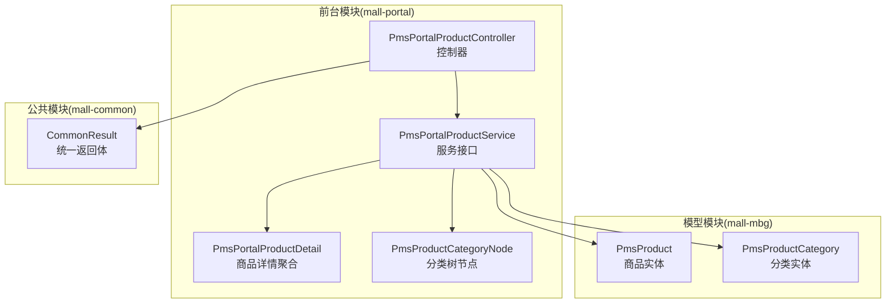
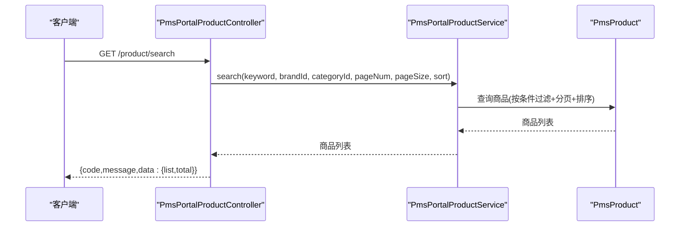
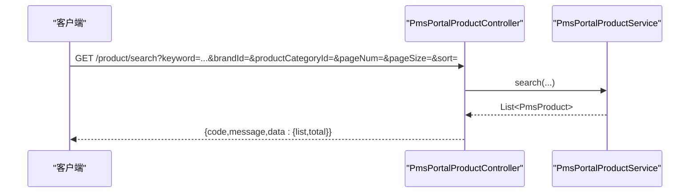
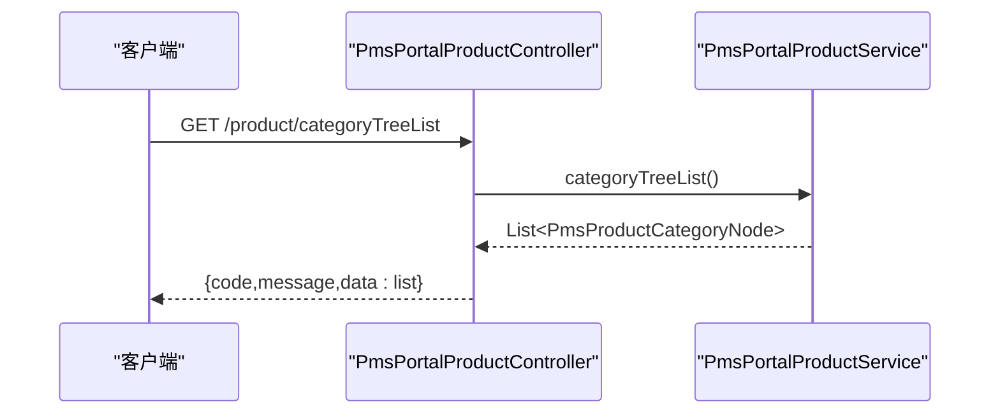
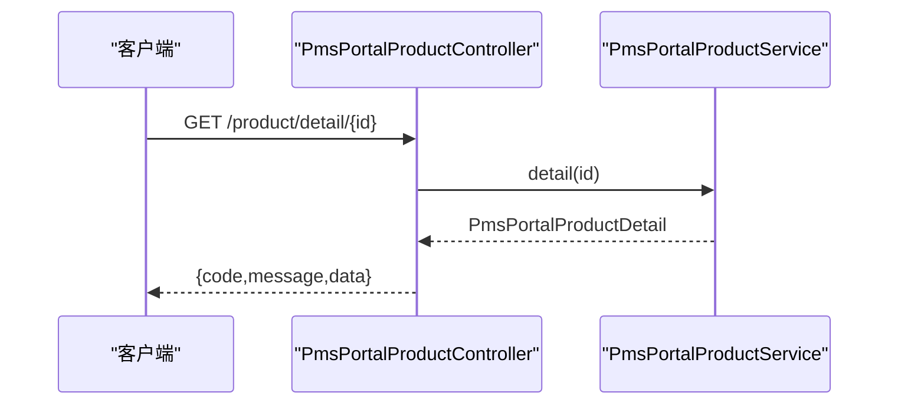
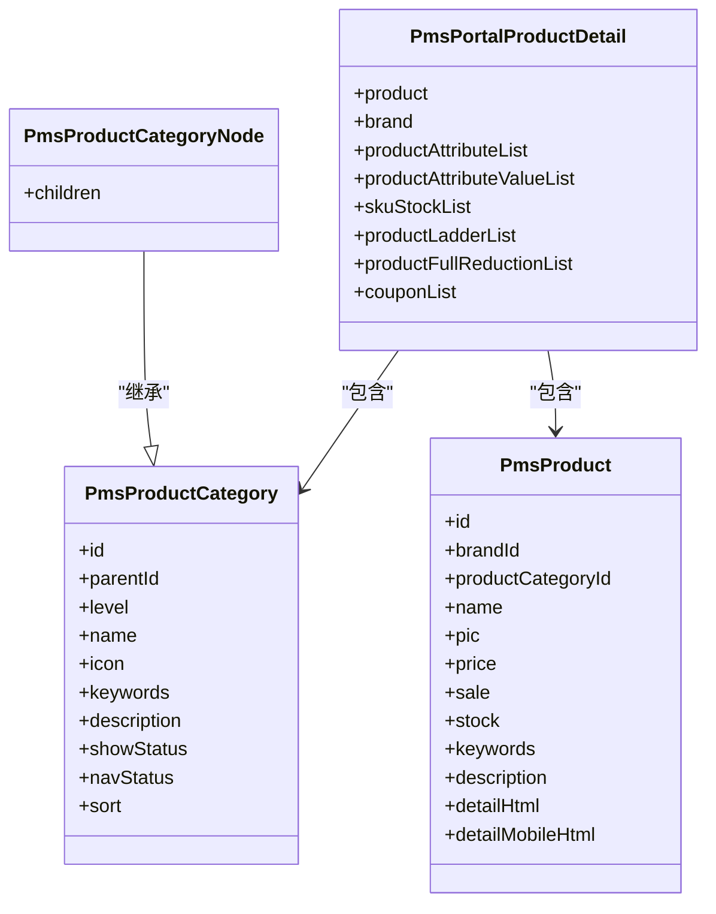
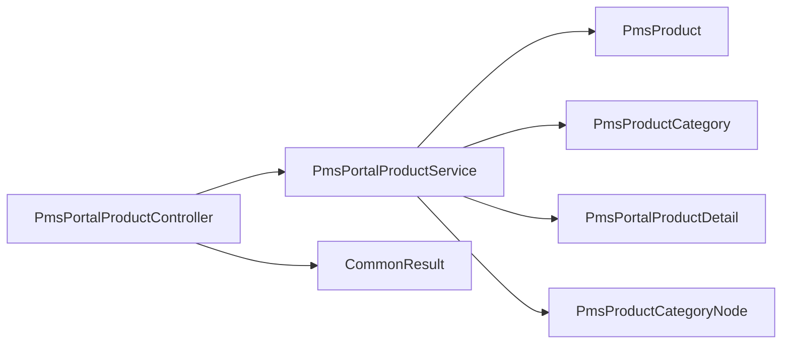

# 商品相关API

<cite>
**本文引用的文件**
- [PmsPortalProductController.java](file://mall-portal/src/main/java/com/macro/mall/portal/controller/PmsPortalProductController.java)
- [PmsPortalProductService.java](file://mall-portal/src/main/java/com/macro/mall/portal/service/PmsPortalProductService.java)
- [PmsPortalProductDetail.java](file://mall-portal/src/main/java/com/macro/mall/portal/domain/PmsPortalProductDetail.java)
- [PmsProductCategoryNode.java](file://mall-portal/src/main/java/com/macro/mall/portal/domain/PmsProductCategoryNode.java)
- [PmsProduct.java](file://mall-mbg/src/main/java/com/macro/mall/model/PmsProduct.java)
- [PmsProductCategory.java](file://mall-mbg/src/main/java/com/macro/mall/model/PmsProductCategory.java)
- [CommonResult.java](file://mall-common/src/main/java/com/macro/mall/common/api/CommonResult.java)
- [mall-portal.postman_collection.json](file://document/postman/mall-portal.postman_collection.json)
</cite>

## 目录
1. [简介](#简介)
2. [项目结构](#项目结构)
3. [核心组件](#核心组件)
4. [架构总览](#架构总览)
5. [详细组件分析](#详细组件分析)
6. [依赖关系分析](#依赖关系分析)
7. [性能考虑](#性能考虑)
8. [故障排查指南](#故障排查指南)
9. [结论](#结论)
10. [附录](#附录)

## 简介
本文件面向“商品相关API”的使用者与维护者，系统性梳理前台商品模块的核心接口：商品搜索（支持关键词、品牌、分类筛选）、商品分类树形结构查询、商品详情获取。文档覆盖接口定义（HTTP方法、URL、请求参数）、响应结构、错误码约定、典型使用场景示例，并给出数据模型、缓存策略与性能优化建议。

## 项目结构
- 控制器层位于 mall-portal 模块，负责接收前端请求并调用服务层。
- 服务接口位于 mall-portal 模块，定义了搜索、分类树、详情等能力。
- 领域模型位于 mall-mbg 模块，包含商品、分类等实体。
- 公共返回体位于 mall-common 模块，统一返回格式。
- Postman 集合提供接口调用示例与环境配置参考。

**图表来源**
- [PmsPortalProductController.java:28-52](file://mall-portal/src/main/java/com/macro/mall/portal/controller/PmsPortalProductController.java#L28-L52)
- [PmsPortalProductService.java:13-28](file://mall-portal/src/main/java/com/macro/mall/portal/service/PmsPortalProductService.java#L13-L28)
- [PmsPortalProductDetail.java:15-24](file://mall-portal/src/main/java/com/macro/mall/portal/domain/PmsPortalProductDetail.java#L15-L24)
- [PmsProductCategoryNode.java:15-17](file://mall-portal/src/main/java/com/macro/mall/portal/domain/PmsProductCategoryNode.java#L15-L17)
- [PmsProduct.java:7-92](file://mall-mbg/src/main/java/com/macro/mall/model/PmsProduct.java#L7-L92)
- [PmsProductCategory.java:5-30](file://mall-mbg/src/main/java/com/macro/mall/model/PmsProductCategory.java#L5-L30)
- [CommonResult.java:7-28](file://mall-common/src/main/java/com/macro/mall/common/api/CommonResult.java#L7-L28)

**章节来源**
- [PmsPortalProductController.java:28-52](file://mall-portal/src/main/java/com/macro/mall/portal/controller/PmsPortalProductController.java#L28-L52)
- [PmsPortalProductService.java:13-28](file://mall-portal/src/main/java/com/macro/mall/portal/service/PmsPortalProductService.java#L13-L28)
- [CommonResult.java:35-79](file://mall-common/src/main/java/com/macro/mall/common/api/CommonResult.java#L35-L79)

## 核心组件
- 控制器：提供三个对外接口，分别用于商品搜索、分类树查询、商品详情获取。
- 服务接口：定义搜索、分类树、详情三类业务能力，供控制器调用。
- 领域模型：商品实体、分类实体；详情聚合对象包含商品、品牌、属性、SKU、促销等多表聚合信息。
- 统一返回体：封装 code、message、data 字段，便于前后端契约一致。

**章节来源**
- [PmsPortalProductController.java:28-52](file://mall-portal/src/main/java/com/macro/mall/portal/controller/PmsPortalProductController.java#L28-L52)
- [PmsPortalProductService.java:13-28](file://mall-portal/src/main/java/com/macro/mall/portal/service/PmsPortalProductService.java#L13-L28)
- [PmsPortalProductDetail.java:15-24](file://mall-portal/src/main/java/com/macro/mall/portal/domain/PmsPortalProductDetail.java#L15-L24)
- [PmsProductCategoryNode.java:15-17](file://mall-portal/src/main/java/com/macro/mall/portal/domain/PmsProductCategoryNode.java#L15-L17)
- [PmsProduct.java:7-92](file://mall-mbg/src/main/java/com/macro/mall/model/PmsProduct.java#L7-L92)
- [PmsProductCategory.java:5-30](file://mall-mbg/src/main/java/com/macro/mall/model/PmsProductCategory.java#L5-L30)
- [CommonResult.java:35-79](file://mall-common/src/main/java/com/macro/mall/common/api/CommonResult.java#L35-L79)

## 架构总览
以下序列图展示了“商品搜索”接口从请求到返回的典型流程。

**图表来源**
- [PmsPortalProductController.java:28-38](file://mall-portal/src/main/java/com/macro/mall/portal/controller/PmsPortalProductController.java#L28-L38)
- [PmsPortalProductService.java:14-17](file://mall-portal/src/main/java/com/macro/mall/portal/service/PmsPortalProductService.java#L14-L17)
- [PmsProduct.java:7-92](file://mall-mbg/src/main/java/com/macro/mall/model/PmsProduct.java#L7-L92)
- [CommonResult.java:35-79](file://mall-common/src/main/java/com/macro/mall/common/api/CommonResult.java#L35-L79)

## 详细组件分析

### 接口一览与规范
- 基础路径：/product
- 统一返回体字段：code、message、data
- 默认分页参数：pageNum 默认 0，pageSize 默认 5

#### 商品搜索接口
- 方法与路径
  - GET /product/search
- 请求参数
  - keyword：关键词（可选）
  - brandId：品牌ID（可选）
  - productCategoryId：商品分类ID（可选）
  - pageNum：页码（可选，默认 0）
  - pageSize：每页条数（可选，默认 5）
  - sort：排序方式（可选，默认 0）
- 响应数据结构
  - data：分页商品列表（元素为商品实体）
  - total：总数（由分页工具转换为统一结构）
- 典型使用场景
  - 关键词检索：传入 keyword
  - 品牌筛选：传入 brandId
  - 分类筛选：传入 productCategoryId
  - 组合筛选：同时传入多个筛选条件
  - 分页与排序：调整 pageNum、pageSize、sort

**图表来源**
- [PmsPortalProductController.java:28-38](file://mall-portal/src/main/java/com/macro/mall/portal/controller/PmsPortalProductController.java#L28-L38)
- [PmsPortalProductService.java:14-17](file://mall-portal/src/main/java/com/macro/mall/portal/service/PmsPortalProductService.java#L14-L17)
- [CommonResult.java:35-79](file://mall-common/src/main/java/com/macro/mall/common/api/CommonResult.java#L35-L79)

**章节来源**
- [PmsPortalProductController.java:28-38](file://mall-portal/src/main/java/com/macro/mall/portal/controller/PmsPortalProductController.java#L28-L38)

#### 商品分类树形结构查询接口
- 方法与路径
  - GET /product/categoryTreeList
- 请求参数
  - 无
- 响应数据结构
  - data：分类树列表（元素为带 children 的分类节点）
- 典型使用场景
  - 导航菜单渲染
  - 选择分类时的层级展示

**图表来源**
- [PmsPortalProductController.java:40-45](file://mall-portal/src/main/java/com/macro/mall/portal/controller/PmsPortalProductController.java#L40-L45)
- [PmsPortalProductService.java:19-22](file://mall-portal/src/main/java/com/macro/mall/portal/service/PmsPortalProductService.java#L19-L22)
- [PmsProductCategoryNode.java:15-17](file://mall-portal/src/main/java/com/macro/mall/portal/domain/PmsProductCategoryNode.java#L15-L17)
- [CommonResult.java:35-79](file://mall-common/src/main/java/com/macro/mall/common/api/CommonResult.java#L35-L79)

**章节来源**
- [PmsPortalProductController.java:40-45](file://mall-portal/src/main/java/com/macro/mall/portal/controller/PmsPortalProductController.java#L40-L45)

#### 商品详情获取接口
- 方法与路径
  - GET /product/detail/{id}
- 路径参数
  - id：商品ID
- 响应数据结构
  - data：商品详情聚合对象（包含商品、品牌、属性、SKU、阶梯价、满减、优惠券等）
- 典型使用场景
  - 商品详情页展示
  - 购买前的规格与价格信息预览

**图表来源**
- [PmsPortalProductController.java:47-52](file://mall-portal/src/main/java/com/macro/mall/portal/controller/PmsPortalProductController.java#L47-L52)
- [PmsPortalProductService.java:24-27](file://mall-portal/src/main/java/com/macro/mall/portal/service/PmsPortalProductService.java#L24-L27)
- [PmsPortalProductDetail.java:15-24](file://mall-portal/src/main/java/com/macro/mall/portal/domain/PmsPortalProductDetail.java#L15-L24)
- [CommonResult.java:35-79](file://mall-common/src/main/java/com/macro/mall/common/api/CommonResult.java#L35-L79)

**章节来源**
- [PmsPortalProductController.java:47-52](file://mall-portal/src/main/java/com/macro/mall/portal/controller/PmsPortalProductController.java#L47-L52)

### 数据模型与关系
- 商品实体（PmsProduct）
  - 关键字段：品牌ID、分类ID、名称、副标题、图片、价格、库存、上下架状态、审核状态、排序等
- 分类实体（PmsProductCategory）
  - 关键字段：父ID、层级、名称、图标、关键字、描述、显示/导航状态、排序等
- 分类树节点（PmsProductCategoryNode）
  - 在分类实体基础上扩展 children 字段，形成树形结构
- 商品详情聚合（PmsPortalProductDetail）
  - 聚合商品、品牌、属性、属性值、SKU、阶梯价、满减、优惠券等

**图表来源**
- [PmsProduct.java:7-92](file://mall-mbg/src/main/java/com/macro/mall/model/PmsProduct.java#L7-L92)
- [PmsProductCategory.java:5-30](file://mall-mbg/src/main/java/com/macro/mall/model/PmsProductCategory.java#L5-L30)
- [PmsProductCategoryNode.java:15-17](file://mall-portal/src/main/java/com/macro/mall/portal/domain/PmsProductCategoryNode.java#L15-L17)
- [PmsPortalProductDetail.java:15-24](file://mall-portal/src/main/java/com/macro/mall/portal/domain/PmsPortalProductDetail.java#L15-L24)

**章节来源**
- [PmsProduct.java:7-92](file://mall-mbg/src/main/java/com/macro/mall/model/PmsProduct.java#L7-L92)
- [PmsProductCategory.java:5-30](file://mall-mbg/src/main/java/com/macro/mall/model/PmsProductCategory.java#L5-L30)
- [PmsProductCategoryNode.java:15-17](file://mall-portal/src/main/java/com/macro/mall/portal/domain/PmsProductCategoryNode.java#L15-L17)
- [PmsPortalProductDetail.java:15-24](file://mall-portal/src/main/java/com/macro/mall/portal/domain/PmsPortalProductDetail.java#L15-L24)

### 错误码与统一返回体
- 统一返回体字段
  - code：状态码
  - message：提示信息
  - data：数据体
- 常见返回
  - 成功：CommonResult.success(data)
  - 失败：CommonResult.failed()/failed(errorCode)/validateFailed()

**章节来源**
- [CommonResult.java:35-79](file://mall-common/src/main/java/com/macro/mall/common/api/CommonResult.java#L35-L79)

### 典型使用场景示例
- 商品列表分页查询
  - 使用 /product/search，设置 pageNum、pageSize，可选 keyword、brandId、productCategoryId、sort
- 分类导航
  - 使用 /product/categoryTreeList，渲染树形导航
- 商品详情展示
  - 使用 /product/detail/{id}，获取详情聚合数据

以上示例可在 Postman 集合中找到对应环境与请求样例。

**章节来源**
- [mall-portal.postman_collection.json:1-328](file://document/postman/mall-portal.postman_collection.json#L1-L328)

## 依赖关系分析
- 控制器依赖服务接口，服务接口依赖模型与DAO层（实现细节在服务层），控制器通过统一返回体输出结果。
- 分类树节点在分类实体基础上扩展 children，便于前端递归渲染。
- 详情聚合对象将多表数据整合，减少多次查询，提升详情页加载效率。

**图表来源**
- [PmsPortalProductController.java:28-52](file://mall-portal/src/main/java/com/macro/mall/portal/controller/PmsPortalProductController.java#L28-L52)
- [PmsPortalProductService.java:13-28](file://mall-portal/src/main/java/com/macro/mall/portal/service/PmsPortalProductService.java#L13-L28)
- [PmsPortalProductDetail.java:15-24](file://mall-portal/src/main/java/com/macro/mall/portal/domain/PmsPortalProductDetail.java#L15-L24)
- [PmsProductCategoryNode.java:15-17](file://mall-portal/src/main/java/com/macro/mall/portal/domain/PmsProductCategoryNode.java#L15-L17)
- [PmsProduct.java:7-92](file://mall-mbg/src/main/java/com/macro/mall/model/PmsProduct.java#L7-L92)
- [PmsProductCategory.java:5-30](file://mall-mbg/src/main/java/com/macro/mall/model/PmsProductCategory.java#L5-L30)
- [CommonResult.java:35-79](file://mall-common/src/main/java/com/macro/mall/common/api/CommonResult.java#L35-L79)

**章节来源**
- [PmsPortalProductController.java:28-52](file://mall-portal/src/main/java/com/macro/mall/portal/controller/PmsPortalProductController.java#L28-L52)
- [PmsPortalProductService.java:13-28](file://mall-portal/src/main/java/com/macro/mall/portal/service/PmsPortalProductService.java#L13-L28)
- [CommonResult.java:35-79](file://mall-common/src/main/java/com/macro/mall/common/api/CommonResult.java#L35-L79)

## 性能考虑
- 分页与排序
  - 合理设置 pageNum、pageSize，避免一次性拉取大量数据
  - sort 字段建议在数据库层面建立索引（如品牌ID、分类ID、创建时间、价格等）
- 缓存策略
  - 分类树：可对 categoryTreeList 结果进行短期缓存，降低数据库压力
  - 热门商品详情：对高频访问的商品详情做缓存，结合失效策略或基于变更事件的主动失效
  - 搜索结果：对热门关键词组合结果做缓存，注意缓存键设计（keyword+brandId+categoryId+sort）
- 数据库优化
  - 为商品表的关键查询字段建立复合索引（如 brandId+productCategoryId+deleteStatus+publishStatus）
  - 对详情聚合查询涉及的关联表（品牌、属性、SKU、促销）建立必要索引
- 异步与限流
  - 对高并发搜索接口增加限流与熔断保护
  - 可引入消息队列异步更新缓存，保证一致性与性能平衡

[本节为通用性能建议，不直接分析具体文件]

## 故障排查指南
- 返回失败
  - 若接口返回失败，请检查请求参数是否正确（如 id 是否存在、分页参数是否越界）
  - 查看统一返回体中的 code 与 message 字段，定位问题类型
- 搜索无结果
  - 确认筛选条件是否过于严格（如品牌ID或分类ID不存在）
  - 检查商品上下架状态与审核状态是否影响可见性
- 分类树为空
  - 检查分类的显示状态与导航状态是否开启
- 详情缺失
  - 确认商品是否存在且已发布
  - 检查详情聚合所需关联数据是否完整

**章节来源**
- [CommonResult.java:53-79](file://mall-common/src/main/java/com/macro/mall/common/api/CommonResult.java#L53-L79)

## 结论
本文档系统化梳理了商品相关API的接口定义、数据模型、统一返回体与典型使用场景，并给出了缓存与性能优化建议。建议在生产环境中结合业务流量特征，制定合理的缓存策略与数据库索引规划，确保接口在高并发下的稳定性与响应速度。

## 附录
- Postman 环境与示例
  - 可在 mall-portal.postman_collection.json 中找到接口调用示例与环境变量配置

**章节来源**
- [mall-portal.postman_collection.json:1-328](file://document/postman/mall-portal.postman_collection.json#L1-L328)