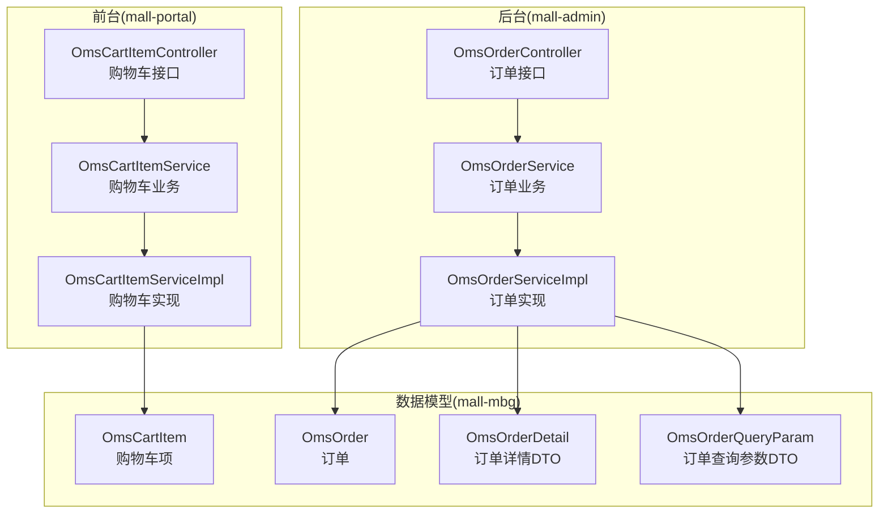
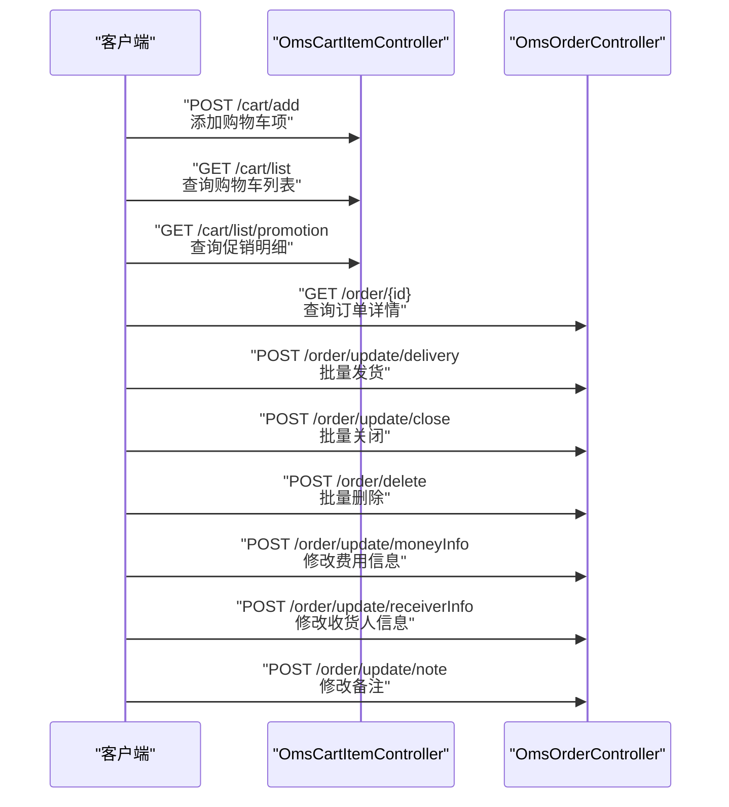
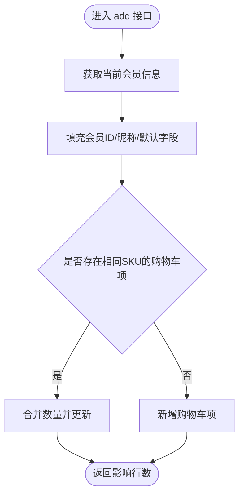
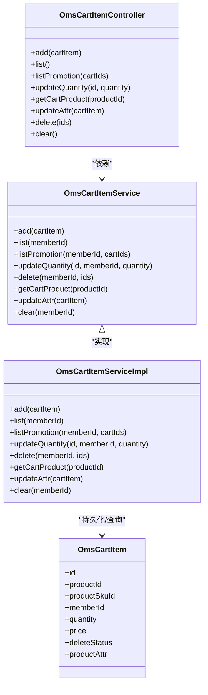
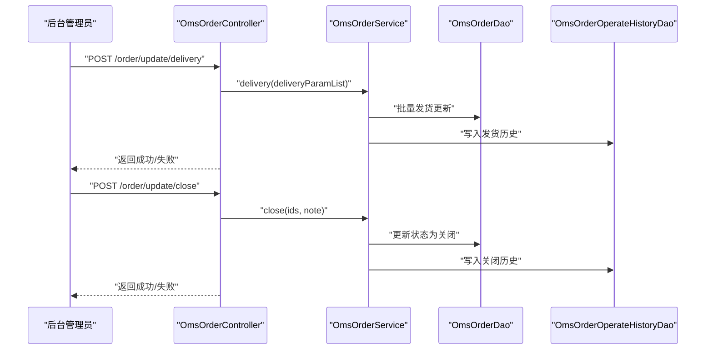
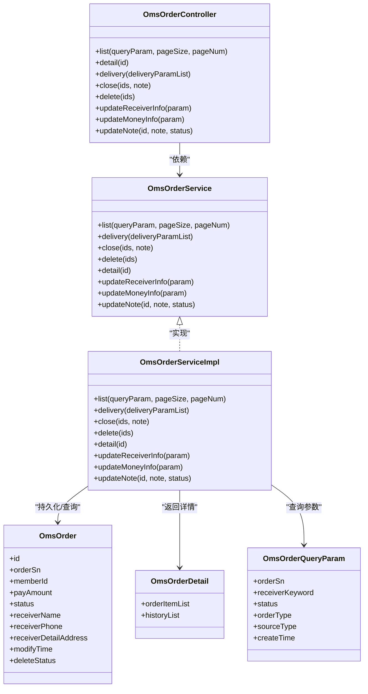
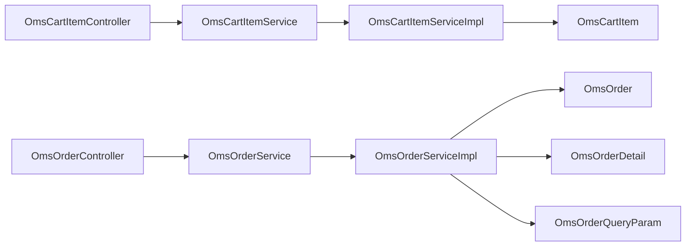

# 购物车订单API

<cite>
**本文引用的文件**   
- [README.md](file://README.md)
- [OmsCartItemController.java](file://mall-portal/src/main/java/com/macro/mall/portal/controller/OmsCartItemController.java)
- [OmsCartItemService.java](file://mall-portal/src/main/java/com/macro/mall/portal/service/OmsCartItemService.java)
- [OmsCartItemServiceImpl.java](file://mall-portal/src/main/java/com/macro/mall/portal/service/impl/OmsCartItemServiceImpl.java)
- [OmsOrderController.java](file://mall-admin/src/main/java/com/macro/mall/controller/OmsOrderController.java)
- [OmsOrderService.java](file://mall-admin/src/main/java/com/macro/mall/service/OmsOrderService.java)
- [OmsOrderServiceImpl.java](file://mall-admin/src/main/java/com/macro/mall/service/impl/OmsOrderServiceImpl.java)
- [OmsOrderDetail.java](file://mall-admin/src/main/java/com/macro/mall/dto/OmsOrderDetail.java)
- [OmsOrderQueryParam.java](file://mall-admin/src/main/java/com/macro/mall/dto/OmsOrderQueryParam.java)
- [OmsOrder.java](file://mall-mbg/src/main/java/com/macro/mall/model/OmsOrder.java)
- [OmsCartItem.java](file://mall-mbg/src/main/java/com/macro/mall/model/OmsCartItem.java)
</cite>

## 目录
1. [简介](#简介)
2. [项目结构](#项目结构)
3. [核心组件](#核心组件)
4. [架构总览](#架构总览)
5. [详细组件分析](#详细组件分析)
6. [依赖关系分析](#依赖关系分析)
7. [性能考量](#性能考量)
8. [故障排查指南](#故障排查指南)
9. [结论](#结论)
10. [附录](#附录)

## 简介
本文件聚焦于购物车与订单相关API的完整说明，覆盖以下能力：
- 购物车：商品添加、删除、数量修改、规格属性变更、清空、列表查询、促销价明细查询
- 结算与订单：订单状态查询、订单列表查询、订单发货、订单关闭、订单删除、订单详情、订单金额与收货人信息更新、订单备注更新
- 提供从“加入购物车”到“订单确认与支付”的端到端接口调用示例路径
- 说明订单数据模型、库存锁定机制与支付回调处理、订单状态同步策略

## 项目结构
- 前台商城系统 mall-portal 提供购物车相关接口
- 后台管理系统 mall-admin 提供订单管理相关接口
- 数据模型由 mall-mbg 的 MyBatis 生成类提供

**图表来源**
- [OmsCartItemController.java:1-101](file://mall-portal/src/main/java/com/macro/mall/portal/controller/OmsCartItemController.java#L1-L101)
- [OmsCartItemService.java:1-57](file://mall-portal/src/main/java/com/macro/mall/portal/service/OmsCartItemService.java#L1-L57)
- [OmsCartItemServiceImpl.java:1-140](file://mall-portal/src/main/java/com/macro/mall/portal/service/impl/OmsCartItemServiceImpl.java#L1-L140)
- [OmsOrderController.java:1-104](file://mall-admin/src/main/java/com/macro/mall/controller/OmsOrderController.java#L1-L104)
- [OmsOrderService.java:1-59](file://mall-admin/src/main/java/com/macro/mall/service/OmsOrderService.java#L1-L59)
- [OmsOrderServiceImpl.java:1-154](file://mall-admin/src/main/java/com/macro/mall/service/impl/OmsOrderServiceImpl.java#L1-L154)
- [OmsOrderDetail.java:1-23](file://mall-admin/src/main/java/com/macro/mall/dto/OmsOrderDetail.java#L1-L23)
- [OmsOrderQueryParam.java:1-20](file://mall-admin/src/main/java/com/macro/mall/dto/OmsOrderQueryParam.java#L1-L20)
- [OmsOrder.java:1-504](file://mall-mbg/src/main/java/com/macro/mall/model/OmsOrder.java#L1-L504)
- [OmsCartItem.java:1-218](file://mall-mbg/src/main/java/com/macro/mall/model/OmsCartItem.java#L1-L218)

**章节来源**
- [README.md:1-208](file://README.md#L1-L208)

## 核心组件
- 购物车控制器：提供添加、列表、促销明细、数量修改、规格变更、删除、清空等接口
- 购物车服务：定义购物车增删改查与促销价计算的契约
- 订单控制器：提供订单列表、详情、发货、关闭、删除、金额与收货人信息更新、备注更新等接口
- 订单服务：实现订单状态流转与历史记录写入
- 数据模型：OmsCartItem、OmsOrder 及其 DTO

**章节来源**
- [OmsCartItemController.java:1-101](file://mall-portal/src/main/java/com/macro/mall/portal/controller/OmsCartItemController.java#L1-L101)
- [OmsCartItemService.java:1-57](file://mall-portal/src/main/java/com/macro/mall/portal/service/OmsCartItemService.java#L1-L57)
- [OmsOrderController.java:1-104](file://mall-admin/src/main/java/com/macro/mall/controller/OmsOrderController.java#L1-L104)
- [OmsOrderService.java:1-59](file://mall-admin/src/main/java/com/macro/mall/service/OmsOrderService.java#L1-L59)

## 架构总览
- 前台通过购物车接口维护临时交易清单
- 后台负责订单生命周期管理与状态同步
- 订单详情与查询参数通过 DTO 封装，便于前后端交互

**图表来源**
- [OmsCartItemController.java:29-101](file://mall-portal/src/main/java/com/macro/mall/portal/controller/OmsCartItemController.java#L29-L101)
- [OmsOrderController.java:26-102](file://mall-admin/src/main/java/com/macro/mall/controller/OmsOrderController.java#L26-L102)

## 详细组件分析

### 购物车组件分析
- 接口能力
  - 添加购物车项：根据会员上下文自动填充会员信息，若同款已存在则合并数量
  - 查询购物车列表：按会员ID过滤未删除项
  - 查询促销明细：对选中或全量购物车项计算促销价并返回
  - 修改数量：按购物车项ID与会员ID更新数量
  - 规格变更：先逻辑删除旧项，再新增新规格项
  - 删除与清空：软删除标记为已删除
  - 获取商品规格选择信息：用于前端规格选择渲染

- 关键流程示意

**图表来源**
- [OmsCartItemServiceImpl.java:38-55](file://mall-portal/src/main/java/com/macro/mall/portal/service/impl/OmsCartItemServiceImpl.java#L38-L55)

- 类关系图

**图表来源**
- [OmsCartItemController.java:1-101](file://mall-portal/src/main/java/com/macro/mall/portal/controller/OmsCartItemController.java#L1-L101)
- [OmsCartItemService.java:1-57](file://mall-portal/src/main/java/com/macro/mall/portal/service/OmsCartItemService.java#L1-L57)
- [OmsCartItemServiceImpl.java:1-140](file://mall-portal/src/main/java/com/macro/mall/portal/service/impl/OmsCartItemServiceImpl.java#L1-L140)
- [OmsCartItem.java:1-218](file://mall-mbg/src/main/java/com/macro/mall/model/OmsCartItem.java#L1-L218)

**章节来源**
- [OmsCartItemController.java:1-101](file://mall-portal/src/main/java/com/macro/mall/portal/controller/OmsCartItemController.java#L1-L101)
- [OmsCartItemService.java:1-57](file://mall-portal/src/main/java/com/macro/mall/portal/service/OmsCartItemService.java#L1-L57)
- [OmsCartItemServiceImpl.java:1-140](file://mall-portal/src/main/java/com/macro/mall/portal/service/impl/OmsCartItemServiceImpl.java#L1-L140)
- [OmsCartItem.java:1-218](file://mall-mbg/src/main/java/com/macro/mall/model/OmsCartItem.java#L1-L218)

### 订单组件分析
- 接口能力
  - 订单列表：支持多条件分页查询
  - 订单详情：返回订单主体、订单项、历史记录
  - 批量发货：更新订单状态并写入操作历史
  - 批量关闭：更新订单状态为关闭并写入历史
  - 批量删除：软删除标记
  - 修改费用信息：运费、优惠等金额调整
  - 修改收货人信息：姓名、电话、地址等
  - 修改备注：带状态与操作人记录

- 关键流程示意

**图表来源**
- [OmsOrderController.java:35-53](file://mall-admin/src/main/java/com/macro/mall/controller/OmsOrderController.java#L35-L53)
- [OmsOrderServiceImpl.java:42-78](file://mall-admin/src/main/java/com/macro/mall/service/impl/OmsOrderServiceImpl.java#L42-L78)

- 类关系图

**图表来源**
- [OmsOrderController.java:1-104](file://mall-admin/src/main/java/com/macro/mall/controller/OmsOrderController.java#L1-L104)
- [OmsOrderService.java:1-59](file://mall-admin/src/main/java/com/macro/mall/service/OmsOrderService.java#L1-L59)
- [OmsOrderServiceImpl.java:1-154](file://mall-admin/src/main/java/com/macro/mall/service/impl/OmsOrderServiceImpl.java#L1-L154)
- [OmsOrderDetail.java:1-23](file://mall-admin/src/main/java/com/macro/mall/dto/OmsOrderDetail.java#L1-L23)
- [OmsOrderQueryParam.java:1-20](file://mall-admin/src/main/java/com/macro/mall/dto/OmsOrderQueryParam.java#L1-L20)
- [OmsOrder.java:1-504](file://mall-mbg/src/main/java/com/macro/mall/model/OmsOrder.java#L1-L504)

**章节来源**
- [OmsOrderController.java:1-104](file://mall-admin/src/main/java/com/macro/mall/controller/OmsOrderController.java#L1-L104)
- [OmsOrderService.java:1-59](file://mall-admin/src/main/java/com/macro/mall/service/OmsOrderService.java#L1-L59)
- [OmsOrderServiceImpl.java:1-154](file://mall-admin/src/main/java/com/macro/mall/service/impl/OmsOrderServiceImpl.java#L1-L154)
- [OmsOrderDetail.java:1-23](file://mall-admin/src/main/java/com/macro/mall/dto/OmsOrderDetail.java#L1-L23)
- [OmsOrderQueryParam.java:1-20](file://mall-admin/src/main/java/com/macro/mall/dto/OmsOrderQueryParam.java#L1-L20)
- [OmsOrder.java:1-504](file://mall-mbg/src/main/java/com/macro/mall/model/OmsOrder.java#L1-L504)

## 依赖关系分析
- 控制器依赖服务接口，服务实现依赖 DAO 与 Mapper
- 购物车与订单均采用软删除策略（deleteStatus 字段）
- 订单状态更新伴随操作历史记录写入，确保审计可追溯

**图表来源**
- [OmsCartItemController.java:1-101](file://mall-portal/src/main/java/com/macro/mall/portal/controller/OmsCartItemController.java#L1-L101)
- [OmsCartItemService.java:1-57](file://mall-portal/src/main/java/com/macro/mall/portal/service/OmsCartItemService.java#L1-L57)
- [OmsCartItemServiceImpl.java:1-140](file://mall-portal/src/main/java/com/macro/mall/portal/service/impl/OmsCartItemServiceImpl.java#L1-L140)
- [OmsOrderController.java:1-104](file://mall-admin/src/main/java/com/macro/mall/controller/OmsOrderController.java#L1-L104)
- [OmsOrderService.java:1-59](file://mall-admin/src/main/java/com/macro/mall/service/OmsOrderService.java#L1-L59)
- [OmsOrderServiceImpl.java:1-154](file://mall-admin/src/main/java/com/macro/mall/service/impl/OmsOrderServiceImpl.java#L1-L154)
- [OmsOrderDetail.java:1-23](file://mall-admin/src/main/java/com/macro/mall/dto/OmsOrderDetail.java#L1-L23)
- [OmsOrderQueryParam.java:1-20](file://mall-admin/src/main/java/com/macro/mall/dto/OmsOrderQueryParam.java#L1-L20)
- [OmsOrder.java:1-504](file://mall-mbg/src/main/java/com/macro/mall/model/OmsOrder.java#L1-L504)
- [OmsCartItem.java:1-218](file://mall-mbg/src/main/java/com/macro/mall/model/OmsCartItem.java#L1-L218)

**章节来源**
- [OmsCartItemServiceImpl.java:1-140](file://mall-portal/src/main/java/com/macro/mall/portal/service/impl/OmsCartItemServiceImpl.java#L1-L140)
- [OmsOrderServiceImpl.java:1-154](file://mall-admin/src/main/java/com/macro/mall/service/impl/OmsOrderServiceImpl.java#L1-L154)

## 性能考量
- 购物车查询建议按会员ID与未删除状态建立索引，避免全表扫描
- 促销价计算涉及跨服务调用，建议缓存促销规则与商品价格以降低重复计算成本
- 订单列表查询使用分页组件，注意合理设置分页大小与排序字段索引
- 批量操作（发货、关闭、删除）应控制单次批量大小，避免长事务与锁竞争

## 故障排查指南
- 购物车数量更新失败
  - 检查传入的购物车项ID与会员ID是否匹配且未被删除
  - 确认请求参数类型与范围
- 订单状态更新无效
  - 检查订单是否已被删除（deleteStatus=1）
  - 确认状态值与业务状态映射一致
- 订单历史缺失
  - 确认服务方法是否正确写入操作历史记录
- 收货人/费用信息更新未生效
  - 检查请求体字段与实体字段映射是否一致

**章节来源**
- [OmsCartItemServiceImpl.java:94-102](file://mall-portal/src/main/java/com/macro/mall/portal/service/impl/OmsCartItemServiceImpl.java#L94-L102)
- [OmsOrderServiceImpl.java:61-78](file://mall-admin/src/main/java/com/macro/mall/service/impl/OmsOrderServiceImpl.java#L61-L78)
- [OmsOrderServiceImpl.java:95-116](file://mall-admin/src/main/java/com/macro/mall/service/impl/OmsOrderServiceImpl.java#L95-L116)
- [OmsOrderServiceImpl.java:118-135](file://mall-admin/src/main/java/com/macro/mall/service/impl/OmsOrderServiceImpl.java#L118-L135)
- [OmsOrderServiceImpl.java:137-152](file://mall-admin/src/main/java/com/macro/mall/service/impl/OmsOrderServiceImpl.java#L137-L152)

## 结论
本文档梳理了购物车与订单模块的接口能力、数据模型与关键流程，提供了从购物车到订单的端到端调用路径与排障要点。实际生产中建议结合缓存、异步消息与幂等设计进一步完善库存锁定、支付回调与状态同步。

## 附录

### 购物车接口规范
- 添加购物车项
  - 方法与路径：POST /cart/add
  - 请求体：购物车项对象（包含商品ID、SKU、数量、价格等）
  - 返回：成功/失败
- 查询购物车列表
  - 方法与路径：GET /cart/list
  - 返回：购物车项列表
- 查询促销明细
  - 方法与路径：GET /cart/list/promotion
  - 查询参数：cartIds（可选，指定购物车项ID集合）
  - 返回：促销明细列表
- 修改数量
  - 方法与路径：GET /cart/update/quantity
  - 查询参数：id、quantity
  - 返回：成功/失败
- 规格变更
  - 方法与路径：POST /cart/update/attr
  - 请求体：购物车项（含新规格）
  - 返回：成功/失败
- 删除购物车项
  - 方法与路径：POST /cart/delete
  - 请求体：ids（ID列表）
  - 返回：成功/失败
- 清空购物车
  - 方法与路径：POST /cart/clear
  - 返回：成功/失败

**章节来源**
- [OmsCartItemController.java:29-101](file://mall-portal/src/main/java/com/macro/mall/portal/controller/OmsCartItemController.java#L29-L101)

### 订单接口规范
- 订单列表
  - 方法与路径：GET /order/list
  - 查询参数：OmsOrderQueryParam、pageNum、pageSize
  - 返回：分页结果
- 订单详情
  - 方法与路径：GET /order/{id}
  - 返回：OmsOrderDetail（包含订单项与历史）
- 批量发货
  - 方法与路径：POST /order/update/delivery
  - 请求体：OmsOrderDeliveryParam 列表
  - 返回：成功/失败
- 批量关闭
  - 方法与路径：POST /order/update/close
  - 请求体：ids、note
  - 返回：成功/失败
- 批量删除
  - 方法与路径：POST /order/delete
  - 请求体：ids
  - 返回：成功/失败
- 修改费用信息
  - 方法与路径：POST /order/update/moneyInfo
  - 请求体：OmsMoneyInfoParam
  - 返回：成功/失败
- 修改收货人信息
  - 方法与路径：POST /order/update/receiverInfo
  - 请求体：OmsReceiverInfoParam
  - 返回：成功/失败
- 修改备注
  - 方法与路径：POST /order/update/note
  - 请求体：id、note、status
  - 返回：成功/失败

**章节来源**
- [OmsOrderController.java:26-102](file://mall-admin/src/main/java/com/macro/mall/controller/OmsOrderController.java#L26-L102)
- [OmsOrderDetail.java:1-23](file://mall-admin/src/main/java/com/macro/mall/dto/OmsOrderDetail.java#L1-L23)
- [OmsOrderQueryParam.java:1-20](file://mall-admin/src/main/java/com/macro/mall/dto/OmsOrderQueryParam.java#L1-L20)

### 订单数据模型与字段说明
- OmsOrder 关键字段
  - 订单标识：id、orderSn
  - 会员信息：memberId、memberUsername
  - 金额信息：totalAmount、payAmount、freightAmount、promotionAmount、couponAmount、discountAmount、integrationAmount
  - 支付与来源：payType、sourceType
  - 状态与类型：status、orderType
  - 物流信息：deliveryCompany、deliverySn
  - 收货人信息：receiverName、receiverPhone、receiverPostCode、receiverProvince、receiverCity、receiverRegion、receiverDetailAddress
  - 时间与审计：createTime、paymentTime、deliveryTime、receiveTime、commentTime、modifyTime、deleteStatus
- OmsCartItem 关键字段
  - 商品与SKU：productId、productSkuId、productSn、productAttr
  - 数量与价格：quantity、price
  - 会员与时间：memberId、memberNickname、createDate、modifyDate、deleteStatus

**章节来源**
- [OmsOrder.java:1-504](file://mall-mbg/src/main/java/com/macro/mall/model/OmsOrder.java#L1-L504)
- [OmsCartItem.java:1-218](file://mall-mbg/src/main/java/com/macro/mall/model/OmsCartItem.java#L1-L218)

### 购物流程端到端示例（接口组合）
- 步骤
  1) 加入购物车：POST /cart/add
  2) 查看购物车：GET /cart/list
  3) 计算促销明细：GET /cart/list/promotion
  4) 确认下单：前端根据促销明细生成订单（此处为业务流程示意，具体下单接口不在本仓库中）
  5) 订单查询：GET /order/{id}
  6) 发货处理：POST /order/update/delivery
  7) 订单关闭（如需要）：POST /order/update/close
  8) 订单删除（如需要）：POST /order/delete
  9) 修改费用/收货人信息：POST /order/update/moneyInfo、POST /order/update/receiverInfo
  10) 修改备注：POST /order/update/note

**章节来源**
- [OmsCartItemController.java:29-101](file://mall-portal/src/main/java/com/macro/mall/portal/controller/OmsCartItemController.java#L29-L101)
- [OmsOrderController.java:26-102](file://mall-admin/src/main/java/com/macro/mall/controller/OmsOrderController.java#L26-L102)

### 订单状态与同步策略
- 状态字段：status
  - 建议在服务实现中统一映射状态常量，保证前后端一致
- 状态同步
  - 批量发货/关闭/删除均写入操作历史，便于审计与回溯
- 库存锁定机制
  - 建议在下单阶段进行库存锁定与超时释放；支付完成后确认扣减或取消锁定
- 支付回调处理
  - 建议通过消息队列异步处理支付回调，幂等校验订单状态与支付流水，防止重复处理

**章节来源**
- [OmsOrderServiceImpl.java:42-78](file://mall-admin/src/main/java/com/macro/mall/service/impl/OmsOrderServiceImpl.java#L42-L78)
- [OmsOrderServiceImpl.java:95-116](file://mall-admin/src/main/java/com/macro/mall/service/impl/OmsOrderServiceImpl.java#L95-L116)
- [OmsOrderServiceImpl.java:118-135](file://mall-admin/src/main/java/com/macro/mall/service/impl/OmsOrderServiceImpl.java#L118-L135)
- [OmsOrderServiceImpl.java:137-152](file://mall-admin/src/main/java/com/macro/mall/service/impl/OmsOrderServiceImpl.java#L137-L152)