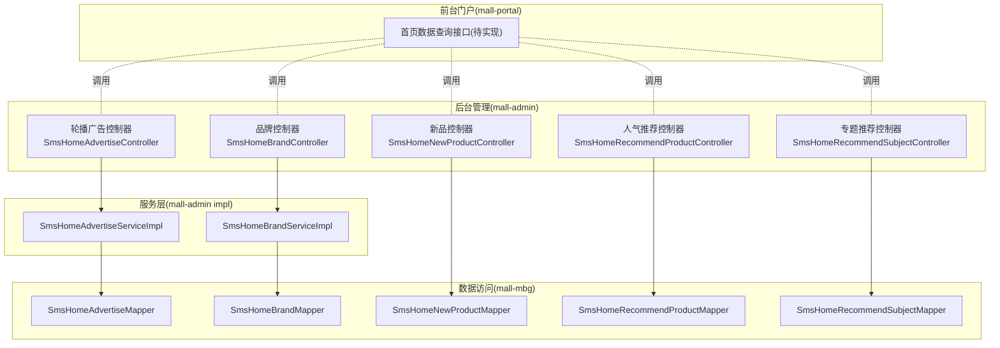
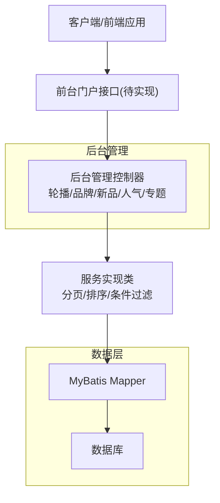
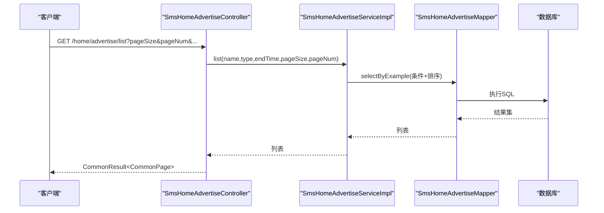
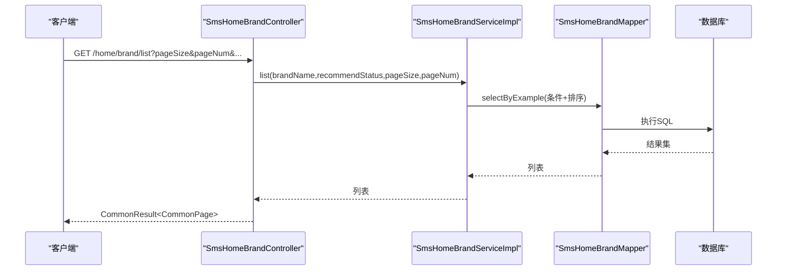
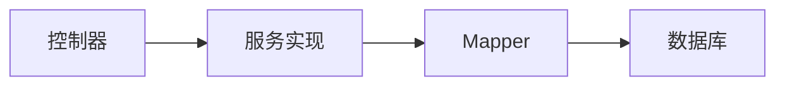

# 首页相关API

<cite>
**本文引用的文件**
- [README.md](file://README.md)
- [SmsHomeAdvertiseController.java](file://mall-admin/src/main/java/com/macro/mall/controller/SmsHomeAdvertiseController.java)
- [SmsHomeBrandController.java](file://mall-admin/src/main/java/com/macro/mall/controller/SmsHomeBrandController.java)
- [SmsHomeNewProductController.java](file://mall-admin/src/main/java/com/macro/mall/controller/SmsHomeNewProductController.java)
- [SmsHomeRecommendProductController.java](file://mall-admin/src/main/java/com/macro/mall/controller/SmsHomeRecommendProductController.java)
- [SmsHomeRecommendSubjectController.java](file://mall-admin/src/main/java/com/macro/mall/controller/SmsHomeRecommendSubjectController.java)
- [SmsHomeAdvertiseServiceImpl.java](file://mall-admin/src/main/java/com/macro/mall/service/impl/SmsHomeAdvertiseServiceImpl.java)
- [SmsHomeBrandServiceImpl.java](file://mall-admin/src/main/java/com/macro/mall/service/impl/SmsHomeBrandServiceImpl.java)
- [SmsHomeAdvertiseMapper.java](file://mall-mbg/src/main/java/com/macro/mall/mapper/SmsHomeAdvertiseMapper.java)
- [SmsHomeBrandMapper.java](file://mall-mbg/src/main/java/com/macro/mall/mapper/SmsHomeBrandMapper.java)
- [SmsHomeNewProductMapper.java](file://mall-mbg/src/main/java/com/macro/mall/mapper/SmsHomeNewProductMapper.java)
- [SmsHomeRecommendProductMapper.java](file://mall-mbg/src/main/java/com/macro/mall/mapper/SmsHomeRecommendProductMapper.java)
- [SmsHomeRecommendSubjectMapper.java](file://mall-mbg/src/main/java/com/macro/mall/mapper/SmsHomeRecommendSubjectMapper.java)
- [application.yml](file://mall-portal/src/main/resources/application.yml)
- [mall-portal Postman 集合](file://document/postman/mall-portal.postman_collection.json)
</cite>

## 目录
1. [简介](#简介)
2. [项目结构](#项目结构)
3. [核心组件](#核心组件)
4. [架构总览](#架构总览)
5. [详细组件分析](#详细组件分析)
6. [依赖分析](#依赖分析)
7. [性能考虑](#性能考虑)
8. [故障排查指南](#故障排查指南)
9. [结论](#结论)
10. [附录](#附录)

## 简介
本文件聚焦“首页相关API”的设计与实现，覆盖以下首页内容的数据来源与接口定义：
- 首页轮播图
- 新品推荐
- 人气推荐
- 专题推荐
- 品牌专区

同时，文档说明首页数据聚合逻辑、缓存策略建议、内容排序规则与展示样式规范，并提供首页数据加载的完整接口调用示例（异步加载、懒加载、分页展示），以及性能优化策略、CDN加速与静态资源管理方案。

## 项目结构
- 后端采用多模块架构，首页相关内容主要通过后台管理模块提供的接口进行维护与配置；前台门户模块负责对外提供首页数据查询接口。
- 项目整体模块划分与技术栈见项目自述文件中的模块介绍与技术选型部分。

**图表来源**
- [SmsHomeAdvertiseController.java:1-79](file://mall-admin/src/main/java/com/macro/mall/controller/SmsHomeAdvertiseController.java#L1-L79)
- [SmsHomeBrandController.java:1-75](file://mall-admin/src/main/java/com/macro/mall/controller/SmsHomeBrandController.java#L1-L75)
- [SmsHomeNewProductController.java:1-75](file://mall-admin/src/main/java/com/macro/mall/controller/SmsHomeNewProductController.java#L1-L75)
- [SmsHomeRecommendProductController.java:1-75](file://mall-admin/src/main/java/com/macro/mall/controller/SmsHomeRecommendProductController.java#L1-L75)
- [SmsHomeRecommendSubjectController.java:1-75](file://mall-admin/src/main/java/com/macro/mall/controller/SmsHomeRecommendSubjectController.java#L1-L75)
- [SmsHomeAdvertiseServiceImpl.java:1-94](file://mall-admin/src/main/java/com/macro/mall/service/impl/SmsHomeAdvertiseServiceImpl.java#L1-L94)
- [SmsHomeBrandServiceImpl.java:1-71](file://mall-admin/src/main/java/com/macro/mall/service/impl/SmsHomeBrandServiceImpl.java#L1-L71)
- [SmsHomeAdvertiseMapper.java](file://mall-mbg/src/main/java/com/macro/mall/mapper/SmsHomeAdvertiseMapper.java)
- [SmsHomeBrandMapper.java](file://mall-mbg/src/main/java/com/macro/mall/mapper/SmsHomeBrandMapper.java)
- [SmsHomeNewProductMapper.java](file://mall-mbg/src/main/java/com/macro/mall/mapper/SmsHomeNewProductMapper.java)
- [SmsHomeRecommendProductMapper.java](file://mall-mbg/src/main/java/com/macro/mall/mapper/SmsHomeRecommendProductMapper.java)
- [SmsHomeRecommendSubjectMapper.java](file://mall-mbg/src/main/java/com/macro/mall/mapper/SmsHomeRecommendSubjectMapper.java)

**章节来源**
- [README.md:51-62](file://README.md#L51-L62)

## 核心组件
- 控制器层：提供REST接口，接收参数并返回统一响应包装。
- 服务层：实现业务逻辑，包含分页、条件过滤、排序等。
- 数据访问层：基于MyBatis Mapper执行数据库操作。
- 前台门户：对外提供首页数据查询接口（当前仓库未包含具体实现，可在门户模块中按本文规范扩展）。

**章节来源**
- [SmsHomeAdvertiseController.java:1-79](file://mall-admin/src/main/java/com/macro/mall/controller/SmsHomeAdvertiseController.java#L1-L79)
- [SmsHomeBrandController.java:1-75](file://mall-admin/src/main/java/com/macro/mall/controller/SmsHomeBrandController.java#L1-L75)
- [SmsHomeNewProductController.java:1-75](file://mall-admin/src/main/java/com/macro/mall/controller/SmsHomeNewProductController.java#L1-L75)
- [SmsHomeRecommendProductController.java:1-75](file://mall-admin/src/main/java/com/macro/mall/controller/SmsHomeRecommendProductController.java#L1-L75)
- [SmsHomeRecommendSubjectController.java:1-75](file://mall-admin/src/main/java/com/macro/mall/controller/SmsHomeRecommendSubjectController.java#L1-L75)
- [SmsHomeAdvertiseServiceImpl.java:1-94](file://mall-admin/src/main/java/com/macro/mall/service/impl/SmsHomeAdvertiseServiceImpl.java#L1-L94)
- [SmsHomeBrandServiceImpl.java:1-71](file://mall-admin/src/main/java/com/macro/mall/service/impl/SmsHomeBrandServiceImpl.java#L1-L71)

## 架构总览
下图展示了首页各模块间的关系与调用方向，以及数据流向。

**图表来源**
- [SmsHomeAdvertiseController.java:1-79](file://mall-admin/src/main/java/com/macro/mall/controller/SmsHomeAdvertiseController.java#L1-L79)
- [SmsHomeBrandController.java:1-75](file://mall-admin/src/main/java/com/macro/mall/controller/SmsHomeBrandController.java#L1-L75)
- [SmsHomeNewProductController.java:1-75](file://mall-admin/src/main/java/com/macro/mall/controller/SmsHomeNewProductController.java#L1-L75)
- [SmsHomeRecommendProductController.java:1-75](file://mall-admin/src/main/java/com/macro/mall/controller/SmsHomeRecommendProductController.java#L1-L75)
- [SmsHomeRecommendSubjectController.java:1-75](file://mall-admin/src/main/java/com/macro/mall/controller/SmsHomeRecommendSubjectController.java#L1-L75)
- [SmsHomeAdvertiseServiceImpl.java:1-94](file://mall-admin/src/main/java/com/macro/mall/service/impl/SmsHomeAdvertiseServiceImpl.java#L1-L94)
- [SmsHomeBrandServiceImpl.java:1-71](file://mall-admin/src/main/java/com/macro/mall/service/impl/SmsHomeBrandServiceImpl.java#L1-L71)

## 详细组件分析

### 首页轮播图 API
- 接口路径：/home/advertise
- 支持操作：
  - 创建：POST /home/advertise/create
  - 删除：POST /home/advertise/delete
  - 更新状态：POST /home/advertise/update/status/{id}
  - 获取单个：GET /home/advertise/{id}
  - 更新：POST /home/advertise/update/{id}
  - 分页列表：GET /home/advertise/list
- 查询参数：
  - name：名称（模糊匹配）
  - type：类型
  - endTime：结束时间（用于筛选活动区间）
  - pageSize/pageNum：分页参数
- 排序规则：按 sort 字段降序
- 返回：统一结果包装，分页对象包含记录列表

**图表来源**
- [SmsHomeAdvertiseController.java:68-77](file://mall-admin/src/main/java/com/macro/mall/controller/SmsHomeAdvertiseController.java#L68-L77)
- [SmsHomeAdvertiseServiceImpl.java:60-92](file://mall-admin/src/main/java/com/macro/mall/service/impl/SmsHomeAdvertiseServiceImpl.java#L60-L92)
- [SmsHomeAdvertiseMapper.java](file://mall-mbg/src/main/java/com/macro/mall/mapper/SmsHomeAdvertiseMapper.java)

**章节来源**
- [SmsHomeAdvertiseController.java:1-79](file://mall-admin/src/main/java/com/macro/mall/controller/SmsHomeAdvertiseController.java#L1-L79)
- [SmsHomeAdvertiseServiceImpl.java:1-94](file://mall-admin/src/main/java/com/macro/mall/service/impl/SmsHomeAdvertiseServiceImpl.java#L1-L94)

### 品牌专区 API
- 接口路径：/home/brand
- 支持操作：
  - 批量创建：POST /home/brand/create
  - 更新排序：POST /home/brand/update/sort/{id}
  - 删除：POST /home/brand/delete
  - 更新推荐状态：POST /home/brand/update/recommendStatus
  - 分页列表：GET /home/brand/list
- 查询参数：
  - brandName：品牌名（模糊匹配）
  - recommendStatus：推荐状态
  - pageSize/pageNum：分页参数
- 排序规则：按 sort 字段降序

**图表来源**
- [SmsHomeBrandController.java:65-73](file://mall-admin/src/main/java/com/macro/mall/controller/SmsHomeBrandController.java#L65-L73)
- [SmsHomeBrandServiceImpl.java:56-69](file://mall-admin/src/main/java/com/macro/mall/service/impl/SmsHomeBrandServiceImpl.java#L56-L69)
- [SmsHomeBrandMapper.java](file://mall-mbg/src/main/java/com/macro/mall/mapper/SmsHomeBrandMapper.java)

**章节来源**
- [SmsHomeBrandController.java:1-75](file://mall-admin/src/main/java/com/macro/mall/controller/SmsHomeBrandController.java#L1-L75)
- [SmsHomeBrandServiceImpl.java:1-71](file://mall-admin/src/main/java/com/macro/mall/service/impl/SmsHomeBrandServiceImpl.java#L1-L71)

### 新品推荐 API
- 接口路径：/home/newProduct
- 支持操作：
  - 批量创建：POST /home/newProduct/create
  - 更新排序：POST /home/newProduct/update/sort/{id}
  - 删除：POST /home/newProduct/delete
  - 更新推荐状态：POST /home/newProduct/update/recommendStatus
  - 分页列表：GET /home/newProduct/list
- 查询参数：
  - productName：商品名（模糊匹配）
  - recommendStatus：推荐状态
  - pageSize/pageNum：分页参数
- 排序规则：默认按 sort 字段降序

**章节来源**
- [SmsHomeNewProductController.java:1-75](file://mall-admin/src/main/java/com/macro/mall/controller/SmsHomeNewProductController.java#L1-L75)
- [SmsHomeNewProductMapper.java](file://mall-mbg/src/main/java/com/macro/mall/mapper/SmsHomeNewProductMapper.java)

### 人气推荐 API
- 接口路径：/home/recommendProduct
- 支持操作：
  - 批量创建：POST /home/recommendProduct/create
  - 更新排序：POST /home/recommendProduct/update/sort/{id}
  - 删除：POST /home/recommendProduct/delete
  - 更新推荐状态：POST /home/recommendProduct/update/recommendStatus
  - 分页列表：GET /home/recommendProduct/list
- 查询参数：
  - productName：商品名（模糊匹配）
  - recommendStatus：推荐状态
  - pageSize/pageNum：分页参数
- 排序规则：默认按 sort 字段降序

**章节来源**
- [SmsHomeRecommendProductController.java:1-75](file://mall-admin/src/main/java/com/macro/mall/controller/SmsHomeRecommendProductController.java#L1-L75)
- [SmsHomeRecommendProductMapper.java](file://mall-mbg/src/main/java/com/macro/mall/mapper/SmsHomeRecommendProductMapper.java)

### 专题推荐 API
- 接口路径：/home/recommendSubject
- 支持操作：
  - 批量创建：POST /home/recommendSubject/create
  - 更新排序：POST /home/recommendSubject/update/sort/{id}
  - 删除：POST /home/recommendSubject/delete
  - 更新推荐状态：POST /home/recommendSubject/update/recommendStatus
  - 分页列表：GET /home/recommendSubject/list
- 查询参数：
  - subjectName：专题名（模糊匹配）
  - recommendStatus：推荐状态
  - pageSize/pageNum：分页参数
- 排序规则：默认按 sort 字段降序

**章节来源**
- [SmsHomeRecommendSubjectController.java:1-75](file://mall-admin/src/main/java/com/macro/mall/controller/SmsHomeRecommendSubjectController.java#L1-L75)
- [SmsHomeRecommendSubjectMapper.java](file://mall-mbg/src/main/java/com/macro/mall/mapper/SmsHomeRecommendSubjectMapper.java)

### 首页数据聚合与展示规范
- 聚合逻辑建议：
  - 前台门户模块提供统一的首页聚合接口，内部依次调用上述各模块的分页列表接口，组装成首页数据包。
  - 对于轮播图、品牌、新品、人气、专题等模块，分别以独立数组字段返回。
- 缓存策略建议：
  - 首页聚合结果可采用多级缓存：本地缓存（短时效）、分布式缓存（Redis）。
  - 缓存键建议包含版本号或时间戳，避免脏读；更新任一模块数据时，清理对应缓存。
- 内容排序规则：
  - 各模块均按 sort 字段降序排列；若需要额外排序，可在服务层增加复合排序条件。
- 展示样式规范：
  - 轮播图：图片URL、跳转链接、标题、描述等字段；建议提供缩略图与原图字段。
  - 品牌专区：品牌Logo、名称、推荐标识、排序值。
  - 新品/人气/专题：标题、副标题、封面图、跳转链接、状态标识。

**章节来源**
- [SmsHomeAdvertiseServiceImpl.java:90-90](file://mall-admin/src/main/java/com/macro/mall/service/impl/SmsHomeAdvertiseServiceImpl.java#L90-L90)
- [SmsHomeBrandServiceImpl.java:67-67](file://mall-admin/src/main/java/com/macro/mall/service/impl/SmsHomeBrandServiceImpl.java#L67-L67)

## 依赖分析
- 控制器依赖服务层，服务层依赖Mapper，Mapper依赖数据库。
- 各模块之间低耦合，通过统一的响应包装与分页对象解耦。
- 前台门户模块与后台管理模块通过HTTP接口交互，便于前后端分离部署。

**图表来源**
- [SmsHomeAdvertiseController.java:1-79](file://mall-admin/src/main/java/com/macro/mall/controller/SmsHomeAdvertiseController.java#L1-L79)
- [SmsHomeAdvertiseServiceImpl.java:1-94](file://mall-admin/src/main/java/com/macro/mall/service/impl/SmsHomeAdvertiseServiceImpl.java#L1-L94)
- [SmsHomeAdvertiseMapper.java](file://mall-mbg/src/main/java/com/macro/mall/mapper/SmsHomeAdvertiseMapper.java)

**章节来源**
- [SmsHomeAdvertiseController.java:1-79](file://mall-admin/src/main/java/com/macro/mall/controller/SmsHomeAdvertiseController.java#L1-L79)
- [SmsHomeBrandController.java:1-75](file://mall-admin/src/main/java/com/macro/mall/controller/SmsHomeBrandController.java#L1-L75)
- [SmsHomeNewProductController.java:1-75](file://mall-admin/src/main/java/com/macro/mall/controller/SmsHomeNewProductController.java#L1-L75)
- [SmsHomeRecommendProductController.java:1-75](file://mall-admin/src/main/java/com/macro/mall/controller/SmsHomeRecommendProductController.java#L1-L75)
- [SmsHomeRecommendSubjectController.java:1-75](file://mall-admin/src/main/java/com/macro/mall/controller/SmsHomeRecommendSubjectController.java#L1-L75)

## 性能考虑
- 分页与排序：
  - 使用分页插件限制单页数量，默认分页参数已在控制器中设置，避免一次性拉取大量数据。
  - 排序字段固定，减少复杂索引与排序开销。
- 缓存：
  - 首页聚合结果建议缓存，热点数据可预热；更新任一模块时失效对应缓存。
- 并发与限流：
  - 在网关或控制器层增加限流策略，防止突发流量击穿后端。
- CDN与静态资源：
  - 图片与静态资源走CDN，缩短首屏加载时间；对图片进行压缩与格式优化（如WebP）。
- 异步与懒加载：
  - 首屏仅加载必要模块，其他模块采用懒加载或滚动加载；结合骨架屏提升感知速度。
- 数据库优化：
  - 为常用查询字段建立合适索引；避免N+1查询，尽量批量加载。

## 故障排查指南
- 常见问题：
  - 分页参数无效：检查 pageSize/pageNum 是否传入且合理。
  - 条件查询无结果：确认模糊匹配字段是否正确传入；注意大小写与空格。
  - 排序异常：确认 sort 字段是否存在且有效。
- 排查步骤：
  - 查看控制器日志与统一异常处理输出。
  - 核对服务层分页与条件构造逻辑。
  - 使用数据库客户端直接执行Mapper对应的SQL验证。
- 建议：
  - 在服务层增加必要的参数校验与边界判断。
  - 对关键接口增加监控埋点与链路追踪。

**章节来源**
- [SmsHomeAdvertiseController.java:68-77](file://mall-admin/src/main/java/com/macro/mall/controller/SmsHomeAdvertiseController.java#L68-L77)
- [SmsHomeBrandController.java:65-73](file://mall-admin/src/main/java/com/macro/mall/controller/SmsHomeBrandController.java#L65-L73)
- [SmsHomeNewProductController.java:65-73](file://mall-admin/src/main/java/com/macro/mall/controller/SmsHomeNewProductController.java#L65-L73)
- [SmsHomeRecommendProductController.java:65-73](file://mall-admin/src/main/java/com/macro/mall/controller/SmsHomeRecommendProductController.java#L65-L73)
- [SmsHomeRecommendSubjectController.java:65-73](file://mall-admin/src/main/java/com/macro/mall/controller/SmsHomeRecommendSubjectController.java#L65-L73)

## 结论
本文梳理了首页轮播图、品牌专区、新品推荐、人气推荐、专题推荐等模块的后台管理接口与实现要点，并给出了首页数据聚合、缓存策略、排序规则与展示规范的实践建议。建议在前台门户模块中实现统一的首页聚合接口，结合缓存与CDN策略，确保首页高性能与高可用。

## 附录

### 首页数据加载接口调用示例（概念性说明）
- 异步加载：
  - 首屏加载：仅请求轮播图与品牌专区的基础数据。
  - 后续异步：在用户滚动至相应区域时，再请求新品、人气、专题等模块数据。
- 懒加载：
  - 将非首屏模块延迟渲染，减少初始渲染压力。
- 分页展示：
  - 每个模块使用独立分页参数，避免跨模块数据污染。
- 前端实现要点：
  - 使用骨架屏与占位图提升感知速度。
  - 对图片资源启用懒加载与CDN加速。
  - 对高频接口增加本地缓存与去重请求。

### 首页接口调用参考（Postman）
- 项目提供了前后端接口集合，可在Postman中导入并调试：
  - [mall-portal.postman_collection.json](file://document/postman/mall-portal.postman_collection.json)
- 建议：
  - 在Postman中为每个模块准备独立的环境变量（如基础URL、鉴权信息）。
  - 为分页与条件查询准备多组示例请求，便于联调与压测。

**章节来源**
- [application.yml](file://mall-portal/src/main/resources/application.yml)