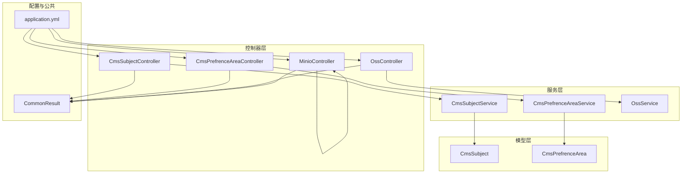
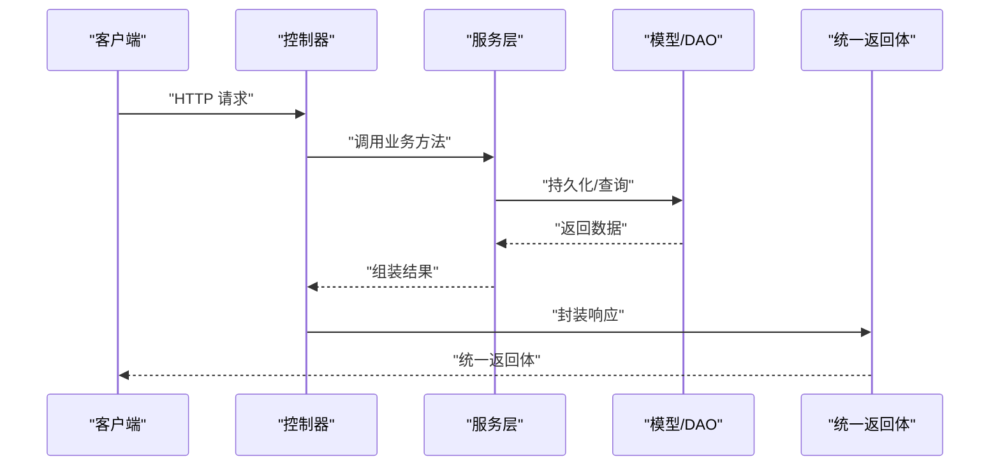
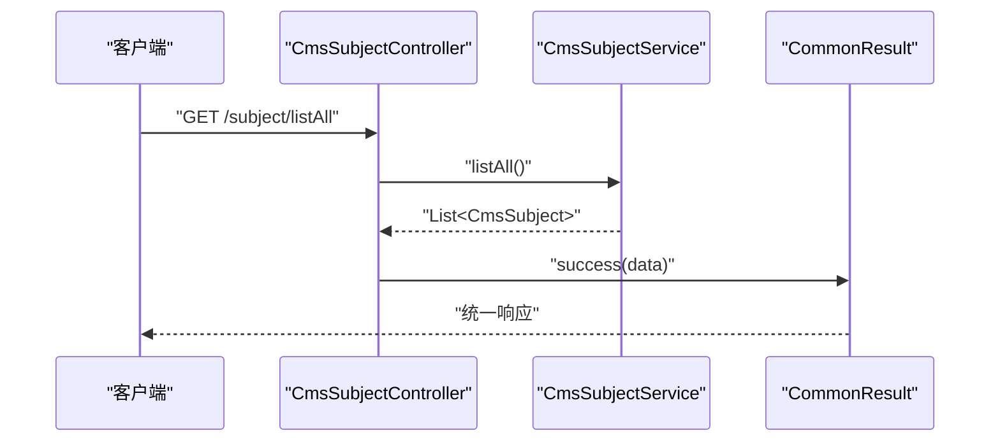
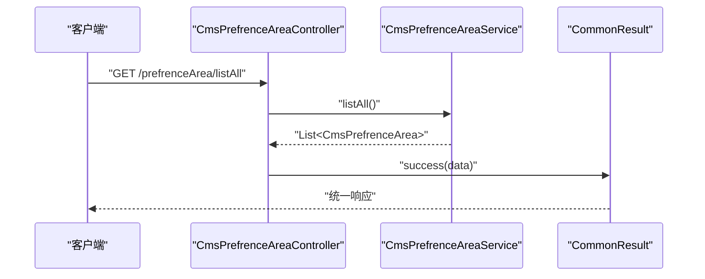
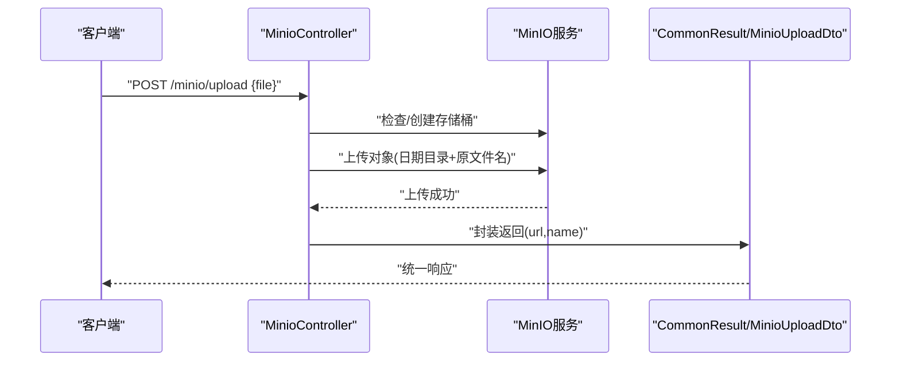
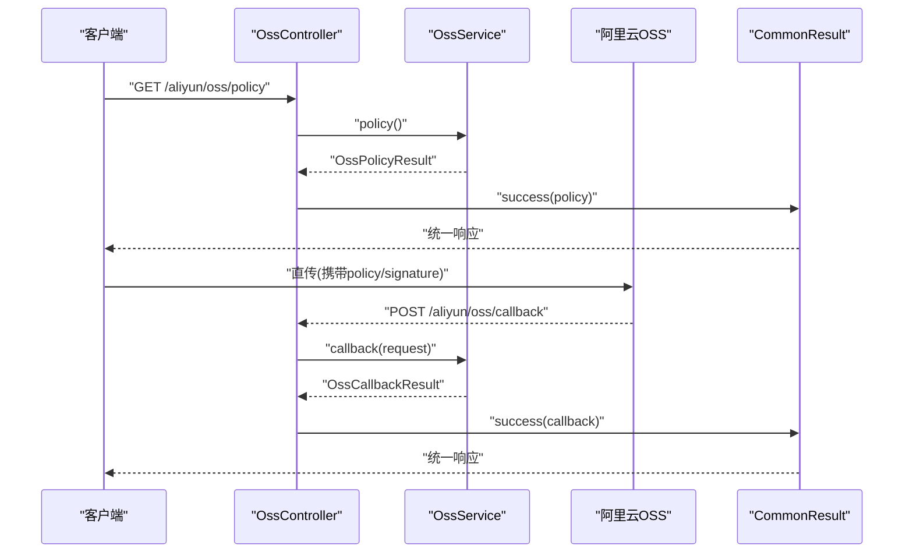
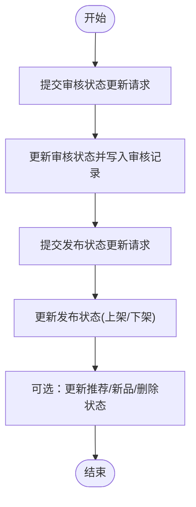
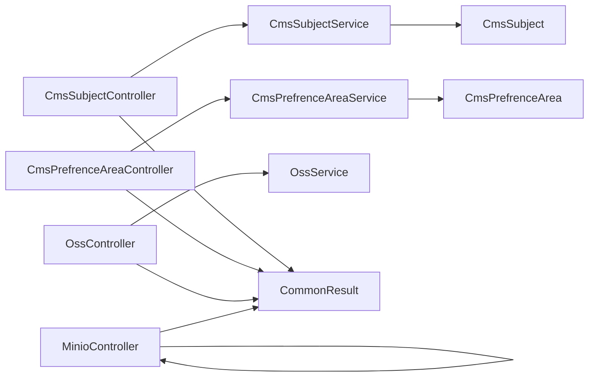

# 内容管理API

<cite>
**本文引用的文件**
- [CmsSubjectController.java](file://mall-admin/src/main/java/com/macro/mall/controller/CmsSubjectController.java)
- [CmsSubjectService.java](file://mall-admin/src/main/java/com/macro/mall/service/CmsSubjectService.java)
- [CmsSubject.java](file://mall-mbg/src/main/java/com/macro/mall/model/CmsSubject.java)
- [CmsPrefrenceAreaController.java](file://mall-admin/src/main/java/com/macro/mall/controller/CmsPrefrenceAreaController.java)
- [CmsPrefrenceAreaService.java](file://mall-admin/src/main/java/com/macro/mall/service/CmsPrefrenceAreaService.java)
- [CmsPrefrenceArea.java](file://mall-mbg/src/main/java/com/macro/mall/model/CmsPrefrenceArea.java)
- [OssController.java](file://mall-admin/src/main/java/com/macro/mall/controller/OssController.java)
- [OssService.java](file://mall-admin/src/main/java/com/macro/mall/service/OssService.java)
- [OssPolicyResult.java](file://mall-admin/src/main/java/com/macro/mall/dto/OssPolicyResult.java)
- [MinioController.java](file://mall-admin/src/main/java/com/macro/mall/controller/MinioController.java)
- [MinioUploadDto.java](file://mall-admin/src/main/java/com/macro/mall/dto/MinioUploadDto.java)
- [application.yml](file://mall-admin/src/main/resources/application.yml)
- [CommonResult.java](file://mall-common/src/main/java/com/macro/mall/common/api/CommonResult.java)
- [PmsProductController.java](file://mall-admin/src/main/java/com/macro/mall/controller/PmsProductController.java)
</cite>

## 目录
1. [简介](#简介)
2. [项目结构](#项目结构)
3. [核心组件](#核心组件)
4. [架构总览](#架构总览)
5. [详细组件分析](#详细组件分析)
6. [依赖分析](#依赖分析)
7. [性能考虑](#性能考虑)
8. [故障排查指南](#故障排查指南)
9. [结论](#结论)
10. [附录](#附录)

## 简介
本文件面向内容管理相关API的使用与集成，覆盖以下能力：
- 专题内容管理：列表查询、分页查询
- 优选专区管理：查询全部优选专区
- 文件存储管理：基于MinIO的直传与删除；基于阿里云OSS的服务端签名直传与回调
- 内容发布流程：结合商品审核与发布状态管理，给出可落地的发布流程接口建议

文档在每个章节均提供“章节来源”以便追溯具体实现位置，并通过Mermaid图示直观展示调用链路与数据流。

## 项目结构
围绕内容管理API，主要涉及如下模块与文件：
- 控制器层：专题与优选专区的查询接口、OSS与MinIO的文件上传接口
- 服务层：OSS策略生成与回调处理、专题与优选专区的服务接口
- 模型层：专题与优选专区的数据模型
- 配置层：应用配置与安全白名单
- 公共返回体：统一响应包装

图表来源
- [CmsSubjectController.java:21-43](file://mall-admin/src/main/java/com/macro/mall/controller/CmsSubjectController.java#L21-L43)
- [CmsPrefrenceAreaController.java:19-32](file://mall-admin/src/main/java/com/macro/mall/controller/CmsPrefrenceAreaController.java#L19-L32)
- [OssController.java:22-44](file://mall-admin/src/main/java/com/macro/mall/controller/OssController.java#L22-L44)
- [MinioController.java:24-114](file://mall-admin/src/main/java/com/macro/mall/controller/MinioController.java#L24-L114)
- [CmsSubjectService.java:11-21](file://mall-admin/src/main/java/com/macro/mall/service/CmsSubjectService.java#L11-L21)
- [CmsPrefrenceAreaService.java:11-16](file://mall-admin/src/main/java/com/macro/mall/service/CmsPrefrenceAreaService.java#L11-L16)
- [OssService.java:12-21](file://mall-admin/src/main/java/com/macro/mall/service/OssService.java#L12-L21)
- [CmsSubject.java:6-39](file://mall-mbg/src/main/java/com/macro/mall/model/CmsSubject.java#L6-L39)
- [CmsPrefrenceArea.java:5-18](file://mall-mbg/src/main/java/com/macro/mall/model/CmsPrefrenceArea.java#L5-L18)
- [application.yml:1-66](file://mall-admin/src/main/resources/application.yml#L1-L66)
- [CommonResult.java:7-133](file://mall-common/src/main/java/com/macro/mall/common/api/CommonResult.java#L7-L133)

章节来源
- [CmsSubjectController.java:21-43](file://mall-admin/src/main/java/com/macro/mall/controller/CmsSubjectController.java#L21-L43)
- [CmsPrefrenceAreaController.java:19-32](file://mall-admin/src/main/java/com/macro/mall/controller/CmsPrefrenceAreaController.java#L19-L32)
- [OssController.java:22-44](file://mall-admin/src/main/java/com/macro/mall/controller/OssController.java#L22-L44)
- [MinioController.java:24-114](file://mall-admin/src/main/java/com/macro/mall/controller/MinioController.java#L24-L114)
- [application.yml:1-66](file://mall-admin/src/main/resources/application.yml#L1-L66)

## 核心组件
- 专题内容管理
  - 列表查询：获取全部专题
  - 分页查询：支持关键词、页码、每页条数
- 优选专区管理
  - 查询全部优选专区
- 文件存储管理
  - MinIO直传与删除
  - 阿里云OSS服务端签名直传与回调
- 发布状态管理
  - 商品审核状态更新
  - 商品发布状态更新
  - 推荐/新品/删除状态更新（作为发布流程的配套）

章节来源
- [CmsSubjectController.java:28-42](file://mall-admin/src/main/java/com/macro/mall/controller/CmsSubjectController.java#L28-L42)
- [CmsPrefrenceAreaController.java:26-31](file://mall-admin/src/main/java/com/macro/mall/controller/CmsPrefrenceAreaController.java#L26-L31)
- [MinioController.java:39-82](file://mall-admin/src/main/java/com/macro/mall/controller/MinioController.java#L39-L82)
- [MinioController.java:99-113](file://mall-admin/src/main/java/com/macro/mall/controller/MinioController.java#L99-L113)
- [OssController.java:30-42](file://mall-admin/src/main/java/com/macro/mall/controller/OssController.java#L30-L42)
- [PmsProductController.java:73-132](file://mall-admin/src/main/java/com/macro/mall/controller/PmsProductController.java#L73-L132)

## 架构总览
内容管理API采用经典的三层架构：控制器负责HTTP请求映射与参数接收，服务层封装业务逻辑，模型层承载数据结构。统一返回体CommonResult贯穿各层，确保响应格式一致。安全方面通过application.yml中的白名单与条件化配置控制OSS接口启用。

图表来源
- [CommonResult.java:35-79](file://mall-common/src/main/java/com/macro/mall/common/api/CommonResult.java#L35-L79)
- [CmsSubjectController.java:28-42](file://mall-admin/src/main/java/com/macro/mall/controller/CmsSubjectController.java#L28-L42)
- [CmsPrefrenceAreaController.java:26-31](file://mall-admin/src/main/java/com/macro/mall/controller/CmsPrefrenceAreaController.java#L26-L31)
- [OssController.java:30-42](file://mall-admin/src/main/java/com/macro/mall/controller/OssController.java#L30-L42)
- [MinioController.java:39-82](file://mall-admin/src/main/java/com/macro/mall/controller/MinioController.java#L39-L82)

## 详细组件分析

### 专题内容管理API
- 接口概览
  - GET /subject/listAll：获取全部专题
  - GET /subject/list：分页查询专题，支持关键词、页码、每页条数
- 数据模型
  - 专题实体包含标题、封面、描述、展示状态、分类等字段
- 返回体
  - 统一使用CommonResult封装，成功时携带数据或分页包装

图表来源
- [CmsSubjectController.java:28-33](file://mall-admin/src/main/java/com/macro/mall/controller/CmsSubjectController.java#L28-L33)
- [CmsSubjectService.java:15-15](file://mall-admin/src/main/java/com/macro/mall/service/CmsSubjectService.java#L15-L15)
- [CommonResult.java:35-47](file://mall-common/src/main/java/com/macro/mall/common/api/CommonResult.java#L35-L47)

章节来源
- [CmsSubjectController.java:28-42](file://mall-admin/src/main/java/com/macro/mall/controller/CmsSubjectController.java#L28-L42)
- [CmsSubjectService.java:11-21](file://mall-admin/src/main/java/com/macro/mall/service/CmsSubjectService.java#L11-L21)
- [CmsSubject.java:6-39](file://mall-mbg/src/main/java/com/macro/mall/model/CmsSubject.java#L6-L39)
- [CommonResult.java:35-79](file://mall-common/src/main/java/com/macro/mall/common/api/CommonResult.java#L35-L79)

### 优选专区管理API
- 接口概览
  - GET /prefrenceArea/listAll：获取全部优选专区
- 返回体
  - 统一使用CommonResult封装

图表来源
- [CmsPrefrenceAreaController.java:26-31](file://mall-admin/src/main/java/com/macro/mall/controller/CmsPrefrenceAreaController.java#L26-L31)
- [CmsPrefrenceAreaService.java:15-15](file://mall-admin/src/main/java/com/macro/mall/service/CmsPrefrenceAreaService.java#L15-L15)
- [CommonResult.java:35-47](file://mall-common/src/main/java/com/macro/mall/common/api/CommonResult.java#L35-L47)

章节来源
- [CmsPrefrenceAreaController.java:26-31](file://mall-admin/src/main/java/com/macro/mall/controller/CmsPrefrenceAreaController.java#L26-L31)
- [CmsPrefrenceAreaService.java:11-16](file://mall-admin/src/main/java/com/macro/mall/service/CmsPrefrenceAreaService.java#L11-L16)
- [CmsPrefrenceArea.java:5-18](file://mall-mbg/src/main/java/com/macro/mall/model/CmsPrefrenceArea.java#L5-L18)
- [CommonResult.java:35-79](file://mall-common/src/main/java/com/macro/mall/common/api/CommonResult.java#L35-L79)

### 文件存储管理API

#### MinIO直传与删除
- 接口概览
  - POST /minio/upload：文件直传至MinIO，按日期目录组织对象名
  - POST /minio/delete：根据对象名删除文件
- 行为说明
  - 自动检测并创建存储桶，设置只读策略
  - 返回上传结果包含文件名与访问URL
- 安全与配置
  - 上传接口在安全白名单中开放
  - 通过application.yml读取MinIO连接参数

图表来源
- [MinioController.java:39-82](file://mall-admin/src/main/java/com/macro/mall/controller/MinioController.java#L39-L82)
- [MinioUploadDto.java:12-15](file://mall-admin/src/main/java/com/macro/mall/dto/MinioUploadDto.java#L12-L15)
- [application.yml:52-52](file://mall-admin/src/main/resources/application.yml#L52-L52)

章节来源
- [MinioController.java:39-113](file://mall-admin/src/main/java/com/macro/mall/controller/MinioController.java#L39-L113)
- [MinioUploadDto.java:10-15](file://mall-admin/src/main/java/com/macro/mall/dto/MinioUploadDto.java#L10-L15)
- [application.yml:1-66](file://mall-admin/src/main/resources/application.yml#L1-L66)

#### 阿里云OSS直传与回调
- 接口概览
  - GET /aliyun/oss/policy：生成上传授权（包含签名、策略、回调等）
  - POST /aliyun/oss/callback：上传成功后服务端回调校验
- 条件启用
  - 仅当aliyun.oss.enable=true时暴露接口
- 回调返回
  - 返回OssCallbackResult，封装回调结果

图表来源
- [OssController.java:30-42](file://mall-admin/src/main/java/com/macro/mall/controller/OssController.java#L30-L42)
- [OssService.java:12-21](file://mall-admin/src/main/java/com/macro/mall/service/OssService.java#L12-L21)
- [OssPolicyResult.java:12-19](file://mall-admin/src/main/java/com/macro/mall/dto/OssPolicyResult.java#L12-L19)
- [application.yml:23-23](file://mall-admin/src/main/resources/application.yml#L23-L23)

章节来源
- [OssController.java:22-44](file://mall-admin/src/main/java/com/macro/mall/controller/OssController.java#L22-L44)
- [OssService.java:12-21](file://mall-admin/src/main/java/com/macro/mall/service/OssService.java#L12-L21)
- [OssPolicyResult.java:10-19](file://mall-admin/src/main/java/com/macro/mall/dto/OssPolicyResult.java#L10-L19)
- [application.yml:54-66](file://mall-admin/src/main/resources/application.yml#L54-L66)

### 内容发布流程接口（商品维度）
虽然专题与优选专区本身不直接对应商品发布状态，但系统提供了商品审核与发布状态管理接口，可作为内容发布的配套流程参考：
- 审核状态更新：支持批量更新审核状态并记录审核历史
- 发布状态更新：支持批量上下架
- 推荐/新品/删除状态更新：支持批量更新推荐、新品与删除状态

图表来源
- [PmsProductController.java:73-132](file://mall-admin/src/main/java/com/macro/mall/controller/PmsProductController.java#L73-L132)

章节来源
- [PmsProductController.java:73-132](file://mall-admin/src/main/java/com/macro/mall/controller/PmsProductController.java#L73-L132)

## 依赖分析
- 控制器与服务层
  - 控制器通过@Autowired注入服务接口，遵循面向接口编程
- 配置与条件化
  - OSS接口通过@ConditionalOnProperty按配置开关
  - 安全白名单通过application.yml集中管理
- 统一返回体
  - 所有控制器均使用CommonResult进行响应封装，保证一致性

图表来源
- [CmsSubjectController.java:25-26](file://mall-admin/src/main/java/com/macro/mall/controller/CmsSubjectController.java#L25-L26)
- [CmsPrefrenceAreaController.java:23-24](file://mall-admin/src/main/java/com/macro/mall/controller/CmsPrefrenceAreaController.java#L23-L24)
- [OssController.java:27-28](file://mall-admin/src/main/java/com/macro/mall/controller/OssController.java#L27-L28)
- [MinioController.java:28-28](file://mall-admin/src/main/java/com/macro/mall/controller/MinioController.java#L28-L28)
- [CommonResult.java:35-79](file://mall-common/src/main/java/com/macro/mall/common/api/CommonResult.java#L35-L79)

章节来源
- [application.yml:52-52](file://mall-admin/src/main/resources/application.yml#L52-L52)
- [CommonResult.java:35-79](file://mall-common/src/main/java/com/macro/mall/common/api/CommonResult.java#L35-L79)

## 性能考虑
- 文件上传
  - MinIO直传：客户端直连对象存储，服务端仅做必要校验与策略下发，降低服务端带宽压力
  - OSS服务端签名：由服务端生成policy，减少客户端复杂度，适合需要服务端统一鉴权与回调校验的场景
- 分页查询
  - 专题列表支持分页参数，建议前端合理设置页码与每页大小，避免一次性拉取过多数据
- 响应封装
  - 统一返回体减少序列化开销，便于前后端契约稳定

## 故障排查指南
- MinIO上传失败
  - 检查endpoint、bucketName、accessKey、secretKey配置是否正确
  - 确认存储桶存在且具备只读策略
  - 查看日志输出定位异常
- OSS直传失败
  - 确认aliyun.oss.enable=true且相关配置项齐全
  - 核对回调地址与签名策略是否匹配
- 安全白名单
  - 若/minio/upload无法访问，请确认已在安全白名单中配置

章节来源
- [MinioController.java:77-81](file://mall-admin/src/main/java/com/macro/mall/controller/MinioController.java#L77-L81)
- [application.yml:52-52](file://mall-admin/src/main/resources/application.yml#L52-L52)
- [application.yml:54-66](file://mall-admin/src/main/resources/application.yml#L54-L66)

## 结论
本文件梳理了内容管理相关API的接口规范与实现要点，覆盖专题与优选专区的查询、MinIO与OSS两种文件存储方案的对接方式，并给出了结合商品审核与发布状态管理的内容发布流程建议。通过统一返回体与配置化的安全策略，系统在易用性与安全性之间取得平衡。

## 附录

### API清单与规范摘要
- 专题内容管理
  - GET /subject/listAll：获取全部专题
  - GET /subject/list：分页查询专题
- 优选专区管理
  - GET /prefrenceArea/listAll：获取全部优选专区
- 文件存储管理
  - POST /minio/upload：直传文件至MinIO
  - POST /minio/delete：删除指定对象
  - GET /aliyun/oss/policy：生成OSS上传授权
  - POST /aliyun/oss/callback：OSS上传回调
- 内容发布流程（商品维度）
  - POST /product/update/verifyStatus：更新审核状态
  - POST /product/update/publishStatus：更新发布状态
  - POST /product/update/recommendStatus：更新推荐状态
  - POST /product/update/newStatus：更新新品状态
  - POST /product/update/deleteStatus：更新删除状态

章节来源
- [CmsSubjectController.java:28-42](file://mall-admin/src/main/java/com/macro/mall/controller/CmsSubjectController.java#L28-L42)
- [CmsPrefrenceAreaController.java:26-31](file://mall-admin/src/main/java/com/macro/mall/controller/CmsPrefrenceAreaController.java#L26-L31)
- [MinioController.java:39-113](file://mall-admin/src/main/java/com/macro/mall/controller/MinioController.java#L39-L113)
- [OssController.java:30-42](file://mall-admin/src/main/java/com/macro/mall/controller/OssController.java#L30-L42)
- [PmsProductController.java:73-132](file://mall-admin/src/main/java/com/macro/mall/controller/PmsProductController.java#L73-L132)