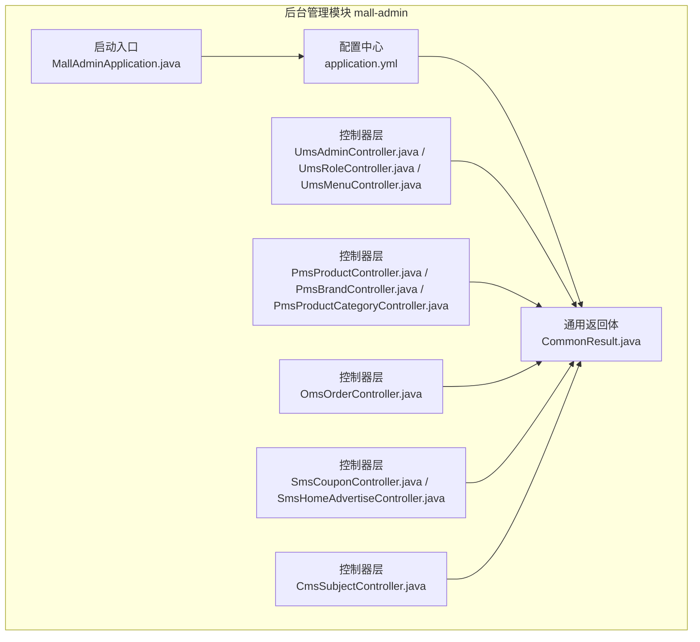
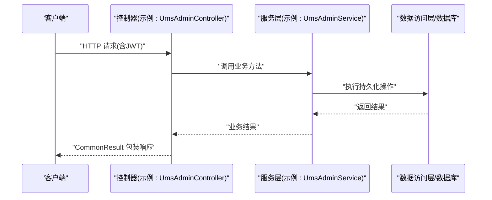
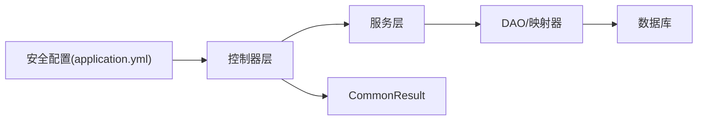

# 后台管理API

<cite>
**本文引用的文件**
- [README.md](file://README.md)
- [MallAdminApplication.java](file://mall-admin/src/main/java/com/macro/mall/MallAdminApplication.java)
- [application.yml](file://mall-admin/src/main/resources/application.yml)
- [CommonResult.java](file://mall-common/src/main/java/com/macro/mall/common/api/CommonResult.java)
- [UmsAdminController.java](file://mall-admin/src/main/java/com/macro/mall/controller/UmsAdminController.java)
- [UmsRoleController.java](file://mall-admin/src/main/java/com/macro/mall/controller/UmsRoleController.java)
- [UmsMenuController.java](file://mall-admin/src/main/java/com/macro/mall/controller/UmsMenuController.java)
- [PmsProductController.java](file://mall-admin/src/main/java/com/macro/mall/controller/PmsProductController.java)
- [PmsBrandController.java](file://mall-admin/src/main/java/com/macro/mall/controller/PmsBrandController.java)
- [PmsProductCategoryController.java](file://mall-admin/src/main/java/com/macro/mall/controller/PmsProductCategoryController.java)
- [OmsOrderController.java](file://mall-admin/src/main/java/com/macro/mall/controller/OmsOrderController.java)
- [SmsCouponController.java](file://mall-admin/src/main/java/com/macro/mall/controller/SmsCouponController.java)
- [SmsHomeAdvertiseController.java](file://mall-admin/src/main/java/com/macro/mall/controller/SmsHomeAdvertiseController.java)
- [CmsSubjectController.java](file://mall-admin/src/main/java/com/macro/mall/controller/CmsSubjectController.java)
- [mall-admin.postman_collection.json](file://document/postman/mall-admin.postman_collection.json)
</cite>

## 目录
1. [简介](#简介)
2. [项目结构](#项目结构)
3. [核心组件](#核心组件)
4. [架构总览](#架构总览)
5. [详细组件分析](#详细组件分析)
6. [依赖关系分析](#依赖关系分析)
7. [性能与安全考量](#性能与安全考量)
8. [故障排查指南](#故障排查指南)
9. [结论](#结论)
10. [附录](#附录)

## 简介
本文件为Mall后台管理系统的API接口文档，覆盖商品管理、用户管理、订单管理、营销管理、内容管理等模块。文档提供每个接口的HTTP方法、URL路径、请求参数、响应格式、权限与认证要求，并给出调用示例、参数说明与返回值解析。同时提供Postman集合文件的使用方法与接口测试指南，以及接口的业务逻辑与数据流转过程说明。

## 项目结构
- 后端采用Spring Boot + MyBatis架构，后台管理模块位于 mall-admin，统一通过REST接口提供能力。
- 接口统一返回体为通用包装类，便于前后端约定一致的响应格式。
- 认证采用JWT，白名单路径用于开放登录、注册、静态资源等无需鉴权的接口。
- Postman集合提供常用接口示例，便于快速测试。

**图表来源**
- [MallAdminApplication.java:1-16](file://mall-admin/src/main/java/com/macro/mall/MallAdminApplication.java#L1-L16)
- [application.yml:1-66](file://mall-admin/src/main/resources/application.yml#L1-L66)
- [CommonResult.java:1-134](file://mall-common/src/main/java/com/macro/mall/common/api/CommonResult.java#L1-L134)
- [UmsAdminController.java:1-192](file://mall-admin/src/main/java/com/macro/mall/controller/UmsAdminController.java#L1-L192)
- [UmsRoleController.java:1-112](file://mall-admin/src/main/java/com/macro/mall/controller/UmsRoleController.java#L1-L112)
- [UmsMenuController.java:1-95](file://mall-admin/src/main/java/com/macro/mall/controller/UmsMenuController.java#L1-L95)
- [PmsProductController.java:1-134](file://mall-admin/src/main/java/com/macro/mall/controller/PmsProductController.java#L1-L134)
- [PmsBrandController.java:1-122](file://mall-admin/src/main/java/com/macro/mall/controller/PmsBrandController.java#L1-L122)
- [PmsProductCategoryController.java:1-108](file://mall-admin/src/main/java/com/macro/mall/controller/PmsProductCategoryController.java#L1-L108)
- [OmsOrderController.java:1-104](file://mall-admin/src/main/java/com/macro/mall/controller/OmsOrderController.java#L1-L104)
- [SmsCouponController.java:1-73](file://mall-admin/src/main/java/com/macro/mall/controller/SmsCouponController.java#L1-L73)
- [SmsHomeAdvertiseController.java:1-79](file://mall-admin/src/main/java/com/macro/mall/controller/SmsHomeAdvertiseController.java#L1-L79)
- [CmsSubjectController.java:1-44](file://mall-admin/src/main/java/com/macro/mall/controller/CmsSubjectController.java#L1-L44)

**章节来源**
- [README.md:29-31](file://README.md#L29-L31)
- [application.yml:34-52](file://mall-admin/src/main/resources/application.yml#L34-L52)

## 核心组件
- 通用返回体：统一返回结构包含状态码、消息与数据体，便于前端统一处理。
- 控制器层：按模块划分，如用户管理、商品管理、订单管理、营销管理、内容管理等。
- 认证与安全：JWT令牌头与前缀、白名单路径、动态权限过滤等。
- 配置中心：集中管理JWT、Redis、安全白名单、阿里云OSS等配置。

**章节来源**
- [CommonResult.java:1-134](file://mall-common/src/main/java/com/macro/mall/common/api/CommonResult.java#L1-L134)
- [application.yml:20-24](file://mall-admin/src/main/resources/application.yml#L20-L24)
- [application.yml:34-52](file://mall-admin/src/main/resources/application.yml#L34-L52)

## 架构总览
下图展示了后台管理API的整体交互：客户端通过HTTP请求访问控制器，控制器调用服务层进行业务处理，最终以统一返回体响应。

**图表来源**
- [UmsAdminController.java:54-65](file://mall-admin/src/main/java/com/macro/mall/controller/UmsAdminController.java#L54-L65)
- [CommonResult.java:30-47](file://mall-common/src/main/java/com/macro/mall/common/api/CommonResult.java#L30-L47)

## 详细组件分析

### 用户管理模块
- 登录
  - 方法与路径：POST /admin/login
  - 请求体：用户名、密码
  - 返回：token与tokenHead
  - 权限与认证：无需鉴权
  - 示例：见Postman集合中的“登录”
- 刷新Token
  - 方法与路径：GET /admin/refreshToken
  - 请求头：Authorization: Bearer {token}
  - 返回：新token与tokenHead
  - 权限与认证：需要已登录
  - 示例：见Postman集合中的“刷新token”
- 获取管理员信息
  - 方法与路径：GET /admin/info
  - 请求头：Authorization: Bearer {token}
  - 返回：用户名、菜单、头像、角色列表
  - 权限与认证：需要已登录
- 注销
  - 方法与路径：POST /admin/logout
  - 请求头：Authorization: Bearer {token}
  - 返回：成功
  - 权限与认证：需要已登录
- 管理员列表
  - 方法与路径：GET /admin/list
  - 查询参数：keyword、pageSize、pageNum
  - 返回：分页列表
  - 权限与认证：需要已登录
- 获取单个管理员
  - 方法与路径：GET /admin/{id}
  - 路径参数：id
  - 返回：管理员对象
  - 权限与认证：需要已登录
- 更新管理员
  - 方法与路径：POST /admin/update/{id}
  - 路径参数：id；请求体：管理员字段
  - 返回：影响行数
  - 权限与认证：需要已登录
- 删除管理员
  - 方法与路径：POST /admin/delete/{id}
  - 路径参数：id
  - 返回：影响行数
  - 权限与认证：需要已登录
- 更新管理员状态
  - 方法与路径：POST /admin/updateStatus/{id}
  - 路径参数：id；查询参数：status
  - 返回：影响行数
  - 权限与认证：需要已登录
- 修改密码
  - 方法与路径：POST /admin/updatePassword
  - 请求体：旧密码、新密码、确认新密码
  - 返回：状态码
  - 权限与认证：需要已登录
- 分配角色
  - 方法与路径：POST /admin/role/update
  - 查询参数：adminId、roleIds
  - 返回：影响行数
  - 权限与认证：需要已登录
- 获取角色列表
  - 方法与路径：GET /admin/role/{adminId}
  - 路径参数：adminId
  - 返回：角色列表
  - 权限与认证：需要已登录

**章节来源**
- [UmsAdminController.java:44-192](file://mall-admin/src/main/java/com/macro/mall/controller/UmsAdminController.java#L44-L192)
- [mall-admin.postman_collection.json:62-80](file://document/postman/mall-admin.postman_collection.json#L62-L80)
- [mall-admin.postman_collection.json:171-186](file://document/postman/mall-admin.postman_collection.json#L171-L186)

### 角色与菜单管理模块
- 创建角色
  - 方法与路径：POST /role/create
  - 请求体：角色对象
  - 返回：影响行数
  - 权限与认证：需要已登录
- 更新角色
  - 方法与路径：POST /role/update/{id}
  - 路径参数：id；请求体：角色对象
  - 返回：影响行数
  - 权限与认证：需要已登录
- 删除角色
  - 方法与路径：POST /role/delete
  - 查询参数：ids
  - 返回：影响行数
  - 权限与认证：需要已登录
- 获取全部角色
  - 方法与路径：GET /role/listAll
  - 返回：角色列表
  - 权限与认证：需要已登录
- 分页查询角色
  - 方法与路径：GET /role/list
  - 查询参数：keyword、pageSize、pageNum
  - 返回：分页列表
  - 权限与认证：需要已登录
- 更新角色状态
  - 方法与路径：POST /role/updateStatus/{id}
  - 路径参数：id；查询参数：status
  - 返回：影响行数
  - 权限与认证：需要已登录
- 获取角色菜单树
  - 方法与路径：GET /role/listMenu/{roleId}
  - 路径参数：roleId
  - 返回：菜单树
  - 权限与认证：需要已登录
- 获取角色资源
  - 方法与路径：GET /role/listResource/{roleId}
  - 路径参数：roleId
  - 返回：资源列表
  - 权限与认证：需要已登录
- 分配菜单
  - 方法与路径：POST /role/allocMenu
  - 查询参数：roleId、menuIds
  - 返回：影响行数
  - 权限与认证：需要已登录
- 分配资源
  - 方法与路径：POST /role/allocResource
  - 查询参数：roleId、resourceIds
  - 返回：影响行数
  - 权限与认证：需要已登录
- 菜单管理
  - 创建菜单：POST /menu/create
  - 更新菜单：POST /menu/update/{id}
  - 删除菜单：POST /menu/delete/{id}
  - 获取菜单：GET /menu/{id}
  - 分页查询：GET /menu/list/{parentId}
  - 菜单树：GET /menu/treeList
  - 更新隐藏状态：POST /menu/updateHidden/{id}

**章节来源**
- [UmsRoleController.java:25-112](file://mall-admin/src/main/java/com/macro/mall/controller/UmsRoleController.java#L25-L112)
- [UmsMenuController.java:27-95](file://mall-admin/src/main/java/com/macro/mall/controller/UmsMenuController.java#L27-L95)

### 商品管理模块
- 新增商品
  - 方法与路径：POST /product/create
  - 请求体：商品参数对象
  - 返回：影响行数
  - 权限与认证：需要已登录
- 获取商品编辑详情
  - 方法与路径：GET /product/updateInfo/{id}
  - 路径参数：id
  - 返回：商品编辑结果
  - 权限与认证：需要已登录
- 更新商品
  - 方法与路径：POST /product/update/{id}
  - 路径参数：id；请求体：商品参数对象
  - 返回：影响行数
  - 权限与认证：需要已登录
- 商品列表
  - 方法与路径：GET /product/list
  - 查询参数：品牌、分类、名称、审核状态、发布状态、推荐状态、新品状态、删除状态、分页参数
  - 返回：分页列表
  - 权限与认证：需要已登录
- 简化商品列表
  - 方法与路径：GET /product/simpleList
  - 查询参数：keyword
  - 返回：商品列表
  - 权限与认证：需要已登录
- 批量审核
  - 方法与路径：POST /product/update/verifyStatus
  - 查询参数：ids、verifyStatus、detail
  - 返回：影响行数
  - 权限与认证：需要已登录
- 批量发布/下架
  - 方法与路径：POST /product/update/publishStatus
  - 查询参数：ids、publishStatus
  - 返回：影响行数
  - 权限与认证：需要已登录
- 批量推荐
  - 方法与路径：POST /product/update/recommendStatus
  - 查询参数：ids、recommendStatus
  - 返回：影响行数
  - 权限与认证：需要已登录
- 批量新品
  - 方法与路径：POST /product/update/newStatus
  - 查询参数：ids、newStatus
  - 返回：影响行数
  - 权限与认证：需要已登录
- 批量删除状态
  - 方法与路径：POST /product/update/deleteStatus
  - 查询参数：ids、deleteStatus
  - 返回：影响行数
  - 权限与认证：需要已登录

**章节来源**
- [PmsProductController.java:28-134](file://mall-admin/src/main/java/com/macro/mall/controller/PmsProductController.java#L28-L134)
- [mall-admin.postman_collection.json:82-135](file://document/postman/mall-admin.postman_collection.json#L82-L135)

### 品牌管理模块
- 获取全部品牌
  - 方法与路径：GET /brand/listAll
  - 返回：品牌列表
  - 权限与认证：需要已登录
- 新增品牌
  - 方法与路径：POST /brand/create
  - 请求体：品牌参数对象
  - 返回：影响行数
  - 权限与认证：需要已登录
- 更新品牌
  - 方法与路径：POST /brand/update/{id}
  - 路径参数：id；请求体：品牌参数对象
  - 返回：影响行数
  - 权限与认证：需要已登录
- 删除品牌
  - 方法与路径：GET /brand/delete/{id}
  - 路径参数：id
  - 返回：影响行数
  - 权限与认证：需要已登录
- 品牌列表
  - 方法与路径：GET /brand/list
  - 查询参数：keyword、showStatus、pageSize、pageNum
  - 返回：分页列表
  - 权限与认证：需要已登录
- 获取单个品牌
  - 方法与路径：GET /brand/{id}
  - 路径参数：id
  - 返回：品牌对象
  - 权限与认证：需要已登录
- 批量删除品牌
  - 方法与路径：POST /brand/delete/batch
  - 查询参数：ids
  - 返回：影响行数
  - 权限与认证：需要已登录
- 批量更新显示状态
  - 方法与路径：POST /brand/update/showStatus
  - 查询参数：ids、showStatus
  - 返回：影响行数
  - 权限与认证：需要已登录
- 批量更新工厂状态
  - 方法与路径：POST /brand/update/factoryStatus
  - 查询参数：ids、factoryStatus
  - 返回：影响行数
  - 权限与认证：需要已登录

**章节来源**
- [PmsBrandController.java:27-122](file://mall-admin/src/main/java/com/macro/mall/controller/PmsBrandController.java#L27-L122)

### 商品分类管理模块
- 新增分类
  - 方法与路径：POST /productCategory/create
  - 请求体：分类参数对象
  - 返回：影响行数
  - 权限与认证：需要已登录
- 更新分类
  - 方法与路径：POST /productCategory/update/{id}
  - 路径参数：id；请求体：分类参数对象
  - 返回：影响行数
  - 权限与认证：需要已登录
- 分类列表
  - 方法与路径：GET /productCategory/list/{parentId}
  - 路径参数：parentId；查询参数：pageSize、pageNum
  - 返回：分页列表
  - 权限与认证：需要已登录
- 获取单个分类
  - 方法与路径：GET /productCategory/{id}
  - 路径参数：id
  - 返回：分类对象
  - 权限与认证：需要已登录
- 删除分类
  - 方法与路径：POST /productCategory/delete/{id}
  - 路径参数：id
  - 返回：影响行数
  - 权限与认证：需要已登录
- 批量更新导航状态
  - 方法与路径：POST /productCategory/update/navStatus
  - 查询参数：ids、navStatus
  - 返回：影响行数
  - 权限与认证：需要已登录
- 批量更新显示状态
  - 方法与路径：POST /productCategory/update/showStatus
  - 查询参数：ids、showStatus
  - 返回：影响行数
  - 权限与认证：需要已登录
- 查询所有一级分类及子分类
  - 方法与路径：GET /productCategory/list/withChildren
  - 返回：带层级的分类列表
  - 权限与认证：需要已登录

**章节来源**
- [PmsProductCategoryController.java:28-108](file://mall-admin/src/main/java/com/macro/mall/controller/PmsProductCategoryController.java#L28-L108)
- [mall-admin.postman_collection.json:137-151](file://document/postman/mall-admin.postman_collection.json#L137-L151)

### 订单管理模块
- 订单列表
  - 方法与路径：GET /order/list
  - 查询参数：订单号、收货人、开始/结束时间、状态、分页参数
  - 返回：分页列表
  - 权限与认证：需要已登录
- 发货
  - 方法与路径：POST /order/update/delivery
  - 请求体：发货参数数组
  - 返回：影响行数
  - 权限与认证：需要已登录
- 关闭订单
  - 方法与路径：POST /order/update/close
  - 查询参数：ids、note
  - 返回：影响行数
  - 权限与认证：需要已登录
- 删除订单
  - 方法与路径：POST /order/delete
  - 查询参数：ids
  - 返回：影响行数
  - 权限与认证：需要已登录
- 订单详情
  - 方法与路径：GET /order/{id}
  - 路径参数：id
  - 返回：订单详情
  - 权限与认证：需要已登录
- 修改收货人信息
  - 方法与路径：POST /order/update/receiverInfo
  - 请求体：收货人信息参数
  - 返回：影响行数
  - 权限与认证：需要已登录
- 修改金额信息
  - 方法与路径：POST /order/update/moneyInfo
  - 请求体：金额信息参数
  - 返回：影响行数
  - 权限与认证：需要已登录
- 修改备注
  - 方法与路径：POST /order/update/note
  - 查询参数：id、note、status
  - 返回：影响行数
  - 权限与认证：需要已登录

**章节来源**
- [OmsOrderController.java:26-104](file://mall-admin/src/main/java/com/macro/mall/controller/OmsOrderController.java#L26-L104)

### 营销管理模块
- 优惠券管理
  - 新增优惠券：POST /coupon/create
  - 删除优惠券：POST /coupon/delete/{id}
  - 更新优惠券：POST /coupon/update/{id}
  - 优惠券列表：GET /coupon/list
  - 获取优惠券详情：GET /coupon/{id}
  - 示例：见Postman集合中的“添加优惠券”、“删除指定优惠券”、“修改指定优惠券”
- 首页轮播广告
  - 新增广告：POST /home/advertise/create
  - 删除广告：POST /home/advertise/delete
  - 更新状态：POST /home/advertise/update/status/{id}
  - 获取广告：GET /home/advertise/{id}
  - 更新广告：POST /home/advertise/update/{id}
  - 广告列表：GET /home/advertise/list

**章节来源**
- [SmsCouponController.java:25-73](file://mall-admin/src/main/java/com/macro/mall/controller/SmsCouponController.java#L25-L73)
- [SmsHomeAdvertiseController.java:25-79](file://mall-admin/src/main/java/com/macro/mall/controller/SmsHomeAdvertiseController.java#L25-L79)
- [mall-admin.postman_collection.json:11-60](file://document/postman/mall-admin.postman_collection.json#L11-L60)

### 内容管理模块
- 专题管理
  - 获取全部专题：GET /subject/listAll
  - 专题列表：GET /subject/list
  - 示例：见Postman集合中的“查看商品列表”

**章节来源**
- [CmsSubjectController.java:28-44](file://mall-admin/src/main/java/com/macro/mall/controller/CmsSubjectController.java#L28-L44)
- [mall-admin.postman_collection.json:82-96](file://document/postman/mall-admin.postman_collection.json#L82-L96)

## 依赖关系分析
- 控制器依赖服务层，服务层依赖DAO与模型，最终访问数据库。
- 通用返回体被所有控制器使用，保证响应一致性。
- 安全配置通过白名单与JWT拦截器控制访问。

**图表来源**
- [application.yml:34-52](file://mall-admin/src/main/resources/application.yml#L34-L52)
- [CommonResult.java:30-47](file://mall-common/src/main/java/com/macro/mall/common/api/CommonResult.java#L30-L47)

**章节来源**
- [application.yml:34-52](file://mall-admin/src/main/resources/application.yml#L34-L52)

## 性能与安全考量
- 性能
  - 列表查询建议合理设置分页参数，避免一次性加载过多数据。
  - 批量操作（如批量更新状态）建议控制单次批量数量，防止数据库压力过大。
- 安全
  - 所有受保护接口均需携带Authorization头，值为“Bearer {token}”。
  - 白名单路径包括登录、注册、静态资源等，其余接口均需鉴权。
  - JWT配置包含token头、密钥、过期时间等，确保会话安全。

**章节来源**
- [application.yml:20-24](file://mall-admin/src/main/resources/application.yml#L20-L24)
- [application.yml:34-52](file://mall-admin/src/main/resources/application.yml#L34-L52)

## 故障排查指南
- 未登录或Token无效
  - 现象：返回未登录或未授权的通用返回体。
  - 处理：重新登录获取token，并在请求头中携带Authorization: Bearer {token}。
- 参数校验失败
  - 现象：返回参数验证失败的通用返回体。
  - 处理：检查请求体或查询参数是否符合接口定义。
- 业务异常
  - 现象：返回失败的通用返回体。
  - 处理：根据接口具体逻辑检查输入参数与业务状态。

**章节来源**
- [CommonResult.java:82-108](file://mall-common/src/main/java/com/macro/mall/common/api/CommonResult.java#L82-L108)

## 结论
本文档对Mall后台管理系统的用户管理、商品管理、订单管理、营销管理、内容管理等模块进行了全面的API梳理，明确了接口的HTTP方法、URL路径、请求参数、响应格式、权限与认证要求，并提供了Postman集合的使用方法与测试指南。建议在实际对接中严格遵循统一的返回体规范与安全策略，确保接口稳定与安全。

## 附录

### Postman集合使用方法
- 导入集合：打开Postman，选择“Import”，导入mall-admin.postman_collection.json。
- 环境变量：根据实际部署地址配置{{admin.mall}}变量。
- 认证：登录接口成功后，将返回的token填入后续请求的Authorization头，格式为Bearer {token}。
- 示例接口：
  - 登录：POST /admin/login
  - 查看商品列表：GET /product/list（需Authorization）
  - 批量修改商品删除状态：POST /product/update/deleteStatus（需Authorization）
  - 查询所有一级分类及子分类：GET /productCategory/list/withChildren（需Authorization）
  - 获取全部品牌列表：GET /brand/listAll（需Authorization）
  - 刷新token：GET /admin/token/refresh（需Authorization）

**章节来源**
- [mall-admin.postman_collection.json:1-188](file://document/postman/mall-admin.postman_collection.json#L1-L188)

### 接口调用示例（路径指引）
- 登录
  - 请求：POST /admin/login
  - 请求体：用户名、密码
  - 返回：token与tokenHead
  - 示例路径：[mall-admin.postman_collection.json:62-80](file://document/postman/mall-admin.postman_collection.json#L62-L80)
- 刷新Token
  - 请求：GET /admin/refreshToken
  - 请求头：Authorization: Bearer {token}
  - 返回：新token与tokenHead
  - 示例路径：[mall-admin.postman_collection.json:171-186](file://document/postman/mall-admin.postman_collection.json#L171-L186)
- 查看商品列表
  - 请求：GET /product/list
  - 查询参数：分页参数等
  - 返回：分页商品列表
  - 示例路径：[mall-admin.postman_collection.json:82-96](file://document/postman/mall-admin.postman_collection.json#L82-L96)
- 批量修改商品删除状态
  - 请求：POST /product/update/deleteStatus
  - 表单参数：ids、deleteStatus
  - 返回：影响行数
  - 示例路径：[mall-admin.postman_collection.json:99-135](file://document/postman/mall-admin.postman_collection.json#L99-L135)
- 查询所有一级分类及子分类
  - 请求：GET /productCategory/list/withChildren
  - 返回：带层级的分类列表
  - 示例路径：[mall-admin.postman_collection.json:137-151](file://document/postman/mall-admin.postman_collection.json#L137-L151)
- 获取全部品牌列表
  - 请求：GET /brand/listAll
  - 返回：品牌列表
  - 示例路径：[mall-admin.postman_collection.json:154-169](file://document/postman/mall-admin.postman_collection.json#L154-L169)