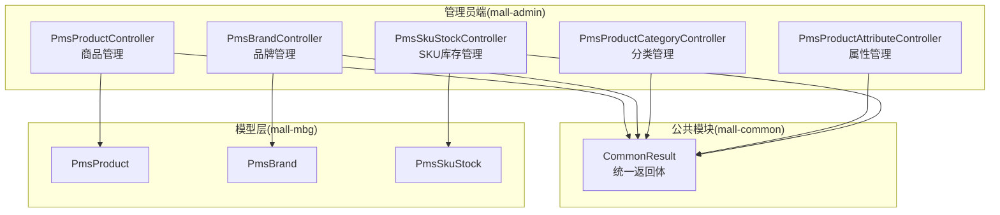
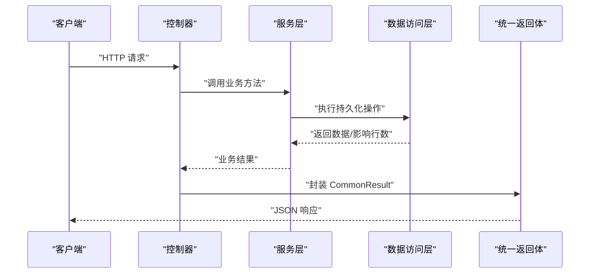
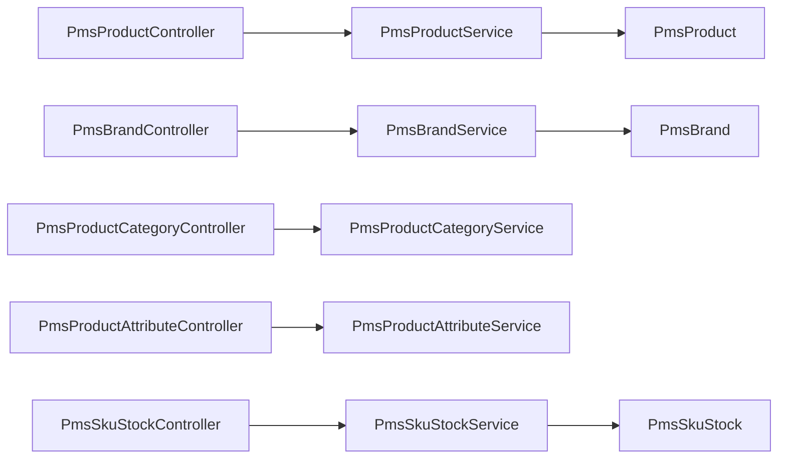

# 商品管理API

<cite>
**本文引用的文件**
- [PmsProductController.java](file://mall-admin/src/main/java/com/macro/mall/controller/PmsProductController.java)
- [PmsBrandController.java](file://mall-admin/src/main/java/com/macro/mall/controller/PmsBrandController.java)
- [PmsProductCategoryController.java](file://mall-admin/src/main/java/com/macro/mall/controller/PmsProductCategoryController.java)
- [PmsProductAttributeController.java](file://mall-admin/src/main/java/com/macro/mall/controller/PmsProductAttributeController.java)
- [PmsSkuStockController.java](file://mall-admin/src/main/java/com/macro/mall/controller/PmsSkuStockController.java)
- [PmsProductParam.java](file://mall-admin/src/main/java/com/macro/mall/dto/PmsProductParam.java)
- [PmsBrandParam.java](file://mall-admin/src/main/java/com/macro/mall/dto/PmsBrandParam.java)
- [PmsProductCategoryParam.java](file://mall-admin/src/main/java/com/macro/mall/dto/PmsProductCategoryParam.java)
- [PmsProductAttributeParam.java](file://mall-admin/src/main/java/com/macro/mall/dto/PmsProductAttributeParam.java)
- [PmsProduct.java](file://mall-mbg/src/main/java/com/macro/mall/model/PmsProduct.java)
- [PmsBrand.java](file://mall-mbg/src/main/java/com/macro/mall/model/PmsBrand.java)
- [PmsSkuStock.java](file://mall-mbg/src/main/java/com/macro/mall/model/PmsSkuStock.java)
- [CommonResult.java](file://mall-common/src/main/java/com/macro/mall/common/api/CommonResult.java)
- [MallSecurityConfig.java](file://mall-admin/src/main/java/com/macro/mall/config/MallSecurityConfig.java)
- [mall-admin.postman_collection.json](file://document/postman/mall-admin.postman_collection.json)
</cite>

## 目录
1. [简介](#简介)
2. [项目结构](#项目结构)
3. [核心组件](#核心组件)
4. [架构总览](#架构总览)
5. [详细组件分析](#详细组件分析)
6. [依赖分析](#依赖分析)
7. [性能考虑](#性能考虑)
8. [故障排查指南](#故障排查指南)
9. [结论](#结论)
10. [附录](#附录)

## 简介
本文件面向管理员端的商品管理API，覆盖商品增删改查、品牌管理、分类管理、属性管理、SKU库存管理等能力。文档基于后端控制器与DTO/Model定义，给出每个接口的HTTP方法、URL路径、请求参数、响应格式、参数校验规则与业务要点，并提供调用示例与权限说明。

## 项目结构
- 控制器层：各模块控制器位于 mall-admin 模块的 controller 包中，统一通过 @RequestMapping 定义REST风格路径。
- DTO 层：封装请求参数与复杂对象，如商品创建/更新参数、品牌/分类/属性参数等。
- Model 层：数据库实体映射，如 PmsProduct、PmsBrand、PmsSkuStock 等。
- 响应封装：统一返回体 CommonResult，包含 code、message、data 字段。
- 权限与安全：基于 Spring Security 的动态资源权限配置，支持按 URL 动态授权。

图表来源
- [PmsProductController.java:21-134](file://mall-admin/src/main/java/com/macro/mall/controller/PmsProductController.java#L21-L134)
- [PmsBrandController.java:20-122](file://mall-admin/src/main/java/com/macro/mall/controller/PmsBrandController.java#L20-L122)
- [PmsProductCategoryController.java:21-108](file://mall-admin/src/main/java/com/macro/mall/controller/PmsProductCategoryController.java#L21-L108)
- [PmsProductAttributeController.java:20-84](file://mall-admin/src/main/java/com/macro/mall/controller/PmsProductAttributeController.java#L20-L84)
- [PmsSkuStockController.java:17-41](file://mall-admin/src/main/java/com/macro/mall/controller/PmsSkuStockController.java#L17-L41)
- [CommonResult.java:7-134](file://mall-common/src/main/java/com/macro/mall/common/api/CommonResult.java#L7-L134)
- [PmsProduct.java:7-92](file://mall-mbg/src/main/java/com/macro/mall/model/PmsProduct.java#L7-L92)
- [PmsBrand.java:5-28](file://mall-mbg/src/main/java/com/macro/mall/model/PmsBrand.java#L5-L28)
- [PmsSkuStock.java:6-29](file://mall-mbg/src/main/java/com/macro/mall/model/PmsSkuStock.java#L6-L29)

章节来源
- [PmsProductController.java:21-134](file://mall-admin/src/main/java/com/macro/mall/controller/PmsProductController.java#L21-L134)
- [PmsBrandController.java:20-122](file://mall-admin/src/main/java/com/macro/mall/controller/PmsBrandController.java#L20-L122)
- [PmsProductCategoryController.java:21-108](file://mall-admin/src/main/java/com/macro/mall/controller/PmsProductCategoryController.java#L21-L108)
- [PmsProductAttributeController.java:20-84](file://mall-admin/src/main/java/com/macro/mall/controller/PmsProductAttributeController.java#L20-L84)
- [PmsSkuStockController.java:17-41](file://mall-admin/src/main/java/com/macro/mall/controller/PmsSkuStockController.java#L17-L41)
- [CommonResult.java:7-134](file://mall-common/src/main/java/com/macro/mall/common/api/CommonResult.java#L7-L134)

## 核心组件
- 统一返回体 CommonResult：封装 code、message、data，提供成功、失败、未登录、未授权、参数校验失败等静态工厂方法。
- 控制器层：各模块控制器负责路由与参数接收，调用对应 Service 完成业务处理。
- DTO/Model：请求参数 DTO（如 PmsProductParam、PmsBrandParam 等）与数据库实体 Model（如 PmsProduct、PmsBrand、PmsSkuStock）分离，便于参数校验与数据传输。

章节来源
- [CommonResult.java:7-134](file://mall-common/src/main/java/com/macro/mall/common/api/CommonResult.java#L7-L134)
- [PmsProductParam.java:13-24](file://mall-admin/src/main/java/com/macro/mall/dto/PmsProductParam.java#L13-L24)
- [PmsBrandParam.java:14-31](file://mall-admin/src/main/java/com/macro/mall/dto/PmsBrandParam.java#L14-L31)
- [PmsProduct.java:7-92](file://mall-mbg/src/main/java/com/macro/mall/model/PmsProduct.java#L7-L92)
- [PmsBrand.java:5-28](file://mall-mbg/src/main/java/com/macro/mall/model/PmsBrand.java#L5-L28)
- [PmsSkuStock.java:6-29](file://mall-mbg/src/main/java/com/macro/mall/model/PmsSkuStock.java#L6-L29)

## 架构总览
下图展示商品管理相关API的典型调用链：客户端 → 控制器 → 服务层 → 数据访问层；统一返回体封装响应。

图表来源
- [PmsProductController.java:28-55](file://mall-admin/src/main/java/com/macro/mall/controller/PmsProductController.java#L28-L55)
- [PmsBrandController.java:33-58](file://mall-admin/src/main/java/com/macro/mall/controller/PmsBrandController.java#L33-L58)
- [PmsProductCategoryController.java:28-50](file://mall-admin/src/main/java/com/macro/mall/controller/PmsProductCategoryController.java#L28-L50)
- [PmsProductAttributeController.java:37-68](file://mall-admin/src/main/java/com/macro/mall/controller/PmsProductAttributeController.java#L37-L68)
- [PmsSkuStockController.java:24-39](file://mall-admin/src/main/java/com/macro/mall/controller/PmsSkuStockController.java#L24-L39)
- [CommonResult.java:35-79](file://mall-common/src/main/java/com/macro/mall/common/api/CommonResult.java#L35-L79)

## 详细组件分析

### 商品管理 API
- 接口分组标签：商品管理
- 基础路径：/product

1) 创建商品
- 方法与路径：POST /product/create
- 请求体：PmsProductParam（包含商品基础信息、阶梯价格、满减、会员价、SKU、属性值、专题/地区关联等）
- 响应：CommonResult<Integer>（返回受影响行数）

2) 获取商品编辑详情
- 方法与路径：GET /product/updateInfo/{id}
- 路径参数：id（Long）
- 响应：CommonResult<PmsProductResult>（编辑时需要的聚合数据）

3) 更新商品
- 方法与路径：POST /product/update/{id}
- 路径参数：id（Long）
- 请求体：PmsProductParam
- 响应：CommonResult<Integer>

4) 分页查询商品列表
- 方法与路径：GET /product/list
- 查询参数：
  - keyword（可选）、brandId（可选）、productCategoryId（可选）、verifyStatus（可选）
  - pageNum（默认1）、pageSize（默认5）
- 响应：CommonResult<CommonPage<PmsProduct>>

5) 商品简单列表
- 方法与路径：GET /product/simpleList
- 查询参数：keyword（可选）
- 响应：CommonResult<List<PmsProduct>>

6) 批量审核状态
- 方法与路径：POST /product/update/verifyStatus
- 表单参数：
  - ids（List<Long>）
  - verifyStatus（Integer）
  - detail（String）
- 响应：CommonResult<Integer>

7) 批量发布状态
- 方法与路径：POST /product/update/publishStatus
- 表单参数：ids（List<Long>）、publishStatus（Integer）
- 响应：CommonResult<Integer>

8) 批量推荐状态
- 方法与路径：POST /product/update/recommendStatus
- 表单参数：ids（List<Long>）、recommendStatus（Integer）
- 响应：CommonResult<Integer>

9) 批量新品状态
- 方法与路径：POST /product/update/newStatus
- 表单参数：ids（List<Long>）、newStatus（Integer）
- 响应：CommonResult<Integer>

10) 批量删除状态
- 方法与路径：POST /product/update/deleteStatus
- 表单参数：ids（List<Long>）、deleteStatus（Integer）
- 响应：CommonResult<Integer>

请求示例（基于 Postman 集合中的商品相关条目）
- 查看商品列表：GET /product/list（需携带 Authorization: Bearer Token）
- 批量修改删除状态：POST /product/update/deleteStatus（表单参数 ids、deleteStatus）

响应格式
- 成功：code=200，message=“成功”，data=实际数据
- 失败：code=非200，message=错误信息，data=null
- 参数校验失败：统一使用 CommonResult.validateFailed()

章节来源
- [PmsProductController.java:28-132](file://mall-admin/src/main/java/com/macro/mall/controller/PmsProductController.java#L28-L132)
- [PmsProductParam.java:13-24](file://mall-admin/src/main/java/com/macro/mall/dto/PmsProductParam.java#L13-L24)
- [PmsProduct.java:7-92](file://mall-mbg/src/main/java/com/macro/mall/model/PmsProduct.java#L7-L92)
- [CommonResult.java:35-79](file://mall-common/src/main/java/com/macro/mall/common/api/CommonResult.java#L35-L79)
- [mall-admin.postman_collection.json:82-135](file://document/postman/mall-admin.postman_collection.json#L82-L135)

### 品牌管理 API
- 接口分组标签：商品品牌管理
- 基础路径：/brand

1) 获取全部品牌列表
- 方法与路径：GET /brand/listAll
- 响应：CommonResult<List<PmsBrand>>

2) 创建品牌
- 方法与路径：POST /brand/create
- 请求体：PmsBrandParam（含名称、首字母、排序、厂家状态、显示状态、LOGO、大图、品牌故事等）
- 响应：CommonResult<Integer>

3) 更新品牌
- 方法与路径：POST /brand/update/{id}
- 路径参数：id（Long）
- 请求体：PmsBrandParam
- 响应：CommonResult<Integer>

4) 删除品牌（单个）
- 方法与路径：GET /brand/delete/{id}
- 路径参数：id（Long）
- 响应：CommonResult<Void>

5) 分页查询品牌
- 方法与路径：GET /brand/list
- 查询参数：keyword（可选）、showStatus（可选）、pageNum（默认1）、pageSize（默认5）
- 响应：CommonResult<CommonPage<PmsBrand>>

6) 获取单个品牌
- 方法与路径：GET /brand/{id}
- 路径参数：id（Long）
- 响应：CommonResult<PmsBrand>

7) 批量删除品牌
- 方法与路径：POST /brand/delete/batch
- 表单参数：ids（List<Long>）
- 响应：CommonResult<Integer>

8) 批量修改显示状态
- 方法与路径：POST /brand/update/showStatus
- 表单参数：ids（List<Long>）、showStatus（Integer）
- 响应：CommonResult<Integer>

9) 批量修改厂家状态
- 方法与路径：POST /brand/update/factoryStatus
- 表单参数：ids（List<Long>）、factoryStatus（Integer）
- 响应：CommonResult<Integer>

参数校验规则（基于 DTO 注解）
- 名称、LOGO 必填
- sort 最小值为0
- 工厂状态、显示状态仅允许0或1

请求示例（基于 Postman 集合）
- 获取全部品牌列表：GET /brand/listAll（需携带 Authorization: Bearer Token）

章节来源
- [PmsBrandController.java:27-121](file://mall-admin/src/main/java/com/macro/mall/controller/PmsBrandController.java#L27-L121)
- [PmsBrandParam.java:14-31](file://mall-admin/src/main/java/com/macro/mall/dto/PmsBrandParam.java#L14-L31)
- [PmsBrand.java:5-28](file://mall-mbg/src/main/java/com/macro/mall/model/PmsBrand.java#L5-L28)
- [CommonResult.java:35-79](file://mall-common/src/main/java/com/macro/mall/common/api/CommonResult.java#L35-L79)
- [mall-admin.postman_collection.json:154-169](file://document/postman/mall-admin.postman_collection.json#L154-L169)

### 分类管理 API
- 接口分组标签：商品分类管理
- 基础路径：/productCategory

1) 创建分类
- 方法与路径：POST /productCategory/create
- 请求体：PmsProductCategoryParam（含父级ID、名称、单位、导航/显示状态、排序、图标、关键词、描述、属性ID列表等）
- 响应：CommonResult<Integer>

2) 更新分类
- 方法与路径：POST /productCategory/update/{id}
- 路径参数：id（Long）
- 请求体：PmsProductCategoryParam
- 响应：CommonResult<Integer>

3) 分页查询分类（按父级）
- 方法与路径：GET /productCategory/list/{parentId}
- 路径参数：parentId（Long）
- 查询参数：pageNum（默认1）、pageSize（默认5）
- 响应：CommonResult<CommonPage<PmsProductCategory>>

4) 获取单个分类
- 方法与路径：GET /productCategory/{id}
- 路径参数：id（Long）
- 响应：CommonResult<PmsProductCategory>

5) 删除分类
- 方法与路径：POST /productCategory/delete/{id}
- 路径参数：id（Long）
- 响应：CommonResult<Integer>

6) 批量修改导航状态
- 方法与路径：POST /productCategory/update/navStatus
- 表单参数：ids（List<Long>）、navStatus（Integer）
- 响应：CommonResult<Integer>

7) 批量修改显示状态
- 方法与路径：POST /productCategory/update/showStatus
- 表单参数：ids（List<Long>）、showStatus（Integer）
- 响应：CommonResult<Integer>

8) 查询所有一级分类及子分类树
- 方法与路径：GET /productCategory/list/withChildren
- 响应：CommonResult<List<PmsProductCategoryWithChildrenItem>>

参数校验规则（基于 DTO 注解）
- 名称必填
- 导航/显示状态仅允许0或1
- sort 最小值为0

章节来源
- [PmsProductCategoryController.java:28-106](file://mall-admin/src/main/java/com/macro/mall/controller/PmsProductCategoryController.java#L28-L106)
- [PmsProductCategoryParam.java:15-33](file://mall-admin/src/main/java/com/macro/mall/dto/PmsProductCategoryParam.java#L15-L33)
- [CommonResult.java:35-79](file://mall-common/src/main/java/com/macro/mall/common/api/CommonResult.java#L35-L79)

### 属性管理 API
- 接口分组标签：商品属性管理
- 基础路径：/productAttribute

1) 分页查询属性（按分类与类型）
- 方法与路径：GET /productAttribute/list/{cid}
- 路径参数：cid（Long）
- 查询参数：type（Integer）、pageNum（默认1）、pageSize（默认5）
- 响应：CommonResult<CommonPage<PmsProductAttribute>>

2) 创建属性
- 方法与路径：POST /productAttribute/create
- 请求体：PmsProductAttributeParam（含属性分类ID、名称、选择类型、输入类型、筛选/搜索/关联/手工录入/类型等）
- 响应：CommonResult<Integer>

3) 更新属性
- 方法与路径：POST /productAttribute/update/{id}
- 路径参数：id（Long）
- 请求体：PmsProductAttributeParam
- 响应：CommonResult<Integer>

4) 获取单个属性
- 方法与路径：GET /productAttribute/{id}
- 路径参数：id（Long）
- 响应：CommonResult<PmsProductAttribute>

5) 删除属性（批量）
- 方法与路径：POST /productAttribute/delete
- 表单参数：ids（List<Long>）
- 响应：CommonResult<Integer>

6) 获取分类下的属性信息（含可选项等）
- 方法与路径：GET /productAttribute/attrInfo/{productCategoryId}
- 路径参数：productCategoryId（Long）
- 响应：CommonResult<List<ProductAttrInfo>>

参数校验规则（基于 DTO 注解）
- 选择类型取值范围{0,1,2}，输入类型取值范围{0,1}，筛选/搜索/关联/手工录入/类型等字段均限定在特定集合内

章节来源
- [PmsProductAttributeController.java:27-82](file://mall-admin/src/main/java/com/macro/mall/controller/PmsProductAttributeController.java#L27-L82)
- [PmsProductAttributeParam.java:13-37](file://mall-admin/src/main/java/com/macro/mall/dto/PmsProductAttributeParam.java#L13-L37)
- [CommonResult.java:35-79](file://mall-common/src/main/java/com/macro/mall/common/api/CommonResult.java#L35-L79)

### SKU 库存管理 API
- 接口分组标签：sku商品库存管理
- 基础路径：/sku

1) 查询某商品的SKU列表
- 方法与路径：GET /sku/{pid}
- 路径参数：pid（Long）
- 查询参数：keyword（可选）
- 响应：CommonResult<List<PmsSkuStock>>

2) 批量更新某商品的SKU
- 方法与路径：POST /sku/update/{pid}
- 路径参数：pid（Long）
- 请求体：List<PmsSkuStock>
- 响应：CommonResult<Integer>

参数校验规则
- SKU 列表请求体为数组，元素包含价格、库存、预警库存、图片、销量、促销价、锁库存、SP数据等字段

章节来源
- [PmsSkuStockController.java:24-39](file://mall-admin/src/main/java/com/macro/mall/controller/PmsSkuStockController.java#L24-L39)
- [PmsSkuStock.java:6-29](file://mall-mbg/src/main/java/com/macro/mall/model/PmsSkuStock.java#L6-L29)
- [CommonResult.java:35-79](file://mall-common/src/main/java/com/macro/mall/common/api/CommonResult.java#L35-L79)

### API 规范汇总

- 统一响应格式
  - 成功：code=200，message=“成功”，data=具体数据
  - 失败：code=非200，message=错误信息，data=null
  - 未登录/未授权：分别使用相应静态方法封装
  - 参数校验失败：统一使用 validateFailed

- 权限与安全
  - 登录认证：接口示例中使用 Authorization: Bearer Token
  - 动态权限：基于 URL 的动态资源授权配置，按资源URL与名称进行授权控制

- 调用频率限制
  - 当前仓库未提供明确的限流策略实现，建议结合网关或Spring Cloud Gateway进行限流配置

章节来源
- [CommonResult.java:35-108](file://mall-common/src/main/java/com/macro/mall/common/api/CommonResult.java#L35-L108)
- [MallSecurityConfig.java:29-48](file://mall-admin/src/main/java/com/macro/mall/config/MallSecurityConfig.java#L29-L48)
- [mall-admin.postman_collection.json:82-169](file://document/postman/mall-admin.postman_collection.json#L82-L169)

## 依赖分析
- 控制器到服务层：控制器通过 Autowired 注入对应 Service，调用业务方法完成处理。
- 服务层到数据访问层：服务层通过 Mapper/DAO 访问数据库，返回聚合数据或影响行数。
- 统一返回体：所有控制器最终以 CommonResult 封装响应，保证一致性。

图表来源
- [PmsProductController.java:25-26](file://mall-admin/src/main/java/com/macro/mall/controller/PmsProductController.java#L25-L26)
- [PmsBrandController.java:24-25](file://mall-admin/src/main/java/com/macro/mall/controller/PmsBrandController.java#L24-L25)
- [PmsProductCategoryController.java:25-26](file://mall-admin/src/main/java/com/macro/mall/controller/PmsProductCategoryController.java#L25-L26)
- [PmsProductAttributeController.java:24-25](file://mall-admin/src/main/java/com/macro/mall/controller/PmsProductAttributeController.java#L24-L25)
- [PmsSkuStockController.java:21-22](file://mall-admin/src/main/java/com/macro/mall/controller/PmsSkuStockController.java#L21-L22)
- [PmsProduct.java:7-92](file://mall-mbg/src/main/java/com/macro/mall/model/PmsProduct.java#L7-L92)
- [PmsBrand.java:5-28](file://mall-mbg/src/main/java/com/macro/mall/model/PmsBrand.java#L5-L28)
- [PmsSkuStock.java:6-29](file://mall-mbg/src/main/java/com/macro/mall/model/PmsSkuStock.java#L6-L29)

## 性能考虑
- 分页查询：列表接口均支持 pageNum/pageSize，默认值已设定，建议前端合理设置分页大小并避免超大数值。
- 批量操作：品牌/分类/商品状态批量更新接口支持一次传入多个ID，减少多次往返，提升效率。
- SKU 批量更新：一次提交多个SKU记录，减少网络开销。
- 缓存与限流：当前仓库未见显式缓存与限流实现，建议结合业务场景引入Redis缓存热点数据，使用网关或过滤器实现限流。

## 故障排查指南
- 参数校验失败：检查请求体字段是否满足 DTO 注解约束（如必填、最小值、枚举范围等）。
- 未登录/未授权：确认请求头 Authorization 是否正确，Token 是否有效。
- 返回失败但无明细：查看响应中的 message 字段，定位具体错误原因。
- 批量操作未生效：确认 ids 参数是否为逗号分隔的数值列表，且目标记录存在。

章节来源
- [PmsBrandParam.java:17-25](file://mall-admin/src/main/java/com/macro/mall/dto/PmsBrandParam.java#L17-L25)
- [PmsProductCategoryParam.java:19-27](file://mall-admin/src/main/java/com/macro/mall/dto/PmsProductCategoryParam.java#L19-L27)
- [PmsProductAttributeParam.java:16-36](file://mall-admin/src/main/java/com/macro/mall/dto/PmsProductAttributeParam.java#L16-L36)
- [CommonResult.java:84-94](file://mall-common/src/main/java/com/macro/mall/common/api/CommonResult.java#L84-L94)
- [MallSecurityConfig.java:29-48](file://mall-admin/src/main/java/com/macro/mall/config/MallSecurityConfig.java#L29-L48)

## 结论
本文档基于现有控制器与DTO/Model定义，系统梳理了商品管理相关API的接口规范、参数校验与响应格式，并提供了调用示例与权限说明。建议在生产环境中补充缓存与限流策略，并完善接口文档与自动化测试，确保接口稳定性与可维护性。

## 附录

### 请求与响应示例（参考）
- 查看商品列表：GET /product/list（携带 Authorization: Bearer Token）
- 批量修改删除状态：POST /product/update/deleteStatus（表单参数 ids、deleteStatus）

章节来源
- [mall-admin.postman_collection.json:82-135](file://document/postman/mall-admin.postman_collection.json#L82-L135)