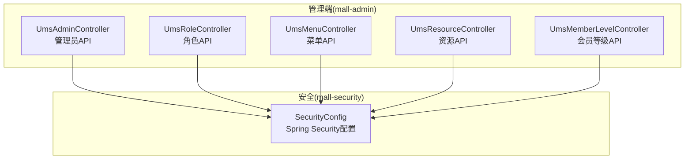
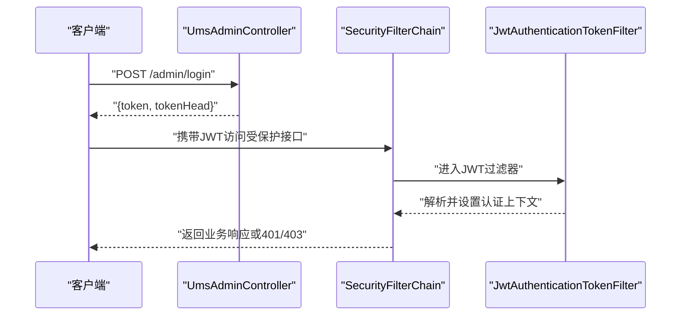
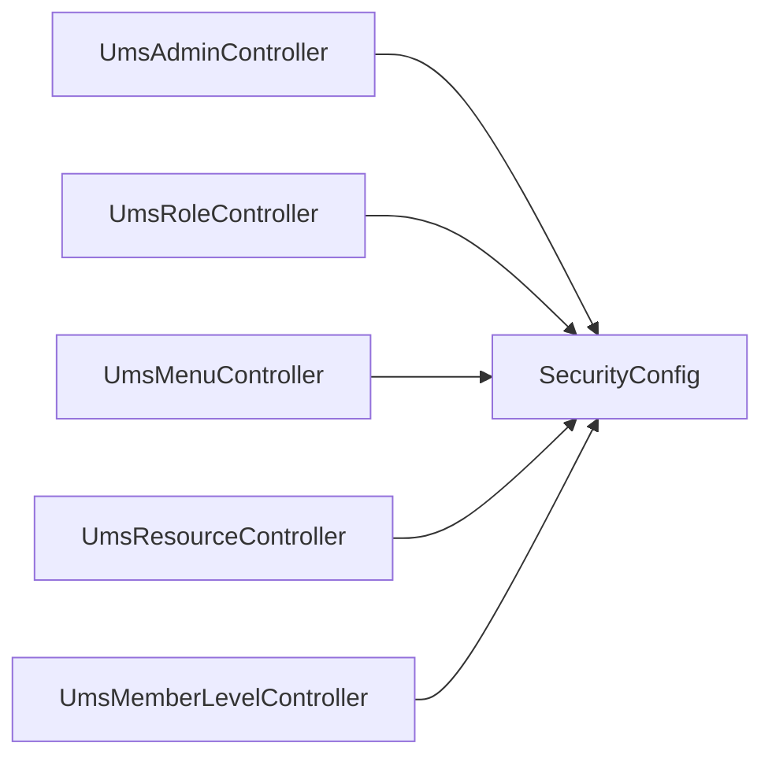

# 用户管理API

<cite>
**本文引用的文件**
- [UmsAdminController.java](file://mall-admin/src/main/java/com/macro/mall/controller/UmsAdminController.java)
- [UmsRoleController.java](file://mall-admin/src/main/java/com/macro/mall/controller/UmsRoleController.java)
- [UmsMenuController.java](file://mall-admin/src/main/java/com/macro/mall/controller/UmsMenuController.java)
- [UmsResourceController.java](file://mall-admin/src/main/java/com/macro/mall/controller/UmsResourceController.java)
- [UmsMemberLevelController.java](file://mall-admin/src/main/java/com/macro/mall/controller/UmsMemberLevelController.java)
- [UmsAdminLoginParam.java](file://mall-admin/src/main/java/com/macro/mall/dto/UmsAdminLoginParam.java)
- [UmsAdminParam.java](file://mall-admin/src/main/java/com/macro/mall/dto/UmsAdminParam.java)
- [UpdateAdminPasswordParam.java](file://mall-admin/src/main/java/com/macro/mall/dto/UpdateAdminPasswordParam.java)
- [UmsMenuNode.java](file://mall-admin/src/main/java/com/macro/mall/dto/UmsMenuNode.java)
- [SecurityConfig.java](file://mall-security/src/main/java/com/macro/mall/security/config/SecurityConfig.java)
</cite>

## 目录
1. [简介](#简介)
2. [项目结构](#项目结构)
3. [核心组件](#核心组件)
4. [架构总览](#架构总览)
5. [详细组件分析](#详细组件分析)
6. [依赖分析](#依赖分析)
7. [性能考虑](#性能考虑)
8. [故障排查指南](#故障排查指南)
9. [结论](#结论)
10. [附录](#附录)

## 简介
本文件面向管理员与后端开发者，系统性梳理用户管理相关API，覆盖管理员管理、会员等级管理、菜单管理、资源管理、角色管理等模块，并结合RBAC权限模型说明权限分配与校验机制。文档同时给出登录、刷新令牌、登出、密码修改、权限验证等安全相关接口的规范说明，帮助快速理解与集成。

## 项目结构
- 管理端API集中在 mall-admin 模块的 controller 包中，分别对应管理员、角色、菜单、资源、会员等级等控制器。
- 安全框架在 mall-security 模块中通过 Spring Security 配置，启用 JWT 过滤器与动态权限过滤器，支持基于路径的白名单放行与动态资源权限校验。
- DTO 层提供登录、注册、密码修改、菜单树节点等数据传输对象，确保接口入参约束与返回结构统一。

图表来源
- [UmsAdminController.java:31-191](file://mall-admin/src/main/java/com/macro/mall/controller/UmsAdminController.java#L31-L191)
- [UmsRoleController.java:18-111](file://mall-admin/src/main/java/com/macro/mall/controller/UmsRoleController.java#L18-L111)
- [UmsMenuController.java:19-94](file://mall-admin/src/main/java/com/macro/mall/controller/UmsMenuController.java#L19-L94)
- [UmsResourceController.java:19-90](file://mall-admin/src/main/java/com/macro/mall/controller/UmsResourceController.java#L19-L90)
- [UmsMemberLevelController.java:20-33](file://mall-admin/src/main/java/com/macro/mall/controller/UmsMemberLevelController.java#L20-L33)
- [SecurityConfig.java:21-69](file://mall-security/src/main/java/com/macro/mall/security/config/SecurityConfig.java#L21-L69)

章节来源
- [UmsAdminController.java:31-191](file://mall-admin/src/main/java/com/macro/mall/controller/UmsAdminController.java#L31-L191)
- [UmsRoleController.java:18-111](file://mall-admin/src/main/java/com/macro/mall/controller/UmsRoleController.java#L18-L111)
- [UmsMenuController.java:19-94](file://mall-admin/src/main/java/com/macro/mall/controller/UmsMenuController.java#L19-L94)
- [UmsResourceController.java:19-90](file://mall-admin/src/main/java/com/macro/mall/controller/UmsResourceController.java#L19-L90)
- [UmsMemberLevelController.java:20-33](file://mall-admin/src/main/java/com/macro/mall/controller/UmsMemberLevelController.java#L20-L33)
- [SecurityConfig.java:21-69](file://mall-security/src/main/java/com/macro/mall/security/config/SecurityConfig.java#L21-L69)

## 核心组件
- 管理员控制器：提供注册、登录、刷新令牌、获取管理员信息、登出、分页查询、详情、更新、删除、状态变更、重置密码、角色分配与查询等接口。
- 角色控制器：提供角色的增删改查、状态变更、菜单与资源授权、查询角色拥有的菜单与资源等接口。
- 菜单控制器：提供菜单的增删改查、分页列表、树形结构获取、隐藏字段更新等接口。
- 资源控制器：提供资源的增删改查、分页列表、全量列表、动态权限元数据刷新等接口。
- 会员等级控制器：提供按默认状态筛选会员等级列表的接口。
- 安全配置：基于 Spring Security 的无状态认证、JWT 过滤器、动态权限过滤器、异常处理与白名单放行策略。

章节来源
- [UmsAdminController.java:31-191](file://mall-admin/src/main/java/com/macro/mall/controller/UmsAdminController.java#L31-L191)
- [UmsRoleController.java:18-111](file://mall-admin/src/main/java/com/macro/mall/controller/UmsRoleController.java#L18-L111)
- [UmsMenuController.java:19-94](file://mall-admin/src/main/java/com/macro/mall/controller/UmsMenuController.java#L19-L94)
- [UmsResourceController.java:19-90](file://mall-admin/src/main/java/com/macro/mall/controller/UmsResourceController.java#L19-L90)
- [UmsMemberLevelController.java:20-33](file://mall-admin/src/main/java/com/macro/mall/controller/UmsMemberLevelController.java#L20-L33)
- [SecurityConfig.java:21-69](file://mall-security/src/main/java/com/macro/mall/security/config/SecurityConfig.java#L21-L69)

## 架构总览
系统采用前后端分离，管理端通过 REST 接口提供用户管理能力；安全层通过 JWT Token 实现无状态认证，并可选启用动态权限过滤器以支持运行时资源权限控制。

图表来源
- [UmsAdminController.java:54-65](file://mall-admin/src/main/java/com/macro/mall/controller/UmsAdminController.java#L54-L65)
- [SecurityConfig.java:38-66](file://mall-security/src/main/java/com/macro/mall/security/config/SecurityConfig.java#L38-L66)

章节来源
- [UmsAdminController.java:54-65](file://mall-admin/src/main/java/com/macro/mall/controller/UmsAdminController.java#L54-L65)
- [SecurityConfig.java:38-66](file://mall-security/src/main/java/com/macro/mall/security/config/SecurityConfig.java#L38-L66)

## 详细组件分析

### 管理员管理API
- 注册
  - 方法与路径：POST /admin/register
  - 入参：UmsAdminParam（用户名、密码、头像、邮箱、昵称、备注）
  - 出参：CommonResult<UmsAdmin>
  - 说明：完成管理员注册，返回新创建的管理员信息
- 登录
  - 方法与路径：POST /admin/login
  - 入参：UmsAdminLoginParam（用户名、密码）
  - 出参：CommonResult<{token, tokenHead}>
  - 说明：登录成功返回 JWT Token 及前缀
- 刷新令牌
  - 方法与路径：GET /admin/refreshToken
  - 请求头：Authorization: {tokenHeader}
  - 出参：CommonResult<{token, tokenHead}>
  - 说明：刷新过期的 JWT Token
- 获取管理员信息
  - 方法与路径：GET /admin/info
  - 认证：需要有效 JWT
  - 出参：CommonResult<{username, menus, icon, roles}>
  - 说明：返回当前登录管理员的用户名、头像、角色列表与菜单树
- 登出
  - 方法与路径：POST /admin/logout
  - 认证：需要有效 JWT
  - 出参：CommonResult<Void>
  - 说明：执行登出逻辑（如加入黑名单或服务端会话清理）
- 分页查询管理员
  - 方法与路径：GET /admin/list
  - 查询参数：keyword（可选）、pageSize（默认5）、pageNum（默认1）
  - 出参：CommonResult<CommonPage<UmsAdmin>>
- 获取管理员详情
  - 方法与路径：GET /admin/{id}
  - 路径参数：id
  - 出参：CommonResult<UmsAdmin>
- 更新管理员
  - 方法与路径：POST /admin/update/{id}
  - 路径参数：id
  - 入参：UmsAdmin（部分字段）
  - 出参：CommonResult<Integer>
- 删除管理员
  - 方法与路径：POST /admin/delete/{id}
  - 路径参数：id
  - 出参：CommonResult<Integer>
- 更新管理员状态
  - 方法与路径：POST /admin/updateStatus/{id}
  - 路径参数：id
  - 查询参数：status
  - 出参：CommonResult<Integer>
- 重置管理员密码
  - 方法与路径：POST /admin/updatePassword
  - 入参：UpdateAdminPasswordParam（用户名、旧密码、新密码）
  - 出参：CommonResult<Integer>
  - 返回码：>0 成功，-1 参数非法，-2 用户不存在，-3 旧密码错误，其他失败
- 分配管理员角色
  - 方法与路径：POST /admin/role/update
  - 查询参数：adminId、roleIds（列表）
  - 出参：CommonResult<Integer>
- 查询管理员角色
  - 方法与路径：GET /admin/role/{adminId}
  - 路径参数：adminId
  - 出参：CommonResult<List<UmsRole>>

章节来源
- [UmsAdminController.java:44-189](file://mall-admin/src/main/java/com/macro/mall/controller/UmsAdminController.java#L44-L189)
- [UmsAdminLoginParam.java:14-19](file://mall-admin/src/main/java/com/macro/mall/dto/UmsAdminLoginParam.java#L14-L19)
- [UmsAdminParam.java:15-25](file://mall-admin/src/main/java/com/macro/mall/dto/UmsAdminParam.java#L15-L25)
- [UpdateAdminPasswordParam.java:14-21](file://mall-admin/src/main/java/com/macro/mall/dto/UpdateAdminPasswordParam.java#L14-L21)

### 角色管理API
- 创建角色
  - 方法与路径：POST /role/create
  - 入参：UmsRole
  - 出参：CommonResult<Integer>
- 更新角色
  - 方法与路径：POST /role/update/{id}
  - 路径参数：id
  - 入参：UmsRole
  - 出参：CommonResult<Integer>
- 删除角色
  - 方法与路径：POST /role/delete
  - 查询参数：ids（列表）
  - 出参：CommonResult<Integer>
- 查询所有角色
  - 方法与路径：GET /role/listAll
  - 出参：CommonResult<List<UmsRole>>
- 分页查询角色
  - 方法与路径：GET /role/list
  - 查询参数：keyword（可选）、pageSize（默认5）、pageNum（默认1）
  - 出参：CommonResult<CommonPage<List<UmsRole>>>
- 更新角色状态
  - 方法与路径：POST /role/updateStatus/{id}
  - 路径参数：id
  - 查询参数：status
  - 出参：CommonResult<Integer>
- 查询角色拥有的菜单
  - 方法与路径：GET /role/listMenu/{roleId}
  - 路径参数：roleId
  - 出参：CommonResult<List<UmsMenu>>
- 查询角色拥有的资源
  - 方法与路径：GET /role/listResource/{roleId}
  - 路径参数：roleId
  - 出参：CommonResult<List<UmsResource>>
- 角色授权菜单
  - 方法与路径：POST /role/allocMenu
  - 查询参数：roleId、menuIds（列表）
  - 出参：CommonResult<Integer>
- 角色授权资源
  - 方法与路径：POST /role/allocResource
  - 查询参数：roleId、resourceIds（列表）
  - 出参：CommonResult<Integer>

章节来源
- [UmsRoleController.java:25-109](file://mall-admin/src/main/java/com/macro/mall/controller/UmsRoleController.java#L25-L109)

### 菜单管理API
- 创建菜单
  - 方法与路径：POST /menu/create
  - 入参：UmsMenu
  - 出参：CommonResult<Integer>
- 更新菜单
  - 方法与路径：POST /menu/update/{id}
  - 路径参数：id
  - 入参：UmsMenu
  - 出参：CommonResult<Integer>
- 获取菜单详情
  - 方法与路径：GET /menu/{id}
  - 路径参数：id
  - 出参：CommonResult<UmsMenu>
- 删除菜单
  - 方法与路径：POST /menu/delete/{id}
  - 路径参数：id
  - 出参：CommonResult<Integer>
- 分页查询子菜单
  - 方法与路径：GET /menu/list/{parentId}
  - 路径参数：parentId
  - 查询参数：pageSize（默认5）、pageNum（默认1）
  - 出参：CommonResult<CommonPage<List<UmsMenu>>>
- 获取菜单树
  - 方法与路径：GET /menu/treeList
  - 出参：CommonResult<List<UmsMenuNode>>
- 更新菜单隐藏状态
  - 方法与路径：POST /menu/updateHidden/{id}
  - 路径参数：id
  - 查询参数：hidden
  - 出参：CommonResult<Integer>

章节来源
- [UmsMenuController.java:27-93](file://mall-admin/src/main/java/com/macro/mall/controller/UmsMenuController.java#L27-L93)
- [UmsMenuNode.java:15-17](file://mall-admin/src/main/java/com/macro/mall/dto/UmsMenuNode.java#L15-L17)

### 资源管理API
- 创建资源
  - 方法与路径：POST /resource/create
  - 入参：UmsResource
  - 出参：CommonResult<Integer>
  - 行为：创建后清空动态权限元数据缓存
- 更新资源
  - 方法与路径：POST /resource/update/{id}
  - 路径参数：id
  - 入参：UmsResource
  - 出参：CommonResult<Integer>
  - 行为：更新后清空动态权限元数据缓存
- 获取资源详情
  - 方法与路径：GET /resource/{id}
  - 路径参数：id
  - 出参：CommonResult<UmsResource>
- 删除资源
  - 方法与路径：POST /resource/delete/{id}
  - 路径参数：id
  - 出参：CommonResult<Integer>
  - 行为：删除后清空动态权限元数据缓存
- 分页查询资源
  - 方法与路径：GET /resource/list
  - 查询参数：categoryId（可选）、nameKeyword（可选）、urlKeyword（可选）、pageSize（默认5）、pageNum（默认1）
  - 出参：CommonResult<CommonPage<List<UmsResource>>>
- 查询所有资源
  - 方法与路径：GET /resource/listAll
  - 出参：CommonResult<List<UmsResource>>

章节来源
- [UmsResourceController.java:29-89](file://mall-admin/src/main/java/com/macro/mall/controller/UmsResourceController.java#L29-L89)

### 会员等级管理API
- 查询会员等级列表
  - 方法与路径：GET /memberLevel/list
  - 查询参数：defaultStatus
  - 出参：CommonResult<List<UmsMemberLevel>>

章节来源
- [UmsMemberLevelController.java:27-31](file://mall-admin/src/main/java/com/macro/mall/controller/UmsMemberLevelController.java#L27-L31)

### RBAC权限模型与安全接口
- 认证与授权流程
  - 登录获取 JWT 后，后续请求在请求头携带指定头的 Token 字段。
  - Spring Security 配置启用无状态 Session 策略，使用 JWT 过滤器解析 Token 并设置认证上下文。
  - 支持动态权限过滤器，当存在动态权限服务时，在权限拦截链中插入动态过滤器，实现运行时资源权限控制。
  - 白名单路径可直接访问，OPTIONS 预检请求放行。
- 安全相关接口
  - 登录：POST /admin/login
  - 刷新令牌：GET /admin/refreshToken
  - 获取管理员信息：GET /admin/info（含菜单与角色）
  - 登出：POST /admin/logout

章节来源
- [SecurityConfig.java:38-66](file://mall-security/src/main/java/com/macro/mall/security/config/SecurityConfig.java#L38-L66)
- [UmsAdminController.java:54-99](file://mall-admin/src/main/java/com/macro/mall/controller/UmsAdminController.java#L54-L99)

## 依赖分析
- 控制器到服务层：各控制器通过注入的服务层接口调用业务逻辑，职责清晰。
- 安全层依赖：控制器均受 Spring Security 保护，JWT 过滤器负责认证，动态权限过滤器负责资源级授权。
- 动态权限刷新：资源的增删改操作后会触发动态权限元数据缓存清理，确保权限规则即时生效。

图表来源
- [UmsAdminController.java:31-191](file://mall-admin/src/main/java/com/macro/mall/controller/UmsAdminController.java#L31-L191)
- [UmsRoleController.java:18-111](file://mall-admin/src/main/java/com/macro/mall/controller/UmsRoleController.java#L18-L111)
- [UmsMenuController.java:19-94](file://mall-admin/src/main/java/com/macro/mall/controller/UmsMenuController.java#L19-L94)
- [UmsResourceController.java:19-90](file://mall-admin/src/main/java/com/macro/mall/controller/UmsResourceController.java#L19-L90)
- [UmsMemberLevelController.java:20-33](file://mall-admin/src/main/java/com/macro/mall/controller/UmsMemberLevelController.java#L20-L33)
- [SecurityConfig.java:21-69](file://mall-security/src/main/java/com/macro/mall/security/config/SecurityConfig.java#L21-L69)

章节来源
- [UmsAdminController.java:31-191](file://mall-admin/src/main/java/com/macro/mall/controller/UmsAdminController.java#L31-L191)
- [UmsRoleController.java:18-111](file://mall-admin/src/main/java/com/macro/mall/controller/UmsRoleController.java#L18-L111)
- [UmsMenuController.java:19-94](file://mall-admin/src/main/java/com/macro/mall/controller/UmsMenuController.java#L19-L94)
- [UmsResourceController.java:19-90](file://mall-admin/src/main/java/com/macro/mall/controller/UmsResourceController.java#L19-L90)
- [UmsMemberLevelController.java:20-33](file://mall-admin/src/main/java/com/macro/mall/controller/UmsMemberLevelController.java#L20-L33)
- [SecurityConfig.java:21-69](file://mall-security/src/main/java/com/macro/mall/security/config/SecurityConfig.java#L21-L69)

## 性能考虑
- 无状态认证：JWT 无状态特性降低服务端会话存储开销，适合水平扩展。
- 分页查询：管理员、角色、菜单、资源等列表接口均支持分页，建议前端传入合理页大小与页码，避免一次性加载过多数据。
- 动态权限缓存：资源变更后清理动态权限元数据缓存，确保权限规则即时生效，但频繁变更可能带来缓存抖动，建议批量变更或合并操作。
- 菜单树构建：树形结构查询建议在服务层进行聚合，避免多次数据库往返。

## 故障排查指南
- 登录失败
  - 现象：返回“用户名或密码错误”
  - 排查：确认用户名与密码是否为空、是否符合长度与格式要求；检查账号状态是否正常
- 刷新令牌失败
  - 现象：返回“token已经过期！”
  - 排查：确认请求头携带的 token 是否正确；检查服务端 JWT 配置与签名密钥
- 未授权访问
  - 现象：返回 401 或 403
  - 排查：确认请求头是否包含有效的 JWT；检查白名单配置；确认动态权限是否已正确授权
- 密码修改失败
  - 现象：返回不同错误码（-1/-2/-3/其他）
  - 排查：核对入参合法性、用户是否存在、旧密码是否正确
- 资源权限不生效
  - 现象：新增/修改资源后权限未生效
  - 排查：确认资源操作后是否触发了动态权限元数据缓存清理；检查动态权限服务是否启用

章节来源
- [UmsAdminController.java:56-78](file://mall-admin/src/main/java/com/macro/mall/controller/UmsAdminController.java#L56-L78)
- [UmsAdminController.java:134-149](file://mall-admin/src/main/java/com/macro/mall/controller/UmsAdminController.java#L134-L149)
- [UmsResourceController.java:33-46](file://mall-admin/src/main/java/com/macro/mall/controller/UmsResourceController.java#L33-L46)

## 结论
本用户管理API围绕管理员、角色、菜单、资源与会员等级五大模块构建，配合基于 JWT 的无状态认证与可选的动态权限过滤器，形成完整的 RBAC 权限体系。通过标准化的请求与响应结构、严格的入参校验与错误码约定，能够满足后台管理系统对用户与权限管理的需求。建议在生产环境中结合缓存策略、分页查询与动态权限缓存清理机制，持续优化性能与一致性。

## 附录
- 常用HTTP状态码
  - 200：请求成功
  - 400：参数校验失败
  - 401：未认证或令牌无效
  - 403：权限不足
  - 500：服务器内部错误
- 请求头示例
  - Authorization: {tokenHead}{token}
  - Content-Type: application/json
- 响应体通用结构
  - 成功：CommonResult.success(data)
  - 失败：CommonResult.failed(message)
  - 未授权：CommonResult.unauthorized(null)