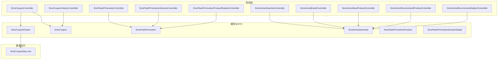
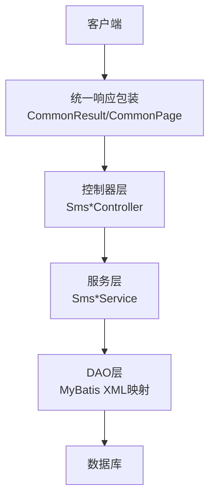
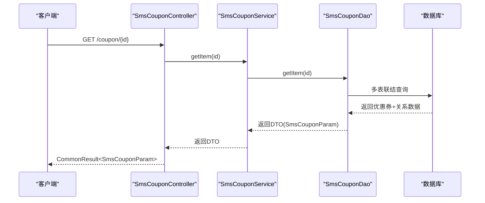
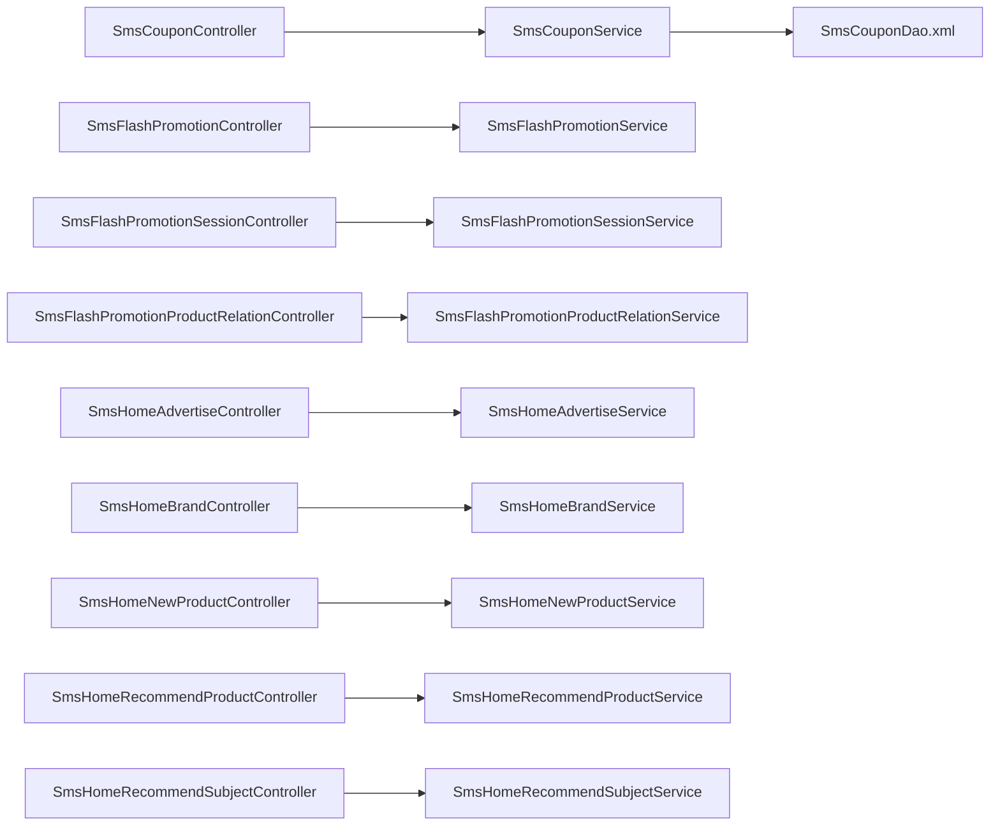

# 营销管理API

<cite>
**本文档引用的文件**
- [SmsCouponController.java](file://mall-admin/src/main/java/com/macro/mall/controller/SmsCouponController.java)
- [SmsCouponHistoryController.java](file://mall-admin/src/main/java/com/macro/mall/controller/SmsCouponHistoryController.java)
- [SmsFlashPromotionController.java](file://mall-admin/src/main/java/com/macro/mall/controller/SmsFlashPromotionController.java)
- [SmsFlashPromotionSessionController.java](file://mall-admin/src/main/java/com/macro/mall/controller/SmsFlashPromotionSessionController.java)
- [SmsFlashPromotionProductRelationController.java](file://mall-admin/src/main/java/com/macro/mall/controller/SmsFlashPromotionProductRelationController.java)
- [SmsHomeAdvertiseController.java](file://mall-admin/src/main/java/com/macro/mall/controller/SmsHomeAdvertiseController.java)
- [SmsHomeBrandController.java](file://mall-admin/src/main/java/com/macro/mall/controller/SmsHomeBrandController.java)
- [SmsHomeNewProductController.java](file://mall-admin/src/main/java/com/macro/mall/controller/SmsHomeNewProductController.java)
- [SmsHomeRecommendProductController.java](file://mall-admin/src/main/java/com/macro/mall/controller/SmsHomeRecommendProductController.java)
- [SmsHomeRecommendSubjectController.java](file://mall-admin/src/main/java/com/macro/mall/controller/SmsHomeRecommendSubjectController.java)
- [SmsCouponParam.java](file://mall-admin/src/main/java/com/macro/mall/dto/SmsCouponParam.java)
- [SmsFlashPromotionProduct.java](file://mall-admin/src/main/java/com/macro/mall/dto/SmsFlashPromotionProduct.java)
- [SmsFlashPromotionSessionDetail.java](file://mall-admin/src/main/java/com/macro/mall/dto/SmsFlashPromotionSessionDetail.java)
- [SmsCoupon.java](file://mall-mbg/src/main/java/com/macro/mall/model/SmsCoupon.java)
- [SmsFlashPromotion.java](file://mall-mbg/src/main/java/com/macro/mall/model/SmsFlashPromotion.java)
- [SmsHomeAdvertise.java](file://mall-mbg/src/main/java/com/macro/mall/model/SmsHomeAdvertise.java)
- [SmsCouponDao.xml](file://mall-admin/src/main/resources/dao/SmsCouponDao.xml)
</cite>

## 目录
1. [简介](#简介)
2. [项目结构](#项目结构)
3. [核心组件](#核心组件)
4. [架构总览](#架构总览)
5. [详细组件分析](#详细组件分析)
6. [依赖关系分析](#依赖关系分析)
7. [性能考虑](#性能考虑)
8. [故障排除指南](#故障排除指南)
9. [结论](#结论)

## 简介
本文件面向营销管理相关API的使用与维护，覆盖以下功能域：
- 优惠券管理：创建、删除、更新、分页查询、详情查询及优惠券绑定商品/分类关系
- 优惠券使用记录：按优惠券、使用状态、订单号等条件分页查询
- 限时购管理：活动创建、状态变更、删除、列表查询；场次管理（创建、排序、启用/禁用、删除、查询）；限时购与商品关系管理（批量绑定、分页查询）
- 首页营销配置：首页轮播广告、品牌推荐、新品推荐、专题推荐的增删改查与状态/排序管理

所有接口均采用统一响应包装，支持分页返回。

## 项目结构
营销管理API主要位于 mall-admin 模块的 controller 层，配合 service 层与 DAO/XML 映射完成业务处理与数据持久化。优惠券详情通过自定义 DTO 封装商品与分类关系，限时购产品信息通过 DTO 封装商品实体。

**图表来源**
- [SmsCouponController.java:1-73](file://mall-admin/src/main/java/com/macro/mall/controller/SmsCouponController.java#L1-L73)
- [SmsCouponHistoryController.java:1-39](file://mall-admin/src/main/java/com/macro/mall/controller/SmsCouponHistoryController.java#L1-L39)
- [SmsFlashPromotionController.java:1-81](file://mall-admin/src/main/java/com/macro/mall/controller/SmsFlashPromotionController.java#L1-L81)
- [SmsFlashPromotionSessionController.java:1-85](file://mall-admin/src/main/java/com/macro/mall/controller/SmsFlashPromotionSessionController.java#L1-L85)
- [SmsFlashPromotionProductRelationController.java:1-73](file://mall-admin/src/main/java/com/macro/mall/controller/SmsFlashPromotionProductRelationController.java#L1-L73)
- [SmsHomeAdvertiseController.java:1-79](file://mall-admin/src/main/java/com/macro/mall/controller/SmsHomeAdvertiseController.java#L1-L79)
- [SmsHomeBrandController.java:1-75](file://mall-admin/src/main/java/com/macro/mall/controller/SmsHomeBrandController.java#L1-L75)
- [SmsHomeNewProductController.java:1-75](file://mall-admin/src/main/java/com/macro/mall/controller/SmsHomeNewProductController.java#L1-L75)
- [SmsHomeRecommendProductController.java:1-75](file://mall-admin/src/main/java/com/macro/mall/controller/SmsHomeRecommendProductController.java#L1-L75)
- [SmsHomeRecommendSubjectController.java:1-75](file://mall-admin/src/main/java/com/macro/mall/controller/SmsHomeRecommendSubjectController.java#L1-L75)
- [SmsCouponParam.java:1-23](file://mall-admin/src/main/java/com/macro/mall/dto/SmsCouponParam.java#L1-L23)
- [SmsFlashPromotionProduct.java:1-17](file://mall-admin/src/main/java/com/macro/mall/dto/SmsFlashPromotionProduct.java#L1-L17)
- [SmsFlashPromotionSessionDetail.java:1-16](file://mall-admin/src/main/java/com/macro/mall/dto/SmsFlashPromotionSessionDetail.java#L1-L16)
- [SmsCoupon.java:1-218](file://mall-mbg/src/main/java/com/macro/mall/model/SmsCoupon.java#L1-L218)
- [SmsFlashPromotion.java:1-85](file://mall-mbg/src/main/java/com/macro/mall/model/SmsFlashPromotion.java#L1-L85)
- [SmsHomeAdvertise.java:1-151](file://mall-mbg/src/main/java/com/macro/mall/model/SmsHomeAdvertise.java#L1-L151)
- [SmsCouponDao.xml:1-28](file://mall-admin/src/main/resources/dao/SmsCouponDao.xml#L1-L28)

**章节来源**
- [SmsCouponController.java:1-73](file://mall-admin/src/main/java/com/macro/mall/controller/SmsCouponController.java#L1-L73)
- [SmsCouponHistoryController.java:1-39](file://mall-admin/src/main/java/com/macro/mall/controller/SmsCouponHistoryController.java#L1-L39)
- [SmsFlashPromotionController.java:1-81](file://mall-admin/src/main/java/com/macro/mall/controller/SmsFlashPromotionController.java#L1-L81)
- [SmsFlashPromotionSessionController.java:1-85](file://mall-admin/src/main/java/com/macro/mall/controller/SmsFlashPromotionSessionController.java#L1-L85)
- [SmsFlashPromotionProductRelationController.java:1-73](file://mall-admin/src/main/java/com/macro/mall/controller/SmsFlashPromotionProductRelationController.java#L1-L73)
- [SmsHomeAdvertiseController.java:1-79](file://mall-admin/src/main/java/com/macro/mall/controller/SmsHomeAdvertiseController.java#L1-L79)
- [SmsHomeBrandController.java:1-75](file://mall-admin/src/main/java/com/macro/mall/controller/SmsHomeBrandController.java#L1-L75)
- [SmsHomeNewProductController.java:1-75](file://mall-admin/src/main/java/com/macro/mall/controller/SmsHomeNewProductController.java#L1-L75)
- [SmsHomeRecommendProductController.java:1-75](file://mall-admin/src/main/java/com/macro/mall/controller/SmsHomeRecommendProductController.java#L1-L75)
- [SmsHomeRecommendSubjectController.java:1-75](file://mall-admin/src/main/java/com/macro/mall/controller/SmsHomeRecommendSubjectController.java#L1-L75)
- [SmsCouponParam.java:1-23](file://mall-admin/src/main/java/com/macro/mall/dto/SmsCouponParam.java#L1-L23)
- [SmsFlashPromotionProduct.java:1-17](file://mall-admin/src/main/java/com/macro/mall/dto/SmsFlashPromotionProduct.java#L1-L17)
- [SmsFlashPromotionSessionDetail.java:1-16](file://mall-admin/src/main/java/com/macro/mall/dto/SmsFlashPromotionSessionDetail.java#L1-L16)
- [SmsCoupon.java:1-218](file://mall-mbg/src/main/java/com/macro/mall/model/SmsCoupon.java#L1-L218)
- [SmsFlashPromotion.java:1-85](file://mall-mbg/src/main/java/com/macro/mall/model/SmsFlashPromotion.java#L1-L85)
- [SmsHomeAdvertise.java:1-151](file://mall-mbg/src/main/java/com/macro/mall/model/SmsHomeAdvertise.java#L1-L151)
- [SmsCouponDao.xml:1-28](file://mall-admin/src/main/resources/dao/SmsCouponDao.xml#L1-L28)

## 核心组件
- 控制器层：各模块控制器负责接收HTTP请求、参数校验、调用服务层并返回统一响应包装
- DTO层：用于复杂对象封装，如优惠券详情包含商品与分类关系、限时购商品信息包含商品实体、场次详情包含商品数量
- 模型层：对应数据库表结构，如优惠券、限时购活动、首页广告等
- 数据访问层：通过XML映射文件进行复杂查询，如优惠券详情的多表联结查询

**章节来源**
- [SmsCouponParam.java:1-23](file://mall-admin/src/main/java/com/macro/mall/dto/SmsCouponParam.java#L1-L23)
- [SmsFlashPromotionProduct.java:1-17](file://mall-admin/src/main/java/com/macro/mall/dto/SmsFlashPromotionProduct.java#L1-L17)
- [SmsFlashPromotionSessionDetail.java:1-16](file://mall-admin/src/main/java/com/macro/mall/dto/SmsFlashPromotionSessionDetail.java#L1-L16)
- [SmsCoupon.java:1-218](file://mall-mbg/src/main/java/com/macro/mall/model/SmsCoupon.java#L1-L218)
- [SmsFlashPromotion.java:1-85](file://mall-mbg/src/main/java/com/macro/mall/model/SmsFlashPromotion.java#L1-L85)
- [SmsHomeAdvertise.java:1-151](file://mall-mbg/src/main/java/com/macro/mall/model/SmsHomeAdvertise.java#L1-L151)
- [SmsCouponDao.xml:1-28](file://mall-admin/src/main/resources/dao/SmsCouponDao.xml#L1-L28)

## 架构总览
营销管理API遵循经典的三层架构：控制层负责接口暴露与参数处理，服务层承载业务逻辑，DAO/XML映射负责数据访问。统一响应包装确保前后端交互一致性。

[此图为概念性架构示意，不直接映射具体源码文件，故不提供图表来源]

## 详细组件分析

### 优惠券管理API
- 接口概览
  - 创建优惠券：POST /coupon/create
  - 删除优惠券：POST /coupon/delete/{id}
  - 更新优惠券：POST /coupon/update/{id}
  - 分页查询：GET /coupon/list
  - 获取详情：GET /coupon/{id}
- 请求与响应
  - 请求体：SmsCouponParam（包含优惠券基础信息以及绑定商品与分类关系列表）
  - 响应：CommonResult<Integer> 或 CommonResult<SmsCouponParam>
- 业务要点
  - 优惠券详情通过自定义DTO封装，包含商品关系与分类关系集合
  - 详情查询通过XML映射进行多表联结，一次性返回优惠券及其绑定关系
- 调用示例路径
  - 创建：[SmsCouponController.create:25-33](file://mall-admin/src/main/java/com/macro/mall/controller/SmsCouponController.java#L25-L33)
  - 列表：[SmsCouponController.list:55-64](file://mall-admin/src/main/java/com/macro/mall/controller/SmsCouponController.java#L55-L64)
  - 详情：[SmsCouponController.getItem:66-71](file://mall-admin/src/main/java/com/macro/mall/controller/SmsCouponController.java#L66-L71)
- 详情查询流程

**图表来源**
- [SmsCouponController.java:66-71](file://mall-admin/src/main/java/com/macro/mall/controller/SmsCouponController.java#L66-L71)
- [SmsCouponDao.xml:10-27](file://mall-admin/src/main/resources/dao/SmsCouponDao.xml#L10-L27)

**章节来源**
- [SmsCouponController.java:1-73](file://mall-admin/src/main/java/com/macro/mall/controller/SmsCouponController.java#L1-L73)
- [SmsCouponParam.java:1-23](file://mall-admin/src/main/java/com/macro/mall/dto/SmsCouponParam.java#L1-L23)
- [SmsCouponDao.xml:1-28](file://mall-admin/src/main/resources/dao/SmsCouponDao.xml#L1-L28)

### 优惠券使用记录API
- 接口概览
  - 分页查询：GET /couponHistory/list
  - 支持过滤：couponId、useStatus、orderSn
- 请求与响应
  - 响应：CommonResult<CommonPage<SmsCouponHistory>>
- 调用示例路径
  - 查询：[SmsCouponHistoryController.list:28-37](file://mall-admin/src/main/java/com/macro/mall/controller/SmsCouponHistoryController.java#L28-L37)

**章节来源**
- [SmsCouponHistoryController.java:1-39](file://mall-admin/src/main/java/com/macro/mall/controller/SmsCouponHistoryController.java#L1-L39)

### 限时购活动管理API
- 接口概览
  - 创建活动：POST /flash/create
  - 更新活动：POST /flash/update/{id}
  - 删除活动：POST /flash/delete/{id}
  - 更新状态：POST /flash/update/status/{id}
  - 获取活动：GET /flash/{id}
  - 分页查询：GET /flash/list
- 请求与响应
  - 请求体：SmsFlashPromotion
  - 响应：CommonResult<Integer> 或 CommonResult<SmsFlashPromotion>
- 调用示例路径
  - 创建：[SmsFlashPromotionController.create:25-33](file://mall-admin/src/main/java/com/macro/mall/controller/SmsFlashPromotionController.java#L25-L33)
  - 列表：[SmsFlashPromotionController.list:72-79](file://mall-admin/src/main/java/com/macro/mall/controller/SmsFlashPromotionController.java#L72-L79)

**章节来源**
- [SmsFlashPromotionController.java:1-81](file://mall-admin/src/main/java/com/macro/mall/controller/SmsFlashPromotionController.java#L1-L81)
- [SmsFlashPromotion.java:1-85](file://mall-mbg/src/main/java/com/macro/mall/model/SmsFlashPromotion.java#L1-L85)

### 限时购场次管理API
- 接口概览
  - 创建场次：POST /flashSession/create
  - 更新场次：POST /flashSession/update/{id}
  - 更新状态：POST /flashSession/update/status/{id}
  - 删除场次：POST /flashSession/delete/{id}
  - 获取场次：GET /flashSession/{id}
  - 全量列表：GET /flashSession/list
  - 场次选择列表（含商品数量）：GET /flashSession/selectList
- 请求与响应
  - 请求体：SmsFlashPromotionSession
  - 响应：CommonResult<Integer> 或 CommonResult<List<SmsFlashPromotionSessionDetail>>
- 调用示例路径
  - 列表：[SmsFlashPromotionSessionController.list:72-76](file://mall-admin/src/main/java/com/macro/mall/controller/SmsFlashPromotionSessionController.java#L72-L76)
  - 选择列表：[SmsFlashPromotionSessionController.selectList:79-84](file://mall-admin/src/main/java/com/macro/mall/controller/SmsFlashPromotionSessionController.java#L79-L84)

**章节来源**
- [SmsFlashPromotionSessionController.java:1-85](file://mall-admin/src/main/java/com/macro/mall/controller/SmsFlashPromotionSessionController.java#L1-L85)
- [SmsFlashPromotionSessionDetail.java:1-16](file://mall-admin/src/main/java/com/macro/mall/dto/SmsFlashPromotionSessionDetail.java#L1-L16)

### 限时购与商品关系管理API
- 接口概览
  - 批量创建关系：POST /flashProductRelation/create
  - 更新关系：POST /flashProductRelation/update/{id}
  - 删除关系：POST /flashProductRelation/delete/{id}
  - 获取关系：GET /flashProductRelation/{id}
  - 分页查询（按活动与场次）：GET /flashProductRelation/list
- 请求与响应
  - 请求体：List<SmsFlashPromotionProductRelation> 或单个关系实体
  - 响应：CommonResult<Integer> 或 CommonResult<CommonPage<SmsFlashPromotionProduct>>
- 关系DTO
  - SmsFlashPromotionProduct：在关系实体基础上增加商品实体字段
- 调用示例路径
  - 创建：[SmsFlashPromotionProductRelationController.create:26-34](file://mall-admin/src/main/java/com/macro/mall/controller/SmsFlashPromotionProductRelationController.java#L26-L34)
  - 列表：[SmsFlashPromotionProductRelationController.list:63-71](file://mall-admin/src/main/java/com/macro/mall/controller/SmsFlashPromotionProductRelationController.java#L63-L71)

**章节来源**
- [SmsFlashPromotionProductRelationController.java:1-73](file://mall-admin/src/main/java/com/macro/mall/controller/SmsFlashPromotionProductRelationController.java#L1-L73)
- [SmsFlashPromotionProduct.java:1-17](file://mall-admin/src/main/java/com/macro/mall/dto/SmsFlashPromotionProduct.java#L1-L17)

### 首页营销配置API

#### 首页轮播广告API
- 接口概览
  - 创建广告：POST /home/advertise/create
  - 更新广告：POST /home/advertise/update/{id}
  - 删除广告：POST /home/advertise/delete
  - 更新状态：POST /home/advertise/update/status/{id}
  - 获取广告：GET /home/advertise/{id}
  - 分页查询：GET /home/advertise/list
- 请求与响应
  - 请求体：SmsHomeAdvertise
  - 响应：CommonResult<Integer> 或 CommonResult<CommonPage<SmsHomeAdvertise>>
- 调用示例路径
  - 列表：[SmsHomeAdvertiseController.list:68-77](file://mall-admin/src/main/java/com/macro/mall/controller/SmsHomeAdvertiseController.java#L68-L77)

**章节来源**
- [SmsHomeAdvertiseController.java:1-79](file://mall-admin/src/main/java/com/macro/mall/controller/SmsHomeAdvertiseController.java#L1-L79)
- [SmsHomeAdvertise.java:1-151](file://mall-mbg/src/main/java/com/macro/mall/model/SmsHomeAdvertise.java#L1-L151)

#### 首页品牌推荐API
- 接口概览
  - 批量创建：POST /home/brand/create
  - 更新排序：POST /home/brand/update/sort/{id}
  - 批量删除：POST /home/brand/delete
  - 批量更新推荐状态：POST /home/brand/update/recommendStatus
  - 分页查询：GET /home/brand/list
- 请求与响应
  - 请求体：List<SmsHomeBrand>
  - 响应：CommonResult<Integer> 或 CommonResult<CommonPage<SmsHomeBrand>>
- 调用示例路径
  - 列表：[SmsHomeBrandController.list:65-73](file://mall-admin/src/main/java/com/macro/mall/controller/SmsHomeBrandController.java#L65-L73)

**章节来源**
- [SmsHomeBrandController.java:1-75](file://mall-admin/src/main/java/com/macro/mall/controller/SmsHomeBrandController.java#L1-L75)

#### 首页新品推荐API
- 接口概览
  - 批量创建：POST /home/newProduct/create
  - 更新排序：POST /home/newProduct/update/sort/{id}
  - 批量删除：POST /home/newProduct/delete
  - 批量更新推荐状态：POST /home/newProduct/update/recommendStatus
  - 分页查询：GET /home/newProduct/list
- 请求与响应
  - 请求体：List<SmsHomeNewProduct>
  - 响应：CommonResult<Integer> 或 CommonResult<CommonPage<SmsHomeNewProduct>>
- 调用示例路径
  - 列表：[SmsHomeNewProductController.list:65-73](file://mall-admin/src/main/java/com/macro/mall/controller/SmsHomeNewProductController.java#L65-L73)

**章节来源**
- [SmsHomeNewProductController.java:1-75](file://mall-admin/src/main/java/com/macro/mall/controller/SmsHomeNewProductController.java#L1-L75)

#### 首页人气推荐API
- 接口概览
  - 批量创建：POST /home/recommendProduct/create
  - 更新排序：POST /home/recommendProduct/update/sort/{id}
  - 批量删除：POST /home/recommendProduct/delete
  - 批量更新推荐状态：POST /home/recommendProduct/update/recommendStatus
  - 分页查询：GET /home/recommendProduct/list
- 请求与响应
  - 请求体：List<SmsHomeRecommendProduct>
  - 响应：CommonResult<Integer> 或 CommonResult<CommonPage<SmsHomeRecommendProduct>>
- 调用示例路径
  - 列表：[SmsHomeRecommendProductController.list:65-73](file://mall-admin/src/main/java/com/macro/mall/controller/SmsHomeRecommendProductController.java#L65-L73)

**章节来源**
- [SmsHomeRecommendProductController.java:1-75](file://mall-admin/src/main/java/com/macro/mall/controller/SmsHomeRecommendProductController.java#L1-L75)

#### 首页专题推荐API
- 接口概览
  - 批量创建：POST /home/recommendSubject/create
  - 更新排序：POST /home/recommendSubject/update/sort/{id}
  - 批量删除：POST /home/recommendSubject/delete
  - 批量更新推荐状态：POST /home/recommendSubject/update/recommendStatus
  - 分页查询：GET /home/recommendSubject/list
- 请求与响应
  - 请求体：List<SmsHomeRecommendSubject>
  - 响应：CommonResult<Integer> 或 CommonResult<CommonPage<SmsHomeRecommendSubject>>
- 调用示例路径
  - 列表：[SmsHomeRecommendSubjectController.list:65-73](file://mall-admin/src/main/java/com/macro/mall/controller/SmsHomeRecommendSubjectController.java#L65-L73)

**章节来源**
- [SmsHomeRecommendSubjectController.java:1-75](file://mall-admin/src/main/java/com/macro/mall/controller/SmsHomeRecommendSubjectController.java#L1-L75)

## 依赖关系分析
- 控制器到服务层：各控制器通过@Autowired注入对应Service，调用其业务方法
- 服务层到DAO：服务层通过DAO执行数据库操作，部分复杂查询通过XML映射实现
- DTO到模型：DTO扩展或组合模型类，用于跨层传输复杂对象
- 统一响应：所有控制器返回值均被CommonResult/CommonPage包装，保证响应格式一致

**图表来源**
- [SmsCouponController.java:1-73](file://mall-admin/src/main/java/com/macro/mall/controller/SmsCouponController.java#L1-L73)
- [SmsFlashPromotionController.java:1-81](file://mall-admin/src/main/java/com/macro/mall/controller/SmsFlashPromotionController.java#L1-L81)
- [SmsFlashPromotionSessionController.java:1-85](file://mall-admin/src/main/java/com/macro/mall/controller/SmsFlashPromotionSessionController.java#L1-L85)
- [SmsFlashPromotionProductRelationController.java:1-73](file://mall-admin/src/main/java/com/macro/mall/controller/SmsFlashPromotionProductRelationController.java#L1-L73)
- [SmsHomeAdvertiseController.java:1-79](file://mall-admin/src/main/java/com/macro/mall/controller/SmsHomeAdvertiseController.java#L1-L79)
- [SmsHomeBrandController.java:1-75](file://mall-admin/src/main/java/com/macro/mall/controller/SmsHomeBrandController.java#L1-L75)
- [SmsHomeNewProductController.java:1-75](file://mall-admin/src/main/java/com/macro/mall/controller/SmsHomeNewProductController.java#L1-L75)
- [SmsHomeRecommendProductController.java:1-75](file://mall-admin/src/main/java/com/macro/mall/controller/SmsHomeRecommendProductController.java#L1-L75)
- [SmsHomeRecommendSubjectController.java:1-75](file://mall-admin/src/main/java/com/macro/mall/controller/SmsHomeRecommendSubjectController.java#L1-L75)
- [SmsCouponDao.xml:1-28](file://mall-admin/src/main/resources/dao/SmsCouponDao.xml#L1-L28)

**章节来源**
- [SmsCouponController.java:1-73](file://mall-admin/src/main/java/com/macro/mall/controller/SmsCouponController.java#L1-L73)
- [SmsFlashPromotionController.java:1-81](file://mall-admin/src/main/java/com/macro/mall/controller/SmsFlashPromotionController.java#L1-L81)
- [SmsFlashPromotionSessionController.java:1-85](file://mall-admin/src/main/java/com/macro/mall/controller/SmsFlashPromotionSessionController.java#L1-L85)
- [SmsFlashPromotionProductRelationController.java:1-73](file://mall-admin/src/main/java/com/macro/mall/controller/SmsFlashPromotionProductRelationController.java#L1-L73)
- [SmsHomeAdvertiseController.java:1-79](file://mall-admin/src/main/java/com/macro/mall/controller/SmsHomeAdvertiseController.java#L1-L79)
- [SmsHomeBrandController.java:1-75](file://mall-admin/src/main/java/com/macro/mall/controller/SmsHomeBrandController.java#L1-L75)
- [SmsHomeNewProductController.java:1-75](file://mall-admin/src/main/java/com/macro/mall/controller/SmsHomeNewProductController.java#L1-L75)
- [SmsHomeRecommendProductController.java:1-75](file://mall-admin/src/main/java/com/macro/mall/controller/SmsHomeRecommendProductController.java#L1-L75)
- [SmsHomeRecommendSubjectController.java:1-75](file://mall-admin/src/main/java/com/macro/mall/controller/SmsHomeRecommendSubjectController.java#L1-L75)
- [SmsCouponDao.xml:1-28](file://mall-admin/src/main/resources/dao/SmsCouponDao.xml#L1-L28)

## 性能考虑
- 分页查询：所有列表接口均支持分页参数，建议前端传入合理的pageSize与pageNum以避免大数据量查询
- 复杂查询：优惠券详情通过XML映射进行多表联结，建议在相关字段建立索引以提升查询性能
- 批量操作：首页推荐类接口支持批量创建与批量删除，减少网络往返次数
- 缓存策略：可结合系统缓存方案对热点配置进行缓存，降低数据库压力

[本节为通用性能建议，不直接分析具体文件，故不提供章节来源]

## 故障排除指南
- 统一异常处理：系统提供全局异常处理器，统一捕获业务异常并返回标准错误码
- 参数校验：控制器层对必填参数进行校验，非法参数将返回失败响应
- 常见问题
  - 创建/更新失败：检查请求体字段是否完整，特别是枚举类型与时间字段
  - 查询无结果：确认分页参数与筛选条件是否正确
  - 关系绑定异常：限时购商品关系需确保活动与场次有效且商品存在

[本节为通用故障排除建议，不直接分析具体文件，故不提供章节来源]

## 结论
本文档梳理了营销管理相关API的接口规范与业务逻辑，覆盖优惠券、限时购与首页营销配置三大领域。通过统一的控制器、DTO与XML映射，实现了清晰的职责分离与良好的扩展性。建议在实际使用中关注分页参数、批量操作与缓存策略，以获得更优的性能与用户体验。