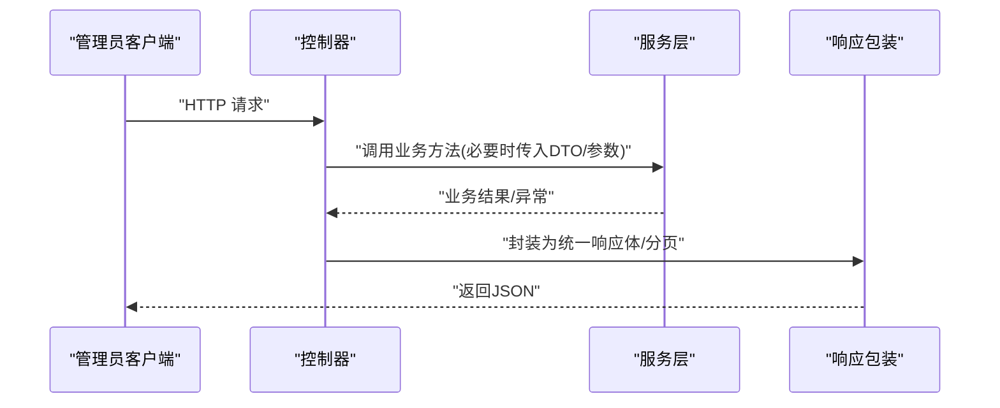

```mermaid
classDiagram
class OmsOrderController
class OmsOrderReturnApplyController
class OmsOrderReturnReasonController
class OmsCompanyAddressController
class OmsOrderSettingController
class OmsOrderService
class OmsOrderReturnApplyService
class OmsOrderReturnReasonService
class OmsCompanyAddressService
class OmsOrderSettingService
class OmsOrderQueryParam
class OmsOrderDetail
class OmsOrderDeliveryParam
class OmsReceiverInfoParam
class OmsMoneyInfoParam
class CommonResult
class CommonPage
OmsOrderController --> OmsOrderService : "依赖"
OmsOrderReturnApplyController --> OmsOrderReturnApplyService : "依赖"
OmsOrderReturnReasonController --> OmsOrderReturnReasonService : "依赖"
OmsCompanyAddressController --> OmsCompanyAddressService : "依赖"
OmsOrderSettingController --> OmsOrderSettingService : "依赖"
OmsOrderController --> OmsOrderQueryParam : "使用"
OmsOrderController --> OmsOrderDetail : "使用"
OmsOrderController --> OmsOrderDeliveryParam : "使用"
OmsOrderController --> OmsReceiverInfoParam : "使用"
OmsOrderController --> OmsMoneyInfoParam : "使用"
OmsOrderController --> CommonResult : "返回"
OmsOrderController --> CommonPage : "返回"
OmsOrderReturnApplyController --> CommonResult : "返回"
OmsOrderReturnApplyController --> CommonPage : "返回"
OmsOrderReturnReasonController --> CommonResult : "返回"
OmsOrderReturnReasonController --> CommonPage : "返回"
OmsCompanyAddressController --> CommonResult : "返回"
OmsOrderSettingController --> CommonResult : "返回"
```

# 订单管理API

<cite>
**本文引用的文件**
- [OmsOrderController.java](file://mall-admin/src/main/java/com/macro/mall/controller/OmsOrderController.java)
- [OmsOrderReturnApplyController.java](file://mall-admin/src/main/java/com/macro/mall/controller/OmsOrderReturnApplyController.java)
- [OmsOrderReturnReasonController.java](file://mall-admin/src/main/java/com/macro/mall/controller/OmsOrderReturnReasonController.java)
- [OmsCompanyAddressController.java](file://mall-admin/src/main/java/com/macro/mall/controller/OmsCompanyAddressController.java)
- [OmsOrderSettingController.java](file://mall-admin/src/main/java/com/macro/mall/controller/OmsOrderSettingController.java)
- [OmsOrderService.java](file://mall-admin/src/main/java/com/macro/mall/service/OmsOrderService.java)
- [OmsOrderReturnApplyService.java](file://mall-admin/src/main/java/com/macro/mall/service/OmsOrderReturnApplyService.java)
- [OmsOrderReturnReasonService.java](file://mall-admin/src/main/java/com/macro/mall/service/OmsOrderReturnReasonService.java)
- [OmsCompanyAddressService.java](file://mall-admin/src/main/java/com/macro/mall/service/OmsCompanyAddressService.java)
- [OmsOrderSettingService.java](file://mall-admin/src/main/java/com/macro/mall/service/OmsOrderSettingService.java)
- [OmsOrderQueryParam.java](file://mall-admin/src/main/java/com/macro/mall/dto/OmsOrderQueryParam.java)
- [OmsOrderDetail.java](file://mall-admin/src/main/java/com/macro/mall/dto/OmsOrderDetail.java)
- [OmsOrderDeliveryParam.java](file://mall-admin/src/main/java/com/macro/mall/dto/OmsOrderDeliveryParam.java)
- [OmsReceiverInfoParam.java](file://mall-admin/src/main/java/com/macro/mall/dto/OmsReceiverInfoParam.java)
- [OmsMoneyInfoParam.java](file://mall-admin/src/main/java/com/macro/mall/dto/OmsMoneyInfoParam.java)
- [CommonResult.java](file://mall-common/src/main/java/com/macro/mall/common/api/CommonResult.java)
- [CommonPage.java](file://mall-common/src/main/java/com/macro/mall/common/api/CommonPage.java)
</cite>

## 目录
1. [简介](#简介)
2. [项目结构](#项目结构)
3. [核心组件](#核心组件)
4. [架构总览](#架构总览)
5. [详细组件分析](#详细组件分析)
6. [依赖关系分析](#依赖关系分析)
7. [性能考虑](#性能考虑)
8. [故障排查指南](#故障排查指南)
9. [结论](#结论)

## 简介
本文件面向管理员端（后台）的订单管理相关API，覆盖以下功能域：
- 订单查询与详情：订单列表、订单详情、发货、关闭、删除、修改收货人信息、修改费用信息、修改备注
- 退货申请处理：退货申请列表、详情、审核状态更新、批量删除
- 退货原因设置：新增、编辑、删除、分页查询、启用/禁用切换
- 公司地址管理：获取所有公司收货地址
- 订单设置：获取与更新订单配置项

文档同时给出接口调用规范、参数校验要点、权限控制建议以及错误处理机制说明，并通过流程图与时序图展示关键业务逻辑。

## 项目结构
- 控制器层：各模块的HTTP入口，负责接收请求、组装分页参数并调用服务层
- DTO层：封装查询参数、返回详情、发货参数、收货人与费用修改参数等
- 服务层：定义订单、退货申请、退货原因、公司地址、订单设置等业务接口
- 响应包装：统一使用通用响应体与分页包装对象

```mermaid
graph TB
subgraph "控制器层"
C_Order["OmsOrderController"]
C_ReturnApply["OmsOrderReturnApplyController"]
C_ReturnReason["OmsOrderReturnReasonController"]
C_CompanyAddr["OmsCompanyAddressController"]
C_OrderSetting["OmsOrderSettingController"]
end
subgraph "服务层"
S_Order["OmsOrderService"]
S_ReturnApply["OmsOrderReturnApplyService"]
S_ReturnReason["OmsOrderReturnReasonService"]
S_CompanyAddr["OmsCompanyAddressService"]
S_OrderSetting["OmsOrderSettingService"]
end
subgraph "响应与数据传输"
R_Common["CommonResult"]
R_Page["CommonPage"]
DTO_OrderQuery["OmsOrderQueryParam"]
DTO_OrderDetail["OmsOrderDetail"]
DTO_Delivery["OmsOrderDeliveryParam"]
DTO_Receiver["OmsReceiverInfoParam"]
DTO_Money["OmsMoneyInfoParam"]
end
C_Order --> S_Order
C_ReturnApply --> S_ReturnApply
C_ReturnReason --> S_ReturnReason
C_CompanyAddr --> S_CompanyAddr
C_OrderSetting --> S_OrderSetting
C_Order -- "使用" --> DTO_OrderQuery
C_Order -- "使用" --> DTO_OrderDetail
C_Order -- "使用" --> DTO_Delivery
C_Order -- "使用" --> DTO_Receiver
C_Order -- "使用" --> DTO_Money
C_Order --> R_Common
C_Order --> R_Page
C_ReturnApply --> R_Common
C_ReturnApply --> R_Page
C_ReturnReason --> R_Common
C_ReturnReason --> R_Page
C_CompanyAddr --> R_Common
C_OrderSetting --> R_Common
```

图表来源
- [OmsOrderController.java:1-104](file://mall-admin/src/main/java/com/macro/mall/controller/OmsOrderController.java#L1-L104)
- [OmsOrderReturnApplyController.java:1-65](file://mall-admin/src/main/java/com/macro/mall/controller/OmsOrderReturnApplyController.java#L1-L65)
- [OmsOrderReturnReasonController.java:1-81](file://mall-admin/src/main/java/com/macro/mall/controller/OmsOrderReturnReasonController.java#L1-L81)
- [OmsCompanyAddressController.java:1-33](file://mall-admin/src/main/java/com/macro/mall/controller/OmsCompanyAddressController.java#L1-L33)
- [OmsOrderSettingController.java:1-39](file://mall-admin/src/main/java/com/macro/mall/controller/OmsOrderSettingController.java#L1-L39)
- [OmsOrderService.java:1-59](file://mall-admin/src/main/java/com/macro/mall/service/OmsOrderService.java#L1-L59)
- [OmsOrderReturnApplyService.java:1-35](file://mall-admin/src/main/java/com/macro/mall/service/OmsOrderReturnApplyService.java#L1-L35)
- [OmsOrderReturnReasonService.java:1-42](file://mall-admin/src/main/java/com/macro/mall/service/OmsOrderReturnReasonService.java#L1-L42)
- [OmsCompanyAddressService.java:1-17](file://mall-admin/src/main/java/com/macro/mall/service/OmsCompanyAddressService.java#L1-L17)
- [OmsOrderSettingService.java:1-20](file://mall-admin/src/main/java/com/macro/mall/service/OmsOrderSettingService.java#L1-L20)
- [CommonResult.java](file://mall-common/src/main/java/com/macro/mall/common/api/CommonResult.java)
- [CommonPage.java](file://mall-common/src/main/java/com/macro/mall/common/api/CommonPage.java)

章节来源
- [OmsOrderController.java:1-104](file://mall-admin/src/main/java/com/macro/mall/controller/OmsOrderController.java#L1-L104)
- [OmsOrderReturnApplyController.java:1-65](file://mall-admin/src/main/java/com/macro/mall/controller/OmsOrderReturnApplyController.java#L1-L65)
- [OmsOrderReturnReasonController.java:1-81](file://mall-admin/src/main/java/com/macro/mall/controller/OmsOrderReturnReasonController.java#L1-L81)
- [OmsCompanyAddressController.java:1-33](file://mall-admin/src/main/java/com/macro/mall/controller/OmsCompanyAddressController.java#L1-L33)
- [OmsOrderSettingController.java:1-39](file://mall-admin/src/main/java/com/macro/mall/controller/OmsOrderSettingController.java#L1-L39)

## 核心组件
- 订单管理控制器：提供订单列表、详情、发货、关闭、删除、修改收货人信息、修改费用信息、修改备注等接口
- 退货申请控制器：提供退货申请列表、详情、状态更新、批量删除等接口
- 退货原因控制器：提供退货原因的增删改查与状态切换接口
- 公司地址控制器：提供获取所有公司收货地址接口
- 订单设置控制器：提供获取与更新订单配置接口

章节来源
- [OmsOrderController.java:1-104](file://mall-admin/src/main/java/com/macro/mall/controller/OmsOrderController.java#L1-L104)
- [OmsOrderReturnApplyController.java:1-65](file://mall-admin/src/main/java/com/macro/mall/controller/OmsOrderReturnApplyController.java#L1-L65)
- [OmsOrderReturnReasonController.java:1-81](file://mall-admin/src/main/java/com/macro/mall/controller/OmsOrderReturnReasonController.java#L1-L81)
- [OmsCompanyAddressController.java:1-33](file://mall-admin/src/main/java/com/macro/mall/controller/OmsCompanyAddressController.java#L1-L33)
- [OmsOrderSettingController.java:1-39](file://mall-admin/src/main/java/com/macro/mall/controller/OmsOrderSettingController.java#L1-L39)

## 架构总览
- 控制器层负责HTTP路由与参数解析
- 服务层定义业务契约，部分方法标注事务性
- DTO用于封装查询条件、详情聚合与变更参数
- 统一响应体与分页包装用于标准化输出

图表来源
- [OmsOrderController.java:1-104](file://mall-admin/src/main/java/com/macro/mall/controller/OmsOrderController.java#L1-L104)
- [OmsOrderReturnApplyController.java:1-65](file://mall-admin/src/main/java/com/macro/mall/controller/OmsOrderReturnApplyController.java#L1-L65)
- [OmsOrderReturnReasonController.java:1-81](file://mall-admin/src/main/java/com/macro/mall/controller/OmsOrderReturnReasonController.java#L1-L81)
- [OmsCompanyAddressController.java:1-33](file://mall-admin/src/main/java/com/macro/mall/controller/OmsCompanyAddressController.java#L1-L33)
- [OmsOrderSettingController.java:1-39](file://mall-admin/src/main/java/com/macro/mall/controller/OmsOrderSettingController.java#L1-L39)
- [CommonResult.java](file://mall-common/src/main/java/com/macro/mall/common/api/CommonResult.java)
- [CommonPage.java](file://mall-common/src/main/java/com/macro/mall/common/api/CommonPage.java)

## 详细组件分析

### 订单查询与详情
- 接口：GET /order/list
  - 功能：分页查询订单
  - 查询参数：订单号、收货人关键字、状态、订单类型、来源类型、创建时间
  - 分页参数：pageNum、pageSize
  - 返回：分页订单列表
- 接口：GET /order/{id}
  - 功能：获取订单详情
  - 路径参数：id
  - 返回：订单详情（包含订单明细与历史记录）

章节来源
- [OmsOrderController.java:26-33](file://mall-admin/src/main/java/com/macro/mall/controller/OmsOrderController.java#L26-L33)
- [OmsOrderController.java:65-70](file://mall-admin/src/main/java/com/macro/mall/controller/OmsOrderController.java#L65-L70)
- [OmsOrderQueryParam.java:1-20](file://mall-admin/src/main/java/com/macro/mall/dto/OmsOrderQueryParam.java#L1-L20)
- [OmsOrderDetail.java:1-23](file://mall-admin/src/main/java/com/macro/mall/dto/OmsOrderDetail.java#L1-L23)

### 发货操作
- 接口：POST /order/update/delivery
  - 功能：批量发货
  - 请求体：发货参数数组（订单ID、物流公司、物流单号）
  - 返回：受影响行数
  - 事务性：是

章节来源
- [OmsOrderController.java:35-43](file://mall-admin/src/main/java/com/macro/mall/controller/OmsOrderController.java#L35-L43)
- [OmsOrderDeliveryParam.java:1-17](file://mall-admin/src/main/java/com/macro/mall/dto/OmsOrderDeliveryParam.java#L1-L17)
- [OmsOrderService.java:22-23](file://mall-admin/src/main/java/com/macro/mall/service/OmsOrderService.java#L22-L23)

### 取消/关闭订单
- 接口：POST /order/update/close
  - 功能：批量关闭订单
  - 参数：ids（订单ID列表）、note（备注）
  - 返回：受影响行数
  - 事务性：是

章节来源
- [OmsOrderController.java:45-53](file://mall-admin/src/main/java/com/macro/mall/controller/OmsOrderController.java#L45-L53)
- [OmsOrderService.java:28-29](file://mall-admin/src/main/java/com/macro/mall/service/OmsOrderService.java#L28-L29)

### 删除订单
- 接口：POST /order/delete
  - 功能：批量删除订单
  - 参数：ids（订单ID列表）
  - 返回：受影响行数

章节来源
- [OmsOrderController.java:55-63](file://mall-admin/src/main/java/com/macro/mall/controller/OmsOrderController.java#L55-L63)
- [OmsOrderService.java:33-34](file://mall-admin/src/main/java/com/macro/mall/service/OmsOrderService.java#L33-L34)

### 修改收货人信息
- 接口：POST /order/update/receiverInfo
  - 功能：修改订单收货人信息与状态
  - 请求体：收货人信息参数（含订单ID、收货人姓名、电话、邮编、地址、省市区、状态）
  - 返回：受影响行数
  - 事务性：是

章节来源
- [OmsOrderController.java:72-80](file://mall-admin/src/main/java/com/macro/mall/controller/OmsOrderController.java#L72-L80)
- [OmsReceiverInfoParam.java:1-23](file://mall-admin/src/main/java/com/macro/mall/dto/OmsReceiverInfoParam.java#L1-L23)
- [OmsOrderService.java:44-45](file://mall-admin/src/main/java/com/macro/mall/service/OmsOrderService.java#L44-L45)

### 修改费用信息
- 接口：POST /order/update/moneyInfo
  - 功能：修改订单运费与优惠金额及状态
  - 请求体：费用信息参数（含订单ID、运费、优惠金额、状态）
  - 返回：受影响行数
  - 事务性：是

章节来源
- [OmsOrderController.java:82-90](file://mall-admin/src/main/java/com/macro/mall/controller/OmsOrderController.java#L82-L90)
- [OmsMoneyInfoParam.java:1-20](file://mall-admin/src/main/java/com/macro/mall/dto/OmsMoneyInfoParam.java#L1-L20)
- [OmsOrderService.java:50-51](file://mall-admin/src/main/java/com/macro/mall/service/OmsOrderService.java#L50-L51)

### 修改订单备注
- 接口：POST /order/update/note
  - 功能：修改订单备注与状态
  - 参数：id、note、status
  - 返回：受影响行数
  - 事务性：是

章节来源
- [OmsOrderController.java:92-102](file://mall-admin/src/main/java/com/macro/mall/controller/OmsOrderController.java#L92-L102)
- [OmsOrderService.java:56-57](file://mall-admin/src/main/java/com/macro/mall/service/OmsOrderService.java#L56-L57)

### 退货申请处理
- 接口：GET /returnApply/list
  - 功能：分页查询退货申请
  - 查询参数：同退货申请查询条件
  - 分页参数：pageNum、pageSize
  - 返回：分页退货申请列表
- 接口：GET /returnApply/{id}
  - 功能：获取退货申请详情
  - 路径参数：id
  - 返回：退货申请详情聚合结果
- 接口：POST /returnApply/update/status/{id}
  - 功能：更新退货申请状态
  - 路径参数：id
  - 请求体：状态更新参数
  - 返回：受影响行数
- 接口：POST /returnApply/delete
  - 功能：批量删除退货申请
  - 参数：ids（申请ID列表）
  - 返回：受影响行数

章节来源
- [OmsOrderReturnApplyController.java:28-35](file://mall-admin/src/main/java/com/macro/mall/controller/OmsOrderReturnApplyController.java#L28-L35)
- [OmsOrderReturnApplyController.java:47-52](file://mall-admin/src/main/java/com/macro/mall/controller/OmsOrderReturnApplyController.java#L47-L52)
- [OmsOrderReturnApplyController.java:54-62](file://mall-admin/src/main/java/com/macro/mall/controller/OmsOrderReturnApplyController.java#L54-L62)
- [OmsOrderReturnApplyController.java:37-45](file://mall-admin/src/main/java/com/macro/mall/controller/OmsOrderReturnApplyController.java#L37-L45)

### 退货原因设置
- 接口：POST /returnReason/create
  - 功能：新增退货原因
  - 请求体：退货原因对象
  - 返回：受影响行数
- 接口：POST /returnReason/update/{id}
  - 功能：更新退货原因
  - 路径参数：id
  - 请求体：退货原因对象
  - 返回：受影响行数
- 接口：POST /returnReason/delete
  - 功能：批量删除退货原因
  - 参数：ids（原因ID列表）
  - 返回：受影响行数
- 接口：GET /returnReason/list
  - 功能：分页查询退货原因
  - 分页参数：pageNum、pageSize
  - 返回：分页退货原因列表
- 接口：GET /returnReason/{id}
  - 功能：获取退货原因详情
  - 路径参数：id
  - 返回：退货原因对象
- 接口：POST /returnReason/update/status
  - 功能：批量启用/禁用退货原因
  - 参数：ids（原因ID列表）、status（目标状态）
  - 返回：受影响行数

章节来源
- [OmsOrderReturnReasonController.java:25-33](file://mall-admin/src/main/java/com/macro/mall/controller/OmsOrderReturnReasonController.java#L25-L33)
- [OmsOrderReturnReasonController.java:35-43](file://mall-admin/src/main/java/com/macro/mall/controller/OmsOrderReturnReasonController.java#L35-L43)
- [OmsOrderReturnReasonController.java:45-53](file://mall-admin/src/main/java/com/macro/mall/controller/OmsOrderReturnReasonController.java#L45-L53)
- [OmsOrderReturnReasonController.java:55-61](file://mall-admin/src/main/java/com/macro/mall/controller/OmsOrderReturnReasonController.java#L55-L61)
- [OmsOrderReturnReasonController.java:63-68](file://mall-admin/src/main/java/com/macro/mall/controller/OmsOrderReturnReasonController.java#L63-L68)
- [OmsOrderReturnReasonController.java:70-79](file://mall-admin/src/main/java/com/macro/mall/controller/OmsOrderReturnReasonController.java#L70-L79)

### 公司地址管理
- 接口：GET /companyAddress/list
  - 功能：获取所有公司收货地址
  - 返回：地址列表

章节来源
- [OmsCompanyAddressController.java:26-31](file://mall-admin/src/main/java/com/macro/mall/controller/OmsCompanyAddressController.java#L26-L31)

### 订单设置
- 接口：GET /orderSetting/{id}
  - 功能：获取指定订单设置
  - 路径参数：id
  - 返回：订单设置对象
- 接口：POST /orderSetting/update/{id}
  - 功能：更新指定订单设置
  - 路径参数：id
  - 请求体：订单设置对象
  - 返回：受影响行数

章节来源
- [OmsOrderSettingController.java:22-27](file://mall-admin/src/main/java/com/macro/mall/controller/OmsOrderSettingController.java#L22-L27)
- [OmsOrderSettingController.java:29-37](file://mall-admin/src/main/java/com/macro/mall/controller/OmsOrderSettingController.java#L29-L37)

## 依赖关系分析
- 控制器依赖对应的服务接口
- 服务接口定义业务契约，具体实现位于服务实现类中
- DTO用于控制器与服务之间的数据传递
- 统一响应体与分页包装用于标准化输出

图表来源
- [OmsOrderController.java:1-104](file://mall-admin/src/main/java/com/macro/mall/controller/OmsOrderController.java#L1-L104)
- [OmsOrderReturnApplyController.java:1-65](file://mall-admin/src/main/java/com/macro/mall/controller/OmsOrderReturnApplyController.java#L1-L65)
- [OmsOrderReturnReasonController.java:1-81](file://mall-admin/src/main/java/com/macro/mall/controller/OmsOrderReturnReasonController.java#L1-L81)
- [OmsCompanyAddressController.java:1-33](file://mall-admin/src/main/java/com/macro/mall/controller/OmsCompanyAddressController.java#L1-L33)
- [OmsOrderSettingController.java:1-39](file://mall-admin/src/main/java/com/macro/mall/controller/OmsOrderSettingController.java#L1-L39)
- [OmsOrderService.java:1-59](file://mall-admin/src/main/java/com/macro/mall/service/OmsOrderService.java#L1-L59)
- [OmsOrderReturnApplyService.java:1-35](file://mall-admin/src/main/java/com/macro/mall/service/OmsOrderReturnApplyService.java#L1-L35)
- [OmsOrderReturnReasonService.java:1-42](file://mall-admin/src/main/java/com/macro/mall/service/OmsOrderReturnReasonService.java#L1-L42)
- [OmsCompanyAddressService.java:1-17](file://mall-admin/src/main/java/com/macro/mall/service/OmsCompanyAddressService.java#L1-L17)
- [OmsOrderSettingService.java:1-20](file://mall-admin/src/main/java/com/macro/mall/service/OmsOrderSettingService.java#L1-L20)
- [OmsOrderQueryParam.java:1-20](file://mall-admin/src/main/java/com/macro/mall/dto/OmsOrderQueryParam.java#L1-L20)
- [OmsOrderDetail.java:1-23](file://mall-admin/src/main/java/com/macro/mall/dto/OmsOrderDetail.java#L1-L23)
- [OmsOrderDeliveryParam.java:1-17](file://mall-admin/src/main/java/com/macro/mall/dto/OmsOrderDeliveryParam.java#L1-L17)
- [OmsReceiverInfoParam.java:1-23](file://mall-admin/src/main/java/com/macro/mall/dto/OmsReceiverInfoParam.java#L1-L23)
- [OmsMoneyInfoParam.java:1-20](file://mall-admin/src/main/java/com/macro/mall/dto/OmsMoneyInfoParam.java#L1-L20)
- [CommonResult.java](file://mall-common/src/main/java/com/macro/mall/common/api/CommonResult.java)
- [CommonPage.java](file://mall-common/src/main/java/com/macro/mall/common/api/CommonPage.java)

## 性能考虑
- 分页查询：列表接口均支持分页参数，建议前端按需设置合理的页大小，避免一次性加载过多数据
- 批量操作：发货、关闭、删除、退货原因状态切换等接口支持批量ID列表，可减少网络往返
- 事务边界：涉及状态变更与金额调整的接口标注事务，确保一致性但需关注长事务对数据库锁的影响
- DTO复用：通过DTO封装查询与变更参数，降低控制器与服务层耦合度，便于扩展

## 故障排查指南
- 统一响应体：所有接口返回统一的响应包装对象，失败时检查返回码与消息
- 分页包装：列表接口返回分页对象，确认当前页码与页大小是否合理
- 参数校验：控制器层未显式进行参数校验，建议在服务层或拦截器中补充参数校验与异常处理
- 权限控制：当前代码未体现鉴权细节，建议结合安全框架在控制器或服务层增加权限校验

章节来源
- [CommonResult.java](file://mall-common/src/main/java/com/macro/mall/common/api/CommonResult.java)
- [CommonPage.java](file://mall-common/src/main/java/com/macro/mall/common/api/CommonPage.java)

## 结论
本文档系统梳理了管理员端订单管理相关API，明确了各接口的功能、参数与返回规范，并给出了统一响应与分页包装的使用方式。建议在生产环境中补充参数校验、权限控制与异常处理机制，以提升系统的健壮性与安全性。