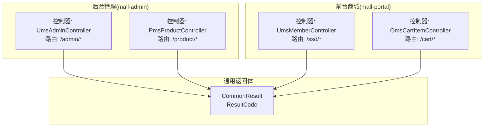
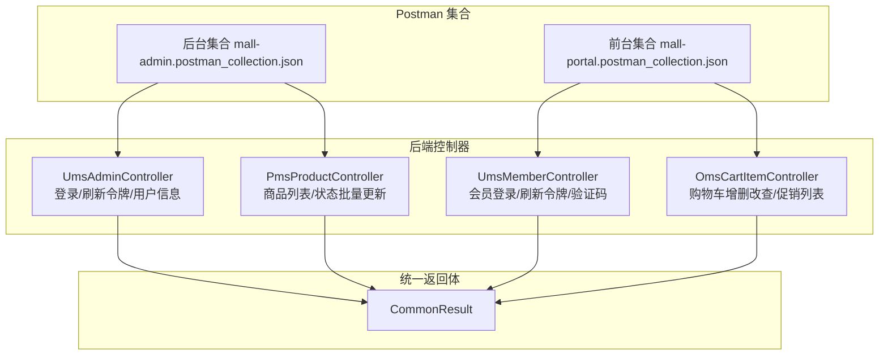
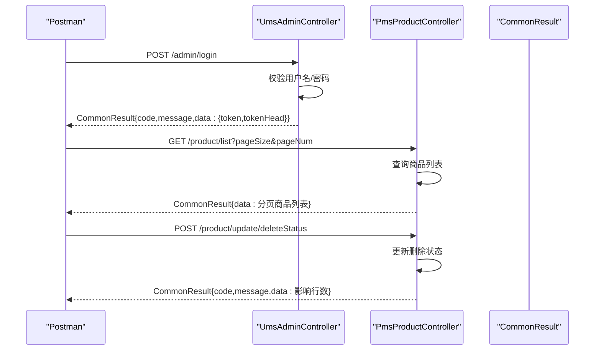
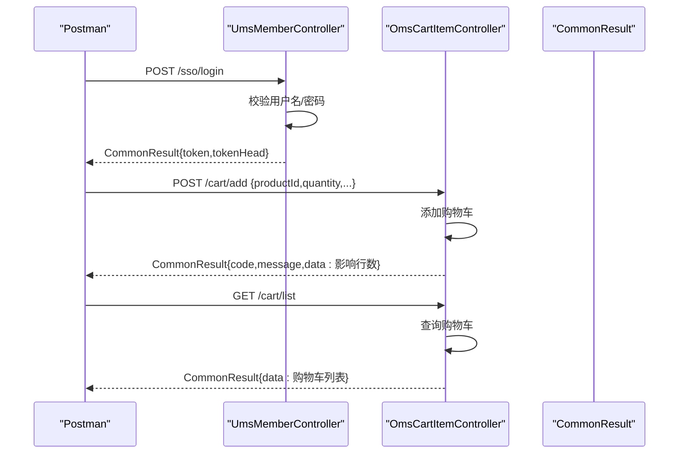
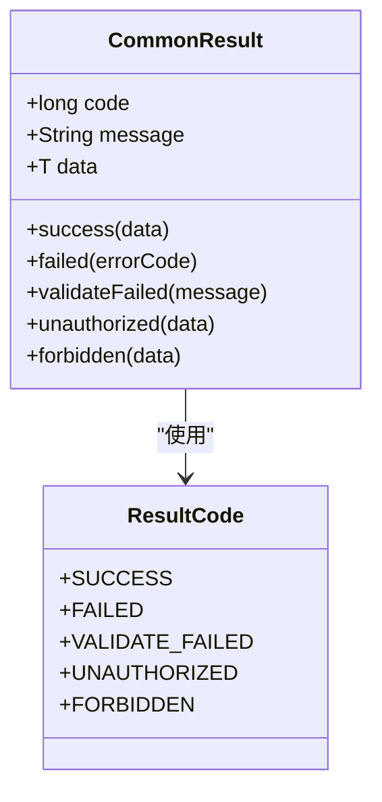
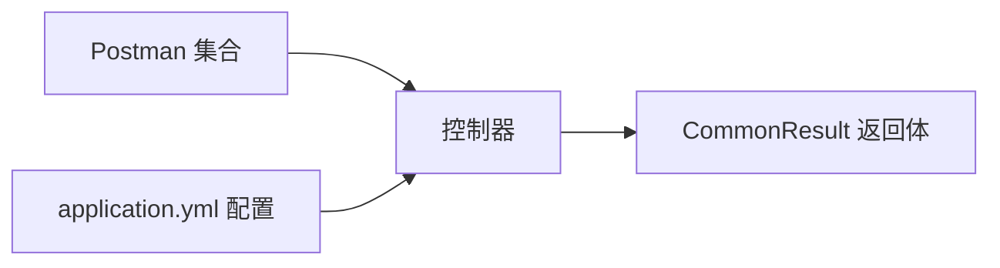

# 接口测试与调试

<cite>
**本文引用的文件**
- [mall-admin.postman_collection.json](file://document/postman/mall-admin.postman_collection.json)
- [mall-portal.postman_collection.json](file://document/postman/mall-portal.postman_collection.json)
- [README.md](file://README.md)
- [application.yml（后台）](file://mall-admin/src/main/resources/application.yml)
- [application.yml（前台）](file://mall-portal/src/main/resources/application.yml)
- [CommonResult.java](file://mall-common/src/main/java/com/macro/mall/common/api/CommonResult.java)
- [ResultCode.java](file://mall-common/src/main/java/com/macro/mall/common/api/ResultCode.java)
- [UmsAdminController.java](file://mall-admin/src/main/java/com/macro/mall/controller/UmsAdminController.java)
- [PmsProductController.java](file://mall-admin/src/main/java/com/macro/mall/controller/PmsProductController.java)
- [UmsMemberController.java](file://mall-portal/src/main/java/com/macro/mall/portal/controller/UmsMemberController.java)
- [OmsCartItemController.java](file://mall-portal/src/main/java/com/macro/mall/portal/controller/OmsCartItemController.java)
</cite>

## 目录
1. [简介](#简介)
2. [项目结构](#项目结构)
3. [核心组件](#核心组件)
4. [架构总览](#架构总览)
5. [详细组件分析](#详细组件分析)
6. [依赖分析](#依赖分析)
7. [性能考虑](#性能考虑)
8. [故障排查指南](#故障排查指南)
9. [结论](#结论)
10. [附录](#附录)

## 简介
本指南面向开发者与测试工程师，围绕 Mall 项目的后台管理与前台商城两套 API，提供从 Postman 集成、环境变量配置、请求模板使用，到参数准备、请求发送、响应验证、常见问题排查与调试技巧的完整流程。文档同时给出接口测试最佳实践与质量保证策略，帮助团队高效稳定地交付电商系统接口能力。

## 项目结构
- 后台管理模块（mall-admin）：提供商品、订单、促销、运营、内容、权限等管理接口，统一以 /admin 前缀暴露。
- 前台商城模块（mall-portal）：提供会员登录注册、购物车、订单、优惠券等面向终端用户的接口，统一以 /sso、/cart、/order、/member 等前缀暴露。
- 通用返回体：统一使用 CommonResult<T> 包装响应，配合 ResultCode 定义标准状态码与消息。
- 配置要点：JWT 的请求头、令牌前缀、白名单路径等均在各模块 application.yml 中集中配置。

**图示来源**
- [UmsAdminController.java:33-191](file://mall-admin/src/main/java/com/macro/mall/controller/UmsAdminController.java#L33-L191)
- [PmsProductController.java:23-133](file://mall-admin/src/main/java/com/macro/mall/controller/PmsProductController.java#L23-L133)
- [UmsMemberController.java:26-99](file://mall-portal/src/main/java/com/macro/mall/portal/controller/UmsMemberController.java#L26-L99)
- [OmsCartItemController.java:22-100](file://mall-portal/src/main/java/com/macro/mall/portal/controller/OmsCartItemController.java#L22-L100)
- [CommonResult.java:7-133](file://mall-common/src/main/java/com/macro/mall/common/api/CommonResult.java#L7-L133)
- [ResultCode.java:7-28](file://mall-common/src/main/java/com/macro/mall/common/api/ResultCode.java#L7-L28)

**章节来源**
- [README.md:51-62](file://README.md#L51-L62)
- [application.yml（后台）:1-66](file://mall-admin/src/main/resources/application.yml#L1-L66)
- [application.yml（前台）:1-62](file://mall-portal/src/main/resources/application.yml#L1-L62)

## 核心组件
- 统一返回体
  - 成功/失败/参数校验失败/未登录/无权限等标准化返回结构，便于 Postman 断言与自动化脚本解析。
- 控制器层
  - 后台管理：用户登录、角色菜单、商品增删改查、状态批量更新等。
  - 前台商城：会员登录/注册/刷新令牌、购物车增删改查、促销信息查询等。
- 配置项
  - JWT 请求头键名、令牌前缀、白名单放行路径等，直接影响接口鉴权与测试。

**章节来源**
- [CommonResult.java:35-108](file://mall-common/src/main/java/com/macro/mall/common/api/CommonResult.java#L35-L108)
- [ResultCode.java:7-28](file://mall-common/src/main/java/com/macro/mall/common/api/ResultCode.java#L7-L28)
- [UmsAdminController.java:54-99](file://mall-admin/src/main/java/com/macro/mall/controller/UmsAdminController.java#L54-L99)
- [PmsProductController.java:57-132](file://mall-admin/src/main/java/com/macro/mall/controller/PmsProductController.java#L57-L132)
- [UmsMemberController.java:45-98](file://mall-portal/src/main/java/com/macro/mall/portal/controller/UmsMemberController.java#L45-L98)
- [OmsCartItemController.java:39-99](file://mall-portal/src/main/java/com/macro/mall/portal/controller/OmsCartItemController.java#L39-L99)
- [application.yml（后台）:20-53](file://mall-admin/src/main/resources/application.yml#L20-L53)
- [application.yml（前台）:15-40](file://mall-portal/src/main/resources/application.yml#L15-L40)

## 架构总览
下图展示了 Postman 集合与后端控制器之间的映射关系，以及统一返回体在接口中的作用。

**图示来源**
- [mall-admin.postman_collection.json:9-187](file://document/postman/mall-admin.postman_collection.json#L9-L187)
- [mall-portal.postman_collection.json:9-327](file://document/postman/mall-portal.postman_collection.json#L9-L327)
- [UmsAdminController.java:54-99](file://mall-admin/src/main/java/com/macro/mall/controller/UmsAdminController.java#L54-L99)
- [PmsProductController.java:57-132](file://mall-admin/src/main/java/com/macro/mall/controller/PmsProductController.java#L57-L132)
- [UmsMemberController.java:45-98](file://mall-portal/src/main/java/com/macro/mall/portal/controller/UmsMemberController.java#L45-L98)
- [OmsCartItemController.java:39-99](file://mall-portal/src/main/java/com/macro/mall/portal/controller/OmsCartItemController.java#L39-L99)
- [CommonResult.java:35-108](file://mall-common/src/main/java/com/macro/mall/common/api/CommonResult.java#L35-L108)

## 详细组件分析

### 后台管理接口（mall-admin）
- 登录与令牌刷新
  - 登录接口：POST /admin/login，返回 token 与 tokenHead；后续请求需携带 Authorization: Bearer <token>。
  - 刷新令牌：GET /admin/token/refresh，传入当前 Authorization 头进行刷新。
- 商品管理
  - 商品列表：GET /product/list，支持分页与筛选参数。
  - 批量更新删除状态：POST /product/update/deleteStatus，表单参数 ids、deleteStatus。
- 优惠券管理（集合中示例）
  - 新增、修改、删除优惠券等接口，请求体多为 JSON，部分接口使用表单提交。

**图示来源**
- [UmsAdminController.java:54-99](file://mall-admin/src/main/java/com/macro/mall/controller/UmsAdminController.java#L54-L99)
- [PmsProductController.java:57-132](file://mall-admin/src/main/java/com/macro/mall/controller/PmsProductController.java#L57-L132)
- [CommonResult.java:35-108](file://mall-common/src/main/java/com/macro/mall/common/api/CommonResult.java#L35-L108)

**章节来源**
- [mall-admin.postman_collection.json:62-186](file://document/postman/mall-admin.postman_collection.json#L62-L186)
- [UmsAdminController.java:54-99](file://mall-admin/src/main/java/com/macro/mall/controller/UmsAdminController.java#L54-L99)
- [PmsProductController.java:57-132](file://mall-admin/src/main/java/com/macro/mall/controller/PmsProductController.java#L57-L132)

### 前台商城接口（mall-portal）
- 会员登录与令牌刷新
  - 登录：POST /sso/login，返回 token 与 tokenHead。
  - 刷新：GET /sso/token/refresh，传入 Authorization 头。
- 购物车
  - 加入购物车：POST /cart/add，JSON 请求体。
  - 获取购物车列表：GET /cart/list。
  - 修改数量：GET /cart/update/quantity?id=&quantity=。
  - 清空购物车：POST /cart/clear。
  - 获取促销信息：GET /cart/list/promotion。
- 订单与优惠券
  - 生成确认单：POST /order/confirmOrder。
  - 下单：POST /order/generateOrder，JSON 请求体。
  - 支付成功回调：POST /order/paySuccess?orderId=。
  - 取消超时/单个订单：POST /order/cancelTimeOutOrder 或 /order/cancelOrder?orderId=。
  - 领取优惠券：POST /member/coupon/add/{couponId}。
  - 会员优惠券列表：GET /member/coupon/list。
  - 购物车可用优惠券：GET /member/coupon/list/cart/{cartId}。

**图示来源**
- [UmsMemberController.java:45-98](file://mall-portal/src/main/java/com/macro/mall/portal/controller/UmsMemberController.java#L45-L98)
- [OmsCartItemController.java:29-99](file://mall-portal/src/main/java/com/macro/mall/portal/controller/OmsCartItemController.java#L29-L99)
- [CommonResult.java:35-108](file://mall-common/src/main/java/com/macro/mall/common/api/CommonResult.java#L35-L108)

**章节来源**
- [mall-portal.postman_collection.json:11-326](file://document/postman/mall-portal.postman_collection.json#L11-L326)
- [UmsMemberController.java:45-98](file://mall-portal/src/main/java/com/macro/mall/portal/controller/UmsMemberController.java#L45-L98)
- [OmsCartItemController.java:29-99](file://mall-portal/src/main/java/com/macro/mall/portal/controller/OmsCartItemController.java#L29-L99)

### 统一返回体与断言建议
- 返回字段：code、message、data。
- 断言建议：
  - 成功场景：code 为成功值；data 不为空。
  - 失败场景：code 为失败值；message 包含预期错误描述。
  - 未登录/无权限：code 对应未登录或无权限值；结合 Authorization 头缺失或过期定位问题。

**图示来源**
- [CommonResult.java:7-133](file://mall-common/src/main/java/com/macro/mall/common/api/CommonResult.java#L7-L133)
- [ResultCode.java:7-28](file://mall-common/src/main/java/com/macro/mall/common/api/ResultCode.java#L7-L28)

**章节来源**
- [CommonResult.java:35-108](file://mall-common/src/main/java/com/macro/mall/common/api/CommonResult.java#L35-L108)
- [ResultCode.java:7-28](file://mall-common/src/main/java/com/macro/mall/common/api/ResultCode.java#L7-L28)

## 依赖分析
- Postman 集合与控制器映射
  - 后台集合与 mall-admin 控制器一一对应；前台集合与 mall-portal 控制器一一对应。
- 配置依赖
  - JWT 请求头键名、令牌前缀、白名单路径来自各模块 application.yml，影响接口鉴权与测试。
- 返回体依赖
  - 所有控制器返回均通过 CommonResult 包装，便于统一断言。

**图示来源**
- [mall-admin.postman_collection.json:9-187](file://document/postman/mall-admin.postman_collection.json#L9-L187)
- [mall-portal.postman_collection.json:9-327](file://document/postman/mall-portal.postman_collection.json#L9-L327)
- [UmsAdminController.java:33-191](file://mall-admin/src/main/java/com/macro/mall/controller/UmsAdminController.java#L33-L191)
- [PmsProductController.java:23-133](file://mall-admin/src/main/java/com/macro/mall/controller/PmsProductController.java#L23-L133)
- [UmsMemberController.java:26-99](file://mall-portal/src/main/java/com/macro/mall/portal/controller/UmsMemberController.java#L26-L99)
- [OmsCartItemController.java:22-100](file://mall-portal/src/main/java/com/macro/mall/portal/controller/OmsCartItemController.java#L22-L100)
- [application.yml（后台）:20-53](file://mall-admin/src/main/resources/application.yml#L20-L53)
- [application.yml（前台）:15-40](file://mall-portal/src/main/resources/application.yml#L15-L40)
- [CommonResult.java:35-108](file://mall-common/src/main/java/com/macro/mall/common/api/CommonResult.java#L35-L108)

**章节来源**
- [application.yml（后台）:20-53](file://mall-admin/src/main/resources/application.yml#L20-L53)
- [application.yml（前台）:15-40](file://mall-portal/src/main/resources/application.yml#L15-L40)

## 性能考虑
- 并发与吞吐
  - 使用 Postman Runner 或 Newman 执行大规模接口用例时，注意并发度与限流策略，避免对后端造成瞬时压力。
- 响应时间与稳定性
  - 关注 CommonResult.code 与 message，异常场景下优先检查鉴权、数据库连接、缓存与第三方依赖。
- 缓存与热点数据
  - 对高频查询接口（如商品列表、购物车促销信息）建议结合缓存策略，减少数据库压力。

[本节为通用指导，无需列出具体文件来源]

## 故障排查指南
- 鉴权失败（未登录/无权限）
  - 现象：返回未登录或无权限状态码。
  - 排查：确认 Authorization 头是否正确携带；核对 tokenHead 与 tokenHeader 配置；检查白名单是否覆盖目标接口。
- 参数校验失败
  - 现象：返回参数校验失败状态码与提示信息。
  - 排查：对照控制器参数注解与请求体格式；检查必填字段与类型。
- 接口路径错误
  - 现象：404 或路径不匹配。
  - 排查：核对 Postman 集合中的路径与控制器实际映射；注意模块前缀差异（/admin vs /sso,/cart,/order）。
- 数据库/缓存异常
  - 现象：接口偶发失败或延迟升高。
  - 排查：检查数据库连接池、Redis 连接与过期策略；结合日志定位慢查询。

**章节来源**
- [ResultCode.java:7-28](file://mall-common/src/main/java/com/macro/mall/common/api/ResultCode.java#L7-L28)
- [application.yml（后台）:34-53](file://mall-admin/src/main/resources/application.yml#L34-L53)
- [application.yml（前台）:21-40](file://mall-portal/src/main/resources/application.yml#L21-L40)

## 结论
通过 Postman 集合与控制器的清晰映射、统一的返回体与配置项，Mall 项目提供了可复用、可扩展的接口测试与调试基础。遵循本文的导入与使用流程、参数准备与断言策略、以及常见问题排查方法，可显著提升接口测试效率与质量。

[本节为总结性内容，无需列出具体文件来源]

## 附录

### Postman 集成与环境变量配置
- 导入集合
  - 在 Postman 中选择“Import”，导入以下两个集合文件：
    - 后台集合：document/postman/mall-admin.postman_collection.json
    - 前台集合：document/postman/mall-portal.postman_collection.json
- 环境变量
  - 后台环境变量：admin.mall（例如 http://localhost:8080）
  - 前台环境变量：portal.mall（例如 http://localhost:8080）
  - 将上述变量设置为你的后端服务地址，确保集合中的 {{admin.mall}} 与 {{portal.mall}} 能被正确替换。
- 请求模板说明
  - 后台登录：POST /admin/login，Body 使用 JSON，包含用户名与密码。
  - 商品列表：GET /product/list，带分页参数。
  - 批量更新删除状态：POST /product/update/deleteStatus，Body 使用 x-www-form-urlencoded，包含 ids 与 deleteStatus。
  - 会员登录：POST /sso/login，Body 使用 x-www-form-urlencoded，包含用户名与密码。
  - 购物车加入：POST /cart/add，Body 使用 JSON，包含商品与数量等字段。
  - 订单下单：POST /order/generateOrder，Body 使用 JSON，包含 couponId、memberReceiveAddressId、payType 等。

**章节来源**
- [mall-admin.postman_collection.json:11-186](file://document/postman/mall-admin.postman_collection.json#L11-L186)
- [mall-portal.postman_collection.json:11-326](file://document/postman/mall-portal.postman_collection.json#L11-L326)

### 接口测试最佳实践
- 参数准备
  - 严格对照控制器参数注解与请求体格式；必要时先调用“获取验证码”等前置接口。
- 请求发送
  - 先登录获取 token，再在后续请求中携带 Authorization: Bearer <token>。
  - 对于表单提交接口，确保 Content-Type 设置为 application/x-www-form-urlencoded。
- 响应验证
  - 使用 Postman Tests 或 Newman 脚本断言：
    - code 等于成功值；
    - data 字段非空；
    - message 符合预期。
- 自动化与回归
  - 将常用接口用例纳入 Runner 批量执行；对关键路径（登录、下单、支付回调）增加重试与失败告警。

**章节来源**
- [UmsAdminController.java:54-99](file://mall-admin/src/main/java/com/macro/mall/controller/UmsAdminController.java#L54-L99)
- [UmsMemberController.java:45-98](file://mall-portal/src/main/java/com/macro/mall/portal/controller/UmsMemberController.java#L45-L98)
- [PmsProductController.java:57-132](file://mall-admin/src/main/java/com/macro/mall/controller/PmsProductController.java#L57-L132)
- [OmsCartItemController.java:29-99](file://mall-portal/src/main/java/com/macro/mall/portal/controller/OmsCartItemController.java#L29-L99)
- [CommonResult.java:35-108](file://mall-common/src/main/java/com/macro/mall/common/api/CommonResult.java#L35-L108)

### 调试工具与技巧
- 抓包分析
  - 使用浏览器 Network 或抓包工具（如 Charles/Proxyman）观察请求头、请求体与响应体，核对 Authorization 与 Content-Type。
- 性能测试
  - 使用 JMeter/LoadRunner 对关键接口进行并发压测，关注响应时间与错误率。
- 压力测试
  - 逐步提升并发与数据规模，观察数据库连接池与 Redis 的表现，定位瓶颈点。
- 日志与监控
  - 结合后端日志与监控指标（CPU、内存、数据库连接数），定位异常时段与异常接口。

[本节为通用指导，无需列出具体文件来源]