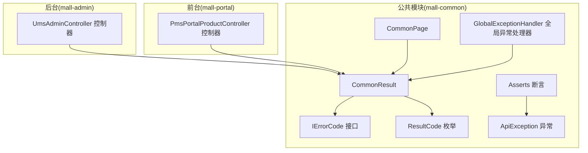
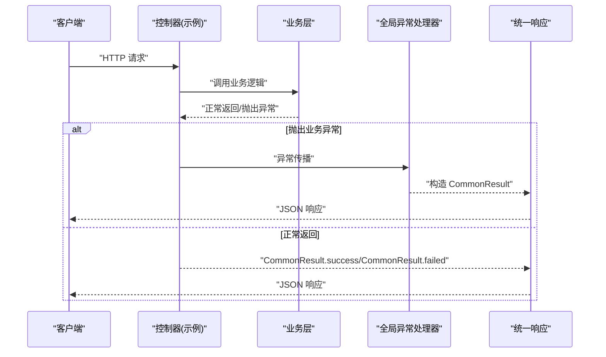
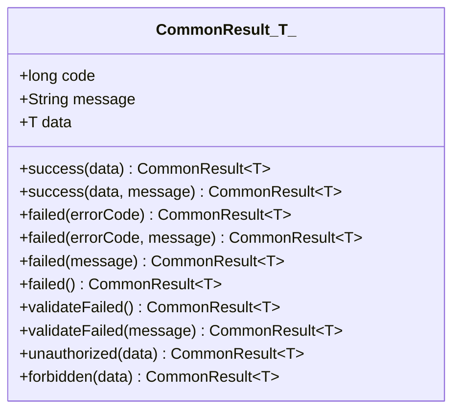
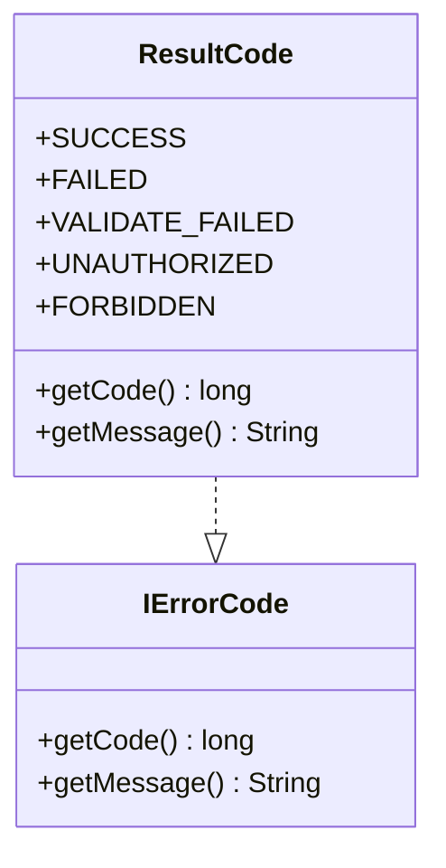
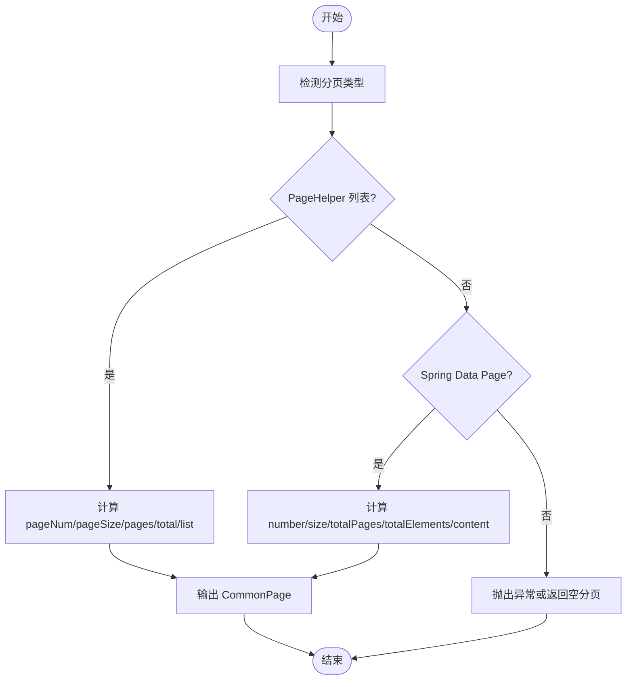
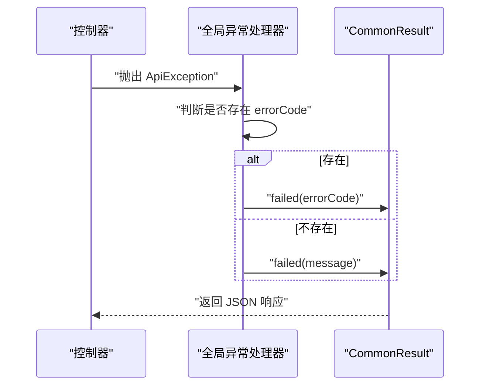
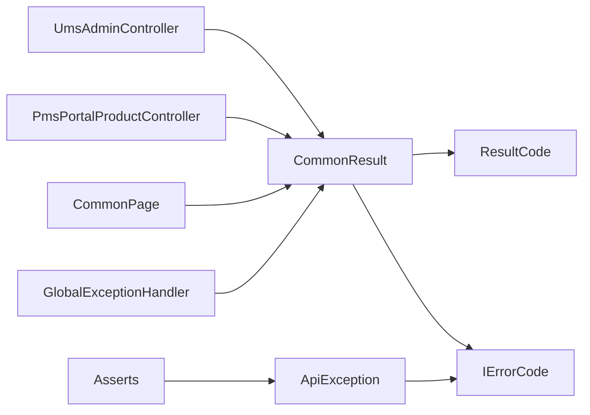

# 统一响应格式

<cite>
**本文引用的文件**
- [mall-common/src/main/java/com/macro/mall/common/api/CommonResult.java](file://mall-common/src/main/java/com/macro/mall/common/api/CommonResult.java)
- [mall-common/src/main/java/com/macro/mall/common/api/IErrorCode.java](file://mall-common/src/main/java/com/macro/mall/common/api/IErrorCode.java)
- [mall-common/src/main/java/com/macro/mall/common/api/ResultCode.java](file://mall-common/src/main/java/com/macro/mall/common/api/ResultCode.java)
- [mall-common/src/main/java/com/macro/mall/common/api/CommonPage.java](file://mall-common/src/main/java/com/macro/mall/common/api/CommonPage.java)
- [mall-common/src/main/java/com/macro/mall/common/exception/ApiException.java](file://mall-common/src/main/java/com/macro/mall/common/exception/ApiException.java)
- [mall-common/src/main/java/com/macro/mall/common/exception/Asserts.java](file://mall-common/src/main/java/com/macro/mall/common/exception/Asserts.java)
- [mall-common/src/main/java/com/macro/mall/common/exception/GlobalExceptionHandler.java](file://mall-common/src/main/java/com/macro/mall/common/exception/GlobalExceptionHandler.java)
- [mall-admin/src/main/java/com/macro/mall/controller/UmsAdminController.java](file://mall-admin/src/main/java/com/macro/mall/controller/UmsAdminController.java)
- [mall-portal/src/main/java/com/macro/mall/portal/controller/PmsPortalProductController.java](file://mall-portal/src/main/java/com/macro/mall/portal/controller/PmsPortalProductController.java)
- [mall-admin/src/main/resources/application.yml](file://mall-admin/src/main/resources/application.yml)
- [mall-portal/src/main/resources/application.yml](file://mall-portal/src/main/resources/application.yml)
</cite>

## 目录
1. [简介](#简介)
2. [项目结构](#项目结构)
3. [核心组件](#核心组件)
4. [架构总览](#架构总览)
5. [详细组件分析](#详细组件分析)
6. [依赖分析](#依赖分析)
7. [性能考虑](#性能考虑)
8. [故障排查指南](#故障排查指南)
9. [结论](#结论)
10. [附录](#附录)

## 简介
本文件系统化阐述 Mall 项目的统一响应格式与规范，围绕以下目标展开：
- 明确 CommonResult 类的结构与使用方式：成功、失败、参数校验失败、未登录、未授权等标准响应形态
- 解释 IErrorCode 接口与 ResultCode 枚举的职责与使用场景
- 规范分页响应格式（CommonPage）
- 提供响应头、状态码、错误信息国际化的处理建议
- 给出前后端一致的响应格式规范与最佳实践

## 项目结构
统一响应能力位于 mall-common 模块，核心文件如下：
- 响应主体：CommonResult<T>
- 错误码契约：IErrorCode
- 内置错误码：ResultCode
- 分页封装：CommonPage<T>
- 异常体系：ApiException、Asserts、GlobalExceptionHandler
- 控制器示例：UmsAdminController（后台）、PmsPortalProductController（前台）

图表来源
- [mall-common/src/main/java/com/macro/mall/common/api/CommonResult.java:1-134](file://mall-common/src/main/java/com/macro/mall/common/api/CommonResult.java#L1-L134)
- [mall-common/src/main/java/com/macro/mall/common/api/IErrorCode.java:1-18](file://mall-common/src/main/java/com/macro/mall/common/api/IErrorCode.java#L1-L18)
- [mall-common/src/main/java/com/macro/mall/common/api/ResultCode.java:1-29](file://mall-common/src/main/java/com/macro/mall/common/api/ResultCode.java#L1-L29)
- [mall-common/src/main/java/com/macro/mall/common/api/CommonPage.java:1-101](file://mall-common/src/main/java/com/macro/mall/common/api/CommonPage.java#L1-L101)
- [mall-common/src/main/java/com/macro/mall/common/exception/ApiException.java:1-33](file://mall-common/src/main/java/com/macro/mall/common/exception/ApiException.java#L1-L33)
- [mall-common/src/main/java/com/macro/mall/common/exception/Asserts.java:1-18](file://mall-common/src/main/java/com/macro/mall/common/exception/Asserts.java#L1-L18)
- [mall-common/src/main/java/com/macro/mall/common/exception/GlobalExceptionHandler.java:1-69](file://mall-common/src/main/java/com/macro/mall/common/exception/GlobalExceptionHandler.java#L1-L69)
- [mall-admin/src/main/java/com/macro/mall/controller/UmsAdminController.java:1-192](file://mall-admin/src/main/java/com/macro/mall/controller/UmsAdminController.java#L1-L192)
- [mall-portal/src/main/java/com/macro/mall/portal/controller/PmsPortalProductController.java:1-54](file://mall-portal/src/main/java/com/macro/mall/portal/controller/PmsPortalProductController.java#L1-L54)

章节来源
- [mall-common/src/main/java/com/macro/mall/common/api/CommonResult.java:1-134](file://mall-common/src/main/java/com/macro/mall/common/api/CommonResult.java#L1-L134)
- [mall-common/src/main/java/com/macro/mall/common/api/IErrorCode.java:1-18](file://mall-common/src/main/java/com/macro/mall/common/api/IErrorCode.java#L1-L18)
- [mall-common/src/main/java/com/macro/mall/common/api/ResultCode.java:1-29](file://mall-common/src/main/java/com/macro/mall/common/api/ResultCode.java#L1-L29)
- [mall-common/src/main/java/com/macro/mall/common/api/CommonPage.java:1-101](file://mall-common/src/main/java/com/macro/mall/common/api/CommonPage.java#L1-L101)
- [mall-common/src/main/java/com/macro/mall/common/exception/ApiException.java:1-33](file://mall-common/src/main/java/com/macro/mall/common/exception/ApiException.java#L1-L33)
- [mall-common/src/main/java/com/macro/mall/common/exception/Asserts.java:1-18](file://mall-common/src/main/java/com/macro/mall/common/exception/Asserts.java#L1-L18)
- [mall-common/src/main/java/com/macro/mall/common/exception/GlobalExceptionHandler.java:1-69](file://mall-common/src/main/java/com/macro/mall/common/exception/GlobalExceptionHandler.java#L1-L69)
- [mall-admin/src/main/java/com/macro/mall/controller/UmsAdminController.java:1-192](file://mall-admin/src/main/java/com/macro/mall/controller/UmsAdminController.java#L1-L192)
- [mall-portal/src/main/java/com/macro/mall/portal/controller/PmsPortalProductController.java:1-54](file://mall-portal/src/main/java/com/macro/mall/portal/controller/PmsPortalProductController.java#L1-L54)

## 核心组件
- CommonResult<T>：统一响应载体，包含 code、message、data 三要素；提供 success/fail/validateFailed/unauthorized/forbidden 等静态工厂方法
- IErrorCode：错误码契约，定义 getCode()/getMessage()
- ResultCode：内置错误码枚举，覆盖 SUCCESS、FAILED、VALIDATE_FAILED、UNAUTHORIZED、FORBIDDEN
- CommonPage<T>：分页封装，支持 PageHelper 和 Spring Data JPA 的分页对象转换
- 异常与全局处理：ApiException、Asserts、GlobalExceptionHandler，统一捕获并返回 CommonResult 格式

章节来源
- [mall-common/src/main/java/com/macro/mall/common/api/CommonResult.java:7-134](file://mall-common/src/main/java/com/macro/mall/common/api/CommonResult.java#L7-L134)
- [mall-common/src/main/java/com/macro/mall/common/api/IErrorCode.java:7-17](file://mall-common/src/main/java/com/macro/mall/common/api/IErrorCode.java#L7-L17)
- [mall-common/src/main/java/com/macro/mall/common/api/ResultCode.java:7-28](file://mall-common/src/main/java/com/macro/mall/common/api/ResultCode.java#L7-L28)
- [mall-common/src/main/java/com/macro/mall/common/api/CommonPage.java:12-100](file://mall-common/src/main/java/com/macro/mall/common/api/CommonPage.java#L12-L100)
- [mall-common/src/main/java/com/macro/mall/common/exception/ApiException.java:9-32](file://mall-common/src/main/java/com/macro/mall/common/exception/ApiException.java#L9-L32)
- [mall-common/src/main/java/com/macro/mall/common/exception/Asserts.java:9-17](file://mall-common/src/main/java/com/macro/mall/common/exception/Asserts.java#L9-L17)
- [mall-common/src/main/java/com/macro/mall/common/exception/GlobalExceptionHandler.java:22-67](file://mall-common/src/main/java/com/macro/mall/common/exception/GlobalExceptionHandler.java#L22-L67)

## 架构总览
统一响应在控制器层被广泛使用，异常在全局处理器中被拦截并标准化输出。

图表来源
- [mall-admin/src/main/java/com/macro/mall/controller/UmsAdminController.java:46-98](file://mall-admin/src/main/java/com/macro/mall/controller/UmsAdminController.java#L46-L98)
- [mall-common/src/main/java/com/macro/mall/common/exception/GlobalExceptionHandler.java:22-67](file://mall-common/src/main/java/com/macro/mall/common/exception/GlobalExceptionHandler.java#L22-L67)
- [mall-common/src/main/java/com/macro/mall/common/api/CommonResult.java:35-108](file://mall-common/src/main/java/com/macro/mall/common/api/CommonResult.java#L35-L108)

## 详细组件分析

### CommonResult<T> 类
- 结构字段
  - code：数值型状态码
  - message：提示信息
  - data：泛型数据体
- 关键方法
  - success(data) / success(data, message)：成功响应
  - failed(IErrorCode) / failed(IErrorCode, message) / failed(message) / failed()：失败响应
  - validateFailed() / validateFailed(message)：参数校验失败
  - unauthorized(data) / forbidden(data)：未登录/未授权
- 使用建议
  - 成功时优先使用带 data 的 success
  - 失败时尽量传入 IErrorCode，便于前端统一处理
  - 未登录/未授权场景使用 dedicated 方法，便于网关/安全层识别

图表来源
- [mall-common/src/main/java/com/macro/mall/common/api/CommonResult.java:7-134](file://mall-common/src/main/java/com/macro/mall/common/api/CommonResult.java#L7-L134)

章节来源
- [mall-common/src/main/java/com/macro/mall/common/api/CommonResult.java:35-108](file://mall-common/src/main/java/com/macro/mall/common/api/CommonResult.java#L35-L108)

### IErrorCode 接口与 ResultCode 枚举
- IErrorCode：定义 getCode()/getMessage()，作为所有错误码的契约
- ResultCode：内置常用错误码，包括 SUCCESS、FAILED、VALIDATE_FAILED、UNAUTHORIZED、FORBIDDEN
- 使用场景
  - 在业务层抛出异常或返回结果时，优先使用 ResultCode 或自定义实现 IErrorCode 的枚举
  - 前端根据 code 做分支处理，message 用于展示

图表来源
- [mall-common/src/main/java/com/macro/mall/common/api/IErrorCode.java:7-17](file://mall-common/src/main/java/com/macro/mall/common/api/IErrorCode.java#L7-L17)
- [mall-common/src/main/java/com/macro/mall/common/api/ResultCode.java:7-28](file://mall-common/src/main/java/com/macro/mall/common/api/ResultCode.java#L7-L28)

章节来源
- [mall-common/src/main/java/com/macro/mall/common/api/IErrorCode.java:7-17](file://mall-common/src/main/java/com/macro/mall/common/api/IErrorCode.java#L7-L17)
- [mall-common/src/main/java/com/macro/mall/common/api/ResultCode.java:7-28](file://mall-common/src/main/java/com/macro/mall/common/api/ResultCode.java#L7-L28)

### 分页响应 CommonPage<T>
- 字段：pageNum、pageSize、totalPage、total、list
- 工具方法
  - restPage(List<T>)：基于 PageHelper 的 list 转换
  - restPage(Page<T>)：基于 Spring Data JPA 的 Page 转换
- 使用建议
  - 列表查询统一返回 CommonPage<实体>，前端按字段解析分页信息
  - 若后端使用 PageHelper，请确保分页参数正确传递

图表来源
- [mall-common/src/main/java/com/macro/mall/common/api/CommonPage.java:37-59](file://mall-common/src/main/java/com/macro/mall/common/api/CommonPage.java#L37-L59)

章节来源
- [mall-common/src/main/java/com/macro/mall/common/api/CommonPage.java:12-100](file://mall-common/src/main/java/com/macro/mall/common/api/CommonPage.java#L12-L100)

### 异常与全局处理
- ApiException：继承 RuntimeException，可携带 IErrorCode
- Asserts：断言工具，统一抛出 ApiException
- GlobalExceptionHandler：
  - 捕获 ApiException，优先读取 errorCode，否则回退 message
  - 捕获 JSR-303 校验异常，组装字段+默认消息返回 validateFailed
  - 捕获 SQLSyntaxErrorException，对“denied”做演示环境友好提示

图表来源
- [mall-common/src/main/java/com/macro/mall/common/exception/GlobalExceptionHandler.java:22-29](file://mall-common/src/main/java/com/macro/mall/common/exception/GlobalExceptionHandler.java#L22-L29)
- [mall-common/src/main/java/com/macro/mall/common/exception/ApiException.java:9-32](file://mall-common/src/main/java/com/macro/mall/common/exception/ApiException.java#L9-L32)
- [mall-common/src/main/java/com/macro/mall/common/api/CommonResult.java:53-72](file://mall-common/src/main/java/com/macro/mall/common/api/CommonResult.java#L53-L72)

章节来源
- [mall-common/src/main/java/com/macro/mall/common/exception/ApiException.java:9-32](file://mall-common/src/main/java/com/macro/mall/common/exception/ApiException.java#L9-L32)
- [mall-common/src/main/java/com/macro/mall/common/exception/Asserts.java:9-17](file://mall-common/src/main/java/com/macro/mall/common/exception/Asserts.java#L9-L17)
- [mall-common/src/main/java/com/macro/mall/common/exception/GlobalExceptionHandler.java:22-67](file://mall-common/src/main/java/com/macro/mall/common/exception/GlobalExceptionHandler.java#L22-L67)

### 控制器使用示例
- 后台管理控制器 UmsAdminController
  - 登录/刷新令牌/获取用户信息/删除/更新状态等均返回 CommonResult
  - 列表查询使用 CommonPage.restPage 包装分页
- 前台商品控制器 PmsPortalProductController
  - 商品搜索返回 CommonPage<PmsProduct>
  - 详情查询返回单个实体包装

章节来源
- [mall-admin/src/main/java/com/macro/mall/controller/UmsAdminController.java:46-115](file://mall-admin/src/main/java/com/macro/mall/controller/UmsAdminController.java#L46-L115)
- [mall-portal/src/main/java/com/macro/mall/portal/controller/PmsPortalProductController.java:28-52](file://mall-portal/src/main/java/com/macro/mall/portal/controller/PmsPortalProductController.java#L28-L52)

## 依赖分析
- 控制器依赖 CommonResult 与 CommonPage
- CommonResult 依赖 IErrorCode 与 ResultCode
- 全局异常处理器依赖 CommonResult，并对多种异常进行归一化
- Asserts 与 ApiException 为异常体系提供支撑

图表来源
- [mall-admin/src/main/java/com/macro/mall/controller/UmsAdminController.java:4-12](file://mall-admin/src/main/java/com/macro/mall/controller/UmsAdminController.java#L4-L12)
- [mall-portal/src/main/java/com/macro/mall/portal/controller/PmsPortalProductController.java:3-8](file://mall-portal/src/main/java/com/macro/mall/portal/controller/PmsPortalProductController.java#L3-L8)
- [mall-common/src/main/java/com/macro/mall/common/api/CommonResult.java:35-108](file://mall-common/src/main/java/com/macro/mall/common/api/CommonResult.java#L35-L108)
- [mall-common/src/main/java/com/macro/mall/common/api/CommonPage.java:37-59](file://mall-common/src/main/java/com/macro/mall/common/api/CommonPage.java#L37-L59)
- [mall-common/src/main/java/com/macro/mall/common/exception/GlobalExceptionHandler.java:22-29](file://mall-common/src/main/java/com/macro/mall/common/exception/GlobalExceptionHandler.java#L22-L29)
- [mall-common/src/main/java/com/macro/mall/common/exception/ApiException.java:9-32](file://mall-common/src/main/java/com/macro/mall/common/exception/ApiException.java#L9-L32)
- [mall-common/src/main/java/com/macro/mall/common/exception/Asserts.java:9-17](file://mall-common/src/main/java/com/macro/mall/common/exception/Asserts.java#L9-L17)

章节来源
- [mall-common/src/main/java/com/macro/mall/common/api/CommonResult.java:35-108](file://mall-common/src/main/java/com/macro/mall/common/api/CommonResult.java#L35-L108)
- [mall-common/src/main/java/com/macro/mall/common/api/CommonPage.java:37-59](file://mall-common/src/main/java/com/macro/mall/common/api/CommonPage.java#L37-L59)
- [mall-common/src/main/java/com/macro/mall/common/exception/GlobalExceptionHandler.java:22-29](file://mall-common/src/main/java/com/macro/mall/common/exception/GlobalExceptionHandler.java#L22-L29)

## 性能考虑
- 分页查询建议使用 PageHelper 或 Spring Data JPA 的分页接口，避免一次性加载全量数据
- CommonPage 的 restPage 对 list 进行 PageInfo 包装，注意大数据量时的内存占用
- 全局异常处理仅做轻量级转换，避免在异常链路中执行重逻辑

## 故障排查指南
- 常见问题
  - 响应未按统一格式返回：检查控制器是否直接返回 CommonResult
  - 未登录/未授权未生效：确认安全配置与网关策略是否正确转发/识别 token
  - 参数校验失败未返回明确字段：检查 JSR-303 注解与全局异常处理器
- 定位步骤
  - 在控制器中打印返回值，确认是否为 CommonResult
  - 查看全局异常处理器是否捕获到对应异常并转换
  - 校验 application.yml 中 JWT 请求头配置是否与前端一致

章节来源
- [mall-common/src/main/java/com/macro/mall/common/exception/GlobalExceptionHandler.java:32-57](file://mall-common/src/main/java/com/macro/mall/common/exception/GlobalExceptionHandler.java#L32-L57)
- [mall-admin/src/main/resources/application.yml:20-24](file://mall-admin/src/main/resources/application.yml#L20-L24)
- [mall-portal/src/main/resources/application.yml:15-19](file://mall-portal/src/main/resources/application.yml#L15-L19)

## 结论
通过 CommonResult、IErrorCode、ResultCode、CommonPage 以及异常与全局处理机制，Mall 实现了前后端一致的响应格式与错误处理策略。遵循本文规范，可显著提升接口一致性、可维护性与用户体验。

## 附录

### 响应结构与状态码规范
- 成功响应
  - 字段：code=200、message=“操作成功”、data=具体数据
  - 使用：CommonResult.success(data)
- 失败响应
  - 字段：code=500、message=错误信息、data=null
  - 使用：CommonResult.failed() 或 CommonResult.failed(IErrorCode)
- 参数校验失败
  - 字段：code=404、message=字段+默认消息、data=null
  - 使用：CommonResult.validateFailed(message)
- 未登录
  - 字段：code=401、message=“暂未登录或token已经过期”、data=null
  - 使用：CommonResult.unauthorized(null)
- 未授权
  - 字段：code=403、message=“没有相关权限”、data=null
  - 使用：CommonResult.forbidden(null)

章节来源
- [mall-common/src/main/java/com/macro/mall/common/api/CommonResult.java:35-108](file://mall-common/src/main/java/com/macro/mall/common/api/CommonResult.java#L35-L108)
- [mall-common/src/main/java/com/macro/mall/common/api/ResultCode.java:8-12](file://mall-common/src/main/java/com/macro/mall/common/api/ResultCode.java#L8-L12)

### 分页响应格式
- 字段：pageNum、pageSize、totalPage、total、list
- 使用：CommonPage.restPage(list) 或 CommonPage.restPage(page)
- 建议：前端统一解析上述字段，避免硬编码

章节来源
- [mall-common/src/main/java/com/macro/mall/common/api/CommonPage.java:37-59](file://mall-common/src/main/java/com/macro/mall/common/api/CommonPage.java#L37-L59)

### 响应头与状态码
- JWT 请求头配置
  - 后台：Authorization、tokenHead
  - 前台：Authorization、tokenHead
- 建议
  - 前端统一从 Authorization 头读取 token
  - 后端安全配置与白名单路径保持一致

章节来源
- [mall-admin/src/main/resources/application.yml:20-24](file://mall-admin/src/main/resources/application.yml#L20-L24)
- [mall-portal/src/main/resources/application.yml:15-19](file://mall-portal/src/main/resources/application.yml#L15-L19)

### 错误信息国际化处理建议
- 建议
  - message 由后端返回，前端统一展示
  - 如需多语言，可在后端根据请求头 Accept-Language 返回对应 message
  - 对于演示环境的 SQL 权限提示，可按“denied”关键字做本地化兜底

章节来源
- [mall-common/src/main/java/com/macro/mall/common/exception/GlobalExceptionHandler.java:60-67](file://mall-common/src/main/java/com/macro/mall/common/exception/GlobalExceptionHandler.java#L60-L67)

### 最佳实践清单
- 控制器层统一返回 CommonResult
- 列表查询统一返回 CommonPage
- 异常统一通过 Asserts.fail 或抛出 ApiException
- 全局异常处理器只做格式化，不做业务逻辑
- 前端按 code 分支处理，message 用于提示
- JWT 请求头与安全配置保持前后端一致