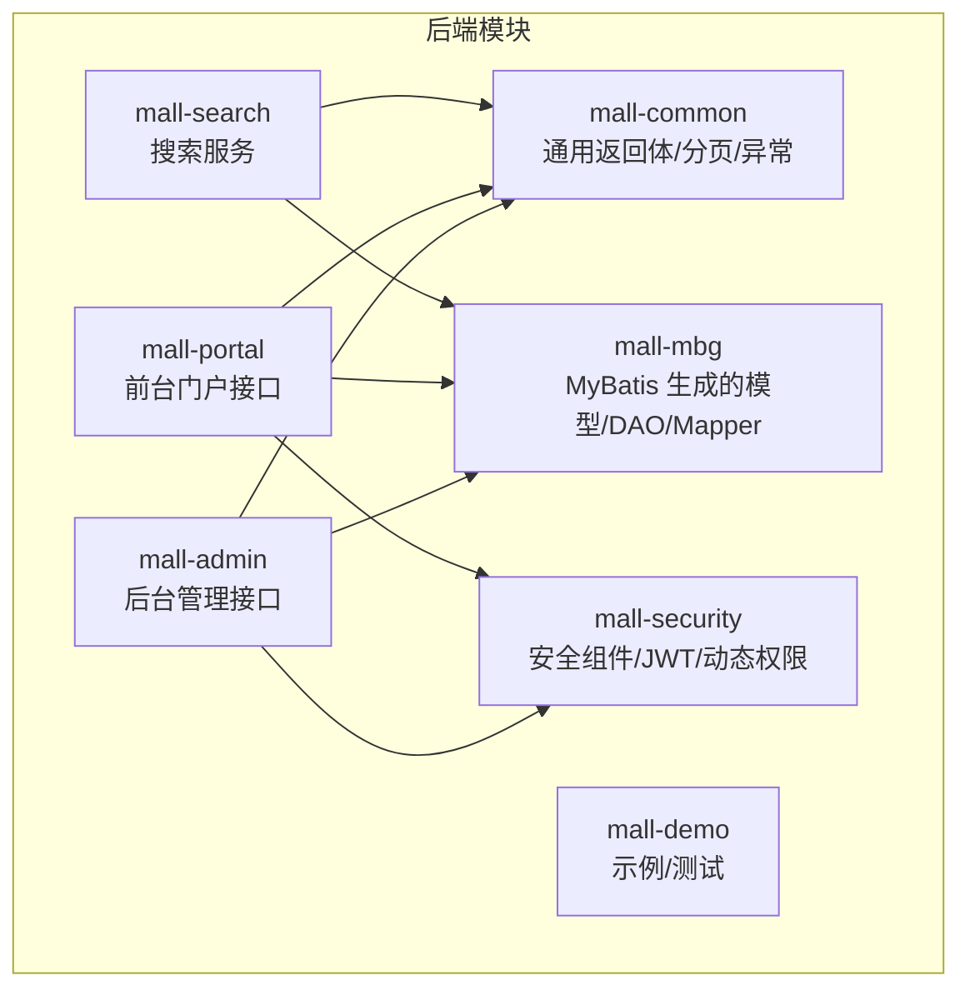
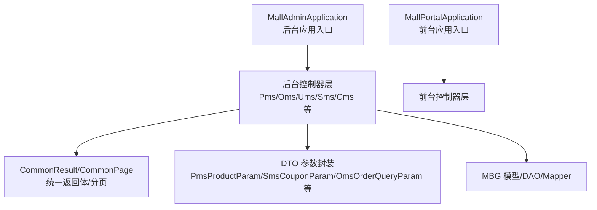
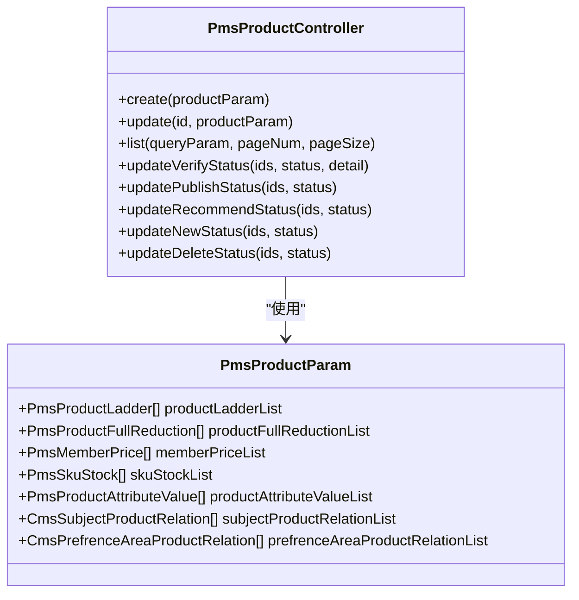
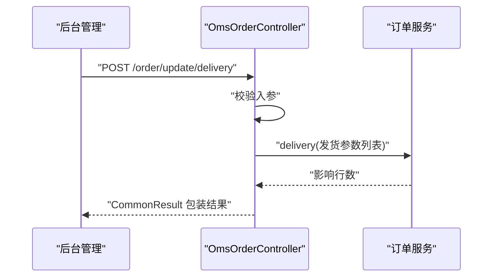
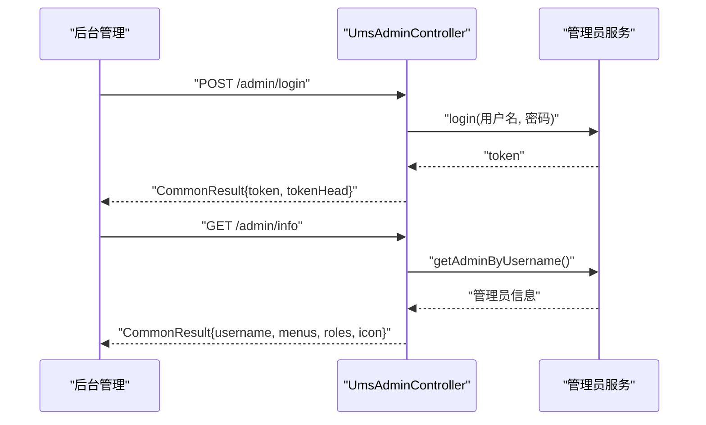
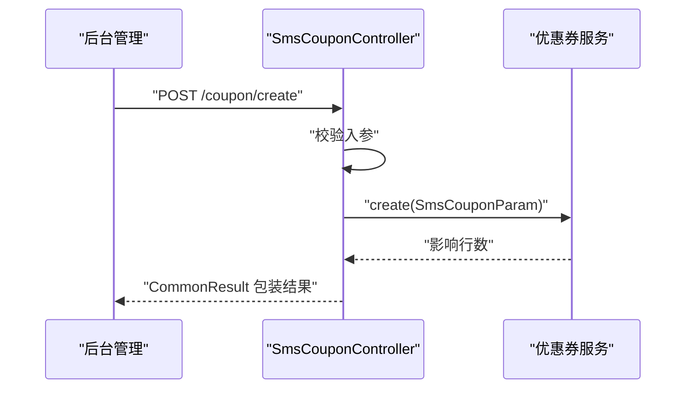
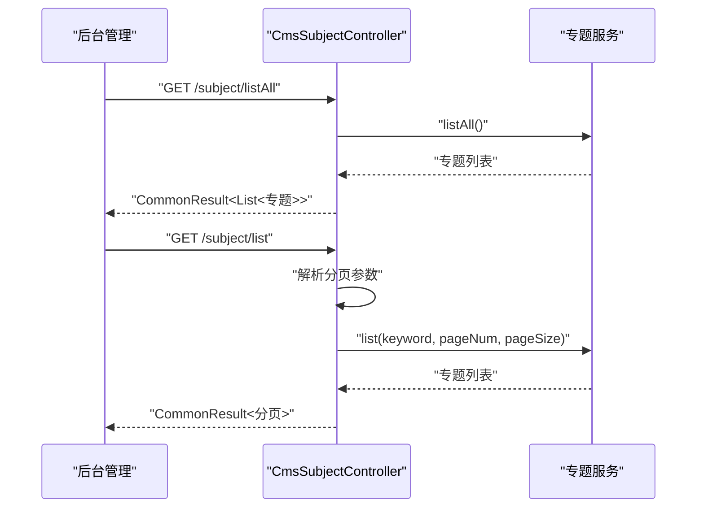
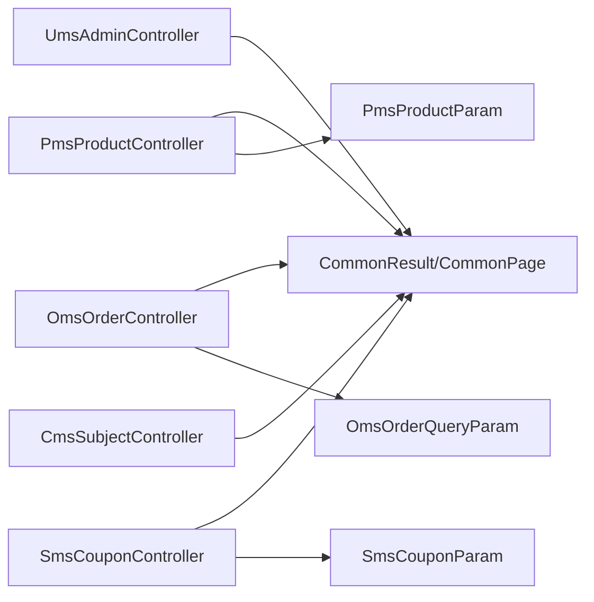

# 业务功能

<cite>
**本文引用的文件**
- [README.md](file://README.md)
- [MallAdminApplication.java](file://mall-admin/src/main/java/com/macro/mall/MallAdminApplication.java)
- [MallPortalApplication.java](file://mall-portal/src/main/java/com/macro/mall/portal/MallPortalApplication.java)
- [CommonResult.java](file://mall-common/src/main/java/com/macro/mall/common/api/CommonResult.java)
- [CommonPage.java](file://mall-common/src/main/java/com/macro/mall/common/api/CommonPage.java)
- [PmsProductController.java](file://mall-admin/src/main/java/com/macro/mall/controller/PmsProductController.java)
- [PmsProductParam.java](file://mall-admin/src/main/java/com/macro/mall/dto/PmsProductParam.java)
- [OmsOrderController.java](file://mall-admin/src/main/java/com/macro/mall/controller/OmsOrderController.java)
- [OmsOrderQueryParam.java](file://mall-admin/src/main/java/com/macro/mall/dto/OmsOrderQueryParam.java)
- [UmsAdminController.java](file://mall-admin/src/main/java/com/macro/mall/controller/UmsAdminController.java)
- [UmsAdminParam.java](file://mall-admin/src/main/java/com/macro/mall/dto/UmsAdminParam.java)
- [UmsAdminLoginParam.java](file://mall-admin/src/main/java/com/macro/mall/dto/UmsAdminLoginParam.java)
- [SmsCouponController.java](file://mall-admin/src/main/java/com/macro/mall/controller/SmsCouponController.java)
- [SmsCouponParam.java](file://mall-admin/src/main/java/com/macro/mall/dto/SmsCouponParam.java)
- [CmsSubjectController.java](file://mall-admin/src/main/java/com/macro/mall/controller/CmsSubjectController.java)
</cite>

## 目录
1. [简介](#简介)
2. [项目结构](#项目结构)
3. [核心组件](#核心组件)
4. [架构总览](#架构总览)
5. [详细组件分析](#详细组件分析)
6. [依赖分析](#依赖分析)
7. [性能考虑](#性能考虑)
8. [故障排查指南](#故障排查指南)
9. [结论](#结论)
10. [附录](#附录)

## 简介
本文件面向开发者与产品人员，系统梳理 Mall 电商系统的业务功能与实现要点，覆盖后台管理侧的关键模块：商品管理（品牌、分类、属性、SKU）、订单管理（订单处理、发货、退款）、用户管理（管理员、权限、角色）、营销管理（优惠券、促销活动、首页配置）、内容管理（专题、推荐、广告）。文档以“模块—接口—数据模型—流程—最佳实践”的方式组织，辅以可视化图示，帮助快速理解与二次开发。

## 项目结构
- 后端采用多模块分层：通用工具与统一返回体（mall-common）、MyBatis 代码生成（mall-mbg）、安全模块（mall-security）、后台管理（mall-admin）、前台门户（mall-portal）、搜索（mall-search）、示例（mall-demo）。
- 后台管理模块提供商品、订单、用户、营销、内容等管理接口；前台门户提供会员、购物车、订单、搜索等能力；统一返回体与分页封装提升接口一致性。

章节来源
- [README.md:51-62](file://README.md#L51-L62)
- [MallAdminApplication.java:1-16](file://mall-admin/src/main/java/com/macro/mall/MallAdminApplication.java#L1-L16)
- [MallPortalApplication.java:1-14](file://mall-portal/src/main/java/com/macro/mall/portal/MallPortalApplication.java#L1-L14)

## 核心组件
- 统一返回体与分页
  - 统一返回体封装成功/失败/未登录/未授权等场景，便于前后端约定。
  - 分页封装支持 PageHelper 与 Spring Data 两种分页源，输出标准化分页对象。
- 控制器层
  - 后台管理控制器集中暴露商品、订单、用户、营销、内容等管理接口。
  - 前台门户控制器提供会员、购物车、订单、搜索等接口（此处聚焦后台模块）。

章节来源
- [CommonResult.java:1-134](file://mall-common/src/main/java/com/macro/mall/common/api/CommonResult.java#L1-L134)
- [CommonPage.java:1-101](file://mall-common/src/main/java/com/macro/mall/common/api/CommonPage.java#L1-L101)

## 架构总览
- 应用入口
  - 后台管理应用入口位于 mall-admin 模块，负责启动后台管理服务。
  - 前台门户应用入口位于 mall-portal 模块，负责启动前台门户服务。
- 接口风格
  - 控制器通过注解声明 REST 接口，统一返回体包装响应。
  - DTO 用于接收复杂入参（如商品、优惠券、订单查询），模型用于数据库映射。

章节来源
- [MallAdminApplication.java:10-15](file://mall-admin/src/main/java/com/macro/mall/MallAdminApplication.java#L10-L15)
- [MallPortalApplication.java:6-12](file://mall-portal/src/main/java/com/macro/mall/portal/MallPortalApplication.java#L6-L12)
- [PmsProductParam.java:1-24](file://mall-admin/src/main/java/com/macro/mall/dto/PmsProductParam.java#L1-L24)
- [SmsCouponParam.java:1-23](file://mall-admin/src/main/java/com/macro/mall/dto/SmsCouponParam.java#L1-L23)
- [OmsOrderQueryParam.java:1-20](file://mall-admin/src/main/java/com/macro/mall/dto/OmsOrderQueryParam.java#L1-L20)

## 详细组件分析

### 商品管理（品牌、分类、属性、SKU）
- 功能概述
  - 支持商品创建、编辑、批量审核、发布、推荐、新品、删除状态维护。
  - 商品详情包含阶梯价、满减、会员价、SKU 库存、属性值、专题/地区关联等。
- 关键接口
  - 创建商品：POST /product/create
  - 编辑商品：POST /product/update/{id}
  - 查询商品列表：GET /product/list
  - 批量更新状态：审核、发布、推荐、新品、删除等
- 数据模型与关系
  - 请求参数 DTO 聚合商品主表与子表集合，便于一次性保存。
  - 子表包括：阶梯价、满减、会员价、SKU 库存、属性值、专题/地区关联等。

图示来源
- [PmsProductController.java:21-134](file://mall-admin/src/main/java/com/macro/mall/controller/PmsProductController.java#L21-L134)
- [PmsProductParam.java:9-24](file://mall-admin/src/main/java/com/macro/mall/dto/PmsProductParam.java#L9-L24)

章节来源
- [PmsProductController.java:21-134](file://mall-admin/src/main/java/com/macro/mall/controller/PmsProductController.java#L21-L134)
- [PmsProductParam.java:9-24](file://mall-admin/src/main/java/com/macro/mall/dto/PmsProductParam.java#L9-L24)

### 订单管理（订单处理、发货、退款）
- 功能概述
  - 支持订单列表查询、详情查看、批量发货、关闭、删除、修改收货人信息、金额信息、备注与状态。
  - 查询参数支持订单号、收货人关键字、状态、类型、来源、创建时间等。
- 关键接口
  - 查询订单列表：GET /order/list
  - 批量发货：POST /order/update/delivery
  - 关闭订单：POST /order/update/close
  - 删除订单：POST /order/delete
  - 查看订单详情：GET /order/{id}
  - 修改收货人信息：POST /order/update/receiverInfo
  - 修改金额信息：POST /order/update/moneyInfo
  - 修改备注与状态：POST /order/update/note

图示来源
- [OmsOrderController.java:19-104](file://mall-admin/src/main/java/com/macro/mall/controller/OmsOrderController.java#L19-L104)

章节来源
- [OmsOrderController.java:19-104](file://mall-admin/src/main/java/com/macro/mall/controller/OmsOrderController.java#L19-L104)
- [OmsOrderQueryParam.java:10-20](file://mall-admin/src/main/java/com/macro/mall/dto/OmsOrderQueryParam.java#L10-L20)

### 用户管理（管理员、权限、角色）
- 功能概述
  - 管理员注册、登录、刷新 Token、获取个人信息、登出、列表查询、更新、删除、启用/禁用。
  - 角色分配与查询：为管理员绑定角色集合。
  - 登录参数与注册参数包含基础校验。
- 关键接口
  - 注册：POST /admin/register
  - 登录：POST /admin/login
  - 刷新 Token：GET /admin/refreshToken
  - 获取个人信息：GET /admin/info
  - 更新密码：POST /admin/updatePassword
  - 列表查询：GET /admin/list
  - 更新状态：POST /admin/updateStatus/{id}
  - 角色分配：POST /admin/role/update
  - 查询角色：GET /admin/role/{adminId}

图示来源
- [UmsAdminController.java:31-192](file://mall-admin/src/main/java/com/macro/mall/controller/UmsAdminController.java#L31-L192)
- [UmsAdminLoginParam.java:12-20](file://mall-admin/src/main/java/com/macro/mall/dto/UmsAdminLoginParam.java#L12-L20)
- [UmsAdminParam.java:13-26](file://mall-admin/src/main/java/com/macro/mall/dto/UmsAdminParam.java#L13-L26)

章节来源
- [UmsAdminController.java:31-192](file://mall-admin/src/main/java/com/macro/mall/controller/UmsAdminController.java#L31-L192)
- [UmsAdminLoginParam.java:12-20](file://mall-admin/src/main/java/com/macro/mall/dto/UmsAdminLoginParam.java#L12-L20)
- [UmsAdminParam.java:13-26](file://mall-admin/src/main/java/com/macro/mall/dto/UmsAdminParam.java#L13-L26)

### 营销管理（优惠券、促销活动、首页配置）
- 优惠券管理
  - 支持创建、删除、更新、列表查询、详情查看。
  - 优惠券参数 DTO 聚合绑定商品与分类的关系集合。
- 促销活动与首页配置
  - 促销活动与首页配置在后台模块中通过相关控制器提供接口（此处聚焦优惠券）。

图示来源
- [SmsCouponController.java:19-73](file://mall-admin/src/main/java/com/macro/mall/controller/SmsCouponController.java#L19-L73)
- [SmsCouponParam.java:15-23](file://mall-admin/src/main/java/com/macro/mall/dto/SmsCouponParam.java#L15-L23)

章节来源
- [SmsCouponController.java:19-73](file://mall-admin/src/main/java/com/macro/mall/controller/SmsCouponController.java#L19-L73)
- [SmsCouponParam.java:15-23](file://mall-admin/src/main/java/com/macro/mall/dto/SmsCouponParam.java#L15-L23)

### 内容管理（专题、推荐、广告）
- 商品专题管理
  - 支持查询全部专题、按关键字分页查询专题列表。
- 推荐与广告
  - 推荐与广告在后台模块中通过相关控制器提供接口（此处聚焦专题）。

图示来源
- [CmsSubjectController.java:21-44](file://mall-admin/src/main/java/com/macro/mall/controller/CmsSubjectController.java#L21-L44)

章节来源
- [CmsSubjectController.java:21-44](file://mall-admin/src/main/java/com/macro/mall/controller/CmsSubjectController.java#L21-L44)

## 依赖分析
- 控制器依赖
  - 后台控制器依赖统一返回体与分页封装，以及各领域 DTO 与模型。
  - 控制器通过服务层协调业务逻辑，DAO/Mapper 由 MBG 生成。
- 模块间耦合
  - mall-admin 依赖 mall-common 提供统一返回与分页；依赖 mall-mbg 的模型/DAO；依赖 mall-security 的安全能力。
  - mall-portal 与 mall-search 亦遵循相同依赖关系，但此处聚焦 mall-admin 的业务模块。

图示来源
- [PmsProductController.java:21-134](file://mall-admin/src/main/java/com/macro/mall/controller/PmsProductController.java#L21-L134)
- [OmsOrderController.java:19-104](file://mall-admin/src/main/java/com/macro/mall/controller/OmsOrderController.java#L19-L104)
- [UmsAdminController.java:31-192](file://mall-admin/src/main/java/com/macro/mall/controller/UmsAdminController.java#L31-L192)
- [SmsCouponController.java:19-73](file://mall-admin/src/main/java/com/macro/mall/controller/SmsCouponController.java#L19-L73)
- [CmsSubjectController.java:21-44](file://mall-admin/src/main/java/com/macro/mall/controller/CmsSubjectController.java#L21-L44)
- [CommonResult.java:1-134](file://mall-common/src/main/java/com/macro/mall/common/api/CommonResult.java#L1-L134)
- [CommonPage.java:1-101](file://mall-common/src/main/java/com/macro/mall/common/api/CommonPage.java#L1-L101)
- [PmsProductParam.java:9-24](file://mall-admin/src/main/java/com/macro/mall/dto/PmsProductParam.java#L9-L24)
- [SmsCouponParam.java:15-23](file://mall-admin/src/main/java/com/macro/mall/dto/SmsCouponParam.java#L15-L23)
- [OmsOrderQueryParam.java:10-20](file://mall-admin/src/main/java/com/macro/mall/dto/OmsOrderQueryParam.java#L10-L20)

## 性能考虑
- 分页与查询
  - 使用统一分页封装，避免重复分页逻辑；对高频查询建议结合索引与必要字段投影。
- 批量操作
  - 批量更新状态（如商品多状态、订单多状态）应尽量走批处理或事务合并，减少往返。
- DTO 聚合
  - DTO 聚合子表集合可减少多次往返，但注意大对象序列化开销，建议按需加载。
- 返回体一致性
  - 统一返回体降低前端适配成本，同时利于监控与日志埋点。

## 故障排查指南
- 统一异常与返回
  - 失败、参数校验失败、未登录、未授权均有明确返回体，便于定位问题。
- 常见问题
  - 登录失败：检查用户名/密码是否为空、账号状态是否正常。
  - 权限不足：确认角色与菜单权限是否正确配置。
  - 分页异常：核对 pageNum/pageSize 是否合理，DAO 查询条件是否完整。
- 接口调试
  - 使用 Postman 集合进行接口回归测试，结合统一返回体快速定位错误码与消息。

章节来源
- [CommonResult.java:50-108](file://mall-common/src/main/java/com/macro/mall/common/api/CommonResult.java#L50-L108)
- [UmsAdminController.java:54-79](file://mall-admin/src/main/java/com/macro/mall/controller/UmsAdminController.java#L54-L79)

## 结论
Mall 后台管理模块以清晰的控制器分层与统一返回体为基础，围绕商品、订单、用户、营销、内容五大业务域提供了完备的管理接口。通过 DTO 聚合与分页封装，既保证了接口的一致性，也为二次开发提供了良好的扩展点。建议在二次开发中遵循现有分层与命名规范，确保新功能与现有体系无缝集成。

## 附录
- 快速上手
  - 后台管理演示地址与学习教程见项目 README。
- 开发与部署
  - 后台模块仅需 MySQL、Redis 即可运行；Docker 与 Docker Compose 提供一键部署方案。
- 前后端分离
  - 前端项目与接口文档分别在 mall-admin-web 与 mall-app-web 中维护。

章节来源
- [README.md:13-208](file://README.md#L13-L208)