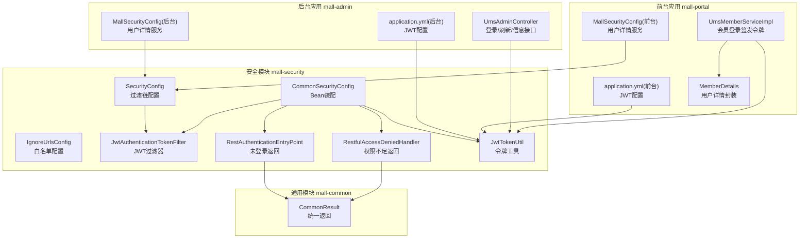
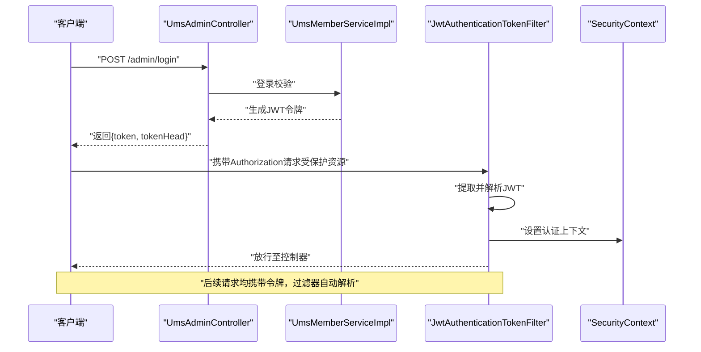
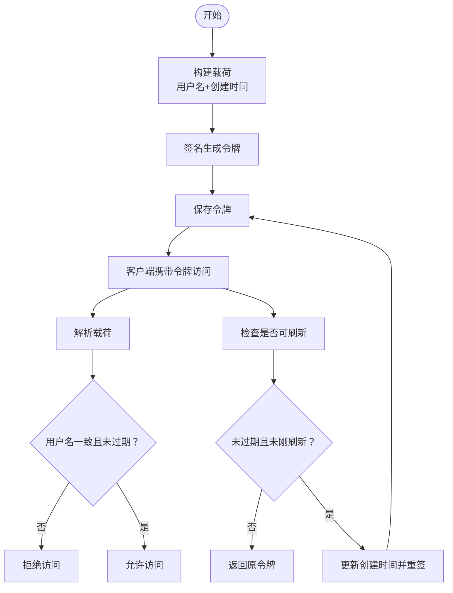
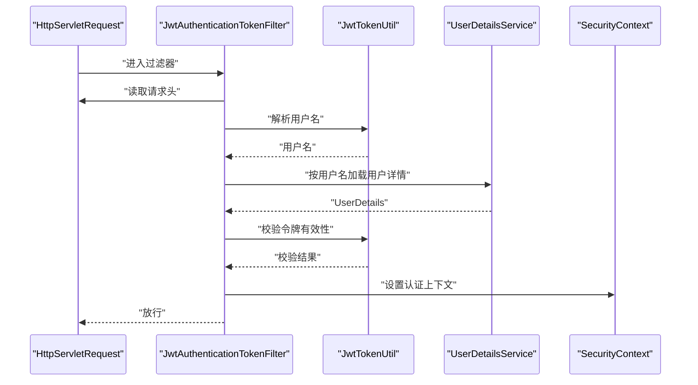
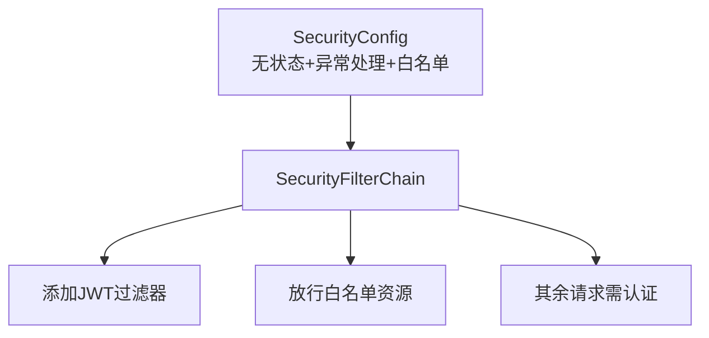
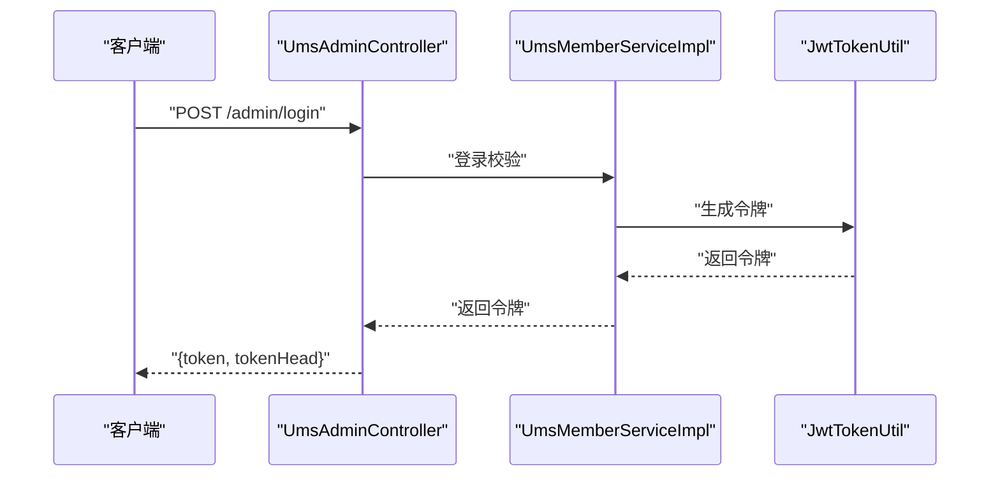
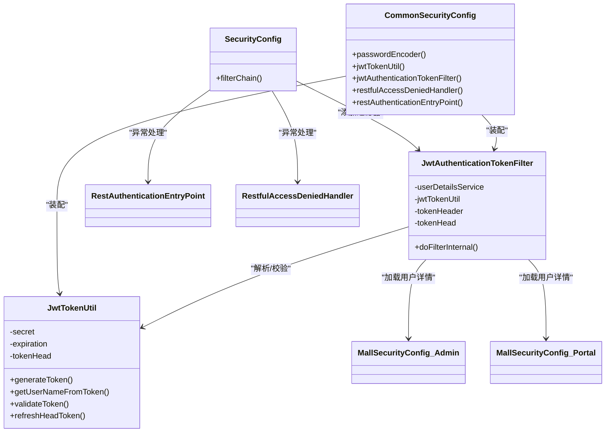

# JWT认证机制

<cite>
**本文引用的文件**
- [JwtTokenUtil.java](file://mall-security/src/main/java/com/macro/mall/security/util/JwtTokenUtil.java)
- [JwtAuthenticationTokenFilter.java](file://mall-security/src/main/java/com/macro/mall/security/component/JwtAuthenticationTokenFilter.java)
- [SecurityConfig.java](file://mall-security/src/main/java/com/macro/mall/security/config/SecurityConfig.java)
- [CommonSecurityConfig.java](file://mall-security/src/main/java/com/macro/mall/security/config/CommonSecurityConfig.java)
- [IgnoreUrlsConfig.java](file://mall-security/src/main/java/com/macro/mall/security/config/IgnoreUrlsConfig.java)
- [RestAuthenticationEntryPoint.java](file://mall-security/src/main/java/com/macro/mall/security/component/RestAuthenticationEntryPoint.java)
- [RestfulAccessDeniedHandler.java](file://mall-security/src/main/java/com/macro/mall/security/component/RestfulAccessDeniedHandler.java)
- [MallSecurityConfig.java（后台）](file://mall-admin/src/main/java/com/macro/mall/config/MallSecurityConfig.java)
- [MallSecurityConfig.java（前台）](file://mall-portal/src/main/java/com/macro/mall/portal/config/MallSecurityConfig.java)
- [application.yml（后台）](file://mall-admin/src/main/resources/application.yml)
- [application.yml（前台）](file://mall-portal/src/main/resources/application.yml)
- [UmsAdminController.java](file://mall-admin/src/main/java/com/macro/mall/controller/UmsAdminController.java)
- [UmsMemberServiceImpl.java](file://mall-portal/src/main/java/com/macro/mall/portal/service/impl/UmsMemberServiceImpl.java)
- [MemberDetails.java](file://mall-portal/src/main/java/com/macro/mall/portal/domain/MemberDetails.java)
- [CommonResult.java](file://mall-common/src/main/java/com/macro/mall/common/api/CommonResult.java)
</cite>

## 目录
1. [简介](#简介)
2. [项目结构](#项目结构)
3. [核心组件](#核心组件)
4. [架构总览](#架构总览)
5. [组件详解](#组件详解)
6. [依赖关系分析](#依赖关系分析)
7. [性能与安全考量](#性能与安全考量)
8. [故障排查指南](#故障排查指南)
9. [结论](#结论)
10. [附录](#附录)

## 简介
本文件系统性梳理并解析仓库中的JWT认证机制，覆盖令牌生成、解析验证、刷新流程，以及密钥管理、签名算法、过期时间等关键配置；深入剖析JwtTokenUtil工具类与JwtAuthenticationTokenFilter过滤器的实现原理；并结合前后端分离场景给出令牌存储、跨域处理与安全传输的最佳实践。

## 项目结构
围绕JWT认证的关键模块分布于以下位置：
- 安全配置与过滤器：mall-security 模块
- 应用层配置与控制器：mall-admin、mall-portal 模块
- 通用响应封装：mall-common 模块

**图表来源**
- [SecurityConfig.java:38-64](file://mall-security/src/main/java/com/macro/mall/security/config/SecurityConfig.java#L38-L64)
- [CommonSecurityConfig.java:29-47](file://mall-security/src/main/java/com/macro/mall/security/config/CommonSecurityConfig.java#L29-L47)
- [IgnoreUrlsConfig.java:14-21](file://mall-security/src/main/java/com/macro/mall/security/config/IgnoreUrlsConfig.java#L14-L21)
- [JwtAuthenticationTokenFilter.java:25-57](file://mall-security/src/main/java/com/macro/mall/security/component/JwtAuthenticationTokenFilter.java#L25-L57)
- [RestAuthenticationEntryPoint.java:18-28](file://mall-security/src/main/java/com/macro/mall/security/component/RestAuthenticationEntryPoint.java#L18-L28)
- [RestfulAccessDeniedHandler.java:18-30](file://mall-security/src/main/java/com/macro/mall/security/component/RestfulAccessDeniedHandler.java#L18-L30)
- [JwtTokenUtil.java:28-171](file://mall-security/src/main/java/com/macro/mall/security/util/JwtTokenUtil.java#L28-L171)
- [MallSecurityConfig.java（后台）:22-33](file://mall-admin/src/main/java/com/macro/mall/config/MallSecurityConfig.java#L22-L33)
- [MallSecurityConfig.java（前台）:14-24](file://mall-portal/src/main/java/com/macro/mall/portal/config/MallSecurityConfig.java#L14-L24)
- [application.yml（后台）:20-24](file://mall-admin/src/main/resources/application.yml#L20-L24)
- [application.yml（前台）:15-19](file://mall-portal/src/main/resources/application.yml#L15-L19)
- [UmsAdminController.java:54-79](file://mall-admin/src/main/java/com/macro/mall/controller/UmsAdminController.java#L54-L79)
- [UmsMemberServiceImpl.java:165-180](file://mall-portal/src/main/java/com/macro/mall/portal/service/impl/UmsMemberServiceImpl.java#L165-L180)
- [MemberDetails.java:15-61](file://mall-portal/src/main/java/com/macro/mall/portal/domain/MemberDetails.java#L15-L61)
- [CommonResult.java:99-108](file://mall-common/src/main/java/com/macro/mall/common/api/CommonResult.java#L99-L108)

**章节来源**
- [SecurityConfig.java:38-64](file://mall-security/src/main/java/com/macro/mall/security/config/SecurityConfig.java#L38-L64)
- [CommonSecurityConfig.java:29-47](file://mall-security/src/main/java/com/macro/mall/security/config/CommonSecurityConfig.java#L29-L47)
- [application.yml（后台）:20-24](file://mall-admin/src/main/resources/application.yml#L20-L24)
- [application.yml（前台）:15-19](file://mall-portal/src/main/resources/application.yml#L15-L19)

## 核心组件
- JwtTokenUtil：负责令牌生成、解析、校验、刷新等核心逻辑，使用对称签名算法与过期时间配置。
- JwtAuthenticationTokenFilter：在请求进入时从请求头提取令牌，解析用户名并注入Spring Security上下文。
- SecurityConfig：配置无状态会话、异常处理器、JWT过滤器与白名单资源。
- CommonSecurityConfig：装配通用Bean，包括密码编码器、JWT工具、过滤器与异常处理器。
- IgnoreUrlsConfig：集中维护无需鉴权的白名单路径。
- RestAuthenticationEntryPoint / RestfulAccessDeniedHandler：未登录与权限不足的统一返回。
- MallSecurityConfig（后台/前台）：提供UserDetailsService实现，供过滤器加载用户详情。

**章节来源**
- [JwtTokenUtil.java:28-171](file://mall-security/src/main/java/com/macro/mall/security/util/JwtTokenUtil.java#L28-L171)
- [JwtAuthenticationTokenFilter.java:25-57](file://mall-security/src/main/java/com/macro/mall/security/component/JwtAuthenticationTokenFilter.java#L25-L57)
- [SecurityConfig.java:38-64](file://mall-security/src/main/java/com/macro/mall/security/config/SecurityConfig.java#L38-L64)
- [CommonSecurityConfig.java:29-47](file://mall-security/src/main/java/com/macro/mall/security/config/CommonSecurityConfig.java#L29-L47)
- [IgnoreUrlsConfig.java:14-21](file://mall-security/src/main/java/com/macro/mall/security/config/IgnoreUrlsConfig.java#L14-L21)
- [RestAuthenticationEntryPoint.java:18-28](file://mall-security/src/main/java/com/macro/mall/security/component/RestAuthenticationEntryPoint.java#L18-L28)
- [RestfulAccessDeniedHandler.java:18-30](file://mall-security/src/main/java/com/macro/mall/security/component/RestfulAccessDeniedHandler.java#L18-L30)
- [MallSecurityConfig.java（后台）:22-33](file://mall-admin/src/main/java/com/macro/mall/config/MallSecurityConfig.java#L22-L33)
- [MallSecurityConfig.java（前台）:14-24](file://mall-portal/src/main/java/com/macro/mall/portal/config/MallSecurityConfig.java#L14-L24)

## 架构总览
JWT认证在本项目中遵循“无状态”设计：客户端登录成功后获得令牌，后续请求由过滤器自动解析并注入认证上下文，控制器基于上下文进行业务处理。

**图表来源**
- [UmsAdminController.java:54-79](file://mall-admin/src/main/java/com/macro/mall/controller/UmsAdminController.java#L54-L79)
- [UmsMemberServiceImpl.java:165-180](file://mall-portal/src/main/java/com/macro/mall/portal/service/impl/UmsMemberServiceImpl.java#L165-L180)
- [JwtAuthenticationTokenFilter.java:36-56](file://mall-security/src/main/java/com/macro/mall/security/component/JwtAuthenticationTokenFilter.java#L36-L56)

## 组件详解

### JwtTokenUtil 工具类
- 密钥与签名
  - 使用对称密钥进行签名，密钥来源于配置项。
  - 使用固定签名算法生成与解析令牌。
- 过期时间
  - 过期时长来自配置项，单位为秒，生成时按当前时间加上过期秒数计算。
- 载荷与解析
  - 载荷包含用户名与创建时间键，解析时从令牌中提取并校验。
- 令牌生成
  - 基于用户详情构建载荷并签名生成令牌。
- 令牌校验
  - 校验用户名一致且未过期。
- 刷新策略
  - 支持在未过期前提下刷新令牌，避免频繁登录；若已过期则拒绝刷新。
  - 对“刚刷新过”的令牌进行保护，防止短时间内重复刷新。

**图表来源**
- [JwtTokenUtil.java:42-48](file://mall-security/src/main/java/com/macro/mall/security/util/JwtTokenUtil.java#L42-L48)
- [JwtTokenUtil.java:53-64](file://mall-security/src/main/java/com/macro/mall/security/util/JwtTokenUtil.java#L53-L64)
- [JwtTokenUtil.java:93-96](file://mall-security/src/main/java/com/macro/mall/security/util/JwtTokenUtil.java#L93-L96)
- [JwtTokenUtil.java:129-153](file://mall-security/src/main/java/com/macro/mall/security/util/JwtTokenUtil.java#L129-L153)
- [JwtTokenUtil.java:160-169](file://mall-security/src/main/java/com/macro/mall/security/util/JwtTokenUtil.java#L160-L169)

**章节来源**
- [JwtTokenUtil.java:28-171](file://mall-security/src/main/java/com/macro/mall/security/util/JwtTokenUtil.java#L28-L171)
- [application.yml（后台）:20-24](file://mall-admin/src/main/resources/application.yml#L20-L24)
- [application.yml（前台）:15-19](file://mall-portal/src/main/resources/application.yml#L15-L19)

### JwtAuthenticationTokenFilter 过滤器
- 请求拦截
  - 在每个HTTP请求进入时执行一次，确保幂等。
- 令牌提取
  - 从请求头中读取配置的令牌头名称，并去除前缀得到实际令牌。
- 用户身份解析
  - 解析令牌获取用户名；若上下文尚未认证，则加载用户详情。
- 权限上下文设置
  - 将认证对象写入SecurityContext，使后续控制器可直接获取当前用户。

**图表来源**
- [JwtAuthenticationTokenFilter.java:36-56](file://mall-security/src/main/java/com/macro/mall/security/component/JwtAuthenticationTokenFilter.java#L36-L56)
- [JwtTokenUtil.java:76-96](file://mall-security/src/main/java/com/macro/mall/security/util/JwtTokenUtil.java#L76-L96)

**章节来源**
- [JwtAuthenticationTokenFilter.java:25-57](file://mall-security/src/main/java/com/macro/mall/security/component/JwtAuthenticationTokenFilter.java#L25-L57)

### 安全配置与异常处理
- 无状态会话
  - 关闭CSRF，禁用Session，强制基于令牌的无状态认证。
- 异常处理
  - 未登录与权限不足分别返回统一JSON结构，便于前端处理。
- 白名单资源
  - 通过配置集中维护无需鉴权的静态资源与公开接口。

**图表来源**
- [SecurityConfig.java:38-64](file://mall-security/src/main/java/com/macro/mall/security/config/SecurityConfig.java#L38-L64)
- [IgnoreUrlsConfig.java:14-21](file://mall-security/src/main/java/com/macro/mall/security/config/IgnoreUrlsConfig.java#L14-L21)
- [RestAuthenticationEntryPoint.java:18-28](file://mall-security/src/main/java/com/macro/mall/security/component/RestAuthenticationEntryPoint.java#L18-L28)
- [RestfulAccessDeniedHandler.java:18-30](file://mall-security/src/main/java/com/macro/mall/security/component/RestfulAccessDeniedHandler.java#L18-L30)

**章节来源**
- [SecurityConfig.java:38-64](file://mall-security/src/main/java/com/macro/mall/security/config/SecurityConfig.java#L38-L64)
- [CommonSecurityConfig.java:29-47](file://mall-security/src/main/java/com/macro/mall/security/config/CommonSecurityConfig.java#L29-L47)
- [IgnoreUrlsConfig.java:14-21](file://mall-security/src/main/java/com/macro/mall/security/config/IgnoreUrlsConfig.java#L14-L21)
- [RestAuthenticationEntryPoint.java:18-28](file://mall-security/src/main/java/com/macro/mall/security/component/RestAuthenticationEntryPoint.java#L18-L28)
- [RestfulAccessDeniedHandler.java:18-30](file://mall-security/src/main/java/com/macro/mall/security/component/RestfulAccessDeniedHandler.java#L18-L30)

### 登录与刷新流程（后台/前台）
- 后台登录
  - 控制器接收用户名与密码，调用服务登录并生成令牌，返回给客户端。
- 前台登录
  - 会员服务加载用户详情并校验密码，随后生成令牌。
- 刷新令牌
  - 前端携带Authorization头请求刷新接口，服务端根据配置的令牌头与前缀进行处理。

**图表来源**
- [UmsAdminController.java:54-79](file://mall-admin/src/main/java/com/macro/mall/controller/UmsAdminController.java#L54-L79)
- [UmsMemberServiceImpl.java:165-180](file://mall-portal/src/main/java/com/macro/mall/portal/service/impl/UmsMemberServiceImpl.java#L165-L180)
- [JwtTokenUtil.java:117-122](file://mall-security/src/main/java/com/macro/mall/security/util/JwtTokenUtil.java#L117-L122)

**章节来源**
- [UmsAdminController.java:54-79](file://mall-admin/src/main/java/com/macro/mall/controller/UmsAdminController.java#L54-L79)
- [UmsMemberServiceImpl.java:165-180](file://mall-portal/src/main/java/com/macro/mall/portal/service/impl/UmsMemberServiceImpl.java#L165-L180)
- [application.yml（后台）:20-24](file://mall-admin/src/main/resources/application.yml#L20-L24)
- [application.yml（前台）:15-19](file://mall-portal/src/main/resources/application.yml#L15-L19)

## 依赖关系分析
- 组件耦合
  - SecurityConfig依赖JwtAuthenticationTokenFilter与异常处理器。
  - JwtAuthenticationTokenFilter依赖JwtTokenUtil与UserDetailsService。
  - CommonSecurityConfig装配JwtTokenUtil与过滤器等通用Bean。
- 外部依赖
  - 使用对称签名算法与固定密钥，密钥与过期时间通过配置文件注入。
  - 白名单通过配置集中管理，便于扩展。

**图表来源**
- [SecurityConfig.java:38-64](file://mall-security/src/main/java/com/macro/mall/security/config/SecurityConfig.java#L38-L64)
- [CommonSecurityConfig.java:29-47](file://mall-security/src/main/java/com/macro/mall/security/config/CommonSecurityConfig.java#L29-L47)
- [JwtAuthenticationTokenFilter.java:25-57](file://mall-security/src/main/java/com/macro/mall/security/component/JwtAuthenticationTokenFilter.java#L25-L57)
- [JwtTokenUtil.java:28-171](file://mall-security/src/main/java/com/macro/mall/security/util/JwtTokenUtil.java#L28-L171)
- [MallSecurityConfig.java（后台）:22-33](file://mall-admin/src/main/java/com/macro/mall/config/MallSecurityConfig.java#L22-L33)
- [MallSecurityConfig.java（前台）:14-24](file://mall-portal/src/main/java/com/macro/mall/portal/config/MallSecurityConfig.java#L14-L24)

**章节来源**
- [SecurityConfig.java:38-64](file://mall-security/src/main/java/com/macro/mall/security/config/SecurityConfig.java#L38-L64)
- [CommonSecurityConfig.java:29-47](file://mall-security/src/main/java/com/macro/mall/security/config/CommonSecurityConfig.java#L29-L47)
- [JwtAuthenticationTokenFilter.java:25-57](file://mall-security/src/main/java/com/macro/mall/security/component/JwtAuthenticationTokenFilter.java#L25-L57)
- [JwtTokenUtil.java:28-171](file://mall-security/src/main/java/com/macro/mall/security/util/JwtTokenUtil.java#L28-L171)

## 性能与安全考量
- 性能
  - 无状态设计降低服务器会话开销；令牌解析与校验为轻量操作。
  - 建议合理设置过期时间，平衡安全性与用户体验。
- 安全
  - 密钥应妥善保管，建议使用环境变量或配置中心管理。
  - 建议启用HTTPS以防止令牌在传输中被窃取。
  - 对高频刷新场景可引入令牌黑名单或滑动过期策略（当前实现为“刚刷新保护”）。

[本节为通用指导，不直接分析具体文件]

## 故障排查指南
- 未登录或令牌无效
  - 触发未登录异常处理器，返回统一JSON结构，前端可据此跳转登录页。
- 权限不足
  - 触发权限不足异常处理器，返回统一JSON结构，提示无权访问。
- 令牌格式错误
  - 解析失败时记录日志，建议检查令牌头名称与前缀配置是否一致。
- 白名单未生效
  - 检查白名单配置是否正确加载，确认请求路径匹配规则。

**章节来源**
- [RestAuthenticationEntryPoint.java:18-28](file://mall-security/src/main/java/com/macro/mall/security/component/RestAuthenticationEntryPoint.java#L18-L28)
- [RestfulAccessDeniedHandler.java:18-30](file://mall-security/src/main/java/com/macro/mall/security/component/RestfulAccessDeniedHandler.java#L18-L30)
- [JwtTokenUtil.java:53-64](file://mall-security/src/main/java/com/macro/mall/security/util/JwtTokenUtil.java#L53-L64)
- [IgnoreUrlsConfig.java:14-21](file://mall-security/src/main/java/com/macro/mall/security/config/IgnoreUrlsConfig.java#L14-L21)

## 结论
本项目的JWT认证机制以mall-security为核心，通过无状态过滤器与工具类实现令牌的生成、解析与校验，并结合统一异常处理与白名单配置，形成清晰、可扩展的安全体系。结合前后端分离的最佳实践，可在保证安全的前提下提升用户体验。

[本节为总结性内容，不直接分析具体文件]

## 附录

### 配置要点与最佳实践
- 密钥与签名
  - 使用对称密钥，建议独立配置不同环境的密钥。
- 过期时间
  - 后台与前台分别配置，建议后台更短、前台稍长并配合刷新接口。
- 令牌头与前缀
  - 统一使用Authorization头与Bearer前缀，前后端保持一致。
- 令牌存储
  - 前端建议存储在内存或HttpOnly Cookie（推荐）中，避免localStorage泄露风险。
- 跨域处理
  - 允许携带凭证的跨域场景需谨慎配置CORS，确保预检请求放行。
- 安全传输
  - 生产环境必须启用HTTPS，防止令牌被中间人攻击。

**章节来源**
- [application.yml（后台）:20-24](file://mall-admin/src/main/resources/application.yml#L20-L24)
- [application.yml（前台）:15-19](file://mall-portal/src/main/resources/application.yml#L15-L19)
- [SecurityConfig.java:40-42](file://mall-security/src/main/java/com/macro/mall/security/config/SecurityConfig.java#L40-L42)