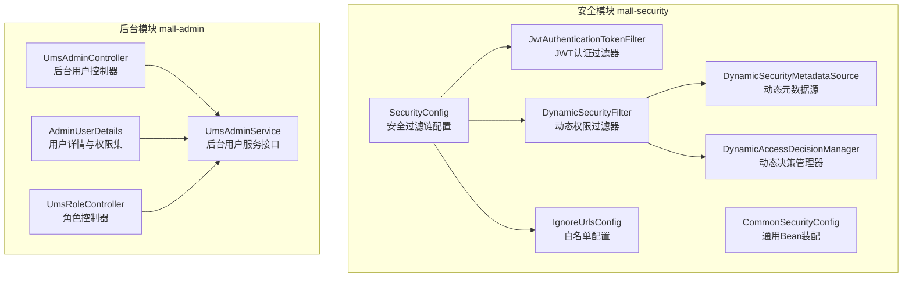
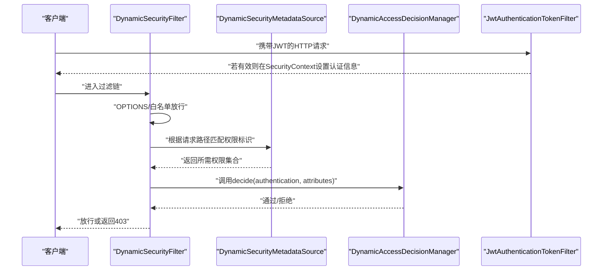
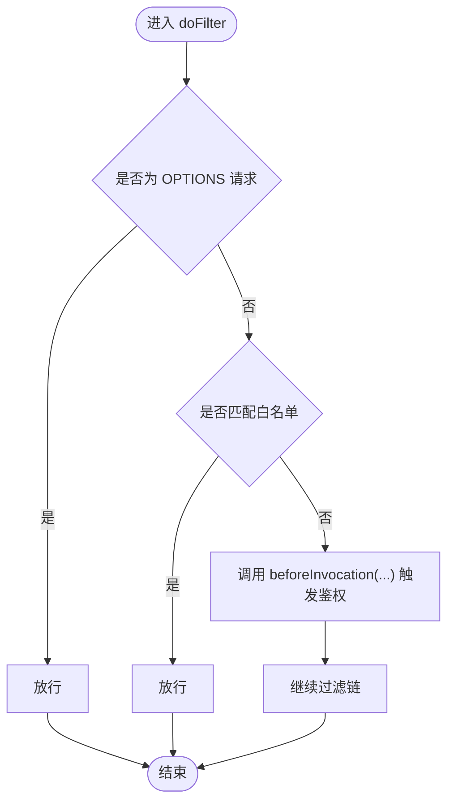
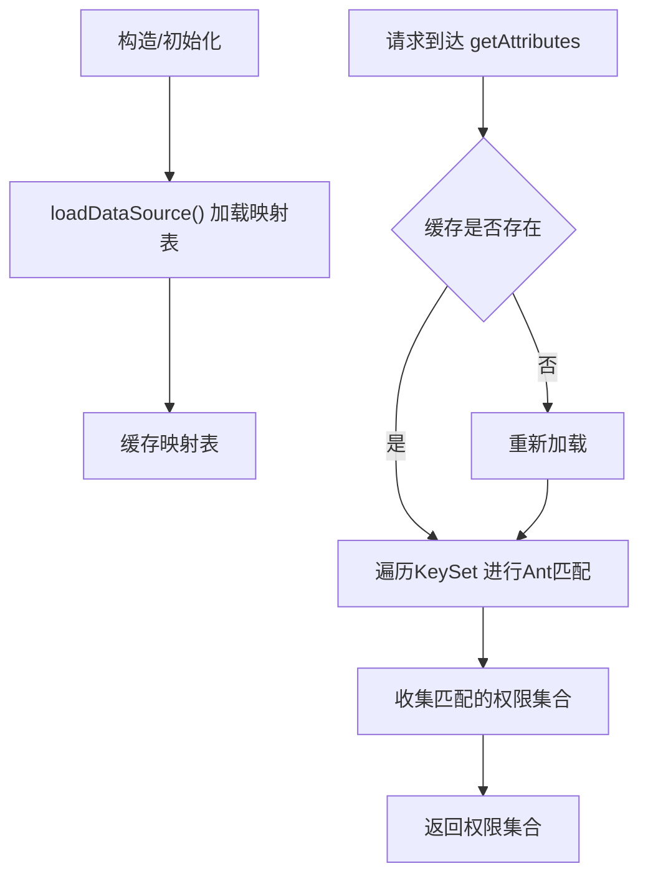
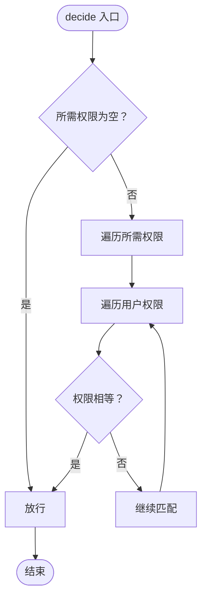
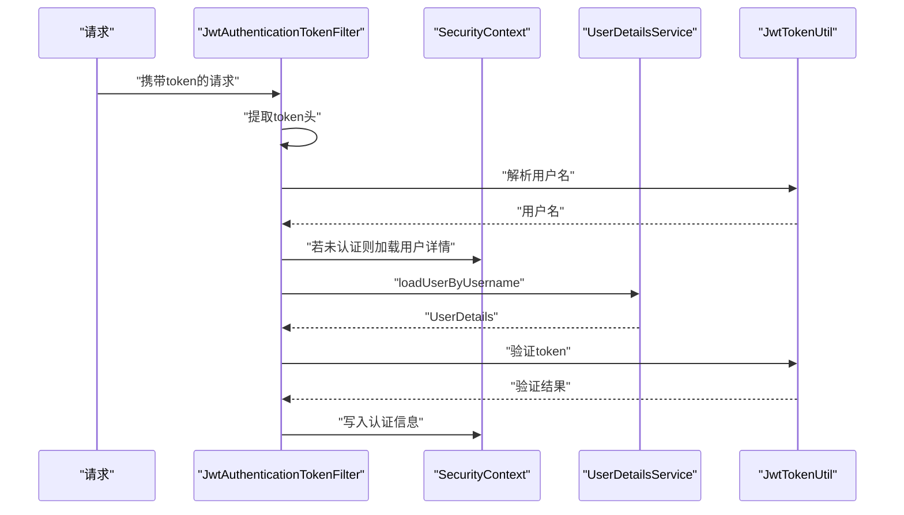
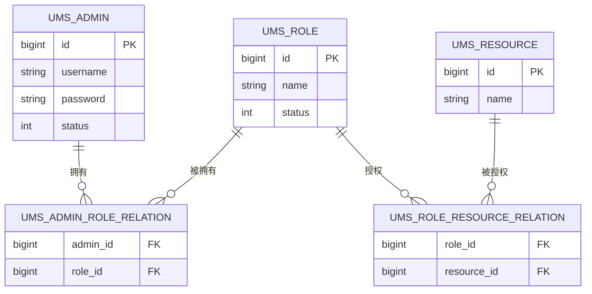
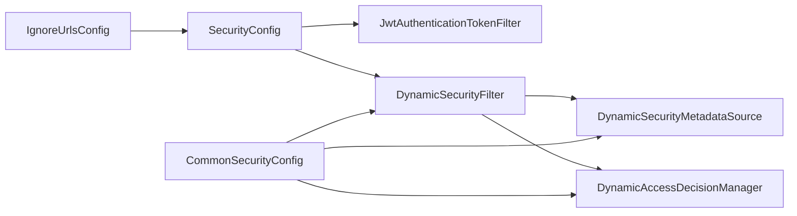
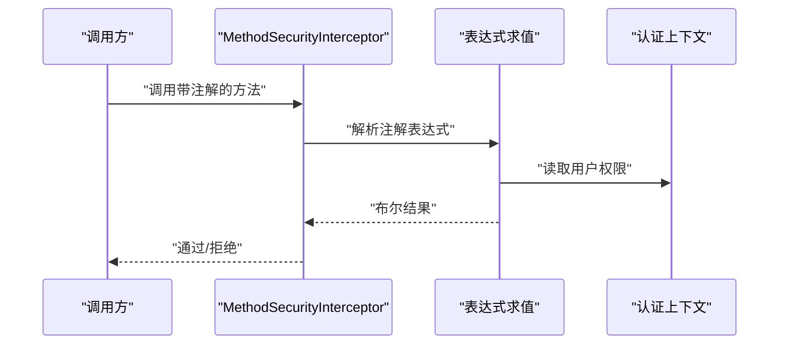

# RBAC权限控制

<cite>
**本文引用的文件**
- [mall-security/src/main/java/com/macro/mall/security/component/DynamicAccessDecisionManager.java](file://mall-security/src/main/java/com/macro/mall/security/component/DynamicAccessDecisionManager.java)
- [mall-security/src/main/java/com/macro/mall/security/component/DynamicSecurityFilter.java](file://mall-security/src/main/java/com/macro/mall/security/component/DynamicSecurityFilter.java)
- [mall-security/src/main/java/com/macro/mall/security/component/DynamicSecurityMetadataSource.java](file://mall-security/src/main/java/com/macro/mall/security/component/DynamicSecurityMetadataSource.java)
- [mall-security/src/main/java/com/macro/mall/security/component/DynamicSecurityService.java](file://mall-security/src/main/java/com/macro/mall/security/component/DynamicSecurityService.java)
- [mall-security/src/main/java/com/macro/mall/security/config/SecurityConfig.java](file://mall-security/src/main/java/com/macro/mall/security/config/SecurityConfig.java)
- [mall-security/src/main/java/com/macro/mall/security/config/CommonSecurityConfig.java](file://mall-security/src/main/java/com/macro/mall/security/config/CommonSecurityConfig.java)
- [mall-security/src/main/java/com/macro/mall/security/config/IgnoreUrlsConfig.java](file://mall-security/src/main/java/com/macro/mall/security/config/IgnoreUrlsConfig.java)
- [mall-security/src/main/java/com/macro/mall/security/component/JwtAuthenticationTokenFilter.java](file://mall-security/src/main/java/com/macro/mall/security/component/JwtAuthenticationTokenFilter.java)
- [mall-admin/src/main/java/com/macro/mall/bo/AdminUserDetails.java](file://mall-admin/src/main/java/com/macro/mall/bo/AdminUserDetails.java)
- [mall-admin/src/main/java/com/macro/mall/service/UmsAdminService.java](file://mall-admin/src/main/java/com/macro/mall/service/UmsAdminService.java)
- [mall-admin/src/main/java/com/macro/mall/controller/UmsAdminController.java](file://mall-admin/src/main/java/com/macro/mall/controller/UmsAdminController.java)
- [mall-admin/src/main/java/com/macro/mall/controller/UmsRoleController.java](file://mall-admin/src/main/java/com/macro/mall/controller/UmsRoleController.java)
</cite>

## 目录
1. [简介](#简介)
2. [项目结构](#项目结构)
3. [核心组件](#核心组件)
4. [架构总览](#架构总览)
5. [详细组件分析](#详细组件分析)
6. [依赖分析](#依赖分析)
7. [性能考虑](#性能考虑)
8. [故障排查指南](#故障排查指南)
9. [结论](#结论)
10. [附录](#附录)

## 简介
本文件面向Mall项目的RBAC（基于角色的访问控制）权限体系，系统性阐述用户-角色-权限-资源的多对多关系建模与动态权限控制机制。重点覆盖以下内容：
- 基于Spring Security的动态权限决策链路：DynamicAccessDecisionManager、DynamicSecurityFilter、DynamicSecurityMetadataSource的协作原理
- 权限注解（如@PreAuthorize）在Mall中的使用方式与执行流程
- 权限配置最佳实践：权限粒度设计、URL白名单配置、动态权限更新机制
- 权限调试与故障排查方法

## 项目结构
Mall采用模块化组织，RBAC相关能力主要集中在mall-security模块与mall-admin模块中：
- mall-security：提供统一的安全配置、JWT过滤器、动态权限过滤器、元数据源、决策管理器以及异常处理等基础设施
- mall-admin：提供后台用户、角色、资源、菜单等业务实体与控制器，承载RBAC数据模型与对外接口

图表来源
- [mall-security/src/main/java/com/macro/mall/security/config/SecurityConfig.java:38-67](file://mall-security/src/main/java/com/macro/mall/security/config/SecurityConfig.java#L38-L67)
- [mall-security/src/main/java/com/macro/mall/security/config/CommonSecurityConfig.java:16-66](file://mall-security/src/main/java/com/macro/mall/security/config/CommonSecurityConfig.java#L16-L66)
- [mall-security/src/main/java/com/macro/mall/security/component/JwtAuthenticationTokenFilter.java:25-57](file://mall-security/src/main/java/com/macro/mall/security/component/JwtAuthenticationTokenFilter.java#L25-L57)
- [mall-security/src/main/java/com/macro/mall/security/component/DynamicSecurityFilter.java:21-77](file://mall-security/src/main/java/com/macro/mall/security/component/DynamicSecurityFilter.java#L21-L77)
- [mall-security/src/main/java/com/macro/mall/security/component/DynamicSecurityMetadataSource.java:18-64](file://mall-security/src/main/java/com/macro/mall/security/component/DynamicSecurityMetadataSource.java#L18-L64)
- [mall-security/src/main/java/com/macro/mall/security/component/DynamicAccessDecisionManager.java:18-51](file://mall-security/src/main/java/com/macro/mall/security/component/DynamicAccessDecisionManager.java#L18-L51)
- [mall-security/src/main/java/com/macro/mall/security/config/IgnoreUrlsConfig.java:14-21](file://mall-security/src/main/java/com/macro/mall/security/config/IgnoreUrlsConfig.java#L14-L21)
- [mall-admin/src/main/java/com/macro/mall/bo/AdminUserDetails.java:17-65](file://mall-admin/src/main/java/com/macro/mall/bo/AdminUserDetails.java#L17-L65)
- [mall-admin/src/main/java/com/macro/mall/service/UmsAdminService.java:17-98](file://mall-admin/src/main/java/com/macro/mall/service/UmsAdminService.java#L17-L98)
- [mall-admin/src/main/java/com/macro/mall/controller/UmsAdminController.java:34-191](file://mall-admin/src/main/java/com/macro/mall/controller/UmsAdminController.java#L34-L191)
- [mall-admin/src/main/java/com/macro/mall/controller/UmsRoleController.java:21-111](file://mall-admin/src/main/java/com/macro/mall/controller/UmsRoleController.java#L21-L111)

章节来源
- [mall-security/src/main/java/com/macro/mall/security/config/SecurityConfig.java:38-67](file://mall-security/src/main/java/com/macro/mall/security/config/SecurityConfig.java#L38-L67)
- [mall-security/src/main/java/com/macro/mall/security/config/CommonSecurityConfig.java:16-66](file://mall-security/src/main/java/com/macro/mall/security/config/CommonSecurityConfig.java#L16-L66)

## 核心组件
- 动态权限过滤器（DynamicSecurityFilter）
  - 在请求进入时，先放行OPTIONS与白名单，再通过AbstractSecurityInterceptor调用决策链
  - 关键职责：路径匹配、白名单放行、触发鉴权拦截
- 动态权限元数据源（DynamicSecurityMetadataSource）
  - 负责加载“ANT模式路径 → 配置属性（权限标识）”映射表
  - 提供当前访问路径所需的权限集合
- 动态权限决策管理器（DynamicAccessDecisionManager）
  - 对比用户权限与所需权限，决定是否放行
  - 未配置资源时默认放行
- JWT认证过滤器（JwtAuthenticationTokenFilter）
  - 解析请求头中的JWT，构建Spring Security认证上下文
- 白名单配置（IgnoreUrlsConfig）
  - 通过配置项提供无需鉴权的URL集合
- 用户详情与权限集（AdminUserDetails）
  - 将后台用户及其资源列表转换为Spring Security的GrantedAuthority集合

章节来源
- [mall-security/src/main/java/com/macro/mall/security/component/DynamicSecurityFilter.java:38-61](file://mall-security/src/main/java/com/macro/mall/security/component/DynamicSecurityFilter.java#L38-L61)
- [mall-security/src/main/java/com/macro/mall/security/component/DynamicSecurityMetadataSource.java:34-52](file://mall-security/src/main/java/com/macro/mall/security/component/DynamicSecurityMetadataSource.java#L34-L52)
- [mall-security/src/main/java/com/macro/mall/security/component/DynamicAccessDecisionManager.java:20-39](file://mall-security/src/main/java/com/macro/mall/security/component/DynamicAccessDecisionManager.java#L20-L39)
- [mall-security/src/main/java/com/macro/mall/security/component/JwtAuthenticationTokenFilter.java:36-56](file://mall-security/src/main/java/com/macro/mall/security/component/JwtAuthenticationTokenFilter.java#L36-L56)
- [mall-security/src/main/java/com/macro/mall/security/config/IgnoreUrlsConfig.java:14-21](file://mall-security/src/main/java/com/macro/mall/security/config/IgnoreUrlsConfig.java#L14-L21)
- [mall-admin/src/main/java/com/macro/mall/bo/AdminUserDetails.java:28-34](file://mall-admin/src/main/java/com/macro/mall/bo/AdminUserDetails.java#L28-L34)

## 架构总览
下图展示从HTTP请求到鉴权决策的端到端流程，涵盖白名单、JWT认证、动态权限过滤与决策。

图表来源
- [mall-security/src/main/java/com/macro/mall/security/component/DynamicSecurityFilter.java:38-61](file://mall-security/src/main/java/com/macro/mall/security/component/DynamicSecurityFilter.java#L38-L61)
- [mall-security/src/main/java/com/macro/mall/security/component/DynamicSecurityMetadataSource.java:34-52](file://mall-security/src/main/java/com/macro/mall/security/component/DynamicSecurityMetadataSource.java#L34-L52)
- [mall-security/src/main/java/com/macro/mall/security/component/DynamicAccessDecisionManager.java:20-39](file://mall-security/src/main/java/com/macro/mall/security/component/DynamicAccessDecisionManager.java#L20-L39)
- [mall-security/src/main/java/com/macro/mall/security/component/JwtAuthenticationTokenFilter.java:36-56](file://mall-security/src/main/java/com/macro/mall/security/component/JwtAuthenticationTokenFilter.java#L36-L56)

## 详细组件分析

### 动态权限过滤器（DynamicSecurityFilter）
- 职责
  - 放行OPTIONS与白名单路径
  - 通过父类拦截器beforeInvocation触发鉴权流程
  - 将鉴权结果交由AccessDecisionManager判定
- 关键点
  - 使用AntPathMatcher进行路径匹配
  - 与DynamicSecurityMetadataSource、DynamicAccessDecisionManager协作
  - 作为SecurityFilterChain中的过滤器插入

图表来源
- [mall-security/src/main/java/com/macro/mall/security/component/DynamicSecurityFilter.java:38-61](file://mall-security/src/main/java/com/macro/mall/security/component/DynamicSecurityFilter.java#L38-L61)

章节来源
- [mall-security/src/main/java/com/macro/mall/security/component/DynamicSecurityFilter.java:21-77](file://mall-security/src/main/java/com/macro/mall/security/component/DynamicSecurityFilter.java#L21-L77)

### 动态权限元数据源（DynamicSecurityMetadataSource）
- 职责
  - 初始化加载“ANT路径 → 权限标识”的映射
  - 提供getAttributes(o)：根据请求URL匹配所有匹配的权限
- 关键点
  - 通过DynamicSecurityService加载数据源
  - 缓存映射表，避免重复加载
  - 未匹配到权限时返回空集合（由决策管理器放行）

图表来源
- [mall-security/src/main/java/com/macro/mall/security/component/DynamicSecurityMetadataSource.java:24-52](file://mall-security/src/main/java/com/macro/mall/security/component/DynamicSecurityMetadataSource.java#L24-L52)

章节来源
- [mall-security/src/main/java/com/macro/mall/security/component/DynamicSecurityMetadataSource.java:18-64](file://mall-security/src/main/java/com/macro/mall/security/component/DynamicSecurityMetadataSource.java#L18-L64)

### 动态权限决策管理器（DynamicAccessDecisionManager）
- 职责
  - 比较用户权限与所需权限，任一匹配即放行
  - 未配置权限时默认放行
- 关键点
  - supports方法始终返回true，确保参与决策
  - 与AccessDecisionManager接口一致，便于替换

图表来源
- [mall-security/src/main/java/com/macro/mall/security/component/DynamicAccessDecisionManager.java:20-39](file://mall-security/src/main/java/com/macro/mall/security/component/DynamicAccessDecisionManager.java#L20-L39)

章节来源
- [mall-security/src/main/java/com/macro/mall/security/component/DynamicAccessDecisionManager.java:18-51](file://mall-security/src/main/java/com/macro/mall/security/component/DynamicAccessDecisionManager.java#L18-L51)

### JWT认证过滤器（JwtAuthenticationTokenFilter）
- 职责
  - 从请求头读取JWT，解析用户名
  - 若上下文未认证且令牌有效，则构建UsernamePasswordAuthenticationToken并写入SecurityContext
- 关键点
  - 与UserDetailsService配合加载用户详情
  - 与动态权限过滤器配合，先认证后授权

图表来源
- [mall-security/src/main/java/com/macro/mall/security/component/JwtAuthenticationTokenFilter.java:36-56](file://mall-security/src/main/java/com/macro/mall/security/component/JwtAuthenticationTokenFilter.java#L36-L56)

章节来源
- [mall-security/src/main/java/com/macro/mall/security/component/JwtAuthenticationTokenFilter.java:25-57](file://mall-security/src/main/java/com/macro/mall/security/component/JwtAuthenticationTokenFilter.java#L25-L57)

### 白名单配置（IgnoreUrlsConfig）
- 职责
  - 通过配置提供无需鉴权的URL集合
- 关键点
  - 与SecurityConfig共同生效，优先放行白名单与OPTIONS

章节来源
- [mall-security/src/main/java/com/macro/mall/security/config/IgnoreUrlsConfig.java:14-21](file://mall-security/src/main/java/com/macro/mall/security/config/IgnoreUrlsConfig.java#L14-L21)
- [mall-security/src/main/java/com/macro/mall/security/config/SecurityConfig.java:52-58](file://mall-security/src/main/java/com/macro/mall/security/config/SecurityConfig.java#L52-L58)

### 用户详情与权限集（AdminUserDetails）
- 职责
  - 将后台用户与其资源列表转换为Spring Security的GrantedAuthority集合
  - 权限字符串格式通常为“资源ID:资源名称”，便于动态匹配
- 关键点
  - isEnabled取决于用户状态字段
  - 权限来源于用户可访问资源列表

章节来源
- [mall-admin/src/main/java/com/macro/mall/bo/AdminUserDetails.java:17-65](file://mall-admin/src/main/java/com/macro/mall/bo/AdminUserDetails.java#L17-L65)

### RBAC模型与多对多关系
- 实体与关系
  - UmsAdmin（后台用户）—UmsRole（角色）：多对多（中间表UmsAdminRoleRelation）
  - UmsRole—UmsResource（资源）：多对多（中间表UmsRoleResourceRelation）
  - UmsAdmin—UmsResource：间接多对多（通过角色）
- 数据流向
  - 用户登录后，系统加载其角色与资源，构建AdminUserDetails的权限集合
  - 动态权限过滤器依据请求路径匹配资源权限，完成授权

图表来源
- [mall-mbg/src/main/java/com/macro/mall/model/UmsAdmin.java](file://mall-mbg/src/main/java/com/macro/mall/model/UmsAdmin.java)
- [mall-mbg/src/main/java/com/macro/mall/model/UmsRole.java](file://mall-mbg/src/main/java/com/macro/mall/model/UmsRole.java)
- [mall-mbg/src/main/java/com/macro/mall/model/UmsResource.java](file://mall-mbg/src/main/java/com/macro/mall/model/UmsResource.java)

## 依赖分析
- 组件耦合
  - DynamicSecurityFilter依赖DynamicSecurityMetadataSource与DynamicAccessDecisionManager
  - SecurityConfig负责装配过滤链，按需启用动态权限过滤器
  - CommonSecurityConfig按条件装配动态权限相关Bean
- 外部依赖
  - Spring Security核心组件（FilterSecurityInterceptor、AbstractSecurityInterceptor）
  - JWT工具与UserDetailsService

图表来源
- [mall-security/src/main/java/com/macro/mall/security/config/SecurityConfig.java:38-67](file://mall-security/src/main/java/com/macro/mall/security/config/SecurityConfig.java#L38-L67)
- [mall-security/src/main/java/com/macro/mall/security/config/CommonSecurityConfig.java:49-65](file://mall-security/src/main/java/com/macro/mall/security/config/CommonSecurityConfig.java#L49-L65)
- [mall-security/src/main/java/com/macro/mall/security/component/DynamicSecurityFilter.java:21-31](file://mall-security/src/main/java/com/macro/mall/security/component/DynamicSecurityFilter.java#L21-L31)

章节来源
- [mall-security/src/main/java/com/macro/mall/security/config/SecurityConfig.java:38-67](file://mall-security/src/main/java/com/macro/mall/security/config/SecurityConfig.java#L38-L67)
- [mall-security/src/main/java/com/macro/mall/security/config/CommonSecurityConfig.java:16-66](file://mall-security/src/main/java/com/macro/mall/security/config/CommonSecurityConfig.java#L16-L66)

## 性能考虑
- 动态元数据源缓存
  - 通过内存映射表缓存“路径→权限”映射，避免每次请求重复加载
- 路径匹配优化
  - 使用AntPathMatcher进行前缀/通配匹配，建议合理规划路径层级，减少冲突
- 决策复杂度
  - 决策管理器对所需权限与用户权限逐一比较，权限数量较多时应控制单个资源的权限粒度
- 过滤器链顺序
  - JWT过滤器在动态权限过滤器之前，确保SecurityContext已建立

## 故障排查指南
- 症状：请求被拒绝（403）
  - 检查请求路径是否命中动态权限元数据源的映射
  - 核对用户权限集合是否包含所需权限（格式为“资源ID:资源名称”）
  - 排查白名单与OPTIONS是否正确配置
- 症状：登录后仍无法访问
  - 确认JWT过滤器是否成功解析并写入SecurityContext
  - 检查UserDetailsService是否正确加载用户详情与权限
- 症状：动态权限更新后未生效
  - 确认DynamicSecurityMetadataSource的数据源是否刷新
  - 检查动态权限服务是否实现并提供最新映射
- 常见定位步骤
  - 打开安全相关日志，观察过滤器链执行顺序
  - 在DynamicSecurityMetadataSource与DynamicAccessDecisionManager中增加必要日志，记录匹配与决策过程

章节来源
- [mall-security/src/main/java/com/macro/mall/security/component/DynamicSecurityFilter.java:38-61](file://mall-security/src/main/java/com/macro/mall/security/component/DynamicSecurityFilter.java#L38-L61)
- [mall-security/src/main/java/com/macro/mall/security/component/DynamicSecurityMetadataSource.java:34-52](file://mall-security/src/main/java/com/macro/mall/security/component/DynamicSecurityMetadataSource.java#L34-L52)
- [mall-security/src/main/java/com/macro/mall/security/component/DynamicAccessDecisionManager.java:20-39](file://mall-security/src/main/java/com/macro/mall/security/component/DynamicAccessDecisionManager.java#L20-L39)
- [mall-security/src/main/java/com/macro/mall/security/component/JwtAuthenticationTokenFilter.java:36-56](file://mall-security/src/main/java/com/macro/mall/security/component/JwtAuthenticationTokenFilter.java#L36-L56)

## 结论
Mall的RBAC权限体系以Spring Security为核心，结合JWT认证与动态权限过滤器，实现了灵活可控的“路径→权限”授权机制。通过AdminUserDetails将用户与资源权限绑定，DynamicSecurityMetadataSource与DynamicAccessDecisionManager完成运行时决策，配合白名单与JWT认证，形成完整的鉴权闭环。建议在生产环境中重视权限粒度设计、白名单维护与动态权限更新策略，并通过日志与监控持续优化性能与稳定性。

## 附录

### 权限注解与执行流程（概念说明）
- 在Mall中，权限注解（如@PreAuthorize）通常与@EnableGlobalMethodSecurity或JSR-250注解配合使用，用于方法级授权
- 执行流程（概念示意）
  - 方法调用前，Spring Security通过MethodSecurityInterceptor拦截
  - 依据注解表达式与当前认证上下文进行评估
  - 通过则放行，否则抛出访问拒绝异常
- 注意事项
  - 确保开启相应注解支持
  - 注解表达式中的变量与权限字符串需与用户权限集合保持一致

[此图为概念流程，不直接映射具体代码文件，故不提供图表来源]