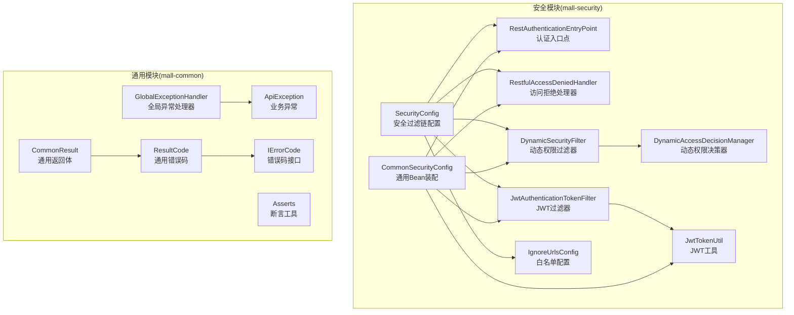
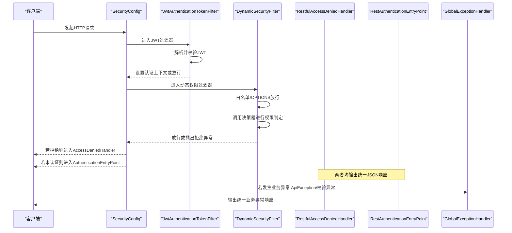
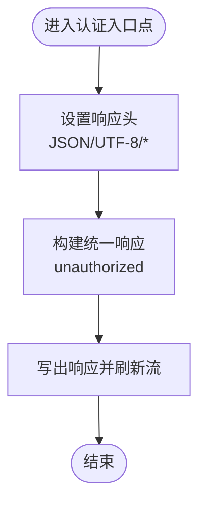
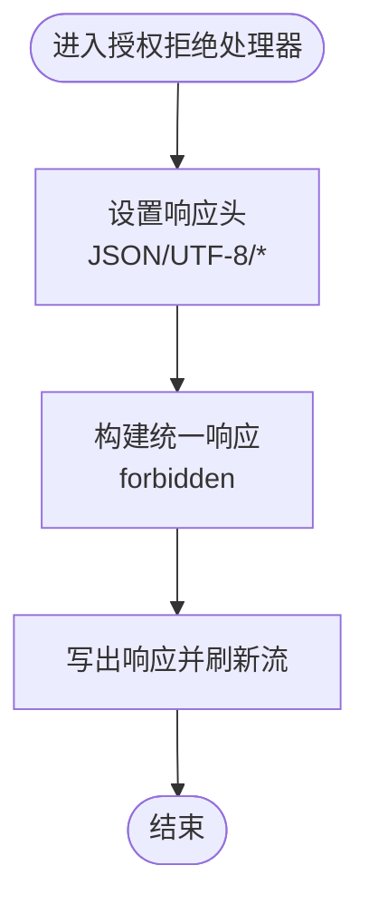
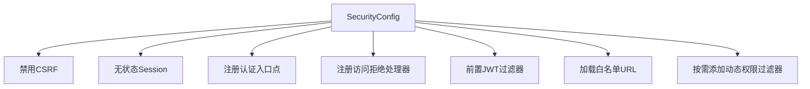
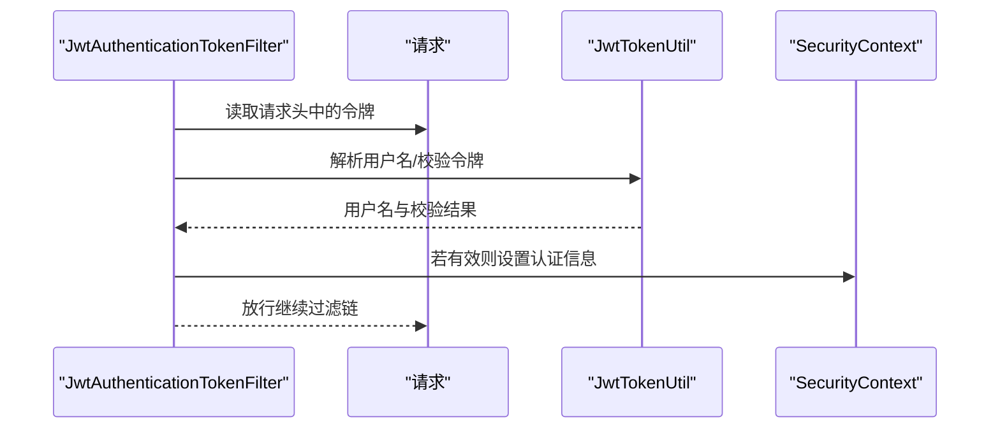
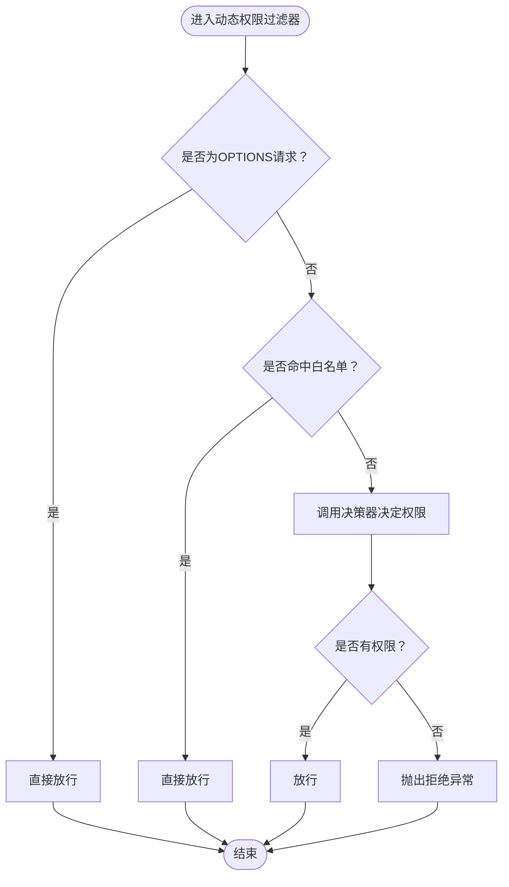
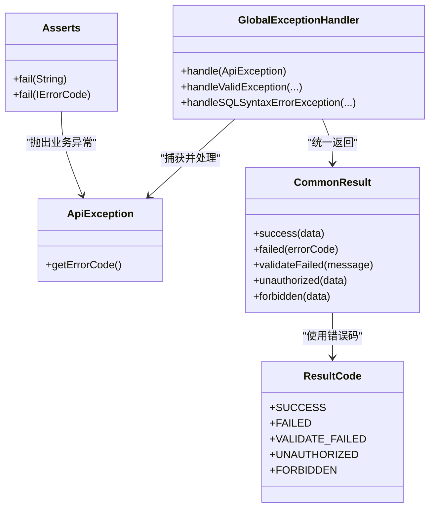
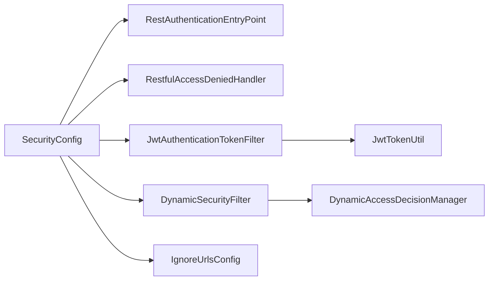

# 安全异常处理

<cite>
**本文引用的文件**
- [mall-security/src/main/java/com/macro/mall/security/component/RestAuthenticationEntryPoint.java](file://mall-security/src/main/java/com/macro/mall/security/component/RestAuthenticationEntryPoint.java)
- [mall-security/src/main/java/com/macro/mall/security/component/RestfulAccessDeniedHandler.java](file://mall-security/src/main/java/com/macro/mall/security/component/RestfulAccessDeniedHandler.java)
- [mall-security/src/main/java/com/macro/mall/security/config/SecurityConfig.java](file://mall-security/src/main/java/com/macro/mall/security/config/SecurityConfig.java)
- [mall-security/src/main/java/com/macro/mall/security/config/CommonSecurityConfig.java](file://mall-security/src/main/java/com/macro/mall/security/config/CommonSecurityConfig.java)
- [mall-security/src/main/java/com/macro/mall/security/config/IgnoreUrlsConfig.java](file://mall-security/src/main/java/com/macro/mall/security/config/IgnoreUrlsConfig.java)
- [mall-security/src/main/java/com/macro/mall/security/component/JwtAuthenticationTokenFilter.java](file://mall-security/src/main/java/com/macro/mall/security/component/JwtAuthenticationTokenFilter.java)
- [mall-security/src/main/java/com/macro/mall/security/util/JwtTokenUtil.java](file://mall-security/src/main/java/com/macro/mall/security/util/JwtTokenUtil.java)
- [mall-security/src/main/java/com/macro/mall/security/component/DynamicSecurityFilter.java](file://mall-security/src/main/java/com/macro/mall/security/component/DynamicSecurityFilter.java)
- [mall-security/src/main/java/com/macro/mall/security/component/DynamicAccessDecisionManager.java](file://mall-security/src/main/java/com/macro/mall/security/component/DynamicAccessDecisionManager.java)
- [mall-common/src/main/java/com/macro/mall/common/exception/GlobalExceptionHandler.java](file://mall-common/src/main/java/com/macro/mall/common/exception/GlobalExceptionHandler.java)
- [mall-common/src/main/java/com/macro/mall/common/exception/ApiException.java](file://mall-common/src/main/java/com/macro/mall/common/exception/ApiException.java)
- [mall-common/src/main/java/com/macro/mall/common/exception/Asserts.java](file://mall-common/src/main/java/com/macro/mall/common/exception/Asserts.java)
- [mall-common/src/main/java/com/macro/mall/common/api/CommonResult.java](file://mall-common/src/main/java/com/macro/mall/common/api/CommonResult.java)
- [mall-common/src/main/java/com/macro/mall/common/api/IErrorCode.java](file://mall-common/src/main/java/com/macro/mall/common/api/IErrorCode.java)
- [mall-common/src/main/java/com/macro/mall/common/api/ResultCode.java](file://mall-common/src/main/java/com/macro/mall/common/api/ResultCode.java)
</cite>

## 目录
1. [引言](#引言)
2. [项目结构](#项目结构)
3. [核心组件](#核心组件)
4. [架构总览](#架构总览)
5. [详细组件分析](#详细组件分析)
6. [依赖分析](#依赖分析)
7. [性能考虑](#性能考虑)
8. [故障排查指南](#故障排查指南)
9. [结论](#结论)
10. [附录](#附录)

## 引言
本技术文档聚焦于系统中“安全异常处理”的统一机制，涵盖认证异常与授权异常的处理策略，以及与全局异常处理器的协同。重点解析以下内容：
- 认证入口点 RestAuthenticationEntryPoint 的实现原理与触发场景
- 授权拒绝处理器 RestfulAccessDeniedHandler 的实现原理与触发场景
- 不同安全异常类型的处理方式：未登录访问、权限不足、令牌过期、令牌无效等
- 与全局异常处理器 GlobalExceptionHandler 的统一处理联动
- 定制化方案：自定义错误响应、国际化支持、日志记录等

## 项目结构
安全相关能力主要分布在 mall-security 模块与 mall-common 模块：
- mall-security：包含安全入口点、访问拒绝处理器、JWT过滤器、动态权限过滤器与决策器、安全配置等
- mall-common：包含全局异常处理器、通用返回体与错误码定义

图表来源
- [mall-security/src/main/java/com/macro/mall/security/config/SecurityConfig.java:38-67](file://mall-security/src/main/java/com/macro/mall/security/config/SecurityConfig.java#L38-L67)
- [mall-security/src/main/java/com/macro/mall/security/config/CommonSecurityConfig.java:16-66](file://mall-security/src/main/java/com/macro/mall/security/config/CommonSecurityConfig.java#L16-L66)
- [mall-security/src/main/java/com/macro/mall/security/component/RestAuthenticationEntryPoint.java:18-28](file://mall-security/src/main/java/com/macro/mall/security/component/RestAuthenticationEntryPoint.java#L18-L28)
- [mall-security/src/main/java/com/macro/mall/security/component/RestfulAccessDeniedHandler.java:18-30](file://mall-security/src/main/java/com/macro/mall/security/component/RestfulAccessDeniedHandler.java#L18-L30)
- [mall-security/src/main/java/com/macro/mall/security/component/JwtAuthenticationTokenFilter.java:25-57](file://mall-security/src/main/java/com/macro/mall/security/component/JwtAuthenticationTokenFilter.java#L25-L57)
- [mall-security/src/main/java/com/macro/mall/security/component/DynamicSecurityFilter.java:21-77](file://mall-security/src/main/java/com/macro/mall/security/component/DynamicSecurityFilter.java#L21-L77)
- [mall-security/src/main/java/com/macro/mall/security/component/DynamicAccessDecisionManager.java:18-51](file://mall-security/src/main/java/com/macro/mall/security/component/DynamicAccessDecisionManager.java#L18-L51)
- [mall-security/src/main/java/com/macro/mall/security/util/JwtTokenUtil.java:31-181](file://mall-security/src/main/java/com/macro/mall/security/util/JwtTokenUtil.java#L31-L181)
- [mall-security/src/main/java/com/macro/mall/security/config/IgnoreUrlsConfig.java:14-21](file://mall-security/src/main/java/com/macro/mall/security/config/IgnoreUrlsConfig.java#L14-L21)
- [mall-common/src/main/java/com/macro/mall/common/exception/GlobalExceptionHandler.java:19-68](file://mall-common/src/main/java/com/macro/mall/common/exception/GlobalExceptionHandler.java#L19-L68)
- [mall-common/src/main/java/com/macro/mall/common/api/CommonResult.java:7-134](file://mall-common/src/main/java/com/macro/mall/common/api/CommonResult.java#L7-L134)
- [mall-common/src/main/java/com/macro/mall/common/api/ResultCode.java:7-28](file://mall-common/src/main/java/com/macro/mall/common/api/ResultCode.java#L7-L28)
- [mall-common/src/main/java/com/macro/mall/common/api/IErrorCode.java:7-17](file://mall-common/src/main/java/com/macro/mall/common/api/IErrorCode.java#L7-L17)
- [mall-common/src/main/java/com/macro/mall/common/exception/ApiException.java:9-32](file://mall-common/src/main/java/com/macro/mall/common/exception/ApiException.java#L9-L32)
- [mall-common/src/main/java/com/macro/mall/common/exception/Asserts.java:9-17](file://mall-common/src/main/java/com/macro/mall/common/exception/Asserts.java#L9-L17)

章节来源
- [mall-security/src/main/java/com/macro/mall/security/config/SecurityConfig.java:38-67](file://mall-security/src/main/java/com/macro/mall/security/config/SecurityConfig.java#L38-L67)
- [mall-security/src/main/java/com/macro/mall/security/config/CommonSecurityConfig.java:16-66](file://mall-security/src/main/java/com/macro/mall/security/config/CommonSecurityConfig.java#L16-L66)

## 核心组件
- 认证入口点 RestAuthenticationEntryPoint：用于处理未登录或令牌无效/过期等认证失败场景，统一输出 JSON 响应
- 授权拒绝处理器 RestfulAccessDeniedHandler：用于处理已登录但权限不足的访问拒绝场景，统一输出 JSON 响应
- 安全过滤链 SecurityConfig：装配认证入口点、访问拒绝处理器、JWT 过滤器、动态权限过滤器等
- 全局异常处理器 GlobalExceptionHandler：统一捕获业务异常 ApiException 及参数校验异常，形成一致的响应格式
- 通用返回体与错误码：CommonResult 与 ResultCode 统一了响应结构与状态码语义

章节来源
- [mall-security/src/main/java/com/macro/mall/security/component/RestAuthenticationEntryPoint.java:18-28](file://mall-security/src/main/java/com/macro/mall/security/component/RestAuthenticationEntryPoint.java#L18-L28)
- [mall-security/src/main/java/com/macro/mall/security/component/RestfulAccessDeniedHandler.java:18-30](file://mall-security/src/main/java/com/macro/mall/security/component/RestfulAccessDeniedHandler.java#L18-L30)
- [mall-security/src/main/java/com/macro/mall/security/config/SecurityConfig.java:38-67](file://mall-security/src/main/java/com/macro/mall/security/config/SecurityConfig.java#L38-L67)
- [mall-common/src/main/java/com/macro/mall/common/exception/GlobalExceptionHandler.java:19-68](file://mall-common/src/main/java/com/macro/mall/common/exception/GlobalExceptionHandler.java#L19-L68)
- [mall-common/src/main/java/com/macro/mall/common/api/CommonResult.java:7-134](file://mall-common/src/main/java/com/macro/mall/common/api/CommonResult.java#L7-L134)
- [mall-common/src/main/java/com/macro/mall/common/api/ResultCode.java:7-28](file://mall-common/src/main/java/com/macro/mall/common/api/ResultCode.java#L7-L28)

## 架构总览
下图展示了安全异常处理在请求生命周期中的关键节点与组件交互：

图表来源
- [mall-security/src/main/java/com/macro/mall/security/config/SecurityConfig.java:38-67](file://mall-security/src/main/java/com/macro/mall/security/config/SecurityConfig.java#L38-L67)
- [mall-security/src/main/java/com/macro/mall/security/component/JwtAuthenticationTokenFilter.java:36-56](file://mall-security/src/main/java/com/macro/mall/security/component/JwtAuthenticationTokenFilter.java#L36-L56)
- [mall-security/src/main/java/com/macro/mall/security/component/DynamicSecurityFilter.java:33-61](file://mall-security/src/main/java/com/macro/mall/security/component/DynamicSecurityFilter.java#L33-L61)
- [mall-security/src/main/java/com/macro/mall/security/component/RestfulAccessDeniedHandler.java:18-30](file://mall-security/src/main/java/com/macro/mall/security/component/RestfulAccessDeniedHandler.java#L18-L30)
- [mall-security/src/main/java/com/macro/mall/security/component/RestAuthenticationEntryPoint.java:18-28](file://mall-security/src/main/java/com/macro/mall/security/component/RestAuthenticationEntryPoint.java#L18-L28)
- [mall-common/src/main/java/com/macro/mall/common/exception/GlobalExceptionHandler.java:19-68](file://mall-common/src/main/java/com/macro/mall/common/exception/GlobalExceptionHandler.java#L19-L68)

## 详细组件分析

### 认证入口点 RestAuthenticationEntryPoint
- 触发场景：未登录访问、携带无效/过期令牌访问受保护资源
- 处理逻辑：设置响应头为 JSON，编码为 UTF-8；通过 CommonResult.unauthorized 输出统一响应体
- 关键点：与 Spring Security 的 AuthenticationEntryPoint 接口对接，在认证失败时回调

图表来源
- [mall-security/src/main/java/com/macro/mall/security/component/RestAuthenticationEntryPoint.java:18-28](file://mall-security/src/main/java/com/macro/mall/security/component/RestAuthenticationEntryPoint.java#L18-L28)
- [mall-common/src/main/java/com/macro/mall/common/api/CommonResult.java:99-101](file://mall-common/src/main/java/com/macro/mall/common/api/CommonResult.java#L99-L101)
- [mall-common/src/main/java/com/macro/mall/common/api/ResultCode.java:11-12](file://mall-common/src/main/java/com/macro/mall/common/api/ResultCode.java#L11-L12)

章节来源
- [mall-security/src/main/java/com/macro/mall/security/component/RestAuthenticationEntryPoint.java:18-28](file://mall-security/src/main/java/com/macro/mall/security/component/RestAuthenticationEntryPoint.java#L18-L28)
- [mall-common/src/main/java/com/macro/mall/common/api/CommonResult.java:99-101](file://mall-common/src/main/java/com/macro/mall/common/api/CommonResult.java#L99-L101)
- [mall-common/src/main/java/com/macro/mall/common/api/ResultCode.java:11-12](file://mall-common/src/main/java/com/macro/mall/common/api/ResultCode.java#L11-L12)

### 授权拒绝处理器 RestfulAccessDeniedHandler
- 触发场景：已登录但无相应权限访问资源
- 处理逻辑：设置响应头为 JSON，编码为 UTF-8；通过 CommonResult.forbidden 输出统一响应体
- 关键点：与 Spring Security 的 AccessDeniedHandler 接口对接，在权限不足时回调

图表来源
- [mall-security/src/main/java/com/macro/mall/security/component/RestfulAccessDeniedHandler.java:18-30](file://mall-security/src/main/java/com/macro/mall/security/component/RestfulAccessDeniedHandler.java#L18-L30)
- [mall-common/src/main/java/com/macro/mall/common/api/CommonResult.java:106-108](file://mall-common/src/main/java/com/macro/mall/common/api/CommonResult.java#L106-L108)
- [mall-common/src/main/java/com/macro/mall/common/api/ResultCode.java:11-12](file://mall-common/src/main/java/com/macro/mall/common/api/ResultCode.java#L11-L12)

章节来源
- [mall-security/src/main/java/com/macro/mall/security/component/RestfulAccessDeniedHandler.java:18-30](file://mall-security/src/main/java/com/macro/mall/security/component/RestfulAccessDeniedHandler.java#L18-L30)
- [mall-common/src/main/java/com/macro/mall/common/api/CommonResult.java:106-108](file://mall-common/src/main/java/com/macro/mall/common/api/CommonResult.java#L106-L108)
- [mall-common/src/main/java/com/macro/mall/common/api/ResultCode.java:11-12](file://mall-common/src/main/java/com/macro/mall/common/api/ResultCode.java#L11-L12)

### 安全过滤链与白名单
- SecurityConfig 负责装配：
  - 关闭 CSRF，禁用 Session（无状态）
  - 注册认证入口点与访问拒绝处理器
  - 在用户名密码过滤器之前加入 JWT 过滤器
  - 加载白名单资源路径，允许放行
  - 添加动态权限过滤器（按需）
- IgnoreUrlsConfig 提供白名单配置项，支持 Ant 风格路径匹配

图表来源
- [mall-security/src/main/java/com/macro/mall/security/config/SecurityConfig.java:38-67](file://mall-security/src/main/java/com/macro/mall/security/config/SecurityConfig.java#L38-L67)
- [mall-security/src/main/java/com/macro/mall/security/config/IgnoreUrlsConfig.java:14-21](file://mall-security/src/main/java/com/macro/mall/security/config/IgnoreUrlsConfig.java#L14-L21)

章节来源
- [mall-security/src/main/java/com/macro/mall/security/config/SecurityConfig.java:38-67](file://mall-security/src/main/java/com/macro/mall/security/config/SecurityConfig.java#L38-L67)
- [mall-security/src/main/java/com/macro/mall/security/config/IgnoreUrlsConfig.java:14-21](file://mall-security/src/main/java/com/macro/mall/security/config/IgnoreUrlsConfig.java#L14-L21)

### JWT 登录授权过滤器
- 作用：从请求头提取 JWT，解析用户名，校验令牌有效性，必要时在 SecurityContext 中设置认证信息
- 关键点：仅在用户名存在且上下文尚未认证时执行；与 JwtTokenUtil 协作完成解析与校验

图表来源
- [mall-security/src/main/java/com/macro/mall/security/component/JwtAuthenticationTokenFilter.java:36-56](file://mall-security/src/main/java/com/macro/mall/security/component/JwtAuthenticationTokenFilter.java#L36-L56)
- [mall-security/src/main/java/com/macro/mall/security/util/JwtTokenUtil.java:87-107](file://mall-security/src/main/java/com/macro/mall/security/util/JwtTokenUtil.java#L87-L107)

章节来源
- [mall-security/src/main/java/com/macro/mall/security/component/JwtAuthenticationTokenFilter.java:25-57](file://mall-security/src/main/java/com/macro/mall/security/component/JwtAuthenticationTokenFilter.java#L25-L57)
- [mall-security/src/main/java/com/macro/mall/security/util/JwtTokenUtil.java:87-107](file://mall-security/src/main/java/com/macro/mall/security/util/JwtTokenUtil.java#L87-L107)

### 动态权限过滤器与决策器
- DynamicSecurityFilter：在请求进入时判断是否为 OPTIONS 或命中白名单，否则调用父类拦截器进行鉴权
- DynamicAccessDecisionManager：遍历所需权限与用户权限集合，若无匹配则抛出拒绝异常

图表来源
- [mall-security/src/main/java/com/macro/mall/security/component/DynamicSecurityFilter.java:33-61](file://mall-security/src/main/java/com/macro/mall/security/component/DynamicSecurityFilter.java#L33-L61)
- [mall-security/src/main/java/com/macro/mall/security/component/DynamicAccessDecisionManager.java:20-39](file://mall-security/src/main/java/com/macro/mall/security/component/DynamicAccessDecisionManager.java#L20-L39)

章节来源
- [mall-security/src/main/java/com/macro/mall/security/component/DynamicSecurityFilter.java:21-77](file://mall-security/src/main/java/com/macro/mall/security/component/DynamicSecurityFilter.java#L21-L77)
- [mall-security/src/main/java/com/macro/mall/security/component/DynamicAccessDecisionManager.java:18-51](file://mall-security/src/main/java/com/macro/mall/security/component/DynamicAccessDecisionManager.java#L18-L51)

### 全局异常处理器与业务异常
- GlobalExceptionHandler：统一处理 ApiException、参数校验异常、SQL 语法异常等，返回 CommonResult 格式
- ApiException/Asserts：业务断言与异常抛出工具，便于在各层快速抛出带错误码的业务异常

图表来源
- [mall-common/src/main/java/com/macro/mall/common/exception/GlobalExceptionHandler.java:19-68](file://mall-common/src/main/java/com/macro/mall/common/exception/GlobalExceptionHandler.java#L19-L68)
- [mall-common/src/main/java/com/macro/mall/common/exception/ApiException.java:9-32](file://mall-common/src/main/java/com/macro/mall/common/exception/ApiException.java#L9-L32)
- [mall-common/src/main/java/com/macro/mall/common/exception/Asserts.java:9-17](file://mall-common/src/main/java/com/macro/mall/common/exception/Asserts.java#L9-L17)
- [mall-common/src/main/java/com/macro/mall/common/api/CommonResult.java:7-134](file://mall-common/src/main/java/com/macro/mall/common/api/CommonResult.java#L7-L134)
- [mall-common/src/main/java/com/macro/mall/common/api/ResultCode.java:7-28](file://mall-common/src/main/java/com/macro/mall/common/api/ResultCode.java#L7-L28)

章节来源
- [mall-common/src/main/java/com/macro/mall/common/exception/GlobalExceptionHandler.java:19-68](file://mall-common/src/main/java/com/macro/mall/common/exception/GlobalExceptionHandler.java#L19-L68)
- [mall-common/src/main/java/com/macro/mall/common/exception/ApiException.java:9-32](file://mall-common/src/main/java/com/macro/mall/common/exception/ApiException.java#L9-L32)
- [mall-common/src/main/java/com/macro/mall/common/exception/Asserts.java:9-17](file://mall-common/src/main/java/com/macro/mall/common/exception/Asserts.java#L9-L17)
- [mall-common/src/main/java/com/macro/mall/common/api/CommonResult.java:7-134](file://mall-common/src/main/java/com/macro/mall/common/api/CommonResult.java#L7-L134)
- [mall-common/src/main/java/com/macro/mall/common/api/ResultCode.java:7-28](file://mall-common/src/main/java/com/macro/mall/common/api/ResultCode.java#L7-L28)

## 依赖分析
- 组件耦合
  - SecurityConfig 依赖 RestAuthenticationEntryPoint、RestfulAccessDeniedHandler、JwtAuthenticationTokenFilter、IgnoreUrlsConfig、DynamicSecurityFilter（可选）
  - JwtAuthenticationTokenFilter 依赖 JwtTokenUtil 与 UserDetailsService
  - DynamicSecurityFilter 依赖 DynamicAccessDecisionManager 与 IgnoreUrlsConfig
- 外部依赖
  - Spring Security 异常处理接口（AuthenticationEntryPoint、AccessDeniedHandler）
  - Hutool JSON 工具用于序列化统一响应
- 循环依赖风险
  - 各组件以装配 Bean 方式解耦，未见循环依赖迹象

图表来源
- [mall-security/src/main/java/com/macro/mall/security/config/SecurityConfig.java:25-36](file://mall-security/src/main/java/com/macro/mall/security/config/SecurityConfig.java#L25-L36)
- [mall-security/src/main/java/com/macro/mall/security/component/JwtAuthenticationTokenFilter.java:27-34](file://mall-security/src/main/java/com/macro/mall/security/component/JwtAuthenticationTokenFilter.java#L27-L34)
- [mall-security/src/main/java/com/macro/mall/security/component/DynamicSecurityFilter.java:23-26](file://mall-security/src/main/java/com/macro/mall/security/component/DynamicSecurityFilter.java#L23-L26)

章节来源
- [mall-security/src/main/java/com/macro/mall/security/config/SecurityConfig.java:25-36](file://mall-security/src/main/java/com/macro/mall/security/config/SecurityConfig.java#L25-L36)
- [mall-security/src/main/java/com/macro/mall/security/component/JwtAuthenticationTokenFilter.java:27-34](file://mall-security/src/main/java/com/macro/mall/security/component/JwtAuthenticationTokenFilter.java#L27-L34)
- [mall-security/src/main/java/com/macro/mall/security/component/DynamicSecurityFilter.java:23-26](file://mall-security/src/main/java/com/macro/mall/security/component/DynamicSecurityFilter.java#L23-L26)

## 性能考虑
- 无状态设计：禁用 Session 并采用 JWT，降低服务器端状态存储开销
- 过滤器链短路：白名单与 OPTIONS 请求直接放行，减少不必要的鉴权计算
- 动态权限按需启用：仅在存在动态权限服务时装配动态过滤器，避免额外开销
- 日志记录：JWT 过滤器与 JWT 工具包含日志输出，便于定位问题但需控制日志级别

## 故障排查指南
- 未登录或令牌过期
  - 现象：返回统一 401 响应
  - 排查：确认请求头是否包含正确的令牌前缀；检查令牌是否过期；查看认证入口点响应
- 权限不足
  - 现象：返回统一 403 响应
  - 排查：确认用户角色/权限集合；核对动态权限配置；检查决策器判定逻辑
- 业务异常
  - 现象：由全局异常处理器统一捕获并返回
  - 排查：确认 ApiException 抛出位置与错误码；检查参数校验异常映射
- 日志与国际化
  - 日志：可在相应组件增加更详细的日志记录（如令牌解析失败、权限判定失败）
  - 国际化：当前错误消息来自 ResultCode 枚举，建议在前端或网关层进行多语言映射

章节来源
- [mall-security/src/main/java/com/macro/mall/security/component/RestAuthenticationEntryPoint.java:18-28](file://mall-security/src/main/java/com/macro/mall/security/component/RestAuthenticationEntryPoint.java#L18-L28)
- [mall-security/src/main/java/com/macro/mall/security/component/RestfulAccessDeniedHandler.java:18-30](file://mall-security/src/main/java/com/macro/mall/security/component/RestfulAccessDeniedHandler.java#L18-L30)
- [mall-common/src/main/java/com/macro/mall/common/exception/GlobalExceptionHandler.java:19-68](file://mall-common/src/main/java/com/macro/mall/common/exception/GlobalExceptionHandler.java#L19-L68)
- [mall-common/src/main/java/com/macro/mall/common/api/ResultCode.java:7-28](file://mall-common/src/main/java/com/macro/mall/common/api/ResultCode.java#L7-L28)

## 结论
该安全异常处理机制通过“认证入口点 + 授权拒绝处理器 + 全局异常处理器”的组合，实现了对未登录、权限不足、令牌异常以及业务异常的统一响应。配合无状态 JWT 与动态权限过滤器，既保证了安全性，又兼顾了性能与扩展性。后续可在国际化与日志方面进一步增强。

## 附录
- 统一响应字段
  - code：状态码（参考 ResultCode）
  - message：提示信息
  - data：数据体（通常为 null 或具体对象）
- 常见状态码
  - 401：未登录或令牌过期
  - 403：无权限访问
  - 404：参数校验失败
  - 500：操作失败

章节来源
- [mall-common/src/main/java/com/macro/mall/common/api/CommonResult.java:7-134](file://mall-common/src/main/java/com/macro/mall/common/api/CommonResult.java#L7-L134)
- [mall-common/src/main/java/com/macro/mall/common/api/ResultCode.java:7-28](file://mall-common/src/main/java/com/macro/mall/common/api/ResultCode.java#L7-L28)