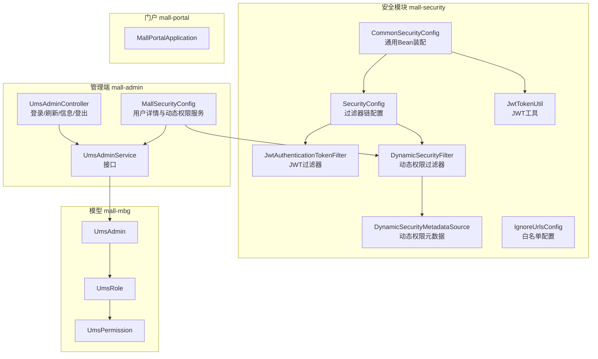
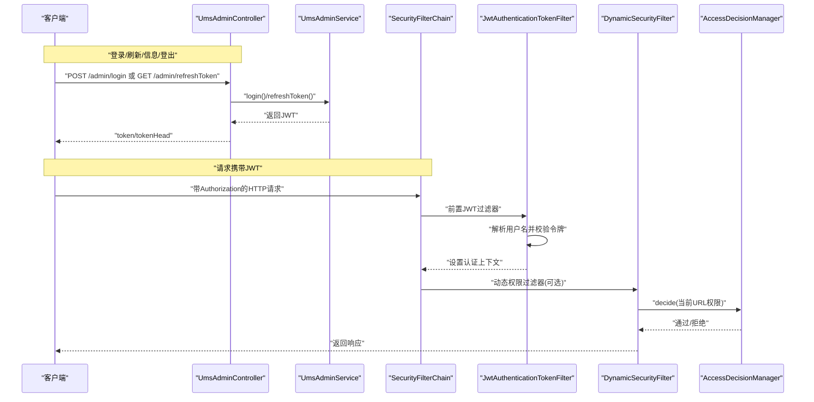
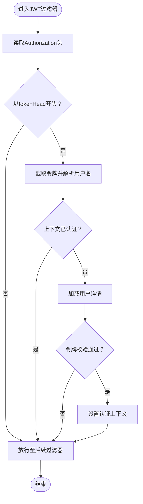
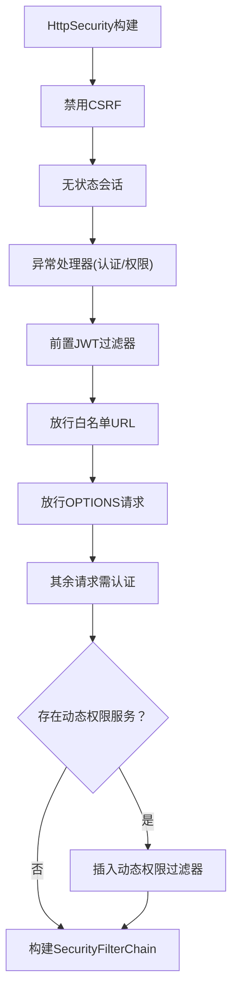
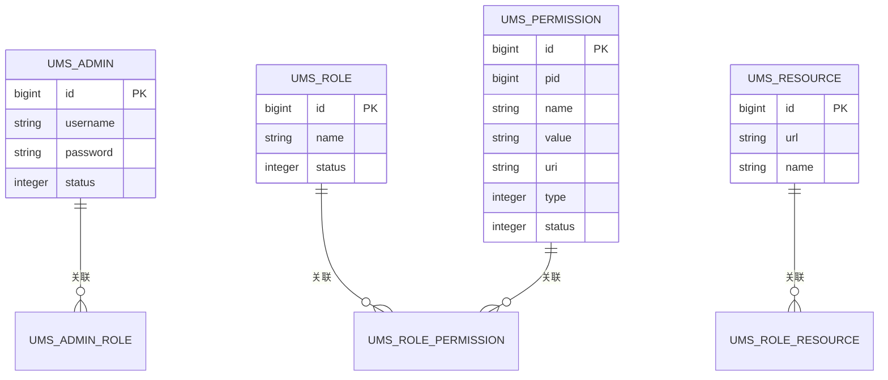
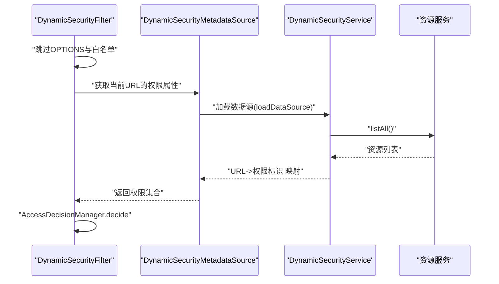
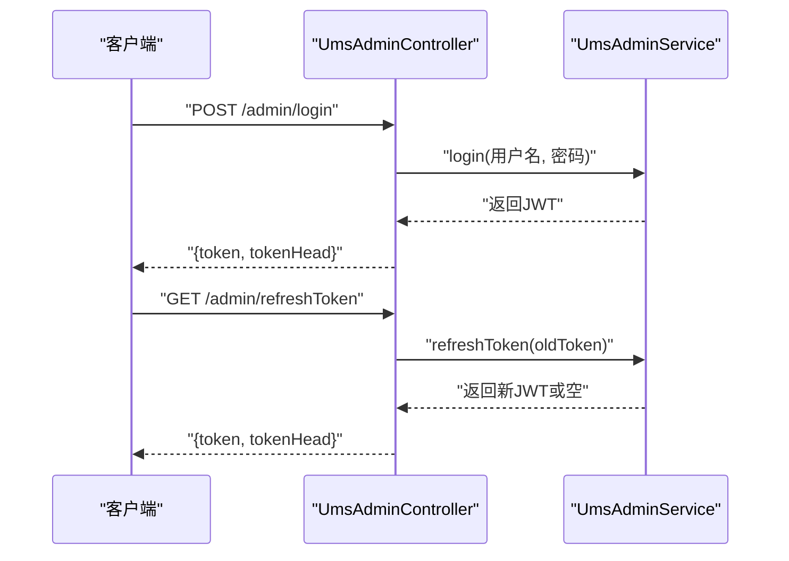
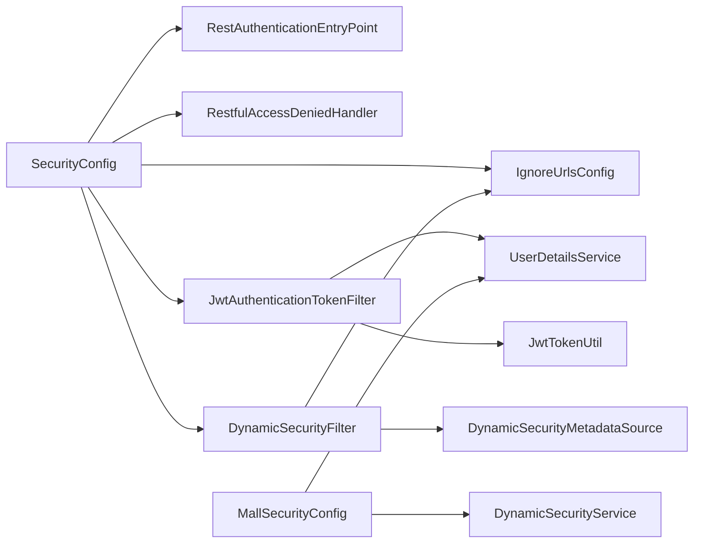

# 安全认证系统

<cite>
**本文引用的文件**
- [SecurityConfig.java](file://mall-security/src/main/java/com/macro/mall/security/config/SecurityConfig.java)
- [CommonSecurityConfig.java](file://mall-security/src/main/java/com/macro/mall/security/config/CommonSecurityConfig.java)
- [IgnoreUrlsConfig.java](file://mall-security/src/main/java/com/macro/mall/security/config/IgnoreUrlsConfig.java)
- [JwtTokenUtil.java](file://mall-security/src/main/java/com/macro/mall/security/util/JwtTokenUtil.java)
- [JwtAuthenticationTokenFilter.java](file://mall-security/src/main/java/com/macro/mall/security/component/JwtAuthenticationTokenFilter.java)
- [DynamicSecurityFilter.java](file://mall-security/src/main/java/com/macro/mall/security/component/DynamicSecurityFilter.java)
- [DynamicSecurityMetadataSource.java](file://mall-security/src/main/java/com/macro/mall/security/component/DynamicSecurityMetadataSource.java)
- [MallSecurityConfig.java](file://mall-admin/src/main/java/com/macro/mall/config/MallSecurityConfig.java)
- [UmsAdminController.java](file://mall-admin/src/main/java/com/macro/mall/controller/UmsAdminController.java)
- [UmsAdminService.java](file://mall-admin/src/main/java/com/macro/mall/service/UmsAdminService.java)
- [UmsAdmin.java](file://mall-mbg/src/main/java/com/macro/mall/model/UmsAdmin.java)
- [UmsRole.java](file://mall-mbg/src/main/java/com/macro/mall/model/UmsRole.java)
- [UmsPermission.java](file://mall-mbg/src/main/java/com/macro/mall/model/UmsPermission.java)
- [MallAdminApplication.java](file://mall-admin/src/main/java/com/macro/mall/MallAdminApplication.java)
- [MallPortalApplication.java](file://mall-portal/src/main/java/com/macro/mall/portal/MallPortalApplication.java)
</cite>

## 目录
1. [简介](#简介)
2. [项目结构](#项目结构)
3. [核心组件](#核心组件)
4. [架构总览](#架构总览)
5. [详细组件分析](#详细组件分析)
6. [依赖分析](#依赖分析)
7. [性能考虑](#性能考虑)
8. [故障排查指南](#故障排查指南)
9. [结论](#结论)
10. [附录](#附录)

## 简介
本文件面向Mall项目的“安全认证系统”，围绕以下目标展开：
- 基于JWT的认证机制：令牌生成、验证、刷新与登出流程
- Spring Security安全配置：权限控制、拦截规则、过滤器链设计
- RBAC权限模型：用户、角色、权限、资源的关联关系与实现
- 动态权限控制：基于注解的权限验证与基于URL的访问控制
- 安全最佳实践与常见问题防护

## 项目结构
Mall采用多模块架构，安全相关能力主要集中在mall-security模块，并由mall-admin与mall-portal模块消费；RBAC模型的数据结构位于mall-mbg模块。

图表来源
- [SecurityConfig.java:38-67](file://mall-security/src/main/java/com/macro/mall/security/config/SecurityConfig.java#L38-L67)
- [CommonSecurityConfig.java:16-66](file://mall-security/src/main/java/com/macro/mall/security/config/CommonSecurityConfig.java#L16-L66)
- [JwtAuthenticationTokenFilter.java:25-57](file://mall-security/src/main/java/com/macro/mall/security/component/JwtAuthenticationTokenFilter.java#L25-L57)
- [DynamicSecurityFilter.java:21-77](file://mall-security/src/main/java/com/macro/mall/security/component/DynamicSecurityFilter.java#L21-L77)
- [DynamicSecurityMetadataSource.java:18-64](file://mall-security/src/main/java/com/macro/mall/security/component/DynamicSecurityMetadataSource.java#L18-L64)
- [MallSecurityConfig.java:22-49](file://mall-admin/src/main/java/com/macro/mall/config/MallSecurityConfig.java#L22-L49)
- [UmsAdminController.java:31-192](file://mall-admin/src/main/java/com/macro/mall/controller/UmsAdminController.java#L31-L192)
- [UmsAdmin.java:6-129](file://mall-mbg/src/main/java/com/macro/mall/model/UmsAdmin.java#L6-L129)
- [UmsRole.java:6-96](file://mall-mbg/src/main/java/com/macro/mall/model/UmsRole.java#L6-L96)
- [UmsPermission.java:6-129](file://mall-mbg/src/main/java/com/macro/mall/model/UmsPermission.java#L6-L129)

章节来源
- [MallAdminApplication.java:10-15](file://mall-admin/src/main/java/com/macro/mall/MallAdminApplication.java#L10-L15)
- [MallPortalApplication.java:6-13](file://mall-portal/src/main/java/com/macro/mall/portal/MallPortalApplication.java#L6-L13)

## 核心组件
- 过滤器链与安全配置
  - SecurityConfig：禁用CSRF、无状态会话、异常处理器、JWT过滤器前置、白名单与OPTIONS放行、动态权限过滤器按需加入
  - CommonSecurityConfig：装配密码编码器、忽略URL配置、JWT工具、认证/授权异常处理器、JWT过滤器、动态权限相关Bean
  - IgnoreUrlsConfig：白名单URL配置（前缀secure.ignored.urls）
- 认证与令牌
  - JwtAuthenticationTokenFilter：从请求头读取令牌，解析用户名，加载用户详情并构建认证对象
  - JwtTokenUtil：生成、解析、校验、刷新令牌，含过期判断与“刚刷新”窗口控制
- 动态权限
  - DynamicSecurityFilter：动态权限过滤器，处理OPTIONS与白名单后调用决策管理器
  - DynamicSecurityMetadataSource：按Ant风格匹配URL，返回资源对应的权限属性
  - MallSecurityConfig.dynamicSecurityService：从资源表加载“URL->权限标识”的映射
- 控制器与服务
  - UmsAdminController：登录、刷新、获取用户信息、登出等接口
  - UmsAdminService：登录、刷新、注销、角色与资源查询等业务接口

章节来源
- [SecurityConfig.java:38-67](file://mall-security/src/main/java/com/macro/mall/security/config/SecurityConfig.java#L38-L67)
- [CommonSecurityConfig.java:16-66](file://mall-security/src/main/java/com/macro/mall/security/config/CommonSecurityConfig.java#L16-L66)
- [IgnoreUrlsConfig.java:14-21](file://mall-security/src/main/java/com/macro/mall/security/config/IgnoreUrlsConfig.java#L14-L21)
- [JwtAuthenticationTokenUtil.java:28-171](file://mall-security/src/main/java/com/macro/mall/security/util/JwtTokenUtil.java#L28-L171)
- [JwtAuthenticationTokenFilter.java:25-57](file://mall-security/src/main/java/com/macro/mall/security/component/JwtAuthenticationTokenFilter.java#L25-L57)
- [DynamicSecurityFilter.java:21-77](file://mall-security/src/main/java/com/macro/mall/security/component/DynamicSecurityFilter.java#L21-L77)
- [DynamicSecurityMetadataSource.java:18-64](file://mall-security/src/main/java/com/macro/mall/security/component/DynamicSecurityMetadataSource.java#L18-L64)
- [MallSecurityConfig.java:22-49](file://mall-admin/src/main/java/com/macro/mall/config/MallSecurityConfig.java#L22-L49)
- [UmsAdminController.java:31-192](file://mall-admin/src/main/java/com/macro/mall/controller/UmsAdminController.java#L31-L192)
- [UmsAdminService.java:17-99](file://mall-admin/src/main/java/com/macro/mall/service/UmsAdminService.java#L17-L99)

## 架构总览
下图展示从客户端到服务端的认证与授权流程，以及动态权限决策过程。

图表来源
- [UmsAdminController.java:54-79](file://mall-admin/src/main/java/com/macro/mall/controller/UmsAdminController.java#L54-L79)
- [UmsAdminService.java:34-40](file://mall-admin/src/main/java/com/macro/mall/service/UmsAdminService.java#L34-L40)
- [SecurityConfig.java:38-67](file://mall-security/src/main/java/com/macro/mall/security/config/SecurityConfig.java#L38-L67)
- [JwtAuthenticationTokenFilter.java:36-56](file://mall-security/src/main/java/com/macro/mall/security/component/JwtAuthenticationTokenFilter.java#L36-L56)
- [DynamicSecurityFilter.java:37-61](file://mall-security/src/main/java/com/macro/mall/security/component/DynamicSecurityFilter.java#L37-L61)

## 详细组件分析

### JWT认证与令牌管理
- 令牌生成
  - 使用HS512签名算法，载荷包含用户名与签发时间，过期时间由配置注入
- 令牌解析与校验
  - 从请求头读取令牌，去除前缀后解析用户名；若上下文未认证则加载用户详情并校验令牌有效性
- 令牌刷新
  - 支持在未过期前提下的刷新；若已过期或刚刷新过则返回原策略或拒绝
- 登出
  - 控制器层提供登出接口，结合全局异常与安全配置实现登出效果

图表来源
- [JwtAuthenticationTokenFilter.java:36-56](file://mall-security/src/main/java/com/macro/mall/security/component/JwtAuthenticationTokenFilter.java#L36-L56)

章节来源
- [JwtTokenUtil.java:28-171](file://mall-security/src/main/java/com/macro/mall/security/util/JwtTokenUtil.java#L28-L171)
- [JwtAuthenticationTokenFilter.java:25-57](file://mall-security/src/main/java/com/macro/mall/security/component/JwtAuthenticationTokenFilter.java#L25-L57)
- [UmsAdminController.java:54-79](file://mall-admin/src/main/java/com/macro/mall/controller/UmsAdminController.java#L54-L79)

### Spring Security安全配置
- 关键点
  - 禁用CSRF，启用无状态会话（STATELESS）
  - 异常处理：认证失败与权限不足分别交由自定义处理器
  - 过滤器链：JWT过滤器前置；白名单URL与OPTIONS请求放行
  - 动态权限：当存在动态权限服务时，插入动态权限过滤器与决策管理器
- 白名单
  - 通过IgnoreUrlsConfig注入，支持Ant风格路径匹配

图表来源
- [SecurityConfig.java:38-67](file://mall-security/src/main/java/com/macro/mall/security/config/SecurityConfig.java#L38-L67)
- [IgnoreUrlsConfig.java:14-21](file://mall-security/src/main/java/com/macro/mall/security/config/IgnoreUrlsConfig.java#L14-L21)

章节来源
- [SecurityConfig.java:38-67](file://mall-security/src/main/java/com/macro/mall/security/config/SecurityConfig.java#L38-L67)
- [CommonSecurityConfig.java:16-66](file://mall-security/src/main/java/com/macro/mall/security/config/CommonSecurityConfig.java#L16-L66)

### RBAC权限模型与实现
- 实体关系
  - UmsAdmin：管理员
  - UmsRole：角色
  - UmsPermission：权限（细粒度操作权限）
  - 资源（URL级）：由资源服务提供，与权限/角色建立关联
- 关联关系
  - 管理员与角色：多对多
  - 角色与权限：多对多
  - 资源与权限：多对一或一对多（视业务而定）

图表来源
- [UmsAdmin.java:6-129](file://mall-mbg/src/main/java/com/macro/mall/model/UmsAdmin.java#L6-L129)
- [UmsRole.java:6-96](file://mall-mbg/src/main/java/com/macro/mall/model/UmsRole.java#L6-L96)
- [UmsPermission.java:6-129](file://mall-mbg/src/main/java/com/macro/mall/model/UmsPermission.java#L6-L129)

章节来源
- [UmsAdmin.java:6-129](file://mall-mbg/src/main/java/com/macro/mall/model/UmsAdmin.java#L6-L129)
- [UmsRole.java:6-96](file://mall-mbg/src/main/java/com/macro/mall/model/UmsRole.java#L6-L96)
- [UmsPermission.java:6-129](file://mall-mbg/src/main/java/com/macro/mall/model/UmsPermission.java#L6-L129)

### 动态权限控制
- URL级动态权限
  - DynamicSecurityFilter：对非OPTIONS与非白名单请求，调用决策管理器进行鉴权
  - DynamicSecurityMetadataSource：加载“URL->权限标识”映射，按Ant匹配返回对应权限集合
  - MallSecurityConfig.dynamicSecurityService：从资源服务加载所有资源，构造映射
- 基于注解的权限验证
  - 通过AccessDecisionManager与ConfigAttribute配合，可扩展为方法级注解（如@PreAuthorize），但当前实现重点在URL级动态权限

图表来源
- [DynamicSecurityFilter.java:37-61](file://mall-security/src/main/java/com/macro/mall/security/component/DynamicSecurityFilter.java#L37-L61)
- [DynamicSecurityMetadataSource.java:24-52](file://mall-security/src/main/java/com/macro/mall/security/component/DynamicSecurityMetadataSource.java#L24-L52)
- [MallSecurityConfig.java:35-48](file://mall-admin/src/main/java/com/macro/mall/config/MallSecurityConfig.java#L35-L48)

章节来源
- [DynamicSecurityFilter.java:21-77](file://mall-security/src/main/java/com/macro/mall/security/component/DynamicSecurityFilter.java#L21-L77)
- [DynamicSecurityMetadataSource.java:18-64](file://mall-security/src/main/java/com/macro/mall/security/component/DynamicSecurityMetadataSource.java#L18-L64)
- [MallSecurityConfig.java:22-49](file://mall-admin/src/main/java/com/macro/mall/config/MallSecurityConfig.java#L22-L49)

### 控制器与服务交互
- 登录/刷新/信息/登出
  - UmsAdminController提供REST接口，调用UmsAdminService完成业务逻辑
  - 登录成功返回JWT与tokenHead；刷新成功返回新令牌；信息接口返回菜单与角色；登出触发注销

图表来源
- [UmsAdminController.java:54-79](file://mall-admin/src/main/java/com/macro/mall/controller/UmsAdminController.java#L54-L79)
- [UmsAdminService.java:34-40](file://mall-admin/src/main/java/com/macro/mall/service/UmsAdminService.java#L34-L40)

章节来源
- [UmsAdminController.java:31-192](file://mall-admin/src/main/java/com/macro/mall/controller/UmsAdminController.java#L31-L192)
- [UmsAdminService.java:17-99](file://mall-admin/src/main/java/com/macro/mall/service/UmsAdminService.java#L17-L99)

## 依赖分析
- 组件耦合
  - SecurityConfig依赖IgnoreUrlsConfig、异常处理器、JWT过滤器、动态权限服务与过滤器
  - JwtAuthenticationTokenFilter依赖UserDetailsService与JwtTokenUtil
  - DynamicSecurityFilter依赖DynamicSecurityMetadataSource与IgnoreUrlsConfig
  - MallSecurityConfig提供UserDetailsService与DynamicSecurityService实现
- 外部依赖
  - Spring Security、BCrypt密码编码器、JWT库、Hutool工具库

图表来源
- [SecurityConfig.java:25-36](file://mall-security/src/main/java/com/macro/mall/security/config/SecurityConfig.java#L25-L36)
- [JwtAuthenticationTokenFilter.java:27-34](file://mall-security/src/main/java/com/macro/mall/security/component/JwtAuthenticationTokenFilter.java#L27-L34)
- [DynamicSecurityFilter.java:23-26](file://mall-security/src/main/java/com/macro/mall/security/component/DynamicSecurityFilter.java#L23-L26)
- [MallSecurityConfig.java:29-48](file://mall-admin/src/main/java/com/macro/mall/config/MallSecurityConfig.java#L29-L48)

章节来源
- [CommonSecurityConfig.java:16-66](file://mall-security/src/main/java/com/macro/mall/security/config/CommonSecurityConfig.java#L16-L66)
- [SecurityConfig.java:25-36](file://mall-security/src/main/java/com/macro/mall/security/config/SecurityConfig.java#L25-L36)

## 性能考虑
- 无状态会话
  - STATELESS策略避免服务器端会话存储，降低内存占用与水平扩展复杂度
- 过滤器链最小化
  - 将JWT过滤器前置，仅在必要时执行动态权限检查，减少不必要的鉴权开销
- 缓存与懒加载
  - 动态权限元数据按需加载与清理，避免启动即全量扫描
- 令牌刷新窗口
  - “刚刷新”窗口控制减少重复签发，降低签名与网络传输成本

## 故障排查指南
- 认证失败
  - 检查Authorization头是否包含正确的tokenHead前缀
  - 核对JWT签名密钥、过期时间与服务器时间一致性
- 权限不足
  - 确认资源URL是否在白名单或动态权限映射中
  - 检查用户角色是否具备相应权限
- 动态权限不生效
  - 确认动态权限服务已装配且DynamicSecurityFilter已加入过滤器链
  - 检查资源服务是否正确返回资源列表
- 登出无效
  - 确认登出接口被调用，结合全局异常与安全配置确保会话失效

章节来源
- [JwtAuthenticationTokenFilter.java:36-56](file://mall-security/src/main/java/com/macro/mall/security/component/JwtAuthenticationTokenFilter.java#L36-L56)
- [DynamicSecurityFilter.java:37-61](file://mall-security/src/main/java/com/macro/mall/security/component/DynamicSecurityFilter.java#L37-L61)
- [UmsAdminController.java:101-106](file://mall-admin/src/main/java/com/macro/mall/controller/UmsAdminController.java#L101-L106)

## 结论
Mall的安全认证系统以Spring Security为核心，结合JWT实现无状态认证，并通过动态权限过滤器实现基于URL的灵活访问控制。RBAC模型清晰，控制器与服务职责明确，具备良好的扩展性与可维护性。建议在生产环境中进一步完善方法级权限注解、令牌黑名单与审计日志等能力，持续提升安全性与可观测性。

## 附录
- 配置要点
  - secure.ignored.urls：白名单URL列表
  - jwt.secret/jwt.expiration/jwt.tokenHead/jwt.tokenHeader：JWT相关配置项
- 最佳实践
  - 使用HTTPS传输
  - 合理设置过期时间与刷新窗口
  - 对敏感接口增加方法级权限校验
  - 定期轮换密钥，限制令牌泄露影响面
  - 记录登录与权限访问日志，便于审计与追踪