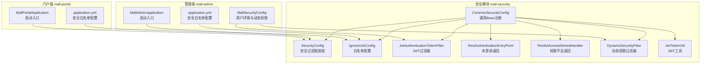
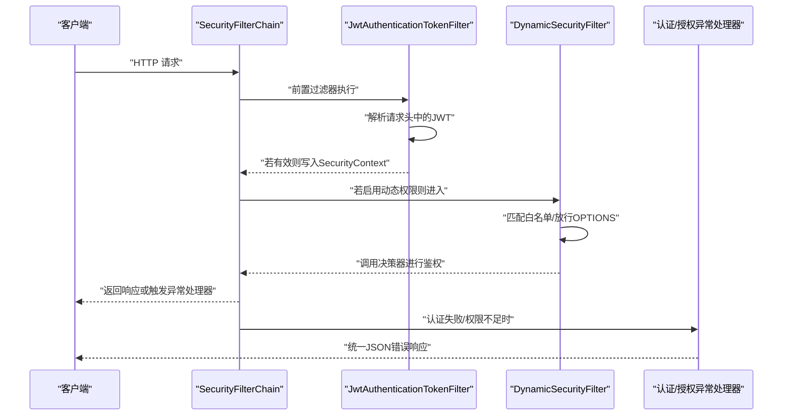
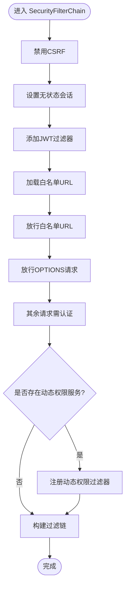
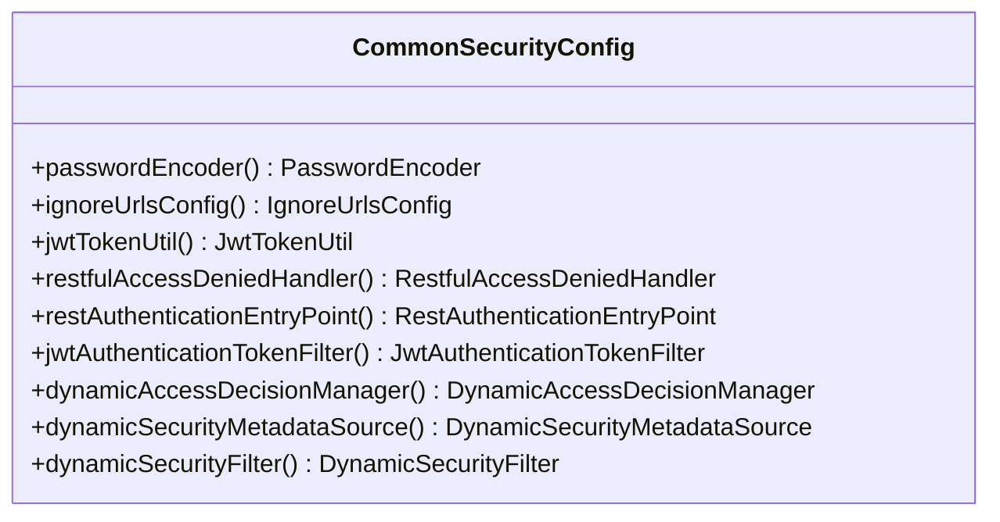
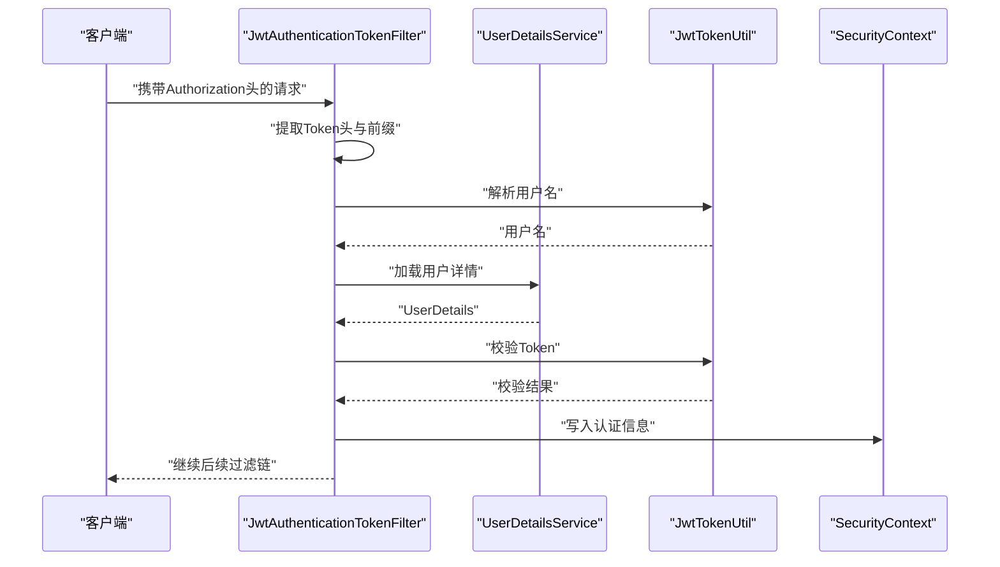
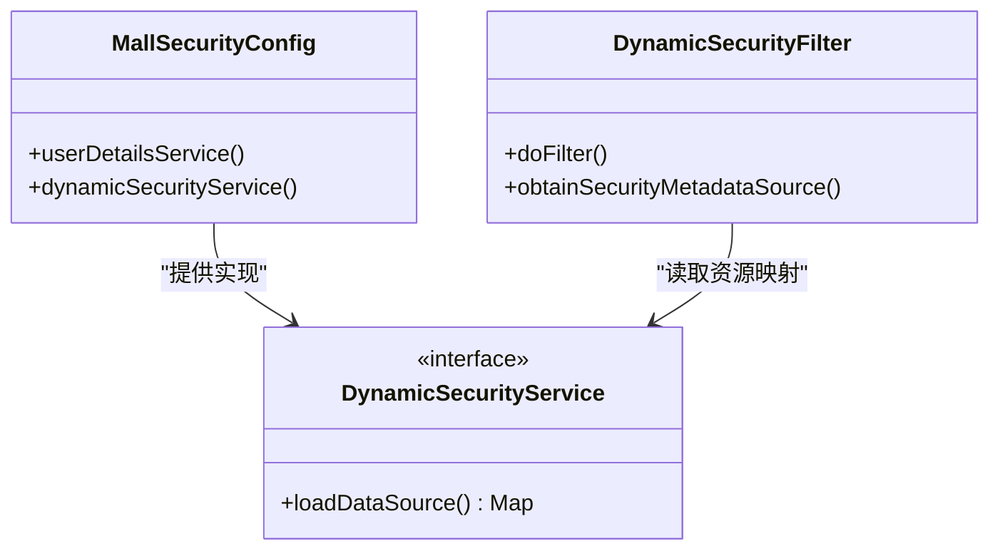
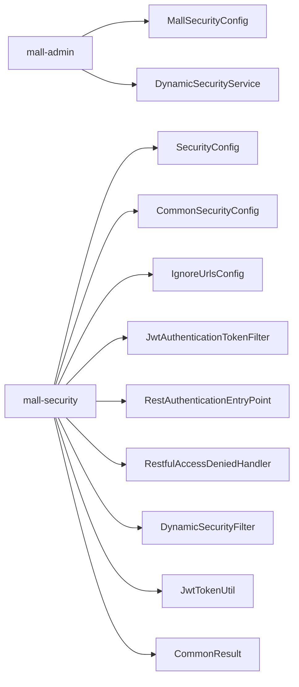

# 安全配置管理

<cite>
**本文引用的文件**
- [mall-security/src/main/java/com/macro/mall/security/config/SecurityConfig.java](file://mall-security/src/main/java/com/macro/mall/security/config/SecurityConfig.java)
- [mall-security/src/main/java/com/macro/mall/security/config/CommonSecurityConfig.java](file://mall-security/src/main/java/com/macro/mall/security/config/CommonSecurityConfig.java)
- [mall-security/src/main/java/com/macro/mall/security/config/IgnoreUrlsConfig.java](file://mall-security/src/main/java/com/macro/mall/security/config/IgnoreUrlsConfig.java)
- [mall-admin/src/main/java/com/macro/mall/config/MallSecurityConfig.java](file://mall-admin/src/main/java/com/macro/mall/config/MallSecurityConfig.java)
- [mall-security/src/main/java/com/macro/mall/security/component/JwtAuthenticationTokenFilter.java](file://mall-security/src/main/java/com/macro/mall/security/component/JwtAuthenticationTokenFilter.java)
- [mall-security/src/main/java/com/macro/mall/security/component/RestAuthenticationEntryPoint.java](file://mall-security/src/main/java/com/macro/mall/security/component/RestAuthenticationEntryPoint.java)
- [mall-security/src/main/java/com/macro/mall/security/component/RestfulAccessDeniedHandler.java](file://mall-security/src/main/java/com/macro/mall/security/component/RestfulAccessDeniedHandler.java)
- [mall-security/src/main/java/com/macro/mall/security/component/DynamicSecurityFilter.java](file://mall-security/src/main/java/com/macro/mall/security/component/DynamicSecurityFilter.java)
- [mall-security/src/main/java/com/macro/mall/security/util/JwtTokenUtil.java](file://mall-security/src/main/java/com/macro/mall/security/util/JwtTokenUtil.java)
- [mall-common/src/main/java/com/macro/mall/common/api/CommonResult.java](file://mall-common/src/main/java/com/macro/mall/common/api/CommonResult.java)
- [mall-admin/src/main/resources/application.yml](file://mall-admin/src/main/resources/application.yml)
- [mall-portal/src/main/resources/application.yml](file://mall-portal/src/main/resources/application.yml)
- [mall-admin/src/main/java/com/macro/mall/MallAdminApplication.java](file://mall-admin/src/main/java/com/macro/mall/MallAdminApplication.java)
- [mall-portal/src/main/java/com/macro/mall/portal/MallPortalApplication.java](file://mall-portal/src/main/java/com/macro/mall/portal/MallPortalApplication.java)
</cite>

## 目录
1. [引言](#引言)
2. [项目结构](#项目结构)
3. [核心组件](#核心组件)
4. [架构总览](#架构总览)
5. [详细组件分析](#详细组件分析)
6. [依赖分析](#依赖分析)
7. [性能考虑](#性能考虑)
8. [故障排查指南](#故障排查指南)
9. [结论](#结论)
10. [附录](#附录)

## 引言
本文件系统性梳理 mall 项目的安全配置管理方案，重点覆盖以下方面：
- Spring Security 的核心配置类与职责边界：SecurityConfig、CommonSecurityConfig
- 忽略 URL 白名单配置 IgnoreUrlsConfig 的实现原理与典型场景
- 管理端 MallSecurityConfig 的定制化配置：用户详情加载、动态权限数据源
- JWT 过滤链、异常处理、动态权限过滤器的工作机制
- CORS、CSRF、会话策略等安全策略在当前配置中的取舍与建议
- 自定义过滤器、认证失败与权限拒绝处理的扩展指南

## 项目结构
本项目采用多模块结构，安全能力集中在 mall-security 模块，业务模块（mall-admin、mall-portal）通过引入 mall-security 并按需扩展配置。

图表来源
- [mall-security/src/main/java/com/macro/mall/security/config/SecurityConfig.java:38-67](file://mall-security/src/main/java/com/macro/mall/security/config/SecurityConfig.java#L38-L67)
- [mall-security/src/main/java/com/macro/mall/security/config/CommonSecurityConfig.java:16-66](file://mall-security/src/main/java/com/macro/mall/security/config/CommonSecurityConfig.java#L16-L66)
- [mall-security/src/main/java/com/macro/mall/security/config/IgnoreUrlsConfig.java:14-21](file://mall-security/src/main/java/com/macro/mall/security/config/IgnoreUrlsConfig.java#L14-L21)
- [mall-security/src/main/java/com/macro/mall/security/component/JwtAuthenticationTokenFilter.java:25-57](file://mall-security/src/main/java/com/macro/mall/security/component/JwtAuthenticationTokenFilter.java#L25-L57)
- [mall-security/src/main/java/com/macro/mall/security/component/RestAuthenticationEntryPoint.java:18-28](file://mall-security/src/main/java/com/macro/mall/security/component/RestAuthenticationEntryPoint.java#L18-L28)
- [mall-security/src/main/java/com/macro/mall/security/component/RestfulAccessDeniedHandler.java:18-30](file://mall-security/src/main/java/com/macro/mall/security/component/RestfulAccessDeniedHandler.java#L18-L30)
- [mall-security/src/main/java/com/macro/mall/security/component/DynamicSecurityFilter.java:21-77](file://mall-security/src/main/java/com/macro/mall/security/component/DynamicSecurityFilter.java#L21-L77)
- [mall-security/src/main/java/com/macro/mall/security/util/JwtTokenUtil.java:28-170](file://mall-security/src/main/java/com/macro/mall/security/util/JwtTokenUtil.java#L28-L170)
- [mall-admin/src/main/java/com/macro/mall/config/MallSecurityConfig.java:22-48](file://mall-admin/src/main/java/com/macro/mall/config/MallSecurityConfig.java#L22-L48)
- [mall-admin/src/main/resources/application.yml:34-52](file://mall-admin/src/main/resources/application.yml#L34-L52)
- [mall-portal/src/main/resources/application.yml:21-40](file://mall-portal/src/main/resources/application.yml#L21-L40)
- [mall-admin/src/main/java/com/macro/mall/MallAdminApplication.java:10-15](file://mall-admin/src/main/java/com/macro/mall/MallAdminApplication.java#L10-L15)
- [mall-portal/src/main/java/com/macro/mall/portal/MallPortalApplication.java:6-13](file://mall-portal/src/main/java/com/macro/mall/portal/MallPortalApplication.java#L6-L13)

章节来源
- [mall-admin/src/main/java/com/macro/mall/MallAdminApplication.java:10-15](file://mall-admin/src/main/java/com/macro/mall/MallAdminApplication.java#L10-L15)
- [mall-portal/src/main/java/com/macro/mall/portal/MallPortalApplication.java:6-13](file://mall-portal/src/main/java/com/macro/mall/portal/MallPortalApplication.java#L6-L13)

## 核心组件
本节聚焦安全配置的关键构件及其职责：

- SecurityConfig：装配 SecurityFilterChain，禁用 CSRF，启用无状态会话，注册 JWT 过滤器与动态权限过滤器，配置异常处理器与白名单放行。
- CommonSecurityConfig：统一注册密码编码器、IgnoreUrlsConfig、JWT 工具、认证/授权异常处理器、JWT 过滤器以及动态权限相关 Bean。
- IgnoreUrlsConfig：基于配置前缀 secure.ignored.urls 的白名单列表，供 SecurityConfig 与 DynamicSecurityFilter 共同使用。
- JwtAuthenticationTokenFilter：从请求头提取 JWT，解析用户并写入 SecurityContext，实现无状态认证。
- RestAuthenticationEntryPoint：未登录或 Token 失效时返回统一 JSON 结果。
- RestfulAccessDeniedHandler：权限不足时返回统一 JSON 结果。
- DynamicSecurityFilter：基于路径的动态权限过滤器，结合 DynamicAccessDecisionManager 与 DynamicSecurityMetadataSource 实现细粒度授权。
- MallSecurityConfig（管理端）：提供 UserDetailsService 实现与 DynamicSecurityService 的动态资源映射。

章节来源
- [mall-security/src/main/java/com/macro/mall/security/config/SecurityConfig.java:21-67](file://mall-security/src/main/java/com/macro/mall/security/config/SecurityConfig.java#L21-L67)
- [mall-security/src/main/java/com/macro/mall/security/config/CommonSecurityConfig.java:16-66](file://mall-security/src/main/java/com/macro/mall/security/config/CommonSecurityConfig.java#L16-L66)
- [mall-security/src/main/java/com/macro/mall/security/config/IgnoreUrlsConfig.java:14-21](file://mall-security/src/main/java/com/macro/mall/security/config/IgnoreUrlsConfig.java#L14-L21)
- [mall-security/src/main/java/com/macro/mall/security/component/JwtAuthenticationTokenFilter.java:25-57](file://mall-security/src/main/java/com/macro/mall/security/component/JwtAuthenticationTokenFilter.java#L25-L57)
- [mall-security/src/main/java/com/macro/mall/security/component/RestAuthenticationEntryPoint.java:18-28](file://mall-security/src/main/java/com/macro/mall/security/component/RestAuthenticationEntryPoint.java#L18-L28)
- [mall-security/src/main/java/com/macro/mall/security/component/RestfulAccessDeniedHandler.java:18-30](file://mall-security/src/main/java/com/macro/mall/security/component/RestfulAccessDeniedHandler.java#L18-L30)
- [mall-security/src/main/java/com/macro/mall/security/component/DynamicSecurityFilter.java:21-77](file://mall-security/src/main/java/com/macro/mall/security/component/DynamicSecurityFilter.java#L21-L77)
- [mall-admin/src/main/java/com/macro/mall/config/MallSecurityConfig.java:22-48](file://mall-admin/src/main/java/com/macro/mall/config/MallSecurityConfig.java#L22-L48)

## 架构总览
下图展示安全过滤链在请求生命周期中的执行顺序与关键组件交互。

图表来源
- [mall-security/src/main/java/com/macro/mall/security/config/SecurityConfig.java:38-67](file://mall-security/src/main/java/com/macro/mall/security/config/SecurityConfig.java#L38-L67)
- [mall-security/src/main/java/com/macro/mall/security/component/JwtAuthenticationTokenFilter.java:36-56](file://mall-security/src/main/java/com/macro/mall/security/component/JwtAuthenticationTokenFilter.java#L36-L56)
- [mall-security/src/main/java/com/macro/mall/security/component/DynamicSecurityFilter.java:37-61](file://mall-security/src/main/java/com/macro/mall/security/component/DynamicSecurityFilter.java#L37-L61)
- [mall-security/src/main/java/com/macro/mall/security/component/RestAuthenticationEntryPoint.java:18-28](file://mall-security/src/main/java/com/macro/mall/security/component/RestAuthenticationEntryPoint.java#L18-L28)
- [mall-security/src/main/java/com/macro/mall/security/component/RestfulAccessDeniedHandler.java:18-30](file://mall-security/src/main/java/com/macro/mall/security/component/RestfulAccessDeniedHandler.java#L18-L30)

## 详细组件分析

### SecurityConfig 分析
- 关键策略
  - 禁用 CSRF，适配前后端分离与无状态 API 场景
  - 无状态会话（STATELESS），避免服务器端会话开销
  - 注册 JWT 过滤器于 UsernamePasswordAuthenticationFilter 之前
  - 加载 IgnoreUrlsConfig 中的白名单并放行
  - 放行 OPTIONS 预检请求
  - 任何其他请求均需认证
  - 若存在动态权限服务，则注册动态权限过滤器

图表来源
- [mall-security/src/main/java/com/macro/mall/security/config/SecurityConfig.java:38-67](file://mall-security/src/main/java/com/macro/mall/security/config/SecurityConfig.java#L38-L67)

章节来源
- [mall-security/src/main/java/com/macro/mall/security/config/SecurityConfig.java:21-67](file://mall-security/src/main/java/com/macro/mall/security/config/SecurityConfig.java#L21-L67)

### CommonSecurityConfig 分析
- 统一注册通用 Bean，便于各模块复用
- 条件化注册动态权限相关 Bean（当存在动态权限服务时）

图表来源
- [mall-security/src/main/java/com/macro/mall/security/config/CommonSecurityConfig.java:16-66](file://mall-security/src/main/java/com/macro/mall/security/config/CommonSecurityConfig.java#L16-L66)

章节来源
- [mall-security/src/main/java/com/macro/mall/security/config/CommonSecurityConfig.java:16-66](file://mall-security/src/main/java/com/macro/mall/security/config/CommonSecurityConfig.java#L16-L66)

### IgnoreUrlsConfig 与白名单机制
- 配置来源：secure.ignored.urls
- 使用场景：
  - 静态资源放行（如 HTML、JS、CSS、图片、地图、favicon.ico）
  - 开放接口（如登录、注册、注销）
  - 文档访问（Swagger UI、资源、v2 接口文档）
  - 运维与监控（/actuator/**、/druid/**）
  - 对象存储直传（/minio/upload）
  - 门户端开放浏览接口（/home/**、/product/**、/brand/**、/alipay/**、/sso/**）
- 两处生效位置：
  - SecurityFilterChain 中对白名单放行
  - DynamicSecurityFilter 中对白名单与 OPTIONS 预检放行

章节来源
- [mall-security/src/main/java/com/macro/mall/security/config/IgnoreUrlsConfig.java:14-21](file://mall-security/src/main/java/com/macro/mall/security/config/IgnoreUrlsConfig.java#L14-L21)
- [mall-admin/src/main/resources/application.yml:34-52](file://mall-admin/src/main/resources/application.yml#L34-L52)
- [mall-portal/src/main/resources/application.yml:21-40](file://mall-portal/src/main/resources/application.yml#L21-L40)
- [mall-security/src/main/java/com/macro/mall/security/component/DynamicSecurityFilter.java:37-61](file://mall-security/src/main/java/com/macro/mall/security/component/DynamicSecurityFilter.java#L37-L61)
- [mall-security/src/main/java/com/macro/mall/security/config/SecurityConfig.java:52-57](file://mall-security/src/main/java/com/macro/mall/security/config/SecurityConfig.java#L52-L57)

### JwtAuthenticationTokenFilter 与 JwtTokenUtil
- 过滤器职责：从请求头读取 JWT，解析用户名，加载用户详情，校验 Token，成功后写入 SecurityContext
- 工具类职责：生成、解析、校验与刷新 JWT；读取密钥、过期时间、Token 前缀等配置

图表来源
- [mall-security/src/main/java/com/macro/mall/security/component/JwtAuthenticationTokenFilter.java:36-56](file://mall-security/src/main/java/com/macro/mall/security/component/JwtAuthenticationTokenFilter.java#L36-L56)
- [mall-security/src/main/java/com/macro/mall/security/util/JwtTokenUtil.java:76-96](file://mall-security/src/main/java/com/macro/mall/security/util/JwtTokenUtil.java#L76-L96)

章节来源
- [mall-security/src/main/java/com/macro/mall/security/component/JwtAuthenticationTokenFilter.java:25-57](file://mall-security/src/main/java/com/macro/mall/security/component/JwtAuthenticationTokenFilter.java#L25-L57)
- [mall-security/src/main/java/com/macro/mall/security/util/JwtTokenUtil.java:28-170](file://mall-security/src/main/java/com/macro/mall/security/util/JwtTokenUtil.java#L28-L170)

### 异常处理组件
- 未登录/Token 失效：RestAuthenticationEntryPoint 返回统一 JSON
- 权限不足：RestfulAccessDeniedHandler 返回统一 JSON
- 两者均设置跨域响应头与 UTF-8 编码

章节来源
- [mall-security/src/main/java/com/macro/mall/security/component/RestAuthenticationEntryPoint.java:18-28](file://mall-security/src/main/java/com/macro/mall/security/component/RestAuthenticationEntryPoint.java#L18-L28)
- [mall-security/src/main/java/com/macro/mall/security/component/RestfulAccessDeniedHandler.java:18-30](file://mall-security/src/main/java/com/macro/mall/security/component/RestfulAccessDeniedHandler.java#L18-L30)
- [mall-common/src/main/java/com/macro/mall/common/api/CommonResult.java:99-108](file://mall-common/src/main/java/com/macro/mall/common/api/CommonResult.java#L99-L108)

### 动态权限过滤器与管理端集成
- DynamicSecurityFilter 在过滤链中对白名单与 OPTIONS 直接放行，其余请求交由决策器进行鉴权
- MallSecurityConfig 提供 DynamicSecurityService，将资源表（URL-名称）映射为资源标识，供决策器使用

图表来源
- [mall-security/src/main/java/com/macro/mall/security/component/DynamicSecurityFilter.java:21-77](file://mall-security/src/main/java/com/macro/mall/security/component/DynamicSecurityFilter.java#L21-L77)
- [mall-admin/src/main/java/com/macro/mall/config/MallSecurityConfig.java:35-48](file://mall-admin/src/main/java/com/macro/mall/config/MallSecurityConfig.java#L35-L48)

章节来源
- [mall-security/src/main/java/com/macro/mall/security/component/DynamicSecurityFilter.java:21-77](file://mall-security/src/main/java/com/macro/mall/security/component/DynamicSecurityFilter.java#L21-L77)
- [mall-admin/src/main/java/com/macro/mall/config/MallSecurityConfig.java:22-48](file://mall-admin/src/main/java/com/macro/mall/config/MallSecurityConfig.java#L22-L48)

## 依赖分析
- 模块间耦合
  - mall-admin 通过 MallSecurityConfig 注入动态权限服务，依赖资源服务加载资源列表
  - mall-security 通过 CommonSecurityConfig 统一暴露 Bean，被各业务模块复用
  - SecurityConfig 依赖 IgnoreUrlsConfig、异常处理器、JWT 过滤器与可选的动态权限过滤器
- 外部依赖
  - JWT 解析与签发：JwtTokenUtil 依赖配置项（密钥、过期时间、Token 头）
  - 统一返回体：异常处理器依赖 CommonResult

图表来源
- [mall-admin/src/main/java/com/macro/mall/config/MallSecurityConfig.java:22-48](file://mall-admin/src/main/java/com/macro/mall/config/MallSecurityConfig.java#L22-L48)
- [mall-security/src/main/java/com/macro/mall/security/config/SecurityConfig.java:21-67](file://mall-security/src/main/java/com/macro/mall/security/config/SecurityConfig.java#L21-L67)
- [mall-security/src/main/java/com/macro/mall/security/config/CommonSecurityConfig.java:16-66](file://mall-security/src/main/java/com/macro/mall/security/config/CommonSecurityConfig.java#L16-L66)
- [mall-security/src/main/java/com/macro/mall/security/util/JwtTokenUtil.java:28-170](file://mall-security/src/main/java/com/macro/mall/security/util/JwtTokenUtil.java#L28-L170)
- [mall-common/src/main/java/com/macro/mall/common/api/CommonResult.java:99-108](file://mall-common/src/main/java/com/macro/mall/common/api/CommonResult.java#L99-L108)

章节来源
- [mall-admin/src/main/java/com/macro/mall/config/MallSecurityConfig.java:22-48](file://mall-admin/src/main/java/com/macro/mall/config/MallSecurityConfig.java#L22-L48)
- [mall-security/src/main/java/com/macro/mall/security/config/SecurityConfig.java:21-67](file://mall-security/src/main/java/com/macro/mall/security/config/SecurityConfig.java#L21-L67)
- [mall-security/src/main/java/com/macro/mall/security/config/CommonSecurityConfig.java:16-66](file://mall-security/src/main/java/com/macro/mall/security/config/CommonSecurityConfig.java#L16-L66)

## 性能考虑
- 无状态会话（STATELESS）降低服务器端会话维护成本，适合高并发 API 场景
- JWT 过滤器为一次请求只做一次解析与校验，复杂度主要受 Token 解析与用户详情加载影响
- 动态权限过滤器在每次请求都会进行路径匹配与鉴权决策，建议：
  - 合理划分白名单，减少不必要的动态权限检查
  - 资源映射缓存与懒加载策略，避免频繁查询数据库
  - 路径匹配使用更精确的模式，减少通配符匹配开销

## 故障排查指南
- 未登录或 Token 失效
  - 现象：返回统一未登录 JSON
  - 排查：确认请求头 Authorization 是否包含正确前缀与有效 Token；核对密钥与过期时间配置
- 权限不足
  - 现象：返回统一权限不足 JSON
  - 排查：确认用户角色与资源映射；检查动态权限数据源是否正确加载
- 白名单未生效
  - 现象：静态资源或开放接口被拦截
  - 排查：核对 secure.ignored.urls 配置；确认 SecurityFilterChain 与 DynamicSecurityFilter 均已加载白名单
- OPTIONS 预检失败
  - 现象：跨域预检被拒绝
  - 排查：确认白名单中包含对应路径；检查 DynamicSecurityFilter 是否放行 OPTIONS

章节来源
- [mall-security/src/main/java/com/macro/mall/security/component/RestAuthenticationEntryPoint.java:18-28](file://mall-security/src/main/java/com/macro/mall/security/component/RestAuthenticationEntryPoint.java#L18-L28)
- [mall-security/src/main/java/com/macro/mall/security/component/RestfulAccessDeniedHandler.java:18-30](file://mall-security/src/main/java/com/macro/mall/security/component/RestfulAccessDeniedHandler.java#L18-L30)
- [mall-security/src/main/java/com/macro/mall/security/component/DynamicSecurityFilter.java:37-61](file://mall-security/src/main/java/com/macro/mall/security/component/DynamicSecurityFilter.java#L37-L61)
- [mall-admin/src/main/resources/application.yml:34-52](file://mall-admin/src/main/resources/application.yml#L34-L52)
- [mall-portal/src/main/resources/application.yml:21-40](file://mall-portal/src/main/resources/application.yml#L21-L40)

## 结论
本项目采用“集中配置 + 动态权限”的安全架构：通过 SecurityConfig 与 CommonSecurityConfig 统一装配无状态认证链路，利用 IgnoreUrlsConfig 精准放行静态资源与开放接口，结合 MallSecurityConfig 的动态权限数据源实现细粒度授权。当前配置禁用 CSRF、使用无状态会话，适合前后端分离的微服务架构。若需进一步增强，可在现有基础上扩展 CORS、自定义过滤器链、认证失败与权限拒绝处理策略。

## 附录

### CORS 跨域处理建议
- 当前配置未显式注册全局 CORS Bean，如需跨域支持，可在业务模块中添加全局 CORS 配置类，或在网关层统一处理
- 建议与前端约定允许的源、方法与头字段，并在生产环境限制为具体域名

### CSRF 防护建议
- 当前禁用了 CSRF，适用于无状态 API
- 如需兼容表单提交或需要 CSRF 保护，请评估 Token 注入与校验方案，并谨慎调整 SecurityFilterChain

### 会话管理建议
- 当前为 STATELESS，适合分布式与水平扩展
- 如需会话粘性或服务端会话特性，可调整策略并配合负载均衡策略

### 自定义过滤器添加指南
- 在 SecurityConfig 中使用 addFilterBefore 或 addFilterAfter 将自定义过滤器插入到合适位置
- 确保自定义过滤器不会与现有 JWT 过滤器冲突

### 认证失败与权限拒绝处理定制
- 可替换或扩展 RestAuthenticationEntryPoint 与 RestfulAccessDeniedHandler，以满足不同业务场景的错误码与提示
- 建议统一错误码枚举与国际化支持