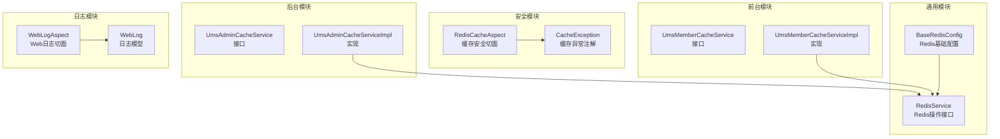
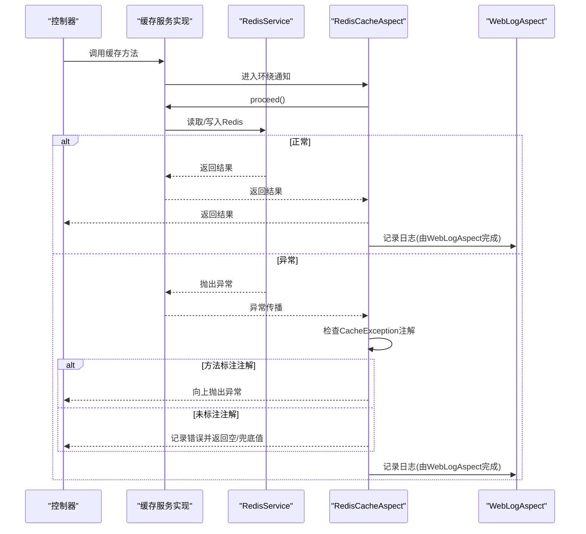
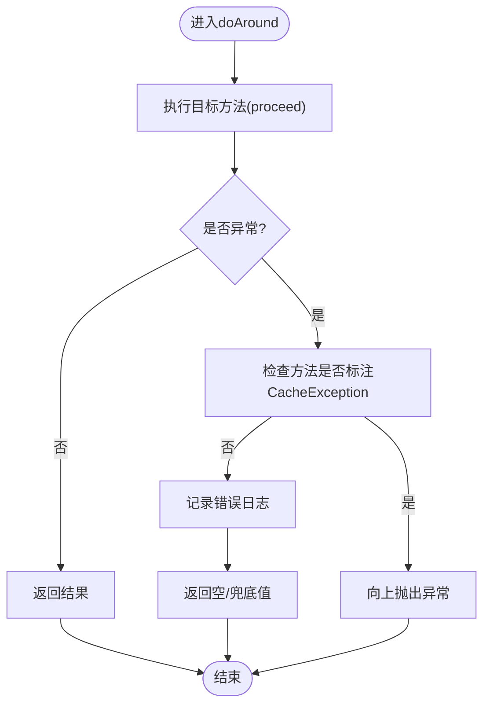
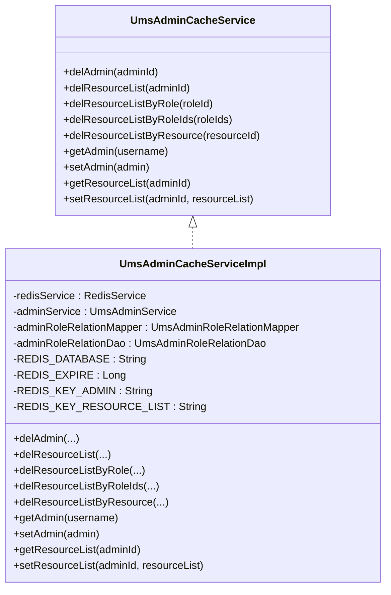
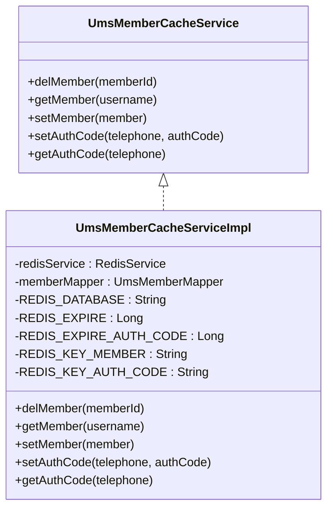
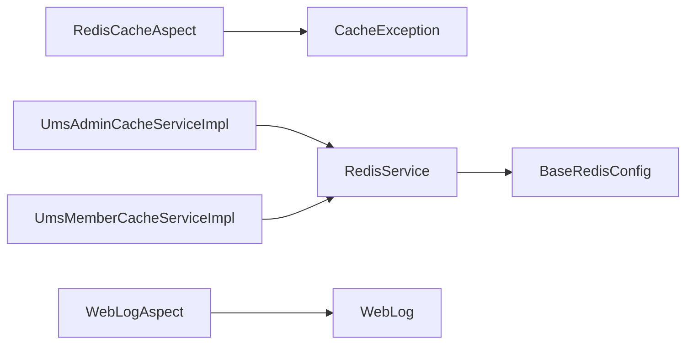

# 缓存安全控制

<cite>
**本文引用的文件**
- [RedisCacheAspect.java](file://mall-security/src/main/java/com/macro/mall/security/aspect/RedisCacheAspect.java)
- [CacheException.java](file://mall-security/src/main/java/com/macro/mall/security/annotation/CacheException.java)
- [BaseRedisConfig.java](file://mall-common/src/main/java/com/macro/mall/common/config/BaseRedisConfig.java)
- [RedisService.java](file://mall-common/src/main/java/com/macro/mall/common/service/RedisService.java)
- [UmsAdminCacheService.java](file://mall-admin/src/main/java/com/macro/mall/service/UmsAdminCacheService.java)
- [UmsAdminCacheServiceImpl.java](file://mall-admin/src/main/java/com/macro/mall/service/impl/UmsAdminCacheServiceImpl.java)
- [UmsMemberCacheService.java](file://mall-portal/src/main/java/com/macro/mall/portal/service/UmsMemberCacheService.java)
- [UmsMemberCacheServiceImpl.java](file://mall-portal/src/main/java/com/macro/mall/portal/service/impl/UmsMemberCacheServiceImpl.java)
- [WebLogAspect.java](file://mall-common/src/main/java/com/macro/mall/common/log/WebLogAspect.java)
- [WebLog.java](file://mall-common/src/main/java/com/macro/mall/common/domain/WebLog.java)
</cite>

## 目录
1. [简介](#简介)
2. [项目结构](#项目结构)
3. [核心组件](#核心组件)
4. [架构总览](#架构总览)
5. [详细组件分析](#详细组件分析)
6. [依赖分析](#依赖分析)
7. [性能考量](#性能考量)
8. [故障排查指南](#故障排查指南)
9. [结论](#结论)
10. [附录](#附录)

## 简介
本技术文档聚焦于缓存安全控制，围绕Redis缓存的权限与安全拦截机制展开，系统性阐述以下内容：
- RedisCacheAspect切面的实现原理与缓存操作的安全拦截策略
- 缓存数据的访问控制策略（敏感数据处理、缓存失效时机、缓存穿透防护）
- CacheException注解的使用场景与异常处理机制
- 缓存安全最佳实践（缓存数据加密、访问日志记录、缓存监控）
- 常见缓存安全问题的排查与解决方案

## 项目结构
本项目采用多模块分层架构，缓存安全相关能力主要分布在以下模块：
- mall-security：安全切面与注解，负责对缓存方法进行异常控制与降级
- mall-common：通用配置与服务，包含Redis序列化、缓存管理器、通用Redis操作接口
- mall-admin：后台用户缓存服务接口与实现
- mall-portal：前台会员缓存服务接口与实现
- mall-common/log：统一Web日志切面，便于审计与监控

**图表来源**
- [RedisCacheAspect.java:1-51](file://mall-security/src/main/java/com/macro/mall/security/aspect/RedisCacheAspect.java#L1-L51)
- [CacheException.java:1-14](file://mall-security/src/main/java/com/macro/mall/security/annotation/CacheException.java#L1-L14)
- [BaseRedisConfig.java:1-67](file://mall-common/src/main/java/com/macro/mall/common/config/BaseRedisConfig.java#L1-L67)
- [RedisService.java:1-182](file://mall-common/src/main/java/com/macro/mall/common/service/RedisService.java#L1-L182)
- [UmsAdminCacheService.java:1-58](file://mall-admin/src/main/java/com/macro/mall/service/UmsAdminCacheService.java#L1-L58)
- [UmsAdminCacheServiceImpl.java:1-116](file://mall-admin/src/main/java/com/macro/mall/service/impl/UmsAdminCacheServiceImpl.java#L1-L116)
- [UmsMemberCacheService.java:1-35](file://mall-portal/src/main/java/com/macro/mall/portal/service/UmsMemberCacheService.java#L1-L35)
- [UmsMemberCacheServiceImpl.java:1-40](file://mall-portal/src/main/java/com/macro/mall/portal/service/impl/UmsMemberCacheServiceImpl.java#L1-L40)
- [WebLogAspect.java:1-126](file://mall-common/src/main/java/com/macro/mall/common/log/WebLogAspect.java#L1-L126)
- [WebLog.java:1-69](file://mall-common/src/main/java/com/macro/mall/common/domain/WebLog.java#L1-L69)

**章节来源**
- [RedisCacheAspect.java:1-51](file://mall-security/src/main/java/com/macro/mall/security/aspect/RedisCacheAspect.java#L1-L51)
- [BaseRedisConfig.java:1-67](file://mall-common/src/main/java/com/macro/mall/common/config/BaseRedisConfig.java#L1-L67)

## 核心组件
- RedisCacheAspect：基于AOP的缓存安全切面，对缓存方法执行进行环绕拦截，统一处理异常，避免Redis故障影响主业务
- CacheException：方法级注解，标识该方法在缓存异常时应向上抛出，不进行吞掉处理
- BaseRedisConfig：提供RedisTemplate与RedisCacheManager的通用配置，包含序列化策略与默认TTL
- RedisService：抽象Redis操作接口，覆盖String、Hash、Set、List等常用结构
- UmsAdminCacheServiceImpl/UmsMemberCacheServiceImpl：后台/前台用户缓存的具体实现，负责键空间设计、读写与失效策略
- WebLogAspect/WebLog：统一Web日志切面与日志模型，便于审计与监控缓存相关操作

**章节来源**
- [RedisCacheAspect.java:17-50](file://mall-security/src/main/java/com/macro/mall/security/aspect/RedisCacheAspect.java#L17-L50)
- [CacheException.java:5-13](file://mall-security/src/main/java/com/macro/mall/security/annotation/CacheException.java#L5-L13)
- [BaseRedisConfig.java:23-66](file://mall-common/src/main/java/com/macro/mall/common/config/BaseRedisConfig.java#L23-L66)
- [RedisService.java:11-182](file://mall-common/src/main/java/com/macro/mall/common/service/RedisService.java#L11-L182)
- [UmsAdminCacheServiceImpl.java:24-116](file://mall-admin/src/main/java/com/macro/mall/service/impl/UmsAdminCacheServiceImpl.java#L24-L116)
- [UmsMemberCacheServiceImpl.java:16-40](file://mall-portal/src/main/java/com/macro/mall/portal/service/impl/UmsMemberCacheServiceImpl.java#L16-L40)
- [WebLogAspect.java:36-126](file://mall-common/src/main/java/com/macro/mall/common/log/WebLogAspect.java#L36-L126)

## 架构总览
下图展示缓存安全的整体交互流程：控制器调用业务层缓存服务，缓存服务通过RedisService访问Redis；若发生异常，由RedisCacheAspect根据CacheException注解决定是否抛出或记录错误；同时WebLogAspect记录请求与响应信息，便于审计。

**图表来源**
- [RedisCacheAspect.java:31-48](file://mall-security/src/main/java/com/macro/mall/security/aspect/RedisCacheAspect.java#L31-L48)
- [CacheException.java:10-12](file://mall-security/src/main/java/com/macro/mall/security/annotation/CacheException.java#L10-L12)
- [UmsAdminCacheServiceImpl.java:92-114](file://mall-admin/src/main/java/com/macro/mall/service/impl/UmsAdminCacheServiceImpl.java#L92-L114)
- [UmsMemberCacheServiceImpl.java:33-40](file://mall-portal/src/main/java/com/macro/mall/portal/service/impl/UmsMemberCacheServiceImpl.java#L33-L40)
- [WebLogAspect.java:54-89](file://mall-common/src/main/java/com/macro/mall/common/log/WebLogAspect.java#L54-L89)

## 详细组件分析

### RedisCacheAspect切面
- 切点定义：匹配所有以CacheService结尾的公开方法，覆盖后台与前台缓存服务
- 环绕逻辑：执行目标方法；若异常且方法标注CacheException，则向上抛出；否则记录错误日志并返回空/兜底值
- 作用：隔离Redis故障，保证业务可用性；对关键缓存操作可选择“失败即报”的策略

**图表来源**
- [RedisCacheAspect.java:31-48](file://mall-security/src/main/java/com/macro/mall/security/aspect/RedisCacheAspect.java#L31-L48)
- [CacheException.java:10-12](file://mall-security/src/main/java/com/macro/mall/security/annotation/CacheException.java#L10-L12)

**章节来源**
- [RedisCacheAspect.java:27-48](file://mall-security/src/main/java/com/macro/mall/security/aspect/RedisCacheAspect.java#L27-L48)

### CacheException注解
- 元注解：方法级注解，运行时生效
- 使用场景：对关键缓存操作（如登录态、鉴权资源）启用“异常即报”，避免静默失败导致安全风险
- 与切面配合：未标注时，切面吞掉异常并记录日志；标注时，异常直接传播至调用方

**章节来源**
- [CacheException.java:9-13](file://mall-security/src/main/java/com/macro/mall/security/annotation/CacheException.java#L9-L13)
- [RedisCacheAspect.java:39-45](file://mall-security/src/main/java/com/macro/mall/security/aspect/RedisCacheAspect.java#L39-L45)

### Redis基础配置与序列化
- RedisTemplate：key/value与hash key/value均使用String与自定义JSON序列化器
- RedisCacheManager：默认TTL为1天，非阻塞写入
- 序列化策略：Jackson2JsonRedisSerializer，开启默认类型信息，确保对象序列化/反序列化正确

**章节来源**
- [BaseRedisConfig.java:30-61](file://mall-common/src/main/java/com/macro/mall/common/config/BaseRedisConfig.java#L30-L61)

### RedisService接口
- 覆盖常用Redis数据结构操作：字符串、哈希、集合、列表
- 提供过期时间设置、存在性判断、原子计数等能力
- 为缓存实现提供统一抽象，便于替换与扩展

**章节来源**
- [RedisService.java:11-182](file://mall-common/src/main/java/com/macro/mall/common/service/RedisService.java#L11-L182)

### 后台用户缓存实现（UmsAdminCacheServiceImpl）
- 键空间设计：数据库前缀:键名:业务标识（如用户名/ID）
- 读写策略：按用户名缓存管理员信息；按管理员ID缓存资源列表
- 失效策略：当角色/资源变更时，批量删除相关缓存键，确保数据一致性
- TTL：统一使用通用过期时间

**图表来源**
- [UmsAdminCacheService.java:12-57](file://mall-admin/src/main/java/com/macro/mall/service/UmsAdminCacheService.java#L12-L57)
- [UmsAdminCacheServiceImpl.java:24-116](file://mall-admin/src/main/java/com/macro/mall/service/impl/UmsAdminCacheServiceImpl.java#L24-L116)

**章节来源**
- [UmsAdminCacheServiceImpl.java:43-114](file://mall-admin/src/main/java/com/macro/mall/service/impl/UmsAdminCacheServiceImpl.java#L43-L114)

### 前台会员缓存实现（UmsMemberCacheServiceImpl）
- 键空间设计：数据库前缀:member键名:username；验证码键名:authCode
- 读写策略：按用户名缓存会员信息；按手机号缓存验证码
- 失效策略：删除会员缓存时，依据查询到的用户名构造键并删除
- TTL：通用过期时间与验证码专用过期时间

**图表来源**
- [UmsMemberCacheService.java:9-34](file://mall-portal/src/main/java/com/macro/mall/portal/service/UmsMemberCacheService.java#L9-L34)
- [UmsMemberCacheServiceImpl.java:16-40](file://mall-portal/src/main/java/com/macro/mall/portal/service/impl/UmsMemberCacheServiceImpl.java#L16-L40)

**章节来源**
- [UmsMemberCacheServiceImpl.java:33-40](file://mall-portal/src/main/java/com/macro/mall/portal/service/impl/UmsMemberCacheServiceImpl.java#L33-L40)

### Web日志切面与审计
- 切点：匹配所有控制器方法
- 日志内容：请求URL、方法、参数、耗时、结果、IP、用户等
- 输出：通过Logstash输出到ELK，便于缓存操作审计与问题追踪

**章节来源**
- [WebLogAspect.java:42-89](file://mall-common/src/main/java/com/macro/mall/common/log/WebLogAspect.java#L42-L89)
- [WebLog.java:12-68](file://mall-common/src/main/java/com/macro/mall/common/domain/WebLog.java#L12-L68)

## 依赖分析
- RedisCacheAspect依赖CacheException注解，用于区分“失败即报”与“失败吞掉”
- 缓存实现依赖RedisService接口，通过统一抽象与BaseRedisConfig提供的序列化策略，保证数据结构一致
- WebLogAspect独立于缓存实现，但与控制器同层，便于统一审计

**图表来源**
- [RedisCacheAspect.java:3,41-42](file://mall-security/src/main/java/com/macro/mall/security/aspect/RedisCacheAspect.java#L3,L41-L42)
- [CacheException.java:10-12](file://mall-security/src/main/java/com/macro/mall/security/annotation/CacheException.java#L10-L12)
- [UmsAdminCacheServiceImpl.java:29,94-101](file://mall-admin/src/main/java/com/macro/mall/service/impl/UmsAdminCacheServiceImpl.java#L29,L94-L101)
- [UmsMemberCacheServiceImpl.java:19,37-38](file://mall-portal/src/main/java/com/macro/mall/portal/service/impl/UmsMemberCacheServiceImpl.java#L19,L37-L38)
- [BaseRedisConfig.java:30-52](file://mall-common/src/main/java/com/macro/mall/common/config/BaseRedisConfig.java#L30-L52)
- [WebLogAspect.java:54-89](file://mall-common/src/main/java/com/macro/mall/common/log/WebLogAspect.java#L54-L89)

**章节来源**
- [RedisCacheAspect.java:27-48](file://mall-security/src/main/java/com/macro/mall/security/aspect/RedisCacheAspect.java#L27-L48)
- [UmsAdminCacheServiceImpl.java:24-116](file://mall-admin/src/main/java/com/macro/mall/service/impl/UmsAdminCacheServiceImpl.java#L24-L116)
- [UmsMemberCacheServiceImpl.java:16-40](file://mall-portal/src/main/java/com/macro/mall/portal/service/impl/UmsMemberCacheServiceImpl.java#L16-L40)
- [BaseRedisConfig.java:30-61](file://mall-common/src/main/java/com/macro/mall/common/config/BaseRedisConfig.java#L30-L61)
- [WebLogAspect.java:36-89](file://mall-common/src/main/java/com/macro/mall/common/log/WebLogAspect.java#L36-L89)

## 性能考量
- 序列化开销：JSON序列化/反序列化带来CPU与带宽成本，建议对热点数据采用更高效的序列化策略或压缩
- TTL与内存：默认1天TTL可能造成内存压力，需结合业务热点调整TTL或引入LRU淘汰策略
- 非阻塞写入：RedisCacheManager使用非锁写入，降低写入阻塞概率，适合高并发场景
- 键命名规范：统一的键空间设计有利于批量失效与监控，减少误删风险

[本节为通用性能讨论，无需特定文件来源]

## 故障排查指南
- 缓存异常未抛出
  - 检查目标方法是否标注CacheException注解
  - 若未标注，切面会记录错误日志并返回空/兜底值
  - 参考：[RedisCacheAspect.java:39-45](file://mall-security/src/main/java/com/macro/mall/security/aspect/RedisCacheAspect.java#L39-L45)，[CacheException.java:10-12](file://mall-security/src/main/java/com/macro/mall/security/annotation/CacheException.java#L10-L12)
- 缓存未命中或穿透
  - 核对键空间命名与TTL设置，确认是否被提前清理
  - 对空值设置短TTL，缓解缓存穿透
  - 参考：[UmsAdminCacheServiceImpl.java:92-101](file://mall-admin/src/main/java/com/macro/mall/service/impl/UmsAdminCacheServiceImpl.java#L92-L101)，[UmsMemberCacheServiceImpl.java:33-38](file://mall-portal/src/main/java/com/macro/mall/portal/service/impl/UmsMemberCacheServiceImpl.java#L33-L38)
- 缓存数据不一致
  - 在角色/资源变更后，调用对应失效方法批量删除相关缓存键
  - 参考：[UmsAdminCacheServiceImpl.java:58-90](file://mall-admin/src/main/java/com/macro/mall/service/impl/UmsAdminCacheServiceImpl.java#L58-L90)
- 审计与监控
  - 通过WebLogAspect输出的请求参数、耗时、结果等字段定位问题
  - 参考：[WebLogAspect.java:54-89](file://mall-common/src/main/java/com/macro/mall/common/log/WebLogAspect.java#L54-L89)，[WebLog.java:12-68](file://mall-common/src/main/java/com/macro/mall/common/domain/WebLog.java#L12-L68)

**章节来源**
- [RedisCacheAspect.java:39-45](file://mall-security/src/main/java/com/macro/mall/security/aspect/RedisCacheAspect.java#L39-L45)
- [CacheException.java:10-12](file://mall-security/src/main/java/com/macro/mall/security/annotation/CacheException.java#L10-L12)
- [UmsAdminCacheServiceImpl.java:58-101](file://mall-admin/src/main/java/com/macro/mall/service/impl/UmsAdminCacheServiceImpl.java#L58-L101)
- [UmsMemberCacheServiceImpl.java:33-38](file://mall-portal/src/main/java/com/macro/mall/portal/service/impl/UmsMemberCacheServiceImpl.java#L33-L38)
- [WebLogAspect.java:54-89](file://mall-common/src/main/java/com/macro/mall/common/log/WebLogAspect.java#L54-L89)
- [WebLog.java:12-68](file://mall-common/src/main/java/com/macro/mall/common/domain/WebLog.java#L12-L68)

## 结论
通过RedisCacheAspect与CacheException注解，系统实现了对缓存异常的可控处理：既能在关键路径上“失败即报”，又能保证非关键路径的稳定性。结合合理的键空间设计、TTL策略与批量失效机制，可有效降低缓存穿透、脏读与不一致风险。配合Web日志切面，形成完整的审计与监控闭环，有助于持续优化缓存安全与性能。

[本节为总结性内容，无需特定文件来源]

## 附录
- 缓存安全最佳实践清单
  - 敏感数据缓存：仅缓存必要字段，避免全表映射；对密码、令牌等字段不缓存明文
  - 缓存失效时机：在角色/资源变更时主动失效相关缓存键，避免延迟不一致
  - 缓存穿透防护：对空值设置短TTL；对外部输入做白名单校验
  - 缓存数据加密：对涉及隐私的数据采用对称加密存储，密钥管理与轮换
  - 访问日志记录：记录关键缓存操作的请求上下文与结果，便于审计与回溯
  - 缓存监控：关注命中率、内存占用、命令耗时与异常率指标

[本节为通用实践建议，无需特定文件来源]