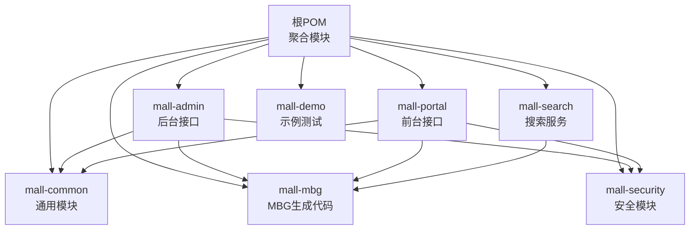
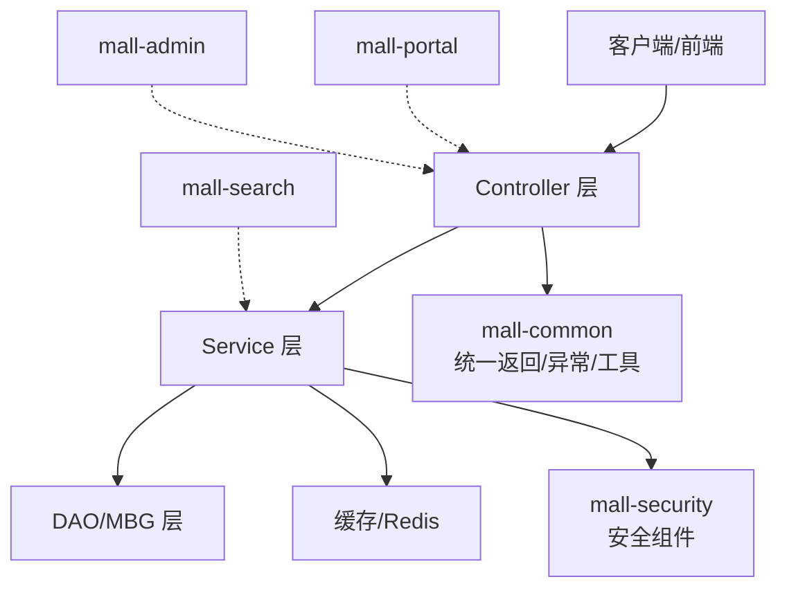
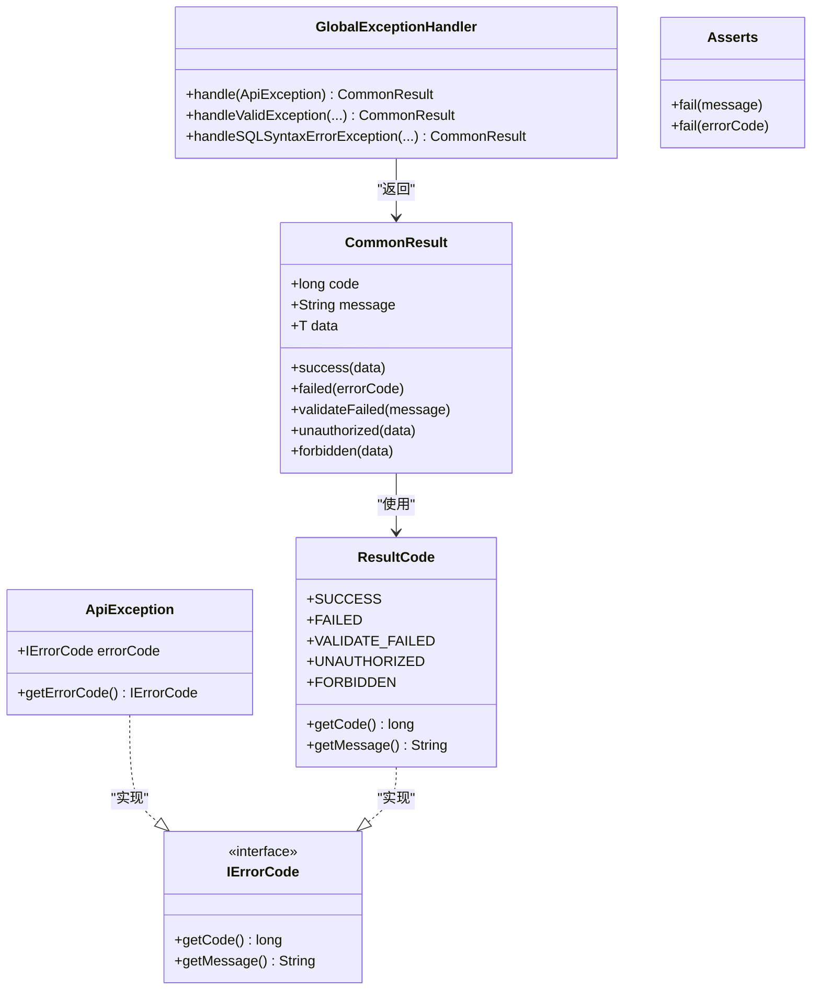
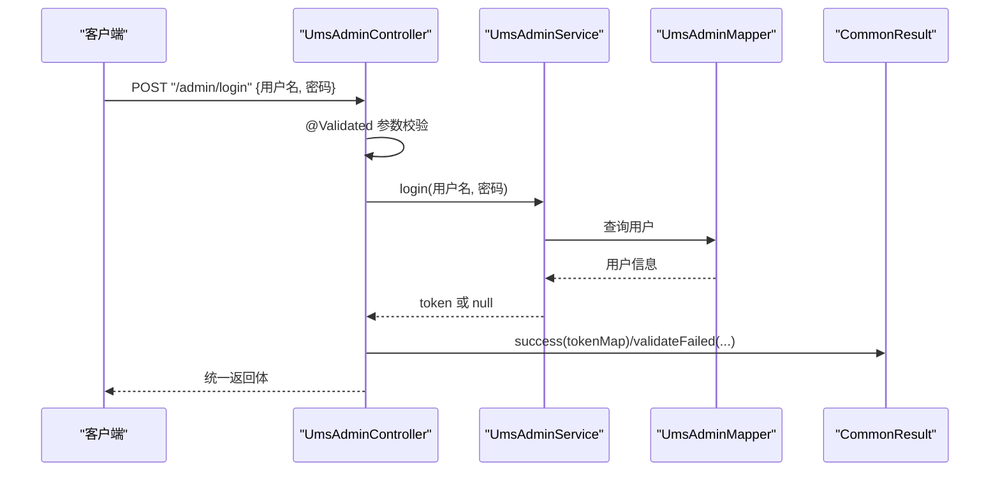
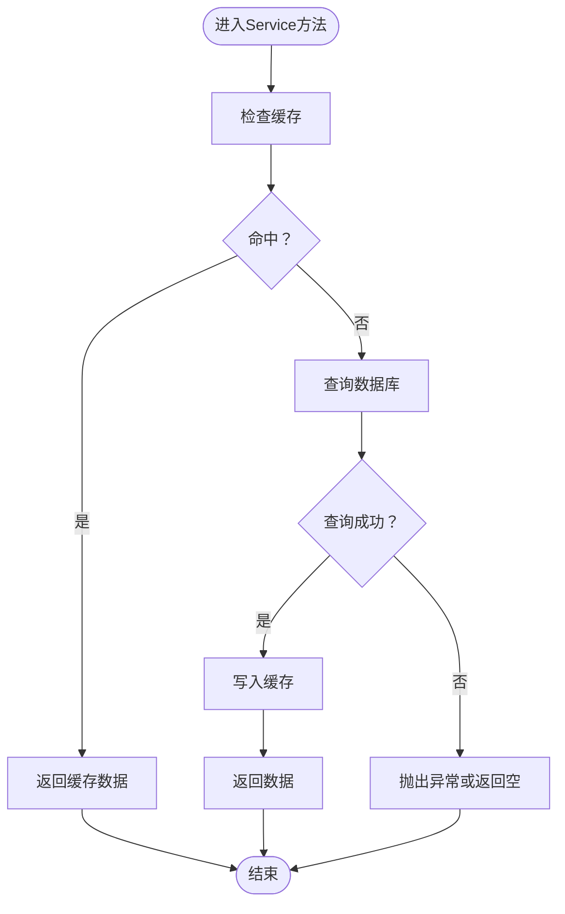
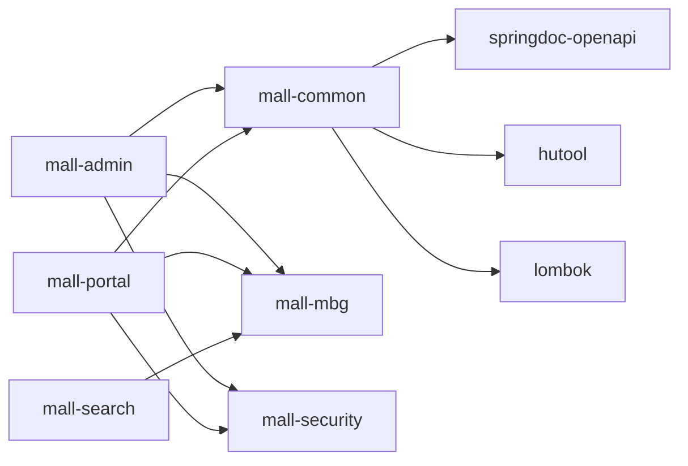

# 代码规范

<cite>
**本文引用的文件**
- [README.md](file://README.md)
- [pom.xml](file://pom.xml)
- [mall-common/src/main/java/com/macro/mall/common/api/CommonResult.java](file://mall-common/src/main/java/com/macro/mall/common/api/CommonResult.java)
- [mall-common/src/main/java/com/macro/mall/common/api/IErrorCode.java](file://mall-common/src/main/java/com/macro/mall/common/api/IErrorCode.java)
- [mall-common/src/main/java/com/macro/mall/common/api/ResultCode.java](file://mall-common/src/main/java/com/macro/mall/common/api/ResultCode.java)
- [mall-common/src/main/java/com/macro/mall/common/exception/GlobalExceptionHandler.java](file://mall-common/src/main/java/com/macro/mall/common/exception/GlobalExceptionHandler.java)
- [mall-common/src/main/java/com/macro/mall/common/exception/ApiException.java](file://mall-common/src/main/java/com/macro/mall/common/exception/ApiException.java)
- [mall-common/src/main/java/com/macro/mall/common/exception/Asserts.java](file://mall-common/src/main/java/com/macro/mall/common/exception/Asserts.java)
- [mall-common/src/main/java/com/macro/mall/common/util/RequestUtil.java](file://mall-common/src/main/java/com/macro/mall/common/util/RequestUtil.java)
- [mall-admin/src/main/java/com/macro/mall/MallAdminApplication.java](file://mall-admin/src/main/java/com/macro/mall/MallAdminApplication.java)
- [mall-portal/src/main/java/com/macro/mall/portal/MallPortalApplication.java](file://mall-portal/src/main/java/com/macro/mall/portal/MallPortalApplication.java)
- [mall-admin/src/main/java/com/macro/mall/controller/UmsAdminController.java](file://mall-admin/src/main/java/com/macro/mall/controller/UmsAdminController.java)
- [mall-admin/src/main/java/com/macro/mall/service/impl/UmsAdminServiceImpl.java](file://mall-admin/src/main/java/com/macro/mall/service/impl/UmsAdminServiceImpl.java)
- [mall-admin/src/main/java/com/macro/mall/dto/UmsAdminLoginParam.java](file://mall-admin/src/main/java/com/macro/mall/dto/UmsAdminLoginParam.java)
</cite>

## 目录
1. [引言](#引言)
2. [项目结构](#项目结构)
3. [核心组件](#核心组件)
4. [架构总览](#架构总览)
5. [详细组件分析](#详细组件分析)
6. [依赖分析](#依赖分析)
7. [性能考虑](#性能考虑)
8. [故障排查指南](#故障排查指南)
9. [结论](#结论)
10. [附录](#附录)

## 引言
本文件旨在为Mall项目制定统一的Java编码规范，覆盖命名约定、注释规范、代码格式化规则、Controller/Service/DAO层组织方式、注解最佳实践、代码审查清单以及IDE与格式化工具配置建议。规范以项目现有实现为依据，结合Spring Boot与MyBatis生态的最佳实践，确保团队协作一致性与代码质量。

## 项目结构
Mall采用多模块聚合工程，核心模块包括：
- mall-common：通用API、异常、日志切面、工具类等
- mall-mbg：MyBatis Generator生成的Mapper与Model
- mall-security：安全相关组件（JWT、动态权限过滤等）
- mall-admin：后台管理接口
- mall-portal：前台商城接口
- mall-search：搜索服务
- mall-demo：框架搭建测试代码

**图表来源**
- [pom.xml:12-20](file://pom.xml#L12-L20)
- [README.md:51-62](file://README.md#L51-L62)

**章节来源**
- [README.md:51-62](file://README.md#L51-L62)
- [pom.xml:12-20](file://pom.xml#L12-L20)

## 核心组件
- 统一返回体：CommonResult<T>，配合IErrorCode与ResultCode枚举，提供SUCCESS/FAILED/VALIDATE_FAILED/UNAUTHORIZED/FORBIDDEN等标准响应。
- 全局异常处理：GlobalExceptionHandler，集中处理参数校验异常、SQL语法异常、自定义ApiException等。
- 请求工具：RequestUtil，提取请求真实IP，兼容多级代理场景。
- 应用入口：MallAdminApplication、MallPortalApplication，分别作为后台与前台服务的启动类。

**章节来源**
- [mall-common/src/main/java/com/macro/mall/common/api/CommonResult.java:1-134](file://mall-common/src/main/java/com/macro/mall/common/api/CommonResult.java#L1-L134)
- [mall-common/src/main/java/com/macro/mall/common/api/IErrorCode.java:1-18](file://mall-common/src/main/java/com/macro/mall/common/api/IErrorCode.java#L1-L18)
- [mall-common/src/main/java/com/macro/mall/common/api/ResultCode.java:1-29](file://mall-common/src/main/java/com/macro/mall/common/api/ResultCode.java#L1-L29)
- [mall-common/src/main/java/com/macro/mall/common/exception/GlobalExceptionHandler.java:1-69](file://mall-common/src/main/java/com/macro/mall/common/exception/GlobalExceptionHandler.java#L1-L69)
- [mall-common/src/main/java/com/macro/mall/common/util/RequestUtil.java:1-48](file://mall-common/src/main/java/com/macro/mall/common/util/RequestUtil.java#L1-L48)
- [mall-admin/src/main/java/com/macro/mall/MallAdminApplication.java:1-16](file://mall-admin/src/main/java/com/macro/mall/MallAdminApplication.java#L1-L16)
- [mall-portal/src/main/java/com/macro/mall/portal/MallPortalApplication.java:1-14](file://mall-portal/src/main/java/com/macro/mall/portal/MallPortalApplication.java#L1-L14)

## 架构总览
Mall遵循分层架构：Controller负责HTTP请求接入与参数校验；Service封装业务逻辑；DAO/MBG负责数据访问；Security提供认证与鉴权；Common提供统一返回与异常处理；Portal/Admin/Search分别承载不同业务域。

**图表来源**
- [mall-admin/src/main/java/com/macro/mall/controller/UmsAdminController.java:1-192](file://mall-admin/src/main/java/com/macro/mall/controller/UmsAdminController.java#L1-L192)
- [mall-admin/src/main/java/com/macro/mall/service/impl/UmsAdminServiceImpl.java:1-288](file://mall-admin/src/main/java/com/macro/mall/service/impl/UmsAdminServiceImpl.java#L1-L288)
- [mall-common/src/main/java/com/macro/mall/common/exception/GlobalExceptionHandler.java:1-69](file://mall-common/src/main/java/com/macro/mall/common/exception/GlobalExceptionHandler.java#L1-L69)

## 详细组件分析

### 统一返回与异常体系
- 统一返回体：CommonResult<T>，提供success/failure/validateFailed/unauthorized/forbidden静态工厂方法，便于Controller层标准化输出。
- 错误码接口：IErrorCode与ResultCode枚举，统一错误码与消息。
- 全局异常：GlobalExceptionHandler集中捕获参数校验异常、绑定异常、SQL语法异常与自定义ApiException，转换为统一返回体。
- 断言工具：Asserts.fail，简化业务断言与异常抛出。

**图表来源**
- [mall-common/src/main/java/com/macro/mall/common/api/CommonResult.java:1-134](file://mall-common/src/main/java/com/macro/mall/common/api/CommonResult.java#L1-L134)
- [mall-common/src/main/java/com/macro/mall/common/api/IErrorCode.java:1-18](file://mall-common/src/main/java/com/macro/mall/common/api/IErrorCode.java#L1-L18)
- [mall-common/src/main/java/com/macro/mall/common/api/ResultCode.java:1-29](file://mall-common/src/main/java/com/macro/mall/common/api/ResultCode.java#L1-L29)
- [mall-common/src/main/java/com/macro/mall/common/exception/GlobalExceptionHandler.java:1-69](file://mall-common/src/main/java/com/macro/mall/common/exception/GlobalExceptionHandler.java#L1-L69)
- [mall-common/src/main/java/com/macro/mall/common/exception/ApiException.java:1-33](file://mall-common/src/main/java/com/macro/mall/common/exception/ApiException.java#L1-L33)
- [mall-common/src/main/java/com/macro/mall/common/exception/Asserts.java:1-18](file://mall-common/src/main/java/com/macro/mall/common/exception/Asserts.java#L1-L18)

**章节来源**
- [mall-common/src/main/java/com/macro/mall/common/api/CommonResult.java:1-134](file://mall-common/src/main/java/com/macro/mall/common/api/CommonResult.java#L1-L134)
- [mall-common/src/main/java/com/macro/mall/common/api/IErrorCode.java:1-18](file://mall-common/src/main/java/com/macro/mall/common/api/IErrorCode.java#L1-L18)
- [mall-common/src/main/java/com/macro/mall/common/api/ResultCode.java:1-29](file://mall-common/src/main/java/com/macro/mall/common/api/ResultCode.java#L1-L29)
- [mall-common/src/main/java/com/macro/mall/common/exception/GlobalExceptionHandler.java:1-69](file://mall-common/src/main/java/com/macro/mall/common/exception/GlobalExceptionHandler.java#L1-L69)
- [mall-common/src/main/java/com/macro/mall/common/exception/ApiException.java:1-33](file://mall-common/src/main/java/com/macro/mall/common/exception/ApiException.java#L1-L33)
- [mall-common/src/main/java/com/macro/mall/common/exception/Asserts.java:1-18](file://mall-common/src/main/java/com/macro/mall/common/exception/Asserts.java#L1-L18)

### Controller层规范
- 注解使用
  - 类级别：@Controller/@RestController（按需选择），@RequestMapping定义模块前缀，@Tag标注OpenAPI标签。
  - 方法级别：@ResponseBody（若类上非@RestController），@RequestMapping指定HTTP方法与路径，@Validated/@Valid配合参数对象进行Bean验证。
  - 配置注入：@Value读取配置项。
- 参数与返回
  - DTO入参：UmsAdminLoginParam等参数对象，使用Jakarta Validation注解（如@NotEmpty）。
  - 分页：CommonPage.restPage封装分页结果。
  - 返回：统一使用CommonResult.success()/failed()/validateFailed()等。
- 安全与上下文
  - Principal获取当前用户，HttpServletRequest读取请求头与参数。
- 示例参考：UmsAdminController对注册、登录、刷新令牌、查询、更新、删除、角色管理等接口的实现。

**图表来源**
- [mall-admin/src/main/java/com/macro/mall/controller/UmsAdminController.java:1-192](file://mall-admin/src/main/java/com/macro/mall/controller/UmsAdminController.java#L1-L192)
- [mall-admin/src/main/java/com/macro/mall/service/impl/UmsAdminServiceImpl.java:1-288](file://mall-admin/src/main/java/com/macro/mall/service/impl/UmsAdminServiceImpl.java#L1-L288)
- [mall-common/src/main/java/com/macro/mall/common/api/CommonResult.java:1-134](file://mall-common/src/main/java/com/macro/mall/common/api/CommonResult.java#L1-L134)

**章节来源**
- [mall-admin/src/main/java/com/macro/mall/controller/UmsAdminController.java:1-192](file://mall-admin/src/main/java/com/macro/mall/controller/UmsAdminController.java#L1-L192)
- [mall-admin/src/main/java/com/macro/mall/dto/UmsAdminLoginParam.java:1-20](file://mall-admin/src/main/java/com/macro/mall/dto/UmsAdminLoginParam.java#L1-L20)

### Service层规范
- 注解使用：@Service声明服务实现类，@Autowired注入依赖。
- 业务逻辑：围绕领域模型（如UmsAdmin、UmsRole、UmsResource）进行增删改查、权限加载、登录日志记录等。
- 缓存策略：优先从缓存获取，缺失则回源数据库并写入缓存；变更后清理对应缓存键。
- 安全与日志：PasswordEncoder进行密码匹配与加密；记录登录日志；全局异常通过Asserts抛出。
- 分页：PageHelper.startPage进行分页控制。
- 示例参考：UmsAdminServiceImpl对用户注册、登录、刷新令牌、列表查询、更新、删除、角色分配、密码修改、资源列表加载等的实现。

**图表来源**
- [mall-admin/src/main/java/com/macro/mall/service/impl/UmsAdminServiceImpl.java:1-288](file://mall-admin/src/main/java/com/macro/mall/service/impl/UmsAdminServiceImpl.java#L1-L288)

**章节来源**
- [mall-admin/src/main/java/com/macro/mall/service/impl/UmsAdminServiceImpl.java:1-288](file://mall-admin/src/main/java/com/macro/mall/service/impl/UmsAdminServiceImpl.java#L1-L288)

### DAO/MBG层规范
- 生成代码：MBG生成的Mapper接口与Model类位于mall-mbg模块，遵循表结构映射。
- DAO扩展：部分复杂查询可通过Dao接口扩展，结合XML映射或批量插入工具。
- 事务与一致性：跨表更新建议在Service层组合调用，避免直接在DAO层分散事务边界。

**章节来源**
- [README.md:56-57](file://README.md#L56-L57)

### 应用入口与扫描范围
- mall-admin：SpringBootApplication默认扫描，无需额外配置。
- mall-portal：显式指定scanBasePackages为com.macro.mall，确保组件扫描范围一致。

**章节来源**
- [mall-admin/src/main/java/com/macro/mall/MallAdminApplication.java:1-16](file://mall-admin/src/main/java/com/macro/mall/MallAdminApplication.java#L1-L16)
- [mall-portal/src/main/java/com/macro/mall/portal/MallPortalApplication.java:1-14](file://mall-portal/src/main/java/com/macro/mall/portal/MallPortalApplication.java#L1-L14)

## 依赖分析
- 版本与依赖管理：根POM集中管理Spring Boot版本、MyBatis/MBG、PageHelper、Hutool、Lombok、OpenAPI等依赖。
- 模块间依赖：mall-admin与mall-portal均依赖mall-common与mall-mbg；安全相关依赖mall-security；搜索服务依赖mall-mbg。

**图表来源**
- [pom.xml:93-194](file://pom.xml#L93-L194)

**章节来源**
- [pom.xml:93-194](file://pom.xml#L93-L194)

## 性能考虑
- 缓存优先：Service层对高频读取（用户、资源列表）采用缓存，减少数据库压力。
- 分页优化：使用PageHelper进行物理分页，避免一次性加载大结果集。
- 日志与监控：统一异常处理与Web日志切面，便于定位性能瓶颈。
- 数据库连接池：通过Druid Starter配置连接池参数，合理设置最大连接数与超时时间。

## 故障排查指南
- 参数校验失败：GlobalExceptionHandler将MethodArgumentNotValidException/BingException转换为统一的validateFailed响应，检查DTO字段注解与前端传参。
- SQL语法异常：对演示环境的“denied”提示进行特殊处理，确认数据库权限与SQL语句。
- 自定义异常：通过Asserts.fail或ApiException抛出自定义错误码，确保错误信息清晰可追踪。
- 登录失败：核对用户名是否存在、密码是否匹配、账户是否启用；检查JWT生成与Security上下文设置。

**章节来源**
- [mall-common/src/main/java/com/macro/mall/common/exception/GlobalExceptionHandler.java:1-69](file://mall-common/src/main/java/com/macro/mall/common/exception/GlobalExceptionHandler.java#L1-L69)
- [mall-common/src/main/java/com/macro/mall/common/exception/ApiException.java:1-33](file://mall-common/src/main/java/com/macro/mall/common/exception/ApiException.java#L1-L33)
- [mall-common/src/main/java/com/macro/mall/common/exception/Asserts.java:1-18](file://mall-common/src/main/java/com/macro/mall/common/exception/Asserts.java#L1-L18)

## 结论
本规范以Mall现有实现为基础，明确了命名、注释、格式化、分层组织与注解使用规范，并提供了统一返回与异常处理、缓存策略、分页与日志等最佳实践。建议在日常开发中严格遵循，持续通过代码审查与工具化手段保障代码质量与一致性。

## 附录

### Java编码规范与命名约定
- 包名：com.macro.mall.模块名（小写）
- 类名：名词或复合词，首字母大写；接口以I开头（如IErrorCode）
- 方法名：动词短语，驼峰命名；布尔方法以is/get开头
- 字段名：驼峰命名；私有字段不以下划线开头
- 常量名：全大写，单词以下划线分隔
- DTO/VO/POJO：使用Lombok注解@Data/@Builder/@With等简化样板代码
- 注释：类/方法使用JavaDoc；复杂逻辑添加行内注释说明

### 注释规范
- 类注释：简述职责与关键行为
- 方法注释：参数、返回值、异常、注意事项
- 字段注释：业务含义、取值范围、约束条件
- TODO/NOTE：使用标准注释标记待办与注意点

### 代码格式化规则
- 缩进：4空格
- 行宽：120字符
- 空行：类成员之间、逻辑分组之间适当空行
- 导入：按包顺序分组，通配符导入仅用于测试

### Controller/Service/DAO层组织方式
- Controller：仅处理HTTP请求、参数校验、调用Service、组装统一返回
- Service：封装业务规则、事务边界、缓存与日志
- DAO/MBG：数据访问、Mapper/Model映射、复杂SQL与批量操作

### 注解使用最佳实践
- @RestController/@Controller：REST接口优先使用@RestController，普通Controller配合@ResponseBody
- @RequestMapping：类级别定义模块前缀，方法级别定义HTTP方法与路径
- @Valid/@Validated：参数对象使用@Validated，单个参数使用@Valid
- @Service/@Repository/@Component：服务层使用@Service，持久层使用@Repository（MBG已生成）
- @Autowired：构造函数注入优先，其次字段注入；避免重复注入
- @Value：读取配置属性，配合@PropertySource或application.yml
- @Enable*：按需开启AOP、定时任务、Swagger等

### 代码审查检查清单
- 是否使用统一返回体与错误码
- 是否存在硬编码字符串与魔法数字
- 是否使用DTO接收参数并进行校验
- 是否存在重复代码与过长方法
- 是否正确使用缓存与事务
- 是否有充足的单元测试与集成测试
- 是否遵循包结构与命名约定
- 是否使用Lombok简化样板代码且保持可读性

### IDE配置与格式化工具
- IntelliJ IDEA
  - 设置：Editor -> Code Style -> Java，Tab改为4空格，Right Margin 120
  - Lombok插件启用，勾选“generate hashCode and equals”
  - Annotation Processing启用，允许Maven项目运行时处理注解
  - Save Actions：勾选“Optimize imports”、“Run Lombok”
- Maven格式化插件（google-java-format或spotless）可在CI中强制执行格式化
- Pre-commit钩子：结合Spotless或Google Java Format，保证提交前格式化