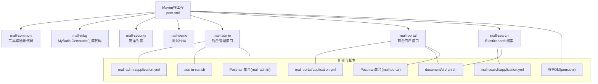
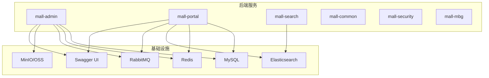
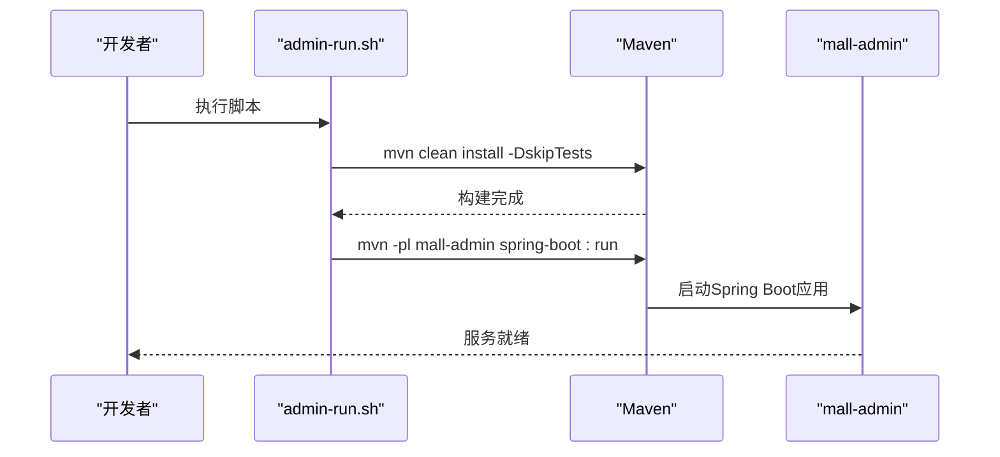
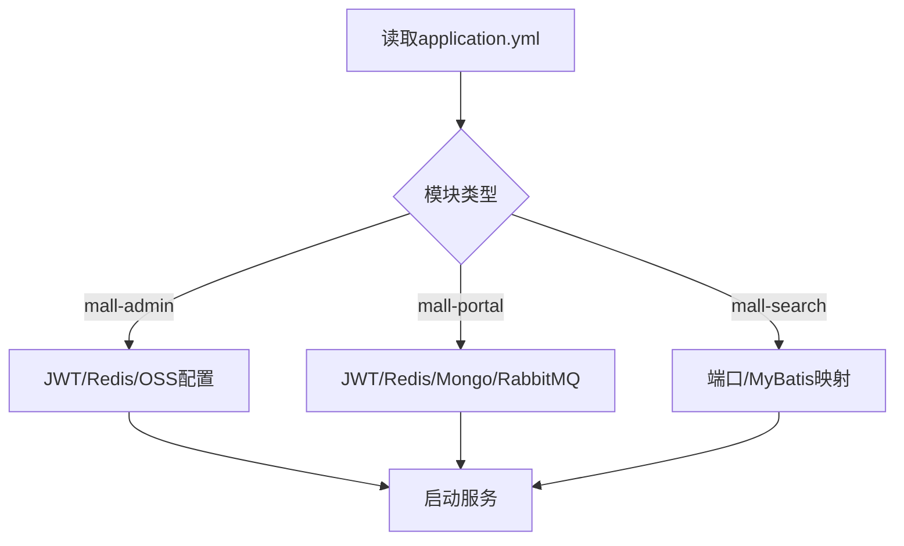
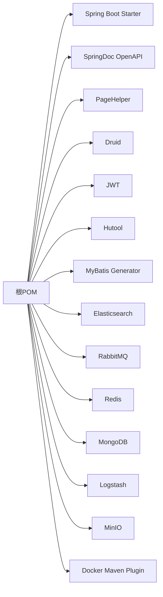

# 开发工具

<cite>
**本文引用的文件**
- [README.md](file://README.md)
- [开发快捷键指南(shortcut.md)](file://document/reference/shortcut.md)
- [Windows环境搭建(deploy-windows.md)](file://document/reference/deploy-windows.md)
- [Docker入门手册(docker.md)](file://document/reference/docker.md)
- [mall-admin应用配置(application.yml)](file://mall-admin/src/main/resources/application.yml)
- [mall-portal应用配置(application.yml)](file://mall-portal/src/main/resources/application.yml)
- [mall-search应用配置(application.yml)](file://mall-search/src/main/resources/application.yml)
- [Maven总POM(pom.xml)](file://pom.xml)
- [admin-run.sh](file://admin-run.sh)
- [run.sh](file://document/sh/run.sh)
- [Postman集合(mall-admin)](file://document/postman/mall-admin.postman_collection.json)
- [Postman集合(mall-portal)](file://document/postman/mall-portal.postman_collection.json)
</cite>

## 目录
1. [简介](#简介)
2. [项目结构](#项目结构)
3. [核心组件](#核心组件)
4. [架构概览](#架构概览)
5. [详细组件分析](#详细组件分析)
6. [依赖分析](#依赖分析)
7. [性能考虑](#性能考虑)
8. [故障排查指南](#故障排查指南)
9. [结论](#结论)
10. [附录](#附录)

## 简介
本指南面向Mall项目的开发者，提供一套完整的开发工具推荐与使用方法，覆盖IDE（IntelliJ IDEA、Eclipse）、数据库工具（Navicat、DBeaver、Robo 3T）、API测试工具（Postman、Swagger UI）、版本控制工具（Git Tower、SourceTree），以及命令行与脚本工具。同时给出IDE快捷键迁移策略、命令行效率技巧、项目脚本使用说明、插件推荐与配置建议，以及开发环境优化与性能调优方向。

## 项目结构
Mall为多模块Maven工程，包含后台管理、前台门户、搜索、通用模块、安全模块、MBG代码生成模块与演示模块。各模块独立运行，共享公共配置与依赖。

**图表来源**
- [Maven总POM(pom.xml)](file://pom.xml)
- [mall-admin应用配置(application.yml)](file://mall-admin/src/main/resources/application.yml)
- [mall-portal应用配置(application.yml)](file://mall-portal/src/main/resources/application.yml)
- [mall-search应用配置(application.yml)](file://mall-search/src/main/resources/application.yml)
- [admin-run.sh](file://admin-run.sh)
- [run.sh](file://document/sh/run.sh)
- [Postman集合(mall-admin)](file://document/postman/mall-admin.postman_collection.json)
- [Postman集合(mall-portal)](file://document/postman/mall-portal.postman_collection.json)

**章节来源**
- [README.md](file://README.md)
- [Maven总POM(pom.xml)](file://pom.xml)

## 核心组件
- IDE：推荐IntelliJ IDEA，亦可在Eclipse中以Maven项目导入。建议将IDEA快捷键风格迁移为Eclipse风格以提升一致性。
- 数据库工具：Navicat（MySQL）、DBeaver（通用）、Robo 3T（MongoDB）。
- API测试：Postman集合（含后台与前台），结合Swagger UI查看接口文档。
- 版本控制：Git Tower或SourceTree辅助图形化管理。
- 脚本与容器：admin-run.sh用于本地快速启动mall-admin；run.sh用于Docker构建与运行。

**章节来源**
- [README.md](file://README.md)
- [开发快捷键指南(shortcut.md)](file://document/reference/shortcut.md)
- [Windows环境搭建(deploy-windows.md)](file://document/reference/deploy-windows.md)
- [Postman集合(mall-admin)](file://document/postman/mall-admin.postman_collection.json)
- [Postman集合(mall-portal)](file://document/postman/mall-portal.postman_collection.json)

## 架构概览
Mall采用Spring Boot + MyBatis + Docker容器化部署。后台管理与前台门户分别提供REST接口，搜索模块对接Elasticsearch，缓存使用Redis，消息队列使用RabbitMQ，对象存储支持OSS/MinIO，统一通过Swagger UI生成接口文档。

**图表来源**
- [README.md](file://README.md)
- [mall-admin应用配置(application.yml)](file://mall-admin/src/main/resources/application.yml)
- [mall-portal应用配置(application.yml)](file://mall-portal/src/main/resources/application.yml)
- [mall-search应用配置(application.yml)](file://mall-search/src/main/resources/application.yml)

## 详细组件分析

### IDE与快捷键
- 快捷键风格迁移：将IDEA快捷键风格设为Eclipse风格，便于与团队协作一致。
- 常用快捷键要点：文件/类搜索、查找用法、类层级、提取变量/方法、前后导航、行移动/复制、方法注释、生成getter/setter等。
- 插件建议：Lombok（已在项目中使用，需IDE插件支持）。

**章节来源**
- [开发快捷键指南(shortcut.md)](file://document/reference/shortcut.md)
- [Windows环境搭建(deploy-windows.md)](file://document/reference/deploy-windows.md)

### 数据库工具
- MySQL：Navicat或DBeaver均可；导入初始SQL脚本后可直接连接。
- MongoDB：Robo 3T用于连接与管理。
- 建议：统一命名与连接配置，避免跨环境差异。

**章节来源**
- [Windows环境搭建(deploy-windows.md)](file://document/reference/deploy-windows.md)

### API测试工具
- Postman集合：提供后台与前台接口样例，包含登录、商品、订单、购物车、优惠券等场景。
- Swagger UI：通过接口文档查看与调试，便于联调与回归测试。

**章节来源**
- [Postman集合(mall-admin)](file://document/postman/mall-admin.postman_collection.json)
- [Postman集合(mall-portal)](file://document/postman/mall-portal.postman_collection.json)
- [Windows环境搭建(deploy-windows.md)](file://document/reference/deploy-windows.md)

### 版本控制工具
- Git Tower或SourceTree：图形化查看变更、合并冲突、分支管理与提交历史。
- 建议：规范分支命名与提交信息，配合PR审查与自动化检查。

**章节来源**
- [README.md](file://README.md)

### 项目脚本与容器化
- 本地启动脚本：admin-run.sh用于在本地以Maven方式启动mall-admin模块，自动跳过测试并指定JDK 17。
- Docker运行脚本：run.sh用于构建镜像、停止/删除旧容器与镜像、按prod环境启动容器并挂载日志卷。
- Maven配置：根POM定义Java版本、插件版本、Docker插件与镜像仓库配置，支持远程Docker Host。

**图表来源**
- [admin-run.sh](file://admin-run.sh)

**章节来源**
- [admin-run.sh](file://admin-run.sh)
- [run.sh](file://document/sh/run.sh)
- [Maven总POM(pom.xml)](file://pom.xml)

### 配置与环境
- mall-admin：JWT头、白名单、Redis键空间、阿里云OSS配置等。
- mall-portal：JWT头、白名单、Redis键空间、MongoDB开关、RabbitMQ队列等。
- mall-search：端口、MyBatis映射路径等。

**图表来源**
- [mall-admin应用配置(application.yml)](file://mall-admin/src/main/resources/application.yml)
- [mall-portal应用配置(application.yml)](file://mall-portal/src/main/resources/application.yml)
- [mall-search应用配置(application.yml)](file://mall-search/src/main/resources/application.yml)

**章节来源**
- [mall-admin应用配置(application.yml)](file://mall-admin/src/main/resources/application.yml)
- [mall-portal应用配置(application.yml)](file://mall-portal/src/main/resources/application.yml)
- [mall-search应用配置(application.yml)](file://mall-search/src/main/resources/application.yml)

## 依赖分析
- 语言与框架：Java 17 + Spring Boot 3.2 + MyBatis。
- 核心依赖：SpringDoc OpenAPI、PageHelper、Druid、JWT、Hutool、MyBatis Generator、Elasticsearch、RabbitMQ、Redis、MongoDB、Logstash、MinIO等。
- Docker插件：fabric8 docker-maven-plugin，支持远程Docker Host与镜像构建。

**图表来源**
- [Maven总POM(pom.xml)](file://pom.xml)

**章节来源**
- [Maven总POM(pom.xml)](file://pom.xml)

## 性能考虑
- JVM与编译：使用JDK 17，确保编译参数与运行环境一致。
- 数据库：使用Druid连接池，结合慢查询与监控。
- 缓存：Redis键空间与过期策略需与业务匹配，避免热点Key。
- 搜索：Elasticsearch索引与分片策略、IK分词器配置。
- 消息：RabbitMQ队列与死信交换配置，保证可靠性投递。
- 日志：Logstash + ELK链路采集，注意采样与脱敏。
- 容器：合理设置容器CPU/内存限制与健康检查。

[本节为通用指导，无需特定文件引用]

## 故障排查指南
- 启动失败
  - 检查JDK版本与Maven参数是否与脚本一致。
  - 确认数据库、Redis、ES、MQ连通性。
  - 查看容器日志与宿主机Docker日志。
- 接口异常
  - 使用Postman集合验证鉴权与参数。
  - 通过Swagger UI核对路径与模型。
- Docker问题
  - 使用run.sh清理旧容器/镜像后再试。
  - 检查远程Docker Host配置与防火墙。
- 快捷键不一致
  - 将IDEA快捷键风格迁移为Eclipse风格。

**章节来源**
- [admin-run.sh](file://admin-run.sh)
- [run.sh](file://document/sh/run.sh)
- [Windows环境搭建(deploy-windows.md)](file://document/reference/deploy-windows.md)
- [开发快捷键指南(shortcut.md)](file://document/reference/shortcut.md)

## 结论
通过统一的开发工具链（IDE、数据库、API测试、版本控制、脚本与容器化），结合规范的快捷键与配置管理，可显著提升Mall项目的开发效率与稳定性。建议团队在本地与CI环境中保持工具版本一致，并持续优化容器与中间件配置。

[本节为总结，无需特定文件引用]

## 附录

### 开发工具推荐清单
- IDE：IntelliJ IDEA（推荐）；Eclipse（可选）。
- 数据库：Navicat（MySQL）、DBeaver（通用）、Robo 3T（MongoDB）。
- API测试：Postman（集合已提供）、Swagger UI。
- 版本控制：Git Tower、SourceTree。
- 命令行：Docker CLI、kubectl（如需K8s）、Shell脚本。

**章节来源**
- [README.md](file://README.md)
- [Postman集合(mall-admin)](file://document/postman/mall-admin.postman_collection.json)
- [Postman集合(mall-portal)](file://document/postman/mall-portal.postman_collection.json)

### 快捷键迁移与效率技巧
- IDEA快捷键风格迁移为Eclipse风格，统一团队协作体验。
- 常用技巧：文件/类搜索、查找用法、提取变量/方法、前后导航、行移动/复制、方法注释、生成getter/setter。
- 命令行：Docker常用命令、容器状态查看、日志查看、进入容器交互。

**章节来源**
- [开发快捷键指南(shortcut.md)](file://document/reference/shortcut.md)
- [Docker入门手册(docker.md)](file://document/reference/docker.md)

### 项目脚本使用说明
- admin-run.sh：本地快速启动mall-admin模块，自动跳过测试并指定JDK 17。
- run.sh：Docker构建与运行脚本，支持停止/删除旧容器与镜像、按prod环境启动并挂载日志卷。
- Maven：根POM定义Java版本、插件版本、Docker插件与镜像仓库配置。

**章节来源**
- [admin-run.sh](file://admin-run.sh)
- [run.sh](file://document/sh/run.sh)
- [Maven总POM(pom.xml)](file://pom.xml)

### 插件推荐与配置建议
- 代码格式化：使用IDE内置格式化或统一的checkstyle/spotless配置。
- Git：SourceTree/Git Tower图形化管理，建议开启自动提交前检查。
- REST Client：IDE内置REST Client或VS Code REST Client插件，便于接口调试。
- Lombok：确保IDE安装Lombok插件并启用注解处理。

**章节来源**
- [Windows环境搭建(deploy-windows.md)](file://document/reference/deploy-windows.md)