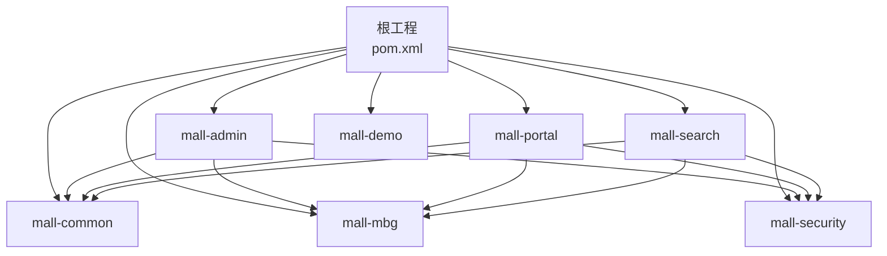
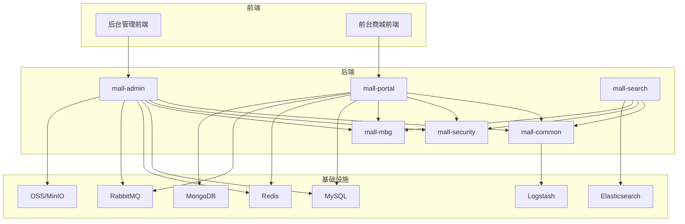
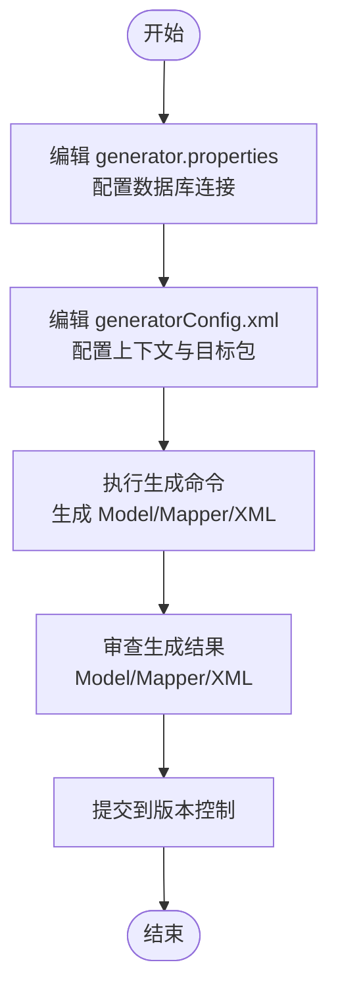
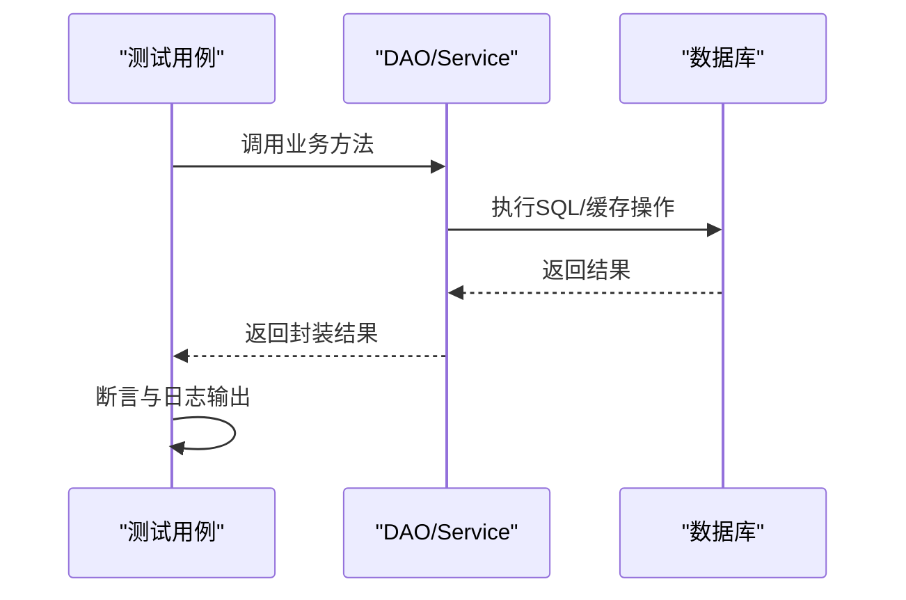
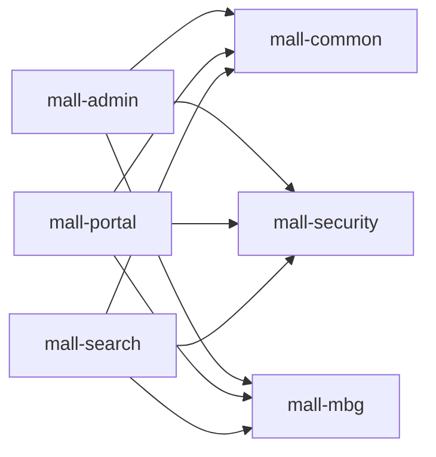

# 开发指南

<cite>
**本文引用的文件**
- [README.md](file://README.md)
- [pom.xml](file://pom.xml)
- [mall-mbg/src/main/resources/generatorConfig.xml](file://mall-mbg/src/main/resources/generatorConfig.xml)
- [mall-mbg/src/main/resources/generator.properties](file://mall-mbg/src/main/resources/generator.properties)
- [mall-common/src/main/resources/logback-spring.xml](file://mall-common/src/main/resources/logback-spring.xml)
- [mall-common/src/main/java/com/macro/mall/common/api/CommonResult.java](file://mall-common/src/main/java/com/macro/mall/common/api/CommonResult.java)
- [mall-common/src/main/java/com/macro/mall/common/exception/GlobalExceptionHandler.java](file://mall-common/src/main/java/com/macro/mall/common/exception/GlobalExceptionHandler.java)
- [mall-admin/src/main/resources/application.yml](file://mall-admin/src/main/resources/application.yml)
- [mall-portal/src/main/resources/application.yml](file://mall-portal/src/main/resources/application.yml)
- [mall-admin/src/main/java/com/macro/mall/MallAdminApplication.java](file://mall-admin/src/main/java/com/macro/mall/MallAdminApplication.java)
- [mall-portal/src/main/java/com/macro/mall/portal/MallPortalApplication.java](file://mall-portal/src/main/java/com/macro/mall/portal/MallPortalApplication.java)
- [mall-admin/src/test/com/macro/mall/PmsDaoTests.java](file://mall-admin/src/test/com/macro/mall/PmsDaoTests.java)
- [document/reference/dev_flow.md](file://document/reference/dev_flow.md)
- [document/reference/shortcut.md](file://document/reference/shortcut.md)
- [document/reference/function.md](file://document/reference/function.md)
</cite>

## 目录
1. [简介](#简介)
2. [项目结构](#项目结构)
3. [核心组件](#核心组件)
4. [架构总览](#架构总览)
5. [详细组件分析](#详细组件分析)
6. [依赖分析](#依赖分析)
7. [性能考虑](#性能考虑)
8. [故障排查指南](#故障排查指南)
9. [结论](#结论)
10. [附录](#附录)

## 简介
本指南面向参与 Mall 项目的开发者，提供统一的代码规范与开发流程，涵盖命名约定、注释规范、代码结构、MyBatis Generator 使用与数据库模型生成流程、开发环境配置与调试技巧、单元测试与集成测试编写指南、扩展开发方法（新功能添加、第三方集成、性能优化），以及开发工具推荐与快捷键使用建议。目标是帮助团队保持一致的工程实践，提升开发效率与质量。

## 项目结构
Mall 采用多模块 Maven 结构，主要模块包括：
- mall-common：通用工具、异常与日志、统一返回体等
- mall-mbg：MyBatis Generator 生成的数据库操作代码与配置
- mall-security：安全模块（认证、授权、过滤器、JWT 等）
- mall-admin：后台管理系统接口
- mall-portal：前台商城系统接口
- mall-search：基于 Elasticsearch 的搜索服务
- mall-demo：框架搭建时的测试与示例代码

**图表来源**
- [pom.xml:12-20](file://pom.xml#L12-L20)

**章节来源**
- [README.md:51-62](file://README.md#L51-L62)
- [pom.xml:12-20](file://pom.xml#L12-L20)

## 核心组件
- 统一返回体与错误码：通过通用返回体封装响应结构，配合错误码与全局异常处理器，保证接口一致性与可读性。
- 全局异常处理：集中处理校验异常、SQL 异常与业务异常，统一返回标准结构。
- 日志体系：基于 Logback 的多通道输出，支持文件滚动与 ELK（Logstash）采集，便于问题定位与审计。
- 配置中心：各模块通过 application.yml 配置 MyBatis Mapper、JWT、Redis、白名单等关键参数。

**章节来源**
- [mall-common/src/main/java/com/macro/mall/common/api/CommonResult.java:1-134](file://mall-common/src/main/java/com/macro/mall/common/api/CommonResult.java#L1-L134)
- [mall-common/src/main/java/com/macro/mall/common/exception/GlobalExceptionHandler.java:1-69](file://mall-common/src/main/java/com/macro/mall/common/exception/GlobalExceptionHandler.java#L1-L69)
- [mall-common/src/main/resources/logback-spring.xml:1-203](file://mall-common/src/main/resources/logback-spring.xml#L1-L203)
- [mall-admin/src/main/resources/application.yml:1-66](file://mall-admin/src/main/resources/application.yml#L1-L66)
- [mall-portal/src/main/resources/application.yml:1-62](file://mall-portal/src/main/resources/application.yml#L1-L62)

## 架构总览
系统采用前后端分离架构，后端通过 Spring Boot + MyBatis 提供 REST 接口，结合 Redis、RabbitMQ、Elasticsearch、MongoDB、OSS 等中间件支撑业务能力。日志通过 Logback 输出并接入 ELK，便于集中化观测与分析。

**图表来源**
- [README.md:64-91](file://README.md#L64-L91)
- [mall-common/src/main/resources/logback-spring.xml:63-178](file://mall-common/src/main/resources/logback-spring.xml#L63-L178)

## 详细组件分析

### 代码规范与结构
- 包结构与职责
  - controller：接收请求、参数校验、调用 service、返回统一结果
  - service：业务逻辑编排，事务边界控制
  - impl：具体实现类，遵循接口隔离
  - dao：Mapper 接口，与 MBG 生成的映射文件配合
  - dto：传输对象，避免直接暴露持久化模型
  - bo：业务对象，用于复杂组装
  - config：Spring 配置类（跨域、安全、MyBatis、OSS 等）
  - exception：异常定义与全局异常处理
  - log：切面日志记录
  - validator：参数校验注解与实现
- 命名约定
  - 类名：大驼峰，如 XxxService、XxxController
  - 方法名：小驼峰，如 doSomething()
  - 常量：全大写+下划线，如 MAX_SIZE
  - 包名：全小写，如 com.macro.mall.module
- 注释规范
  - 类与公共方法建议提供简要说明
  - 复杂逻辑处补充注释，说明输入、输出与约束
  - DTO/BO 字段建议标注用途与取值范围
- 返回体与异常
  - 统一使用通用返回体封装，避免裸抛异常
  - 业务异常通过 IErrorCode 或 ApiException 统一封装

**章节来源**
- [mall-common/src/main/java/com/macro/mall/common/api/CommonResult.java:1-134](file://mall-common/src/main/java/com/macro/mall/common/api/CommonResult.java#L1-L134)
- [mall-common/src/main/java/com/macro/mall/common/exception/GlobalExceptionHandler.java:1-69](file://mall-common/src/main/java/com/macro/mall/common/exception/GlobalExceptionHandler.java#L1-L69)

### MyBatis Generator 使用与数据库模型生成
- 生成器配置
  - generatorConfig.xml：定义上下文、注释生成器、数据库连接、目标包与表策略
  - generator.properties：数据库连接参数
- 生成目标
  - Model：实体类
  - Mapper XML：SQL 映射文件
  - Mapper 接口：DAO 层接口
- 生成流程
  - 配置 generator.properties 中的数据库连接
  - 在 mall-mbg 模块执行生成命令（可通过 Maven 插件或独立运行）
  - 生成完成后，将 Model、Mapper XML、Mapper 接口纳入版本控制
- 最佳实践
  - 生成前先备份数据库
  - 生成后检查注释与字段映射，必要时手动调整
  - 生成的 Mapper 接口与 XML 保持一一对应，避免重复或遗漏

**图表来源**
- [mall-mbg/src/main/resources/generatorConfig.xml:1-50](file://mall-mbg/src/main/resources/generatorConfig.xml#L1-L50)
- [mall-mbg/src/main/resources/generator.properties:1-4](file://mall-mbg/src/main/resources/generator.properties#L1-L4)

**章节来源**
- [mall-mbg/src/main/resources/generatorConfig.xml:1-50](file://mall-mbg/src/main/resources/generatorConfig.xml#L1-L50)
- [mall-mbg/src/main/resources/generator.properties:1-4](file://mall-mbg/src/main/resources/generator.properties#L1-L4)

### 开发环境配置与调试技巧
- 开发工具
  - 推荐使用 IDEA，可按 Eclipse 风格设置快捷键，提升开发效率
- 环境准备
  - JDK 17、MySQL 5.7、Redis、RabbitMQ、Elasticsearch、MongoDB、Nginx 等
  - Docker 环境可使用 Compose 快速拉起
- IDE 设置
  - Maven 镜像源加速（阿里云镜像）
  - 编译器版本与编码统一为 17 与 UTF-8
  - 启用 Lombok 支持
- 调试技巧
  - 使用断点定位请求链路，结合全局日志与 ELK 定位问题
  - 通过 application.yml 配置不同环境（dev/prod），按需开启日志级别
  - 使用 Actuator 与 Druid 监控接口状态与 SQL 执行情况

**章节来源**
- [README.md:146-179](file://README.md#L146-L179)
- [document/reference/shortcut.md:1-33](file://document/reference/shortcut.md#L1-L33)
- [pom.xml:262-287](file://pom.xml#L262-L287)
- [mall-admin/src/main/resources/application.yml:1-66](file://mall-admin/src/main/resources/application.yml#L1-L66)
- [mall-portal/src/main/resources/application.yml:1-62](file://mall-portal/src/main/resources/application.yml#L1-L62)

### 单元测试与集成测试编写指南
- 测试层次
  - 单元测试：针对 DAO/Service 的核心逻辑，使用事务与回滚确保隔离性
  - 集成测试：跨模块协作场景，模拟真实请求链路
- 示例
  - DAO 批量插入测试：使用 @Transactional 与 @Rollback 确保测试后回滚
  - 控制器测试：可借助 Spring Boot Test 与 MockMvc（如需）
- 覆盖率要求
  - 建议关键业务路径覆盖率不低于 80%，核心算法不低于 90%
- 日志与断言
  - 使用 SLF4J 输出测试过程与结果，结合断言验证预期

**图表来源**
- [mall-admin/src/test/com/macro/mall/PmsDaoTests.java:1-53](file://mall-admin/src/test/com/macro/mall/PmsDaoTests.java#L1-L53)

**章节来源**
- [mall-admin/src/test/com/macro/mall/PmsDaoTests.java:1-53](file://mall-admin/src/test/com/macro/mall/PmsDaoTests.java#L1-L53)

### 扩展开发方法
- 新功能添加
  - 遵循现有包结构，新增 controller/service/impl/dao/dto
  - 使用统一返回体与异常处理，确保接口一致性
  - 补充 DTO/BO 与参数校验注解
- 第三方集成
  - OSS/MinIO：通过配置文件注入凭据与桶信息
  - RabbitMQ：定义队列与消息结构，确保幂等与重试策略
  - Elasticsearch：按需建立索引与映射，保证数据同步
- 性能优化
  - 使用 Redis 缓存热点数据与鉴权信息
  - 合理分页与索引优化，避免 N+1 查询
  - 异步化耗时操作，降低接口延迟

**章节来源**
- [mall-admin/src/main/resources/application.yml:54-66](file://mall-admin/src/main/resources/application.yml#L54-L66)
- [mall-portal/src/main/resources/application.yml:57-62](file://mall-portal/src/main/resources/application.yml#L57-L62)

## 依赖分析
- 模块依赖
  - mall-admin 与 mall-portal 均依赖 mall-common、mall-security、mall-mbg
  - mall-search 依赖 mall-common、mall-security、mall-mbg
- 外部依赖
  - Spring Boot、MyBatis、MyBatis Generator、PageHelper、Druid、Hutool、Lombok、JWT、Elasticsearch、RabbitMQ、Redis、MongoDB、OSS/MinIO、Logstash 等

**图表来源**
- [pom.xml:12-20](file://pom.xml#L12-L20)

**章节来源**
- [pom.xml:93-194](file://pom.xml#L93-L194)

## 性能考虑
- 数据访问层
  - 使用 PageHelper 实现物理分页，避免一次性加载大量数据
  - 合理使用 MyBatis 的延迟加载与嵌套结果映射
- 缓存策略
  - 使用 Redis 缓存用户会话、资源列表、验证码等高频数据
  - 设定合理的过期时间，避免缓存雪崩
- 搜索与日志
  - Elasticsearch 索引设计与分片副本合理配置
  - 日志按级别分流，生产环境避免过多 DEBUG 输出
- 异步与削峰
  - 使用 RabbitMQ 异步处理下单、通知等耗时任务

[本节为通用指导，无需特定文件引用]

## 故障排查指南
- 统一返回与异常
  - 使用全局异常处理器捕获校验异常与 SQL 异常，返回标准化错误信息
- 日志与可观测性
  - 通过 Logback 输出到文件与 Logstash，结合 Kibana 观察日志
  - Web 访问日志与业务日志分离，便于定位问题
- 常见问题
  - 数据库权限不足：演示环境存在权限限制，需本地搭建或调整权限
  - 跨域与安全白名单：确保 Swagger、静态资源与登录接口在白名单中
  - 文件上传大小限制：根据业务需求调整 multipart 限制

**章节来源**
- [mall-common/src/main/java/com/macro/mall/common/exception/GlobalExceptionHandler.java:1-69](file://mall-common/src/main/java/com/macro/mall/common/exception/GlobalExceptionHandler.java#L1-L69)
- [mall-common/src/main/resources/logback-spring.xml:180-201](file://mall-common/src/main/resources/logback-spring.xml#L180-L201)
- [mall-admin/src/main/resources/application.yml:34-51](file://mall-admin/src/main/resources/application.yml#L34-L51)
- [mall-portal/src/main/resources/application.yml:21-40](file://mall-portal/src/main/resources/application.yml#L21-L40)

## 结论
本指南总结了 Mall 项目的开发规范、生成器使用、环境配置、测试策略与扩展方法。建议团队在日常开发中严格遵循统一的命名与注释规范，使用统一返回体与异常处理，结合日志与监控体系，持续优化性能与稳定性。通过规范化的流程与工具链，提升整体交付质量与效率。

[本节为总结性内容，无需特定文件引用]

## 附录

### 开发流程与功能清单
- 框架搭建与功能完成度参考开发进度文档
- 后台与前台功能模块结构参考功能说明文档

**章节来源**
- [document/reference/dev_flow.md:1-330](file://document/reference/dev_flow.md#L1-L330)
- [document/reference/function.md:1-27](file://document/reference/function.md#L1-L27)

### 启动入口与模块配置
- mall-admin 与 mall-portal 的启动入口类分别位于各自模块
- 各模块 application.yml 配置了 MyBatis、JWT、Redis、白名单等关键参数

**章节来源**
- [mall-admin/src/main/java/com/macro/mall/MallAdminApplication.java:1-16](file://mall-admin/src/main/java/com/macro/mall/MallAdminApplication.java#L1-L16)
- [mall-portal/src/main/java/com/macro/mall/portal/MallPortalApplication.java:1-14](file://mall-portal/src/main/java/com/macro/mall/portal/MallPortalApplication.java#L1-L14)
- [mall-admin/src/main/resources/application.yml:1-66](file://mall-admin/src/main/resources/application.yml#L1-L66)
- [mall-portal/src/main/resources/application.yml:1-62](file://mall-portal/src/main/resources/application.yml#L1-L62)