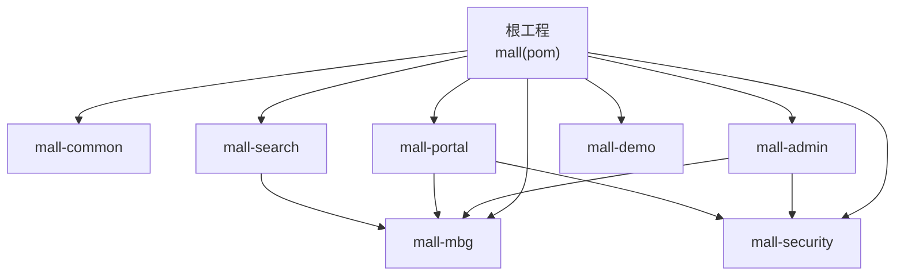
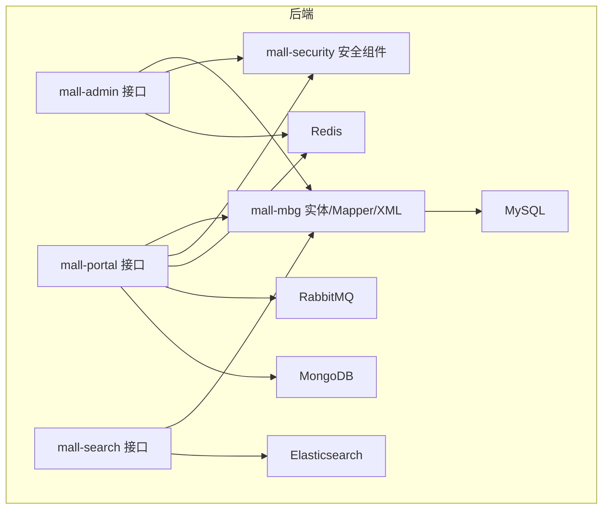
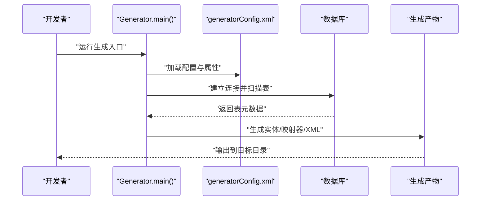
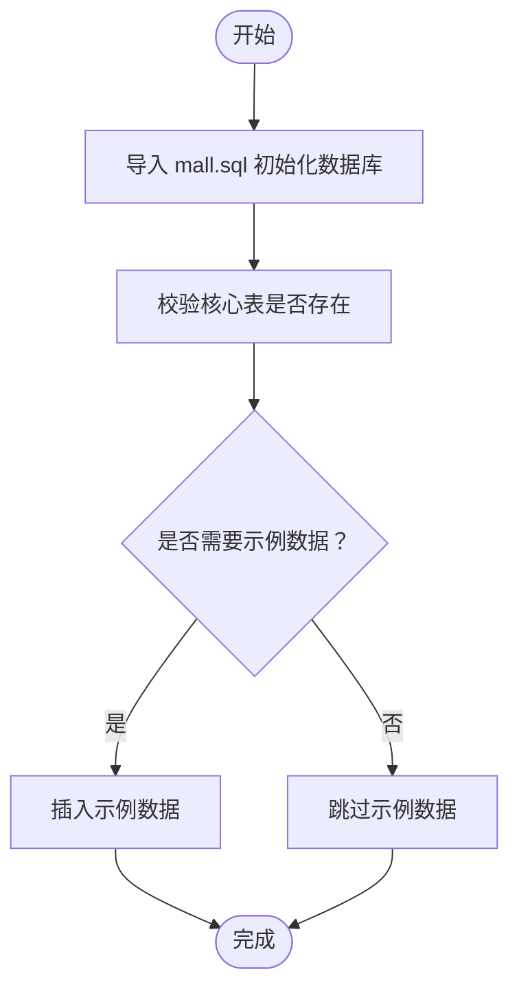
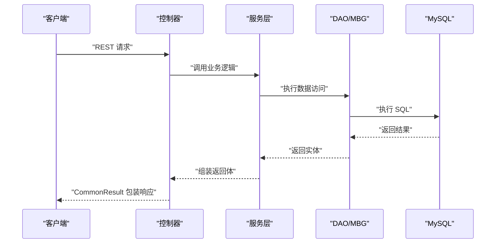
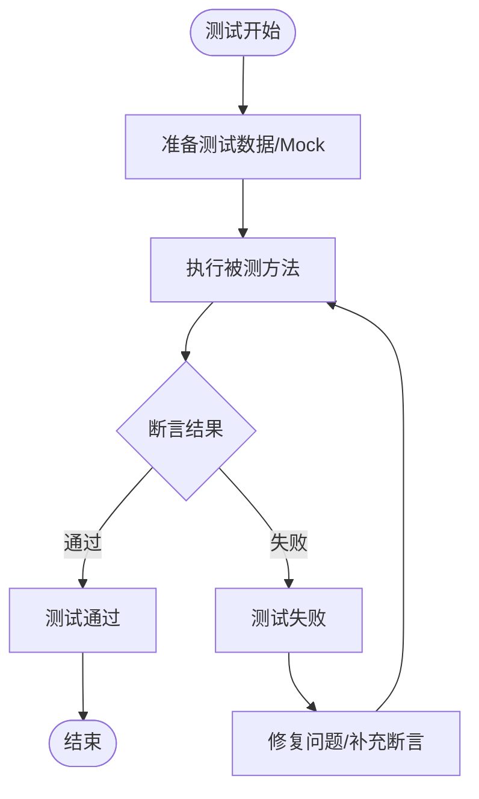
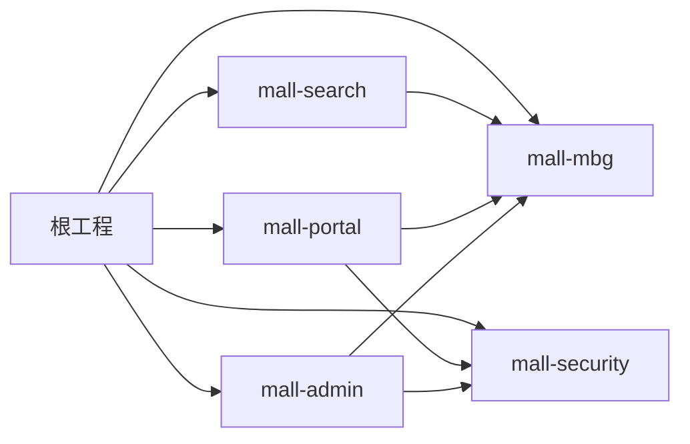

# 开发流程

<cite>
**本文引用的文件**
- [README.md](file://README.md)
- [pom.xml](file://pom.xml)
- [mall-admin/pom.xml](file://mall-admin/pom.xml)
- [mall-portal/pom.xml](file://mall-portal/pom.xml)
- [mall-mbg/src/main/resources/generatorConfig.xml](file://mall-mbg/src/main/resources/generatorConfig.xml)
- [mall-mbg/src/main/resources/generator.properties](file://mall-mbg/src/main/resources/generator.properties)
- [mall-mbg/src/main/java/com/macro/mall/Generator.java](file://mall-mbg/src/main/java/com/macro/mall/Generator.java)
- [mall-mbg/src/main/java/com/macro/mall/CommentGenerator.java](file://mall-mbg/src/main/java/com/macro/mall/CommentGenerator.java)
- [document/reference/dev_flow.md](file://document/reference/dev_flow.md)
- [document/reference/function.md](file://document/reference/function.md)
- [document/reference/mysql.md](file://document/reference/mysql.md)
- [document/sql/mall.sql](file://document/sql/mall.sql)
- [mall-admin/src/main/resources/application.yml](file://mall-admin/src/main/resources/application.yml)
- [mall-portal/src/main/resources/application.yml](file://mall-portal/src/main/resources/application.yml)
- [mall-admin/src/test/com/macro/mall/PmsDaoTests.java](file://mall-admin/src/test/com/macro/mall/PmsDaoTests.java)
</cite>

## 目录
1. [引言](#引言)
2. [项目结构](#项目结构)
3. [核心组件](#核心组件)
4. [架构总览](#架构总览)
5. [详细组件分析](#详细组件分析)
6. [依赖分析](#依赖分析)
7. [性能考虑](#性能考虑)
8. [故障排查指南](#故障排查指南)
9. [结论](#结论)
10. [附录](#附录)

## 引言
本文件面向参与 Mall 项目的开发者，提供从需求分析到代码提交的完整开发流程说明。内容涵盖功能与数据库设计、代码生成（MyBatis Generator）、接口开发、单元测试、集成测试、分支管理与 Git 工作流、开发环境搭建与 IDE 配置建议，以及最佳实践与常见问题解决方案。目标是帮助团队在统一规范下高效协作，确保质量与一致性。

## 项目结构
Mall 采用多模块 Maven 聚合工程组织，核心模块包括：
- mall-common：通用工具与异常、日志、返回体封装
- mall-mbg：MyBatis Generator 生成的实体、Mapper、XML
- mall-security：安全组件（JWT、动态权限、过滤器等）
- mall-admin：后台管理系统接口
- mall-portal：前台商城系统接口
- mall-search：基于 Elasticsearch 的搜索服务
- mall-demo：框架搭建与示例代码

**图表来源**
- [pom.xml:12-20](file://pom.xml#L12-L20)

**章节来源**
- [README.md:51-62](file://README.md#L51-L62)
- [pom.xml:12-20](file://pom.xml#L12-L20)

## 核心组件
- 多模块聚合与版本管理：根 pom 统一管理版本与插件，子模块按需引入依赖。
- MyBatis Generator：集中生成实体、Mapper、XML，统一编码风格与注释策略。
- 安全模块：统一 JWT、白名单、动态权限与过滤链。
- 配置中心：各模块 application.yml 按环境激活，MyBatis Mapper XML 路径统一。
- 测试：基于 JUnit 的 DAO 层测试，事务与回滚保障数据一致性。

**章节来源**
- [pom.xml:28-55](file://pom.xml#L28-L55)
- [mall-admin/pom.xml:19-36](file://mall-admin/pom.xml#L19-L36)
- [mall-portal/pom.xml:20-50](file://mall-portal/pom.xml#L20-L50)
- [mall-admin/src/main/resources/application.yml:1-66](file://mall-admin/src/main/resources/application.yml#L1-L66)
- [mall-portal/src/main/resources/application.yml:1-62](file://mall-portal/src/main/resources/application.yml#L1-L62)

## 架构总览
整体采用前后端分离，后端通过 Spring Boot + MyBatis 提供 REST 接口，结合 Redis、RabbitMQ、Elasticsearch、MongoDB 等中间件支撑业务能力。安全层统一由 mall-security 提供认证与授权。

**图表来源**
- [README.md:64-92](file://README.md#L64-L92)
- [mall-admin/pom.xml:19-36](file://mall-admin/pom.xml#L19-L36)
- [mall-portal/pom.xml:20-50](file://mall-portal/pom.xml#L20-L50)

## 详细组件分析

### MyBatis Generator 使用指南
- 配置文件与参数
  - generatorConfig.xml：定义 JDBC 连接、生成策略、插件、注释生成器、目标包与路径。
  - generator.properties：数据库连接参数（驱动、URL、用户名、密码）。
- 生成流程
  - 通过 Generator.main() 读取配置，解析 XML，执行生成，输出实体、Mapper 接口与 XML。
  - 注释生成器支持数据库字段备注注入到 Java 字段注释，便于文档化。
- 最佳实践
  - 保持 generator.properties 与本地/CI 环境一致，避免生成失败。
  - 生成前先备份旧代码，避免覆盖手动修改。
  - 生成后检查注释与命名规范，必要时调整注释生成器策略。

**图表来源**
- [mall-mbg/src/main/java/com/macro/mall/Generator.java:17-32](file://mall-mbg/src/main/java/com/macro/mall/Generator.java#L17-L32)
- [mall-mbg/src/main/resources/generatorConfig.xml:6-49](file://mall-mbg/src/main/resources/generatorConfig.xml#L6-L49)
- [mall-mbg/src/main/resources/generator.properties:1-4](file://mall-mbg/src/main/resources/generator.properties#L1-L4)

**章节来源**
- [mall-mbg/src/main/java/com/macro/mall/Generator.java:12-38](file://mall-mbg/src/main/java/com/macro/mall/Generator.java#L12-L38)
- [mall-mbg/src/main/java/com/macro/mall/CommentGenerator.java:13-65](file://mall-mbg/src/main/java/com/macro/mall/CommentGenerator.java#L13-L65)
- [mall-mbg/src/main/resources/generatorConfig.xml:6-49](file://mall-mbg/src/main/resources/generatorConfig.xml#L6-L49)
- [mall-mbg/src/main/resources/generator.properties:1-4](file://mall-mbg/src/main/resources/generator.properties#L1-L4)

### 数据库设计与初始化
- 数据库脚本：提供完整 mall.sql，包含多张业务表（如 cms_help、cms_prefrence_area、pms_brand、ums_admin 等），含注释与示例数据。
- 常用命令：提供 DDL/DML/DCL 与字符集、时区、权限等常用命令参考，便于本地与生产环境维护。
- 设计建议
  - 表结构遵循 ER 设计，主外键清晰，索引覆盖常见查询条件。
  - 字段注释完整，配合 MBG 注释生成器提升可读性。
  - 初始化脚本按模块拆分，便于增量部署与回滚。

**图表来源**
- [document/sql/mall.sql:20-121](file://document/sql/mall.sql#L20-L121)
- [document/reference/mysql.md:1-78](file://document/reference/mysql.md#L1-L78)

**章节来源**
- [document/sql/mall.sql:1-200](file://document/sql/mall.sql#L1-L200)
- [document/reference/mysql.md:1-78](file://document/reference/mysql.md#L1-L78)

### 接口开发与控制器
- 控制器分层：mall-admin 与 mall-portal 各自提供丰富的控制器，覆盖商品、订单、会员、营销、内容等模块。
- 统一返回体：mall-common 提供 CommonResult 封装，异常统一由 GlobalExceptionHandler 处理。
- 安全与鉴权：mall-security 提供 JWT 过滤与动态权限，application.yml 中配置白名单与密钥。
- MyBatis 映射：application.yml 统一配置 mapper XML 路径与实体包，确保扫描无误。

**图表来源**
- [mall-admin/src/main/resources/application.yml:14-18](file://mall-admin/src/main/resources/application.yml#L14-L18)
- [mall-portal/src/main/resources/application.yml:10-14](file://mall-portal/src/main/resources/application.yml#L10-L14)

**章节来源**
- [mall-admin/src/main/resources/application.yml:1-66](file://mall-admin/src/main/resources/application.yml#L1-L66)
- [mall-portal/src/main/resources/application.yml:1-62](file://mall-portal/src/main/resources/application.yml#L1-L62)

### 单元测试与集成测试
- DAO 层测试：PmsDaoTests 展示了批量插入与复杂查询的测试方法，使用 @Transactional 与 @Rollback 保证测试隔离与数据回滚。
- 建议
  - 为每个重要 DAO 方法编写最小可复现的单元测试。
  - 集成测试覆盖关键业务流程（如下单、支付、库存锁定）。
  - 使用日志输出关键对象 JSON，便于断言与排障。

**图表来源**
- [mall-admin/src/test/com/macro/mall/PmsDaoTests.java:30-51](file://mall-admin/src/test/com/macro/mall/PmsDaoTests.java#L30-L51)

**章节来源**
- [mall-admin/src/test/com/macro/mall/PmsDaoTests.java:1-53](file://mall-admin/src/test/com/macro/mall/PmsDaoTests.java#L1-L53)

### 分支管理与 Git 工作流
- 分支策略
  - 主分支：master（Spring Boot 2.7+JDK 8），dev-v3（Spring Boot 3.2+JDK 17）。
  - 功能分支：feature/*，修复分支：fix/*，发布分支：release/*。
- 提交流程
  - 从 develop 派生 feature 分支，完成开发后发起 MR（合并请求）至 develop。
  - 发布前在 release 分支进行回归测试与版本号修订，合并至 main 并打 Tag。
  - 热修复从 main 派生 hotfix/*，修复后同时合并回 main 与 develop。
- 提交规范
  - 标准格式：feat(scope): description；fix(scope): description；docs(scope): description；refactor(scope): description。
  - 每次 MR 需包含测试用例与变更说明。

**章节来源**
- [README.md](file://README.md#L19)

### 开发环境搭建与 IDE 配置建议
- 环境要求
  - JDK 17（Spring Boot 3.2），MySQL 5.7，Redis 7.0，RabbitMQ 3.10.5，Elasticsearch 7.17.3，MongoDB 5.0，Nginx 1.22。
- 工具推荐
  - IDE：IntelliJ IDEA；数据库：Navicat；接口调试：Postman；原型设计：Axure；日志：ELK。
- 本地启动
  - 先导入 mall.sql 初始化数据库，再启动 mall-admin 与 mall-portal（按需启动 mall-search）。
  - application.yml 中配置数据库、Redis、JWT 密钥与白名单路径。
- Docker（可选）
  - 使用 docker-compose 或 Fabric8 插件构建镜像并部署。

**章节来源**
- [README.md:166-196](file://README.md#L166-L196)
- [mall-admin/src/main/resources/application.yml:1-66](file://mall-admin/src/main/resources/application.yml#L1-L66)
- [mall-portal/src/main/resources/application.yml:1-62](file://mall-portal/src/main/resources/application.yml#L1-L62)

### 功能设计与模块划分
- 后台管理：商品管理、订单管理、会员管理、促销管理、内容管理、权限管理等。
- 前台商城：商品搜索、推荐、购物车、下单、支付、会员中心等。
- 功能结构图与进度：参考文档中的功能结构图与开发进度图，明确各模块职责与完成度。

**章节来源**
- [document/reference/function.md:1-27](file://document/reference/function.md#L1-L27)
- [document/reference/dev_flow.md:36-330](file://document/reference/dev_flow.md#L36-L330)

## 依赖分析
- 依赖管理
  - 根 pom 统一版本与依赖管理，子模块按需引入 mall-common、mall-mbg、mall-security 等。
  - MyBatis、PageHelper、Druid、JWT、OSS、MinIO、Logstash 等第三方依赖集中管理。
- 模块间耦合
  - mall-admin 与 mall-portal 均依赖 mall-mbg 与 mall-security，降低重复代码，提升复用性。
- 外部依赖
  - MySQL、Redis、RabbitMQ、Elasticsearch、MongoDB、Nginx、Docker 等。

**图表来源**
- [pom.xml:93-194](file://pom.xml#L93-L194)
- [mall-admin/pom.xml:19-36](file://mall-admin/pom.xml#L19-L36)
- [mall-portal/pom.xml:20-50](file://mall-portal/pom.xml#L20-L50)

**章节来源**
- [pom.xml:93-194](file://pom.xml#L93-L194)
- [mall-admin/pom.xml:19-36](file://mall-admin/pom.xml#L19-L36)
- [mall-portal/pom.xml:20-50](file://mall-portal/pom.xml#L20-L50)

## 性能考虑
- 数据访问
  - 使用 PageHelper 进行物理分页，避免一次性加载大量数据。
  - MyBatis XML 中合理使用索引与条件裁剪，减少全表扫描。
- 缓存
  - Redis 缓存热点数据与权限列表，降低数据库压力。
- 搜索
  - Elasticsearch 用于全文检索与聚合，提升搜索性能与体验。
- 异步
  - RabbitMQ 异步处理订单超时、库存释放等耗时任务。
- 监控与日志
  - Actuator、Logstash、Kibana 构建可观测体系，及时发现性能瓶颈。

## 故障排查指南
- 生成失败
  - 检查 generator.properties 中数据库连接参数与驱动版本。
  - 确认 generatorConfig.xml 中 JDBC、目标包与表匹配规则。
- 启动报错
  - application.yml 中数据库、Redis、JWT 配置是否正确。
  - 白名单路径与安全过滤链是否覆盖到接口。
- 测试失败
  - 使用 @Transactional 与 @Rollback 确保测试隔离。
  - 关注日志输出与断言信息，定位具体步骤。
- 数据库问题
  - 使用 mysql 命令行检查表结构、索引与权限。
  - 如需重置，重新导入 mall.sql 或执行增量脚本。

**章节来源**
- [mall-mbg/src/main/resources/generator.properties:1-4](file://mall-mbg/src/main/resources/generator.properties#L1-L4)
- [mall-mbg/src/main/resources/generatorConfig.xml:29-48](file://mall-mbg/src/main/resources/generatorConfig.xml#L29-L48)
- [mall-admin/src/main/resources/application.yml:1-66](file://mall-admin/src/main/resources/application.yml#L1-L66)
- [mall-portal/src/main/resources/application.yml:1-62](file://mall-portal/src/main/resources/application.yml#L1-L62)
- [document/reference/mysql.md:1-78](file://document/reference/mysql.md#L1-L78)
- [mall-admin/src/test/com/macro/mall/PmsDaoTests.java:30-51](file://mall-admin/src/test/com/macro/mall/PmsDaoTests.java#L30-L51)

## 结论
通过统一的多模块工程、标准化的代码生成与测试流程、清晰的分支管理与环境配置，Mall 项目能够在保证质量的前提下高效推进迭代。建议团队严格遵循本文档的流程与规范，持续优化数据库设计与接口契约，强化监控与日志体系，确保系统稳定与可扩展。

## 附录
- 快速参考
  - 功能结构图与开发进度：见文档目录下的 function.md 与 dev_flow.md。
  - MySQL 常用命令：见 document/reference/mysql.md。
  - 数据库脚本：document/sql/mall.sql。