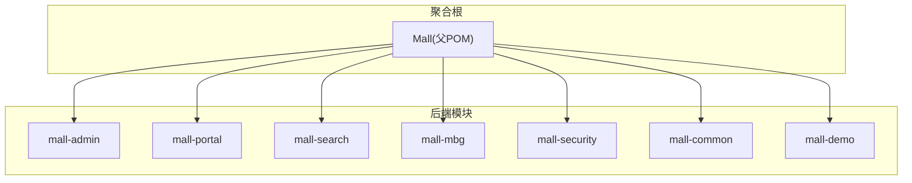
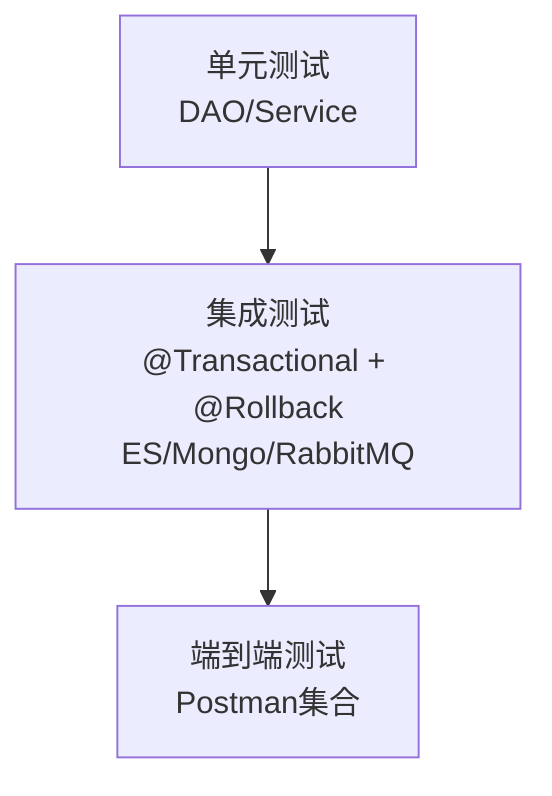
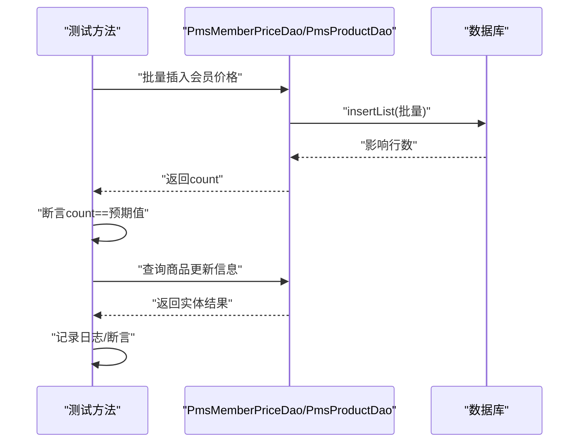
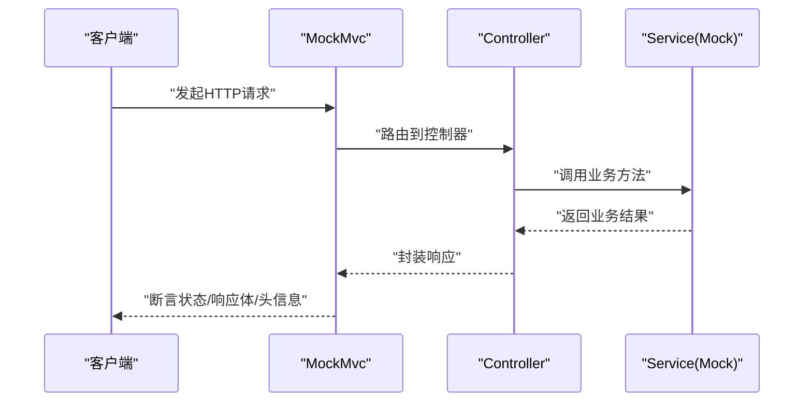
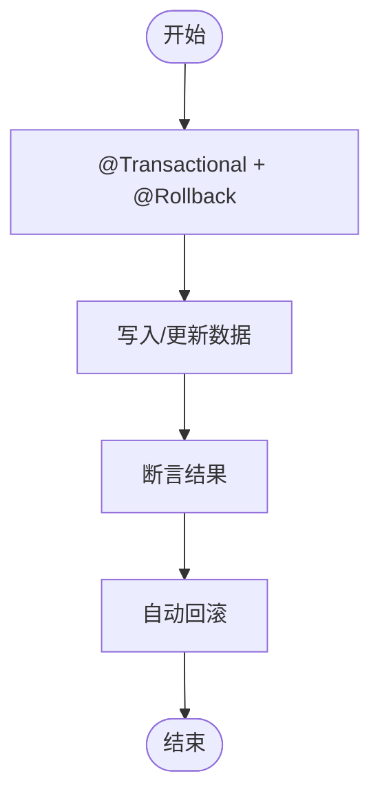
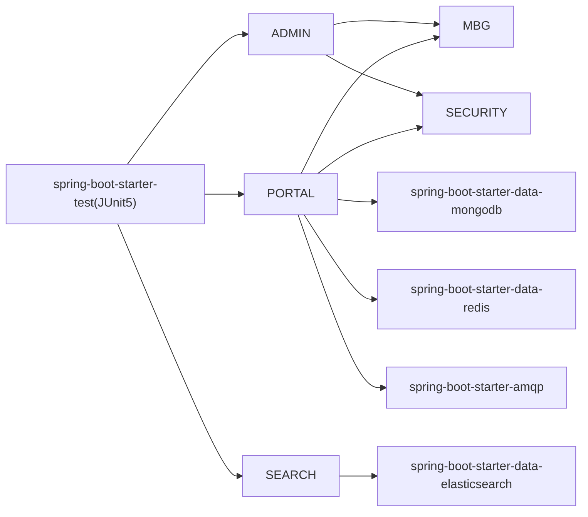

# 测试策略

<cite>
**本文档引用的文件**
- [README.md](file://README.md)
- [pom.xml](file://pom.xml)
- [mall-admin/pom.xml](file://mall-admin/pom.xml)
- [mall-portal/pom.xml](file://mall-portal/pom.xml)
- [mall-search/pom.xml](file://mall-search/pom.xml)
- [mall-admin/src/test/com/macro/mall/PmsDaoTests.java](file://mall-admin/src/test/com/macro/mall/PmsDaoTests.java)
- [mall-portal/src/test/java/com/macro/mall/portal/MallPortalApplicationTests.java](file://mall-portal/src/test/java/com/macro/mall/portal/MallPortalApplicationTests.java)
- [mall-portal/src/test/java/com/macro/mall/portal/PortalProductDaoTests.java](file://mall-portal/src/test/java/com/macro/mall/portal/PortalProductDaoTests.java)
- [mall-search/src/test/java/com/macro/mall/search/MallSearchApplicationTests.java](file://mall-search/src/test/java/com/macro/mall/search/MallSearchApplicationTests.java)
- [mall-admin/src/main/resources/application.yml](file://mall-admin/src/main/resources/application.yml)
- [mall-portal/src/main/resources/application.yml](file://mall-portal/src/main/resources/application.yml)
- [mall-search/src/main/resources/application.yml](file://mall-search/src/main/resources/application.yml)
- [mall-demo/src/test/java/com/macro/mall/demo/MallDemoApplicationTests.java](file://mall-demo/src/test/java/com/macro/mall/demo/MallDemoApplicationTests.java)
- [mall-common/src/main/resources/logback-spring.xml](file://mall-common/src/main/resources/logback-spring.xml)
</cite>

## 目录
1. [引言](#引言)
2. [项目结构](#项目结构)
3. [核心组件](#核心组件)
4. [架构总览](#架构总览)
5. [详细组件分析](#详细组件分析)
6. [依赖分析](#依赖分析)
7. [性能考虑](#性能考虑)
8. [故障排查指南](#故障排查指南)
9. [结论](#结论)
10. [附录](#附录)

## 引言
本测试策略文档面向Mall项目，系统性阐述单元测试、集成测试与端到端测试的编写方法与测试金字塔应用，结合JUnit 5在本仓库中的实际使用情况，给出覆盖范围、断言方式、测试数据准备、Mock策略、数据库测试（含H2内存数据库思路）、API测试最佳实践（Postman集合与接口自动化）、测试覆盖率要求以及持续集成中的测试流程建议。

## 项目结构
Mall采用多模块聚合工程，核心模块包含：
- mall-admin：后台管理系统接口与业务
- mall-portal：前台商城系统接口与业务
- mall-search：基于Elasticsearch的商品搜索系统
- mall-mbg：MyBatis Generator生成的DAO与Model
- mall-security：安全与认证相关公共模块
- mall-common：通用工具、异常与响应封装
- mall-demo：框架搭建时的示例与测试代码

**图表来源**
- [pom.xml:12-20](file://pom.xml#L12-L20)
- [mall-admin/pom.xml:1-50](file://mall-admin/pom.xml#L1-L50)
- [mall-portal/pom.xml:1-68](file://mall-portal/pom.xml#L1-L68)
- [mall-search/pom.xml:1-51](file://mall-search/pom.xml#L1-L51)

**章节来源**
- [README.md:51-62](file://README.md#L51-L62)
- [pom.xml:12-20](file://pom.xml#L12-L20)

## 核心组件
- 单元测试（Unit Test）
  - 在各模块src/test下进行，使用JUnit 5注解与断言，覆盖DAO层、服务层与控制器层的逻辑验证。
  - 示例：PmsDaoTests对批量插入与查询结果进行断言；PortalProductDaoTests对促销商品列表查询进行断言。
- 集成测试（Integration Test）
  - 基于@SpringBootTest加载上下文，结合@Transactional与@Rollback实现事务回滚，确保测试对数据库无副作用。
  - 示例：PmsDaoTests使用@Transactional与@Rollback；MallSearchApplicationTests使用Elasticsearch模板进行索引映射测试。
- 端到端测试（End-to-End Test）
  - 通过Postman集合进行接口自动化测试，结合环境变量与预置数据，覆盖登录、商品浏览、下单等完整业务链路。
  - 仓库提供mall-admin与mall-portal两个Postman集合，便于在不同模块间进行端到端验证。

**章节来源**
- [mall-admin/src/test/com/macro/mall/PmsDaoTests.java:23-44](file://mall-admin/src/test/com/macro/mall/PmsDaoTests.java#L23-L44)
- [mall-portal/src/test/java/com/macro/mall/portal/PortalProductDaoTests.java:18-31](file://mall-portal/src/test/java/com/macro/mall/portal/PortalProductDaoTests.java#L18-L31)
- [mall-search/src/test/java/com/macro/mall/search/MallSearchApplicationTests.java:15-37](file://mall-search/src/test/java/com/macro/mall/search/MallSearchApplicationTests.java#L15-L37)
- [README.md:163-163](file://README.md#L163-L163)

## 架构总览
测试金字塔在Mall中的落地：
- 底层：单元测试（DAO/Service），数量最多，执行最快，保证基础逻辑正确性
- 中层：集成测试（带事务回滚的数据库测试、外部组件交互如ES/Mongo/RabbitMQ）
- 顶层：端到端测试（Postman集合，覆盖真实业务流程）

## 详细组件分析

### DAO层单元测试（以PmsDaoTests为例）
- 测试目标：批量插入会员价格、查询商品更新信息
- 关键点：
  - 使用@SpringBootTest加载上下文
  - 使用@Transactional与@Rollback确保测试后回滚，避免污染数据库
  - 使用assertEquals等断言验证结果
  - 使用JSON工具输出复杂对象便于调试

**图表来源**
- [mall-admin/src/test/com/macro/mall/PmsDaoTests.java:30-44](file://mall-admin/src/test/com/macro/mall/PmsDaoTests.java#L30-L44)

**章节来源**
- [mall-admin/src/test/com/macro/mall/PmsDaoTests.java:23-52](file://mall-admin/src/test/com/macro/mall/PmsDaoTests.java#L23-L52)

### 控制器层集成测试（概念性说明）
- 使用Spring Boot Test与MockMvc对控制器进行集成测试，验证请求参数、响应状态、JSON结构与安全拦截。
- Mock策略：
  - 使用@MockBean模拟Service层依赖，隔离控制器逻辑
  - 使用@WithMockUser或自定义SecurityFilter测试鉴权与授权
- 断言：
  - 使用MockMvc的perform与andExpect组合断言HTTP状态、响应体字段、头信息等

### 数据库测试策略（事务回滚与外部组件）
- 事务回滚：在测试类或方法上添加@Transactional与@Rollback，确保测试结束后自动回滚
- 外部组件：
  - Elasticsearch：使用ElasticsearchRestTemplate进行索引映射测试
  - MongoDB：在mall-portal模块中使用MongoDB Starter，可在集成测试中注入Repository进行验证
  - RabbitMQ：在mall-portal模块中使用AMQP Starter，可在测试中验证消息发送与消费

**图表来源**
- [mall-admin/src/test/com/macro/mall/PmsDaoTests.java:31-33](file://mall-admin/src/test/com/macro/mall/PmsDaoTests.java#L31-L33)
- [mall-search/src/test/java/com/macro/mall/search/MallSearchApplicationTests.java:24-35](file://mall-search/src/test/java/com/macro/mall/search/MallSearchApplicationTests.java#L24-L35)

**章节来源**
- [mall-admin/src/test/com/macro/mall/PmsDaoTests.java:31-33](file://mall-admin/src/test/com/macro/mall/PmsDaoTests.java#L31-L33)
- [mall-search/src/test/java/com/macro/mall/search/MallSearchApplicationTests.java:15-37](file://mall-search/src/test/java/com/macro/mall/search/MallSearchApplicationTests.java#L15-L37)

### API测试最佳实践（Postman集合与接口自动化）
- Postman集合：
  - 仓库提供mall-admin与mall-portal两个Postman集合，便于在不同模块间进行端到端验证
  - 建议在集合中统一管理环境变量（如基础URL、令牌），并使用Pre-request Script与Tests脚本进行鉴权与断言
- 接口自动化：
  - 结合newman或Postman Monitor进行定时执行
  - 将测试结果纳入CI流水线，失败即阻断发布

**章节来源**
- [README.md:163-163](file://README.md#L163-L163)

### 日志与可观测性（与测试关联）
- 日志配置：mall-common模块提供logback-spring.xml，便于在测试中输出结构化日志，辅助问题定位
- 建议：在测试中使用结构化日志输出关键参数与结果，便于CI中检索与分析

**章节来源**
- [mall-common/src/main/resources/logback-spring.xml:1-15](file://mall-common/src/main/resources/logback-spring.xml#L1-L15)

## 依赖分析
- JUnit 5与Spring Boot Test：在父POM中声明spring-boot-starter-test，所有模块共享
- 模块依赖：
  - mall-admin依赖mall-mbg与mall-security
  - mall-portal依赖mall-mbg、mall-security、MongoDB、Redis、RabbitMQ
  - mall-search依赖mall-mbg与Elasticsearch

**图表来源**
- [pom.xml:66-70](file://pom.xml#L66-L70)
- [mall-admin/pom.xml:19-36](file://mall-admin/pom.xml#L19-L36)
- [mall-portal/pom.xml:20-50](file://mall-portal/pom.xml#L20-L50)
- [mall-search/pom.xml:20-35](file://mall-search/pom.xml#L20-L35)

**章节来源**
- [pom.xml:57-91](file://pom.xml#L57-L91)
- [mall-admin/pom.xml:19-36](file://mall-admin/pom.xml#L19-L36)
- [mall-portal/pom.xml:20-50](file://mall-portal/pom.xml#L20-L50)
- [mall-search/pom.xml:20-35](file://mall-search/pom.xml#L20-L35)

## 性能考虑
- 单元测试优先：DAO/Service层尽量无外部依赖，使用Mock或内存数据，保证执行效率
- 集成测试限域：仅在必要时引入数据库、ES、Mongo等外部组件，控制测试规模
- 并行执行：在CI中按模块并行运行测试，缩短总耗时
- 缓存与事务：合理使用事务回滚与缓存清理，避免重复初始化成本

## 故障排查指南
- 测试未回滚导致数据污染
  - 症状：后续测试依赖旧数据，断言失败
  - 处理：确认测试类/方法是否添加@Transactional与@Rollback
- Elasticsearch映射失败
  - 症状：索引映射测试报错
  - 处理：检查ElasticsearchRestTemplate与IndexOperations使用是否正确，确认ES服务可用
- 日志输出与定位
  - 建议在测试中输出关键参数与结果，结合mall-common的日志配置进行结构化输出

**章节来源**
- [mall-admin/src/test/com/macro/mall/PmsDaoTests.java:31-33](file://mall-admin/src/test/com/macro/mall/PmsDaoTests.java#L31-L33)
- [mall-search/src/test/java/com/macro/mall/search/MallSearchApplicationTests.java:30-35](file://mall-search/src/test/java/com/macro/mall/search/MallSearchApplicationTests.java#L30-L35)
- [mall-common/src/main/resources/logback-spring.xml:1-15](file://mall-common/src/main/resources/logback-spring.xml#L1-L15)

## 结论
Mall项目的测试体系以JUnit 5为基础，结合@SpringBootTest、事务回滚与外部组件集成，形成从单元到端到端的完整测试金字塔。建议在现有基础上完善控制器层的MockMvc测试、补充数据库测试（含H2内存数据库思路）、强化Postman集合的自动化执行与结果监控，并在CI中建立测试覆盖率门槛与失败阻断机制，持续提升质量与交付效率。

## 附录

### JUnit测试框架使用要点（结合仓库现状）
- 注解与断言
  - @Test：标记测试方法
  - assertEquals等断言：验证结果
  - @Transactional与@Rollback：确保数据库测试不污染数据
- 测试数据准备
  - 使用DAO层批量插入或临时数据初始化
  - 输出JSON便于调试与回归

**章节来源**
- [mall-admin/src/test/com/macro/mall/PmsDaoTests.java:21-22](file://mall-admin/src/test/com/macro/mall/PmsDaoTests.java#L21-L22)
- [mall-portal/src/test/java/com/macro/mall/portal/PortalProductDaoTests.java:12-12](file://mall-portal/src/test/java/com/macro/mall/portal/PortalProductDaoTests.java#L12-L12)

### 数据库测试策略（H2内存数据库思路）
- 目标：在测试环境中使用H2内存数据库替代MySQL，提升执行速度与隔离性
- 方案：
  - 在测试配置文件中切换数据源为H2
  - 使用Schema/DDL初始化脚本，确保表结构与生产一致
  - 配合@Rollback与事务管理，保证每条测试独立
- 适用范围：DAO层与Service层的纯数据库逻辑测试

[本节为通用实践建议，不直接对应具体源码文件]

### API测试最佳实践（Postman集合与接口自动化）
- 集合组织：按模块划分（后台、前台），统一环境变量与鉴权
- 自动化执行：newman或Postman Monitor定时任务
- 结果监控：将测试报告接入CI，失败即阻断

**章节来源**
- [README.md:163-163](file://README.md#L163-L163)

### 测试覆盖率与持续集成
- 覆盖率要求建议：
  - 单元测试：Service/DAO层行覆盖率≥80%，分支覆盖率≥60%
  - 集成测试：关键业务链路100%覆盖
- CI流程建议：
  - Maven阶段：mvn clean test（可配置跳过测试开关）
  - 测试报告：生成Surefire/Failsafe报告，接入SonarQube或Codecov
  - 失败阻断：测试失败时停止后续构建

**章节来源**
- [pom.xml:33-33](file://pom.xml#L33-L33)