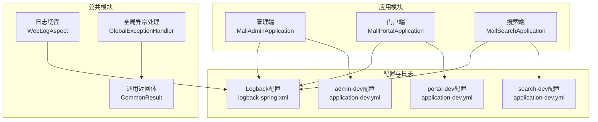
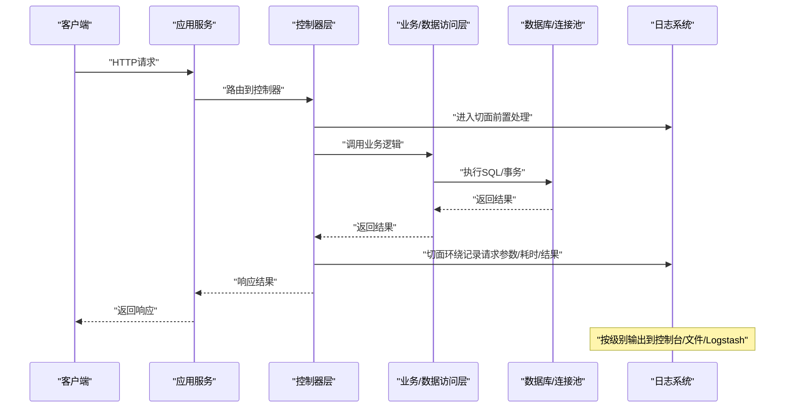
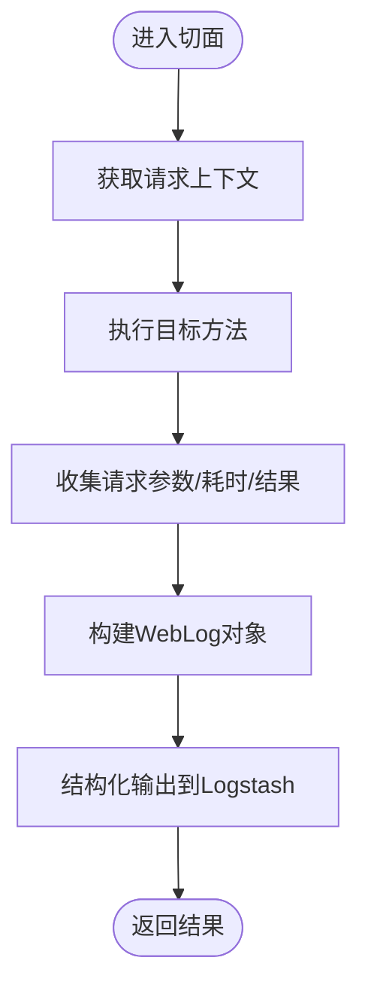
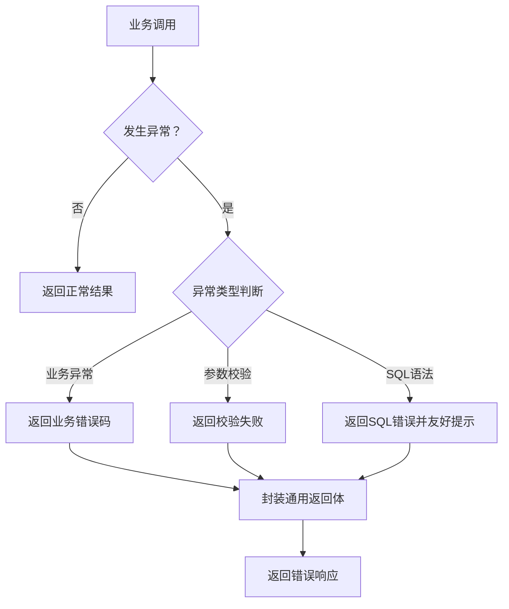
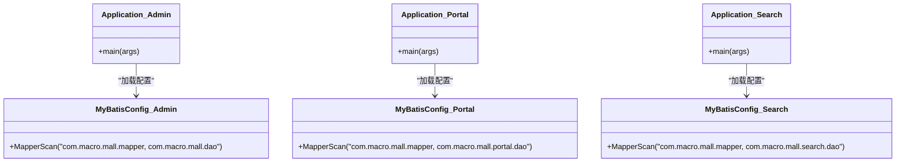
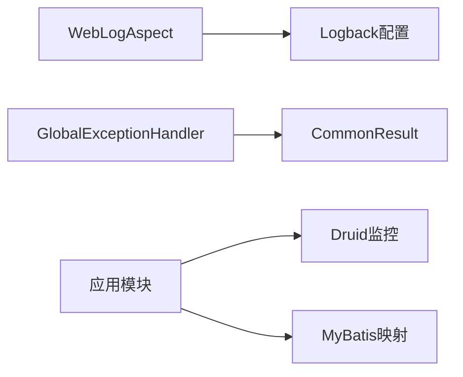

# 调试工具

<cite>
**本文档引用的文件**
- [mall-common/logback-spring.xml](file://mall-common/src/main/resources/logback-spring.xml)
- [mall-common/WebLogAspect.java](file://mall-common/src/main/java/com/macro/mall/common/log/WebLogAspect.java)
- [mall-common/WebLog.java](file://mall-common/src/main/java/com/macro/mall/common/domain/WebLog.java)
- [mall-common/GlobalExceptionHandler.java](file://mall-common/src/main/java/com/macro/mall/common/exception/GlobalExceptionHandler.java)
- [mall-admin/application-dev.yml](file://mall-admin/src/main/resources/application-dev.yml)
- [mall-portal/application-dev.yml](file://mall-portal/src/main/resources/application-dev.yml)
- [mall-search/application-dev.yml](file://mall-search/src/main/resources/application-dev.yml)
- [mall-admin/MallAdminApplication.java](file://mall-admin/src/main/java/com/macro/mall/MallAdminApplication.java)
- [mall-portal/MallPortalApplication.java](file://mall-portal/src/main/java/com/macro/mall/portal/MallPortalApplication.java)
- [mall-search/MallSearchApplication.java](file://mall-search/src/main/java/com/macro/mall/search/MallSearchApplication.java)
- [mall-admin/MyBatisConfig.java](file://mall-admin/src/main/java/com/macro/mall/config/MyBatisConfig.java)
- [mall-portal/MyBatisConfig.java](file://mall-portal/src/main/java/com/macro/mall/portal/config/MyBatisConfig.java)
- [mall-search/MyBatisConfig.java](file://mall-search/src/main/java/com/macro/mall/search/config/MyBatisConfig.java)
- [mall-mbg/MyBatis配置示例](file://mall-mbg/src/main/resources/generatorConfig.xml)
- [mall-common/CommonResult.java](file://mall-common/src/main/java/com/macro/mall/common/api/CommonResult.java)
</cite>

## 目录
1. [简介](#简介)
2. [项目结构](#项目结构)
3. [核心组件](#核心组件)
4. [架构总览](#架构总览)
5. [详细组件分析](#详细组件分析)
6. [依赖分析](#依赖分析)
7. [性能考虑](#性能考虑)
8. [故障排查指南](#故障排查指南)
9. [结论](#结论)
10. [附录](#附录)

## 简介
本指南面向Mall项目的开发者与运维人员，系统讲解如何在IDE中高效进行断点调试、变量监视、调用栈分析与条件断点；如何利用日志系统（Logback）进行多通道输出与格式定制；如何配置远程调试（JVM参数与端口）；以及如何对数据库层（MyBatis/Druid）进行SQL执行监控、慢查询分析与连接池监控；最后给出常见问题的调试思路与排查方法。

## 项目结构
Mall采用多模块结构，包含管理端、门户端、搜索端与公共模块。公共模块提供统一日志切面、异常处理与通用返回体；各应用模块通过独立的配置文件启用数据库、缓存、消息队列等外部依赖，并通过Logback将业务日志、接口访问记录与错误日志分别输出到控制台、文件与Logstash。

图表来源
- [mall-admin/MallAdminApplication.java:10-15](file://mall-admin/src/main/java/com/macro/mall/MallAdminApplication.java#L10-L15)
- [mall-portal/MallPortalApplication.java:6-12](file://mall-portal/src/main/java/com/macro/mall/portal/MallPortalApplication.java#L6-L12)
- [mall-search/MallSearchApplication.java:6-11](file://mall-search/src/main/java/com/macro/mall/search/MallSearchApplication.java#L6-L11)
- [mall-admin/application-dev.yml:1-36](file://mall-admin/src/main/resources/application-dev.yml#L1-L36)
- [mall-portal/application-dev.yml:1-53](file://mall-portal/src/main/resources/application-dev.yml#L1-L53)
- [mall-search/application-dev.yml:1-29](file://mall-search/src/main/resources/application-dev.yml#L1-L29)
- [mall-common/logback-spring.xml:187-201](file://mall-common/src/main/resources/logback-spring.xml#L187-L201)

章节来源
- [mall-admin/MallAdminApplication.java:10-15](file://mall-admin/src/main/java/com/macro/mall/MallAdminApplication.java#L10-L15)
- [mall-portal/MallPortalApplication.java:6-12](file://mall-portal/src/main/java/com/macro/mall/portal/MallPortalApplication.java#L6-L12)
- [mall-search/MallSearchApplication.java:6-11](file://mall-search/src/main/java/com/macro/mall/search/MallSearchApplication.java#L6-L11)
- [mall-admin/application-dev.yml:1-36](file://mall-admin/src/main/resources/application-dev.yml#L1-L36)
- [mall-portal/application-dev.yml:1-53](file://mall-portal/src/main/resources/application-dev.yml#L1-L53)
- [mall-search/application-dev.yml:1-29](file://mall-search/src/main/resources/application-dev.yml#L1-L29)
- [mall-common/logback-spring.xml:187-201](file://mall-common/src/main/resources/logback-spring.xml#L187-L201)

## 核心组件
- 日志系统：基于Logback，支持控制台、文件与Logstash多通道输出，按级别过滤与滚动策略配置，业务日志与接口访问记录分离输出。
- 接口访问日志切面：通过AOP拦截控制器层请求，采集请求上下文、参数、耗时与响应，统一以结构化JSON输出至Logstash。
- 全局异常处理：集中捕获业务异常、参数校验异常与SQL语法异常，统一返回通用结果体。
- 数据库与连接池：MyBatis配置扫描Mapper与DAO包，Druid连接池提供统计与监控页面。

章节来源
- [mall-common/logback-spring.xml:17-201](file://mall-common/src/main/resources/logback-spring.xml#L17-L201)
- [mall-common/WebLogAspect.java:32-89](file://mall-common/src/main/java/com/macro/mall/common/log/WebLogAspect.java#L32-L89)
- [mall-common/GlobalExceptionHandler.java:15-67](file://mall-common/src/main/java/com/macro/mall/common/exception/GlobalExceptionHandler.java#L15-L67)
- [mall-admin/MyBatisConfig.java:7-15](file://mall-admin/src/main/java/com/macro/mall/config/MyBatisConfig.java#L7-L15)
- [mall-portal/MyBatisConfig.java:7-15](file://mall-portal/src/main/java/com/macro/mall/portal/config/MyBatisConfig.java#L7-L15)
- [mall-search/MyBatisConfig.java:7-12](file://mall-search/src/main/java/com/macro/mall/search/config/MyBatisConfig.java#L7-L12)

## 架构总览
下图展示从客户端到应用、数据库与日志系统的整体交互流程，重点标注了日志切面与异常处理的关键节点。

图表来源
- [mall-common/WebLogAspect.java:54-89](file://mall-common/src/main/java/com/macro/mall/common/log/WebLogAspect.java#L54-L89)
- [mall-common/logback-spring.xml:187-201](file://mall-common/src/main/resources/logback-spring.xml#L187-L201)

## 详细组件分析

### 日志系统与Logback配置
- 输出通道
  - 控制台：实时查看调试信息。
  - 文件：按DEBUG/ERROR级别分目录滚动输出，便于离线分析。
  - Logstash：统一结构化输出，支持Elasticsearch收集与可视化。
- 级别与过滤
  - 根级别：DEBUG，控制台与文件同时输出。
  - ERROR通道：仅匹配ERROR级别，避免污染DEBUG日志。
  - 业务日志与接口访问记录：分别绑定专用通道，便于检索。
- 格式定制
  - 使用Logstash JSON编码器，输出字段包含项目名、服务名、线程、类名、消息与堆栈等。
  - 接口访问记录通道输出请求URL、方法、参数、耗时与描述等关键信息。
- 配置位置
  - Logback配置位于公共模块资源目录，应用通过Dev配置文件控制Logstash主机与开关。

章节来源
- [mall-common/logback-spring.xml:17-201](file://mall-common/src/main/resources/logback-spring.xml#L17-L201)
- [mall-admin/application-dev.yml:29-36](file://mall-admin/src/main/resources/application-dev.yml#L29-L36)
- [mall-portal/application-dev.yml:36-43](file://mall-portal/src/main/resources/application-dev.yml#L36-L43)
- [mall-search/application-dev.yml:22-29](file://mall-search/src/main/resources/application-dev.yml#L22-L29)

### 接口访问日志切面（WebLogAspect）
- 切点范围：拦截所有控制器层方法调用。
- 记录内容：请求URL、方法、IP、参数、耗时、描述、结果等。
- 输出方式：使用结构化标记输出到Logstash，便于后续检索与分析。
- 参数提取：自动识别@RequestBody与@RequestParam参数，构造请求参数视图。

图表来源
- [mall-common/WebLogAspect.java:54-89](file://mall-common/src/main/java/com/macro/mall/common/log/WebLogAspect.java#L54-L89)
- [mall-common/WebLog.java:10-68](file://mall-common/src/main/java/com/macro/mall/common/domain/WebLog.java#L10-L68)

章节来源
- [mall-common/WebLogAspect.java:32-89](file://mall-common/src/main/java/com/macro/mall/common/log/WebLogAspect.java#L32-L89)
- [mall-common/WebLog.java:10-68](file://mall-common/src/main/java/com/macro/mall/common/domain/WebLog.java#L10-L68)

### 全局异常处理（GlobalExceptionHandler）
- 捕获范围：业务异常、参数校验异常、SQL语法异常。
- 返回策略：统一包装为通用返回体，便于前端一致处理。
- 特殊处理：对特定SQL错误（如权限拒绝）进行友好提示。

图表来源
- [mall-common/GlobalExceptionHandler.java:22-67](file://mall-common/src/main/java/com/macro/mall/common/exception/GlobalExceptionHandler.java#L22-L67)
- [mall-common/CommonResult.java:35-108](file://mall-common/src/main/java/com/macro/mall/common/api/CommonResult.java#L35-L108)

章节来源
- [mall-common/GlobalExceptionHandler.java:15-67](file://mall-common/src/main/java/com/macro/mall/common/exception/GlobalExceptionHandler.java#L15-L67)
- [mall-common/CommonResult.java:35-108](file://mall-common/src/main/java/com/macro/mall/common/api/CommonResult.java#L35-L108)

### 数据库与连接池（MyBatis + Druid）
- MyBatis配置：扫描Mapper与DAO包，确保SQL映射与DAO接口正确加载。
- Druid连接池：提供初始大小、最小空闲、最大活跃数等参数；内置监控页面可通过stat-view-servlet访问，支持排除静态资源统计。
- 开发环境配置：各模块Dev配置文件中包含数据库连接串、账号密码与Druid监控访问凭据。

图表来源
- [mall-admin/MyBatisConfig.java:11-15](file://mall-admin/src/main/java/com/macro/mall/config/MyBatisConfig.java#L11-L15)
- [mall-portal/MyBatisConfig.java:11-14](file://mall-portal/src/main/java/com/macro/mall/portal/config/MyBatisConfig.java#L11-L14)
- [mall-search/MyBatisConfig.java:10-12](file://mall-search/src/main/java/com/macro/mall/search/config/MyBatisConfig.java#L10-L12)
- [mall-admin/MallAdminApplication.java:10-15](file://mall-admin/src/main/java/com/macro/mall/MallAdminApplication.java#L10-L15)
- [mall-portal/MallPortalApplication.java:6-12](file://mall-portal/src/main/java/com/macro/mall/portal/MallPortalApplication.java#L6-L12)
- [mall-search/MallSearchApplication.java:6-11](file://mall-search/src/main/java/com/macro/mall/search/MallSearchApplication.java#L6-L11)

章节来源
- [mall-admin/MyBatisConfig.java:7-15](file://mall-admin/src/main/java/com/macro/mall/config/MyBatisConfig.java#L7-L15)
- [mall-portal/MyBatisConfig.java:7-15](file://mall-portal/src/main/java/com/macro/mall/portal/config/MyBatisConfig.java#L7-L15)
- [mall-search/MyBatisConfig.java:7-12](file://mall-search/src/main/java/com/macro/mall/search/config/MyBatisConfig.java#L7-L12)
- [mall-admin/application-dev.yml:2-14](file://mall-admin/src/main/resources/application-dev.yml#L2-L14)
- [mall-portal/application-dev.yml:4-17](file://mall-portal/src/main/resources/application-dev.yml#L4-L17)
- [mall-search/application-dev.yml:2-14](file://mall-search/src/main/resources/application-dev.yml#L2-L14)

## 依赖分析
- 组件耦合
  - WebLogAspect与Logback配置强关联，负责结构化输出；与控制器层弱耦合，通过切点声明式接入。
  - GlobalExceptionHandler与CommonResult配合，形成统一错误输出契约。
  - 各应用模块通过各自Dev配置文件与公共Logback配置协同工作。
- 外部依赖
  - Logstash：接收结构化日志，建议配合ELK进行检索与可视化。
  - Druid：提供连接池监控页面，便于定位慢查询与连接泄漏。
  - MyBatis：通过XML映射与DAO接口完成SQL执行。

图表来源
- [mall-common/WebLogAspect.java:32-89](file://mall-common/src/main/java/com/macro/mall/common/log/WebLogAspect.java#L32-L89)
- [mall-common/logback-spring.xml:187-201](file://mall-common/src/main/resources/logback-spring.xml#L187-L201)
- [mall-common/GlobalExceptionHandler.java:15-67](file://mall-common/src/main/java/com/macro/mall/common/exception/GlobalExceptionHandler.java#L15-L67)
- [mall-common/CommonResult.java:35-108](file://mall-common/src/main/java/com/macro/mall/common/api/CommonResult.java#L35-L108)
- [mall-admin/application-dev.yml:2-14](file://mall-admin/src/main/resources/application-dev.yml#L2-L14)
- [mall-mbg/MyBatis配置示例:32-50](file://mall-mbg/src/main/resources/generatorConfig.xml#L32-L50)

章节来源
- [mall-common/WebLogAspect.java:32-89](file://mall-common/src/main/java/com/macro/mall/common/log/WebLogAspect.java#L32-L89)
- [mall-common/GlobalExceptionHandler.java:15-67](file://mall-common/src/main/java/com/macro/mall/common/exception/GlobalExceptionHandler.java#L15-L67)
- [mall-admin/application-dev.yml:2-14](file://mall-admin/src/main/resources/application-dev.yml#L2-L14)

## 性能考虑
- 日志级别与输出通道
  - 开发阶段保持DEBUG级别，生产建议调整为INFO或WARN，减少I/O开销。
  - 将高频接口访问日志分流至专用通道，避免与业务日志混杂影响检索效率。
- 连接池与SQL
  - 结合Druid监控页面观察活跃连接数、等待时间与慢查询阈值，及时优化SQL与索引。
  - 对热点接口开启参数化查询与批量操作，降低数据库往返次数。
- 异常处理
  - 将异常统一包装为通用返回体，减少重复序列化与异常栈打印，提高响应稳定性。

## 故障排查指南
- 断点与变量监视
  - 在控制器层设置断点，结合WebLogAspect输出的请求参数与耗时，快速定位异常请求。
  - 观察变量作用域与生命周期，关注跨线程传递的对象状态。
- 条件断点
  - 基于请求URL、方法或参数值设置条件断点，缩小异常复现范围。
- 调用栈分析
  - 发生异常时查看调用栈，优先检查参数校验与DAO层SQL执行情况。
- 日志检索
  - 使用Logstash/Elasticsearch检索接口访问记录，核对请求参数、耗时与异常堆栈。
- 数据库问题
  - 通过Druid监控页面查看慢查询与连接池状态；结合MyBatis映射文件定位具体SQL。
  - 若出现权限相关错误，参考全局异常处理器的友好提示逻辑。
- 远程调试
  - JVM参数：添加远程调试监听参数，指定调试端口。
  - IDE：配置远程调试运行配置，连接目标主机与端口进行断点调试。

章节来源
- [mall-common/WebLogAspect.java:54-89](file://mall-common/src/main/java/com/macro/mall/common/log/WebLogAspect.java#L54-L89)
- [mall-common/GlobalExceptionHandler.java:59-67](file://mall-common/src/main/java/com/macro/mall/common/exception/GlobalExceptionHandler.java#L59-L67)
- [mall-admin/application-dev.yml:2-14](file://mall-admin/src/main/resources/application-dev.yml#L2-L14)
- [mall-portal/application-dev.yml:4-17](file://mall-portal/src/main/resources/application-dev.yml#L4-L17)
- [mall-search/application-dev.yml:2-14](file://mall-search/src/main/resources/application-dev.yml#L2-L14)

## 结论
通过统一的日志体系、AOP切面与全局异常处理，Mall项目实现了可观测性与可调试性的平衡。结合Druid监控与Logstash检索，能够快速定位接口异常、SQL性能瓶颈与连接池问题。建议在开发与测试环境中充分利用断点、条件断点与调用栈分析，在生产环境谨慎调整日志级别与输出通道，确保性能与可观测性的兼顾。

## 附录
- 常用命令与端口
  - Druid监控页面：根据Dev配置中的stat-view-servlet访问凭据登录。
  - Logstash：按配置监听对应端口，确保网络连通性。
- 参考配置位置
  - Logback：公共模块资源目录。
  - 各模块Dev配置：application-dev.yml。