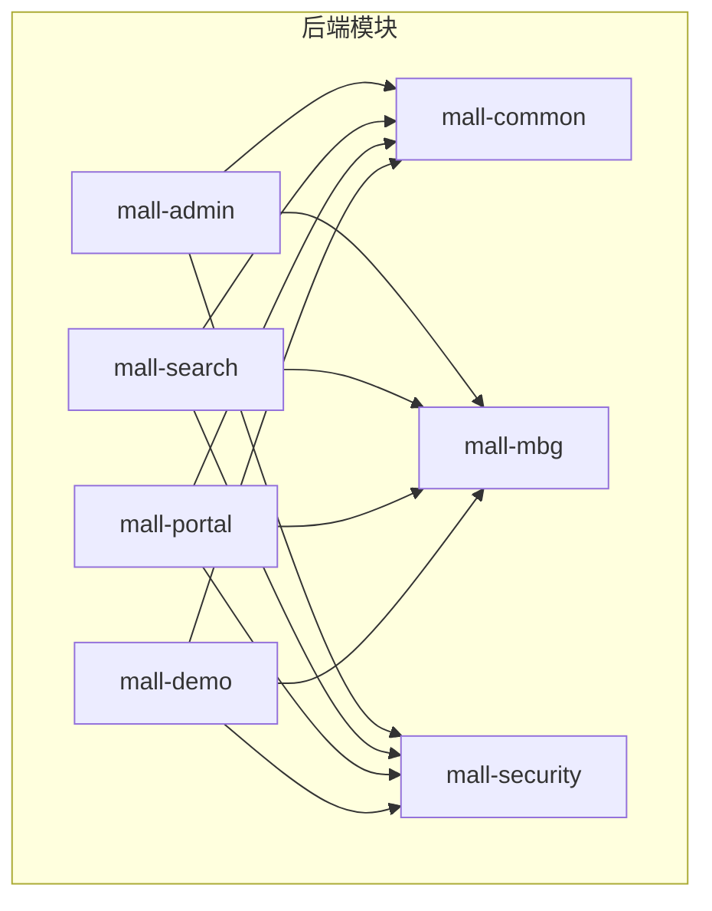
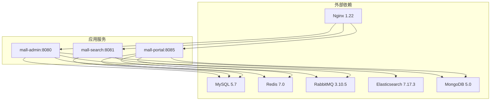
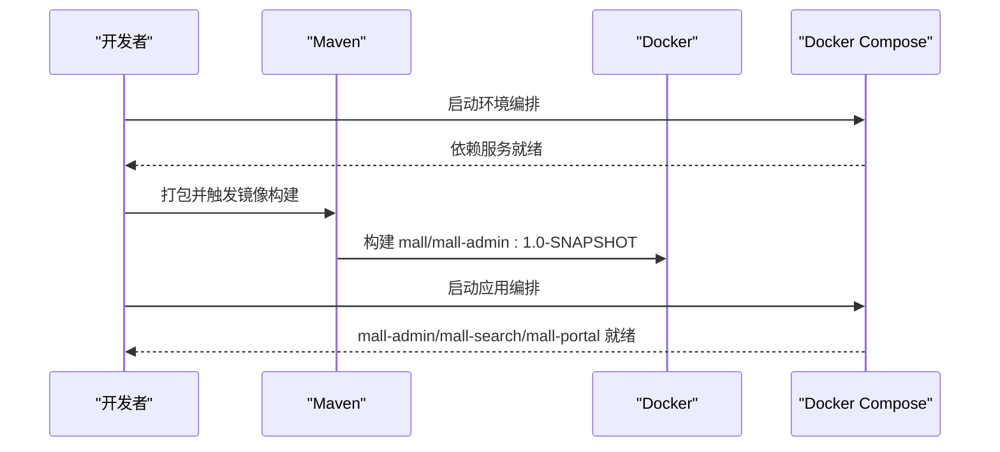
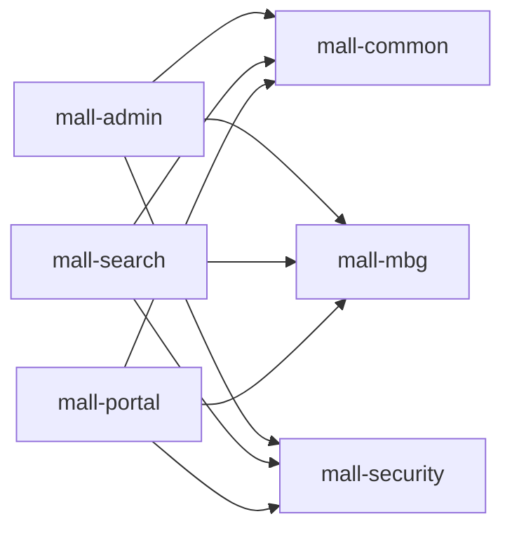

# 快速开始

<cite>
**本文引用的文件**
- [README.md](file://README.md)
- [deploy-windows.md](file://document/reference/deploy-windows.md)
- [linux.md](file://document/reference/linux.md)
- [docker.md](file://document/reference/docker.md)
- [docker-compose-env.yml](file://document/docker/docker-compose-env.yml)
- [docker-compose-app.yml](file://document/docker/docker-compose-app.yml)
- [nginx.conf](file://document/docker/nginx.conf)
- [run.sh](file://document/sh/run.sh)
- [admin-run.sh](file://admin-run.sh)
- [pom.xml](file://pom.xml)
- [application.yml（mall-admin）](file://mall-admin/src/main/resources/application.yml)
- [application-dev.yml（mall-admin）](file://mall-admin/src/main/resources/application-dev.yml)
- [application.yml（mall-search）](file://mall-search/src/main/resources/application.yml)
- [application.yml（mall-portal）](file://mall-portal/src/main/resources/application.yml)
- [mall.sql](file://document/sql/mall.sql)
</cite>

## 目录
1. [简介](#简介)
2. [项目结构](#项目结构)
3. [核心组件](#核心组件)
4. [架构总览](#架构总览)
5. [详细组件分析](#详细组件分析)
6. [依赖分析](#依赖分析)
7. [性能考虑](#性能考虑)
8. [故障排查指南](#故障排查指南)
9. [结论](#结论)
10. [附录](#附录)

## 简介
本指南面向首次接触 Mall 项目的开发者，提供从零到一的完整环境搭建与运行步骤，涵盖：
- 开发工具与依赖服务版本要求（JDK 1.8 或 JDK 17、MySQL 5.7、Redis 7.0、MongoDB 5.0、RabbitMQ 3.10.5、Nginx 1.22、Elasticsearch 7.17.3 等）
- Windows 与 Linux 环境下的部署流程（数据库初始化、依赖服务安装、项目克隆与编译运行）
- Docker 部署方案（镜像构建与容器编排）
- 常见问题排查与解决方案

## 项目结构
Mall 采用多模块 Maven 工程组织，核心模块包括：
- mall-common：通用工具与异常处理
- mall-mbg：MyBatis Generator 生成的数据库映射代码
- mall-security：Spring Security 封装与鉴权组件
- mall-admin：后台管理系统接口
- mall-search：基于 Elasticsearch 的商品搜索
- mall-portal：前台商城系统接口
- mall-demo：示例与测试代码

**图表来源**
- [pom.xml:12-20](file://pom.xml#L12-L20)

**章节来源**
- [pom.xml:12-20](file://pom.xml#L12-L20)

## 核心组件
- mall-admin：后台管理接口，提供商品、订单、促销、内容、会员、权限等管理能力
- mall-portal：前台商城接口，提供首页、商品、购物车、订单、会员中心等能力
- mall-search：商品搜索服务，基于 Elasticsearch 提供检索能力
- mall-security：统一的安全配置与鉴权组件
- mall-common：公共工具、异常处理、日志切面、Redis 服务等
- mall-mbg：数据库实体与 Mapper 自动生成

**章节来源**
- [README.md:51-62](file://README.md#L51-L62)

## 架构总览
Mall 采用前后端分离架构，后端通过 Spring Boot + MyBatis 实现，依赖 Redis、MySQL、MongoDB、RabbitMQ、Elasticsearch、Nginx 等中间件。Docker Compose 支持一键拉起环境与应用。

**图表来源**
- [docker-compose-env.yml:3-100](file://document/docker/docker-compose-env.yml#L3-L100)
- [docker-compose-app.yml:3-42](file://document/docker/docker-compose-app.yml#L3-L42)
- [application.yml（mall-admin）:1-66](file://mall-admin/src/main/resources/application.yml#L1-L66)
- [application.yml（mall-search）:1-20](file://mall-search/src/main/resources/application.yml#L1-L20)
- [application.yml（mall-portal）:1-62](file://mall-portal/src/main/resources/application.yml#L1-L62)

## 详细组件分析

### 环境与工具准备
- 开发工具与 IDE：建议使用 IDEA/Eclipse，安装 Lombok 插件
- JDK：项目根 POM 已升级至 JDK 17，如需兼容 JDK 8，请切换到 master 分支
- MySQL 5.7：安装后导入 mall.sql 初始化数据库
- Redis 7.0：启动服务
- MongoDB 5.0：安装并启动
- RabbitMQ 3.10.5：安装 Erlang，启用 management 插件，创建用户与 virtual host
- Nginx 1.22：静态资源与反向代理
- Elasticsearch 7.17.3：安装并启动，必要时安装 IK 分词插件
- Docker 与 Docker Compose：用于容器化部署

**章节来源**
- [README.md:166-179](file://README.md#L166-L179)
- [pom.xml:22-55](file://pom.xml#L22-L55)

### Windows 环境部署
- 安装并配置 IDEA/Eclipse，导入 Maven 项目
- 安装 JDK 1.8 或 JDK 17（根据分支选择），安装 MySQL 5.7 并导入 mall.sql
- 启动 Redis、MongoDB、RabbitMQ、Elasticsearch、Nginx
- 运行 mall-admin、mall-search、mall-portal 的主类
- 访问接口文档：mall-admin 与 mall-search 默认端口分别为 8080 与 8081

**章节来源**
- [deploy-windows.md:1-106](file://document/reference/deploy-windows.md#L1-L106)

### Linux 环境部署
- 使用 systemctl 管理服务（启动/停止/开机自启）
- 使用 yum/rpm 安装与管理软件
- 配置防火墙放通所需端口（如 80、3306、6379、9000、9001、9200、9300、27017、5672、15672）
- 使用 Docker Compose 编排环境与应用

**章节来源**
- [linux.md:1-149](file://document/reference/linux.md#L1-L149)

### Docker 部署方案
- 环境编排：使用 docker-compose-env.yml 启动 MySQL、Redis、Nginx、RabbitMQ、Elasticsearch、Logstash、Kibana、MongoDB、MinIO
- 应用编排：使用 docker-compose-app.yml 启动 mall-admin、mall-search、mall-portal，并通过 external_links 指向环境服务
- 镜像构建：根 POM 配置了 docker-maven-plugin，可在打包阶段构建镜像
- 单模块运行脚本：run.sh 与 admin-run.sh 提供镜像构建与容器启动示例

**图表来源**
- [pom.xml:214-255](file://pom.xml#L214-L255)
- [docker-compose-env.yml:1-100](file://document/docker/docker-compose-env.yml#L1-L100)
- [docker-compose-app.yml:1-42](file://document/docker/docker-compose-app.yml#L1-L42)
- [run.sh:1-28](file://document/sh/run.sh#L1-L28)
- [admin-run.sh:1-26](file://admin-run.sh#L1-L26)

**章节来源**
- [docker.md:1-98](file://document/reference/docker.md#L1-L98)
- [docker-compose-env.yml:1-100](file://document/docker/docker-compose-env.yml#L1-L100)
- [docker-compose-app.yml:1-42](file://document/docker/docker-compose-app.yml#L1-L42)
- [pom.xml:214-255](file://pom.xml#L214-L255)
- [run.sh:1-28](file://document/sh/run.sh#L1-L28)
- [admin-run.sh:1-26](file://admin-run.sh#L1-L26)

### 数据库初始化
- 在 MySQL 5.7 中创建 mall 数据库
- 执行 document/sql/mall.sql 完成表结构与初始数据导入
- 校验连接参数与字符集设置（utf8mb4）

**章节来源**
- [mall.sql:1-200](file://document/sql/mall.sql#L1-L200)

### 应用配置要点
- mall-admin
  - 默认激活 dev 环境
  - 数据源指向本地 MySQL，Redis 地址指向本地 Redis
  - MinIO 默认连接本地 MinIO
  - 安全白名单、JWT 参数、Redis Key 前缀等在配置文件中定义
- mall-search
  - 默认端口 8081，激活 dev 环境
- mall-portal
  - 默认激活 dev 环境
  - 定义了 JWT、安全白名单、Redis Key 前缀、MongoDB 插入开关、RabbitMQ 队列名等

**章节来源**
- [application.yml（mall-admin）:1-66](file://mall-admin/src/main/resources/application.yml#L1-L66)
- [application-dev.yml（mall-admin）:1-36](file://mall-admin/src/main/resources/application-dev.yml#L1-L36)
- [application.yml（mall-search）:1-20](file://mall-search/src/main/resources/application.yml#L1-L20)
- [application.yml（mall-portal）:1-62](file://mall-portal/src/main/resources/application.yml#L1-L62)

### Nginx 配置
- 提供基础的静态资源与反向代理示例，监听 80 端口
- 可结合实际域名与静态资源目录调整

**章节来源**
- [nginx.conf:1-46](file://document/docker/nginx.conf#L1-L46)

## 依赖分析
- 版本与兼容性
  - Spring Boot 3.2.0（JDK 17）
  - MyBatis 与 MyBatis Spring Boot Starter
  - Druid 连接池
  - PageHelper 分页
  - JWT、Hutool、Lombok、OpenAPI/SpringDoc
  - ElasticSearch、RabbitMQ、Redis、MongoDB、MinIO、Logstash/Kibana
- 模块间耦合
  - mall-admin/mall-search/mall-portal 均依赖 mall-common、mall-mbg、mall-security
  - mall-search 依赖 Elasticsearch
  - mall-portal 依赖 Redis、MongoDB、RabbitMQ

**图表来源**
- [pom.xml:12-20](file://pom.xml#L12-L20)

**章节来源**
- [pom.xml:93-194](file://pom.xml#L93-L194)

## 性能考虑
- 数据库连接池：Druid 默认配置可按生产环境调优
- 分页插件：PageHelper 已引入，合理使用可降低查询压力
- 缓存策略：Redis 作为缓存与会话存储，建议针对热点数据设置合理的过期策略
- 搜索优化：Elasticsearch 索引与分词策略需结合业务场景优化
- 日志采集：Logstash/Kibana 便于集中化日志分析与定位问题

## 故障排查指南
- 依赖服务未启动
  - 使用 systemctl/status 检查服务状态
  - 使用 netstat 查看端口占用
  - 防火墙放通对应端口
- 数据库连接失败
  - 校验 MySQL 字符集与时区设置
  - 确认 mall.sql 已正确导入
- 应用无法启动
  - 检查 JDK 版本与 Maven 构建参数
  - 查看容器日志：docker logs <容器名>
- Elasticsearch 启动异常
  - 调整 ES_JAVA_OPTS 内存参数
  - 若使用 IK 分词插件，确认插件路径与版本匹配
- RabbitMQ 权限问题
  - 确认用户与 virtual host 配置正确
- Nginx 代理问题
  - 校验监听端口与静态资源路径

**章节来源**
- [linux.md:98-146](file://document/reference/linux.md#L98-L146)
- [deploy-windows.md:18-106](file://document/reference/deploy-windows.md#L18-L106)
- [docker.md:33-44](file://document/reference/docker.md#L33-L44)

## 结论
通过本指南，您可以在 Windows/Linux 上完成 Mall 项目的环境搭建与运行，并掌握基于 Docker 的容器化部署方法。建议在开发过程中结合各模块配置文件与 Docker 编排，逐步扩展到生产级部署与运维。

## 附录
- 快速启动命令（Docker）
  - 启动环境：docker-compose -f document/docker/docker-compose-env.yml up -d
  - 启动应用：docker-compose -f document/docker/docker-compose-app.yml up -d
  - 停止与清理：docker-compose down
- 快速启动命令（本地）
  - 使用 admin-run.sh 直接在本地启动 mall-admin
  - 分别运行 mall-admin、mall-search、mall-portal 主类

**章节来源**
- [docker-compose-env.yml:1-100](file://document/docker/docker-compose-env.yml#L1-L100)
- [docker-compose-app.yml:1-42](file://document/docker/docker-compose-app.yml#L1-L42)
- [admin-run.sh:1-26](file://admin-run.sh#L1-L26)