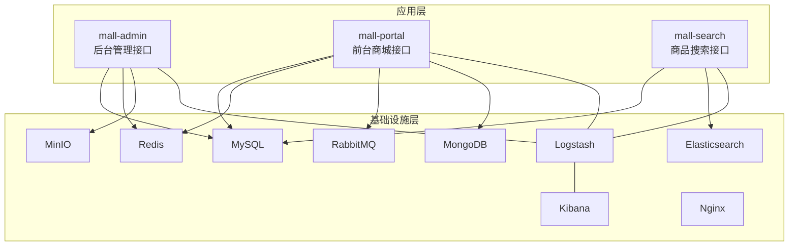
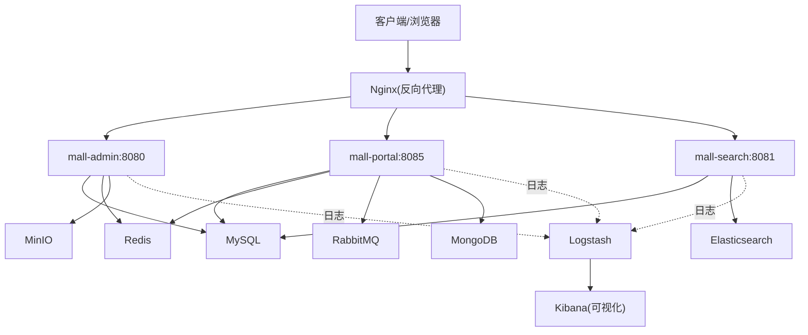
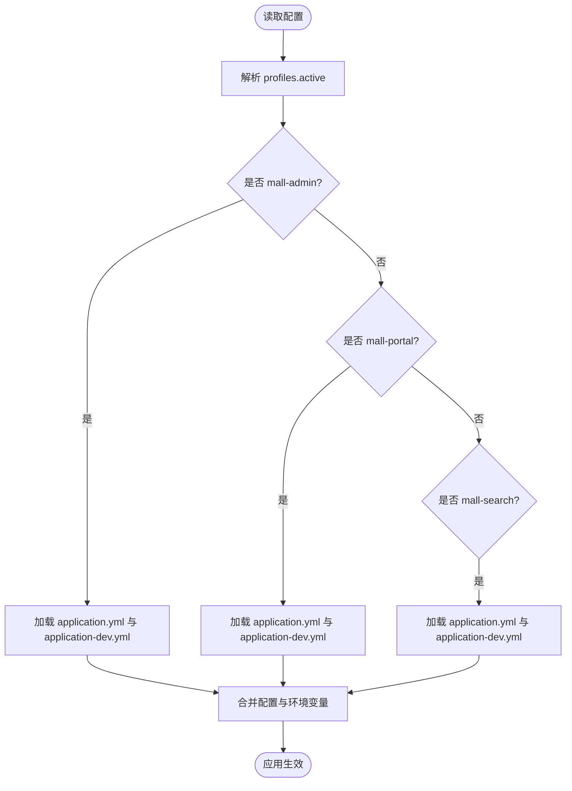
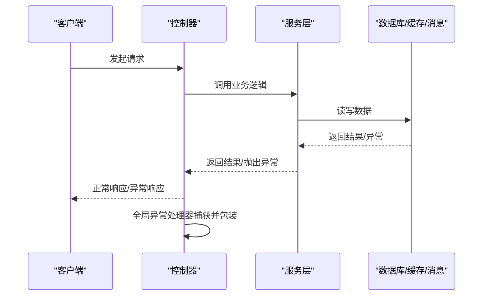
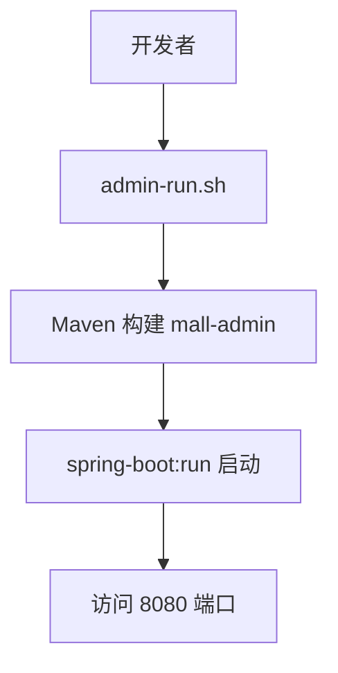
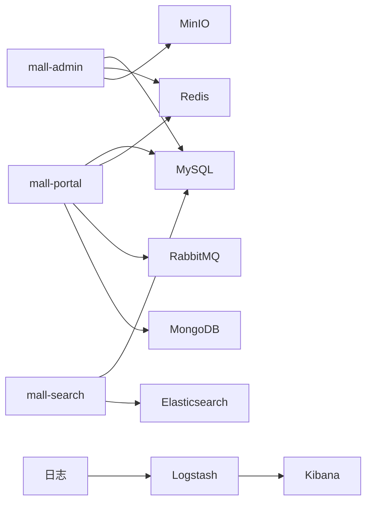

# 故障排查

<cite>
**本文引用的文件**
- [README.md](file://README.md)
- [mall-admin 应用配置 application.yml](file://mall-admin/src/main/resources/application.yml)
- [mall-admin 开发配置 application-dev.yml](file://mall-admin/src/main/resources/application-dev.yml)
- [mall-portal 应用配置 application.yml](file://mall-portal/src/main/resources/application.yml)
- [mall-portal 开发配置 application-dev.yml](file://mall-portal/src/main/resources/application-dev.yml)
- [mall-search 应用配置 application.yml](file://mall-search/src/main/resources/application.yml)
- [mall-search 开发配置 application-dev.yml](file://mall-search/src/main/resources/application-dev.yml)
- [公共模块日志配置 logback-spring.xml](file://mall-common/src/main/resources/logback-spring.xml)
- [Windows 环境搭建说明 deploy-windows.md](file://document/reference/deploy-windows.md)
- [Docker 常用命令 docker.md](file://document/reference/docker.md)
- [Docker 编排应用 docker-compose-app.yml](file://document/docker/docker-compose-app.yml)
- [Docker 编排环境 docker-compose-env.yml](file://document/docker/docker-compose-env.yml)
- [全局异常处理器 GlobalExceptionHandler.java](file://mall-common/src/main/java/com/macro/mall/common/exception/GlobalExceptionHandler.java)
- [Linux 常用命令 linux.md](file://document/reference/linux.md)
- [MySQL 常用命令 mysql.md](file://document/reference/mysql.md)
- [admin-run.sh 启动脚本](file://admin-run.sh)
</cite>

## 目录
1. [简介](#简介)
2. [项目结构](#项目结构)
3. [核心组件](#核心组件)
4. [架构总览](#架构总览)
5. [详细组件分析](#详细组件分析)
6. [依赖关系分析](#依赖关系分析)
7. [性能考量](#性能考量)
8. [故障排查指南](#故障排查指南)
9. [结论](#结论)
10. [附录](#附录)

## 简介
本故障排查文档面向 Mall 项目的开发与运维人员，聚焦于开发、测试、生产三类环境中的常见问题与系统化排查方法。内容涵盖环境配置问题、数据库连接问题、服务启动失败、接口调用异常、日志分析、网络诊断、性能监控、紧急应急与回滚策略，以及问题反馈与升级流程。

## 项目结构
Mall 采用多模块 Maven 结构，包含通用模块、数据模型与生成器、安全模块、后台管理、前台门户、搜索服务等。各模块通过 Spring Boot 启动，配合 Docker 编排与 ELK 日志体系，形成前后端分离、服务独立部署的架构。

**图表来源**
- [mall-admin 应用配置 application.yml:1-66](file://mall-admin/src/main/resources/application.yml#L1-L66)
- [mall-portal 应用配置 application.yml:1-62](file://mall-portal/src/main/resources/application.yml#L1-L62)
- [mall-search 应用配置 application.yml:1-20](file://mall-search/src/main/resources/application.yml#L1-L20)
- [Docker 编排环境 docker-compose-env.yml:1-100](file://document/docker/docker-compose-env.yml#L1-L100)
- [Docker 编排应用 docker-compose-app.yml:1-42](file://document/docker/docker-compose-app.yml#L1-L42)

**章节来源**
- [README.md:51-62](file://README.md#L51-L62)
- [mall-admin 应用配置 application.yml:1-66](file://mall-admin/src/main/resources/application.yml#L1-L66)
- [mall-portal 应用配置 application.yml:1-62](file://mall-portal/src/main/resources/application.yml#L1-L62)
- [mall-search 应用配置 application.yml:1-20](file://mall-search/src/main/resources/application.yml#L1-L20)
- [Docker 编排环境 docker-compose-env.yml:1-100](file://document/docker/docker-compose-env.yml#L1-L100)
- [Docker 编排应用 docker-compose-app.yml:1-42](file://document/docker/docker-compose-app.yml#L1-L42)

## 核心组件
- 配置与环境
  - 应用配置：各模块 application.yml 定义了 profiles、MyBatis、JWT、Redis、安全白名单、阿里云 OSS/MinIO 等关键参数。
  - 开发配置：application-dev.yml 提供本地开发所需的数据库、缓存、消息队列、日志与第三方服务地址。
- 日志与可观测性
  - logback-spring.xml 将 DEBUG/ERROR 业务日志与接口访问记录分别输出至文件与 Logstash，便于集中采集与 Kibana 可视化。
- 异常处理
  - 全局异常处理器统一拦截业务异常、参数校验异常与 SQL 语法异常，返回标准化响应。
- 运维与部署
  - Docker 编排文件定义应用与基础设施的镜像、端口映射、卷挂载与依赖关系。
  - Windows/Linux 环境搭建与常用命令文档提供安装与排障指引。

**章节来源**
- [mall-admin 应用配置 application.yml:1-66](file://mall-admin/src/main/resources/application.yml#L1-L66)
- [mall-admin 开发配置 application-dev.yml:1-36](file://mall-admin/src/main/resources/application-dev.yml#L1-L36)
- [mall-portal 应用配置 application.yml:1-62](file://mall-portal/src/main/resources/application.yml#L1-L62)
- [mall-portal 开发配置 application-dev.yml:1-53](file://mall-portal/src/main/resources/application-dev.yml#L1-L53)
- [mall-search 应用配置 application.yml:1-20](file://mall-search/src/main/resources/application.yml#L1-L20)
- [mall-search 开发配置 application-dev.yml:1-29](file://mall-search/src/main/resources/application-dev.yml#L1-L29)
- [公共模块日志配置 logback-spring.xml:1-203](file://mall-common/src/main/resources/logback-spring.xml#L1-L203)
- [全局异常处理器 GlobalExceptionHandler.java:1-69](file://mall-common/src/main/java/com/macro/mall/common/exception/GlobalExceptionHandler.java#L1-L69)
- [Docker 编排环境 docker-compose-env.yml:1-100](file://document/docker/docker-compose-env.yml#L1-L100)
- [Docker 编排应用 docker-compose-app.yml:1-42](file://document/docker/docker-compose-app.yml#L1-L42)

## 架构总览
下图展示应用与基础设施之间的交互关系，以及日志采集链路。

**图表来源**
- [Docker 编排应用 docker-compose-app.yml:1-42](file://document/docker/docker-compose-app.yml#L1-L42)
- [Docker 编排环境 docker-compose-env.yml:1-100](file://document/docker/docker-compose-env.yml#L1-L100)
- [mall-admin 应用配置 application.yml:1-66](file://mall-admin/src/main/resources/application.yml#L1-L66)
- [mall-portal 应用配置 application.yml:1-62](file://mall-portal/src/main/resources/application.yml#L1-L62)
- [mall-search 应用配置 application.yml:1-20](file://mall-search/src/main/resources/application.yml#L1-L20)
- [公共模块日志配置 logback-spring.xml:1-203](file://mall-common/src/main/resources/logback-spring.xml#L1-L203)

## 详细组件分析

### 配置与环境组件
- mall-admin
  - 默认激活 dev 环境，集成 MyBatis、JWT、Redis、安全白名单、阿里云 OSS/MinIO。
  - 开发配置中包含 MySQL 连接、Druid 监控、Redis 连接、MinIO 地址与凭据、日志与 Logstash 主机。
- mall-portal
  - 默认激活 dev 环境，集成 MyBatis、JWT、安全白名单、Redis、MongoDB、RabbitMQ。
  - 开发配置中包含 MySQL、MongoDB、Redis、RabbitMQ、日志与支付宝沙箱参数。
- mall-search
  - 默认激活 dev 环境，集成 MyBatis、Elasticsearch 客户端。
  - 开发配置中包含 MySQL、Elasticsearch 连接、日志与 Logstash 主机。

**图表来源**
- [mall-admin 应用配置 application.yml:1-66](file://mall-admin/src/main/resources/application.yml#L1-L66)
- [mall-admin 开发配置 application-dev.yml:1-36](file://mall-admin/src/main/resources/application-dev.yml#L1-L36)
- [mall-portal 应用配置 application.yml:1-62](file://mall-portal/src/main/resources/application.yml#L1-L62)
- [mall-portal 开发配置 application-dev.yml:1-53](file://mall-portal/src/main/resources/application-dev.yml#L1-L53)
- [mall-search 应用配置 application.yml:1-20](file://mall-search/src/main/resources/application.yml#L1-L20)
- [mall-search 开发配置 application-dev.yml:1-29](file://mall-search/src/main/resources/application-dev.yml#L1-L29)

**章节来源**
- [mall-admin 应用配置 application.yml:1-66](file://mall-admin/src/main/resources/application.yml#L1-L66)
- [mall-admin 开发配置 application-dev.yml:1-36](file://mall-admin/src/main/resources/application-dev.yml#L1-L36)
- [mall-portal 应用配置 application.yml:1-62](file://mall-portal/src/main/resources/application.yml#L1-L62)
- [mall-portal 开发配置 application-dev.yml:1-53](file://mall-portal/src/main/resources/application-dev.yml#L1-L53)
- [mall-search 应用配置 application.yml:1-20](file://mall-search/src/main/resources/application.yml#L1-L20)
- [mall-search 开发配置 application-dev.yml:1-29](file://mall-search/src/main/resources/application-dev.yml#L1-L29)

### 日志与异常处理组件
- 日志
  - 控制台、文件、Logstash 多通道输出，DEBUG/ERROR 分级，业务日志与接口访问记录分离。
  - Logstash 接收端口：4560/4561/4562/4563，Kibana 可视化。
- 异常
  - 统一捕获业务异常、参数校验异常、SQL 语法异常，返回标准化结果；对演示环境的权限受限进行友好提示。

**图表来源**
- [全局异常处理器 GlobalExceptionHandler.java:1-69](file://mall-common/src/main/java/com/macro/mall/common/exception/GlobalExceptionHandler.java#L1-L69)
- [公共模块日志配置 logback-spring.xml:1-203](file://mall-common/src/main/resources/logback-spring.xml#L1-L203)

**章节来源**
- [公共模块日志配置 logback-spring.xml:1-203](file://mall-common/src/main/resources/logback-spring.xml#L1-L203)
- [全局异常处理器 GlobalExceptionHandler.java:1-69](file://mall-common/src/main/java/com/macro/mall/common/exception/GlobalExceptionHandler.java#L1-L69)

### 部署与编排组件
- Docker 编排
  - 环境编排：MySQL、Redis、Nginx、RabbitMQ、Elasticsearch、Logstash、Kibana、MongoDB、MinIO。
  - 应用编排：mall-admin、mall-search、mall-portal 的镜像、端口、卷与外部链接。
- 启动脚本
  - admin-run.sh 指定 JDK 17，使用 Maven 构建并启动 mall-admin 模块，跳过测试与 Docker 打包。

**图表来源**
- [admin-run.sh 启动脚本:1-26](file://admin-run.sh#L1-L26)

**章节来源**
- [Docker 编排环境 docker-compose-env.yml:1-100](file://document/docker/docker-compose-env.yml#L1-L100)
- [Docker 编排应用 docker-compose-app.yml:1-42](file://document/docker/docker-compose-app.yml#L1-L42)
- [admin-run.sh 启动脚本:1-26](file://admin-run.sh#L1-L26)

## 依赖关系分析
- 组件耦合
  - mall-admin 依赖 MySQL、Redis、MinIO；mall-portal 依赖 MySQL、Redis、MongoDB、RabbitMQ；mall-search 依赖 MySQL、Elasticsearch。
- 外部依赖
  - 日志采集链路：应用日志经 Logstash 聚合，Kibana 可视化。
- 潜在环路
  - 模块间通过配置与编排文件解耦，未见直接循环依赖。

**图表来源**
- [mall-admin 应用配置 application.yml:1-66](file://mall-admin/src/main/resources/application.yml#L1-L66)
- [mall-portal 应用配置 application.yml:1-62](file://mall-portal/src/main/resources/application.yml#L1-L62)
- [mall-search 应用配置 application.yml:1-20](file://mall-search/src/main/resources/application.yml#L1-L20)
- [公共模块日志配置 logback-spring.xml:1-203](file://mall-common/src/main/resources/logback-spring.xml#L1-L203)

**章节来源**
- [mall-admin 应用配置 application.yml:1-66](file://mall-admin/src/main/resources/application.yml#L1-L66)
- [mall-portal 应用配置 application.yml:1-62](file://mall-portal/src/main/resources/application.yml#L1-L62)
- [mall-search 应用配置 application.yml:1-20](file://mall-search/src/main/resources/application.yml#L1-L20)
- [公共模块日志配置 logback-spring.xml:1-203](file://mall-common/src/main/resources/logback-spring.xml#L1-L203)

## 性能考量
- 日志级别与输出
  - 生产建议降低 DEBUG 输出，避免磁盘与网络压力；保留 ERROR 与业务日志通道。
- 数据库连接池
  - Druid 连接池参数需结合并发与慢查询优化，避免连接泄漏与超时。
- 缓存与消息
  - Redis/MQ 配置应与实例规格匹配，避免阻塞与堆积。
- 搜索与存储
  - Elasticsearch 索引与分片策略影响查询性能；MinIO/MongoDB 的 IO 与网络带宽需评估。

[本节为通用指导，无需特定文件引用]

## 故障排查指南

### 一、环境配置问题
- 症状
  - 应用无法启动、端口被占用、配置不生效。
- 排查步骤
  - 确认 profiles.active 是否正确（默认 dev），检查 application.yml 与 application-dev.yml 的加载顺序。
  - 校验数据库、Redis、MQ、ES、Mongo、MinIO 的连接地址与凭据。
  - 使用 Docker Compose 检查容器健康与端口映射。
- 工具与命令
  - Docker 常用命令：启动/停止/查看日志、进入容器、查看资源使用。
  - Linux 常用命令：查看进程、端口、磁盘、网络状态。
- 常见原因
  - 环境变量覆盖、配置文件路径错误、容器间网络不通、时区与时钟不同步。

**章节来源**
- [mall-admin 应用配置 application.yml:1-66](file://mall-admin/src/main/resources/application.yml#L1-L66)
- [mall-admin 开发配置 application-dev.yml:1-36](file://mall-admin/src/main/resources/application-dev.yml#L1-L36)
- [mall-portal 应用配置 application.yml:1-62](file://mall-portal/src/main/resources/application.yml#L1-L62)
- [mall-portal 开发配置 application-dev.yml:1-53](file://mall-portal/src/main/resources/application-dev.yml#L1-L53)
- [mall-search 应用配置 application.yml:1-20](file://mall-search/src/main/resources/application.yml#L1-L20)
- [mall-search 开发配置 application-dev.yml:1-29](file://mall-search/src/main/resources/application-dev.yml#L1-L29)
- [Docker 常用命令 docker.md:1-98](file://document/reference/docker.md#L1-L98)
- [Linux 常用命令 linux.md:1-149](file://document/reference/linux.md#L1-L149)

### 二、数据库连接问题
- 症状
  - 应用启动报错、SQL 执行失败、连接池耗尽。
- 排查步骤
  - 校验 JDBC URL、用户名、密码与时区配置。
  - 检查 MySQL 服务状态、端口开放、权限与字符集。
  - 观察 Druid 监控页面（login-username/password）定位慢查询与连接数峰值。
- 工具与命令
  - MySQL 常用命令：登录、查看表、权限、时区、字符集。
- 常见原因
  - 用户权限不足、时区不一致、字符集不匹配、连接池参数过小。

**章节来源**
- [mall-admin 开发配置 application-dev.yml:1-36](file://mall-admin/src/main/resources/application-dev.yml#L1-L36)
- [mall-portal 开发配置 application-dev.yml:1-53](file://mall-portal/src/main/resources/application-dev.yml#L1-L53)
- [mall-search 开发配置 application-dev.yml:1-29](file://mall-search/src/main/resources/application-dev.yml#L1-L29)
- [MySQL 常用命令 mysql.md:1-78](file://document/reference/mysql.md#L1-L78)

### 三、服务启动失败
- 症状
  - mall-admin/mall-portal/mall-search 启动失败或端口占用。
- 排查步骤
  - 使用 admin-run.sh 或 Docker Compose 启动，查看容器日志与应用日志。
  - 检查 JDK 版本与 Maven 参数是否匹配（脚本中指定 JDK 17）。
  - 确认依赖服务（MySQL、Redis、MQ、ES、Mongo、MinIO）已就绪。
- 工具与命令
  - Docker logs、exec、stats；Linux ps/top/netstat。
- 常见原因
  - 端口冲突、依赖未启动、JVM 参数不当、配置缺失。

**章节来源**
- [admin-run.sh 启动脚本:1-26](file://admin-run.sh#L1-L26)
- [Docker 常用命令 docker.md:1-98](file://document/reference/docker.md#L1-L98)
- [Linux 常用命令 linux.md:1-149](file://document/reference/linux.md#L1-L149)

### 四、接口调用异常
- 症状
  - 请求返回 4xx/5xx、参数校验失败、业务异常。
- 排查步骤
  - 查看全局异常处理器返回的标准化错误信息。
  - 检查 JWT 头、白名单放行路径、跨域与安全配置。
  - 核对 Redis/MQ/ES/Mongo/MinIO 的可用性与权限。
- 工具与命令
  - Postman/浏览器控制台抓包；Kibana 查看接口访问记录。
- 常见原因
  - 认证失败、参数不合法、下游服务不可用、缓存/消息/搜索异常。

**章节来源**
- [全局异常处理器 GlobalExceptionHandler.java:1-69](file://mall-common/src/main/java/com/macro/mall/common/exception/GlobalExceptionHandler.java#L1-L69)
- [mall-admin 应用配置 application.yml:1-66](file://mall-admin/src/main/resources/application.yml#L1-L66)
- [mall-portal 应用配置 application.yml:1-62](file://mall-portal/src/main/resources/application.yml#L1-L62)
- [mall-search 应用配置 application.yml:1-20](file://mall-search/src/main/resources/application.yml#L1-L20)
- [公共模块日志配置 logback-spring.xml:1-203](file://mall-common/src/main/resources/logback-spring.xml#L1-L203)

### 五、日志分析与可视化
- 症状
  - 问题定位困难、日志分散、难以聚合。
- 排查步骤
  - 确认 logback-spring.xml 的 Logstash 目的地与端口配置。
  - 在 Kibana 中建立索引模式，筛选服务名、级别、线程、类名与堆栈。
- 工具与命令
  - Logstash 配置文件挂载；Kibana 界面查询与仪表板。
- 常见原因
  - Logstash 未启动、端口未开放、编码或时区不一致。

**章节来源**
- [公共模块日志配置 logback-spring.xml:1-203](file://mall-common/src/main/resources/logback-spring.xml#L1-L203)
- [Docker 编排环境 docker-compose-env.yml:54-80](file://document/docker/docker-compose-env.yml#L54-L80)

### 六、网络诊断
- 症状
  - 容器间无法通信、外网访问异常、DNS 解析失败。
- 排查步骤
  - 使用 Docker inspect 查看 IP 与网络；使用 nsenter 进入容器内部。
  - 使用 Linux netstat/iptables 检查端口与防火墙。
- 工具与命令
  - Docker inspect/exec；Linux netstat/iptables/ifconfig。
- 常见原因
  - 端口未映射、防火墙阻断、容器网络隔离。

**章节来源**
- [Docker 常用命令 docker.md:1-98](file://document/reference/docker.md#L1-L98)
- [Linux 常用命令 linux.md:1-149](file://document/reference/linux.md#L1-L149)

### 七、性能监控
- 症状
  - 响应缓慢、CPU/内存/IO 峰值、连接池抖动。
- 排查步骤
  - 使用 Docker stats 查看容器资源；Linux top/iotop 观察系统资源。
  - 结合日志与慢查询分析热点接口与数据访问路径。
- 工具与命令
  - Docker stats；Linux ps/top/df/iostat。
- 常见原因
  - 未命中缓存、慢 SQL、消息堆积、搜索索引过大。

**章节来源**
- [Docker 常用命令 docker.md:1-98](file://document/reference/docker.md#L1-L98)
- [Linux 常用命令 linux.md:1-149](file://document/reference/linux.md#L1-L149)

### 八、不同环境差异与处理策略
- 开发环境
  - 本地直连 MySQL/Redis/MQ/ES/Mongo/MinIO，日志输出到本地与 Logstash。
- 测试环境
  - 与生产相似的资源规模，侧重回归与性能验证；注意数据隔离与清理。
- 生产环境
  - 严格的安全与监控策略，最小权限原则，完善的备份与回滚预案。

**章节来源**
- [mall-admin 开发配置 application-dev.yml:1-36](file://mall-admin/src/main/resources/application-dev.yml#L1-L36)
- [mall-portal 开发配置 application-dev.yml:1-53](file://mall-portal/src/main/resources/application-dev.yml#L1-L53)
- [mall-search 开发配置 application-dev.yml:1-29](file://mall-search/src/main/resources/application-dev.yml#L1-L29)
- [Docker 编排环境 docker-compose-env.yml:1-100](file://document/docker/docker-compose-env.yml#L1-L100)

### 九、紧急应急与回滚策略
- 应急步骤
  - 快速降级：关闭非关键接口、禁用缓存/消息/搜索等可选能力。
  - 限流熔断：利用网关或应用层限流，保护核心链路。
  - 快速恢复：回滚到最近一次稳定镜像/版本，恢复依赖服务。
- 回滚策略
  - Docker 镜像版本化管理，记录构建时间与变更；回滚时停止旧容器、拉取旧镜像、启动新容器。
  - 数据库变更采用灰度发布与回滚脚本，确保一致性。
- 通知与升级
  - 通过统一渠道发布故障公告，记录故障现象、根因、处置过程与改进措施。

**章节来源**
- [Docker 编排应用 docker-compose-app.yml:1-42](file://document/docker/docker-compose-app.yml#L1-L42)
- [Docker 编排环境 docker-compose-env.yml:1-100](file://document/docker/docker-compose-env.yml#L1-L100)

### 十、问题反馈与升级流程
- 反馈渠道
  - 使用项目文档提供的学习教程与社区入口，提交问题与建议。
- 升级流程
  - 评估影响范围与风险，制定灰度发布计划，记录变更与回滚预案，发布后持续观察指标与日志。

**章节来源**
- [README.md:1-208](file://README.md#L1-L208)

## 结论
通过规范的配置管理、完善的日志与异常处理、清晰的部署编排与环境差异策略，Mall 项目可在多环境下稳定运行。建议在生产环境中强化监控与告警、完善应急预案与演练，确保系统高可用与可维护性。

## 附录
- 快速检查清单
  - 配置文件加载顺序与参数正确性
  - 依赖服务健康与端口可达
  - 日志通道与可视化链路正常
  - Docker 容器状态与资源使用
  - 网络与防火墙策略
  - 数据库权限与时区一致性
- 参考文档
  - Windows 环境搭建、Docker 常用命令、Linux 常用命令、MySQL 常用命令

**章节来源**
- [Windows 环境搭建说明 deploy-windows.md:1-106](file://document/reference/deploy-windows.md#L1-L106)
- [Docker 常用命令 docker.md:1-98](file://document/reference/docker.md#L1-L98)
- [Linux 常用命令 linux.md:1-149](file://document/reference/linux.md#L1-L149)
- [MySQL 常用命令 mysql.md:1-78](file://document/reference/mysql.md#L1-L78)