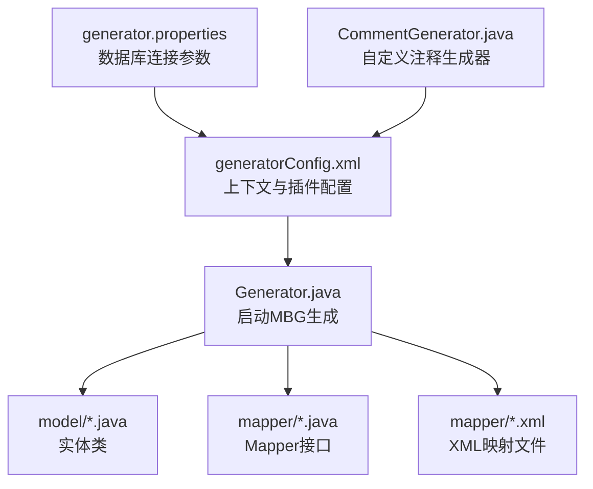
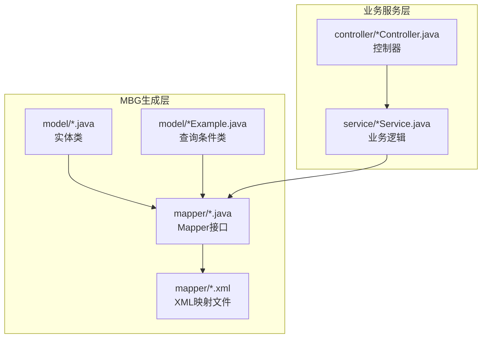
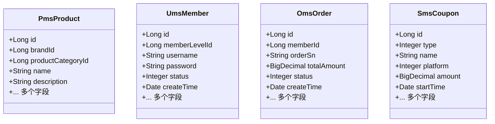
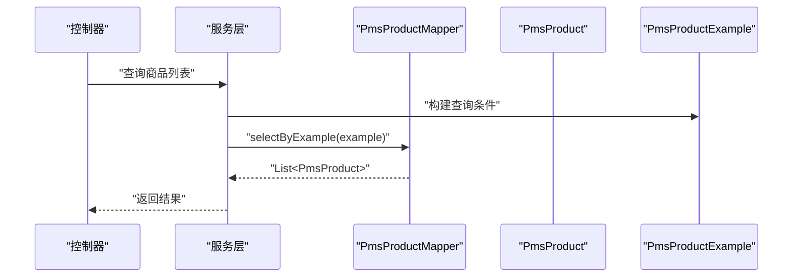
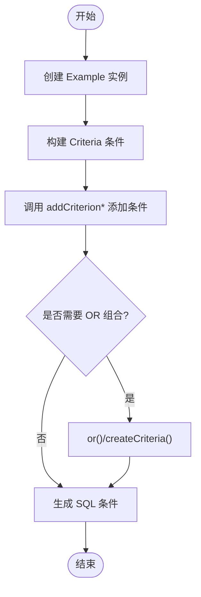
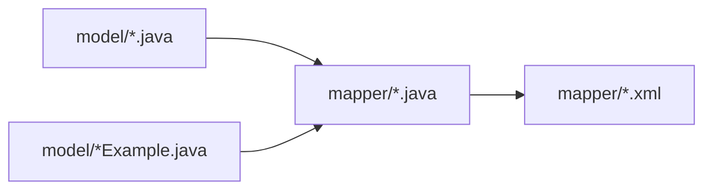

# 实体模型设计

<cite>
**本文引用的文件**
- [generatorConfig.xml](file://mall-mbg/src/main/resources/generatorConfig.xml)
- [generator.properties](file://mall-mbg/src/main/resources/generator.properties)
- [Generator.java](file://mall-mbg/src/main/java/com/macro/mall/Generator.java)
- [CommentGenerator.java](file://mall-mbg/src/main/java/com/macro/mall/CommentGenerator.java)
- [PmsProduct.java](file://mall-mbg/src/main/java/com/macro/mall/model/PmsProduct.java)
- [UmsMember.java](file://mall-mbg/src/main/java/com/macro/mall/model/UmsMember.java)
- [OmsOrder.java](file://mall-mbg/src/main/java/com/macro/mall/model/OmsOrder.java)
- [SmsCoupon.java](file://mall-mbg/src/main/java/com/macro/mall/model/SmsCoupon.java)
- [PmsProductExample.java](file://mall-mbg/src/main/java/com/macro/mall/model/PmsProductExample.java)
- [UmsMemberExample.java](file://mall-mbg/src/main/java/com/macro/mall/model/UmsMemberExample.java)
- [OmsOrderExample.java](file://mall-mbg/src/main/java/com/macro/mall/model/OmsOrderExample.java)
- [PmsProductMapper.java](file://mall-mbg/src/main/java/com/macro/mall/mapper/PmsProductMapper.java)
- [UmsMemberMapper.java](file://mall-mbg/src/main/java/com/macro/mall/mapper/UmsMemberMapper.java)
- [OmsOrderMapper.java](file://mall-mbg/src/main/java/com/macro/mall/mapper/OmsOrderMapper.java)
</cite>

## 目录
1. [简介](#简介)
2. [项目结构](#项目结构)
3. [核心组件](#核心组件)
4. [架构总览](#架构总览)
5. [详细组件分析](#详细组件分析)
6. [依赖分析](#依赖分析)
7. [性能考虑](#性能考虑)
8. [故障排查指南](#故障排查指南)
9. [结论](#结论)
10. [附录](#附录)

## 简介
本文件系统性梳理 Mall 项目的实体模型设计，聚焦于 MyBatis Generator（MBG）生成的实体类与查询条件类（Example）。内容涵盖：
- 模型类命名规范与包结构
- 字段映射关系与注释来源
- 主键映射、外键关系与关联字段识别
- 继承关系与公共字段设计
- 使用示例与最佳实践
- 自定义扩展方法与注意事项
- 在不同模块中的应用场景与数据传递方式

## 项目结构
实体模型由 mall-mbg 模块集中管理，通过 MBG 配置生成 Java Model、Mapper 接口与 XML 映射文件。核心生成流程与配置如下：
- 生成器入口：[Generator.java](file://mall-mbg/src/main/java/com/macro/mall/Generator.java)
- 生成器配置：[generatorConfig.xml](file://mall-mbg/src/main/resources/generatorConfig.xml)
- 数据库连接参数：[generator.properties](file://mall-mbg/src/main/resources/generator.properties)
- 自定义注释生成器：[CommentGenerator.java](file://mall-mbg/src/main/java/com/macro/mall/CommentGenerator.java)

图表来源
- [generatorConfig.xml:1-50](file://mall-mbg/src/main/resources/generatorConfig.xml#L1-L50)
- [generator.properties:1-4](file://mall-mbg/src/main/resources/generator.properties#L1-L4)
- [Generator.java:17-37](file://mall-mbg/src/main/java/com/macro/mall/Generator.java#L17-L37)
- [CommentGenerator.java:17-65](file://mall-mbg/src/main/java/com/macro/mall/CommentGenerator.java#L17-L65)

章节来源
- [generatorConfig.xml:1-50](file://mall-mbg/src/main/resources/generatorConfig.xml#L1-L50)
- [generator.properties:1-4](file://mall-mbg/src/main/resources/generator.properties#L1-L4)
- [Generator.java:1-39](file://mall-mbg/src/main/java/com/macro/mall/Generator.java#L1-L39)
- [CommentGenerator.java:1-66](file://mall-mbg/src/main/java/com/macro/mall/CommentGenerator.java#L1-L66)

## 核心组件
- 实体类（Model）：以 com.macro.mall.model 包组织，每个表对应一个类，字段与数据库列一一映射，支持序列化与 toString 输出。
- 查询条件类（Example）：以 com.macro.mall.model 包组织，类名以实体类名 + Example 结尾，提供链式条件构建与 addCriterion 方法族。
- Mapper 接口：以 com.macro.mall.mapper 包组织，提供基于 Example 的增删改查与按主键操作的方法签名。

章节来源
- [PmsProduct.java:1-482](file://mall-mbg/src/main/java/com/macro/mall/model/PmsProduct.java#L1-L482)
- [UmsMember.java:1-228](file://mall-mbg/src/main/java/com/macro/mall/model/UmsMember.java#L1-L228)
- [OmsOrder.java:1-504](file://mall-mbg/src/main/java/com/macro/mall/model/OmsOrder.java#L1-L504)
- [SmsCoupon.java:1-218](file://mall-mbg/src/main/java/com/macro/mall/model/SmsCoupon.java#L1-L218)
- [PmsProductExample.java:1-200](file://mall-mbg/src/main/java/com/macro/mall/model/PmsProductExample.java#L1-L200)
- [UmsMemberExample.java:1-200](file://mall-mbg/src/main/java/com/macro/mall/model/UmsMemberExample.java#L1-L200)
- [OmsOrderExample.java:1-200](file://mall-mbg/src/main/java/com/macro/mall/model/OmsOrderExample.java#L1-L200)
- [PmsProductMapper.java:1-36](file://mall-mbg/src/main/java/com/macro/mall/mapper/PmsProductMapper.java#L1-L36)
- [UmsMemberMapper.java:1-30](file://mall-mbg/src/main/java/com/macro/mall/mapper/UmsMemberMapper.java#L1-L30)
- [OmsOrderMapper.java:1-30](file://mall-mbg/src/main/java/com/macro/mall/mapper/OmsOrderMapper.java#L1-L30)

## 架构总览
MBG 生成的实体模型在系统中的位置与交互如下：

图表来源
- [PmsProduct.java:1-482](file://mall-mbg/src/main/java/com/macro/mall/model/PmsProduct.java#L1-L482)
- [PmsProductExample.java:1-200](file://mall-mbg/src/main/java/com/macro/mall/model/PmsProductExample.java#L1-L200)
- [PmsProductMapper.java:1-36](file://mall-mbg/src/main/java/com/macro/mall/mapper/PmsProductMapper.java#L1-L36)
- [generatorConfig.xml:38-43](file://mall-mbg/src/main/resources/generatorConfig.xml#L38-L43)

## 详细组件分析

### 命名规范与包结构
- 实体类：位于 com.macro.mall.model，类名与数据库表名一一对应（如 PmsProduct 对应 pms_product）。
- 查询条件类：类名在实体类名后加 Example（如 PmsProductExample）。
- Mapper 接口：位于 com.macro.mall.mapper，类名在实体类名后加 Mapper（如 PmsProductMapper）。
- XML 映射文件：位于 resources 下的 com.macro.mall.mapper 包路径，与 Mapper 接口同名。

章节来源
- [generatorConfig.xml:38-43](file://mall-mbg/src/main/resources/generatorConfig.xml#L38-L43)

### 字段映射关系与注释说明
- 字段映射：实体类字段与数据库列严格对应，类型遵循 Java 基本类型、包装类型、BigDecimal、Date 等常见映射。
- 注释来源：通过自定义 CommentGenerator 启用 addRemarkComments 参数，将数据库列备注写入字段 JavaDoc；同时 suppressAllComments 与 suppressDate 控制注释生成策略。

图表来源
- [PmsProduct.java:7-92](file://mall-mbg/src/main/java/com/macro/mall/model/PmsProduct.java#L7-L92)
- [UmsMember.java:6-45](file://mall-mbg/src/main/java/com/macro/mall/model/UmsMember.java#L6-L45)
- [OmsOrder.java:7-96](file://mall-mbg/src/main/java/com/macro/mall/model/OmsOrder.java#L7-L96)
- [SmsCoupon.java:7-44](file://mall-mbg/src/main/java/com/macro/mall/model/SmsCoupon.java#L7-L44)

章节来源
- [CommentGenerator.java:35-58](file://mall-mbg/src/main/java/com/macro/mall/CommentGenerator.java#L35-L58)
- [generatorConfig.xml:21-28](file://mall-mbg/src/main/resources/generatorConfig.xml#L21-L28)

### 主键映射与外键关系
- 主键映射：generatorConfig.xml 中通过 generatedKey 指定主键列与自增策略，确保实体类主键字段正确生成。
- 外键关系：实体类中以 Long 类型字段表示外键（如 PmsProduct.brandId、OmsOrder.memberId），在业务层通过 Mapper 与 XML 进行关联查询或更新。

图表来源
- [PmsProductMapper.java:19-21](file://mall-mbg/src/main/java/com/macro/mall/mapper/PmsProductMapper.java#L19-L21)
- [PmsProductExample.java:49-66](file://mall-mbg/src/main/java/com/macro/mall/model/PmsProductExample.java#L49-L66)

章节来源
- [generatorConfig.xml:45-48](file://mall-mbg/src/main/resources/generatorConfig.xml#L45-L48)
- [PmsProduct.java:8-12](file://mall-mbg/src/main/java/com/macro/mall/model/PmsProduct.java#L8-L12)
- [OmsOrder.java:10-12](file://mall-mbg/src/main/java/com/macro/mall/model/OmsOrder.java#L10-L12)

### 关联字段与公共字段设计
- 关联字段：部分实体包含冗余字段以支持展示（如 PmsProduct 中的 brandName、productCategoryName；OmsOrder 中的 memberUsername），便于前端直接消费，减少多次联表查询。
- 公共字段：多数实体包含 id、createTime、status 等通用字段，统一命名与类型，提升跨模块一致性。

章节来源
- [PmsProduct.java:80-84](file://mall-mbg/src/main/java/com/macro/mall/model/PmsProduct.java#L80-L84)
- [OmsOrder.java:18](file://mall-mbg/src/main/java/com/macro/mall/model/OmsOrder.java#L18)
- [UmsMember.java:11-21](file://mall-mbg/src/main/java/com/macro/mall/model/UmsMember.java#L11-L21)

### 查询条件类（Example）设计
- Criteria 构建：Example 提供链式条件构建方法（andXxxEqualTo/In/Between 等），内部通过 addCriterion 系列方法生成 SQL 条件。
- 复杂条件：支持多条件组合（oredCriteria），并提供 distinct、orderByClause 等排序与去重能力。

图表来源
- [PmsProductExample.java:49-66](file://mall-mbg/src/main/java/com/macro/mall/model/PmsProductExample.java#L49-L66)
- [PmsProductExample.java:88-107](file://mall-mbg/src/main/java/com/macro/mall/model/PmsProductExample.java#L88-L107)

章节来源
- [PmsProductExample.java:1-200](file://mall-mbg/src/main/java/com/macro/mall/model/PmsProductExample.java#L1-L200)
- [UmsMemberExample.java:1-200](file://mall-mbg/src/main/java/com/macro/mall/model/UmsMemberExample.java#L1-L200)
- [OmsOrderExample.java:1-200](file://mall-mbg/src/main/java/com/macro/mall/model/OmsOrderExample.java#L1-L200)

### Mapper 接口与数据访问
- 基础 CRUD：Mapper 接口提供 countByExample、deleteByExample、insert、update 系列方法。
- 主键操作：selectByPrimaryKey、updateByPrimaryKey、deleteByPrimaryKey。
- Example 联动：selectByExampleWithBLOBs、updateByExampleWithBLOBs 等处理大字段场景。

章节来源
- [PmsProductMapper.java:1-36](file://mall-mbg/src/main/java/com/macro/mall/mapper/PmsProductMapper.java#L1-L36)
- [UmsMemberMapper.java:1-30](file://mall-mbg/src/main/java/com/macro/mall/mapper/UmsMemberMapper.java#L1-L30)
- [OmsOrderMapper.java:1-30](file://mall-mbg/src/main/java/com/macro/mall/mapper/OmsOrderMapper.java#L1-L30)

### 使用示例与最佳实践
- 查询示例：通过 Example 构建条件，调用 selectByExample 获取结果集，适合复杂筛选场景。
- 更新示例：使用 updateByExampleSelective 仅更新非空字段，避免覆盖默认值。
- 插入示例：insertSelective 支持选择性插入，结合主键自增策略使用。
- 性能建议：优先使用 Example 的精确条件，避免全表扫描；对高频查询建立合适索引。

章节来源
- [PmsProductMapper.java:19-21](file://mall-mbg/src/main/java/com/macro/mall/mapper/PmsProductMapper.java#L19-L21)
- [PmsProductMapper.java:25-29](file://mall-mbg/src/main/java/com/macro/mall/mapper/PmsProductMapper.java#L25-L29)
- [PmsProductMapper.java:31-35](file://mall-mbg/src/main/java/com/macro/mall/mapper/PmsProductMapper.java#L31-L35)

### 自定义扩展方法与注意事项
- 自定义注释：通过 CommentGenerator 控制数据库备注注入，提升字段可读性。
- 生成策略：generatorConfig.xml 中启用 SerializablePlugin、ToStringPlugin、UnmergeableXmlMappersPlugin，保证序列化、toString 与 XML 可覆盖。
- 注意事项：
  - 生成前确保数据库连接参数正确；
  - 如需自定义注释行为，调整 CommentGenerator 配置；
  - Example 条件务必与数据库索引匹配，避免全表扫描。

章节来源
- [generatorConfig.xml:15-20](file://mall-mbg/src/main/resources/generatorConfig.xml#L15-L20)
- [generatorConfig.xml:21-28](file://mall-mbg/src/main/resources/generatorConfig.xml#L21-L28)
- [CommentGenerator.java:26-30](file://mall-mbg/src/main/java/com/macro/mall/CommentGenerator.java#L26-L30)

### 在不同模块中的应用场景与数据传递
- mall-admin：后台管理模块通过实体类与 Example 进行商品、订单、会员等业务数据的增删改查。
- mall-portal：前台门户模块复用实体模型进行商品详情、促销活动等数据展示。
- 数据传递：实体类作为 DTO 在 Controller 与 Service 层之间传递，Mapper 负责持久化。

章节来源
- [PmsProduct.java:1-482](file://mall-mbg/src/main/java/com/macro/mall/model/PmsProduct.java#L1-L482)
- [OmsOrder.java:1-504](file://mall-mbg/src/main/java/com/macro/mall/model/OmsOrder.java#L1-L504)
- [UmsMember.java:1-228](file://mall-mbg/src/main/java/com/macro/mall/model/UmsMember.java#L1-L228)

## 依赖分析
实体模型与 Mapper、XML 映射之间的依赖关系如下：

图表来源
- [PmsProduct.java:1-482](file://mall-mbg/src/main/java/com/macro/mall/model/PmsProduct.java#L1-L482)
- [PmsProductExample.java:1-200](file://mall-mbg/src/main/java/com/macro/mall/model/PmsProductExample.java#L1-L200)
- [PmsProductMapper.java:1-36](file://mall-mbg/src/main/java/com/macro/mall/mapper/PmsProductMapper.java#L1-L36)

章节来源
- [PmsProductMapper.java:1-36](file://mall-mbg/src/main/java/com/macro/mall/mapper/PmsProductMapper.java#L1-L36)
- [UmsMemberMapper.java:1-30](file://mall-mbg/src/main/java/com/macro/mall/mapper/UmsMemberMapper.java#L1-L30)
- [OmsOrderMapper.java:1-30](file://mall-mbg/src/main/java/com/macro/mall/mapper/OmsOrderMapper.java#L1-L30)

## 性能考虑
- 精准查询：优先使用 Example 的精确条件，避免 LIKE %xxx% 导致的索引失效。
- 分页与排序：合理设置 orderByClause 与分页参数，避免一次性加载过多数据。
- 大字段处理：仅在必要时使用 selectByExampleWithBLOBs，减少网络传输与内存占用。
- 缓存策略：对热点数据引入缓存，降低数据库压力。

## 故障排查指南
- 生成失败：检查 generator.properties 中数据库连接参数是否正确，确认 MySQL 驱动版本与 nullCatalogMeansCurrent 配置。
- 注释缺失：确认 CommentGenerator 的 addRemarkComments 与 suppressAllComments 配置，确保数据库列存在备注。
- 查询异常：核对 Example 条件是否与索引匹配，避免全表扫描；检查 andXxxIsNull/IsNotNull 使用是否正确。

章节来源
- [generator.properties:1-4](file://mall-mbg/src/main/resources/generator.properties#L1-L4)
- [CommentGenerator.java:26-30](file://mall-mbg/src/main/java/com/macro/mall/CommentGenerator.java#L26-L30)
- [PmsProductExample.java:88-107](file://mall-mbg/src/main/java/com/macro/mall/model/PmsProductExample.java#L88-L107)

## 结论
Mall 项目通过 MBG 生成统一的实体模型，配合自定义注释与查询条件类，实现了清晰的表-类映射与灵活的查询构建。在实际开发中，建议遵循命名规范、合理使用 Example、关注索引与大字段处理，以获得更优的开发体验与运行性能。

## 附录
- 生成器入口与配置参考：
  - [Generator.java:17-37](file://mall-mbg/src/main/java/com/macro/mall/Generator.java#L17-L37)
  - [generatorConfig.xml:1-50](file://mall-mbg/src/main/resources/generatorConfig.xml#L1-L50)
  - [generator.properties:1-4](file://mall-mbg/src/main/resources/generator.properties#L1-L4)
- 示例实体与查询类：
  - [PmsProduct.java:1-482](file://mall-mbg/src/main/java/com/macro/mall/model/PmsProduct.java#L1-L482)
  - [UmsMember.java:1-228](file://mall-mbg/src/main/java/com/macro/mall/model/UmsMember.java#L1-L228)
  - [OmsOrder.java:1-504](file://mall-mbg/src/main/java/com/macro/mall/model/OmsOrder.java#L1-L504)
  - [SmsCoupon.java:1-218](file://mall-mbg/src/main/java/com/macro/mall/model/SmsCoupon.java#L1-L218)
  - [PmsProductExample.java:1-200](file://mall-mbg/src/main/java/com/macro/mall/model/PmsProductExample.java#L1-L200)
  - [UmsMemberExample.java:1-200](file://mall-mbg/src/main/java/com/macro/mall/model/UmsMemberExample.java#L1-L200)
  - [OmsOrderExample.java:1-200](file://mall-mbg/src/main/java/com/macro/mall/model/OmsOrderExample.java#L1-L200)
- Mapper 接口：
  - [PmsProductMapper.java:1-36](file://mall-mbg/src/main/java/com/macro/mall/mapper/PmsProductMapper.java#L1-L36)
  - [UmsMemberMapper.java:1-30](file://mall-mbg/src/main/java/com/macro/mall/mapper/UmsMemberMapper.java#L1-L30)
  - [OmsOrderMapper.java:1-30](file://mall-mbg/src/main/java/com/macro/mall/mapper/OmsOrderMapper.java#L1-L30)