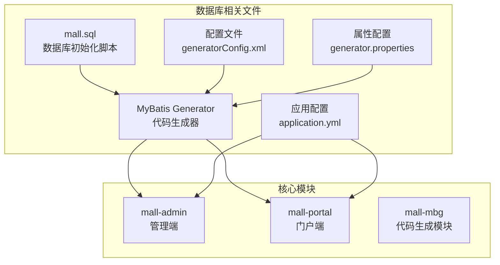
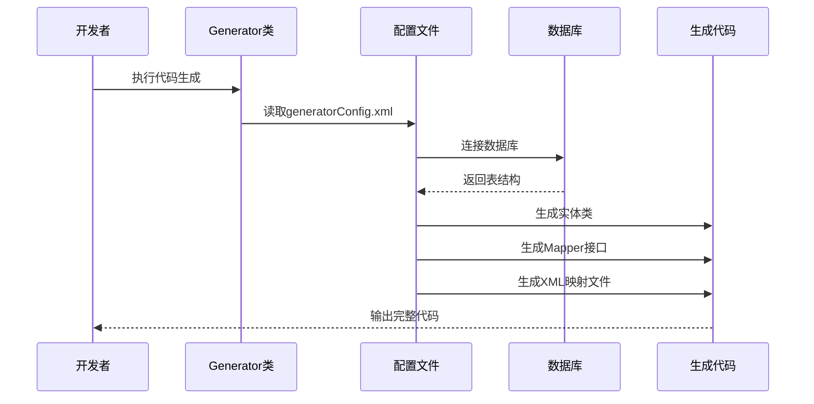
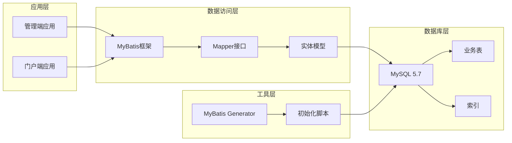
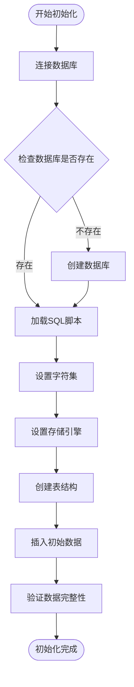
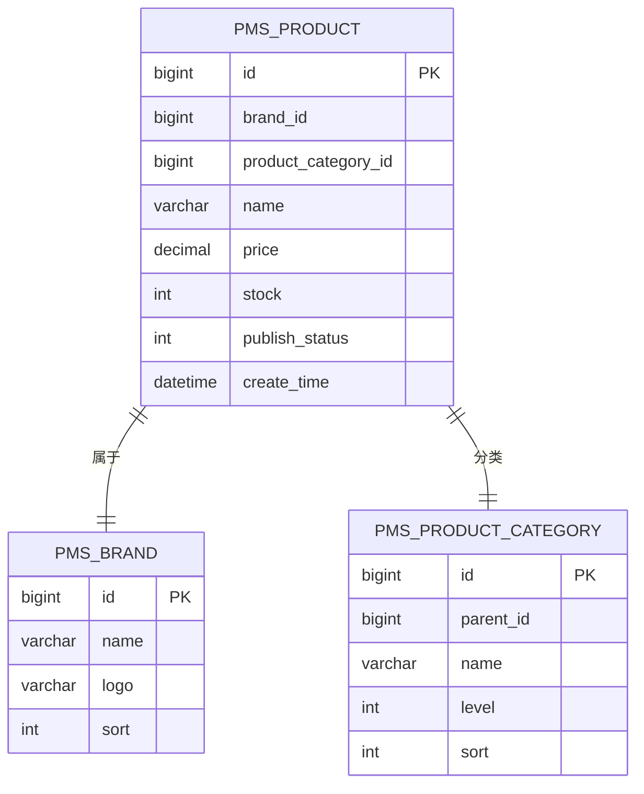
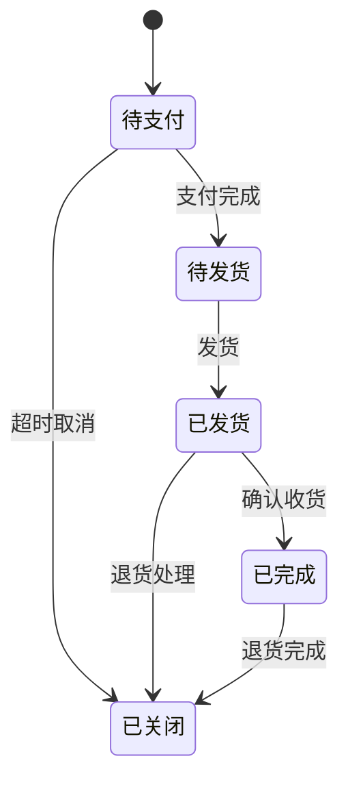
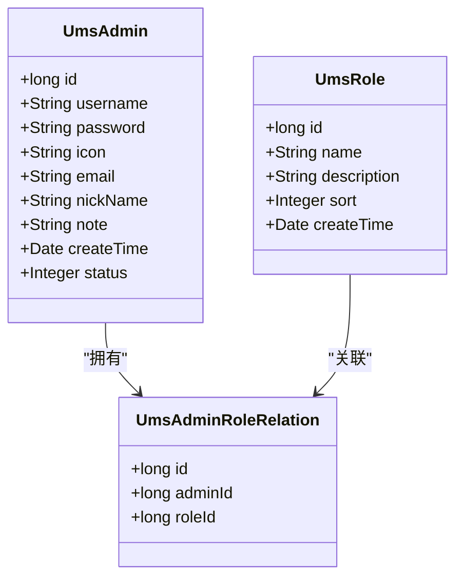
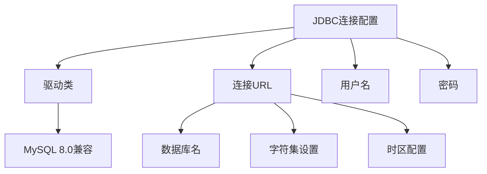
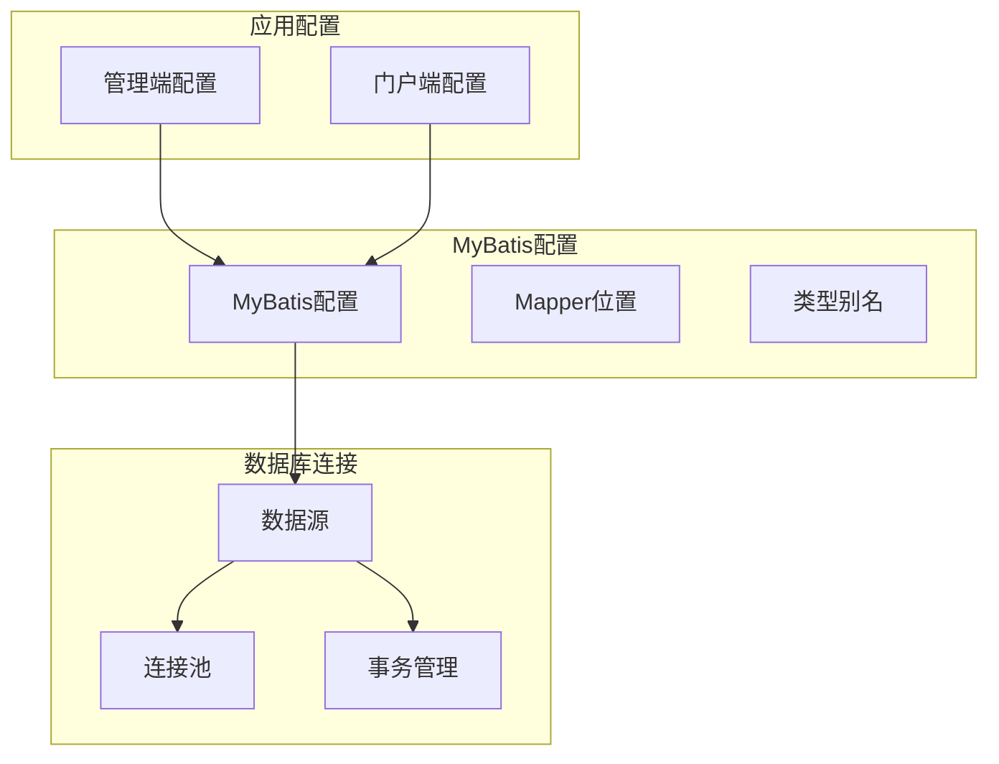
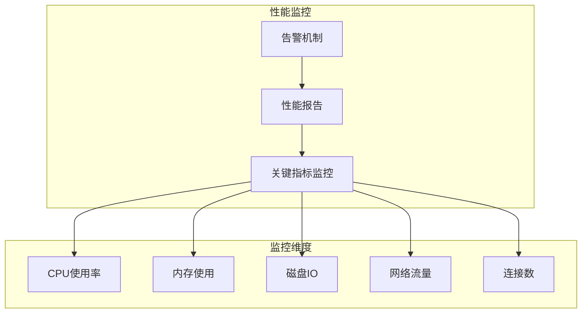

# 数据库概览

<cite>
**本文档引用的文件**
- [mall.sql](file://document/sql/mall.sql)
- [generatorConfig.xml](file://mall-mbg/src/main/resources/generatorConfig.xml)
- [generator.properties](file://mall-mbg/src/main/resources/generator.properties)
- [Generator.java](file://mall-mbg/src/main/java/com/macro/mall/Generator.java)
- [application.yml](file://mall-admin/src/main/resources/application.yml)
- [application.yml](file://mall-portal/src/main/resources/application.yml)
- [mysql.md](file://document/reference/mysql.md)
</cite>

## 目录
1. [简介](#简介)
2. [项目结构](#项目结构)
3. [核心组件](#核心组件)
4. [架构概览](#架构概览)
5. [详细组件分析](#详细组件分析)
6. [依赖分析](#依赖分析)
7. [性能考虑](#性能考虑)
8. [故障排除指南](#故障排除指南)
9. [结论](#结论)

## 简介

Mall项目采用MySQL作为主要数据库管理系统，基于MySQL 5.7版本构建，采用utf8mb4字符集和InnoDB存储引擎，为电商系统的完整功能提供了可靠的数据支撑。该项目通过MyBatis Generator实现了代码自动生成，确保了数据库表结构与Java实体类的一致性。

## 项目结构

Mall项目的数据库相关文件主要分布在以下位置：

**图表来源**
- [mall.sql:1-50](file://document/sql/mall.sql#L1-L50)
- [generatorConfig.xml:1-50](file://mall-mbg/src/main/resources/generatorConfig.xml#L1-L50)
- [application.yml:1-66](file://mall-admin/src/main/resources/application.yml#L1-L66)

**章节来源**
- [mall.sql:1-50](file://document/sql/mall.sql#L1-L50)
- [generatorConfig.xml:1-50](file://mall-mbg/src/main/resources/generatorConfig.xml#L1-L50)
- [application.yml:1-66](file://mall-admin/src/main/resources/application.yml#L1-L66)

## 核心组件

### 数据库版本与配置

项目采用MySQL 5.7作为数据库版本，配置特点如下：

- **字符集设置**: 使用utf8mb4字符集，支持完整的UTF-8字符集，包括emoji表情符号
- **存储引擎**: 采用InnoDB存储引擎，提供事务支持和外键约束
- **时区配置**: 设置为Asia/Shanghai时区，确保时间数据的正确性

### 数据库命名规范

系统遵循统一的表命名规范，采用前缀区分不同业务模块：

- **Pms_**: 商品管理系统（Product Management System）
- **Oms_**: 订单管理系统（Order Management System）
- **Ums_**: 用户管理系统（User Management System）
- **Sms_**: 营销系统（Sales Marketing System）
- **Cms_**: 内容管理系统（Content Management System）

### MyBatis Generator配置

MyBatis Generator提供了完整的代码生成解决方案：

**图表来源**
- [Generator.java:17-37](file://mall-mbg/src/main/java/com/macro/mall/Generator.java#L17-L37)
- [generatorConfig.xml:29-48](file://mall-mbg/src/main/resources/generatorConfig.xml#L29-L48)

**章节来源**
- [generatorConfig.xml:1-50](file://mall-mbg/src/main/resources/generatorConfig.xml#L1-L50)
- [generator.properties:1-4](file://mall-mbg/src/main/resources/generator.properties#L1-L4)
- [Generator.java:1-39](file://mall-mbg/src/main/java/com/macro/mall/Generator.java#L1-L39)

## 架构概览

### 数据库设计理念

Mall项目的数据库架构体现了以下设计理念：

**图表来源**
- [application.yml:14-18](file://mall-admin/src/main/resources/application.yml#L14-L18)
- [application.yml:10-14](file://mall-portal/src/main/resources/application.yml#L10-L14)

### 数据库初始化流程

**图表来源**
- [mall.sql:1-20](file://document/sql/mall.sql#L1-L20)
- [mysql.md:61-68](file://document/reference/mysql.md#L61-L68)

**章节来源**
- [mall.sql:1-20](file://document/sql/mall.sql#L1-L20)
- [mysql.md:1-78](file://document/reference/mysql.md#L1-L78)

## 详细组件分析

### 数据库表结构分析

系统包含多个业务模块的表结构，每个模块都有明确的功能划分：

#### 商品管理模块 (Pms_*)

商品管理模块涵盖了商品的完整生命周期管理：

**图表来源**
- [mall.sql:1082-1129](file://document/sql/mall.sql#L1082-L1129)
- [mall.sql:1-50](file://document/sql/mall.sql#L1-L50)

#### 订单管理模块 (Oms_*)

订单管理模块实现了完整的电商交易流程：

**图表来源**
- [mall.sql:688-744](file://document/sql/mall.sql#L688-L744)

#### 用户管理模块 (Ums_*)

用户管理模块提供了完整的用户认证和授权机制：

**图表来源**
- [mall.sql:1-50](file://document/sql/mall.sql#L1-L50)

**章节来源**
- [mall.sql:1082-1172](file://document/sql/mall.sql#L1082-L1172)

### MyBatis Generator配置详解

MyBatis Generator提供了灵活的配置选项：

#### 核心配置项说明

| 配置项 | 作用 | 默认值 | 示例 |
|--------|------|--------|------|
| beginningDelimiter | SQL语句前置分隔符 | ` | ` |
| endingDelimiter | SQL语句后置分隔符 | ` | ` |
| javaFileEncoding | Java文件编码 | UTF-8 | UTF-8 |
| nullCatalogMeansCurrent | MySQL驱动兼容性 | true | true |

#### 数据库连接配置

**图表来源**
- [generator.properties:1-4](file://mall-mbg/src/main/resources/generator.properties#L1-L4)

**章节来源**
- [generatorConfig.xml:1-50](file://mall-mbg/src/main/resources/generatorConfig.xml#L1-L50)
- [generator.properties:1-4](file://mall-mbg/src/main/resources/generator.properties#L1-L4)

## 依赖分析

### 应用层依赖关系

**图表来源**
- [application.yml:14-18](file://mall-admin/src/main/resources/application.yml#L14-L18)
- [application.yml:10-14](file://mall-portal/src/main/resources/application.yml#L10-L14)

### 数据库依赖关系

系统对MySQL数据库的依赖体现在多个层面：

- **驱动程序**: 使用MySQL Connector/J 8.0版本
- **连接池**: 通过HikariCP提供高性能连接池
- **ORM框架**: MyBatis提供对象关系映射
- **代码生成**: MyBatis Generator自动生成持久层代码

**章节来源**
- [application.yml:1-66](file://mall-admin/src/main/resources/application.yml#L1-L66)
- [application.yml:1-62](file://mall-portal/src/main/resources/application.yml#L1-L62)

## 性能考虑

### 数据库性能优化策略

基于Mall项目的实际需求，建议采用以下性能优化策略：

#### 索引优化
- 为主键和外键建立合适的索引
- 对常用查询条件建立复合索引
- 定期分析和优化慢查询

#### 连接池配置
- 合理设置连接池大小
- 配置连接超时和空闲连接回收
- 监控连接池使用情况

#### 查询优化
- 使用EXPLAIN分析查询计划
- 避免SELECT *
- 合理使用LIMIT限制结果集

### 监控要点

**图表来源**
- [mysql.md:61-78](file://document/reference/mysql.md#L61-L78)

## 故障排除指南

### 常见问题及解决方案

#### 数据库连接问题
- **问题**: 连接超时或连接失败
- **解决方案**: 检查数据库服务状态、网络连接、防火墙设置

#### 编码问题
- **问题**: 中文乱码或特殊字符显示异常
- **解决方案**: 确认数据库、表、字段的字符集设置

#### MyBatis Generator问题
- **问题**: 代码生成失败或生成错误
- **解决方案**: 检查generatorConfig.xml配置、数据库连接、权限设置

#### 性能问题
- **问题**: 查询响应缓慢
- **解决方案**: 分析慢查询日志、优化索引、调整查询语句

**章节来源**
- [mysql.md:1-78](file://document/reference/mysql.md#L1-L78)

## 结论

Mall项目的数据库设计体现了现代电商系统的核心需求，通过合理的数据库版本选择、字符集配置和存储引擎选择，为系统的稳定运行奠定了坚实基础。MyBatis Generator的应用不仅提高了开发效率，还确保了代码质量的一致性。

项目的数据库命名规范清晰明了，便于团队协作和维护。通过完善的初始化脚本和配置管理，新成员能够快速上手项目开发。建议在后续开发中持续关注数据库性能监控，定期进行性能优化，确保系统在高并发场景下的稳定性。