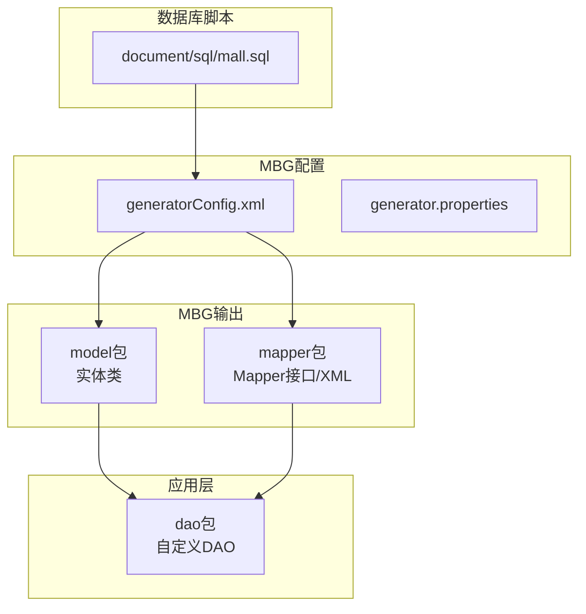
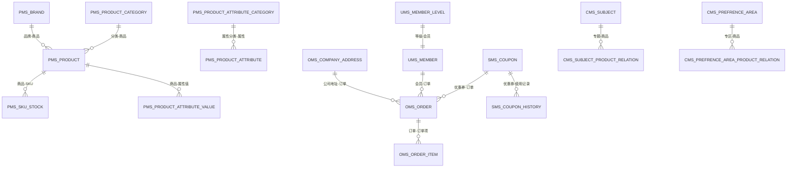
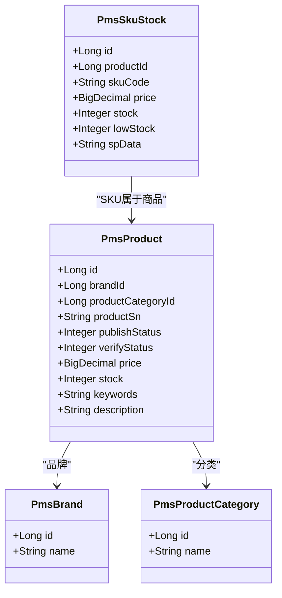
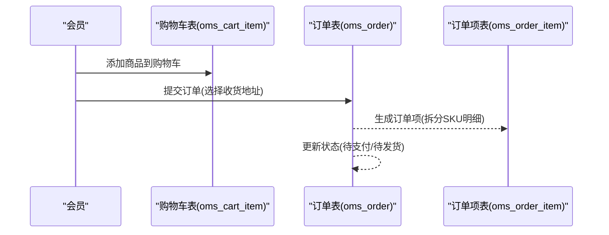
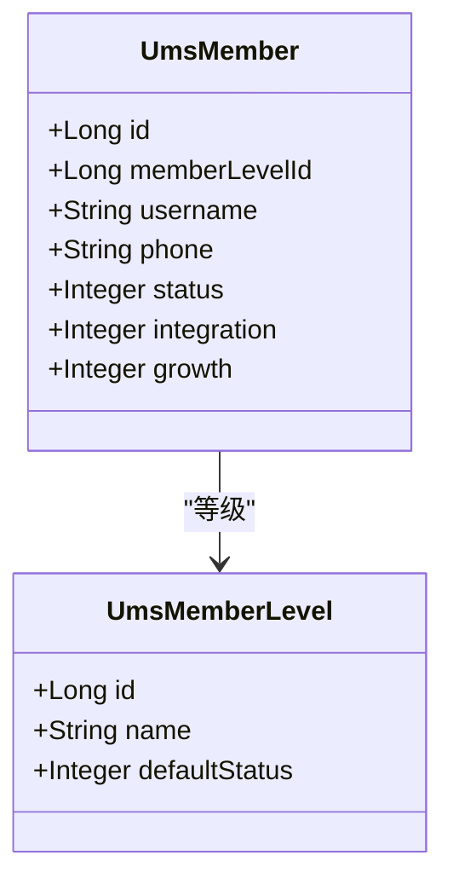
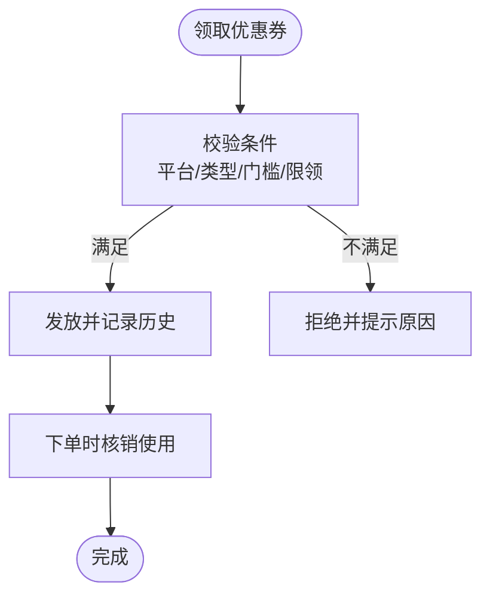
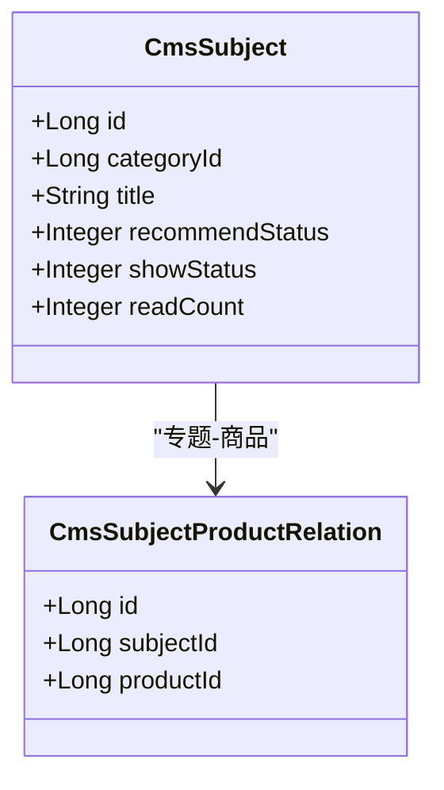
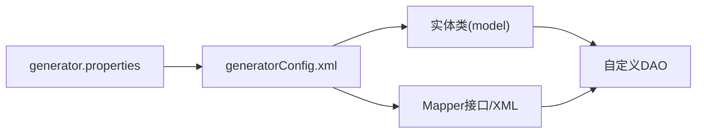

# 数据库设计

<cite>
**本文引用的文件**
- [mall.sql](file://document/sql/mall.sql)
- [generatorConfig.xml](file://mall-mbg/src/main/resources/generatorConfig.xml)
- [generator.properties](file://mall-mbg/src/main/resources/generator.properties)
- [PmsProduct.java](file://mall-mbg/src/main/java/com/macro/mall/model/PmsProduct.java)
- [OmsOrder.java](file://mall-mbg/src/main/java/com/macro/mall/model/OmsOrder.java)
- [UmsMember.java](file://mall-mbg/src/main/java/com/macro/mall/model/UmsMember.java)
- [SmsCoupon.java](file://mall-mbg/src/main/java/com/macro/mall/model/SmsCoupon.java)
- [CmsSubject.java](file://mall-mbg/src/main/java/com/macro/mall/model/CmsSubject.java)
- [PmsProductMapper.java](file://mall-mbg/src/main/java/com/macro/mall/mapper/PmsProductMapper.java)
- [OmsOrderMapper.java](file://mall-mbg/src/main/java/com/macro/mall/mapper/OmsOrderMapper.java)
- [UmsMemberMapper.java](file://mall-mbg/src/main/java/com/macro/mall/mapper/UmsMemberMapper.java)
- [SmsCouponMapper.java](file://mall-mbg/src/main/java/com/macro/mall/mapper/SmsCouponMapper.java)
- [CmsSubjectMapper.java](file://mall-mbg/src/main/java/com/macro/mall/mapper/CmsSubjectMapper.java)
- [PmsProductDao.java](file://mall-admin/src/main/java/com/macro/mall/dao/PmsProductDao.java)
- [OmsOrderDao.java](file://mall-admin/src/main/java/com/macro/mall/dao/OmsOrderDao.java)
</cite>

## 目录
1. [简介](#简介)
2. [项目结构](#项目结构)
3. [核心组件](#核心组件)
4. [架构总览](#架构总览)
5. [详细组件分析](#详细组件分析)
6. [依赖分析](#依赖分析)
7. [性能考虑](#性能考虑)
8. [故障排查指南](#故障排查指南)
9. [结论](#结论)
10. [附录](#附录)

## 简介
本文件面向Mall项目的数据库设计，系统性梳理商品（Pms_*）、订单（Oms_*）、会员（Ums_*）、营销（Sms_*）、内容（Cms_*）五大域的表结构与设计意图，并结合MyBatis Generator与自定义DAO的实现，给出主键、外键、索引与约束策略，以及ER关系图与表结构说明。同时提供性能优化建议与维护策略，帮助开发者与运维人员高效理解并维护该数据库。

## 项目结构
- 数据库脚本位于 document/sql/mall.sql，包含各域表的DDL与示例数据。
- MyBatis Generator配置位于 mall-mbg/src/main/resources/generatorConfig.xml 与 generator.properties，统一生成实体、Mapper接口与XML映射。
- 实体类位于 mall-mbg/src/main/java/com/macro/mall/model，Mapper接口位于 mall-mbg/src/main/java/com/macro/mall/mapper。
- 自定义DAO位于 mall-admin/src/main/java/com/macro/mall/dao，用于复杂查询与批量操作。

**图表来源**
- [generatorConfig.xml:1-50](file://mall-mbg/src/main/resources/generatorConfig.xml#L1-L50)
- [generator.properties:1-4](file://mall-mbg/src/main/resources/generator.properties#L1-L4)
- [mall.sql:1-623](file://document/sql/mall.sql#L1-L623)

**章节来源**
- [generatorConfig.xml:1-50](file://mall-mbg/src/main/resources/generatorConfig.xml#L1-L50)
- [generator.properties:1-4](file://mall-mbg/src/main/resources/generator.properties#L1-L4)
- [mall.sql:1-623](file://document/sql/mall.sql#L1-L623)

## 核心组件
- 商品域（Pms_*）
  - 关键表：pms_product（商品）、pms_sku_stock（SKU库存）、pms_brand（品牌）、pms_product_category（商品分类）、pms_product_attribute（属性）、pms_product_attribute_value（属性值）等。
  - 主键：id（自增），多表通过外键关联。
  - 约束：字段长度与精度（如价格、重量、积分等）按业务需求设置。
- 订单域（Oms_*）
  - 关键表：oms_order（订单）、oms_order_item（订单项）、oms_cart_item（购物车）、oms_company_address（公司地址）、oms_order_operate_history（订单操作历史）等。
  - 主键：id（自增），订单与订单项存在一对多关系。
- 会员域（Ums_*）
  - 关键表：ums_member（会员）、ums_member_level（等级）、ums_admin（后台管理员）、ums_role/permission/resource（权限体系）等。
  - 主键：id（自增），会员与等级存在多对一关系。
- 营销域（Sms_*）
  - 关键表：sms_coupon（优惠券）、sms_coupon_history（优惠券使用记录）、sms_flash_promotion（限时购）、sms_home_recommend_subject（首页推荐专题）等。
  - 主键：id（自增），优惠券与会员、订单存在关联。
- 内容域（Cms_*）
  - 关键表：cms_subject（专题）、cms_help/help_category（帮助）、cms_prefrence_area（优选专区）、cms_topic（话题）等。
  - 主键：id（自增），专题与商品通过中间表关联。

**章节来源**
- [mall.sql:1-623](file://document/sql/mall.sql#L1-L623)

## 架构总览
数据库整体采用“域划分+主键自增+清晰外键”的设计，配合MBG生成标准CRUD接口与自定义DAO扩展复杂查询，形成“实体-映射-服务-控制器”的典型分层。

**图表来源**
- [mall.sql:1-623](file://document/sql/mall.sql#L1-L623)

## 详细组件分析

### 商品域（Pms_*）
- 表：pms_product
  - 主键：id（bigint, 自增）
  - 字段要点：品牌id、分类id、货号、上下架状态、排序、销量、价格、促销价、库存、单位、重量、关键词、描述、详情等。
  - 约束：价格、促销价使用decimal，库存与排序使用整型，字符长度根据业务设定。
  - 索引：建议对品牌id、分类id、发布状态、关键字建立索引以提升查询效率。
- 表：pms_sku_stock
  - 主键：id（bigint, 自增）
  - 字段要点：商品id、SKU编码、价格、库存、预警库存、规格属性等。
  - 索引：建议对product_id与product_sku_code建立索引。
- 表：pms_brand、pms_product_category、pms_product_attribute、pms_product_attribute_value
  - 主键：id（bigint, 自增）
  - 外键：商品表关联品牌、分类、属性分类。
  - 索引：建议对名称、显示状态、父级分类等字段建立索引。

**图表来源**
- [PmsProduct.java:1-482](file://mall-mbg/src/main/java/com/macro/mall/model/PmsProduct.java#L1-L482)
- [PmsSkuStock.java](file://mall-mbg/src/main/java/com/macro/mall/model/PmsSkuStock.java)
- [PmsBrand.java](file://mall-mbg/src/main/java/com/macro/mall/model/PmsBrand.java)
- [PmsProductCategory.java](file://mall-mbg/src/main/java/com/macro/mall/model/PmsProductCategory.java)

**章节来源**
- [mall.sql:1-623](file://document/sql/mall.sql#L1-L623)
- [PmsProduct.java:1-482](file://mall-mbg/src/main/java/com/macro/mall/model/PmsProduct.java#L1-L482)
- [PmsProductMapper.java:1-36](file://mall-mbg/src/main/java/com/macro/mall/mapper/PmsProductMapper.java#L1-L36)

### 订单域（Oms_*）
- 表：oms_order
  - 主键：id（bigint, 自增）
  - 字段要点：订单号、会员id、应付金额、支付方式、来源类型、状态、类型、收货人信息、发票信息、备注、时间戳等。
  - 索引：建议对order_sn、member_id、status、create_time建立索引。
- 表：oms_order_item
  - 主键：id（bigint, 自增）
  - 字段要点：订单id、商品id、SKU信息、购买数量、单价、总金额等。
  - 索引：建议对order_id、product_id建立索引。
- 表：oms_cart_item
  - 主键：id（bigint, 自增）
  - 字段要点：会员id、商品id、SKU、数量、价格、删除状态等。
  - 索引：建议对member_id、product_id、delete_status建立索引。
- 表：oms_company_address
  - 主键：id（bigint, 自增）
  - 字段要点：默认发货/收货地址、收件人、电话、省市区、详细地址等。

**图表来源**
- [OmsOrder.java:1-504](file://mall-mbg/src/main/java/com/macro/mall/model/OmsOrder.java#L1-L504)
- [OmsOrderMapper.java:1-30](file://mall-mbg/src/main/java/com/macro/mall/mapper/OmsOrderMapper.java#L1-L30)
- [OmsOrderDao.java:1-31](file://mall-admin/src/main/java/com/macro/mall/dao/OmsOrderDao.java#L1-L31)

**章节来源**
- [mall.sql:1-623](file://document/sql/mall.sql#L1-L623)
- [OmsOrder.java:1-504](file://mall-mbg/src/main/java/com/macro/mall/model/OmsOrder.java#L1-L504)
- [OmsOrderMapper.java:1-30](file://mall-mbg/src/main/java/com/macro/mall/mapper/OmsOrderMapper.java#L1-L30)
- [OmsOrderDao.java:1-31](file://mall-admin/src/main/java/com/macro/mall/dao/OmsOrderDao.java#L1-L31)

### 会员域（Ums_*）
- 表：ums_member
  - 主键：id（bigint, 自增）
  - 字段要点：用户名、密码、昵称、手机号、状态、性别、生日、城市、职业、个性签名、积分、成长值、来源类型等。
  - 索引：建议对username、phone、memberLevelId建立索引。
- 表：ums_member_level
  - 主键：id（bigint, 自增）
  - 字段要点：等级名称、默认折扣、积分下限等。
- 表：ums_admin、ums_role、ums_permission、ums_resource
  - 主键：id（bigint, 自增）
  - 关系：管理员-角色-权限-资源的多对多关系，通过中间表维护。

**图表来源**
- [UmsMember.java:1-228](file://mall-mbg/src/main/java/com/macro/mall/model/UmsMember.java#L1-L228)
- [UmsMemberMapper.java:1-30](file://mall-mbg/src/main/java/com/macro/mall/mapper/UmsMemberMapper.java#L1-L30)

**章节来源**
- [mall.sql:1-623](file://document/sql/mall.sql#L1-L623)
- [UmsMember.java:1-228](file://mall-mbg/src/main/java/com/macro/mall/model/UmsMember.java#L1-L228)
- [UmsMemberMapper.java:1-30](file://mall-mbg/src/main/java/com/macro/mall/mapper/UmsMemberMapper.java#L1-L30)

### 营销域（Sms_*）
- 表：sms_coupon
  - 主键：id（bigint, 自增）
  - 字段要点：类型、平台、总量、面额、每人限领、最低门槛、有效期、使用类型、会员等级等。
  - 索引：建议对type、platform、enable_time、min_point建立索引。
- 表：sms_coupon_history
  - 主键：id（bigint, 自增）
  - 字段要点：会员id、优惠券id、使用状态、使用时间等。
- 表：sms_flash_promotion、sms_flash_promotion_session
  - 主键：id（bigint, 自增）
  - 字段要点：活动名称、场次、开始/结束时间等。

**图表来源**
- [SmsCoupon.java:1-218](file://mall-mbg/src/main/java/com/macro/mall/model/SmsCoupon.java#L1-L218)
- [SmsCouponMapper.java:1-30](file://mall-mbg/src/main/java/com/macro/mall/mapper/SmsCouponMapper.java#L1-L30)

**章节来源**
- [mall.sql:1-623](file://document/sql/mall.sql#L1-L623)
- [SmsCoupon.java:1-218](file://mall-mbg/src/main/java/com/macro/mall/model/SmsCoupon.java#L1-L218)
- [SmsCouponMapper.java:1-30](file://mall-mbg/src/main/java/com/macro/mall/mapper/SmsCouponMapper.java#L1-L30)

### 内容域（Cms_*）
- 表：cms_subject（专题）
  - 主键：id（bigint, 自增）
  - 字段要点：标题、封面图、分类名、收藏/阅读/评论数、展示状态、内容等。
  - 索引：建议对categoryId、recommendStatus、showStatus建立索引。
- 表：cms_subject_product_relation（专题-商品关联）
  - 主键：id（bigint, 自增）
  - 字段要点：subject_id、product_id。
  - 索引：建议对subject_id、product_id建立复合索引。
- 表：cms_prefrence_area、cms_prefrence_area_product_relation（优选专区）
  - 主键：id（bigint, 自增）
  - 字段要点：专区名称、图片、排序、展示状态等。

**图表来源**
- [CmsSubject.java:1-195](file://mall-mbg/src/main/java/com/macro/mall/model/CmsSubject.java#L1-L195)
- [CmsSubjectMapper.java:1-36](file://mall-mbg/src/main/java/com/macro/mall/mapper/CmsSubjectMapper.java#L1-L36)

**章节来源**
- [mall.sql:1-623](file://document/sql/mall.sql#L1-L623)
- [CmsSubject.java:1-195](file://mall-mbg/src/main/java/com/macro/mall/model/CmsSubject.java#L1-L195)
- [CmsSubjectMapper.java:1-36](file://mall-mbg/src/main/java/com/macro/mall/mapper/CmsSubjectMapper.java#L1-L36)

## 依赖分析
- MBG生成链路
  - generatorConfig.xml 指定上下文、插件、注释生成器、JDBC连接与目标包路径。
  - generator.properties 提供数据库连接参数。
  - 生成实体类、Mapper接口与XML映射文件。
- 应用层依赖
  - 实体类与Mapper接口由DAO层调用，DAO层封装复杂查询与批量操作。
  - 自定义DAO（如PmsProductDao、OmsOrderDao）通过XML或注解实现复杂联表查询与更新。

**图表来源**
- [generatorConfig.xml:1-50](file://mall-mbg/src/main/resources/generatorConfig.xml#L1-L50)
- [generator.properties:1-4](file://mall-mbg/src/main/resources/generator.properties#L1-L4)

**章节来源**
- [generatorConfig.xml:1-50](file://mall-mbg/src/main/resources/generatorConfig.xml#L1-L50)
- [generator.properties:1-4](file://mall-mbg/src/main/resources/generator.properties#L1-L4)
- [PmsProductDao.java:1-17](file://mall-admin/src/main/java/com/macro/mall/dao/PmsProductDao.java#L1-L17)
- [OmsOrderDao.java:1-31](file://mall-admin/src/main/java/com/macro/mall/dao/OmsOrderDao.java#L1-L31)

## 性能考虑
- 索引策略
  - 订单域：对order_sn、member_id、status、create_time建立索引；对oms_order_item的order_id、product_id建立索引。
  - 商品域：对brand_id、product_category_id、publish_status、keywords建立索引；对pms_sku_stock的product_id、skuCode建立索引。
  - 会员域：对username、phone、memberLevelId建立索引。
  - 营销域：对sms_coupon的type、platform、enable_time、min_point建立索引。
  - 内容域：对cms_subject的categoryId、recommendStatus、showStatus建立索引。
- 查询优化
  - 使用分页查询与延迟加载（如详情HTML、富文本）。
  - 对高频条件（状态、时间范围、关键字）建立复合索引。
- 写入优化
  - 批量插入/更新（如批量发货、批量导入SKU）。
  - 控制事务粒度，避免长事务锁表。
- 存储与备份
  - 定期归档历史订单与日志表，减少热数据压力。
  - 启用binlog与合理设置主从复制，确保高可用。

[本节为通用性能建议，无需特定文件引用]

## 故障排查指南
- 常见问题
  - 主键冲突：检查自增策略与批量导入是否重复。
  - 外键异常：确认关联表数据一致性（如订单项对应的商品是否存在）。
  - 查询慢：检查是否命中索引，必要时重建或添加索引。
  - 事务死锁：减少跨表长事务，拆分更新逻辑。
- 排查步骤
  - 使用EXPLAIN分析慢查询SQL。
  - 查看MySQL慢查询日志与错误日志。
  - 核对MBG生成的Mapper XML与实体字段映射是否一致。
- 自定义DAO问题
  - 确认参数命名与@Param注解一致。
  - 检查复杂联表查询的ON条件与WHERE条件顺序。

**章节来源**
- [PmsProductDao.java:1-17](file://mall-admin/src/main/java/com/macro/mall/dao/PmsProductDao.java#L1-L17)
- [OmsOrderDao.java:1-31](file://mall-admin/src/main/java/com/macro/mall/dao/OmsOrderDao.java#L1-L31)

## 结论
Mall项目的数据库围绕五大域进行清晰划分，采用主键自增与外键约束保证数据一致性，MBG生成标准化CRUD接口，配合自定义DAO满足复杂业务场景。通过合理的索引策略与查询优化，可有效支撑高并发下的订单、商品与营销业务。建议持续完善索引、定期归档与监控慢查询，确保系统长期稳定运行。

[本节为总结性内容，无需特定文件引用]

## 附录
- 数据访问层设计要点
  - 实体类：字段与数据库类型一一对应，注意精度与长度。
  - Mapper接口：遵循MBG规范，提供基础CRUD与条件更新。
  - 自定义DAO：封装复杂查询、批量操作与跨表统计。
- 生成器配置要点
  - generatorConfig.xml启用注释生成器、ToString/Serializable插件、覆盖策略。
  - generator.properties提供正确的JDBC连接参数。

**章节来源**
- [generatorConfig.xml:1-50](file://mall-mbg/src/main/resources/generatorConfig.xml#L1-L50)
- [generator.properties:1-4](file://mall-mbg/src/main/resources/generator.properties#L1-L4)
- [PmsProductMapper.java:1-36](file://mall-mbg/src/main/java/com/macro/mall/mapper/PmsProductMapper.java#L1-L36)
- [OmsOrderMapper.java:1-30](file://mall-mbg/src/main/java/com/macro/mall/mapper/OmsOrderMapper.java#L1-L30)
- [UmsMemberMapper.java:1-30](file://mall-mbg/src/main/java/com/macro/mall/mapper/UmsMemberMapper.java#L1-L30)
- [SmsCouponMapper.java:1-30](file://mall-mbg/src/main/java/com/macro/mall/mapper/SmsCouponMapper.java#L1-L30)
- [CmsSubjectMapper.java:1-36](file://mall-mbg/src/main/java/com/macro/mall/mapper/CmsSubjectMapper.java#L1-L36)