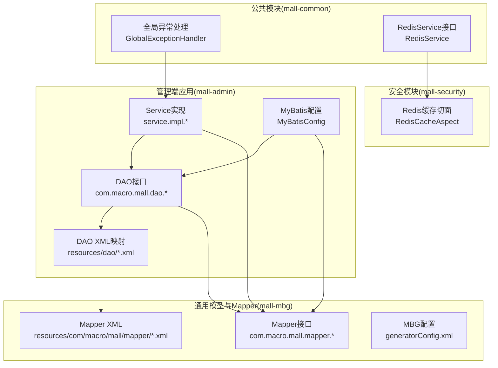
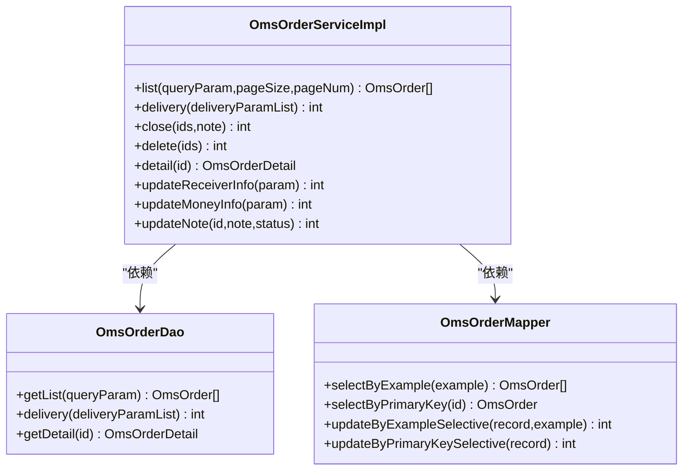
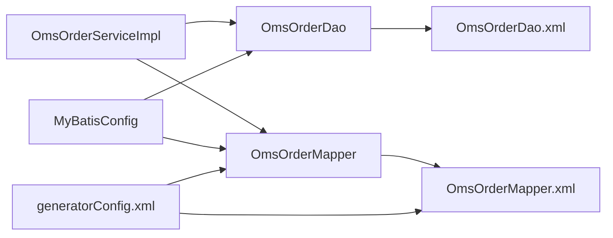

# 数据访问层设计

<cite>
**本文引用的文件**
- [OmsOrderDao.java](file://mall-admin/src/main/java/com/macro/mall/dao/OmsOrderDao.java)
- [OmsOrderDao.xml](file://mall-admin/src/main/resources/dao/OmsOrderDao.xml)
- [OmsOrderMapper.java](file://mall-mbg/src/main/java/com/macro/mall/mapper/OmsOrderMapper.java)
- [OmsOrderMapper.xml](file://mall-mbg/src/main/resources/com/macro/mall/mapper/OmsOrderMapper.xml)
- [PmsProductDao.java](file://mall-admin/src/main/java/com/macro/mall/dao/PmsProductDao.java)
- [PmsProductDao.xml](file://mall-admin/src/main/resources/dao/PmsProductDao.xml)
- [UmsAdminRoleRelationDao.java](file://mall-admin/src/main/java/com/macro/mall/dao/UmsAdminRoleRelationDao.java)
- [MyBatisConfig.java](file://mall-admin/src/main/java/com/macro/mall/config/MyBatisConfig.java)
- [OmsOrderServiceImpl.java](file://mall-admin/src/main/java/com/macro/mall/service/impl/OmsOrderServiceImpl.java)
- [OmsOrderService.java](file://mall-admin/src/main/java/com/macro/mall/service/OmsOrderService.java)
- [generatorConfig.xml](file://mall-mbg/src/main/resources/generatorConfig.xml)
- [GlobalExceptionHandler.java](file://mall-common/src/main/java/com/macro/mall/common/exception/GlobalExceptionHandler.java)
- [ApiException.java](file://mall-common/src/main/java/com/macro/mall/common/exception/ApiException.java)
- [RedisService.java](file://mall-common/src/main/java/com/macro/mall/common/service/RedisService.java)
- [RedisCacheAspect.java](file://mall-security/src/main/java/com/macro/mall/security/aspect/RedisCacheAspect.java)
</cite>

## 目录
1. [简介](#简介)
2. [项目结构](#项目结构)
3. [核心组件](#核心组件)
4. [架构总览](#架构总览)
5. [详细组件分析](#详细组件分析)
6. [依赖分析](#依赖分析)
7. [性能考虑](#性能考虑)
8. [故障排查指南](#故障排查指南)
9. [结论](#结论)
10. [附录](#附录)

## 简介
本设计文档聚焦Mall项目的“数据访问层（DAO）”设计与实现，系统性阐述DAO接口的设计模式、MyBatis Mapper接口与XML映射文件的编写规范、DAO与Service层的交互协议、自定义DAO的实现方法与复杂查询SQL技巧、事务管理与异常处理机制、性能优化与缓存策略，以及DAO在不同模块中的职责分工与代码复用方式。目标是帮助开发者快速理解并高效扩展DAO层功能。

## 项目结构
DAO层主要分布在以下位置：
- 管理端应用：DAO接口与XML映射位于 mall-admin 模块的 dao 接口包与 resources/dao 资源目录
- 通用模型与Mapper：由 mall-mbg 模块通过MyBatis Generator生成，位于 mapper 接口与 resources/com/macro/mall/mapper XML
- 配置：MyBatis扫描路径与事务管理在 mall-admin 的 MyBatisConfig 中统一配置
- 异常处理：mall-common 提供全局异常处理，统一返回格式
- 缓存：mall-common 提供RedisService，mall-security提供Redis缓存切面以隔离缓存异常

图表来源
- [MyBatisConfig.java:1-16](file://mall-admin/src/main/java/com/macro/mall/config/MyBatisConfig.java#L1-L16)
- [OmsOrderDao.java:1-31](file://mall-admin/src/main/java/com/macro/mall/dao/OmsOrderDao.java#L1-L31)
- [OmsOrderDao.xml:1-90](file://mall-admin/src/main/resources/dao/OmsOrderDao.xml#L1-L90)
- [OmsOrderMapper.java:1-30](file://mall-mbg/src/main/java/com/macro/mall/mapper/OmsOrderMapper.java#L1-L30)
- [OmsOrderMapper.xml:1-828](file://mall-mbg/src/main/resources/com/macro/mall/mapper/OmsOrderMapper.xml#L1-L828)
- [generatorConfig.xml:1-50](file://mall-mbg/src/main/resources/generatorConfig.xml#L1-L50)
- [GlobalExceptionHandler.java:1-69](file://mall-common/src/main/java/com/macro/mall/common/exception/GlobalExceptionHandler.java#L1-L69)
- [RedisService.java:1-182](file://mall-common/src/main/java/com/macro/mall/common/service/RedisService.java#L1-L182)
- [RedisCacheAspect.java:1-51](file://mall-security/src/main/java/com/macro/mall/security/aspect/RedisCacheAspect.java#L1-L51)

章节来源
- [MyBatisConfig.java:1-16](file://mall-admin/src/main/java/com/macro/mall/config/MyBatisConfig.java#L1-L16)
- [generatorConfig.xml:1-50](file://mall-mbg/src/main/resources/generatorConfig.xml#L1-L50)

## 核心组件
- DAO接口：面向业务查询与复杂更新，如订单条件查询、批量发货、订单详情关联查询等
- Mapper接口：由MBG生成的基础CRUD与Example查询，如订单基础CRUD、分页条件查询等
- XML映射：DAO自定义SQL与结果映射、Mapper通用SQL片段与条件构造
- Service层：编排DAO与Mapper调用，声明式事务控制，组装DTO返回
- 配置：MyBatis扫描路径、事务管理启用；MBG生成策略与插件

章节来源
- [OmsOrderDao.java:15-30](file://mall-admin/src/main/java/com/macro/mall/dao/OmsOrderDao.java#L15-L30)
- [OmsOrderMapper.java:8-30](file://mall-mbg/src/main/java/com/macro/mall/mapper/OmsOrderMapper.java#L8-L30)
- [OmsOrderServiceImpl.java:24-154](file://mall-admin/src/main/java/com/macro/mall/service/impl/OmsOrderServiceImpl.java#L24-L154)
- [OmsOrderService.java:13-58](file://mall-admin/src/main/java/com/macro/mall/service/OmsOrderService.java#L13-L58)

## 架构总览
DAO层采用“接口+XML”的MyBatis设计，结合MBG生成的Mapper接口与XML，实现“通用CRUD + 自定义复杂查询”的分层架构。Service层通过@Autowired注入DAO与Mapper，统一进行事务控制与数据组装。

```mermaid
sequenceDiagram
participant Controller as "控制器"
participant Service as "OmsOrderServiceImpl"
participant Dao as "OmsOrderDao"
participant DaoXML as "OmsOrderDao.xml"
participant Mapper as "OmsOrderMapper"
participant DB as "数据库"
Controller->>Service : "分页查询订单(list)"
Service->>Dao : "getList(queryParam)"
Dao->>DaoXML : "执行<select id='getList'>"
DaoXML->>DB : "条件查询(多条件拼接)"
DB-->>DaoXML : "结果集"
DaoXML-->>Service : "List<OmsOrder>"
Service-->>Controller : "分页结果"
Controller->>Service : "批量发货(delivery)"
Service->>Dao : "delivery(deliveryParamList)"
Dao->>DaoXML : "执行<update id='delivery'>"
DaoXML->>DB : "批量更新(多CASE WHEN)"
DB-->>DaoXML : "影响行数"
DaoXML-->>Service : "count"
Service->>Mapper : "写入操作历史"
Service-->>Controller : "count"
```

图表来源
- [OmsOrderServiceImpl.java:35-58](file://mall-admin/src/main/java/com/macro/mall/service/impl/OmsOrderServiceImpl.java#L35-L58)
- [OmsOrderDao.java:19-29](file://mall-admin/src/main/java/com/macro/mall/dao/OmsOrderDao.java#L19-L29)
- [OmsOrderDao.xml:8-35](file://mall-admin/src/main/resources/dao/OmsOrderDao.xml#L8-L35)
- [OmsOrderDao.xml:36-65](file://mall-admin/src/main/resources/dao/OmsOrderDao.xml#L36-L65)
- [OmsOrderDao.xml:66-89](file://mall-admin/src/main/resources/dao/OmsOrderDao.xml#L66-L89)

## 详细组件分析

### 组件A：订单DAO与Service交互（OmsOrder）
- DAO接口定义：条件查询、批量发货、订单详情关联查询
- XML映射：动态WHERE条件拼接、批量CASE WHEN更新、多表LEFT JOIN结果映射
- Service层：分页、事务注解、历史记录写入、与通用Mapper协同

图表来源
- [OmsOrderDao.java:15-30](file://mall-admin/src/main/java/com/macro/mall/dao/OmsOrderDao.java#L15-L30)
- [OmsOrderMapper.java:8-30](file://mall-mbg/src/main/java/com/macro/mall/mapper/OmsOrderMapper.java#L8-L30)
- [OmsOrderServiceImpl.java:24-154](file://mall-admin/src/main/java/com/macro/mall/service/impl/OmsOrderServiceImpl.java#L24-L154)

章节来源
- [OmsOrderDao.java:15-30](file://mall-admin/src/main/java/com/macro/mall/dao/OmsOrderDao.java#L15-L30)
- [OmsOrderDao.xml:8-35](file://mall-admin/src/main/resources/dao/OmsOrderDao.xml#L8-L35)
- [OmsOrderDao.xml:36-65](file://mall-admin/src/main/resources/dao/OmsOrderDao.xml#L36-L65)
- [OmsOrderDao.xml:66-89](file://mall-admin/src/main/resources/dao/OmsOrderDao.xml#L66-L89)
- [OmsOrderMapper.xml:117-130](file://mall-mbg/src/main/resources/com/macro/mall/mapper/OmsOrderMapper.xml#L117-L130)
- [OmsOrderServiceImpl.java:35-92](file://mall-admin/src/main/java/com/macro/mall/service/impl/OmsOrderServiceImpl.java#L35-L92)
- [OmsOrderService.java:22-57](file://mall-admin/src/main/java/com/macro/mall/service/OmsOrderService.java#L22-L57)

### 组件B：商品编辑信息DAO（PmsProduct）
- 复杂关联查询：商品主表与分类、阶梯价格、满减、会员价、SKU、属性值等多表关联
- 结果映射：继承基础ResultMap并扩展集合属性，使用columnPrefix区分不同子表字段

```mermaid
flowchart TD
Start(["进入 getUpdateInfo(id)"]) --> BuildSQL["构建多表LEFT JOIN SQL"]
BuildSQL --> Exec["执行<select id='getUpdateInfo'>"]
Exec --> Map["resultMap继承与集合映射(columnPrefix)"]
Map --> SubSel1["嵌套查询-专题关系"]
Map --> SubSel2["嵌套查询-地区关系"]
SubSel1 --> Return["返回 PmsProductResult DTO"]
SubSel2 --> Return
```

图表来源
- [PmsProductDao.java:11-16](file://mall-admin/src/main/java/com/macro/mall/dao/PmsProductDao.java#L11-L16)
- [PmsProductDao.xml:21-37](file://mall-admin/src/main/resources/dao/PmsProductDao.xml#L21-L37)
- [PmsProductDao.xml:38-43](file://mall-admin/src/main/resources/dao/PmsProductDao.xml#L38-L43)

章节来源
- [PmsProductDao.java:11-16](file://mall-admin/src/main/java/com/macro/mall/dao/PmsProductDao.java#L11-L16)
- [PmsProductDao.xml:4-18](file://mall-admin/src/main/resources/dao/PmsProductDao.xml#L4-L18)
- [PmsProductDao.xml:21-43](file://mall-admin/src/main/resources/dao/PmsProductDao.xml#L21-L43)

### 组件C：用户-角色-资源DAO（UmsAdminRoleRelation）
- 批量插入用户角色关系
- 查询用户角色列表、可访问资源列表、资源对应用户ID列表

章节来源
- [UmsAdminRoleRelationDao.java:14-34](file://mall-admin/src/main/java/com/macro/mall/dao/UmsAdminRoleRelationDao.java#L14-L34)

### 组件D：DAO与Service交互协议
- 参数传递：DTO/Example对象作为参数，返回实体或基础类型
- 返回约定：分页场景返回实体列表；批量更新返回影响行数；详情返回聚合DTO
- 事务边界：Service层通过@Transactional标注关键流程（发货、关闭、修改费用等）

章节来源
- [OmsOrderService.java:17-57](file://mall-admin/src/main/java/com/macro/mall/service/OmsOrderService.java#L17-L57)
- [OmsOrderServiceImpl.java:35-152](file://mall-admin/src/main/java/com/macro/mall/service/impl/OmsOrderServiceImpl.java#L35-L152)

### 组件E：自定义DAO实现方法与复杂SQL技巧
- 动态条件拼接：基于ognl表达式的<if>标签组合WHERE条件
- 批量CASE WHEN更新：通过foreach遍历集合，按ID分支更新多个字段
- 多表关联与嵌套结果映射：LEFT JOIN + collection + select子查询
- SQL片段复用：通过<sql>定义可复用片段，提升可维护性

章节来源
- [OmsOrderDao.xml:8-35](file://mall-admin/src/main/resources/dao/OmsOrderDao.xml#L8-L35)
- [OmsOrderDao.xml:36-65](file://mall-admin/src/main/resources/dao/OmsOrderDao.xml#L36-L65)
- [OmsOrderDao.xml:66-89](file://mall-admin/src/main/resources/dao/OmsOrderDao.xml#L66-L89)
- [PmsProductDao.xml:4-18](file://mall-admin/src/main/resources/dao/PmsProductDao.xml#L4-L18)
- [PmsProductDao.xml:21-37](file://mall-admin/src/main/resources/dao/PmsProductDao.xml#L21-L37)

## 依赖分析
- DAO与Mapper耦合：DAO通过命名空间与Mapper接口方法名关联，XML中引用Mapper的ResultMap与SQL片段
- Service与DAO/Mapper耦合：Service通过@Autowired注入DAO与Mapper，集中编排事务与数据组装
- 配置扫描：MyBatisConfig启用事务并扫描mapper与dao包，确保接口被容器识别
- 生成器：generatorConfig.xml定义MBG上下文、插件与目标包，保证Mapper接口与XML的一致性

图表来源
- [OmsOrderServiceImpl.java:26-33](file://mall-admin/src/main/java/com/macro/mall/service/impl/OmsOrderServiceImpl.java#L26-L33)
- [OmsOrderDao.java:15-30](file://mall-admin/src/main/java/com/macro/mall/dao/OmsOrderDao.java#L15-L30)
- [OmsOrderMapper.java:8-30](file://mall-mbg/src/main/java/com/macro/mall/mapper/OmsOrderMapper.java#L8-L30)
- [OmsOrderDao.xml:3](file://mall-admin/src/main/resources/dao/OmsOrderDao.xml#L3)
- [OmsOrderMapper.xml:3](file://mall-mbg/src/main/resources/com/macro/mall/mapper/OmsOrderMapper.xml#L3)
- [MyBatisConfig.java:13](file://mall-admin/src/main/java/com/macro/mall/config/MyBatisConfig.java#L13)
- [generatorConfig.xml:42-43](file://mall-mbg/src/main/resources/generatorConfig.xml#L42-L43)

章节来源
- [MyBatisConfig.java:13](file://mall-admin/src/main/java/com/macro/mall/config/MyBatisConfig.java#L13)
- [generatorConfig.xml:42-43](file://mall-mbg/src/main/resources/generatorConfig.xml#L42-L43)

## 性能考虑
- 复杂查询的SQL优化
  - 使用动态条件拼接避免全表扫描，必要时增加索引覆盖查询字段
  - 批量更新采用CASE WHEN减少往返次数，注意IN列表大小限制
  - 关联查询使用LEFT JOIN并限定列，避免SELECT *
- 分页与排序
  - Service层使用PageHelper进行分页，Mapper中支持orderByClause，建议在高频查询上建立复合索引
- 结果映射优化
  - 复用BaseResultMap与SQL片段，减少重复映射配置
  - 对大字段（如BLOB）按需加载，避免不必要的网络传输
- 缓存策略
  - 使用mall-common的RedisService进行热点数据缓存
  - 使用mall-security的RedisCacheAspect对缓存方法进行容错保护，避免缓存异常影响主流程
- 生成器与代码一致性
  - generatorConfig.xml开启UnmergeableXmlMappersPlugin，避免手改XML被覆盖，保持Mapper与XML同步

章节来源
- [OmsOrderDao.xml:8-35](file://mall-admin/src/main/resources/dao/OmsOrderDao.xml#L8-L35)
- [OmsOrderDao.xml:36-65](file://mall-admin/src/main/resources/dao/OmsOrderDao.xml#L36-L65)
- [OmsOrderMapper.xml:117-130](file://mall-mbg/src/main/resources/com/macro/mall/mapper/OmsOrderMapper.xml#L117-L130)
- [RedisService.java:1-182](file://mall-common/src/main/java/com/macro/mall/common/service/RedisService.java#L1-L182)
- [RedisCacheAspect.java:27-48](file://mall-security/src/main/java/com/macro/mall/security/aspect/RedisCacheAspect.java#L27-L48)
- [generatorConfig.xml:20](file://mall-mbg/src/main/resources/generatorConfig.xml#L20)

## 故障排查指南
- SQL语法错误
  - 全局异常处理器捕获SQLSyntaxErrorException，并对演示环境做特殊提示
- 参数校验失败
  - MethodArgumentNotValidException与BindException统一转换为CommonResult.validateFailed
- 自定义异常
  - ApiException封装IErrorCode，便于在DAO/Service层抛出并被全局异常处理捕获
- 缓存异常隔离
  - RedisCacheAspect对缓存方法进行环绕通知，非强制缓存方法吞掉异常，避免影响业务主流程

章节来源
- [GlobalExceptionHandler.java:23-67](file://mall-common/src/main/java/com/macro/mall/common/exception/GlobalExceptionHandler.java#L23-L67)
- [ApiException.java:9-32](file://mall-common/src/main/java/com/macro/mall/common/exception/ApiException.java#L9-L32)
- [RedisCacheAspect.java:31-48](file://mall-security/src/main/java/com/macro/mall/security/aspect/RedisCacheAspect.java#L31-L48)

## 结论
Mall项目的DAO层通过“接口+XML”的MyBatis设计，结合MBG生成的Mapper与自定义DAO，实现了通用CRUD与复杂查询的清晰分离。Service层承担编排与事务控制，DAO/XML负责SQL与映射细节。配合全局异常处理与缓存切面，既保证了可维护性，也提升了稳定性与性能。建议在复杂查询中持续优化索引与SQL片段复用，在批量更新中关注CASE WHEN的规模与事务边界。

## 附录
- DAO层职责分工
  - OmsOrder：订单条件查询、批量发货、订单详情聚合
  - PmsProduct：商品编辑信息聚合查询
  - UmsAdminRoleRelation：用户-角色-资源关系的批量与查询
- 代码复用方式
  - 通过ResultMap继承与SQL片段复用，降低重复配置
  - 通过MBG统一生成Mapper接口与XML，确保命名与结构一致