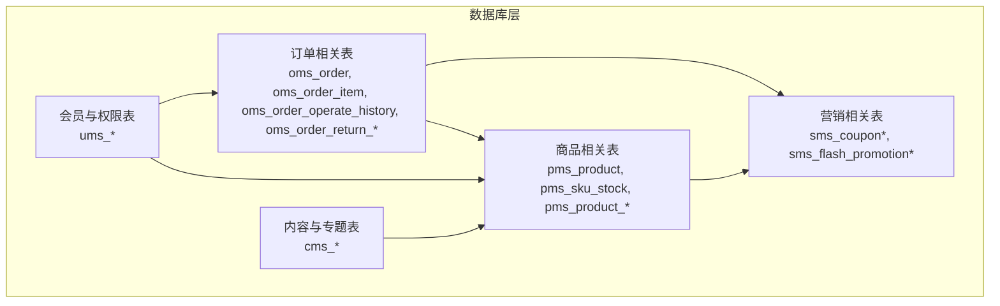
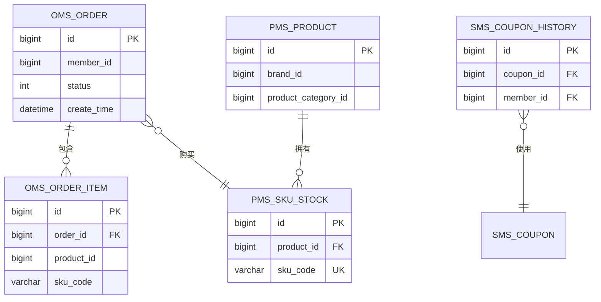
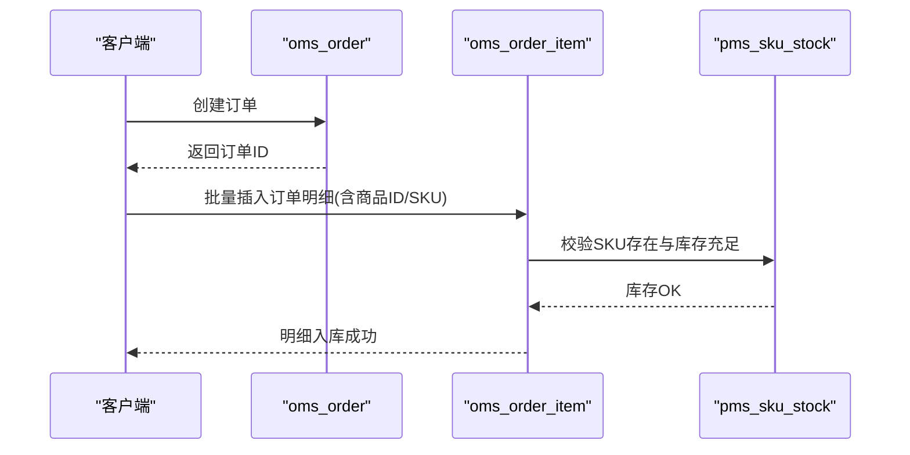

# 索引与约束

<cite>
**本文引用的文件**
- [mall.sql](file://document/sql/mall.sql)
</cite>

## 目录
1. [简介](#简介)
2. [项目结构](#项目结构)
3. [核心组件](#核心组件)
4. [架构总览](#架构总览)
5. [组件详解](#组件详解)
6. [依赖关系分析](#依赖关系分析)
7. [性能考量](#性能考量)
8. [故障排查指南](#故障排查指南)
9. [结论](#结论)
10. [附录](#附录)

## 简介
本文件面向Mall项目的数据库索引与约束设计，系统梳理各表的主键、唯一键、普通索引及复合索引的设计思路与应用场景，并结合业务查询场景给出索引优化建议与执行计划分析方法。同时总结外键约束设计原则、级联更新删除策略、数据完整性约束（如非空、默认值、检查约束等）的落地方式与最佳实践，最后提供常见查询场景的索引设计方案与冲突处理机制。

## 项目结构
- 数据库脚本集中于 document/sql/mall.sql，包含完整的建表DDL与示例数据，覆盖订单、商品、会员、营销、内容等多个业务域。
- 本文所有索引与约束分析均基于该SQL脚本中的建表定义与注释说明。

[此图为概念性结构示意，不直接映射具体代码文件，故无图表来源]

## 核心组件
- 主键索引：绝大多数表以自增主键作为主键索引，确保行级唯一性与访问稳定性。
- 唯一索引：用于保证业务唯一性，如商品SKU、优惠券码、会员昵称/账号等。
- 普通索引：围绕高频查询字段建立，如订单状态、会员ID、商品分类、营销活动等。
- 复合索引：针对多列过滤与排序的联合查询场景，减少回表成本与排序开销。
- 外键约束：通过外键实现跨表引用完整性，配合级联策略控制删除与更新行为。
- 数据完整性约束：NOT NULL、DEFAULT、CHECK（MySQL 8.0+支持）等，确保数据质量与一致性。

**章节来源**
- [mall.sql](file://document/sql/mall.sql)

## 架构总览
- 订单域：订单主表与明细表分离，明细表通过订单ID与商品SKU关联，形成典型的“一对多”关系。
- 商品域：商品主表与SKU库存表分离，SKU以组合属性标识唯一性，便于灵活配置与库存管理。
- 营销域：优惠券与活动表独立，通过分类/商品维度关联，支持多种促销策略。
- 内容域：专题、帮助、话题等表相对独立，通过业务标签与分类组织内容。

**图表来源**
- [mall.sql](file://document/sql/mall.sql)

## 组件详解

### 订单相关表
- oms_order
  - 主键：id（自增）
  - 常见查询：按会员ID、订单状态、创建时间、订单号等过滤
  - 建议索引：
    - idx_member_status_time(member_id, status, create_time)：会员订单分页与筛选
    - idx_status_time(status, create_time)：运营侧按状态统计
    - idx_order_sn(order_sn)：按订单号精确查询
- oms_order_item
  - 主键：id（自增）
  - 常见查询：按订单ID聚合统计、按商品SKU查询明细
  - 建议索引：
    - idx_order_product(order_id, product_id)：订单明细聚合
    - idx_sku(sku_code)：按SKU定位商品明细
- oms_order_operate_history
  - 主键：id（自增）
  - 常见查询：按订单ID与状态变更记录
  - 建议索引：
    - idx_order_status_time(order_id, order_status, create_time)：历史轨迹查询
- oms_order_return_apply
  - 主键：id（自增）
  - 常见查询：按会员、状态、商品维度查询退货申请
  - 建议索引：
    - idx_member_status(product_id, status)：退货申请统计
    - idx_order_sn(order_sn)：按订单号检索

**章节来源**
- [mall.sql](file://document/sql/mall.sql)

### 商品相关表
- pms_product
  - 主键：id（自增）
  - 常见查询：按品牌、分类、状态、关键词搜索
  - 建议索引：
    - idx_brand_category(publish_status, brand_id, product_category_id)
    - idx_keywords(keywords)：全文/模糊匹配
- pms_sku_stock
  - 主键：id（自增）
  - 唯一索引：sku_code（保证SKU唯一）
  - 常见查询：按商品ID与SKU查询库存
  - 建议索引：
    - idx_product_sku(product_id, sku_code)：库存查询与锁定
- pms_product_attribute_value
  - 主键：id（自增）
  - 常见查询：按商品与属性值查询
  - 建议索引：
    - idx_product_attr(product_id, product_attribute_id)

**章节来源**
- [mall.sql](file://document/sql/mall.sql)

### 营销相关表
- sms_coupon
  - 主键：id（自增）
  - 常见查询：按类型、平台、使用范围、有效期
  - 建议索引：
    - idx_type_platform(type, platform)
    - idx_use_type(use_type)
    - idx_time(start_time, end_time)
- sms_coupon_history
  - 主键：id（自增）
  - 已存在索引：idx_member_id、idx_coupon_id
  - 建议补充：
    - idx_use_status(use_status, create_time)：核销统计与报表
- sms_flash_promotion_product_relation
  - 主键：id（自增）
  - 常见查询：按活动场次与商品查询
  - 建议索引：
    - idx_session_product(flash_promotion_session_id, product_id)

**章节来源**
- [mall.sql](file://document/sql/mall.sql)

### 会员与权限表
- ums_*（如 UmsMember、UmsAdmin、UmsRole 等）
  - 常见查询：按账号/昵称/手机号登录、按角色/权限查询
  - 建议索引：
    - idx_username(username)：登录与检索
    - idx_phone(phone)：短信/登录
    - idx_role(role_id)：权限路由

**章节来源**
- [mall.sql](file://document/sql/mall.sql)

### 内容与专题表
- cms_*（如 CmsSubject、CmsHelp、CmsTopic 等）
  - 常见查询：按分类、状态、时间、关键词检索
  - 建议索引：
    - idx_category_status(create_time)
    - idx_show_status(show_status, sort)

**章节来源**
- [mall.sql](file://document/sql/mall.sql)

## 依赖关系分析
- 订单域与商品域：oms_order_item 通过 order_id 引用 oms_order.id，通过 product_id 与 pms_sku_stock.sku_code 关联，支撑订单到商品的完整链路。
- 营销域：sms_coupon_history 通过 coupon_id 引用 sms_coupon.id，体现优惠券使用闭环。
- 外键与级联：
  - 建议在具备业务意义且性能可接受的前提下，对关键关联字段增加外键约束，并明确 ON DELETE/UPDATE 的级联策略（如 RESTRICT/CASCADE/SET NULL），避免悬挂引用。
  - 对于高频写入的明细表（如订单明细、优惠券历史），可考虑延迟约束校验或在应用层做预校验，降低外键带来的写入放大。

**图表来源**
- [mall.sql](file://document/sql/mall.sql)

**章节来源**
- [mall.sql](file://document/sql/mall.sql)

## 性能考量
- 索引选择原则
  - 高选择性列优先：如会员ID、订单号、SKU码等
  - 前缀匹配与范围查询兼顾：必要时拆分为多列索引或使用前缀索引
  - 覆盖索引：尽量将查询所需列纳入索引，避免回表
  - 避免冗余索引：定期清理未使用或重复的索引
- 查询优化建议
  - 使用 EXPLAIN 分析执行计划，关注 rows、filtered、Extra（Using index condition/Using where/Using temporary/Using filesort）
  - 对 ORDER BY 与 GROUP BY 的列建立复合索引，减少临时表与排序
  - 控制 JOIN 数量与深度，优先使用小表驱动大表
- 写入性能
  - 批量写入、合理设置 innodb_flush_log_at_trx_commit
  - 减少不必要的唯一性检查与触发器
- 读写分离与分区
  - 基于时间维度对订单表进行分区，提升归档与清理效率

[本节为通用性能指导，不直接分析具体代码文件，故无章节来源]

## 故障排查指南
- 索引失效
  - 条件中对索引列使用函数/运算符、LIKE 以通配符开头、OR 分割导致索引失效
  - 解决：改写表达式、调整 LIKE 模式、拆分 OR 子句
- 死锁与锁等待
  - 多事务并发更新同一行或跨行加锁顺序不一致
  - 解决：统一更新顺序、缩短事务时长、使用合适的隔离级别
- 外键约束冲突
  - 删除/更新被引用记录时报错
  - 解决：先清理子表引用，或调整级联策略；在应用层做预校验
- 数据不一致
  - 并发写入导致的数据竞争
  - 解决：使用事务、行级锁、幂等写入逻辑

**章节来源**
- [mall.sql](file://document/sql/mall.sql)

## 结论
- 索引设计应以业务查询为核心，兼顾写入性能与维护成本
- 外键约束与级联策略需权衡一致性与性能，建议在关键路径上启用并在应用层做好预校验
- 数据完整性约束（NOT NULL、DEFAULT、CHECK）是保障数据质量的基础，应在DDL层面强制实施
- 针对高频查询场景，优先采用覆盖索引与复合索引，配合 EXPLAIN 进行持续优化

[本节为总结性内容，不直接分析具体代码文件，故无章节来源]

## 附录

### 常见查询场景与索引方案
- 场景1：按会员ID查询其所有订单（含状态与时间）
  - 建议：idx_member_status_time(member_id, status, create_time)
- 场景2：按订单号精确查询订单详情
  - 建议：idx_order_sn(order_sn)
- 场景3：按商品SKU查询库存与价格
  - 建议：idx_product_sku(product_id, sku_code) + 唯一索引 sku_code
- 场景4：优惠券使用历史按会员与状态统计
  - 建议：idx_member_id、idx_coupon_id、idx_use_status(use_status, create_time)
- 场景5：限时购商品按场次与商品查询
  - 建议：idx_session_product(flash_promotion_session_id, product_id)

**章节来源**
- [mall.sql](file://document/sql/mall.sql)