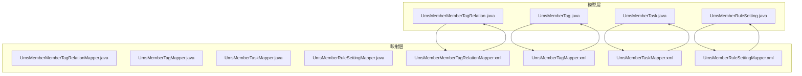
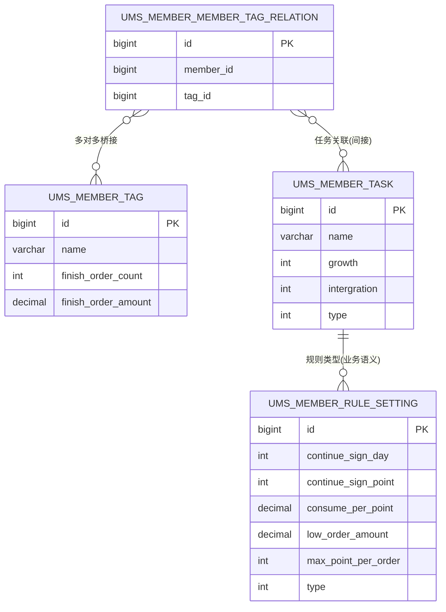
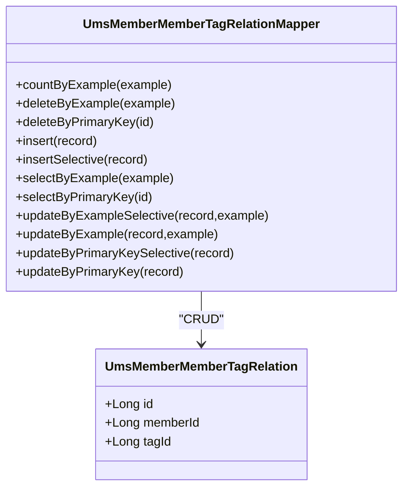
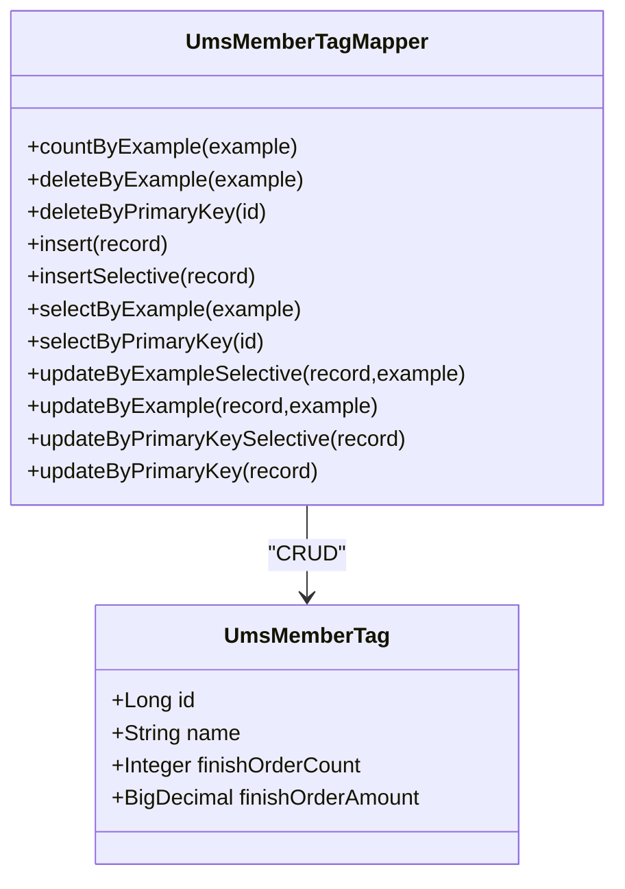
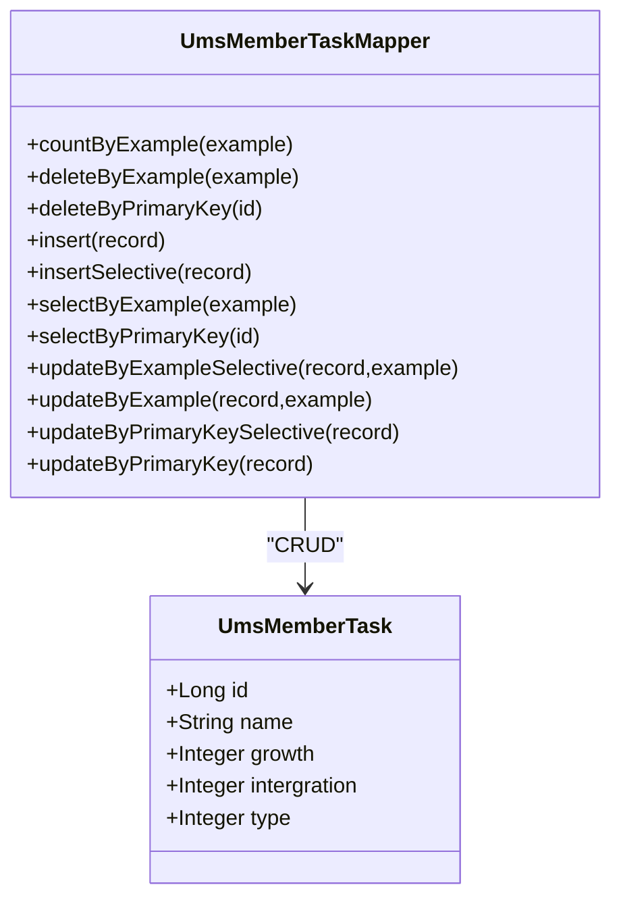
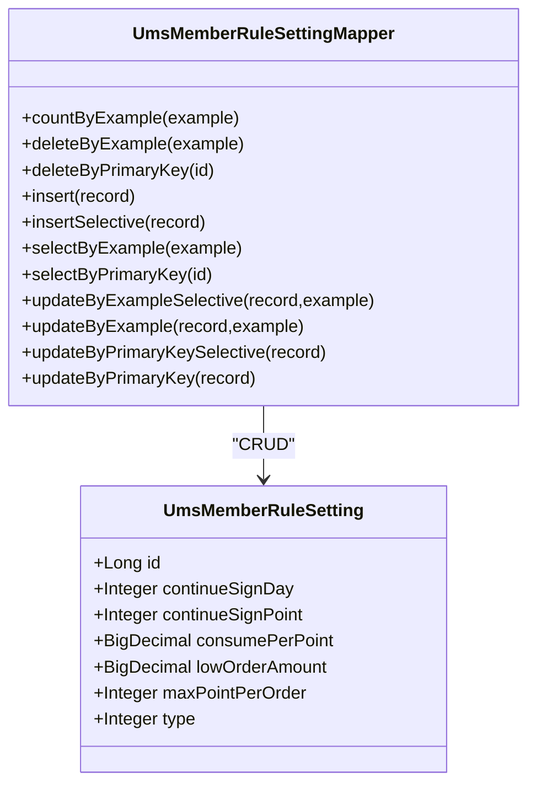
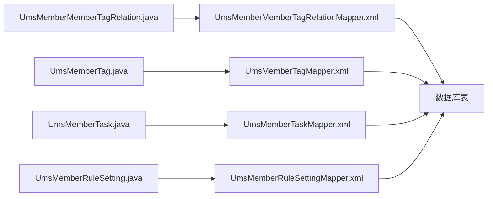

# 会员关系表

<cite>
**本文引用的文件**
- [UmsMemberMemberTagRelation.java](file://mall-mbg/src/main/java/com/macro/mall/model/UmsMemberMemberTagRelation.java)
- [UmsMemberTag.java](file://mall-mbg/src/main/java/com/macro/mall/model/UmsMemberTag.java)
- [UmsMemberTask.java](file://mall-mbg/src/main/java/com/macro/mall/model/UmsMemberTask.java)
- [UmsMemberRuleSetting.java](file://mall-mbg/src/main/java/com/macro/mall/model/UmsMemberRuleSetting.java)
- [UmsMemberMemberTagRelationMapper.java](file://mall-mbg/src/main/java/com/macro/mall/mapper/UmsMemberMemberTagRelationMapper.java)
- [UmsMemberTagMapper.java](file://mall-mbg/src/main/java/com/macro/mall/mapper/UmsMemberTagMapper.java)
- [UmsMemberTaskMapper.java](file://mall-mbg/src/main/java/com/macro/mall/mapper/UmsMemberTaskMapper.java)
- [UmsMemberRuleSettingMapper.java](file://mall-mbg/src/main/java/com/macro/mall/mapper/UmsMemberRuleSettingMapper.java)
- [UmsMemberMemberTagRelationMapper.xml](file://mall-mbg/src/main/resources/com/macro/mall/mapper/UmsMemberMemberTagRelationMapper.xml)
- [UmsMemberTagMapper.xml](file://mall-mbg/src/main/resources/com/macro/mall/mapper/UmsMemberTagMapper.xml)
- [UmsMemberTaskMapper.xml](file://mall-mbg/src/main/resources/com/macro/mall/mapper/UmsMemberTaskMapper.xml)
- [UmsMemberRuleSettingMapper.xml](file://mall-mbg/src/main/resources/com/macro/mall/mapper/UmsMemberRuleSettingMapper.xml)
</cite>

## 目录
1. [简介](#简介)
2. [项目结构](#项目结构)
3. [核心组件](#核心组件)
4. [架构总览](#架构总览)
5. [详细组件分析](#详细组件分析)
6. [依赖分析](#依赖分析)
7. [性能考虑](#性能考虑)
8. [故障排查指南](#故障排查指南)
9. [结论](#结论)
10. [附录](#附录)

## 简介
本文件聚焦于会员关系表的设计与实现，围绕以下四张表展开：
- 会员标签关系表：记录会员与标签的多对多关系
- 会员标签表：定义标签及其生效条件（如订单次数、消费金额）
- 会员任务表：定义可执行的任务类型及奖励（成长值/积分）
- 会员规则设置表：定义签到、积分抵扣、订单门槛等规则参数

通过对模型类、Mapper 接口与 XML 映射文件的系统性分析，阐明表结构、字段语义、数据流与典型业务场景，并给出分群、精准营销、运营自动化等高级能力的表结构支撑说明。

## 项目结构
本项目采用 MyBatis 逆向工程生成的 Model + Mapper + XML 结构，四张表均遵循统一的 CRUD 模板化映射方式，便于在上层服务中进行组合使用。

图表来源
- [UmsMemberMemberTagRelation.java:1-51](file://mall-mbg/src/main/java/com/macro/mall/model/UmsMemberMemberTagRelation.java#L1-L51)
- [UmsMemberTag.java:1-63](file://mall-mbg/src/main/java/com/macro/mall/model/UmsMemberTag.java#L1-L63)
- [UmsMemberTask.java:1-73](file://mall-mbg/src/main/java/com/macro/mall/model/UmsMemberTask.java#L1-L73)
- [UmsMemberRuleSetting.java:1-96](file://mall-mbg/src/main/java/com/macro/mall/model/UmsMemberRuleSetting.java#L1-L96)
- [UmsMemberMemberTagRelationMapper.java:1-30](file://mall-mbg/src/main/java/com/macro/mall/mapper/UmsMemberMemberTagRelationMapper.java#L1-L30)
- [UmsMemberTagMapper.java:1-30](file://mall-mbg/src/main/java/com/macro/mall/mapper/UmsMemberTagMapper.java#L1-L30)
- [UmsMemberTaskMapper.java:1-30](file://mall-mbg/src/main/java/com/macro/mall/mapper/UmsMemberTaskMapper.java#L1-L30)
- [UmsMemberRuleSettingMapper.java:1-30](file://mall-mbg/src/main/java/com/macro/mall/mapper/UmsMemberRuleSettingMapper.java#L1-L30)
- [UmsMemberMemberTagRelationMapper.xml:1-179](file://mall-mbg/src/main/resources/com/macro/mall/mapper/UmsMemberMemberTagRelationMapper.xml#L1-L179)
- [UmsMemberTagMapper.xml:1-196](file://mall-mbg/src/main/resources/com/macro/mall/mapper/UmsMemberTagMapper.xml#L1-L196)
- [UmsMemberTaskMapper.xml:1-211](file://mall-mbg/src/main/resources/com/macro/mall/mapper/UmsMemberTaskMapper.xml#L1-L211)
- [UmsMemberRuleSettingMapper.xml:1-244](file://mall-mbg/src/main/resources/com/macro/mall/mapper/UmsMemberRuleSettingMapper.xml#L1-L244)

章节来源
- [UmsMemberMemberTagRelation.java:1-51](file://mall-mbg/src/main/java/com/macro/mall/model/UmsMemberMemberTagRelation.java#L1-L51)
- [UmsMemberTag.java:1-63](file://mall-mbg/src/main/java/com/macro/mall/model/UmsMemberTag.java#L1-L63)
- [UmsMemberTask.java:1-73](file://mall-mbg/src/main/java/com/macro/mall/model/UmsMemberTask.java#L1-L73)
- [UmsMemberRuleSetting.java:1-96](file://mall-mbg/src/main/java/com/macro/mall/model/UmsMemberRuleSetting.java#L1-L96)
- [UmsMemberMemberTagRelationMapper.java:1-30](file://mall-mbg/src/main/java/com/macro/mall/mapper/UmsMemberMemberTagRelationMapper.java#L1-L30)
- [UmsMemberTagMapper.java:1-30](file://mall-mbg/src/main/java/com/macro/mall/mapper/UmsMemberTagMapper.java#L1-L30)
- [UmsMemberTaskMapper.java:1-30](file://mall-mbg/src/main/java/com/macro/mall/mapper/UmsMemberTaskMapper.java#L1-L30)
- [UmsMemberRuleSettingMapper.java:1-30](file://mall-mbg/src/main/java/com/macro/mall/mapper/UmsMemberRuleSettingMapper.java#L1-L30)
- [UmsMemberMemberTagRelationMapper.xml:1-179](file://mall-mbg/src/main/resources/com/macro/mall/mapper/UmsMemberMemberTagRelationMapper.xml#L1-L179)
- [UmsMemberTagMapper.xml:1-196](file://mall-mbg/src/main/resources/com/macro/mall/mapper/UmsMemberTagMapper.xml#L1-L196)
- [UmsMemberTaskMapper.xml:1-211](file://mall-mbg/src/main/resources/com/macro/mall/mapper/UmsMemberTaskMapper.xml#L1-L211)
- [UmsMemberRuleSettingMapper.xml:1-244](file://mall-mbg/src/main/resources/com/macro/mall/mapper/UmsMemberRuleSettingMapper.xml#L1-L244)

## 核心组件
- 会员标签关系表（UmsMemberMemberTagRelation）
  - 字段：主键、会员标识、标签标识
  - 角色：建立会员与标签的多对多桥接
- 会员标签表（UmsMemberTag）
  - 字段：主键、名称、达标订单数、达标金额
  - 角色：定义标签维度与生效门槛
- 会员任务表（UmsMemberTask）
  - 字段：主键、任务名、成长值奖励、积分奖励、任务类型
  - 角色：定义可执行任务与激励
- 会员规则设置表（UmsMemberRuleSetting）
  - 字段：主键、连续签到天数、连续签到积分、积分抵消金额、最低订单金额、单笔最大积分、规则类型
  - 角色：集中配置签到、积分抵扣、订单门槛等规则

章节来源
- [UmsMemberMemberTagRelation.java:5-36](file://mall-mbg/src/main/java/com/macro/mall/model/UmsMemberMemberTagRelation.java#L5-L36)
- [UmsMemberTag.java:6-47](file://mall-mbg/src/main/java/com/macro/mall/model/UmsMemberTag.java#L6-L47)
- [UmsMemberTask.java:5-56](file://mall-mbg/src/main/java/com/macro/mall/model/UmsMemberTask.java#L5-L56)
- [UmsMemberRuleSetting.java:6-77](file://mall-mbg/src/main/java/com/macro/mall/model/UmsMemberRuleSetting.java#L6-L77)

## 架构总览
下图展示四张表之间的关系与职责边界，以及与 Mapper/XML 的对应关系。

图表来源
- [UmsMemberMemberTagRelation.java:5-36](file://mall-mbg/src/main/java/com/macro/mall/model/UmsMemberMemberTagRelation.java#L5-L36)
- [UmsMemberTag.java:6-47](file://mall-mbg/src/main/java/com/macro/mall/model/UmsMemberTag.java#L6-L47)
- [UmsMemberTask.java:5-56](file://mall-mbg/src/main/java/com/macro/mall/model/UmsMemberTask.java#L5-L56)
- [UmsMemberRuleSetting.java:6-77](file://mall-mbg/src/main/java/com/macro/mall/model/UmsMemberRuleSetting.java#L6-L77)

## 详细组件分析

### 会员标签关系表（UmsMemberMemberTagRelation）
- 设计要点
  - 多对多桥接：通过 member_id 与 tag_id 组合唯一标识一条关系记录
  - 主键自增：便于插入后回填 id
  - 与标签表形成多对多：一个会员可拥有多个标签；一个标签可应用于多个会员
- 典型业务场景
  - 分群：按标签筛选会员集合，用于定向营销
  - 动态打标：根据订单行为自动更新标签关系
- 关键字段路径
  - [成员变量与访问器:14-36](file://mall-mbg/src/main/java/com/macro/mall/model/UmsMemberMemberTagRelation.java#L14-L36)
  - [Mapper 接口方法:8-30](file://mall-mbg/src/main/java/com/macro/mall/mapper/UmsMemberMemberTagRelationMapper.java#L8-L30)
  - [XML 映射列与 CRUD:4-179](file://mall-mbg/src/main/resources/com/macro/mall/mapper/UmsMemberMemberTagRelationMapper.xml#L4-L179)

图表来源
- [UmsMemberMemberTagRelation.java:1-51](file://mall-mbg/src/main/java/com/macro/mall/model/UmsMemberMemberTagRelation.java#L1-L51)
- [UmsMemberMemberTagRelationMapper.java:1-30](file://mall-mbg/src/main/java/com/macro/mall/mapper/UmsMemberMemberTagRelationMapper.java#L1-L30)

章节来源
- [UmsMemberMemberTagRelation.java:1-51](file://mall-mbg/src/main/java/com/macro/mall/model/UmsMemberMemberTagRelation.java#L1-L51)
- [UmsMemberMemberTagRelationMapper.java:1-30](file://mall-mbg/src/main/java/com/macro/mall/mapper/UmsMemberMemberTagRelationMapper.java#L1-L30)
- [UmsMemberMemberTagRelationMapper.xml:1-179](file://mall-mbg/src/main/resources/com/macro/mall/mapper/UmsMemberMemberTagRelationMapper.xml#L1-L179)

### 会员标签表（UmsMemberTag）
- 设计要点
  - 标签维度：name 表达标签含义
  - 生效门槛：finish_order_count 与 finish_order_amount 定义达标条件
  - 可扩展：新增字段可在不破坏现有结构的前提下支持更复杂的标签策略
- 典型业务场景
  - 高价值客户：按订单金额/次数设定阈值
  - 新客/沉睡用户：结合注册时间与首购时间打标
- 关键字段路径
  - [成员变量与访问器:17-47](file://mall-mbg/src/main/java/com/macro/mall/model/UmsMemberTag.java#L17-L47)
  - [Mapper 接口方法:8-30](file://mall-mbg/src/main/java/com/macro/mall/mapper/UmsMemberTagMapper.java#L8-L30)
  - [XML 映射列与 CRUD:4-196](file://mall-mbg/src/main/resources/com/macro/mall/mapper/UmsMemberTagMapper.xml#L4-L196)

图表来源
- [UmsMemberTag.java:1-63](file://mall-mbg/src/main/java/com/macro/mall/model/UmsMemberTag.java#L1-L63)
- [UmsMemberTagMapper.java:1-30](file://mall-mbg/src/main/java/com/macro/mall/mapper/UmsMemberTagMapper.java#L1-L30)

章节来源
- [UmsMemberTag.java:1-63](file://mall-mbg/src/main/java/com/macro/mall/model/UmsMemberTag.java#L1-L63)
- [UmsMemberTagMapper.java:1-30](file://mall-mbg/src/main/java/com/macro/mall/mapper/UmsMemberTagMapper.java#L1-L30)
- [UmsMemberTagMapper.xml:1-196](file://mall-mbg/src/main/resources/com/macro/mall/mapper/UmsMemberTagMapper.xml#L1-L196)

### 会员任务表（UmsMemberTask）
- 设计要点
  - 任务类型：type 字段区分不同任务类别（如签到、下单、评价等）
  - 奖励机制：growth 与 intergration 分别表示成长值与积分奖励
  - 可配置：通过 type 与奖励字段实现灵活的任务策略
- 典型业务场景
  - 日常签到：type=1，每日固定积分
  - 首单奖励：type=2，首次下单发放成长值与积分
  - 连续登录：结合规则表实现阶梯式奖励
- 关键字段路径
  - [成员变量与访问器:18-56](file://mall-mbg/src/main/java/com/macro/mall/model/UmsMemberTask.java#L18-L56)
  - [Mapper 接口方法:8-30](file://mall-mbg/src/main/java/com/macro/mall/mapper/UmsMemberTaskMapper.java#L8-L30)
  - [XML 映射列与 CRUD:4-211](file://mall-mbg/src/main/resources/com/macro/mall/mapper/UmsMemberTaskMapper.xml#L4-L211)

图表来源
- [UmsMemberTask.java:1-73](file://mall-mbg/src/main/java/com/macro/mall/model/UmsMemberTask.java#L1-L73)
- [UmsMemberTaskMapper.java:1-30](file://mall-mbg/src/main/java/com/macro/mall/mapper/UmsMemberTaskMapper.java#L1-L30)

章节来源
- [UmsMemberTask.java:1-73](file://mall-mbg/src/main/java/com/macro/mall/model/UmsMemberTask.java#L1-L73)
- [UmsMemberTaskMapper.java:1-30](file://mall-mbg/src/main/java/com/macro/mall/mapper/UmsMemberTaskMapper.java#L1-L30)
- [UmsMemberTaskMapper.xml:1-211](file://mall-mbg/src/main/resources/com/macro/mall/mapper/UmsMemberTaskMapper.xml#L1-L211)

### 会员规则设置表（UmsMemberRuleSetting）
- 设计要点
  - 规则类型：type 字段区分不同规则域（如签到、积分抵扣、订单门槛）
  - 连续签到：continue_sign_day 与 continue_sign_point 支持阶梯式签到
  - 积分抵扣：consume_per_point 定义每积分可抵扣金额；max_point_per_order 限制单笔最大积分使用
  - 订单门槛：low_order_amount 定义可用积分或权益的最低订单金额
- 典型业务场景
  - 签到运营：连续签到天数达到阈值时发放额外积分
  - 精准营销：仅对满足最低订单金额的订单启用积分抵扣
  - 风控策略：限制单笔最大积分抵扣，防止套利
- 关键字段路径
  - [成员变量与访问器:23-77](file://mall-mbg/src/main/java/com/macro/mall/model/UmsMemberRuleSetting.java#L23-L77)
  - [Mapper 接口方法:8-30](file://mall-mbg/src/main/java/com/macro/mall/mapper/UmsMemberRuleSettingMapper.java#L8-L30)
  - [XML 映射列与 CRUD:4-244](file://mall-mbg/src/main/resources/com/macro/mall/mapper/UmsMemberRuleSettingMapper.xml#L4-L244)

图表来源
- [UmsMemberRuleSetting.java:1-96](file://mall-mbg/src/main/java/com/macro/mall/model/UmsMemberRuleSetting.java#L1-L96)
- [UmsMemberRuleSettingMapper.java:1-30](file://mall-mbg/src/main/java/com/macro/mall/mapper/UmsMemberRuleSettingMapper.java#L1-L30)

章节来源
- [UmsMemberRuleSetting.java:1-96](file://mall-mbg/src/main/java/com/macro/mall/model/UmsMemberRuleSetting.java#L1-L96)
- [UmsMemberRuleSettingMapper.java:1-30](file://mall-mbg/src/main/java/com/macro/mall/mapper/UmsMemberRuleSettingMapper.java#L1-L30)
- [UmsMemberRuleSettingMapper.xml:1-244](file://mall-mbg/src/main/resources/com/macro/mall/mapper/UmsMemberRuleSettingMapper.xml#L1-L244)

## 依赖分析
- 组件内聚与耦合
  - 四张表均为独立实体，彼此通过业务语义关联，未见直接循环依赖
  - Mapper 层与 Model 层一一对应，职责清晰
- 直接依赖链
  - Model → Mapper 接口 → XML 映射 → 数据库表
  - 业务层通常以 Mapper 为入口，组合多表实现复杂查询与事务
- 外部依赖
  - MyBatis 提供通用 CRUD 与动态 SQL 能力
  - 数据库层面建议为 member_id、tag_id、type 等常用过滤字段建立索引

图表来源
- [UmsMemberMemberTagRelationMapper.xml:1-179](file://mall-mbg/src/main/resources/com/macro/mall/mapper/UmsMemberMemberTagRelationMapper.xml#L1-L179)
- [UmsMemberTagMapper.xml:1-196](file://mall-mbg/src/main/resources/com/macro/mall/mapper/UmsMemberTagMapper.xml#L1-L196)
- [UmsMemberTaskMapper.xml:1-211](file://mall-mbg/src/main/resources/com/macro/mall/mapper/UmsMemberTaskMapper.xml#L1-L211)
- [UmsMemberRuleSettingMapper.xml:1-244](file://mall-mbg/src/main/resources/com/macro/mall/mapper/UmsMemberRuleSettingMapper.xml#L1-L244)

章节来源
- [UmsMemberMemberTagRelationMapper.xml:1-179](file://mall-mbg/src/main/resources/com/macro/mall/mapper/UmsMemberMemberTagRelationMapper.xml#L1-L179)
- [UmsMemberTagMapper.xml:1-196](file://mall-mbg/src/main/resources/com/macro/mall/mapper/UmsMemberTagMapper.xml#L1-L196)
- [UmsMemberTaskMapper.xml:1-211](file://mall-mbg/src/main/resources/com/macro/mall/mapper/UmsMemberTaskMapper.xml#L1-L211)
- [UmsMemberRuleSettingMapper.xml:1-244](file://mall-mbg/src/main/resources/com/macro/mall/mapper/UmsMemberRuleSettingMapper.xml#L1-L244)

## 性能考虑
- 查询优化
  - 在 member_id、tag_id、type 等过滤字段上建立索引，提升分组与筛选效率
  - 对标签达标条件（finish_order_count、finish_order_amount）建立复合索引，加速标签计算
- 写入优化
  - 批量插入标签关系时，优先使用 insertSelective 并控制单次批量大小
  - 使用 selectKey 获取自增 id，避免并发下的重复主键冲突
- 缓存策略
  - 规则配置（UmsMemberRuleSetting）可缓存于内存，减少频繁读取
  - 标签维度（UmsMemberTag）可做轻量级缓存，配合失效策略
- 事务与一致性
  - 标签打标与任务奖励应放在同一事务中，确保原子性
  - 规则变更需幂等处理，避免重复奖励

## 故障排查指南
- 常见问题定位
  - 插入失败：检查主键是否正确回填、字段类型与长度是否匹配
  - 查询为空：确认过滤条件（member_id/tag_id/type）是否正确传入
  - 更新异常：确认 where 条件是否命中目标记录，避免全表更新
- 排查步骤
  - 核对 XML 中列名与 Java 字段映射是否一致
  - 检查 Example 条件构造是否完整
  - 查看数据库日志与慢查询，定位热点 SQL
- 建议
  - 为高频字段添加索引
  - 对批量操作使用批处理与分页
  - 对规则类配置增加校验与默认值保护

章节来源
- [UmsMemberMemberTagRelationMapper.xml:100-179](file://mall-mbg/src/main/resources/com/macro/mall/mapper/UmsMemberMemberTagRelationMapper.xml#L100-L179)
- [UmsMemberTagMapper.xml:101-196](file://mall-mbg/src/main/resources/com/macro/mall/mapper/UmsMemberTagMapper.xml#L101-L196)
- [UmsMemberTaskMapper.xml:102-211](file://mall-mbg/src/main/resources/com/macro/mall/mapper/UmsMemberTaskMapper.xml#L102-L211)
- [UmsMemberRuleSettingMapper.xml:105-244](file://mall-mbg/src/main/resources/com/macro/mall/mapper/UmsMemberRuleSettingMapper.xml#L105-L244)

## 结论
四张会员关系表通过清晰的职责划分与标准的 CRUD 映射，为会员分群、标签打标、任务激励与规则配置提供了稳固的数据基础。在实际业务中，建议结合规则表与任务表实现“规则驱动”的自动化运营，并通过标签关系表支撑精准营销与个性化推荐。同时，关注索引、事务与缓存策略，持续优化查询与写入性能。

## 附录
- 实际应用示例（路径指引）
  - 标签管理
    - 新增标签：调用 [UmsMemberTagMapper.insertSelective](file://mall-mbg/src/main/java/com/macro/mall/mapper/UmsMemberTagMapper.java#L17)
    - 查询标签列表：调用 [UmsMemberTagMapper.selectByExample](file://mall-mbg/src/main/java/com/macro/mall/mapper/UmsMemberTagMapper.java#L19)
    - 删除标签：调用 [UmsMemberTagMapper.deleteByPrimaryKey](file://mall-mbg/src/main/java/com/macro/mall/mapper/UmsMemberTagMapper.java#L13)
  - 任务执行
    - 新增任务：调用 [UmsMemberTaskMapper.insertSelective](file://mall-mbg/src/main/java/com/macro/mall/mapper/UmsMemberTaskMapper.java#L17)
    - 查询任务：调用 [UmsMemberTaskMapper.selectByPrimaryKey](file://mall-mbg/src/main/java/com/macro/mall/mapper/UmsMemberTaskMapper.java#L21)
    - 更新任务奖励：调用 [UmsMemberTaskMapper.updateByPrimaryKeySelective](file://mall-mbg/src/main/java/com/macro/mall/mapper/UmsMemberTaskMapper.java#L27)
  - 规则触发
    - 新增签到规则：调用 [UmsMemberRuleSettingMapper.insertSelective](file://mall-mbg/src/main/java/com/macro/mall/mapper/UmsMemberRuleSettingMapper.java#L17)
    - 查询规则：调用 [UmsMemberRuleSettingMapper.selectByExample](file://mall-mbg/src/main/java/com/macro/mall/mapper/UmsMemberRuleSettingMapper.java#L19)
    - 更新抵扣上限：调用 [UmsMemberRuleSettingMapper.updateByPrimaryKeySelective](file://mall-mbg/src/main/java/com/macro/mall/mapper/UmsMemberRuleSettingMapper.java#L27)
  - 标签与会员的关联
    - 批量打标：调用 [UmsMemberMemberTagRelationMapper.insertSelective](file://mall-mbg/src/main/java/com/macro/mall/mapper/UmsMemberMemberTagRelationMapper.java#L17)
    - 查询会员标签：调用 [UmsMemberMemberTagRelationMapper.selectByExample](file://mall-mbg/src/main/java/com/macro/mall/mapper/UmsMemberMemberTagRelationMapper.java#L19)
    - 解绑标签：调用 [UmsMemberMemberTagRelationMapper.deleteByExample](file://mall-mbg/src/main/java/com/macro/mall/mapper/UmsMemberMemberTagRelationMapper.java#L11)