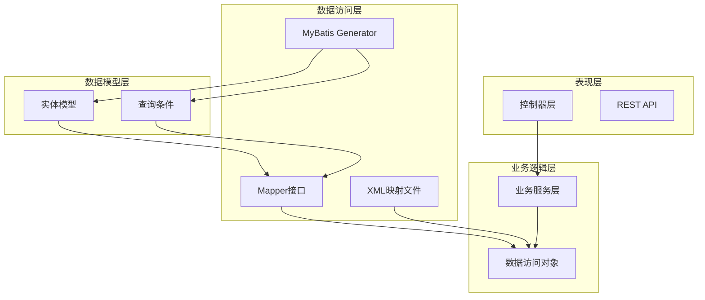
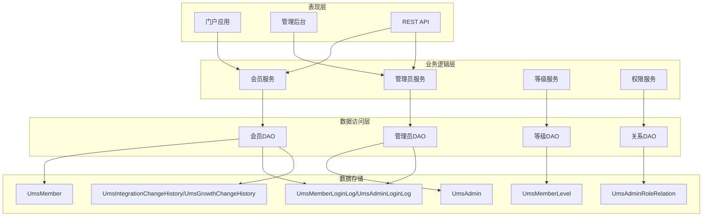
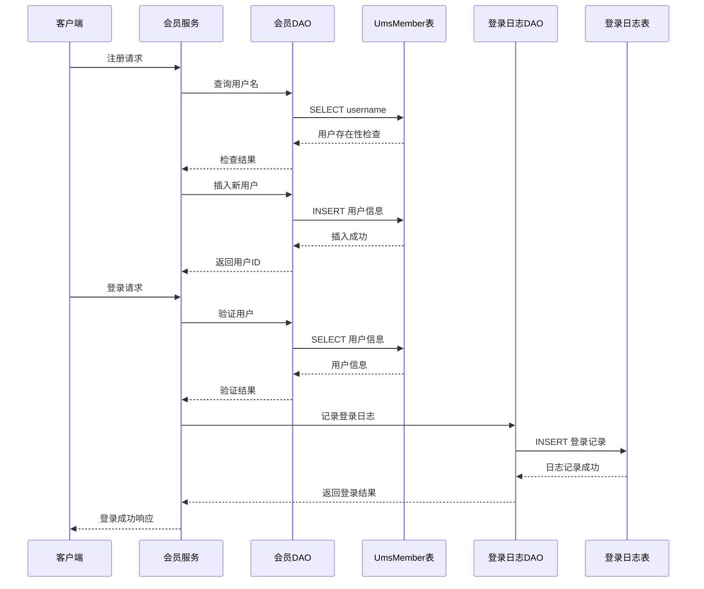
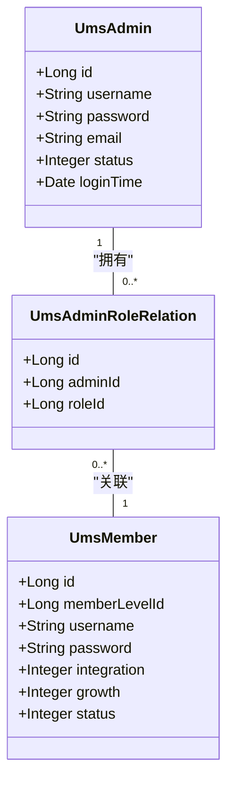
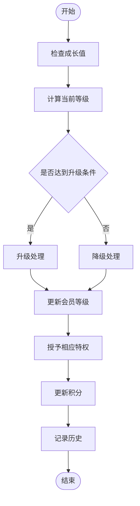
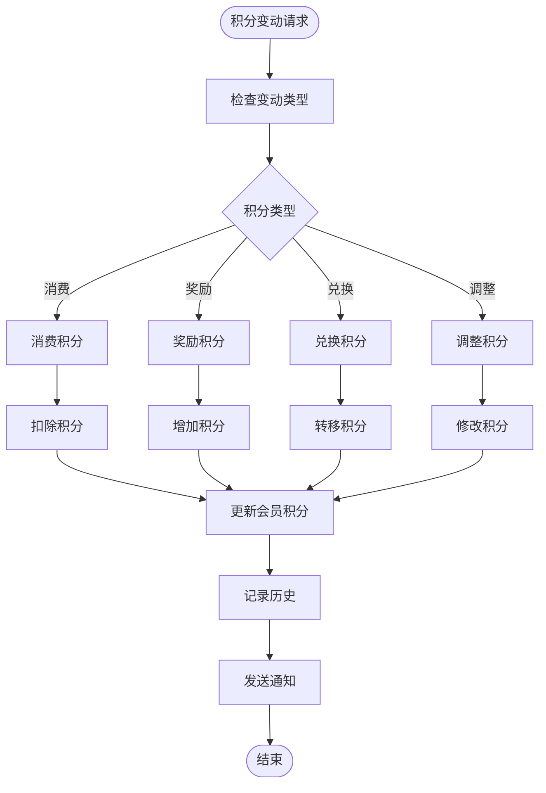
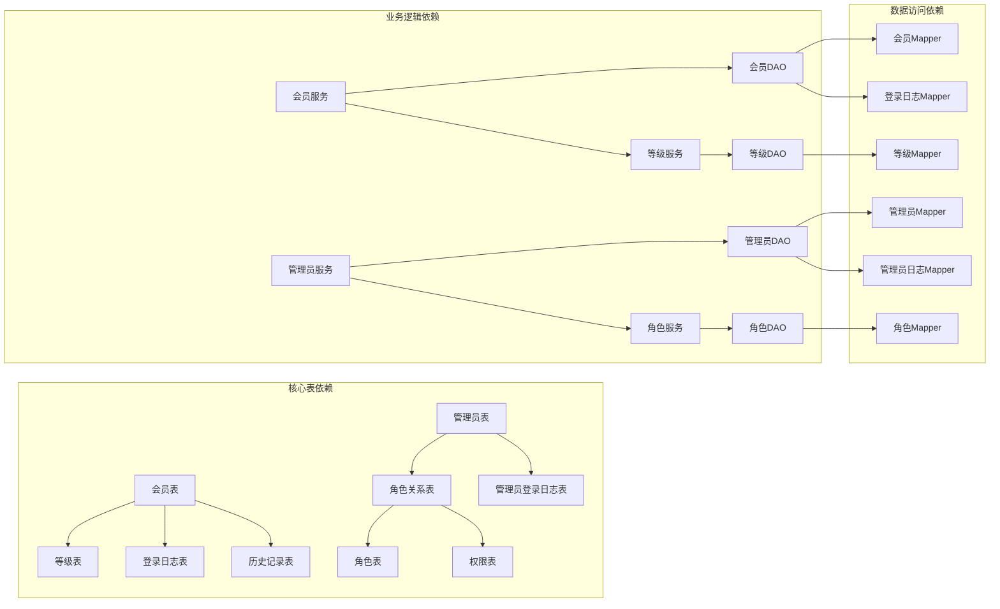

# 会员相关表

<cite>
**本文档引用的文件**
- [mall.sql](file://document/sql/mall.sql)
- [UmsMemberMapper.xml](file://mall-mbg/src/main/resources/com/macro/mall/mapper/UmsMemberMapper.xml)
- [UmsAdminMapper.xml](file://mall-mbg/src/main/resources/com/macro/mall/mapper/UmsAdminMapper.xml)
- [UmsMemberLevelMapper.xml](file://mall-mbg/src/main/resources/com/macro/mall/mapper/UmsMemberLevelMapper.xml)
- [UmsAdminRoleRelationMapper.xml](file://mall-mbg/src/main/resources/com/macro/mall/mapper/UmsAdminRoleRelationMapper.xml)
- [UmsMemberLoginLogMapper.xml](file://mall-mbg/src/main/resources/com/macro/mall/mapper/UmsMemberLoginLogMapper.xml)
- [UmsAdminLoginLogMapper.xml](file://mall-mbg/src/main/resources/com/macro/mall/mapper/UmsAdminLoginLogMapper.xml)
- [UmsIntegrationChangeHistoryMapper.xml](file://mall-mbg/src/main/resources/com/macro/mall/mapper/UmsIntegrationChangeHistoryMapper.xml)
- [UmsGrowthChangeHistoryMapper.xml](file://mall-mbg/src/main/resources/com/macro/mall/mapper/UmsGrowthChangeHistoryMapper.xml)
- [UmsMember.java](file://mall-mbg/src/main/java/com/macro/mall/model/UmsMember.java)
- [UmsAdmin.java](file://mall-mbg/src/main/java/com/macro/mall/model/UmsAdmin.java)
- [UmsMemberLevel.java](file://mall-mbg/src/main/java/com/macro/mall/model/UmsMemberLevel.java)
- [UmsAdminRoleRelation.java](file://mall-mbg/src/main/java/com/macro/mall/model/UmsAdminRoleRelation.java)
</cite>

## 目录
1. [简介](#简介)
2. [项目结构](#项目结构)
3. [核心组件](#核心组件)
4. [架构概览](#架构概览)
5. [详细组件分析](#详细组件分析)
6. [依赖分析](#依赖分析)
7. [性能考虑](#性能考虑)
8. [故障排除指南](#故障排除指南)
9. [结论](#结论)

## 简介

本文档详细介绍电商系统中的会员相关表结构设计，包括会员表(UmsMember)、管理员表(UmsAdmin)、会员等级表(UmsMemberLevel)、管理员角色关系表(UmsAdminRoleRelation)等核心数据表。文档涵盖了会员注册登录、权限管理、等级体系、积分管理、成长值计算等功能的表结构设计，并解释了会员信息保护、密码加密、登录日志等安全相关的设计。

该系统采用基于MyBatis的ORM框架，通过XML映射文件定义SQL操作，配合Java实体类实现数据持久化。整个架构遵循分层设计原则，将数据访问层、业务逻辑层和表现层清晰分离。

## 项目结构

系统采用模块化架构，主要包含以下核心模块：

**图表来源**
- [UmsMemberMapper.xml:1-431](file://mall-mbg/src/main/resources/com/macro/mall/mapper/UmsMemberMapper.xml#L1-L431)
- [UmsAdminMapper.xml:1-290](file://mall-mbg/src/main/resources/com/macro/mall/mapper/UmsAdminMapper.xml#L1-L290)

**章节来源**
- [UmsMemberMapper.xml:1-431](file://mall-mbg/src/main/resources/com/macro/mall/mapper/UmsMemberMapper.xml#L1-L431)
- [UmsAdminMapper.xml:1-290](file://mall-mbg/src/main/resources/com/macro/mall/mapper/UmsAdminMapper.xml#L1-L290)

## 核心组件

### 会员表设计

会员表(UmsMember)是整个会员系统的核心，设计了完整的用户信息存储结构：

| 字段名 | 数据类型 | 约束 | 描述 |
|--------|----------|------|------|
| id | BIGINT | PRIMARY KEY | 会员唯一标识符 |
| member_level_id | BIGINT | NOT NULL | 会员等级ID |
| username | VARCHAR(64) | UNIQUE | 用户名 |
| password | VARCHAR(64) | NOT NULL | 密码 |
| nickname | VARCHAR(64) |  | 昵称 |
| phone | VARCHAR(20) | UNIQUE | 手机号码 |
| status | INTEGER | NOT NULL | 状态：0-禁用，1-启用 |
| create_time | TIMESTAMP |  | 创建时间 |
| icon | VARCHAR(500) |  | 头像URL |
| gender | INTEGER |  | 性别：0-女，1-男 |
| birthday | DATE |  | 生日 |
| city | VARCHAR(64) |  | 城市 |
| job | VARCHAR(100) |  | 职业 |
| personalized_signature | VARCHAR(200) |  | 个性签名 |
| source_type | INTEGER |  | 注册来源：0-PC，1-APP |
| integration | INTEGER | DEFAULT 0 | 积分余额 |
| growth | INTEGER | DEFAULT 0 | 成长值 |
| luckey_count | INTEGER | DEFAULT 0 | 剩余抽奖次数 |
| history_integration | INTEGER | DEFAULT 0 | 历史积分 |

### 管理员表设计

管理员表(UmsAdmin)用于管理系统后台用户：

| 字段名 | 数据类型 | 约束 | 描述 |
|--------|----------|------|------|
| id | BIGINT | PRIMARY KEY | 管理员唯一标识符 |
| username | VARCHAR(64) | UNIQUE | 用户名 |
| password | VARCHAR(64) | NOT NULL | 密码 |
| icon | VARCHAR(500) |  | 头像URL |
| email | VARCHAR(100) |  | 邮箱地址 |
| nick_name | VARCHAR(64) |  | 昵称 |
| note | VARCHAR(200) |  | 备注 |
| create_time | TIMESTAMP |  | 创建时间 |
| login_time | TIMESTAMP |  | 最后登录时间 |
| status | INTEGER | NOT NULL | 状态：0-禁用，1-启用 |

### 会员等级表设计

会员等级表(UmsMemberLevel)定义了会员等级体系：

| 字段名 | 数据类型 | 约束 | 描述 |
|--------|----------|------|------|
| id | BIGINT | PRIMARY KEY | 等级唯一标识符 |
| name | VARCHAR(100) | NOT NULL | 等级名称 |
| growth_point | INTEGER | NOT NULL | 成长点要求 |
| default_status | INTEGER | NOT NULL | 默认状态：0-非默认，1-默认 |
| free_freight_point | DECIMAL(10,2) | NOT NULL | 免运费积分阈值 |
| comment_grow_point | INTEGER | NOT NULL | 评论成长点 |
| priviledge_free_freight | INTEGER | NOT NULL | 免运费特权：0-无，1-有 |
| priviledge_sign_in | INTEGER | NOT NULL | 签到特权：0-无，1-有 |
| priviledge_comment | INTEGER | NOT NULL | 评论特权：0-无，1-有 |
| priviledge_promotion | INTEGER | NOT NULL | 促销特权：0-无，1-有 |
| priviledge_member_price | INTEGER | NOT NULL | 会员价特权：0-无，1-有 |
| priviledge_birthday | INTEGER | NOT NULL | 生日特权：0-无，1-有 |
| note | VARCHAR(200) |  | 备注说明 |

### 权限管理表设计

管理员角色关系表(UmsAdminRoleRelation)实现多对多权限控制：

| 字段名 | 数据类型 | 约束 | 描述 |
|--------|----------|------|------|
| id | BIGINT | PRIMARY KEY | 关系唯一标识符 |
| admin_id | BIGINT | NOT NULL | 管理员ID |
| role_id | BIGINT | NOT NULL | 角色ID |

**章节来源**
- [UmsMember.java:1-228](file://mall-mbg/src/main/java/com/macro/mall/model/UmsMember.java#L1-L228)
- [UmsAdmin.java:1-129](file://mall-mbg/src/main/java/com/macro/mall/model/UmsAdmin.java#L1-L129)
- [UmsMemberLevel.java:1-162](file://mall-mbg/src/main/java/com/macro/mall/model/UmsMemberLevel.java#L1-L162)
- [UmsAdminRoleRelation.java:1-51](file://mall-mbg/src/main/java/com/macro/mall/model/UmsAdminRoleRelation.java#L1-L51)

## 架构概览

系统采用分层架构设计，确保各层职责明确，便于维护和扩展：

**图表来源**
- [UmsMemberMapper.xml:1-431](file://mall-mbg/src/main/resources/com/macro/mall/mapper/UmsMemberMapper.xml#L1-L431)
- [UmsAdminMapper.xml:1-290](file://mall-mbg/src/main/resources/com/macro/mall/mapper/UmsAdminMapper.xml#L1-L290)
- [UmsMemberLevelMapper.xml:1-339](file://mall-mbg/src/main/resources/com/macro/mall/mapper/UmsMemberLevelMapper.xml#L1-L339)
- [UmsAdminRoleRelationMapper.xml:1-179](file://mall-mbg/src/main/resources/com/macro/mall/mapper/UmsAdminRoleRelationMapper.xml#L1-L179)

## 详细组件分析

### 会员注册登录流程

会员注册登录流程通过多个表协同工作，确保系统的完整性和安全性：

**图表来源**
- [UmsMemberMapper.xml:118-134](file://mall-mbg/src/main/resources/com/macro/mall/mapper/UmsMemberMapper.xml#L118-L134)
- [UmsMemberLoginLogMapper.xml:104-114](file://mall-mbg/src/main/resources/com/macro/mall/mapper/UmsMemberLoginLogMapper.xml#L104-L114)

### 权限管理机制

系统通过管理员角色关系实现灵活的权限控制：

**图表来源**
- [UmsAdmin.java:1-129](file://mall-mbg/src/main/java/com/macro/mall/model/UmsAdmin.java#L1-L129)
- [UmsAdminRoleRelation.java:4-8](file://mall-mbg/src/main/resources/com/macro/mall/mapper/UmsAdminRoleRelationMapper.xml#L4-L8)
- [UmsMember.java:1-228](file://mall-mbg/src/main/java/com/macro/mall/model/UmsMember.java#L1-L228)

### 等级体系设计

会员等级体系通过成长值驱动，提供多层次的权益：

**图表来源**
- [UmsMemberLevelMapper.xml:82-95](file://mall-mbg/src/main/resources/com/macro/mall/mapper/UmsMemberLevelMapper.xml#L82-L95)
- [UmsGrowthChangeHistoryMapper.xml:76-89](file://mall-mbg/src/main/resources/com/macro/mall/mapper/UmsGrowthChangeHistoryMapper.xml#L76-L89)

### 积分管理流程

积分管理系统支持多种积分变动场景：

**图表来源**
- [UmsIntegrationChangeHistoryMapper.xml:106-116](file://mall-mbg/src/main/resources/com/macro/mall/mapper/UmsIntegrationChangeHistoryMapper.xml#L106-L116)
- [UmsMemberMapper.xml:17-24](file://mall-mbg/src/main/resources/com/macro/mall/mapper/UmsMemberMapper.xml#L17-L24)

**章节来源**
- [UmsMemberLoginLogMapper.xml:1-243](file://mall-mbg/src/main/resources/com/macro/mall/mapper/UmsMemberLoginLogMapper.xml#L1-L243)
- [UmsAdminLoginLogMapper.xml:1-226](file://mall-mbg/src/main/resources/com/macro/mall/mapper/UmsAdminLoginLogMapper.xml#L1-L226)
- [UmsIntegrationChangeHistoryMapper.xml:1-259](file://mall-mbg/src/main/resources/com/macro/mall/mapper/UmsIntegrationChangeHistoryMapper.xml#L1-L259)
- [UmsGrowthChangeHistoryMapper.xml:1-259](file://mall-mbg/src/main/resources/com/macro/mall/mapper/UmsGrowthChangeHistoryMapper.xml#L1-L259)

## 依赖分析

系统各组件间存在清晰的依赖关系：

**图表来源**
- [mall.sql:1-623](file://document/sql/mall.sql#L1-L623)
- [UmsMemberMapper.xml:1-431](file://mall-mbg/src/main/resources/com/macro/mall/mapper/UmsMemberMapper.xml#L1-L431)
- [UmsAdminMapper.xml:1-290](file://mall-mbg/src/main/resources/com/macro/mall/mapper/UmsAdminMapper.xml#L1-L290)

**章节来源**
- [mall.sql:1-623](file://document/sql/mall.sql#L1-L623)

## 性能考虑

系统在设计时充分考虑了性能优化：

### 索引策略
- 主键索引：所有表的主键字段自动建立索引
- 唯一索引：用户名、手机号等唯一性字段建立唯一索引
- 查询索引：常用查询字段如状态、创建时间等建立索引

### 缓存策略
- 用户信息缓存：会员基本信息缓存减少数据库访问
- 等级配置缓存：等级配置信息缓存提高查询效率
- 权限信息缓存：用户权限信息缓存降低权限验证开销

### 分页查询
- 大数据量查询使用分页机制
- 合理设置每页大小避免内存溢出
- 使用延迟加载减少不必要的数据传输

## 故障排除指南

### 常见问题及解决方案

**1. 登录失败问题**
- 检查用户名密码是否正确
- 验证用户状态是否为启用状态
- 查看登录日志确认登录尝试

**2. 权限不足问题**
- 确认用户是否绑定正确角色
- 检查角色权限配置
- 验证权限继承关系

**3. 积分异常问题**
- 检查积分变更历史记录
- 验证积分计算逻辑
- 确认积分同步机制

**4. 等级升级问题**
- 验证成长值计算准确性
- 检查等级配置参数
- 确认升级触发条件

**章节来源**
- [UmsMemberLoginLogMapper.xml:74-87](file://mall-mbg/src/main/resources/com/macro/mall/mapper/UmsMemberLoginLogMapper.xml#L74-L87)
- [UmsAdminLoginLogMapper.xml:73-86](file://mall-mbg/src/main/resources/com/macro/mall/mapper/UmsAdminLoginLogMapper.xml#L73-L86)

## 结论

会员相关表设计体现了电商系统对用户管理的全面考虑。通过合理的表结构设计、完善的权限控制机制、灵活的等级体系和严格的日志记录，系统能够有效支撑会员业务的发展需求。

关键设计亮点包括：
- **安全性**：密码加密存储、登录日志记录、权限分级控制
- **可扩展性**：模块化设计、灵活的等级体系、可配置的特权机制  
- **可维护性**：清晰的表结构、完整的注释说明、规范的命名约定
- **性能优化**：合理的索引策略、缓存机制、分页查询

该设计为后续的功能扩展和业务发展奠定了坚实的基础，能够适应不断变化的市场需求。