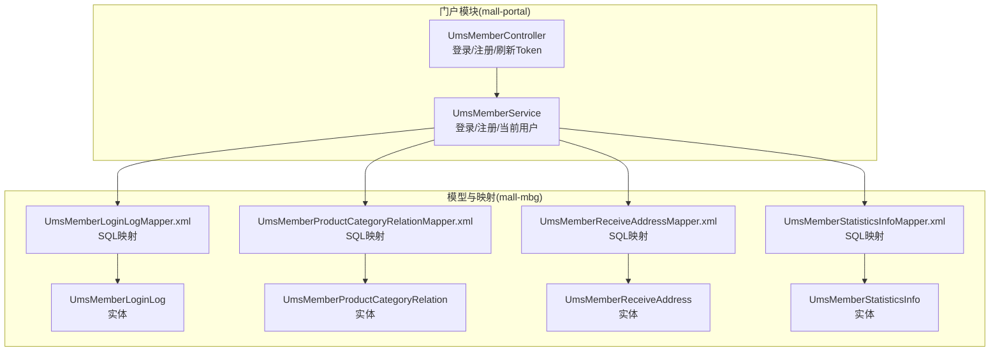
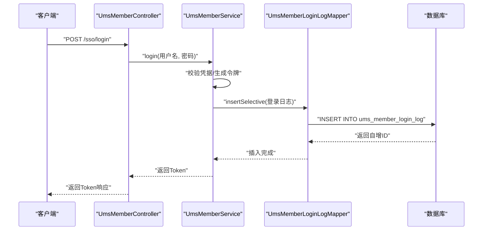
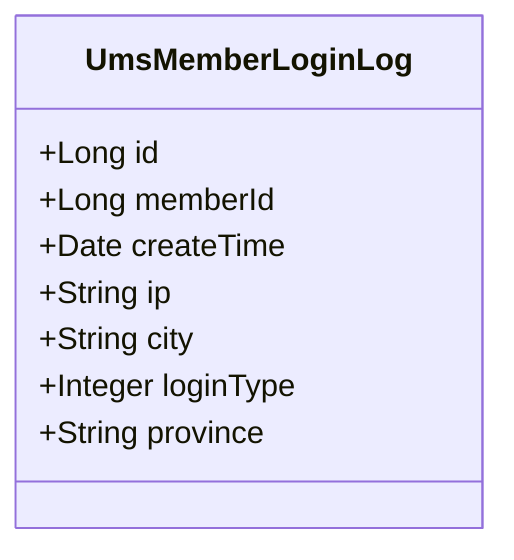
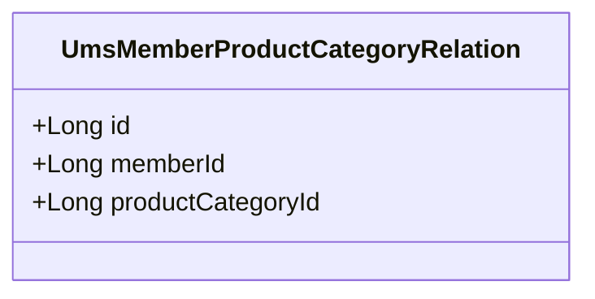
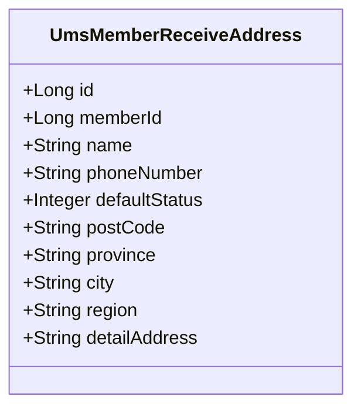
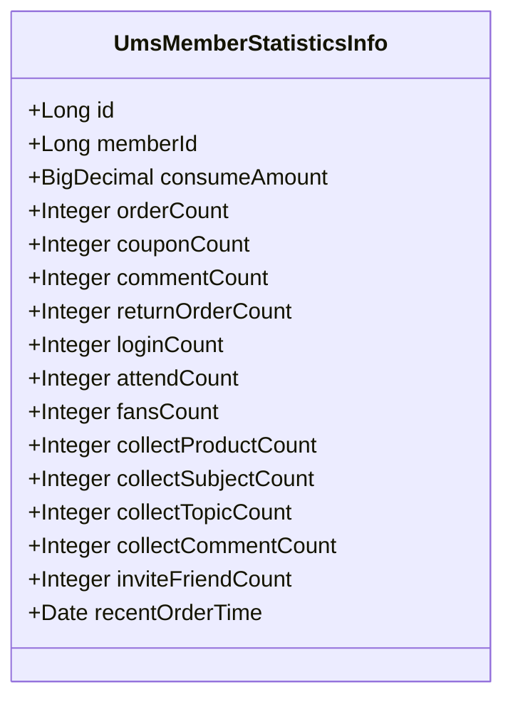
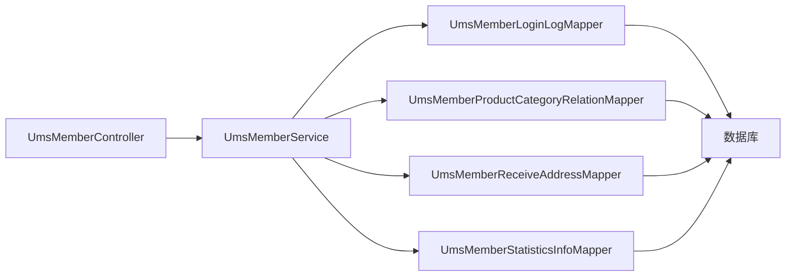

# 会员行为表

<cite>
**本文引用的文件**
- [UmsMemberLoginLog.java](file://mall-mbg/src/main/java/com/macro/mall/model/UmsMemberLoginLog.java)
- [UmsMemberProductCategoryRelation.java](file://mall-mbg/src/main/java/com/macro/mall/model/UmsMemberProductCategoryRelation.java)
- [UmsMemberReceiveAddress.java](file://mall-mbg/src/main/java/com/macro/mall/model/UmsMemberReceiveAddress.java)
- [UmsMemberStatisticsInfo.java](file://mall-mbg/src/main/java/com/macro/mall/model/UmsMemberStatisticsInfo.java)
- [UmsMemberLoginLogMapper.xml](file://mall-mbg/src/main/resources/com/macro/mall/mapper/UmsMemberLoginLogMapper.xml)
- [UmsMemberProductCategoryRelationMapper.xml](file://mall-mbg/src/main/resources/com/macro/mall/mapper/UmsMemberProductCategoryRelationMapper.xml)
- [UmsMemberReceiveAddressMapper.xml](file://mall-mbg/src/main/resources/com/macro/mall/mapper/UmsMemberReceiveAddressMapper.xml)
- [UmsMemberStatisticsInfoMapper.xml](file://mall-mbg/src/main/resources/com/macro/mall/mapper/UmsMemberStatisticsInfoMapper.xml)
- [UmsMemberLoginLogMapper.java](file://mall-mbg/src/main/java/com/macro/mall/mapper/UmsMemberLoginLogMapper.java)
- [UmsMemberProductCategoryRelationMapper.java](file://mall-mbg/src/main/java/com/macro/mall/mapper/UmsMemberProductCategoryRelationMapper.java)
- [UmsMemberService.java](file://mall-portal/src/main/java/com/macro/mall/portal/service/UmsMemberService.java)
- [UmsMemberController.java](file://mall-portal/src/main/java/com/macro/mall/portal/controller/UmsMemberController.java)
</cite>

## 目录
1. [简介](#简介)
2. [项目结构](#项目结构)
3. [核心组件](#核心组件)
4. [架构总览](#架构总览)
5. [详细组件分析](#详细组件分析)
6. [依赖关系分析](#依赖关系分析)
7. [性能考量](#性能考量)
8. [故障排查指南](#故障排查指南)
9. [结论](#结论)
10. [附录](#附录)

## 简介
本文件聚焦于会员行为追踪相关的数据库表与配套的ORM映射，包括：
- 会员登录日志表：记录会员登录行为的时间戳、来源IP、城市、省份及登录类型等信息，用于安全审计与用户画像构建。
- 会员商品分类偏好表：记录会员对商品分类的偏好关系，支撑购买偏好分析与个性化推荐。
- 会员收货地址表：管理会员的收货地址信息，支持订单配送与营销活动精准投放。
- 会员统计信息表：汇总会员消费金额、订单数、优惠券使用数、评论数、收藏数、关注/粉丝数、邀请好友数以及最近下单时间等指标，为运营分析提供数据基础。

文档将从表结构设计、字段语义、数据流、处理逻辑、集成点、错误处理与性能特征等方面进行系统化说明，并给出面向业务场景（如行为分析、个性化推荐、营销精准投放）的支撑说明。

## 项目结构
围绕会员行为表的相关代码主要分布在以下模块与路径：
- 数据模型：mall-mbg 模块下的 model 包中定义了四个实体类，分别对应上述四张表。
- ORM 映射：mall-mbg 模块下 resources/com/macro/mall/mapper 中的 XML 文件定义了对应的 MyBatis 映射与 SQL。
- 接口与控制器：mall-portal 模块下的 service 与 controller 定义了对外接口与登录注册流程，便于理解登录日志的触发时机与上下文。

图表来源
- [UmsMemberController.java:1-100](file://mall-portal/src/main/java/com/macro/mall/portal/controller/UmsMemberController.java#L1-L100)
- [UmsMemberService.java:1-65](file://mall-portal/src/main/java/com/macro/mall/portal/service/UmsMemberService.java#L1-L65)
- [UmsMemberLoginLog.java:1-96](file://mall-mbg/src/main/java/com/macro/mall/model/UmsMemberLoginLog.java#L1-L96)
- [UmsMemberProductCategoryRelation.java:1-51](file://mall-mbg/src/main/java/com/macro/mall/model/UmsMemberProductCategoryRelation.java#L1-L51)
- [UmsMemberReceiveAddress.java:1-128](file://mall-mbg/src/main/java/com/macro/mall/model/UmsMemberReceiveAddress.java#L1-L128)
- [UmsMemberStatisticsInfo.java:1-196](file://mall-mbg/src/main/java/com/macro/mall/model/UmsMemberStatisticsInfo.java#L1-L196)
- [UmsMemberLoginLogMapper.xml:1-243](file://mall-mbg/src/main/resources/com/macro/mall/mapper/UmsMemberLoginLogMapper.xml#L1-L243)
- [UmsMemberProductCategoryRelationMapper.xml:1-179](file://mall-mbg/src/main/resources/com/macro/mall/mapper/UmsMemberProductCategoryRelationMapper.xml#L1-L179)
- [UmsMemberReceiveAddressMapper.xml:1-291](file://mall-mbg/src/main/resources/com/macro/mall/mapper/UmsMemberReceiveAddressMapper.xml#L1-L291)
- [UmsMemberStatisticsInfoMapper.xml:1-386](file://mall-mbg/src/main/resources/com/macro/mall/mapper/UmsMemberStatisticsInfoMapper.xml#L1-L386)

章节来源
- [UmsMemberController.java:1-100](file://mall-portal/src/main/java/com/macro/mall/portal/controller/UmsMemberController.java#L1-L100)
- [UmsMemberService.java:1-65](file://mall-portal/src/main/java/com/macro/mall/portal/service/UmsMemberService.java#L1-L65)

## 核心组件
本节对四张行为追踪表进行逐项说明，涵盖字段含义、典型取值范围、索引建议与业务用途。

- 会员登录日志表（UmsMemberLoginLog）
  - 字段要点：主键、会员标识、创建时间、IP、城市、登录类型、省份。
  - 用途：登录行为审计、地域分布分析、异常登录检测、登录趋势分析。
  - 建议索引：member_id、create_time、ip；按天分区可提升查询与归档效率。

- 会员商品分类偏好表（UmsMemberProductCategoryRelation）
  - 字段要点：主键、会员标识、商品分类标识。
  - 用途：构建会员偏好画像、个性化推荐、定向营销。
  - 建议索引：member_id、product_category_id；避免重复偏好记录。

- 会员收货地址表（UmsMemberReceiveAddress）
  - 字段要点：主键、会员标识、姓名、电话、默认状态、邮编、省市区、详细地址。
  - 用途：订单配送、营销活动按地区投放、地址管理与默认地址策略。
  - 建议索引：member_id、default_status；默认地址唯一性约束。

- 会员统计信息表（UmsMemberStatisticsInfo）
  - 字段要点：主键、会员标识、累计消费金额、订单数、优惠券使用数、评论数、退货订单数、登录次数、关注数、粉丝数、收藏数量（商品/专题/话题/评论）、邀请好友数、最近下单时间。
  - 用途：会员价值评估、RFM分析、活跃度与留存分析、个性化内容与促销推送。
  - 建议索引：member_id；定期聚合更新，支持定时任务或事件驱动更新。

章节来源
- [UmsMemberLoginLog.java:1-96](file://mall-mbg/src/main/java/com/macro/mall/model/UmsMemberLoginLog.java#L1-L96)
- [UmsMemberProductCategoryRelation.java:1-51](file://mall-mbg/src/main/java/com/macro/mall/model/UmsMemberProductCategoryRelation.java#L1-L51)
- [UmsMemberReceiveAddress.java:1-128](file://mall-mbg/src/main/java/com/macro/mall/model/UmsMemberReceiveAddress.java#L1-L128)
- [UmsMemberStatisticsInfo.java:1-196](file://mall-mbg/src/main/java/com/macro/mall/model/UmsMemberStatisticsInfo.java#L1-L196)

## 架构总览
下图展示登录流程与登录日志写入的关键交互，体现控制器、服务层与数据库映射之间的调用关系。

图表来源
- [UmsMemberController.java:45-57](file://mall-portal/src/main/java/com/macro/mall/portal/controller/UmsMemberController.java#L45-L57)
- [UmsMemberService.java:55-64](file://mall-portal/src/main/java/com/macro/mall/portal/service/UmsMemberService.java#L55-L64)
- [UmsMemberLoginLogMapper.xml:104-160](file://mall-mbg/src/main/resources/com/macro/mall/mapper/UmsMemberLoginLogMapper.xml#L104-L160)

章节来源
- [UmsMemberController.java:1-100](file://mall-portal/src/main/java/com/macro/mall/portal/controller/UmsMemberController.java#L1-L100)
- [UmsMemberService.java:1-65](file://mall-portal/src/main/java/com/macro/mall/portal/service/UmsMemberService.java#L1-L65)
- [UmsMemberLoginLogMapper.xml:1-243](file://mall-mbg/src/main/resources/com/macro/mall/mapper/UmsMemberLoginLogMapper.xml#L1-L243)

## 详细组件分析

### 会员登录日志表（UmsMemberLoginLog）
- 表结构与字段
  - 主键：id
  - 关联：member_id
  - 时间：create_time
  - 网络：ip
  - 地理：city、province
  - 行为：login_type（如扫码、账号密码、短信等）
- 典型处理流程
  - 登录成功后，服务层构造登录日志对象并调用插入方法。
  - 插入时由数据库返回自增ID，确保后续审计与关联查询的完整性。
- 业务应用
  - 安全风控：异常IP/频繁登录检测。
  - 用户画像：地域分布、登录渠道偏好。
  - 运营分析：登录趋势、渠道效果对比。

图表来源
- [UmsMemberLoginLog.java:1-96](file://mall-mbg/src/main/java/com/macro/mall/model/UmsMemberLoginLog.java#L1-L96)

章节来源
- [UmsMemberLoginLog.java:1-96](file://mall-mbg/src/main/java/com/macro/mall/model/UmsMemberLoginLog.java#L1-L96)
- [UmsMemberLoginLogMapper.xml:1-243](file://mall-mbg/src/main/resources/com/macro/mall/mapper/UmsMemberLoginLogMapper.xml#L1-L243)

### 会员商品分类偏好表（UmsMemberProductCategoryRelation）
- 表结构与字段
  - 主键：id
  - 关联：member_id、product_category_id
- 典型处理流程
  - 用户浏览/收藏/下单后，根据其行为更新偏好关系。
  - 需要避免重复记录，必要时采用去重策略或唯一索引。
- 业务应用
  - 个性化推荐：基于偏好计算相似用户或协同过滤。
  - 营销精准投放：按偏好分类定向推送。

图表来源
- [UmsMemberProductCategoryRelation.java:1-51](file://mall-mbg/src/main/java/com/macro/mall/model/UmsMemberProductCategoryRelation.java#L1-L51)

章节来源
- [UmsMemberProductCategoryRelation.java:1-51](file://mall-mbg/src/main/java/com/macro/mall/model/UmsMemberProductCategoryRelation.java#L1-L51)
- [UmsMemberProductCategoryRelationMapper.xml:1-179](file://mall-mbg/src/main/resources/com/macro/mall/mapper/UmsMemberProductCategoryRelationMapper.xml#L1-L179)

### 会员收货地址表（UmsMemberReceiveAddress）
- 表结构与字段
  - 主键：id
  - 关联：member_id
  - 基本信息：name、phoneNumber、postCode
  - 默认状态：defaultStatus
  - 地址：province、city、region、detailAddress
- 典型处理流程
  - 新增/编辑地址时设置默认地址（同一会员仅允许一个默认地址）。
  - 删除地址时需重新指定默认地址或清理默认标记。
- 业务应用
  - 订单配送：默认地址优先、地址有效性校验。
  - 营销活动：按地区定向推送、区域活动运营。

图表来源
- [UmsMemberReceiveAddress.java:1-128](file://mall-mbg/src/main/java/com/macro/mall/model/UmsMemberReceiveAddress.java#L1-L128)

章节来源
- [UmsMemberReceiveAddress.java:1-128](file://mall-mbg/src/main/java/com/macro/mall/model/UmsMemberReceiveAddress.java#L1-L128)
- [UmsMemberReceiveAddressMapper.xml:1-291](file://mall-mbg/src/main/resources/com/macro/mall/mapper/UmsMemberReceiveAddressMapper.xml#L1-L291)

### 会员统计信息表（UmsMemberStatisticsInfo）
- 表结构与字段
  - 主键：id
  - 关联：member_id
  - 统计指标：consumeAmount、orderCount、couponCount、commentCount、returnOrderCount、loginCount、attendCount、fansCount、collectProductCount、collectSubjectCount、collectTopicCount、collectCommentCount、inviteFriendCount、recentOrderTime
- 典型处理流程
  - 订单完成后更新订单数、消费金额、最近下单时间。
  - 优惠券核销时更新couponCount；登录时更新loginCount；收藏/取消收藏时更新collect*Count；关注/取消关注时更新attendCount/fansCount；邀请好友时更新inviteFriendCount。
- 业务应用
  - RFM模型：消费频次、金额、最近一次消费时间。
  - 内容与营销：基于统计指标进行分层运营与个性化推送。

图表来源
- [UmsMemberStatisticsInfo.java:1-196](file://mall-mbg/src/main/java/com/macro/mall/model/UmsMemberStatisticsInfo.java#L1-L196)

章节来源
- [UmsMemberStatisticsInfo.java:1-196](file://mall-mbg/src/main/java/com/macro/mall/model/UmsMemberStatisticsInfo.java#L1-L196)
- [UmsMemberStatisticsInfoMapper.xml:1-386](file://mall-mbg/src/main/resources/com/macro/mall/mapper/UmsMemberStatisticsInfoMapper.xml#L1-L386)

## 依赖关系分析
- 控制器到服务层
  - UmsMemberController 提供登录、注册、刷新Token等入口，内部委托 UmsMemberService 执行业务逻辑。
- 服务层到映射层
  - UmsMemberService 在登录成功后调用 UmsMemberLoginLogMapper 插入登录日志；在需要时也会操作其他行为表的映射器。
- 映射层到数据库
  - 各 Mapper.xml 定义了完整的 CRUD SQL，通过 MyBatis 将实体与表字段映射，实现数据持久化。

图表来源
- [UmsMemberController.java:1-100](file://mall-portal/src/main/java/com/macro/mall/portal/controller/UmsMemberController.java#L1-L100)
- [UmsMemberService.java:1-65](file://mall-portal/src/main/java/com/macro/mall/portal/service/UmsMemberService.java#L1-L65)
- [UmsMemberLoginLogMapper.java:1-30](file://mall-mbg/src/main/java/com/macro/mall/mapper/UmsMemberLoginLogMapper.java#L1-L30)
- [UmsMemberProductCategoryRelationMapper.java:1-30](file://mall-mbg/src/main/java/com/macro/mall/mapper/UmsMemberProductCategoryRelationMapper.java#L1-L30)

章节来源
- [UmsMemberController.java:1-100](file://mall-portal/src/main/java/com/macro/mall/portal/controller/UmsMemberController.java#L1-L100)
- [UmsMemberService.java:1-65](file://mall-portal/src/main/java/com/macro/mall/portal/service/UmsMemberService.java#L1-L65)
- [UmsMemberLoginLogMapper.java:1-30](file://mall-mbg/src/main/java/com/macro/mall/mapper/UmsMemberLoginLogMapper.java#L1-L30)
- [UmsMemberProductCategoryRelationMapper.java:1-30](file://mall-mbg/src/main/java/com/macro/mall/mapper/UmsMemberProductCategoryRelationMapper.java#L1-L30)

## 性能考量
- 索引设计
  - 登录日志：member_id、create_time、ip 上建立合适索引，支持按会员与时间范围检索。
  - 偏好表：member_id、product_category_id 建立联合索引，避免重复偏好记录。
  - 收货地址：member_id、defaultStatus 建立索引，保证默认地址查询效率。
  - 统计表：member_id 建立索引，统计更新采用批量或延迟策略。
- 分区与归档
  - 登录日志按自然日分区，旧数据归档至历史库，降低在线表膨胀。
- 写入优化
  - 登录日志写入采用异步或批量提交策略，减少对登录链路的影响。
- 查询优化
  - 使用覆盖索引与条件裁剪，避免 SELECT *；对高频报表查询使用物化视图或宽表。

## 故障排查指南
- 登录日志未写入
  - 检查服务层是否在登录成功后调用插入方法；确认 Mapper 的 insertSelective 是否被正确调用。
  - 核对数据库连接与事务配置，确保插入成功并返回自增ID。
- 偏好重复记录
  - 检查插入前是否执行去重判断；必要时在数据库层面增加唯一约束或采用 upsert 逻辑。
- 默认地址冲突
  - 新增/修改默认地址时，应先清除原默认地址的标记，再设置新默认地址。
- 统计指标不准确
  - 核对订单完成、优惠券核销、收藏/取消收藏、关注/取消关注等事件是否均触发统计更新。
  - 对于批量导入或回放场景，考虑补偿机制与一致性校验。

章节来源
- [UmsMemberLoginLogMapper.xml:104-160](file://mall-mbg/src/main/resources/com/macro/mall/mapper/UmsMemberLoginLogMapper.xml#L104-L160)
- [UmsMemberProductCategoryRelationMapper.xml:100-128](file://mall-mbg/src/main/resources/com/macro/mall/mapper/UmsMemberProductCategoryRelationMapper.xml#L100-L128)
- [UmsMemberReceiveAddressMapper.xml:108-184](file://mall-mbg/src/main/resources/com/macro/mall/mapper/UmsMemberReceiveAddressMapper.xml#L108-L184)
- [UmsMemberStatisticsInfoMapper.xml:115-231](file://mall-mbg/src/main/resources/com/macro/mall/mapper/UmsMemberStatisticsInfoMapper.xml#L115-L231)

## 结论
会员行为表是构建用户画像、个性化推荐与精准营销的核心数据基础。通过登录日志、偏好关系、收货地址与统计指标的协同，能够有效支撑安全审计、行为分析、运营决策与用户体验优化。建议结合索引、分区与异步写入策略，持续优化读写性能，并完善事件驱动的统计更新机制，确保数据准确性与时效性。

## 附录
- 业务应用场景
  - 行为分析：登录趋势、地域分布、渠道偏好。
  - 个性化推荐：基于偏好与历史行为的协同过滤与内容推荐。
  - 营销精准投放：按地区、偏好、活跃度与价值分层的定向活动。
- 技术实现要点
  - 登录日志：记录时间戳、IP、城市、省份与登录类型，便于风控与画像。
  - 偏好表：去重与唯一性控制，避免冗余偏好。
  - 地址表：默认地址唯一性与地址有效性校验。
  - 统计表：事件驱动更新与周期性聚合，保障指标一致性。