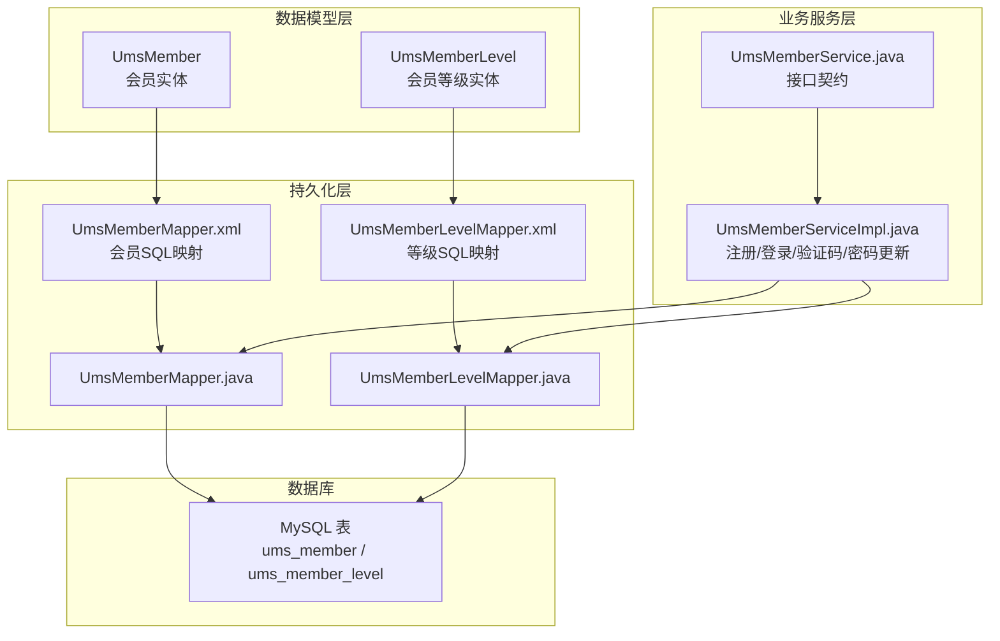
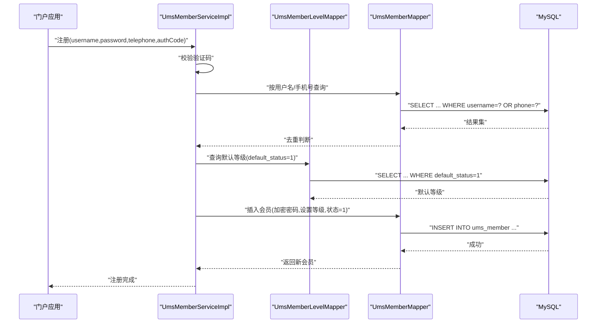
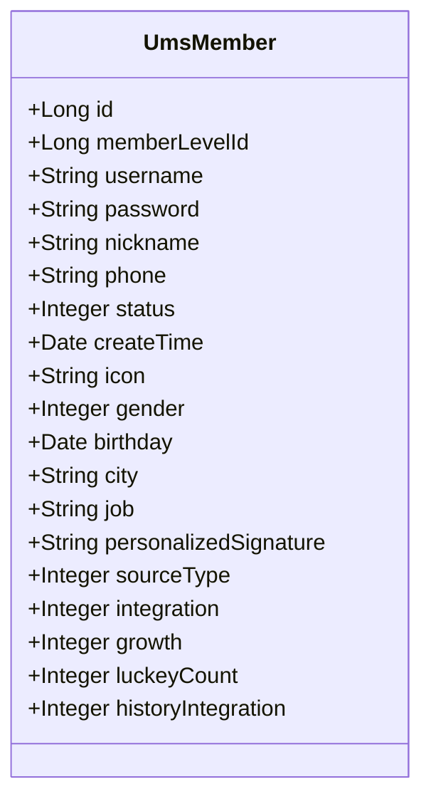
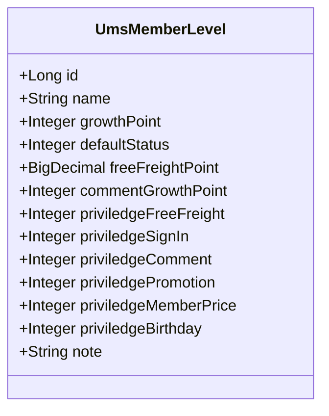
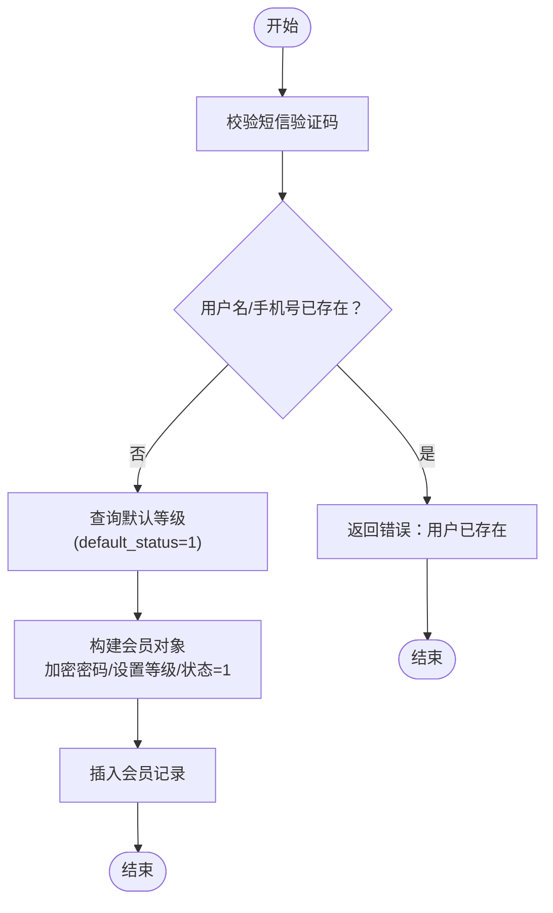
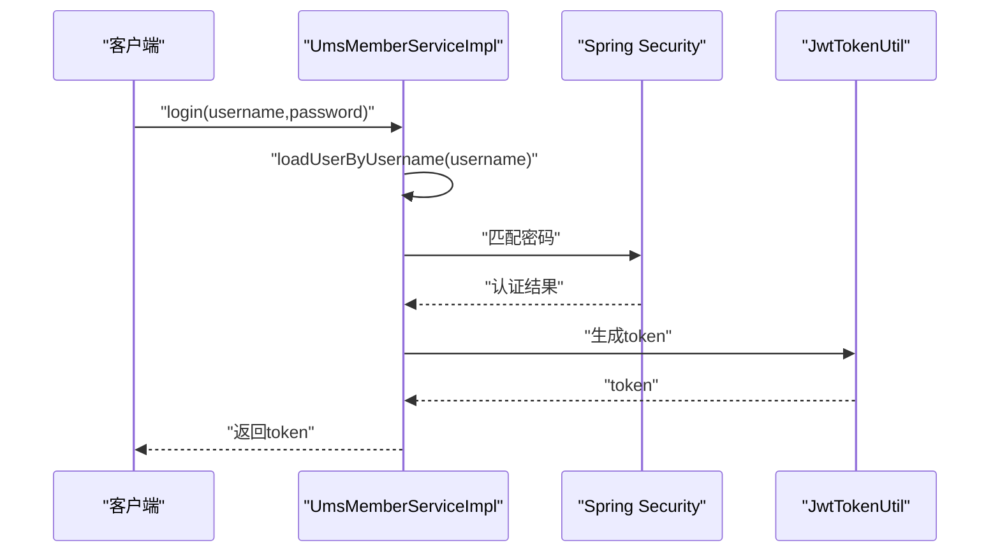
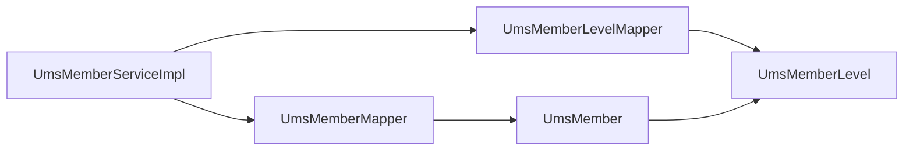

# 核心会员表

<cite>
**本文引用的文件**
- [UmsMember.java](file://mall-mbg/src/main/java/com/macro/mall/model/UmsMember.java)
- [UmsMemberLevel.java](file://mall-mbg/src/main/java/com/macro/mall/model/UmsMemberLevel.java)
- [UmsMemberMapper.xml](file://mall-mbg/src/main/resources/com/macro/mall/mapper/UmsMemberMapper.xml)
- [UmsMemberLevelMapper.xml](file://mall-mbg/src/main/resources/com/macro/mall/mapper/UmsMemberLevelMapper.xml)
- [UmsMemberMapper.java](file://mall-mbg/src/main/java/com/macro/mall/mapper/UmsMemberMapper.java)
- [UmsMemberLevelMapper.java](file://mall-mbg/src/main/java/com/macro/mall/mapper/UmsMemberLevelMapper.java)
- [UmsMemberServiceImpl.java](file://mall-portal/src/main/java/com/macro/mall/portal/service/impl/UmsMemberServiceImpl.java)
- [UmsMemberService.java](file://mall-portal/src/main/java/com/macro/mall/portal/service/UmsMemberService.java)
- [mall.sql](file://document/sql/mall.sql)
</cite>

## 目录
1. [简介](#简介)
2. [项目结构](#项目结构)
3. [核心组件](#核心组件)
4. [架构概览](#架构概览)
5. [详细组件分析](#详细组件分析)
6. [依赖分析](#依赖分析)
7. [性能考虑](#性能考虑)
8. [故障排查指南](#故障排查指南)
9. [结论](#结论)
10. [附录](#附录)

## 简介
本文件聚焦于电商系统中的核心会员表设计，围绕 UmsMember 会员表与 UmsMemberLevel 会员等级表展开，系统阐述以下主题：
- 会员基本信息字段（用户名、手机号、邮箱、性别、生日等）
- 会员等级字段（等级名称、成长值门槛、默认状态、特权项等）
- 会员状态字段（启用状态、锁定状态、注册时间等）
- 关键设计与约束：密码加密存储、手机号唯一性约束、会员等级自动分配
- 业务流程支撑：会员注册、登录验证、个人信息修改
- 实际建表语句与字段说明、常见会员操作示例

## 项目结构
- 数据模型层：UmsMember、UmsMemberLevel 对应会员与等级实体
- 持久化层：MyBatis Mapper XML 映射 SQL，Mapper 接口定义 CRUD
- 业务服务层：mall-portal 提供会员注册、登录、验证码、密码更新等能力
- 数据库脚本：document/sql/mall.sql 中包含建表语句与索引

**图表来源**
- [UmsMember.java:1-228](file://mall-mbg/src/main/java/com/macro/mall/model/UmsMember.java#L1-L228)
- [UmsMemberLevel.java:1-162](file://mall-mbg/src/main/java/com/macro/mall/model/UmsMemberLevel.java#L1-L162)
- [UmsMemberMapper.xml:1-431](file://mall-mbg/src/main/resources/com/macro/mall/mapper/UmsMemberMapper.xml#L1-L431)
- [UmsMemberLevelMapper.xml:1-339](file://mall-mbg/src/main/resources/com/macro/mall/mapper/UmsMemberLevelMapper.xml#L1-L339)
- [UmsMemberMapper.java:1-30](file://mall-mbg/src/main/java/com/macro/mall/mapper/UmsMemberMapper.java#L1-L30)
- [UmsMemberLevelMapper.java:1-30](file://mall-mbg/src/main/java/com/macro/mall/mapper/UmsMemberLevelMapper.java#L1-L30)
- [UmsMemberServiceImpl.java:1-197](file://mall-portal/src/main/java/com/macro/mall/portal/service/impl/UmsMemberServiceImpl.java#L1-L197)
- [UmsMemberService.java:1-65](file://mall-portal/src/main/java/com/macro/mall/portal/service/UmsMemberService.java#L1-L65)
- [mall.sql:2720-2740](file://document/sql/mall.sql#L2720-L2740)

**章节来源**
- [UmsMember.java:1-228](file://mall-mbg/src/main/java/com/macro/mall/model/UmsMember.java#L1-L228)
- [UmsMemberLevel.java:1-162](file://mall-mbg/src/main/java/com/macro/mall/model/UmsMemberLevel.java#L1-L162)
- [UmsMemberMapper.xml:1-431](file://mall-mbg/src/main/resources/com/macro/mall/mapper/UmsMemberMapper.xml#L1-L431)
- [UmsMemberLevelMapper.xml:1-339](file://mall-mbg/src/main/resources/com/macro/mall/mapper/UmsMemberLevelMapper.xml#L1-L339)
- [UmsMemberMapper.java:1-30](file://mall-mbg/src/main/java/com/macro/mall/mapper/UmsMemberMapper.java#L1-L30)
- [UmsMemberLevelMapper.java:1-30](file://mall-mbg/src/main/java/com/macro/mall/mapper/UmsMemberLevelMapper.java#L1-L30)
- [UmsMemberServiceImpl.java:1-197](file://mall-portal/src/main/java/com/macro/mall/portal/service/impl/UmsMemberServiceImpl.java#L1-L197)
- [UmsMemberService.java:1-65](file://mall-portal/src/main/java/com/macro/mall/portal/service/UmsMemberService.java#L1-L65)
- [mall.sql:2720-2740](file://document/sql/mall.sql#L2720-L2740)

## 核心组件
- UmsMember 会员表：承载会员基本信息、状态、扩展字段（头像、性别、生日、城市、职业、个性签名、来源类型、积分、成长值、历史积分、抽奖次数等），并关联会员等级 memberLevelId
- UmsMemberLevel 会员等级表：承载等级名称、成长值门槛、默认状态、免邮门槛、评论成长值、各类特权开关及备注等
- MyBatis 映射：通过 Mapper XML 定义完整的增删改查、条件查询、排序等 SQL
- 业务服务：提供注册（含验证码校验与默认等级分配）、登录（基于 Spring Security + JWT）、密码修改、当前用户查询、积分更新等

**章节来源**
- [UmsMember.java:6-45](file://mall-mbg/src/main/java/com/macro/mall/model/UmsMember.java#L6-L45)
- [UmsMemberLevel.java:6-33](file://mall-mbg/src/main/java/com/macro/mall/model/UmsMemberLevel.java#L6-L33)
- [UmsMemberMapper.xml:4-24](file://mall-mbg/src/main/resources/com/macro/mall/mapper/UmsMemberMapper.xml#L4-L24)
- [UmsMemberLevelMapper.xml:4-18](file://mall-mbg/src/main/resources/com/macro/mall/mapper/UmsMemberLevelMapper.xml#L4-L18)
- [UmsMemberServiceImpl.java:77-107](file://mall-portal/src/main/java/com/macro/mall/portal/service/impl/UmsMemberServiceImpl.java#L77-L107)

## 架构概览
下图展示了从门户服务发起请求到数据库执行的典型路径，以及与会员等级表的关联。

**图表来源**
- [UmsMemberServiceImpl.java:77-107](file://mall-portal/src/main/java/com/macro/mall/portal/service/impl/UmsMemberServiceImpl.java#L77-L107)
- [UmsMemberLevelMapper.java:1-30](file://mall-mbg/src/main/java/com/macro/mall/mapper/UmsMemberLevelMapper.java#L1-L30)
- [UmsMemberMapper.java:1-30](file://mall-mbg/src/main/java/com/macro/mall/mapper/UmsMemberMapper.java#L1-L30)
- [UmsMemberLevelMapper.xml:82-95](file://mall-mbg/src/main/resources/com/macro/mall/mapper/UmsMemberLevelMapper.xml#L82-L95)
- [UmsMemberMapper.xml:118-134](file://mall-mbg/src/main/resources/com/macro/mall/mapper/UmsMemberMapper.xml#L118-L134)

## 详细组件分析

### UmsMember 会员表
- 字段设计要点
  - 基本信息：用户名、密码、昵称、手机号、头像、性别、生日、城市、职业、个性签名
  - 等级与统计：memberLevelId、integration（积分）、growth（成长值）、luckeyCount（剩余抽奖次数）、historyIntegration（历史积分）
  - 来源与状态：sourceType（来源类型）、status（启用状态）、createTime（注册时间）
- 约束与索引
  - 主键：id
  - 唯一索引：username、phone（确保用户名与手机号唯一）
- 设计理念
  - 密码统一使用加密存储（见业务服务层）
  - 手机号唯一性约束用于登录与找回密码场景
  - 默认启用状态为 1，便于新用户直接使用
  - 成长值与积分用于后续等级升级与权益计算

**图表来源**
- [UmsMember.java:6-45](file://mall-mbg/src/main/java/com/macro/mall/model/UmsMember.java#L6-L45)

**章节来源**
- [UmsMember.java:6-45](file://mall-mbg/src/main/java/com/macro/mall/model/UmsMember.java#L6-L45)
- [UmsMemberMapper.xml:4-24](file://mall-mbg/src/main/resources/com/macro/mall/mapper/UmsMemberMapper.xml#L4-L24)
- [mall.sql:2720-2740](file://document/sql/mall.sql#L2720-L2740)

### UmsMemberLevel 会员等级表
- 字段设计要点
  - 等级标识：id、name（等级名称）、growthPoint（升级所需成长值）
  - 默认策略：defaultStatus（默认等级标记）
  - 经济门槛：freeFreightPoint（免邮门槛）
  - 行为激励：commentGrowthPoint（评论获成长值）
  - 特权开关：priviledgeFreeFreight、priviledgeSignIn、priviledgeComment、priviledgePromotion、priviledgeMemberPrice、priviledgeBirthday
  - 备注：note
- 设计理念
  - 通过 defaultStatus 与 growthPoint 实现“默认等级”与“升级门槛”的清晰分离
  - 特权开关支持灵活配置不同等级的差异化权益
  - commentGrowthPoint 与 freeFreightPoint 体现积分与成长值的多维运营手段

**图表来源**
- [UmsMemberLevel.java:6-33](file://mall-mbg/src/main/java/com/macro/mall/model/UmsMemberLevel.java#L6-L33)

**章节来源**
- [UmsMemberLevel.java:6-33](file://mall-mbg/src/main/java/com/macro/mall/model/UmsMemberLevel.java#L6-L33)
- [UmsMemberLevelMapper.xml:4-18](file://mall-mbg/src/main/resources/com/macro/mall/mapper/UmsMemberLevelMapper.xml#L4-L18)
- [mall.sql:2740-2760](file://document/sql/mall.sql#L2740-L2760)

### 业务流程与关键设计

#### 1) 会员注册流程
- 输入参数：username、password（需客户端加密）、telephone、authCode
- 核心步骤
  - 验证短信验证码
  - 校验用户名与手机号唯一性
  - 查询默认等级（default_status=1）并设置 memberLevelId
  - 插入会员记录（status=1，默认启用）
- 关键点
  - 密码经由 PasswordEncoder 加密入库
  - 手机号唯一索引保证手机号不可重复
  - 默认等级自动分配，简化初始配置

**图表来源**
- [UmsMemberServiceImpl.java:77-107](file://mall-portal/src/main/java/com/macro/mall/portal/service/impl/UmsMemberServiceImpl.java#L77-L107)
- [UmsMemberLevelMapper.xml:82-95](file://mall-mbg/src/main/resources/com/macro/mall/mapper/UmsMemberLevelMapper.xml#L82-L95)
- [UmsMemberMapper.xml:118-134](file://mall-mbg/src/main/resources/com/macro/mall/mapper/UmsMemberMapper.xml#L118-L134)

**章节来源**
- [UmsMemberServiceImpl.java:77-107](file://mall-portal/src/main/java/com/macro/mall/portal/service/impl/UmsMemberServiceImpl.java#L77-L107)
- [UmsMemberLevelMapper.xml:82-95](file://mall-mbg/src/main/resources/com/macro/mall/mapper/UmsMemberLevelMapper.xml#L82-L95)
- [UmsMemberMapper.xml:118-134](file://mall-mbg/src/main/resources/com/macro/mall/mapper/UmsMemberMapper.xml#L118-L134)

#### 2) 登录验证流程
- 输入参数：username、password（需客户端加密）
- 核心步骤
  - 通过 loadUserByUsername 获取会员详情
  - 使用 PasswordEncoder.matches 校验密码
  - 通过 JWT 生成访问令牌
- 关键点
  - Spring Security 认证上下文与 JWT 结合，支持后续鉴权
  - 登录失败抛出异常，由上层捕获并记录日志

**图表来源**
- [UmsMemberServiceImpl.java:164-180](file://mall-portal/src/main/java/com/macro/mall/portal/service/impl/UmsMemberServiceImpl.java#L164-L180)

**章节来源**
- [UmsMemberServiceImpl.java:164-180](file://mall-portal/src/main/java/com/macro/mall/portal/service/impl/UmsMemberServiceImpl.java#L164-L180)

#### 3) 个人信息修改与积分更新
- 当前登录用户查询：通过 SecurityContext 获取 MemberDetails 并读取 UmsMember
- 积分更新：updateIntegration(id, integration) 支持外部调用更新积分
- 密码修改：通过手机号+验证码+新密码更新，更新后清理缓存

**章节来源**
- [UmsMemberServiceImpl.java:138-153](file://mall-portal/src/main/java/com/macro/mall/portal/service/impl/UmsMemberServiceImpl.java#L138-L153)
- [UmsMemberService.java:11-65](file://mall-portal/src/main/java/com/macro/mall/portal/service/UmsMemberService.java#L11-L65)

## 依赖分析
- UmsMember 与 UmsMemberLevel 的关联：UmsMember.memberLevelId → UmsMemberLevel.id
- 业务服务依赖：
  - UmsMemberServiceImpl 依赖 UmsMemberMapper、UmsMemberLevelMapper、PasswordEncoder、JwtTokenUtil、UmsMemberCacheService
- MyBatis 映射依赖：
  - Mapper XML 与 Model 类字段一一对应，支持条件查询、排序、分页等

**图表来源**
- [UmsMemberServiceImpl.java:40-51](file://mall-portal/src/main/java/com/macro/mall/portal/service/impl/UmsMemberServiceImpl.java#L40-L51)
- [UmsMemberMapper.java:1-30](file://mall-mbg/src/main/java/com/macro/mall/mapper/UmsMemberMapper.java#L1-L30)
- [UmsMemberLevelMapper.java:1-30](file://mall-mbg/src/main/java/com/macro/mall/mapper/UmsMemberLevelMapper.java#L1-L30)

**章节来源**
- [UmsMemberServiceImpl.java:40-51](file://mall-portal/src/main/java/com/macro/mall/portal/service/impl/UmsMemberServiceImpl.java#L40-L51)
- [UmsMemberMapper.java:1-30](file://mall-mbg/src/main/java/com/macro/mall/mapper/UmsMemberMapper.java#L1-L30)
- [UmsMemberLevelMapper.java:1-30](file://mall-mbg/src/main/java/com/macro/mall/mapper/UmsMemberLevelMapper.java#L1-L30)

## 性能考虑
- 唯一索引：用户名与手机号的唯一性约束可避免重复注册，但会增加写入时的冲突检查成本
- 缓存策略：业务层对会员与验证码使用缓存（如 Redis），减少数据库压力
- 分页与排序：Mapper XML 支持 orderByClause，建议在高频查询场景合理使用索引与分页
- 密码加密：采用强哈希算法（由 PasswordEncoder 实现），避免明文存储带来的安全与性能开销

## 故障排查指南
- 注册失败：验证码错误
  - 现象：提示验证码错误
  - 排查：确认验证码是否过期、是否与手机号一致
  - 参考：[UmsMemberServiceImpl.java:78-82](file://mall-portal/src/main/java/com/macro/mall/portal/service/impl/UmsMemberServiceImpl.java#L78-L82)
- 用户已存在
  - 现象：提示该用户已经存在
  - 排查：检查用户名或手机号是否已被占用
  - 参考：[UmsMemberServiceImpl.java:88-90](file://mall-portal/src/main/java/com/macro/mall/portal/service/impl/UmsMemberServiceImpl.java#L88-L90)
- 登录失败
  - 现象：用户名或密码错误
  - 排查：确认用户名是否存在、密码是否匹配（注意客户端加密）
  - 参考：[UmsMemberServiceImpl.java:169-172](file://mall-portal/src/main/java/com/macro/mall/portal/service/impl/UmsMemberServiceImpl.java#L169-L172)
- 密码修改失败
  - 现象：提示该账号不存在或验证码错误
  - 排查：确认手机号是否正确、验证码是否匹配
  - 参考：[UmsMemberServiceImpl.java:121-131](file://mall-portal/src/main/java/com/macro/mall/portal/service/impl/UmsMemberServiceImpl.java#L121-L131)

**章节来源**
- [UmsMemberServiceImpl.java:78-90](file://mall-portal/src/main/java/com/macro/mall/portal/service/impl/UmsMemberServiceImpl.java#L78-L90)
- [UmsMemberServiceImpl.java:121-131](file://mall-portal/src/main/java/com/macro/mall/portal/service/impl/UmsMemberServiceImpl.java#L121-L131)
- [UmsMemberServiceImpl.java:169-172](file://mall-portal/src/main/java/com/macro/mall/portal/service/impl/UmsMemberServiceImpl.java#L169-L172)

## 结论
- UmsMember 与 UmsMemberLevel 的设计清晰地分离了“会员信息”与“等级策略”，便于扩展与维护
- 通过唯一索引、密码加密与验证码机制，保障了注册与登录的安全性
- 业务服务层提供了完善的注册、登录、密码修改与积分管理能力，满足核心会员场景需求
- 建议在生产环境中结合缓存与监控，持续优化注册与登录的性能与稳定性

## 附录

### 建表语句与字段说明（摘自 mall.sql）
- 会员表 ums_member
  - 字段：id、member_level_id、username、password、nickname、phone、status、create_time、icon、gender、birthday、city、job、personalized_signature、source_type、integration、growth、luckey_count、history_integration
  - 约束：主键 id；唯一索引 idx_username、idx_phone
  - 参考：[mall.sql:2720-2740](file://document/sql/mall.sql#L2720-L2740)
- 会员等级表 ums_member_level
  - 字段：id、name、growth_point、default_status、free_freight_point、comment_growth_point、priviledge_free_freight、priviledge_sign_in、priviledge_comment、priviledge_promotion、priviledge_member_price、priviledge_birthday、note
  - 约束：主键 id
  - 参考：[mall.sql:2740-2760](file://document/sql/mall.sql#L2740-L2760)

### 常见会员操作示例（基于服务接口）
- 注册：register(username, password, telephone, authCode)
  - 参考：[UmsMemberService.java:25-26](file://mall-portal/src/main/java/com/macro/mall/portal/service/UmsMemberService.java#L25-L26)
- 登录：login(username, password)
  - 参考：[UmsMemberService.java:58-58](file://mall-portal/src/main/java/com/macro/mall/portal/service/UmsMemberService.java#L58-L58)
- 修改密码：updatePassword(telephone, password, authCode)
  - 参考：[UmsMemberService.java:36-37](file://mall-portal/src/main/java/com/macro/mall/portal/service/UmsMemberService.java#L36-L37)
- 获取当前会员：getCurrentMember()
  - 参考：[UmsMemberService.java:42-42](file://mall-portal/src/main/java/com/macro/mall/portal/service/UmsMemberService.java#L42-L42)
- 更新积分：updateIntegration(id, integration)
  - 参考：[UmsMemberService.java:47-47](file://mall-portal/src/main/java/com/macro/mall/portal/service/UmsMemberService.java#L47-L47)