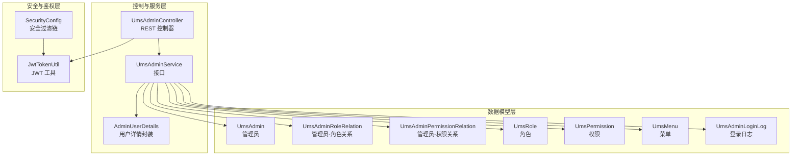
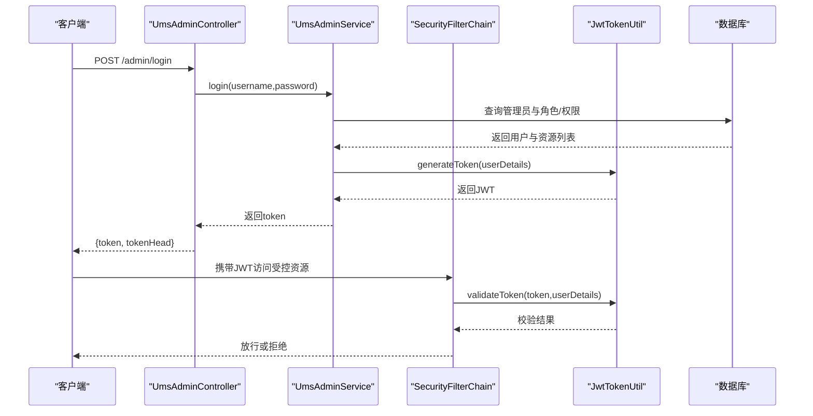
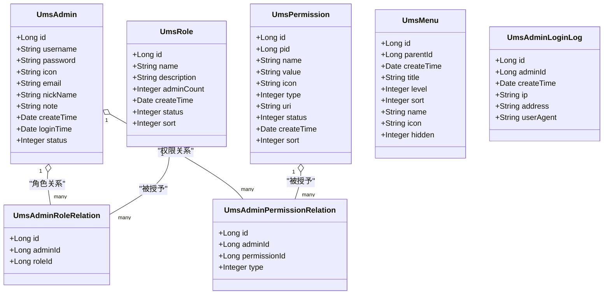
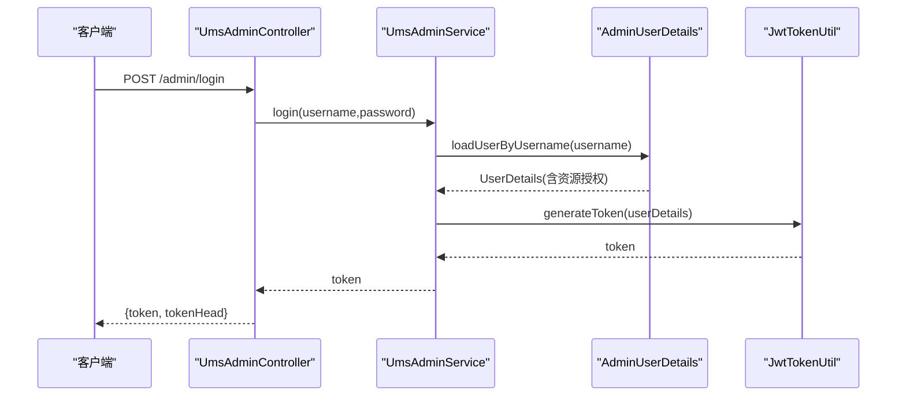
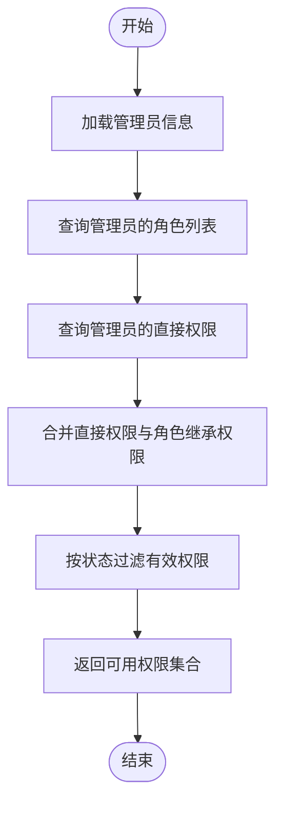
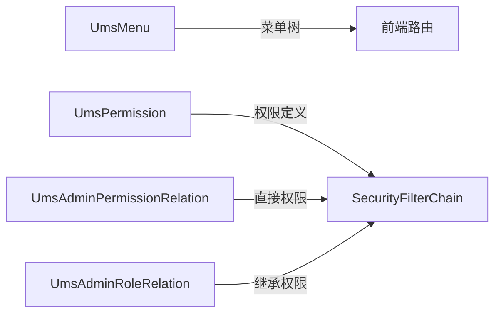
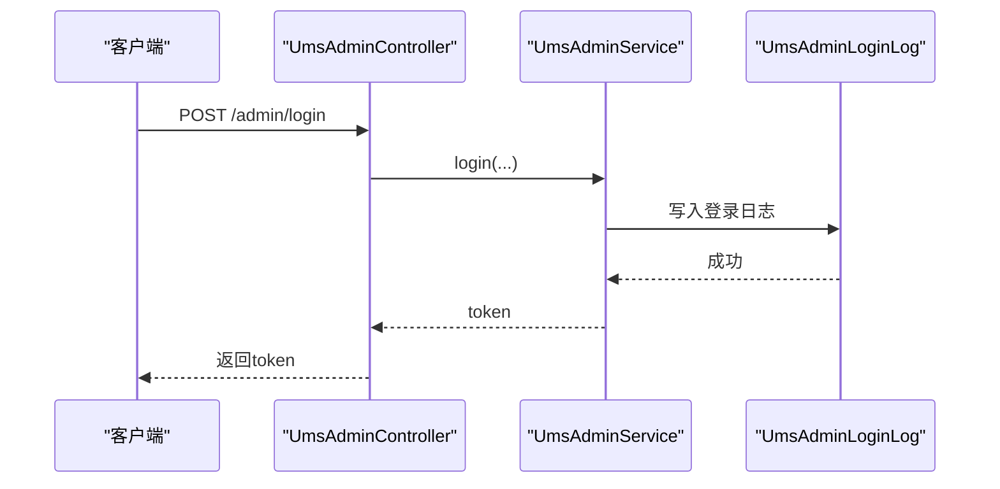
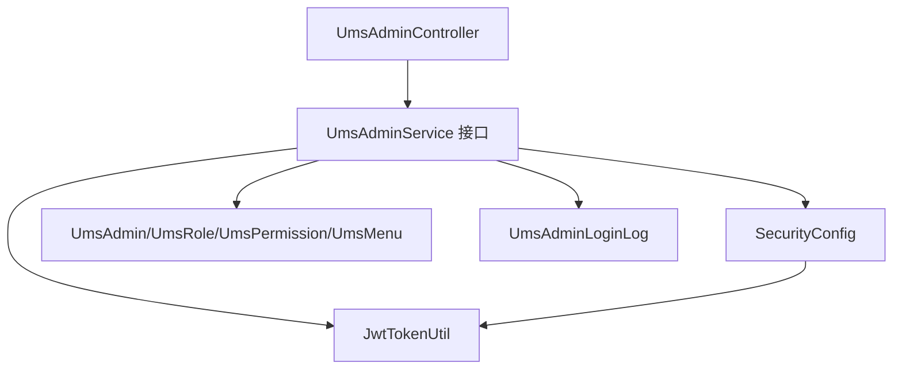

# 管理员用户表

<cite>
**本文引用的文件**
- [UmsAdmin.java](file://mall-mbg/src/main/java/com/macro/mall/model/UmsAdmin.java)
- [UmsAdminRoleRelation.java](file://mall-mbg/src/main/java/com/macro/mall/model/UmsAdminRoleRelation.java)
- [UmsAdminPermissionRelation.java](file://mall-mbg/src/main/java/com/macro/mall/model/UmsAdminPermissionRelation.java)
- [UmsRole.java](file://mall-mbg/src/main/java/com/macro/mall/model/UmsRole.java)
- [UmsPermission.java](file://mall-mbg/src/main/java/com/macro/mall/model/UmsPermission.java)
- [UmsMenu.java](file://mall-mbg/src/main/java/com/macro/mall/model/UmsMenu.java)
- [UmsAdminLoginLog.java](file://mall-mbg/src/main/java/com/macro/mall/model/UmsAdminLoginLog.java)
- [UmsAdminMapper.xml](file://mall-mbg/src/main/resources/com/macro/mall/mapper/UmsAdminMapper.xml)
- [UmsAdminRoleRelationMapper.xml](file://mall-mbg/src/main/resources/com/macro/mall/mapper/UmsAdminRoleRelationMapper.xml)
- [UmsAdminPermissionRelationMapper.xml](file://mall-mbg/src/main/resources/com/macro/mall/mapper/UmsAdminPermissionRelationMapper.xml)
- [UmsRoleMapper.xml](file://mall-mbg/src/main/resources/com/macro/mall/mapper/UmsRoleMapper.xml)
- [UmsPermissionMapper.xml](file://mall-mbg/src/main/resources/com/macro/mall/mapper/UmsPermissionMapper.xml)
- [UmsMenuMapper.xml](file://mall-mbg/src/main/resources/com/macro/mall/mapper/UmsMenuMapper.xml)
- [UmsAdminLoginLogMapper.xml](file://mall-mbg/src/main/resources/com/macro/mall/mapper/UmsAdminLoginLogMapper.xml)
- [UmsAdminController.java](file://mall-admin/src/main/java/com/macro/mall/controller/UmsAdminController.java)
- [UmsAdminService.java](file://mall-admin/src/main/java/com/macro/mall/service/UmsAdminService.java)
- [AdminUserDetails.java](file://mall-admin/src/main/java/com/macro/mall/bo/AdminUserDetails.java)
- [SecurityConfig.java](file://mall-security/src/main/java/com/macro/mall/security/config/SecurityConfig.java)
- [JwtTokenUtil.java](file://mall-security/src/main/java/com/macro/mall/security/util/JwtTokenUtil.java)
</cite>

## 目录
1. [简介](#简介)
2. [项目结构](#项目结构)
3. [核心组件](#核心组件)
4. [架构总览](#架构总览)
5. [详细组件分析](#详细组件分析)
6. [依赖分析](#依赖分析)
7. [性能考虑](#性能考虑)
8. [故障排查指南](#故障排查指南)
9. [结论](#结论)
10. [附录](#附录)

## 简介
本文件系统性梳理并说明后台管理员用户体系的核心数据模型与控制流程，重点覆盖以下内容：
- 管理员基础表 UmsAdmin 的字段与用途
- 角色关系表 UmsAdminRoleRelation 的设计与多角色支持
- 权限关系表 UmsAdminPermissionRelation 的设计与多权限支持
- 登录状态与令牌管理（JWT）
- 菜单访问控制与资源权限控制
- 登录日志与审计能力
- 实际管理操作示例（创建管理员、分配角色、配置权限）

## 项目结构
管理员用户体系由三层组成：
- 数据模型层：MyBatis Model 与 Mapper XML
- 控制与服务层：Controller、Service 接口与实现
- 安全与鉴权层：Spring Security 配置、JWT 工具与用户详情封装

图表来源
- [UmsAdminController.java:34-191](file://mall-admin/src/main/java/com/macro/mall/controller/UmsAdminController.java#L34-L191)
- [UmsAdminService.java:17-98](file://mall-admin/src/main/java/com/macro/mall/service/UmsAdminService.java#L17-L98)
- [AdminUserDetails.java:17-65](file://mall-admin/src/main/java/com/macro/mall/bo/AdminUserDetails.java#L17-L65)
- [SecurityConfig.java:38-67](file://mall-security/src/main/java/com/macro/mall/security/config/SecurityConfig.java#L38-L67)
- [JwtTokenUtil.java:31-181](file://mall-security/src/main/java/com/macro/mall/security/util/JwtTokenUtil.java#L31-L181)
- [UmsAdmin.java:6-128](file://mall-mbg/src/main/java/com/macro/mall/model/UmsAdmin.java#L6-L128)
- [UmsAdminRoleRelation.java:5-50](file://mall-mbg/src/main/java/com/macro/mall/model/UmsAdminRoleRelation.java#L5-L50)
- [UmsAdminPermissionRelation.java:5-61](file://mall-mbg/src/main/java/com/macro/mall/model/UmsAdminPermissionRelation.java#L5-L61)
- [UmsRole.java:6-95](file://mall-mbg/src/main/java/com/macro/mall/model/UmsRole.java#L6-L95)
- [UmsPermission.java:6-128](file://mall-mbg/src/main/java/com/macro/mall/model/UmsPermission.java#L6-L128)
- [UmsMenu.java:6-117](file://mall-mbg/src/main/java/com/macro/mall/model/UmsMenu.java#L6-L117)
- [UmsAdminLoginLog.java:6-84](file://mall-mbg/src/main/java/com/macro/mall/model/UmsAdminLoginLog.java#L6-L84)

章节来源
- [UmsAdminController.java:34-191](file://mall-admin/src/main/java/com/macro/mall/controller/UmsAdminController.java#L34-L191)
- [UmsAdminService.java:17-98](file://mall-admin/src/main/java/com/macro/mall/service/UmsAdminService.java#L17-L98)
- [AdminUserDetails.java:17-65](file://mall-admin/src/main/java/com/macro/mall/bo/AdminUserDetails.java#L17-L65)
- [SecurityConfig.java:38-67](file://mall-security/src/main/java/com/macro/mall/security/config/SecurityConfig.java#L38-L67)
- [JwtTokenUtil.java:31-181](file://mall-security/src/main/java/com/macro/mall/security/util/JwtTokenUtil.java#L31-L181)

## 核心组件
本节聚焦管理员用户体系的数据模型与职责边界。

- UmsAdmin（管理员）
  - 关键字段：用户名、密码、头像、邮箱、昵称、备注、创建时间、最近登录时间、状态
  - 作用：存储管理员基本信息；登录凭据；状态控制
- UmsAdminRoleRelation（管理员-角色关系）
  - 关键字段：管理员ID、角色ID
  - 作用：支持一个管理员拥有多个角色（多对多中间表）
- UmsAdminPermissionRelation（管理员-权限关系）
  - 关键字段：管理员ID、权限ID、类型
  - 作用：支持一个管理员直接拥有多个权限（多对多中间表），类型字段可用于区分“直接赋予”或“通过角色继承”
- UmsRole（角色）
  - 关键字段：名称、描述、管理员数量、创建时间、状态、排序
  - 作用：角色定义与状态控制
- UmsPermission（权限）
  - 关键字段：父级ID、名称、值、图标、类型、URI、状态、创建时间、排序
  - 作用：权限定义（含菜单/按钮/接口等类型），配合资源访问控制
- UmsMenu（菜单）
  - 关键字段：父级ID、创建时间、标题、层级、排序、名称、图标、隐藏标志
  - 作用：菜单树结构与前端路由支撑
- UmsAdminLoginLog（管理员登录日志）
  - 关键字段：管理员ID、创建时间、IP、地址、User-Agent
  - 作用：登录审计与安全追踪

章节来源
- [UmsAdmin.java:6-128](file://mall-mbg/src/main/java/com/macro/mall/model/UmsAdmin.java#L6-L128)
- [UmsAdminRoleRelation.java:5-50](file://mall-mbg/src/main/java/com/macro/mall/model/UmsAdminRoleRelation.java#L5-L50)
- [UmsAdminPermissionRelation.java:5-61](file://mall-mbg/src/main/java/com/macro/mall/model/UmsAdminPermissionRelation.java#L5-L61)
- [UmsRole.java:6-95](file://mall-mbg/src/main/java/com/macro/mall/model/UmsRole.java#L6-L95)
- [UmsPermission.java:6-128](file://mall-mbg/src/main/java/com/macro/mall/model/UmsPermission.java#L6-L128)
- [UmsMenu.java:6-117](file://mall-mbg/src/main/java/com/macro/mall/model/UmsMenu.java#L6-L117)
- [UmsAdminLoginLog.java:6-84](file://mall-mbg/src/main/java/com/macro/mall/model/UmsAdminLoginLog.java#L6-L84)

## 架构总览
管理员用户体系遵循“控制器-服务-数据访问”的分层架构，并通过 Spring Security 与 JWT 实现无状态鉴权与动态权限控制。

图表来源
- [UmsAdminController.java:54-65](file://mall-admin/src/main/java/com/macro/mall/controller/UmsAdminController.java#L54-L65)
- [UmsAdminService.java:34-40](file://mall-admin/src/main/java/com/macro/mall/service/UmsAdminService.java#L34-L40)
- [SecurityConfig.java:38-67](file://mall-security/src/main/java/com/macro/mall/security/config/SecurityConfig.java#L38-L67)
- [JwtTokenUtil.java:128-133](file://mall-security/src/main/java/com/macro/mall/security/util/JwtTokenUtil.java#L128-L133)

## 详细组件分析

### 类关系与职责

图表来源
- [UmsAdmin.java:6-128](file://mall-mbg/src/main/java/com/macro/mall/model/UmsAdmin.java#L6-L128)
- [UmsAdminRoleRelation.java:5-50](file://mall-mbg/src/main/java/com/macro/mall/model/UmsAdminRoleRelation.java#L5-L50)
- [UmsAdminPermissionRelation.java:5-61](file://mall-mbg/src/main/java/com/macro/mall/model/UmsAdminPermissionRelation.java#L5-L61)
- [UmsRole.java:6-95](file://mall-mbg/src/main/java/com/macro/mall/model/UmsRole.java#L6-L95)
- [UmsPermission.java:6-128](file://mall-mbg/src/main/java/com/macro/mall/model/UmsPermission.java#L6-L128)
- [UmsMenu.java:6-117](file://mall-mbg/src/main/java/com/macro/mall/model/UmsMenu.java#L6-L117)
- [UmsAdminLoginLog.java:6-84](file://mall-mbg/src/main/java/com/macro/mall/model/UmsAdminLoginLog.java#L6-L84)

章节来源
- [UmsAdmin.java:6-128](file://mall-mbg/src/main/java/com/macro/mall/model/UmsAdmin.java#L6-L128)
- [UmsAdminRoleRelation.java:5-50](file://mall-mbg/src/main/java/com/macro/mall/model/UmsAdminRoleRelation.java#L5-L50)
- [UmsAdminPermissionRelation.java:5-61](file://mall-mbg/src/main/java/com/macro/mall/model/UmsAdminPermissionRelation.java#L5-L61)
- [UmsRole.java:6-95](file://mall-mbg/src/main/java/com/macro/mall/model/UmsRole.java#L6-L95)
- [UmsPermission.java:6-128](file://mall-mbg/src/main/java/com/macro/mall/model/UmsPermission.java#L6-L128)
- [UmsMenu.java:6-117](file://mall-mbg/src/main/java/com/macro/mall/model/UmsMenu.java#L6-L117)
- [UmsAdminLoginLog.java:6-84](file://mall-mbg/src/main/java/com/macro/mall/model/UmsAdminLoginLog.java#L6-L84)

### 登录与令牌流程

图表来源
- [UmsAdminController.java:54-65](file://mall-admin/src/main/java/com/macro/mall/controller/UmsAdminController.java#L54-L65)
- [UmsAdminService.java:86-86](file://mall-admin/src/main/java/com/macro/mall/service/UmsAdminService.java#L86-L86)
- [AdminUserDetails.java:23-26](file://mall-admin/src/main/java/com/macro/mall/bo/AdminUserDetails.java#L23-L26)
- [JwtTokenUtil.java:128-133](file://mall-security/src/main/java/com/macro/mall/security/util/JwtTokenUtil.java#L128-L133)

章节来源
- [UmsAdminController.java:54-65](file://mall-admin/src/main/java/com/macro/mall/controller/UmsAdminController.java#L54-L65)
- [UmsAdminService.java:86-86](file://mall-admin/src/main/java/com/macro/mall/service/UmsAdminService.java#L86-L86)
- [AdminUserDetails.java:23-26](file://mall-admin/src/main/java/com/macro/mall/bo/AdminUserDetails.java#L23-L26)
- [JwtTokenUtil.java:128-133](file://mall-security/src/main/java/com/macro/mall/security/util/JwtTokenUtil.java#L128-L133)

### 角色与权限继承流程
管理员可同时属于多个角色，每个角色又可关联多个权限。权限可通过“直接赋予”或“角色继承”两种方式生效，具体取决于类型字段的取值策略。

图表来源
- [UmsAdminPermissionRelation.java:5-61](file://mall-mbg/src/main/java/com/macro/mall/model/UmsAdminPermissionRelation.java#L5-L61)
- [UmsAdminRoleRelation.java:5-50](file://mall-mbg/src/main/java/com/macro/mall/model/UmsAdminRoleRelation.java#L5-L50)
- [UmsPermission.java:6-128](file://mall-mbg/src/main/java/com/macro/mall/model/UmsPermission.java#L6-L128)
- [UmsRole.java:6-95](file://mall-mbg/src/main/java/com/macro/mall/model/UmsRole.java#L6-L95)

章节来源
- [UmsAdminPermissionRelation.java:5-61](file://mall-mbg/src/main/java/com/macro/mall/model/UmsAdminPermissionRelation.java#L5-L61)
- [UmsAdminRoleRelation.java:5-50](file://mall-mbg/src/main/java/com/macro/mall/model/UmsAdminRoleRelation.java#L5-L50)
- [UmsPermission.java:6-128](file://mall-mbg/src/main/java/com/macro/mall/model/UmsPermission.java#L6-L128)
- [UmsRole.java:6-95](file://mall-mbg/src/main/java/com/macro/mall/model/UmsRole.java#L6-L95)

### 菜单与资源访问控制
- 菜单表 UmsMenu 提供前端路由与侧边栏展示所需的数据结构
- 资源权限通过 UmsPermission 与 UmsAdminPermissionRelation 组合实现
- 控制器层通过服务层提供的资源列表进行访问控制

图表来源
- [UmsMenu.java:6-117](file://mall-mbg/src/main/java/com/macro/mall/model/UmsMenu.java#L6-L117)
- [UmsPermission.java:6-128](file://mall-mbg/src/main/java/com/macro/mall/model/UmsPermission.java#L6-L128)
- [UmsAdminPermissionRelation.java:5-61](file://mall-mbg/src/main/java/com/macro/mall/model/UmsAdminPermissionRelation.java#L5-L61)
- [UmsAdminRoleRelation.java:5-50](file://mall-mbg/src/main/java/com/macro/mall/model/UmsAdminRoleRelation.java#L5-L50)
- [SecurityConfig.java:38-67](file://mall-security/src/main/java/com/macro/mall/security/config/SecurityConfig.java#L38-L67)

章节来源
- [UmsMenu.java:6-117](file://mall-mbg/src/main/java/com/macro/mall/model/UmsMenu.java#L6-L117)
- [UmsPermission.java:6-128](file://mall-mbg/src/main/java/com/macro/mall/model/UmsPermission.java#L6-L128)
- [UmsAdminPermissionRelation.java:5-61](file://mall-mbg/src/main/java/com/macro/mall/model/UmsAdminPermissionRelation.java#L5-L61)
- [UmsAdminRoleRelation.java:5-50](file://mall-mbg/src/main/java/com/macro/mall/model/UmsAdminRoleRelation.java#L5-L50)
- [SecurityConfig.java:38-67](file://mall-security/src/main/java/com/macro/mall/security/config/SecurityConfig.java#L38-L67)

### 登录日志与审计
- 登录日志表 UmsAdminLoginLog 记录管理员登录行为，便于审计与安全分析
- 可结合登录失败重试策略与账户锁定策略进一步强化安全

图表来源
- [UmsAdminController.java:54-65](file://mall-admin/src/main/java/com/macro/mall/controller/UmsAdminController.java#L54-L65)
- [UmsAdminLoginLog.java:6-84](file://mall-mbg/src/main/java/com/macro/mall/model/UmsAdminLoginLog.java#L6-L84)

章节来源
- [UmsAdminController.java:54-65](file://mall-admin/src/main/java/com/macro/mall/controller/UmsAdminController.java#L54-L65)
- [UmsAdminLoginLog.java:6-84](file://mall-mbg/src/main/java/com/macro/mall/model/UmsAdminLoginLog.java#L6-L84)

## 依赖分析
- 控制器依赖服务接口，服务接口依赖模型与 DAO 层
- 安全配置依赖 JWT 过滤器与动态权限过滤器
- 用户详情封装依赖管理员与资源列表，用于生成授权集合

图表来源
- [UmsAdminController.java:34-191](file://mall-admin/src/main/java/com/macro/mall/controller/UmsAdminController.java#L34-L191)
- [UmsAdminService.java:17-98](file://mall-admin/src/main/java/com/macro/mall/service/UmsAdminService.java#L17-L98)
- [SecurityConfig.java:38-67](file://mall-security/src/main/java/com/macro/mall/security/config/SecurityConfig.java#L38-L67)
- [JwtTokenUtil.java:31-181](file://mall-security/src/main/java/com/macro/mall/security/util/JwtTokenUtil.java#L31-L181)

章节来源
- [UmsAdminController.java:34-191](file://mall-admin/src/main/java/com/macro/mall/controller/UmsAdminController.java#L34-L191)
- [UmsAdminService.java:17-98](file://mall-admin/src/main/java/com/macro/mall/service/UmsAdminService.java#L17-L98)
- [SecurityConfig.java:38-67](file://mall-security/src/main/java/com/macro/mall/security/config/SecurityConfig.java#L38-L67)
- [JwtTokenUtil.java:31-181](file://mall-security/src/main/java/com/macro/mall/security/util/JwtTokenUtil.java#L31-L181)

## 性能考虑
- 登录与鉴权：采用无状态 JWT，避免会话存储开销；建议合理设置过期时间与刷新窗口
- 权限查询：合并直接权限与角色继承权限时应避免 N+1 查询，优先批量加载
- 日志写入：登录日志异步入库，降低主流程阻塞
- 缓存策略：对菜单树与权限集合进行缓存，减少频繁查询

## 故障排查指南
- 登录失败
  - 检查用户名/密码是否正确
  - 检查管理员状态是否启用
  - 检查 JWT 过期与刷新逻辑
- 权限不足
  - 检查管理员是否已分配角色与权限
  - 检查权限类型与资源 URI 是否匹配
- 菜单不显示
  - 检查菜单隐藏标志与层级排序
  - 检查前端路由与后端权限映射

章节来源
- [UmsAdminService.java:86-86](file://mall-admin/src/main/java/com/macro/mall/service/UmsAdminService.java#L86-L86)
- [AdminUserDetails.java:63-63](file://mall-admin/src/main/java/com/macro/mall/bo/AdminUserDetails.java#L63-L63)
- [JwtTokenUtil.java:104-107](file://mall-security/src/main/java/com/macro/mall/security/util/JwtTokenUtil.java#L104-L107)

## 结论
管理员用户体系以简洁的三张核心表（管理员、角色关系、权限关系）为核心，结合 JWT 与 Spring Security 实现了灵活的多角色多权限控制与无状态鉴权。通过菜单与资源权限的协同，能够满足后台权限控制、菜单访问限制与操作审计等管理需求。实际部署中建议完善登录日志与审计策略，并优化权限查询与缓存机制以提升性能与安全性。

## 附录

### 表结构支撑要点
- UmsAdmin：管理员基本信息与状态
- UmsAdminRoleRelation：多角色支持
- UmsAdminPermissionRelation：多权限支持与类型区分
- UmsRole/UmsPermission/UmsMenu：角色、权限与菜单树
- UmsAdminLoginLog：登录审计

章节来源
- [UmsAdminMapper.xml:4-15](file://mall-mbg/src/main/resources/com/macro/mall/mapper/UmsAdminMapper.xml#L4-L15)
- [UmsAdminRoleRelationMapper.xml:4-8](file://mall-mbg/src/main/resources/com/macro/mall/mapper/UmsAdminRoleRelationMapper.xml#L4-L8)
- [UmsAdminPermissionRelationMapper.xml:4-14](file://mall-mbg/src/main/resources/com/macro/mall/mapper/UmsAdminPermissionRelationMapper.xml#L4-L14)
- [UmsRoleMapper.xml:1-200](file://mall-mbg/src/main/resources/com/macro/mall/mapper/UmsRoleMapper.xml#L1-L200)
- [UmsPermissionMapper.xml:1-200](file://mall-mbg/src/main/resources/com/macro/mall/mapper/UmsPermissionMapper.xml#L1-L200)
- [UmsMenuMapper.xml:1-200](file://mall-mbg/src/main/resources/com/macro/mall/mapper/UmsMenuMapper.xml#L1-L200)
- [UmsAdminLoginLogMapper.xml:1-200](file://mall-mbg/src/main/resources/com/macro/mall/mapper/UmsAdminLoginLogMapper.xml#L1-L200)

### 管理操作示例（步骤说明）
- 创建管理员
  - 调用注册接口，提交管理员参数，服务层完成持久化与返回
  - 参考路径：[UmsAdminController.java:44-52](file://mall-admin/src/main/java/com/macro/mall/controller/UmsAdminController.java#L44-L52)
- 分配角色
  - 调用更新角色关系接口，传入管理员ID与角色ID列表，服务层执行事务性更新
  - 参考路径：[UmsAdminController.java:173-182](file://mall-admin/src/main/java/com/macro/mall/controller/UmsAdminController.java#L173-L182)，[UmsAdminService.java:65-66](file://mall-admin/src/main/java/com/macro/mall/service/UmsAdminService.java#L65-L66)
- 配置权限
  - 为管理员直接赋予权限或通过角色继承权限，权限类型字段用于区分来源
  - 参考路径：[UmsAdminPermissionRelation.java:5-61](file://mall-mbg/src/main/java/com/macro/mall/model/UmsAdminPermissionRelation.java#L5-L61)，[UmsPermission.java:6-128](file://mall-mbg/src/main/java/com/macro/mall/model/UmsPermission.java#L6-L128)