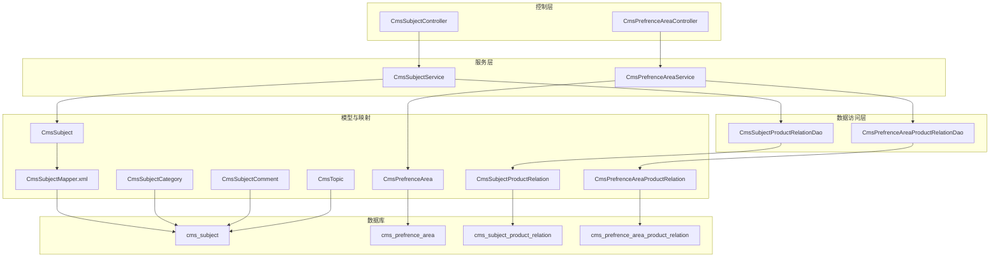
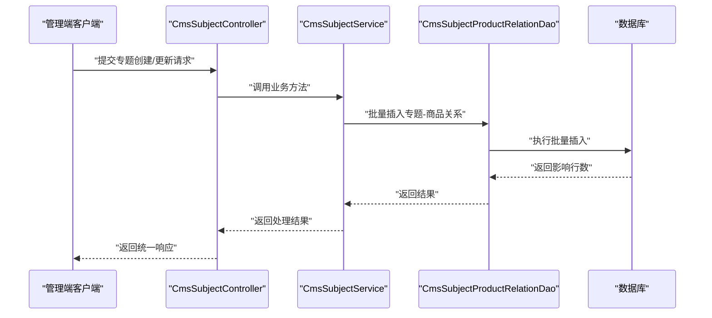
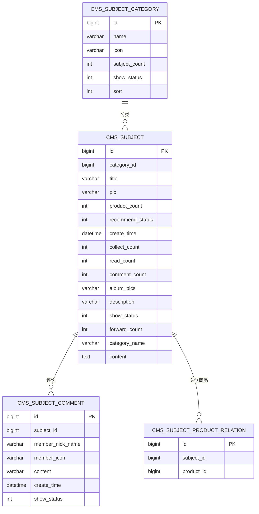
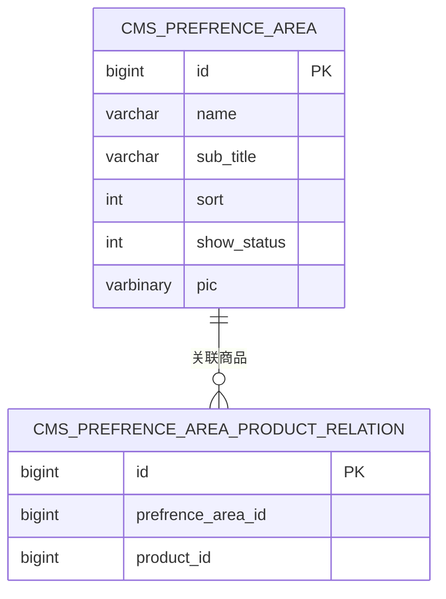
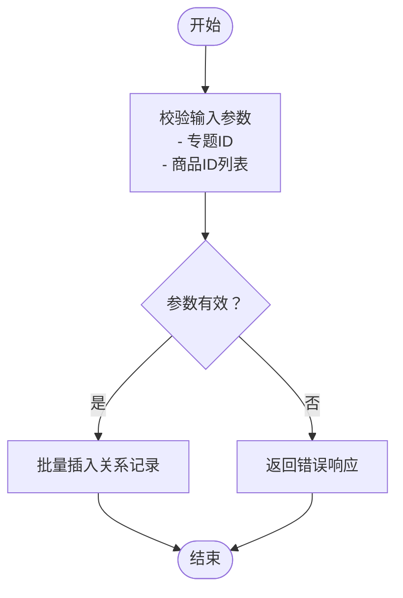
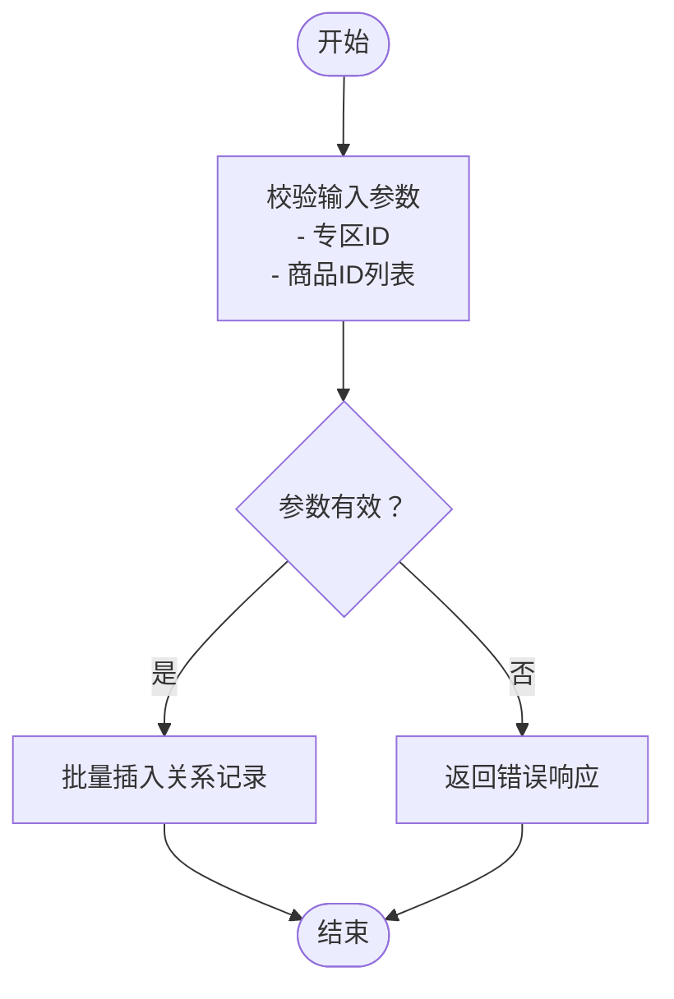
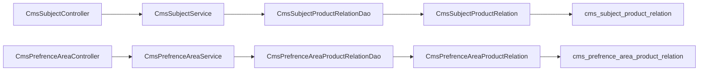

# 内容相关表

<cite>
**本文引用的文件**
- [CmsSubject.java](file://mall-mbg/src/main/java/com/macro/mall/model/CmsSubject.java)
- [CmsPrefrenceArea.java](file://mall-mbg/src/main/java/com/macro/mall/model/CmsPrefrenceArea.java)
- [CmsSubjectProductRelation.java](file://mall-mbg/src/main/java/com/macro/mall/model/CmsSubjectProductRelation.java)
- [CmsPrefrenceAreaProductRelation.java](file://mall-mbg/src/main/java/com/macro/mall/model/CmsPrefrenceAreaProductRelation.java)
- [CmsSubjectCategory.java](file://mall-mbg/src/main/java/com/macro/mall/model/CmsSubjectCategory.java)
- [CmsSubjectComment.java](file://mall-mbg/src/main/java/com/macro/mall/model/CmsSubjectComment.java)
- [CmsTopic.java](file://mall-mbg/src/main/java/com/macro/mall/model/CmsTopic.java)
- [CmsSubjectController.java](file://mall-admin/src/main/java/com/macro/mall/controller/CmsSubjectController.java)
- [CmsPrefrenceAreaController.java](file://mall-admin/src/main/java/com/macro/mall/controller/CmsPrefrenceAreaController.java)
- [CmsSubjectService.java](file://mall-admin/src/main/java/com/macro/mall/service/CmsSubjectService.java)
- [CmsPrefrenceAreaService.java](file://mall-admin/src/main/java/com/macro/mall/service/CmsPrefrenceAreaService.java)
- [CmsSubjectProductRelationDao.java](file://mall-admin/src/main/java/com/macro/mall/dao/CmsSubjectProductRelationDao.java)
- [CmsPrefrenceAreaProductRelationDao.java](file://mall-admin/src/main/java/com/macro/mall/dao/CmsPrefrenceAreaProductRelationDao.java)
- [CmsSubjectMapper.xml](file://mall-mbg/src/main/resources/com/macro/mall/mapper/CmsSubjectMapper.xml)
- [mall.sql](file://document/sql/mall.sql)
</cite>

## 目录
1. [引言](#引言)
2. [项目结构](#项目结构)
3. [核心组件](#核心组件)
4. [架构总览](#架构总览)
5. [详细组件分析](#详细组件分析)
6. [依赖分析](#依赖分析)
7. [性能考虑](#性能考虑)
8. [故障排查指南](#故障排查指南)
9. [结论](#结论)
10. [附录](#附录)

## 引言
本文件聚焦于内容管理系统中的“内容相关表”，围绕以下核心表展开：专题表（CmsSubject）、优选专区表（CmsPrefrenceArea）、专题商品关系表（CmsSubjectProductRelation）、专区商品关系表（CmsPrefrenceAreaProductRelation）。文档将从表结构设计、字段语义、业务流程（创建、编辑、发布、推荐、统计、审核、版本管理等）以及数据支撑与推荐算法的关系进行系统化阐述，并提供面向开发与运维的可视化图示与排障建议。

## 项目结构
内容相关表位于后端模型层（MBG生成的实体类）与持久层（MyBatis Mapper XML）之间，由控制器与服务层协同完成对外接口与业务编排。下图展示了与内容相关表直接相关的模块与文件映射关系：

图表来源
- [CmsSubjectController.java:24-43](file://mall-admin/src/main/java/com/macro/mall/controller/CmsSubjectController.java#L24-L43)
- [CmsPrefrenceAreaController.java:22-32](file://mall-admin/src/main/java/com/macro/mall/controller/CmsPrefrenceAreaController.java#L22-L32)
- [CmsSubjectService.java:11-21](file://mall-admin/src/main/java/com/macro/mall/service/CmsSubjectService.java#L11-L21)
- [CmsPrefrenceAreaService.java:11-16](file://mall-admin/src/main/java/com/macro/mall/service/CmsPrefrenceAreaService.java#L11-L16)
- [CmsSubjectProductRelationDao.java:12-16](file://mall-admin/src/main/java/com/macro/mall/dao/CmsSubjectProductRelationDao.java#L12-L16)
- [CmsPrefrenceAreaProductRelationDao.java:12-16](file://mall-admin/src/main/java/com/macro/mall/dao/CmsPrefrenceAreaProductRelationDao.java#L12-L16)
- [CmsSubject.java:6-39](file://mall-mbg/src/main/java/com/macro/mall/model/CmsSubject.java#L6-L39)
- [CmsPrefrenceArea.java:5-18](file://mall-mbg/src/main/java/com/macro/mall/model/CmsPrefrenceArea.java#L5-L18)
- [CmsSubjectProductRelation.java:5-12](file://mall-mbg/src/main/java/com/macro/mall/model/CmsSubjectProductRelation.java#L5-L12)
- [CmsPrefrenceAreaProductRelation.java:5-12](file://mall-mbg/src/main/java/com/macro/mall/model/CmsPrefrenceAreaProductRelation.java#L5-L12)
- [CmsSubjectMapper.xml:141-153](file://mall-mbg/src/main/resources/com/macro/mall/mapper/CmsSubjectMapper.xml#L141-L153)
- [mall.sql:123-144](file://document/sql/mall.sql#L123-L144)
- [mall.sql:78-89](file://document/sql/mall.sql#L78-L89)
- [mall.sql:196-204](file://document/sql/mall.sql#L196-L204)
- [mall.sql:100-108](file://document/sql/mall.sql#L100-L108)

章节来源
- [CmsSubjectController.java:24-43](file://mall-admin/src/main/java/com/macro/mall/controller/CmsSubjectController.java#L24-L43)
- [CmsPrefrenceAreaController.java:22-32](file://mall-admin/src/main/java/com/macro/mall/controller/CmsPrefrenceAreaController.java#L22-L32)
- [CmsSubjectService.java:11-21](file://mall-admin/src/main/java/com/macro/mall/service/CmsSubjectService.java#L11-L21)
- [CmsPrefrenceAreaService.java:11-16](file://mall-admin/src/main/java/com/macro/mall/service/CmsPrefrenceAreaService.java#L11-L16)
- [CmsSubjectProductRelationDao.java:12-16](file://mall-admin/src/main/java/com/macro/mall/dao/CmsSubjectProductRelationDao.java#L12-L16)
- [CmsPrefrenceAreaProductRelationDao.java:12-16](file://mall-admin/src/main/java/com/macro/mall/dao/CmsPrefrenceAreaProductRelationDao.java#L12-L16)
- [CmsSubject.java:6-39](file://mall-mbg/src/main/java/com/macro/mall/model/CmsSubject.java#L6-L39)
- [CmsPrefrenceArea.java:5-18](file://mall-mbg/src/main/java/com/macro/mall/model/CmsPrefrenceArea.java#L5-L18)
- [CmsSubjectProductRelation.java:5-12](file://mall-mbg/src/main/java/com/macro/mall/model/CmsSubjectProductRelation.java#L5-L12)
- [CmsPrefrenceAreaProductRelation.java:5-12](file://mall-mbg/src/main/java/com/macro/mall/model/CmsPrefrenceAreaProductRelation.java#L5-L12)
- [CmsSubjectMapper.xml:141-153](file://mall-mbg/src/main/resources/com/macro/mall/mapper/CmsSubjectMapper.xml#L141-L153)
- [mall.sql:78-144](file://document/sql/mall.sql#L78-L144)
- [mall.sql:196-222](file://document/sql/mall.sql#L196-L222)

## 核心组件
本节对四大核心表进行逐项解析，明确字段含义、约束与典型用途，并给出与业务流程的对应关系。

- 专题表（CmsSubject）
  - 字段要点：标题、封面图、关联商品数、推荐状态、创建时间、收藏/阅读/评论/转发计数、描述、显示状态、分类名、正文内容等。
  - 作用：承载内容专题的元信息与统计指标，支持内容创建、编辑、发布、推荐、审核与统计分析。
  - 关键字段路径参考：[CmsSubject.java:9-37](file://mall-mbg/src/main/java/com/macro/mall/model/CmsSubject.java#L9-L37)

- 优选专区表（CmsPrefrenceArea）
  - 字段要点：名称、副标题、排序、显示状态、展示图等。
  - 作用：用于运营配置“优选专区”板块，支持专区的上下架与排序管理。
  - 关键字段路径参考：[CmsPrefrenceArea.java:8-16](file://mall-mbg/src/main/java/com/macro/mall/model/CmsPrefrenceArea.java#L8-L16)

- 专题商品关系表（CmsSubjectProductRelation）
  - 字段要点：专题ID、商品ID。
  - 作用：建立专题与商品的多对多关联，支撑专题聚合与内容推荐。
  - 关键字段路径参考：[CmsSubjectProductRelation.java:8-10](file://mall-mbg/src/main/java/com/macro/mall/model/CmsSubjectProductRelation.java#L8-L10)

- 专区商品关系表（CmsPrefrenceAreaProductRelation）
  - 字段要点：专区ID、商品ID。
  - 作用：建立优选专区与商品的多对多关联，支撑专区聚合与内容推荐。
  - 关键字段路径参考：[CmsPrefrenceAreaProductRelation.java:8-10](file://mall-mbg/src/main/java/com/macro/mall/model/CmsPrefrenceAreaProductRelation.java#L8-L10)

章节来源
- [CmsSubject.java:6-39](file://mall-mbg/src/main/java/com/macro/mall/model/CmsSubject.java#L6-L39)
- [CmsPrefrenceArea.java:5-18](file://mall-mbg/src/main/java/com/macro/mall/model/CmsPrefrenceArea.java#L5-L18)
- [CmsSubjectProductRelation.java:5-12](file://mall-mbg/src/main/java/com/macro/mall/model/CmsSubjectProductRelation.java#L5-L12)
- [CmsPrefrenceAreaProductRelation.java:5-12](file://mall-mbg/src/main/java/com/macro/mall/model/CmsPrefrenceAreaProductRelation.java#L5-L12)

## 架构总览
内容相关表在系统中的职责与交互如下：
- 控制器负责接收请求参数并调用服务层。
- 服务层封装业务逻辑，必要时通过DAO批量写入关系表。
- 实体类与Mapper XML负责与数据库表进行映射与持久化。
- 数据库表支撑内容创建、编辑、发布、推荐、统计、审核与版本管理等流程。

图表来源
- [CmsSubjectController.java:28-42](file://mall-admin/src/main/java/com/macro/mall/controller/CmsSubjectController.java#L28-L42)
- [CmsSubjectService.java:11-21](file://mall-admin/src/main/java/com/macro/mall/service/CmsSubjectService.java#L11-L21)
- [CmsSubjectProductRelationDao.java:12-16](file://mall-admin/src/main/java/com/macro/mall/dao/CmsSubjectProductRelationDao.java#L12-L16)
- [mall.sql:196-222](file://document/sql/mall.sql#L196-L222)

## 详细组件分析

### 专题表（CmsSubject）分析
- 表结构与字段
  - 主要字段：标题、封面图、关联商品数、推荐状态、创建时间、收藏/阅读/评论/转发计数、描述、显示状态、分类名、正文内容等。
  - 关系：与专题分类表（CmsSubjectCategory）存在分类维度关联；与专题评论表（CmsSubjectComment）存在评论维度关联；与专题商品关系表（CmsSubjectProductRelation）存在内容与商品的关联维度。
- 业务流程映射
  - 创建/编辑：通过控制器与服务层接收参数，写入专题表与关系表。
  - 发布/审核：通过显示状态字段控制展示；推荐状态字段用于推荐策略。
  - 统计分析：基于收藏/阅读/评论/转发计数进行内容热度分析。
- 关键实现位置
  - 插入语句映射：[CmsSubjectMapper.xml:141-153](file://mall-mbg/src/main/resources/com/macro/mall/mapper/CmsSubjectMapper.xml#L141-L153)
  - 字段定义：[CmsSubject.java:9-37](file://mall-mbg/src/main/java/com/macro/mall/model/CmsSubject.java#L9-L37)

图表来源
- [mall.sql:123-144](file://document/sql/mall.sql#L123-L144)
- [mall.sql:157-168](file://document/sql/mall.sql#L157-L168)
- [mall.sql:177-189](file://document/sql/mall.sql#L177-L189)
- [mall.sql:196-204](file://document/sql/mall.sql#L196-L204)

章节来源
- [CmsSubject.java:6-39](file://mall-mbg/src/main/java/com/macro/mall/model/CmsSubject.java#L6-L39)
- [CmsSubjectMapper.xml:141-153](file://mall-mbg/src/main/resources/com/macro/mall/mapper/CmsSubjectMapper.xml#L141-L153)
- [mall.sql:123-144](file://document/sql/mall.sql#L123-L144)

### 优选专区表（CmsPrefrenceArea）分析
- 表结构与字段
  - 主要字段：名称、副标题、展示图、排序、显示状态。
  - 关系：与专区商品关系表（CmsPrefrenceAreaProductRelation）建立专区与商品的关联。
- 业务流程映射
  - 创建/编辑：设置专区基础信息与展示图。
  - 发布/上下架：通过显示状态控制专区展示。
  - 排序：通过排序字段控制专区列表顺序。
- 关键实现位置
  - 字段定义：[CmsPrefrenceArea.java:8-16](file://mall-mbg/src/main/java/com/macro/mall/model/CmsPrefrenceArea.java#L8-L16)
  - 表结构：[mall.sql:78-89](file://document/sql/mall.sql#L78-L89)

图表来源
- [mall.sql:78-89](file://document/sql/mall.sql#L78-L89)
- [mall.sql:100-108](file://document/sql/mall.sql#L100-L108)

章节来源
- [CmsPrefrenceArea.java:5-18](file://mall-mbg/src/main/java/com/macro/mall/model/CmsPrefrenceArea.java#L5-L18)
- [mall.sql:78-89](file://document/sql/mall.sql#L78-L89)

### 专题商品关系表（CmsSubjectProductRelation）分析
- 表结构与字段
  - 主要字段：专题ID、商品ID。
  - 关系：作为专题与商品的多对多纽带，支撑内容聚合与推荐。
- 业务流程映射
  - 批量写入：通过DAO的批量插入方法维护专题-商品关系。
  - 推荐算法数据支撑：为内容推荐提供候选商品集合。
- 关键实现位置
  - DAO方法：[CmsSubjectProductRelationDao.java:12-16](file://mall-admin/src/main/java/com/macro/mall/dao/CmsSubjectProductRelationDao.java#L12-L16)
  - 表结构：[mall.sql:196-204](file://document/sql/mall.sql#L196-L204)

图表来源
- [CmsSubjectProductRelationDao.java:12-16](file://mall-admin/src/main/java/com/macro/mall/dao/CmsSubjectProductRelationDao.java#L12-L16)
- [mall.sql:196-222](file://document/sql/mall.sql#L196-L222)

章节来源
- [CmsSubjectProductRelationDao.java:12-16](file://mall-admin/src/main/java/com/macro/mall/dao/CmsSubjectProductRelationDao.java#L12-L16)
- [mall.sql:196-222](file://document/sql/mall.sql#L196-L222)

### 专区商品关系表（CmsPrefrenceAreaProductRelation）分析
- 表结构与字段
  - 主要字段：专区ID、商品ID。
  - 关系：作为专区与商品的多对多纽带，支撑专区聚合与推荐。
- 业务流程映射
  - 批量写入：通过DAO的批量插入方法维护专区-商品关系。
  - 推荐算法数据支撑：为专区推荐提供候选商品集合。
- 关键实现位置
  - DAO方法：[CmsPrefrenceAreaProductRelationDao.java:12-16](file://mall-admin/src/main/java/com/macro/mall/dao/CmsPrefrenceAreaProductRelationDao.java#L12-L16)
  - 表结构：[mall.sql:100-108](file://document/sql/mall.sql#L100-L108)

图表来源
- [CmsPrefrenceAreaProductRelationDao.java:12-16](file://mall-admin/src/main/java/com/macro/mall/dao/CmsPrefrenceAreaProductRelationDao.java#L12-L16)
- [mall.sql:100-108](file://document/sql/mall.sql#L100-L108)

章节来源
- [CmsPrefrenceAreaProductRelationDao.java:12-16](file://mall-admin/src/main/java/com/macro/mall/dao/CmsPrefrenceAreaProductRelationDao.java#L12-L16)
- [mall.sql:100-108](file://document/sql/mall.sql#L100-L108)

### 专题分类与评论、话题扩展
- 专题分类表（CmsSubjectCategory）
  - 字段要点：名称、图标、专题数量、显示状态、排序。
  - 作用：为专题提供分类维度，便于内容归档与检索。
  - 表结构参考：[mall.sql:157-168](file://document/sql/mall.sql#L157-L168)

- 专题评论表（CmsSubjectComment）
  - 字段要点：专题ID、会员昵称/头像、内容、创建时间、显示状态。
  - 作用：支撑内容互动与审核。
  - 表结构参考：[mall.sql:177-189](file://document/sql/mall.sql#L177-L189)

- 话题表（CmsTopic）
  - 字段要点：分类ID、名称、起止时间、参与/关注/阅读计数、奖品名称、参与方式、内容。
  - 作用：支撑活动型内容的生命周期管理。
  - 表结构参考：[mall.sql:224-241](file://document/sql/mall.sql#L224-L241)

章节来源
- [mall.sql:157-189](file://document/sql/mall.sql#L157-L189)
- [mall.sql:224-241](file://document/sql/mall.sql#L224-L241)

## 依赖分析
- 控制器依赖服务层接口，服务层依赖DAO接口，DAO接口与实体类共同映射到数据库表。
- 关系表通过外键（逻辑上）与专题表、专区表形成一对多或多对多关系。
- 推荐算法依赖关系表提供的候选集，统计分析依赖专题表中的计数字段。

图表来源
- [CmsSubjectController.java:24-43](file://mall-admin/src/main/java/com/macro/mall/controller/CmsSubjectController.java#L24-L43)
- [CmsPrefrenceAreaController.java:22-32](file://mall-admin/src/main/java/com/macro/mall/controller/CmsPrefrenceAreaController.java#L22-L32)
- [CmsSubjectService.java:11-21](file://mall-admin/src/main/java/com/macro/mall/service/CmsSubjectService.java#L11-L21)
- [CmsPrefrenceAreaService.java:11-16](file://mall-admin/src/main/java/com/macro/mall/service/CmsPrefrenceAreaService.java#L11-L16)
- [CmsSubjectProductRelationDao.java:12-16](file://mall-admin/src/main/java/com/macro/mall/dao/CmsSubjectProductRelationDao.java#L12-L16)
- [CmsPrefrenceAreaProductRelationDao.java:12-16](file://mall-admin/src/main/java/com/macro/mall/dao/CmsPrefrenceAreaProductRelationDao.java#L12-L16)
- [mall.sql:196-222](file://document/sql/mall.sql#L196-L222)
- [mall.sql:100-108](file://document/sql/mall.sql#L100-L108)

章节来源
- [CmsSubjectController.java:24-43](file://mall-admin/src/main/java/com/macro/mall/controller/CmsSubjectController.java#L24-L43)
- [CmsPrefrenceAreaController.java:22-32](file://mall-admin/src/main/java/com/macro/mall/controller/CmsPrefrenceAreaController.java#L22-L32)
- [CmsSubjectService.java:11-21](file://mall-admin/src/main/java/com/macro/mall/service/CmsSubjectService.java#L11-L21)
- [CmsPrefrenceAreaService.java:11-16](file://mall-admin/src/main/java/com/macro/mall/service/CmsPrefrenceAreaService.java#L11-L16)
- [CmsSubjectProductRelationDao.java:12-16](file://mall-admin/src/main/java/com/macro/mall/dao/CmsSubjectProductRelationDao.java#L12-L16)
- [CmsPrefrenceAreaProductRelationDao.java:12-16](file://mall-admin/src/main/java/com/macro/mall/dao/CmsPrefrenceAreaProductRelationDao.java#L12-L16)
- [mall.sql:196-222](file://document/sql/mall.sql#L196-L222)
- [mall.sql:100-108](file://document/sql/mall.sql#L100-L108)

## 性能考虑
- 批量写入优化
  - 关系表采用批量插入（如专题-商品关系、专区-商品关系），可显著降低事务开销与网络往返次数。
  - 建议：在服务层对传入的商品ID列表进行去重与长度限制，避免超大批量一次性写入导致锁竞争。
- 索引与查询
  - 建议在关系表的 subject_id、prefrence_area_id、product_id 上建立合适索引，提升查询效率。
- 缓存策略
  - 对热点专题与专区的聚合结果进行缓存，减少重复计算与数据库压力。
- 写入幂等
  - 批量插入前进行去重处理，避免重复记录导致的统计偏差。

## 故障排查指南
- 常见问题与定位
  - 关系表插入失败：检查DAO方法调用与参数列表，确认传入的专题/专区ID与商品ID均有效。
  - 显示状态异常：核对专题/专区的 show_status 字段是否正确设置。
  - 统计计数不一致：核对专题表中的收藏/阅读/评论/转发计数字段是否按业务规则更新。
- 排查步骤
  - 核对控制器与服务层调用链路，定位失败环节。
  - 查看关系表记录是否存在重复或缺失。
  - 检查专题/专区表的显示状态与排序字段。
- 相关实现位置
  - 控制器：[CmsSubjectController.java:28-42](file://mall-admin/src/main/java/com/macro/mall/controller/CmsSubjectController.java#L28-L42)
  - 服务接口：[CmsSubjectService.java:11-21](file://mall-admin/src/main/java/com/macro/mall/service/CmsSubjectService.java#L11-L21)
  - 关系表DAO：[CmsSubjectProductRelationDao.java:12-16](file://mall-admin/src/main/java/com/macro/mall/dao/CmsSubjectProductRelationDao.java#L12-L16)、[CmsPrefrenceAreaProductRelationDao.java:12-16](file://mall-admin/src/main/java/com/macro/mall/dao/CmsPrefrenceAreaProductRelationDao.java#L12-L16)

章节来源
- [CmsSubjectController.java:28-42](file://mall-admin/src/main/java/com/macro/mall/controller/CmsSubjectController.java#L28-L42)
- [CmsSubjectService.java:11-21](file://mall-admin/src/main/java/com/macro/mall/service/CmsSubjectService.java#L11-L21)
- [CmsSubjectProductRelationDao.java:12-16](file://mall-admin/src/main/java/com/macro/mall/dao/CmsSubjectProductRelationDao.java#L12-L16)
- [CmsPrefrenceAreaProductRelationDao.java:12-16](file://mall-admin/src/main/java/com/macro/mall/dao/CmsPrefrenceAreaProductRelationDao.java#L12-L16)

## 结论
内容相关表围绕“专题”与“专区”两条主线，通过关系表实现内容与商品的灵活关联，支撑内容创建、编辑、发布、推荐、统计与审核等完整流程。结合批量写入、索引优化与缓存策略，可在保证数据一致性的同时提升系统性能与可维护性。建议在实际落地中完善版本管理与审核流程的表结构设计，以满足更复杂的业务演进需求。

## 附录
- 表结构与字段参考
  - 专题表：[mall.sql:123-144](file://document/sql/mall.sql#L123-L144)
  - 优选专区表：[mall.sql:78-89](file://document/sql/mall.sql#L78-L89)
  - 专题商品关系表：[mall.sql:196-204](file://document/sql/mall.sql#L196-L204)
  - 专区商品关系表：[mall.sql:100-108](file://document/sql/mall.sql#L100-L108)
  - 专题分类表：[mall.sql:157-168](file://document/sql/mall.sql#L157-L168)
  - 专题评论表：[mall.sql:177-189](file://document/sql/mall.sql#L177-L189)
  - 话题表：[mall.sql:224-241](file://document/sql/mall.sql#L224-L241)
- 关键实体类
  - 专题：[CmsSubject.java:6-39](file://mall-mbg/src/main/java/com/macro/mall/model/CmsSubject.java#L6-L39)
  - 专区：[CmsPrefrenceArea.java:5-18](file://mall-mbg/src/main/java/com/macro/mall/model/CmsPrefrenceArea.java#L5-L18)
  - 关系：[CmsSubjectProductRelation.java:5-12](file://mall-mbg/src/main/java/com/macro/mall/model/CmsSubjectProductRelation.java#L5-L12)、[CmsPrefrenceAreaProductRelation.java:5-12](file://mall-mbg/src/main/java/com/macro/mall/model/CmsPrefrenceAreaProductRelation.java#L5-L12)
- 关键接口与映射
  - 控制器：[CmsSubjectController.java:24-43](file://mall-admin/src/main/java/com/macro/mall/controller/CmsSubjectController.java#L24-L43)、[CmsPrefrenceAreaController.java:22-32](file://mall-admin/src/main/java/com/macro/mall/controller/CmsPrefrenceAreaController.java#L22-L32)
  - 服务接口：[CmsSubjectService.java:11-21](file://mall-admin/src/main/java/com/macro/mall/service/CmsSubjectService.java#L11-L21)、[CmsPrefrenceAreaService.java:11-16](file://mall-admin/src/main/java/com/macro/mall/service/CmsPrefrenceAreaService.java#L11-L16)
  - DAO接口：[CmsSubjectProductRelationDao.java:12-16](file://mall-admin/src/main/java/com/macro/mall/dao/CmsSubjectProductRelationDao.java#L12-L16)、[CmsPrefrenceAreaProductRelationDao.java:12-16](file://mall-admin/src/main/java/com/macro/mall/dao/CmsPrefrenceAreaProductRelationDao.java#L12-L16)
  - Mapper映射：[CmsSubjectMapper.xml:141-153](file://mall-mbg/src/main/resources/com/macro/mall/mapper/CmsSubjectMapper.xml#L141-L153)