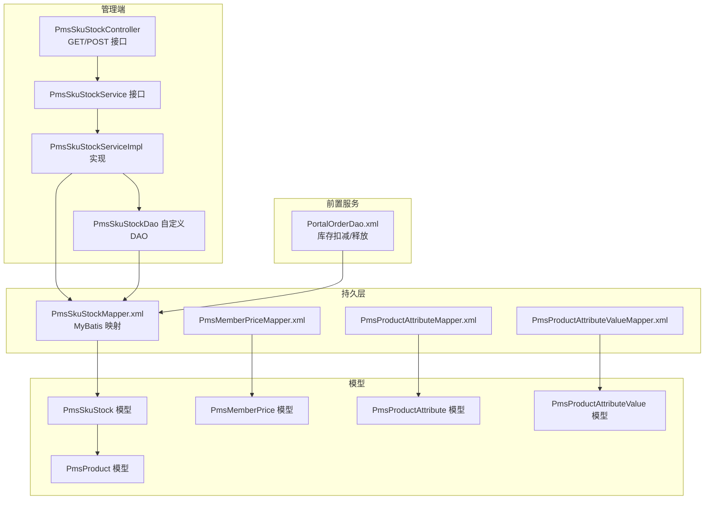
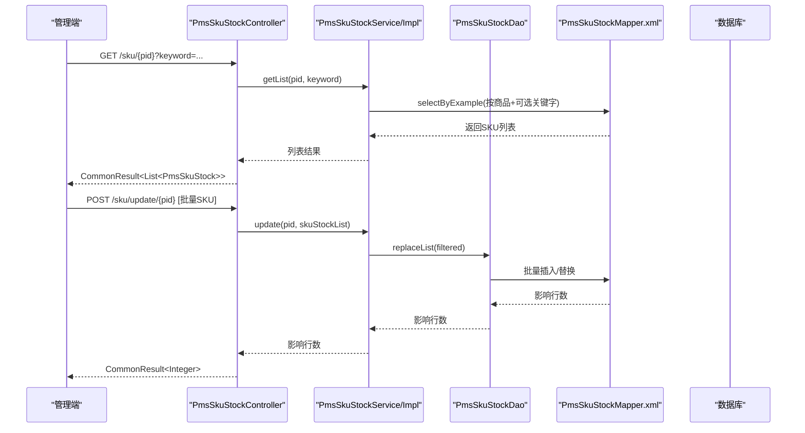
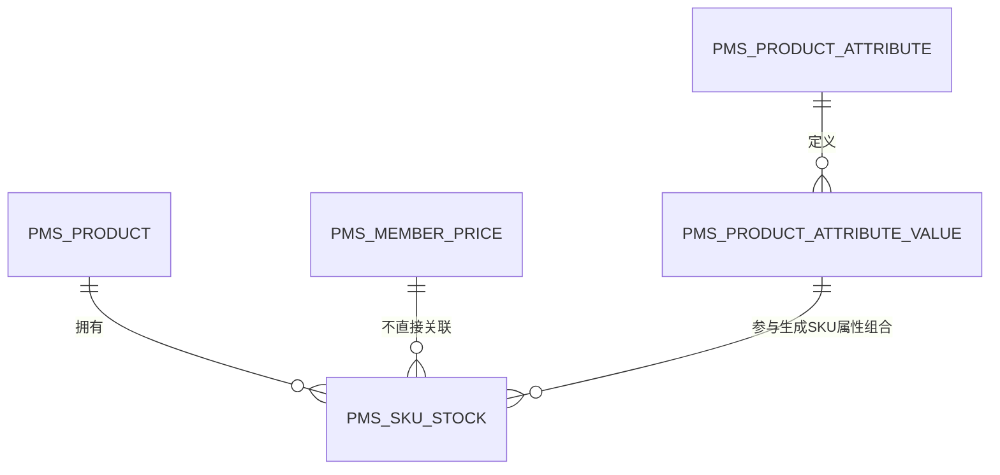
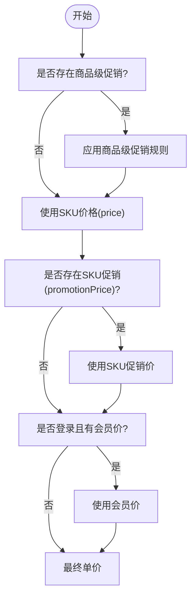
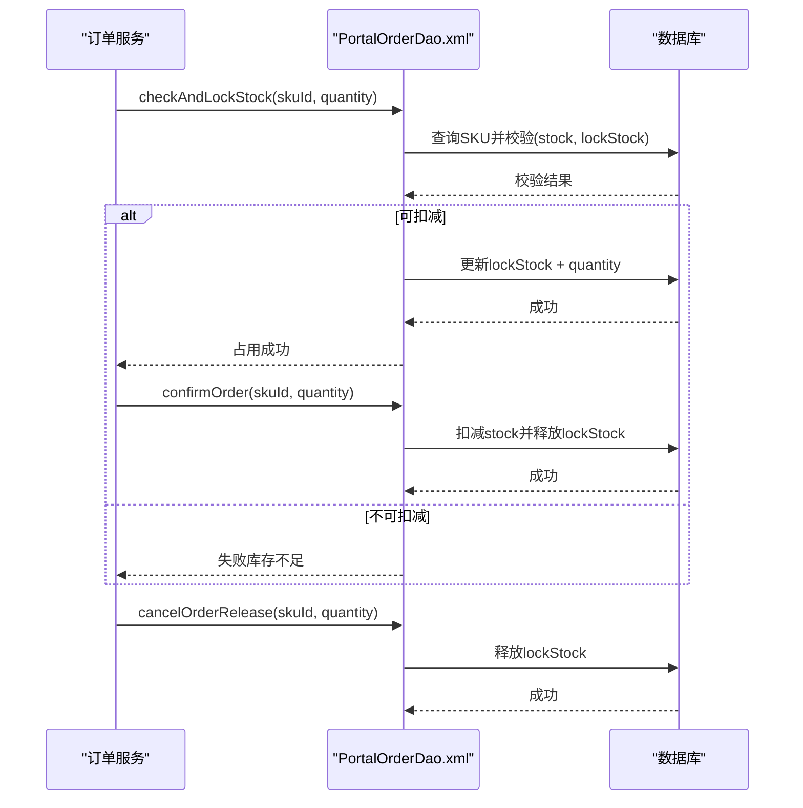
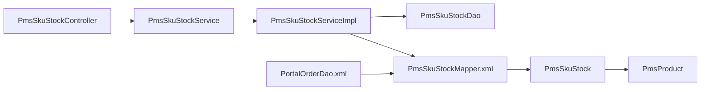

# SKU相关表

<cite>
**本文引用的文件**
- [PmsSkuStock.java](file://mall-mbg/src/main/java/com/macro/mall/model/PmsSkuStock.java)
- [PmsSkuStockMapper.xml](file://mall-mbg/src/main/resources/com/macro/mall/mapper/PmsSkuStockMapper.xml)
- [PmsSkuStockController.java](file://mall-admin/src/main/java/com/macro/mall/controller/PmsSkuStockController.java)
- [PmsSkuStockService.java](file://mall-admin/src/main/java/com/macro/mall/service/PmsSkuStockService.java)
- [PmsSkuStockServiceImpl.java](file://mall-admin/src/main/java/com/macro/mall/service/impl/PmsSkuStockServiceImpl.java)
- [PmsSkuStockDao.java](file://mall-admin/src/main/java/com/macro/mall/dao/PmsSkuStockDao.java)
- [PortalOrderDao.xml](file://mall-portal/src/main/resources/dao/PortalOrderDao.xml)
- [PmsMemberPrice.java](file://mall-mbg/src/main/java/com/macro/mall/model/PmsMemberPrice.java)
- [PmsMemberPriceMapper.xml](file://mall-mbg/src/main/resources/com/macro/mall/mapper/PmsMemberPriceMapper.xml)
- [PmsProduct.java](file://mall-mbg/src/main/java/com/macro/mall/model/PmsProduct.java)
- [PmsProductAttribute.java](file://mall-mbg/src/main/java/com/macro/mall/model/PmsProductAttribute.java)
- [PmsProductAttributeValue.java](file://mall-mbg/src/main/java/com/macro/mall/model/PmsProductAttributeValue.java)
- [PmsProductAttributeMapper.xml](file://mall-mbg/src/main/resources/com/macro/mall/mapper/PmsProductAttributeMapper.xml)
- [PmsProductAttributeValueMapper.xml](file://mall-mbg/src/main/resources/com/macro/mall/mapper/PmsProductAttributeValueMapper.xml)
- [mall.sql](file://document/sql/mall.sql)
</cite>

## 目录
1. [简介](#简介)
2. [项目结构](#项目结构)
3. [核心组件](#核心组件)
4. [架构总览](#架构总览)
5. [详细组件分析](#详细组件分析)
6. [依赖分析](#依赖分析)
7. [性能考虑](#性能考虑)
8. [故障排查指南](#故障排查指南)
9. [结论](#结论)
10. [附录](#附录)

## 简介
本文件聚焦于电商系统中的SKU相关表与业务流程，围绕PmsSkuStock（SKU库存表）展开，系统性阐述以下内容：
- SKU编码与商品的关联关系
- 价格体系：原价、销售价、促销价、成本价、会员价
- 库存管理：初始库存、锁定库存、实际可售库存、低库存预警
- SKU属性组合：属性值、规格参数（spData）
- 多规格商品的SKU生成机制
- 库存扣减与回滚逻辑
- 价格计算、促销叠加、会员价应用等业务规则
- SKU管理的完整流程与实际使用示例

## 项目结构
围绕SKU的核心代码分布在以下模块：
- 数据模型层（MBG）：PmsSkuStock、PmsMemberPrice、PmsProduct、PmsProductAttribute、PmsProductAttributeValue
- 映射层（MyBatis XML）：对应各实体的Mapper XML
- 管理端服务层：PmsSkuStockController、PmsSkuStockService、PmsSkuStockServiceImpl、PmsSkuStockDao
- 前置服务（下单流程）：PortalOrderDao.xml中包含库存扣减与释放逻辑
- 示例数据：document/sql/mall.sql中包含部分SKU样例



**图表来源**
- [PmsSkuStockController.java:1-41](file://mall-admin/src/main/java/com/macro/mall/controller/PmsSkuStockController.java#L1-L41)
- [PmsSkuStockService.java:1-22](file://mall-admin/src/main/java/com/macro/mall/service/PmsSkuStockService.java#L1-L22)
- [PmsSkuStockServiceImpl.java:1-44](file://mall-admin/src/main/java/com/macro/mall/service/impl/PmsSkuStockServiceImpl.java#L1-L44)
- [PmsSkuStockDao.java:1-23](file://mall-admin/src/main/java/com/macro/mall/dao/PmsSkuStockDao.java#L1-L23)
- [PmsSkuStockMapper.xml:1-306](file://mall-mbg/src/main/resources/com/macro/mall/mapper/PmsSkuStockMapper.xml#L1-L306)
- [PmsMemberPriceMapper.xml:1-211](file://mall-mbg/src/main/resources/com/macro/mall/mapper/PmsMemberPriceMapper.xml#L1-L211)
- [PmsProductAttributeMapper.xml:1-323](file://mall-mbg/src/main/resources/com/macro/mall/mapper/PmsProductAttributeMapper.xml#L1-L323)
- [PmsProductAttributeValueMapper.xml:1-196](file://mall-mbg/src/main/resources/com/macro/mall/mapper/PmsProductAttributeValueMapper.xml#L1-L196)
- [PortalOrderDao.xml:95-114](file://mall-portal/src/main/resources/dao/PortalOrderDao.xml#L95-L114)

**章节来源**
- [PmsSkuStockController.java:1-41](file://mall-admin/src/main/java/com/macro/mall/controller/PmsSkuStockController.java#L1-L41)
- [PmsSkuStockService.java:1-22](file://mall-admin/src/main/java/com/macro/mall/service/PmsSkuStockService.java#L1-L22)
- [PmsSkuStockServiceImpl.java:1-44](file://mall-admin/src/main/java/com/macro/mall/service/impl/PmsSkuStockServiceImpl.java#L1-L44)
- [PmsSkuStockDao.java:1-23](file://mall-admin/src/main/java/com/macro/mall/dao/PmsSkuStockDao.java#L1-L23)
- [PmsSkuStockMapper.xml:1-306](file://mall-mbg/src/main/resources/com/macro/mall/mapper/PmsSkuStockMapper.xml#L1-L306)
- [PmsMemberPriceMapper.xml:1-211](file://mall-mbg/src/main/resources/com/macro/mall/mapper/PmsMemberPriceMapper.xml#L1-L211)
- [PmsProductAttributeMapper.xml:1-323](file://mall-mbg/src/main/resources/com/macro/mall/mapper/PmsProductAttributeMapper.xml#L1-L323)
- [PmsProductAttributeValueMapper.xml:1-196](file://mall-mbg/src/main/resources/com/macro/mall/mapper/PmsProductAttributeValueMapper.xml#L1-L196)
- [PortalOrderDao.xml:95-114](file://mall-portal/src/main/resources/dao/PortalOrderDao.xml#L95-L114)

## 核心组件
- PmsSkuStock（SKU库存表）
  - 关键字段：商品ID、SKU编码、价格、库存、低库存阈值、图片、销量、促销价、锁定库存、规格参数JSON
  - spData用于存储SKU的属性组合（如颜色、容量、尺寸、风格等），以JSON数组形式保存
- PmsMemberPrice（会员价格表）
  - 记录不同会员等级对应的会员价
- PmsProduct（商品表）
  - 商品级价格、促销价、库存等基础信息
- PmsProductAttribute / PmsProductAttributeValue（商品属性与属性值）
  - 定义可选属性及具体取值，用于生成SKU属性组合

**章节来源**
- [PmsSkuStock.java:1-140](file://mall-mbg/src/main/java/com/macro/mall/model/PmsSkuStock.java#L1-L140)
- [PmsMemberPrice.java:1-74](file://mall-mbg/src/main/java/com/macro/mall/model/PmsMemberPrice.java#L1-L74)
- [PmsProduct.java:1-482](file://mall-mbg/src/main/java/com/macro/mall/model/PmsProduct.java#L1-L482)
- [PmsProductAttribute.java:1-150](file://mall-mbg/src/main/java/com/macro/mall/model/PmsProductAttribute.java#L1-L150)
- [PmsProductAttributeValue.java:1-62](file://mall-mbg/src/main/java/com/macro/mall/model/PmsProductAttributeValue.java#L1-L62)

## 架构总览
SKU管理在系统中的位置与交互如下：



**图表来源**
- [PmsSkuStockController.java:24-39](file://mall-admin/src/main/java/com/macro/mall/controller/PmsSkuStockController.java#L24-L39)
- [PmsSkuStockService.java:11-21](file://mall-admin/src/main/java/com/macro/mall/service/PmsSkuStockService.java#L11-L21)
- [PmsSkuStockServiceImpl.java:26-42](file://mall-admin/src/main/java/com/macro/mall/service/impl/PmsSkuStockServiceImpl.java#L26-L42)
- [PmsSkuStockDao.java:12-22](file://mall-admin/src/main/java/com/macro/mall/dao/PmsSkuStockDao.java#L12-L22)
- [PmsSkuStockMapper.xml:79-92](file://mall-mbg/src/main/resources/com/macro/mall/mapper/PmsSkuStockMapper.xml#L79-L92)

## 详细组件分析

### PmsSkuStock（SKU库存表）设计与字段说明
- 字段职责
  - 商品ID：与PmsProduct建立一对多关系
  - SKU编码：唯一标识该SKU，便于前端展示与后端匹配
  - 价格：商品销售价；promotionPrice：促销价；二者配合实现促销叠加
  - 库存：stock，初始库存
  - 锁定库存：lockStock，下单时临时占用，待支付完成或超时释放
  - 低库存阈值：lowStock，触发预警
  - 图片：pic，展示用
  - 销量：sale
  - 规格参数：spData，JSON数组，记录属性维度取值
- 业务要点
  - 可售库存 = stock - lockStock
  - 低库存判断：stock <= lowStock
  - spData用于前端渲染“已选择的规格”和后台校验



**图表来源**
- [PmsProduct.java:1-482](file://mall-mbg/src/main/java/com/macro/mall/model/PmsProduct.java#L1-L482)
- [PmsSkuStock.java:1-140](file://mall-mbg/src/main/java/com/macro/mall/model/PmsSkuStock.java#L1-L140)
- [PmsProductAttribute.java:1-150](file://mall-mbg/src/main/java/com/macro/mall/model/PmsProductAttribute.java#L1-L150)
- [PmsProductAttributeValue.java:1-62](file://mall-mbg/src/main/java/com/macro/mall/model/PmsProductAttributeValue.java#L1-L62)

**章节来源**
- [PmsSkuStock.java:11-117](file://mall-mbg/src/main/java/com/macro/mall/model/PmsSkuStock.java#L11-L117)
- [PmsSkuStockMapper.xml:4-16](file://mall-mbg/src/main/resources/com/macro/mall/mapper/PmsSkuStockMapper.xml#L4-L16)
- [mall.sql:1692-1746](file://document/sql/mall.sql#L1692-L1746)

### 价格体系与业务规则
- 价格字段
  - price：SKU销售价
  - promotionPrice：SKU促销价（若为空则不启用）
  - PmsMemberPrice：按会员等级设置的会员价（独立表）
  - PmsProduct：商品级价格与促销配置
- 价格应用顺序建议
  1) 若存在SKU促销价（promotionPrice），优先使用SKU促销价
  2) 否则使用SKU销售价（price）
  3) 结合会员等级，若存在会员价，则会员价覆盖SKU价格
  4) 促销活动叠加策略由业务决定（如满减、折扣、限时购等），可在下单时统一计算
- 价格计算流程示意



**图表来源**
- [PmsProduct.java:38-88](file://mall-mbg/src/main/java/com/macro/mall/model/PmsProduct.java#L38-L88)
- [PmsSkuStock.java:13-23](file://mall-mbg/src/main/java/com/macro/mall/model/PmsSkuStock.java#L13-L23)
- [PmsMemberPrice.java:6-17](file://mall-mbg/src/main/java/com/macro/mall/model/PmsMemberPrice.java#L6-L17)

**章节来源**
- [PmsProduct.java:38-88](file://mall-mbg/src/main/java/com/macro/mall/model/PmsProduct.java#L38-L88)
- [PmsSkuStock.java:13-23](file://mall-mbg/src/main/java/com/macro/mall/model/PmsSkuStock.java#L13-L23)
- [PmsMemberPrice.java:6-17](file://mall-mbg/src/main/java/com/macro/mall/model/PmsMemberPrice.java#L6-L17)

### 库存管理与SKU属性组合
- 库存字段
  - stock：初始库存
  - lockStock：锁定库存（下单占用）
  - 可售库存 = stock - lockStock
  - lowStock：低库存阈值
- 属性组合
  - spData：JSON数组，记录每个SKU的属性维度取值（如颜色、容量、尺寸、风格）
  - 属性定义与取值分别由PmsProductAttribute与PmsProductAttributeValue维护
- 多规格SKU生成机制
  - 基于商品的属性维度（如颜色、容量、尺寸、风格），通过笛卡尔积生成所有SKU组合
  - 每个SKU生成对应的SKU编码、初始库存、默认图片、spData等
  - 示例数据可见mall.sql中的INSERT片段

```mermaid
classDiagram
class PmsSkuStock {
+id
+productId
+skuCode
+price
+stock
+lowStock
+pic
+sale
+promotionPrice
+lockStock
+spData
}
class PmsProductAttribute {
+id
+productAttributeCategoryId
+name
+inputType
+inputList
}
class PmsProductAttributeValue {
+id
+productId
+productAttributeId
+value
}
class PmsProduct {
+id
+price
+promotionPrice
+stock
}
PmsProduct "1" --o{ "n" PmsSkuStock : "拥有"
PmsProductAttribute "1" --o{ "n" PmsProductAttributeValue : "定义"
PmsProductAttributeValue "n" --o{ "n" PmsSkuStock : "参与组合"
```

**图表来源**
- [PmsSkuStock.java:6-29](file://mall-mbg/src/main/java/com/macro/mall/model/PmsSkuStock.java#L6-L29)
- [PmsProductAttribute.java:5-30](file://mall-mbg/src/main/java/com/macro/mall/model/PmsProductAttribute.java#L5-L30)
- [PmsProductAttributeValue.java:5-14](file://mall-mbg/src/main/java/com/macro/mall/model/PmsProductAttributeValue.java#L5-L14)
- [PmsProduct.java:7-92](file://mall-mbg/src/main/java/com/macro/mall/model/PmsProduct.java#L7-L92)

**章节来源**
- [PmsSkuStock.java:15-27](file://mall-mbg/src/main/java/com/macro/mall/model/PmsSkuStock.java#L15-L27)
- [PmsProductAttribute.java:8-28](file://mall-mbg/src/main/java/com/macro/mall/model/PmsProductAttribute.java#L8-L28)
- [PmsProductAttributeValue.java:8-12](file://mall-mbg/src/main/java/com/macro/mall/model/PmsProductAttributeValue.java#L8-L12)
- [mall.sql:1692-1746](file://document/sql/mall.sql#L1692-L1746)

### 库存扣减与回滚逻辑
- 扣减流程
  - 下单时先检查：stock - quantity >= 0 且 lockStock + quantity <= stock
  - 成功后执行：lockStock = lockStock + quantity；同时记录订单占用
  - 支付成功：执行扣减，stock = stock - quantity；lockStock = lockStock - quantity
  - 支付失败或超时：释放锁定库存，lockStock = lockStock - quantity
- 回滚条件
  - 当quantity导致stock或lockStock越界时拒绝扣减
  - 释放时需确保lockStock非负



**图表来源**
- [PortalOrderDao.xml:95-114](file://mall-portal/src/main/resources/dao/PortalOrderDao.xml#L95-L114)

**章节来源**
- [PortalOrderDao.xml:95-114](file://mall-portal/src/main/resources/dao/PortalOrderDao.xml#L95-L114)

### SKU管理完整流程与使用示例
- 管理端接口
  - 获取SKU列表：GET /sku/{pid}?keyword=...
  - 批量更新SKU：POST /sku/update/{pid}，传入SKU列表，内部会过滤仅属于该商品的SKU并进行批量插入/替换
- 使用示例（基于示例数据）
  - 商品ID为26的iPhone 14系列，存在多个SKU（不同颜色+容量），spData记录了颜色与容量组合
  - 商品ID为36的某品牌服饰，存在颜色、尺寸、风格三维度组合，共生成多个SKU
  - 商品ID为37/38的平板产品，SKU包含颜色与容量组合
- 建议实践
  - 在商品发布时，先定义属性维度与取值，再生成SKU并初始化stock
  - 对促销活动，优先在SKU层面设置promotionPrice，避免影响其他SKU
  - 会员价建议按会员等级单独维护，便于灵活调整

**章节来源**
- [PmsSkuStockController.java:24-39](file://mall-admin/src/main/java/com/macro/mall/controller/PmsSkuStockController.java#L24-L39)
- [PmsSkuStockService.java:11-21](file://mall-admin/src/main/java/com/macro/mall/service/PmsSkuStockService.java#L11-L21)
- [PmsSkuStockServiceImpl.java:26-42](file://mall-admin/src/main/java/com/macro/mall/service/impl/PmsSkuStockServiceImpl.java#L26-L42)
- [mall.sql:1692-1746](file://document/sql/mall.sql#L1692-L1746)

## 依赖分析
- 控制器到服务层：PmsSkuStockController依赖PmsSkuStockService接口
- 服务层到DAO与Mapper：PmsSkuStockServiceImpl依赖PmsSkuStockDao与PmsSkuStockMapper
- DAO到Mapper：PmsSkuStockDao通过MyBatis执行批量插入/替换
- 前置服务对库存的依赖：PortalOrderDao.xml直接操作pms_sku_stock表的库存字段
- 模型间关系：PmsSkuStock与PmsProduct为一对多；属性维度与取值支撑SKU组合



**图表来源**
- [PmsSkuStockController.java:1-41](file://mall-admin/src/main/java/com/macro/mall/controller/PmsSkuStockController.java#L1-L41)
- [PmsSkuStockService.java:1-22](file://mall-admin/src/main/java/com/macro/mall/service/PmsSkuStockService.java#L1-L22)
- [PmsSkuStockServiceImpl.java:1-44](file://mall-admin/src/main/java/com/macro/mall/service/impl/PmsSkuStockServiceImpl.java#L1-L44)
- [PmsSkuStockDao.java:1-23](file://mall-admin/src/main/java/com/macro/mall/dao/PmsSkuStockDao.java#L1-L23)
- [PmsSkuStockMapper.xml:1-306](file://mall-mbg/src/main/resources/com/macro/mall/mapper/PmsSkuStockMapper.xml#L1-L306)
- [PortalOrderDao.xml:95-114](file://mall-portal/src/main/resources/dao/PortalOrderDao.xml#L95-L114)

**章节来源**
- [PmsSkuStockController.java:1-41](file://mall-admin/src/main/java/com/macro/mall/controller/PmsSkuStockController.java#L1-L41)
- [PmsSkuStockServiceImpl.java:1-44](file://mall-admin/src/main/java/com/macro/mall/service/impl/PmsSkuStockServiceImpl.java#L1-L44)
- [PortalOrderDao.xml:95-114](file://mall-portal/src/main/resources/dao/PortalOrderDao.xml#L95-L114)

## 性能考虑
- 批量更新：使用replaceList减少多次往返，提升SKU导入效率
- 查询优化：按productId与可选skuCode关键字查询，避免全表扫描
- 库存校验：在数据库层通过条件约束保证扣减安全，减少重复校验
- JSON字段：spData为字符串存储，避免复杂JOIN，但需注意前端解析与校验

## 故障排查指南
- 库存不足
  - 现象：下单失败或提示库存不足
  - 排查：确认stock与lockStock之差是否满足购买数量；检查lowStock阈值是否误触发
- 扣减异常
  - 现象：支付完成后库存未扣减或释放失败
  - 排查：核对confirmOrder与cancelOrderRelease调用链；检查数据库事务与锁
- 价格异常
  - 现象：显示价格与预期不符
  - 排查：确认promotionPrice优先级、会员价是否生效、商品级促销是否正确应用
- 属性组合错误
  - 现象：SKU属性显示不正确
  - 排查：检查spData格式与属性维度取值是否一致；核对属性定义与取值映射

**章节来源**
- [PortalOrderDao.xml:95-114](file://mall-portal/src/main/resources/dao/PortalOrderDao.xml#L95-L114)
- [PmsSkuStockServiceImpl.java:36-42](file://mall-admin/src/main/java/com/macro/mall/service/impl/PmsSkuStockServiceImpl.java#L36-L42)

## 结论
SKU是电商系统中最核心的数据结构之一。通过对PmsSkuStock的字段设计、与商品及属性的关系、价格体系与库存管理策略的梳理，可以构建出稳定可靠的SKU管理体系。结合管理端的批量维护能力与前置服务的库存扣减/释放逻辑，能够满足多规格商品的精细化运营需求。

## 附录
- 示例数据参考：mall.sql中pms_sku_stock的INSERT片段，展示了多SKU场景下的spData与库存初始化方式
- 会员价参考：PmsMemberPrice表结构，支持按会员等级差异化定价

**章节来源**
- [mall.sql:1692-1746](file://document/sql/mall.sql#L1692-L1746)
- [PmsMemberPrice.java:6-17](file://mall-mbg/src/main/java/com/macro/mall/model/PmsMemberPrice.java#L6-L17)