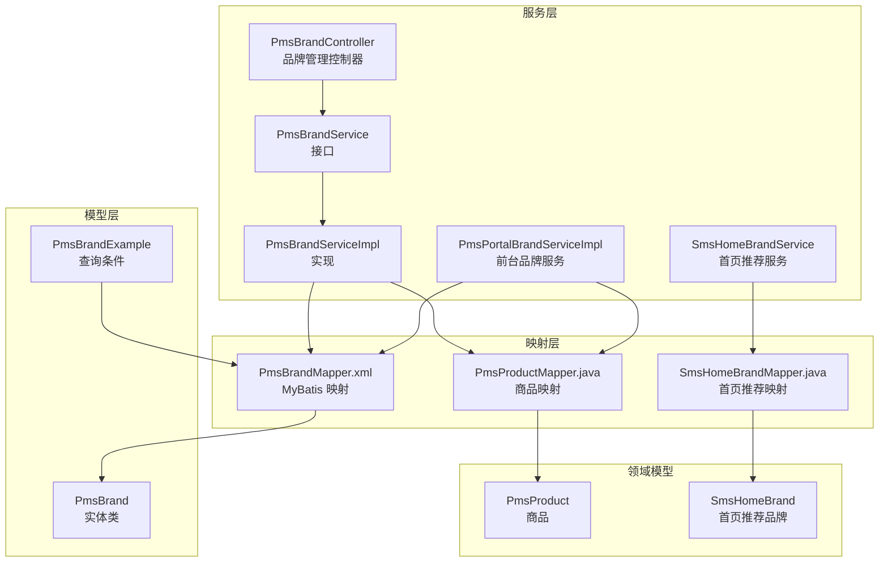
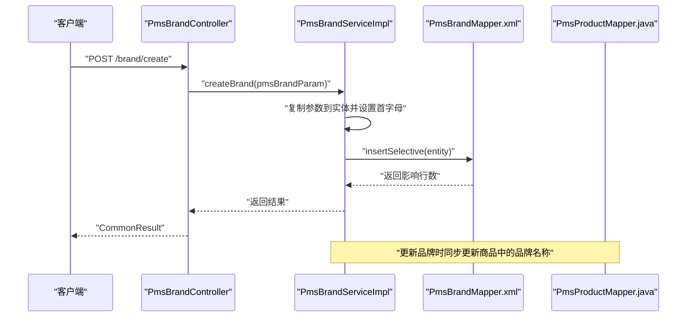
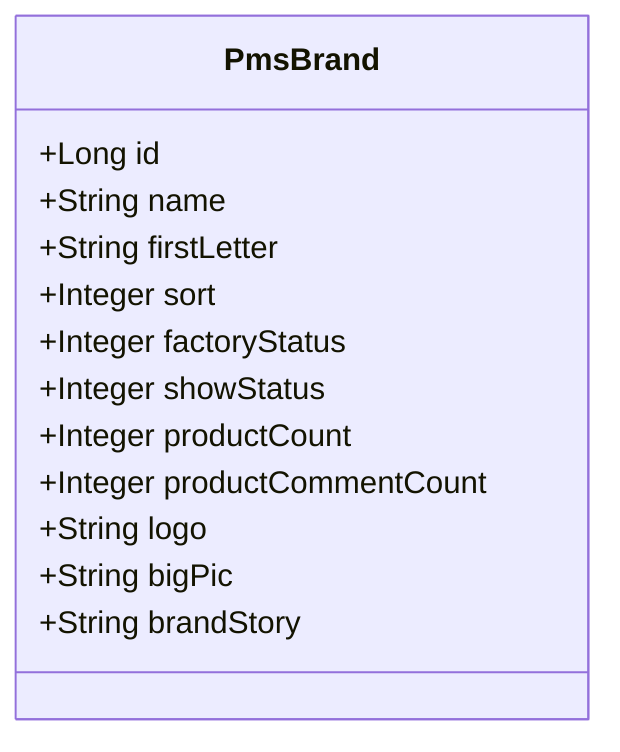
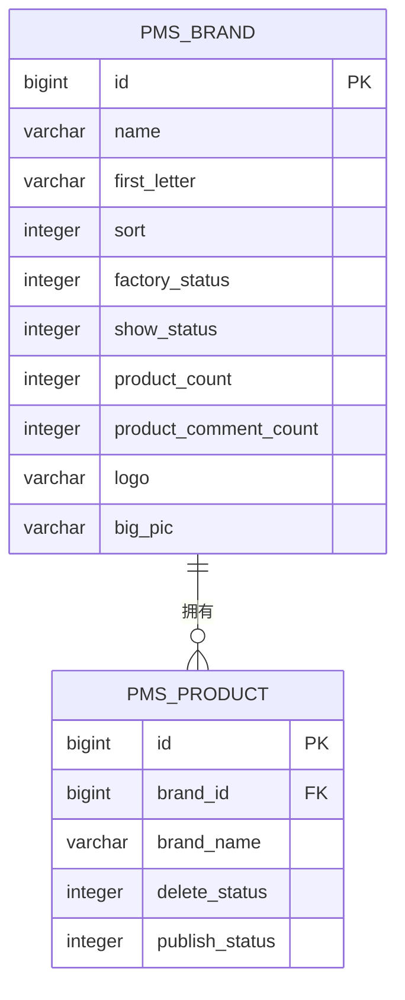
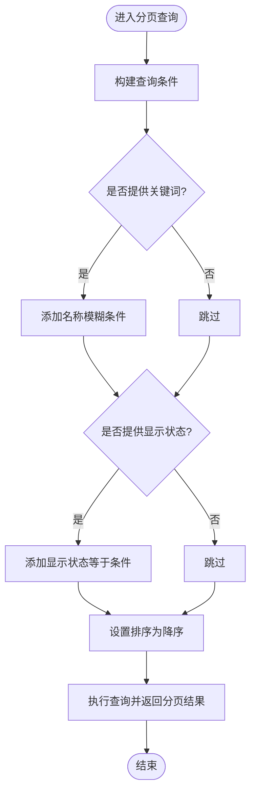
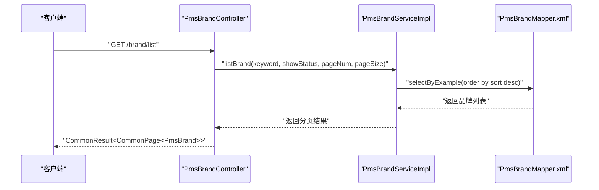
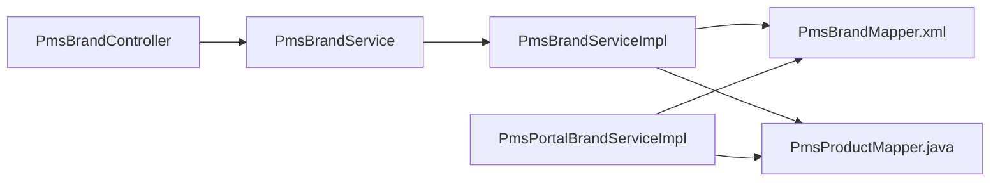

# 品牌表 (PmsBrand)

<cite>
**本文档引用的文件**
- [PmsBrand.java](file://mall-mbg/src/main/java/com/macro/mall/model/PmsBrand.java)
- [PmsBrandMapper.xml](file://mall-mbg/src/main/resources/com/macro/mall/mapper/PmsBrandMapper.xml)
- [PmsBrandExample.java](file://mall-mbg/src/main/java/com/macro/mall/model/PmsBrandExample.java)
- [PmsBrandController.java](file://mall-admin/src/main/java/com/macro/mall/controller/PmsBrandController.java)
- [PmsBrandService.java](file://mall-admin/src/main/java/com/macro/mall/service/PmsBrandService.java)
- [PmsBrandServiceImpl.java](file://mall-admin/src/main/java/com/macro/mall/service/impl/PmsBrandServiceImpl.java)
- [PmsBrandParam.java](file://mall-admin/src/main/java/com/macro/mall/dto/PmsBrandParam.java)
- [PmsPortalBrandServiceImpl.java](file://mall-portal/src/main/java/com/macro/mall/portal/service/impl/PmsPortalBrandServiceImpl.java)
- [PmsProductMapper.java](file://mall-mbg/src/main/java/com/macro/mall/mapper/PmsProductMapper.java)
- [SmsHomeBrand.java](file://mall-mbg/src/main/java/com/macro/mall/model/SmsHomeBrand.java)
- [SmsHomeBrandMapper.java](file://mall-mbg/src/main/java/com/macro/mall/mapper/SmsHomeBrandMapper.java)
- [SmsHomeBrandService.java](file://mall-admin/src/main/java/com/macro/mall/service/SmsHomeBrandService.java)
- [SmsHomeBrandServiceImpl.java](file://mall-admin/src/main/java/com/macro/mall/service/impl/SmsHomeBrandServiceImpl.java)
- [mall.sql](file://document/sql/mall.sql)
</cite>

## 目录
1. [简介](#简介)
2. [项目结构](#项目结构)
3. [核心组件](#核心组件)
4. [架构总览](#架构总览)
5. [详细组件分析](#详细组件分析)
6. [依赖关系分析](#依赖关系分析)
7. [性能考虑](#性能考虑)
8. [故障排查指南](#故障排查指南)
9. [结论](#结论)
10. [附录](#附录)

## 简介
本文件围绕 PmsBrand 品牌表进行系统化文档整理，覆盖以下方面：
- 品牌基本信息字段（名称、首字母、品牌故事、品牌介绍等）
- 品牌展示字段（品牌logo、品牌图片、排序等）
- 品牌状态字段（显示状态、删除标记等）
- 品牌与商品的关联关系、品牌在商品分类中的作用
- 品牌搜索和筛选功能的实现
- 品牌管理的增删改查操作、品牌图片处理、SEO优化等相关业务逻辑
- 品牌数据结构说明和实际应用场景示例

## 项目结构
PmsBrand 表在项目中涉及三层映射与多模块协作：
- 模型层：实体类 PmsBrand 及其 Example 查询条件类
- 映射层：MyBatis XML 映射文件，定义 CRUD 与条件查询
- 服务层：品牌管理控制器、服务接口与实现，前台品牌服务
- 关联模块：商品表、首页推荐品牌表等

**图表来源**
- [PmsBrand.java:1-139](file://mall-mbg/src/main/java/com/macro/mall/model/PmsBrand.java#L1-L139)
- [PmsBrandMapper.xml:1-358](file://mall-mbg/src/main/resources/com/macro/mall/mapper/PmsBrandMapper.xml#L1-L358)
- [PmsBrandController.java:1-122](file://mall-admin/src/main/java/com/macro/mall/controller/PmsBrandController.java#L1-L122)
- [PmsBrandServiceImpl.java:1-114](file://mall-admin/src/main/java/com/macro/mall/service/impl/PmsBrandServiceImpl.java#L1-L114)
- [PmsPortalBrandServiceImpl.java:1-52](file://mall-portal/src/main/java/com/macro/mall/portal/service/impl/PmsPortalBrandServiceImpl.java#L1-L52)
- [PmsProductMapper.java:1-36](file://mall-mbg/src/main/java/com/macro/mall/mapper/PmsProductMapper.java#L1-L36)
- [SmsHomeBrandMapper.java:1-30](file://mall-mbg/src/main/java/com/macro/mall/mapper/SmsHomeBrandMapper.java#L1-L30)

**章节来源**
- [PmsBrand.java:1-139](file://mall-mbg/src/main/java/com/macro/mall/model/PmsBrand.java#L1-L139)
- [PmsBrandMapper.xml:1-358](file://mall-mbg/src/main/resources/com/macro/mall/mapper/PmsBrandMapper.xml#L1-L358)
- [PmsBrandController.java:1-122](file://mall-admin/src/main/java/com/macro/mall/controller/PmsBrandController.java#L1-L122)
- [PmsBrandServiceImpl.java:1-114](file://mall-admin/src/main/java/com/macro/mall/service/impl/PmsBrandServiceImpl.java#L1-L114)
- [PmsPortalBrandServiceImpl.java:1-52](file://mall-portal/src/main/java/com/macro/mall/portal/service/impl/PmsPortalBrandServiceImpl.java#L1-L52)
- [PmsProductMapper.java:1-36](file://mall-mbg/src/main/java/com/macro/mall/mapper/PmsProductMapper.java#L1-L36)
- [SmsHomeBrandMapper.java:1-30](file://mall-mbg/src/main/java/com/macro/mall/mapper/SmsHomeBrandMapper.java#L1-L30)

## 核心组件
- 实体类 PmsBrand：承载品牌基本信息、展示信息、状态字段及品牌故事
- 映射文件 PmsBrandMapper.xml：定义品牌表的查询、插入、更新、删除语句，含 BLOB 字段映射
- 控制器 PmsBrandController：提供品牌列表、分页查询、新增、修改、删除、批量操作、状态切换等接口
- 服务层 PmsBrandService/PmsBrandServiceImpl：封装业务逻辑，包括首字母默认值处理、品牌名同步到商品、分页与筛选
- 前台服务 PmsPortalBrandServiceImpl：提供前台品牌详情、品牌下商品列表、推荐品牌列表
- 关联映射：PmsProductMapper（商品）与 SmsHomeBrandMapper（首页推荐）

**章节来源**
- [PmsBrand.java:1-139](file://mall-mbg/src/main/java/com/macro/mall/model/PmsBrand.java#L1-L139)
- [PmsBrandMapper.xml:1-358](file://mall-mbg/src/main/resources/com/macro/mall/mapper/PmsBrandMapper.xml#L1-L358)
- [PmsBrandController.java:1-122](file://mall-admin/src/main/java/com/macro/mall/controller/PmsBrandController.java#L1-L122)
- [PmsBrandService.java:1-60](file://mall-admin/src/main/java/com/macro/mall/service/PmsBrandService.java#L1-L60)
- [PmsBrandServiceImpl.java:1-114](file://mall-admin/src/main/java/com/macro/mall/service/impl/PmsBrandServiceImpl.java#L1-L114)
- [PmsPortalBrandServiceImpl.java:1-52](file://mall-portal/src/main/java/com/macro/mall/portal/service/impl/PmsPortalBrandServiceImpl.java#L1-L52)
- [PmsProductMapper.java:1-36](file://mall-mbg/src/main/java/com/macro/mall/mapper/PmsProductMapper.java#L1-L36)
- [SmsHomeBrandMapper.java:1-30](file://mall-mbg/src/main/java/com/macro/mall/mapper/SmsHomeBrandMapper.java#L1-L30)

## 架构总览
品牌管理采用典型的分层架构：
- 表现层：PmsBrandController 提供 REST 接口
- 业务层：PmsBrandService 抽象业务能力，PmsBrandServiceImpl 实现具体逻辑
- 数据访问层：MyBatis 映射文件与 Mapper 接口
- 领域模型：PmsBrand、PmsProduct、SmsHomeBrand

**图表来源**
- [PmsBrandController.java:33-44](file://mall-admin/src/main/java/com/macro/mall/controller/PmsBrandController.java#L33-L44)
- [PmsBrandServiceImpl.java:36-62](file://mall-admin/src/main/java/com/macro/mall/service/impl/PmsBrandServiceImpl.java#L36-L62)
- [PmsBrandMapper.xml:145-214](file://mall-mbg/src/main/resources/com/macro/mall/mapper/PmsBrandMapper.xml#L145-L214)
- [PmsProductMapper.java:1-36](file://mall-mbg/src/main/java/com/macro/mall/mapper/PmsProductMapper.java#L1-L36)

## 详细组件分析

### 数据模型与字段说明
- 基本信息字段
  - 名称：品牌名称
  - 首字母：用于索引与排序的首字母，默认在创建时由名称首字符填充
  - 排序：整型排序字段，支持降序排列
- 展示字段
  - logo：品牌小图链接
  - bigPic：品牌大图或横幅图链接
  - 品牌故事：品牌介绍，使用 LONGVARCHAR 存储
- 状态字段
  - 工厂状态：是否为品牌制造商（0/1）
  - 显示状态：前端展示状态（0/1）
  - 产品数量、产品评论数量：统计字段
- 删除标记：实体类未显式声明删除字段，通常通过商品表的删除状态字段配合使用

**图表来源**
- [PmsBrand.java:5-116](file://mall-mbg/src/main/java/com/macro/mall/model/PmsBrand.java#L5-L116)

**章节来源**
- [PmsBrand.java:1-139](file://mall-mbg/src/main/java/com/macro/mall/model/PmsBrand.java#L1-L139)
- [PmsBrandMapper.xml:4-18](file://mall-mbg/src/main/resources/com/macro/mall/mapper/PmsBrandMapper.xml#L4-L18)

### 品牌与商品的关联关系
- 品牌与商品存在一对多关系：一个品牌可对应多个商品
- 更新品牌名称时，会同步更新商品表中的品牌名称，确保一致性
- 前台查询品牌下的商品时，按发布状态与删除状态过滤

**图表来源**
- [PmsBrand.java:5-116](file://mall-mbg/src/main/java/com/macro/mall/model/PmsBrand.java#L5-L116)
- [PmsProductMapper.java:1-36](file://mall-mbg/src/main/java/com/macro/mall/mapper/PmsProductMapper.java#L1-L36)
- [PmsBrandServiceImpl.java:55-61](file://mall-admin/src/main/java/com/macro/mall/service/impl/PmsBrandServiceImpl.java#L55-L61)

**章节来源**
- [PmsBrandServiceImpl.java:55-61](file://mall-admin/src/main/java/com/macro/mall/service/impl/PmsBrandServiceImpl.java#L55-L61)
- [PmsPortalBrandServiceImpl.java:42-50](file://mall-portal/src/main/java/com/macro/mall/portal/service/impl/PmsPortalBrandServiceImpl.java#L42-L50)

### 品牌搜索与筛选
- 支持关键词模糊匹配（名称 LIKE %keyword%）
- 支持显示状态精确筛选
- 默认按排序字段降序排列
- 使用 PageHelper 进行分页

**图表来源**
- [PmsBrandServiceImpl.java:77-89](file://mall-admin/src/main/java/com/macro/mall/service/impl/PmsBrandServiceImpl.java#L77-L89)

**章节来源**
- [PmsBrandServiceImpl.java:77-89](file://mall-admin/src/main/java/com/macro/mall/service/impl/PmsBrandServiceImpl.java#L77-L89)

### 品牌管理的增删改查
- 新增：接收 PmsBrandParam，复制到 PmsBrand 并设置首字母，调用 insertSelective
- 修改：复制参数到实体，设置 ID，若首字母为空则以名称首字符填充，同时更新商品中的品牌名称，再更新品牌
- 删除：支持单个删除与批量删除
- 查询：支持全量列表、分页列表、详情查询、批量状态更新（显示状态、工厂状态）

**图表来源**
- [PmsBrandController.java:71-79](file://mall-admin/src/main/java/com/macro/mall/controller/PmsBrandController.java#L71-L79)
- [PmsBrandServiceImpl.java:77-89](file://mall-admin/src/main/java/com/macro/mall/service/impl/PmsBrandServiceImpl.java#L77-L89)
- [PmsBrandMapper.xml:100-113](file://mall-mbg/src/main/resources/com/macro/mall/mapper/PmsBrandMapper.xml#L100-L113)

**章节来源**
- [PmsBrandController.java:27-121](file://mall-admin/src/main/java/com/macro/mall/controller/PmsBrandController.java#L27-L121)
- [PmsBrandServiceImpl.java:30-112](file://mall-admin/src/main/java/com/macro/mall/service/impl/PmsBrandServiceImpl.java#L30-L112)

### 品牌图片处理与 SEO 优化
- 图片字段：logo、bigPic 用于品牌展示
- 建议策略
  - 图片上传：结合对象存储（如 OSS/MinIO），返回可访问 URL
  - SEO 优化：品牌详情页应包含品牌名称、首字母、品牌故事等信息，便于搜索引擎抓取
  - 性能优化：对图片进行压缩与懒加载，减少首屏加载时间

[本节为通用实践建议，不直接分析具体文件]

### 品牌在商品分类中的作用
- 品牌作为商品的重要属性之一，常用于商品筛选与聚合
- 前台可通过品牌维度查看商品列表，并结合分类树进行组合筛选
- 首页推荐品牌（SmsHomeBrand）可与 PmsBrand 关联，提升曝光度

**章节来源**
- [SmsHomeBrand.java:1-73](file://mall-mbg/src/main/java/com/macro/mall/model/SmsHomeBrand.java#L1-L73)
- [SmsHomeBrandMapper.java:1-30](file://mall-mbg/src/main/java/com/macro/mall/mapper/SmsHomeBrandMapper.java#L1-L30)
- [SmsHomeBrandService.java:1-38](file://mall-admin/src/main/java/com/macro/mall/service/SmsHomeBrandService.java#L1-L38)
- [SmsHomeBrandServiceImpl.java:47-70](file://mall-admin/src/main/java/com/macro/mall/service/impl/SmsHomeBrandServiceImpl.java#L47-L70)

## 依赖关系分析
- 控制器依赖服务接口
- 服务实现依赖 Mapper 与商品 Mapper
- 映射文件依赖实体类与 Example 条件类
- 前台服务依赖品牌 Mapper 与商品 Mapper

**图表来源**
- [PmsBrandController.java:24-25](file://mall-admin/src/main/java/com/macro/mall/controller/PmsBrandController.java#L24-L25)
- [PmsBrandServiceImpl.java:25-28](file://mall-admin/src/main/java/com/macro/mall/service/impl/PmsBrandServiceImpl.java#L25-L28)
- [PmsPortalBrandServiceImpl.java:23-28](file://mall-portal/src/main/java/com/macro/mall/portal/service/impl/PmsPortalBrandServiceImpl.java#L23-L28)

**章节来源**
- [PmsBrandController.java:1-122](file://mall-admin/src/main/java/com/macro/mall/controller/PmsBrandController.java#L1-L122)
- [PmsBrandServiceImpl.java:1-114](file://mall-admin/src/main/java/com/macro/mall/service/impl/PmsBrandServiceImpl.java#L1-L114)
- [PmsPortalBrandServiceImpl.java:1-52](file://mall-portal/src/main/java/com/macro/mall/portal/service/impl/PmsPortalBrandServiceImpl.java#L1-L52)

## 性能考虑
- 分页查询：使用 PageHelper 对品牌列表进行分页，避免一次性加载大量数据
- 排序：默认按 sort 降序，减少前端二次排序开销
- 条件查询：仅在提供关键词或状态时添加相应条件，避免不必要的全表扫描
- 同步更新：更新品牌名称时同步更新商品表，建议在事务内执行，保证一致性

[本节提供通用性能建议]

## 故障排查指南
- 参数校验失败：检查 PmsBrandParam 的注解与取值范围（如 sort 最小值、状态枚举）
- 首字母为空：创建时若未提供首字母，服务层会自动以名称首字符填充
- 品牌名不同步：确认更新流程中是否调用了商品表的同步更新逻辑
- 分页结果异常：检查 PageHelper 的分页参数与排序字段配置

**章节来源**
- [PmsBrandParam.java:1-31](file://mall-admin/src/main/java/com/macro/mall/dto/PmsBrandParam.java#L1-L31)
- [PmsBrandServiceImpl.java:36-62](file://mall-admin/src/main/java/com/macro/mall/service/impl/PmsBrandServiceImpl.java#L36-L62)

## 结论
PmsBrand 品牌表在系统中承担着品牌信息管理与对外展示的核心职责。通过清晰的分层设计与完善的增删改查能力，结合与商品表、首页推荐表的协同，能够满足品牌管理与前端展示的多样化需求。建议在实际部署中关注图片处理与 SEO 优化，以及在高并发场景下的分页与缓存策略。

## 附录
- 数据库表结构参考：mall.sql 中的 pms_brand 表定义
- 常用接口路径
  - 列表查询：GET /brand/list
  - 全量列表：GET /brand/listAll
  - 新增：POST /brand/create
  - 修改：POST /brand/update/{id}
  - 删除：GET /brand/delete/{id}
  - 批量删除：POST /brand/delete/batch
  - 修改显示状态：POST /brand/update/showStatus
  - 修改工厂状态：POST /brand/update/factoryStatus
  - 获取详情：GET /brand/{id}

**章节来源**
- [mall.sql:886-950](file://document/sql/mall.sql#L886-L950)
- [PmsBrandController.java:27-121](file://mall-admin/src/main/java/com/macro/mall/controller/PmsBrandController.java#L27-L121)