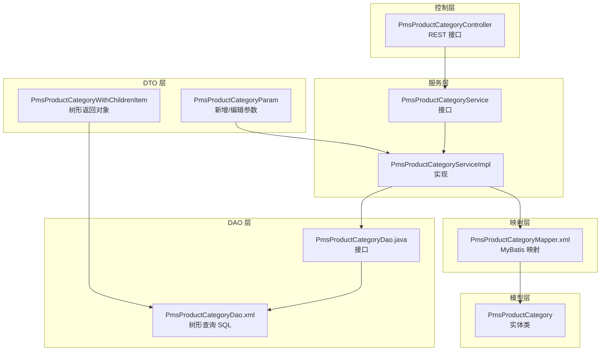
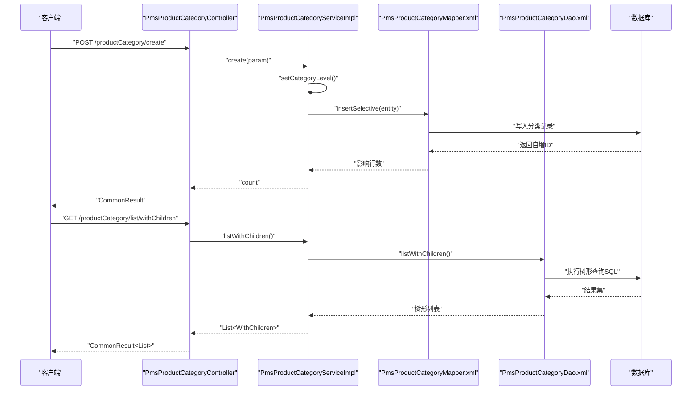
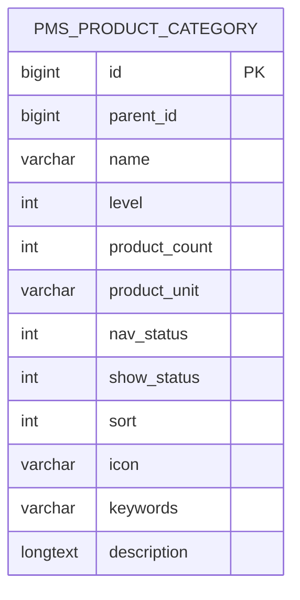
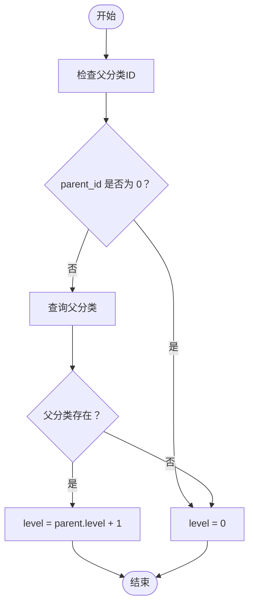
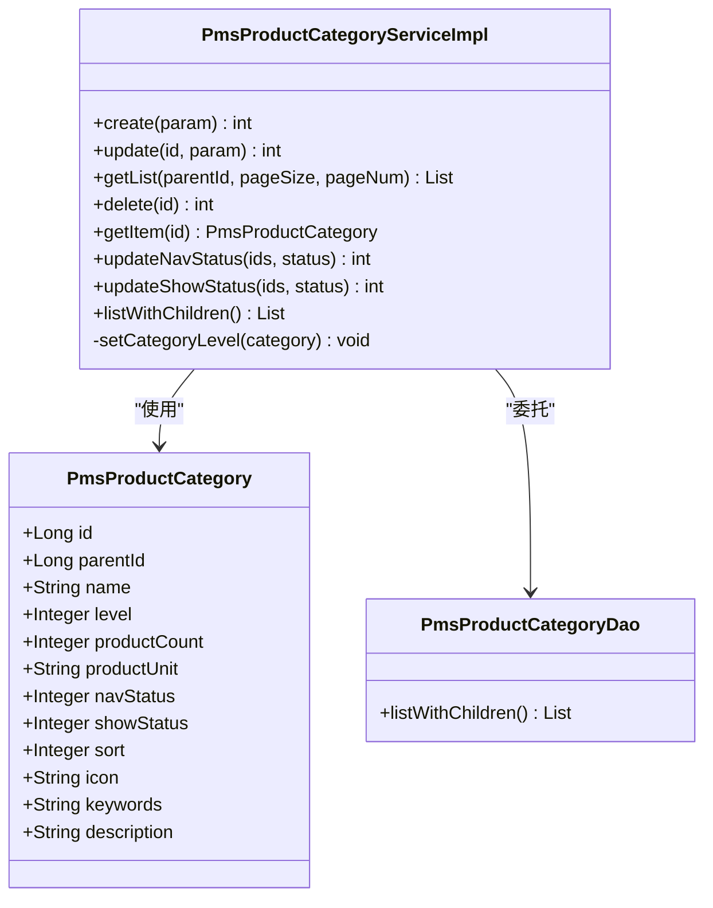
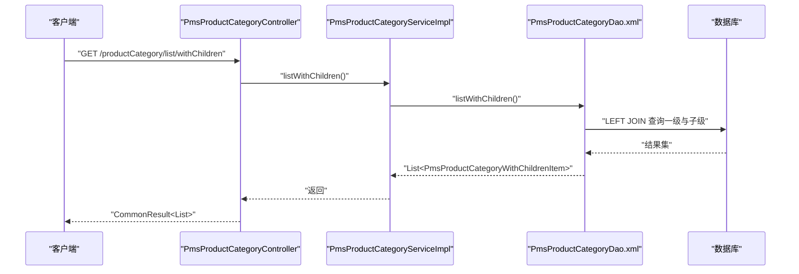
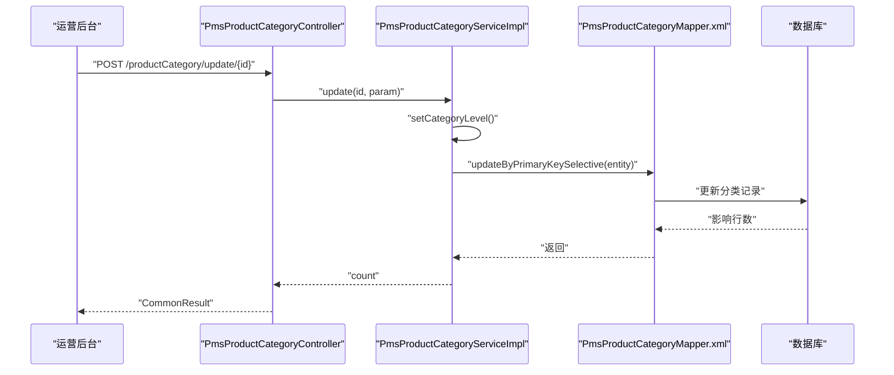
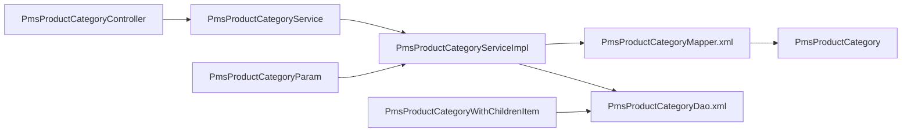

# 商品分类表 (PmsProductCategory)

<cite>
**本文引用的文件**
- [PmsProductCategory.java](file://mall-mbg/src/main/java/com/macro/mall/model/PmsProductCategory.java)
- [PmsProductCategoryMapper.xml](file://mall-mbg/src/main/resources/com/macro/mall/mapper/PmsProductCategoryMapper.xml)
- [PmsProductCategoryController.java](file://mall-admin/src/main/java/com/macro/mall/controller/PmsProductCategoryController.java)
- [PmsProductCategoryService.java](file://mall-admin/src/main/java/com/macro/mall/service/PmsProductCategoryService.java)
- [PmsProductCategoryServiceImpl.java](file://mall-admin/src/main/java/com/macro/mall/service/impl/PmsProductCategoryServiceImpl.java)
- [PmsProductCategoryDao.java](file://mall-admin/src/main/java/com/macro/mall/dao/PmsProductCategoryDao.java)
- [PmsProductCategoryDao.xml](file://mall-admin/src/main/resources/dao/PmsProductCategoryDao.xml)
- [PmsProductCategoryParam.java](file://mall-admin/src/main/java/com/macro/mall/dto/PmsProductCategoryParam.java)
- [PmsProductCategoryWithChildrenItem.java](file://mall-admin/src/main/java/com/macro/mall/dto/PmsProductCategoryWithChildrenItem.java)
- [mall.sql](file://document/sql/mall.sql)
</cite>

## 目录
1. [简介](#简介)
2. [项目结构](#项目结构)
3. [核心组件](#核心组件)
4. [架构总览](#架构总览)
5. [详细组件分析](#详细组件分析)
6. [依赖关系分析](#依赖关系分析)
7. [性能考量](#性能考量)
8. [故障排查指南](#故障排查指南)
9. [结论](#结论)
10. [附录](#附录)

## 简介
本文件围绕 PmsProductCategory 商品分类表进行系统化文档整理，重点覆盖以下方面：
- 分类层级结构设计：父分类ID、层级深度、分类路径等
- 分类基本信息字段：名称、图标、描述、排序等
- 分类展示字段：显示状态、首页推荐等
- 多级分类实现机制、父子分类关系维护、分类树形结构的构建与查询
- 分类与商品的关联关系、分类筛选功能、分类 SEO 优化等业务逻辑
- 分类管理的完整操作流程与实际应用示例

## 项目结构
围绕 PmsProductCategory 的相关模块分布如下：
- 模型层：实体类定义字段与访问器
- 映射层：MyBatis XML 映射 SQL 与字段映射
- 控制层：REST 接口暴露分类 CRUD、状态变更、树形查询
- 服务层：业务接口与实现，负责分类层级计算、与商品/属性关联的维护
- 自定义 DAO：树形查询 SQL 实现
- DTO 层：参数与树形返回对象封装

图表来源
- [PmsProductCategoryController.java:1-108](file://mall-admin/src/main/java/com/macro/mall/controller/PmsProductCategoryController.java#L1-L108)
- [PmsProductCategoryService.java:1-57](file://mall-admin/src/main/java/com/macro/mall/service/PmsProductCategoryService.java#L1-L57)
- [PmsProductCategoryServiceImpl.java:1-155](file://mall-admin/src/main/java/com/macro/mall/service/impl/PmsProductCategoryServiceImpl.java#L1-L155)
- [PmsProductCategoryDao.java:1-17](file://mall-admin/src/main/java/com/macro/mall/dao/PmsProductCategoryDao.java#L1-L17)
- [PmsProductCategoryDao.xml:1-18](file://mall-admin/src/main/resources/dao/PmsProductCategoryDao.xml#L1-L18)
- [PmsProductCategoryMapper.xml:1-375](file://mall-mbg/src/main/resources/com/macro/mall/mapper/PmsProductCategoryMapper.xml#L1-L375)
- [PmsProductCategory.java:1-150](file://mall-mbg/src/main/java/com/macro/mall/model/PmsProductCategory.java#L1-L150)
- [PmsProductCategoryParam.java:1-33](file://mall-admin/src/main/java/com/macro/mall/dto/PmsProductCategoryParam.java#L1-L33)
- [PmsProductCategoryWithChildrenItem.java:1-18](file://mall-admin/src/main/java/com/macro/mall/dto/PmsProductCategoryWithChildrenItem.java#L1-L18)

章节来源
- [PmsProductCategoryController.java:1-108](file://mall-admin/src/main/java/com/macro/mall/controller/PmsProductCategoryController.java#L1-L108)
- [PmsProductCategoryService.java:1-57](file://mall-admin/src/main/java/com/macro/mall/service/PmsProductCategoryService.java#L1-L57)
- [PmsProductCategoryServiceImpl.java:1-155](file://mall-admin/src/main/java/com/macro/mall/service/impl/PmsProductCategoryServiceImpl.java#L1-L155)
- [PmsProductCategoryDao.java:1-17](file://mall-admin/src/main/java/com/macro/mall/dao/PmsProductCategoryDao.java#L1-L17)
- [PmsProductCategoryDao.xml:1-18](file://mall-admin/src/main/resources/dao/PmsProductCategoryDao.xml#L1-L18)
- [PmsProductCategoryMapper.xml:1-375](file://mall-mbg/src/main/resources/com/macro/mall/mapper/PmsProductCategoryMapper.xml#L1-L375)
- [PmsProductCategory.java:1-150](file://mall-mbg/src/main/java/com/macro/mall/model/PmsProductCategory.java#L1-L150)
- [PmsProductCategoryParam.java:1-33](file://mall-admin/src/main/java/com/macro/mall/dto/PmsProductCategoryParam.java#L1-L33)
- [PmsProductCategoryWithChildrenItem.java:1-18](file://mall-admin/src/main/java/com/macro/mall/dto/PmsProductCategoryWithChildrenItem.java#L1-L18)

## 核心组件
- 实体类 PmsProductCategory：定义分类表字段，包括父分类 ID、层级、名称、图标、关键词、描述、排序、显示状态、导航状态等
- MyBatis 映射 PmsProductCategoryMapper.xml：提供基础字段与 BLOB 字段（描述）的查询、插入、更新、分页条件等
- 控制器 PmsProductCategoryController：提供创建、更新、列表查询、详情、删除、批量更新导航/显示状态、树形查询等接口
- 服务接口与实现 PmsProductCategoryService / PmsProductCategoryServiceImpl：负责分类层级计算、与商品名称同步、筛选属性关联维护、分页查询、批量状态更新、树形查询委托
- 自定义 DAO 接口与实现 PmsProductCategoryDao / PmsProductCategoryDao.xml：提供“一级分类 + 子分类”树形查询 SQL
- DTO 参数与树形对象 PmsProductCategoryParam / PmsProductCategoryWithChildrenItem：封装新增/编辑参数与树形返回结构

章节来源
- [PmsProductCategory.java:1-150](file://mall-mbg/src/main/java/com/macro/mall/model/PmsProductCategory.java#L1-L150)
- [PmsProductCategoryMapper.xml:1-375](file://mall-mbg/src/main/resources/com/macro/mall/mapper/PmsProductCategoryMapper.xml#L1-L375)
- [PmsProductCategoryController.java:1-108](file://mall-admin/src/main/java/com/macro/mall/controller/PmsProductCategoryController.java#L1-L108)
- [PmsProductCategoryService.java:1-57](file://mall-admin/src/main/java/com/macro/mall/service/PmsProductCategoryService.java#L1-L57)
- [PmsProductCategoryServiceImpl.java:1-155](file://mall-admin/src/main/java/com/macro/mall/service/impl/PmsProductCategoryServiceImpl.java#L1-L155)
- [PmsProductCategoryDao.java:1-17](file://mall-admin/src/main/java/com/macro/mall/dao/PmsProductCategoryDao.java#L1-L17)
- [PmsProductCategoryDao.xml:1-18](file://mall-admin/src/main/resources/dao/PmsProductCategoryDao.xml#L1-L18)
- [PmsProductCategoryParam.java:1-33](file://mall-admin/src/main/java/com/macro/mall/dto/PmsProductCategoryParam.java#L1-L33)
- [PmsProductCategoryWithChildrenItem.java:1-18](file://mall-admin/src/main/java/com/macro/mall/dto/PmsProductCategoryWithChildrenItem.java#L1-L18)

## 架构总览
从接口到数据访问的整体调用链如下：

图表来源
- [PmsProductCategoryController.java:1-108](file://mall-admin/src/main/java/com/macro/mall/controller/PmsProductCategoryController.java#L1-L108)
- [PmsProductCategoryServiceImpl.java:1-155](file://mall-admin/src/main/java/com/macro/mall/service/impl/PmsProductCategoryServiceImpl.java#L1-L155)
- [PmsProductCategoryDao.xml:1-18](file://mall-admin/src/main/resources/dao/PmsProductCategoryDao.xml#L1-L18)
- [PmsProductCategoryMapper.xml:1-375](file://mall-mbg/src/main/resources/com/macro/mall/mapper/PmsProductCategoryMapper.xml#L1-L375)

## 详细组件分析

### 数据模型与表结构
- 表名：pms_product_category
- 关键字段与含义
  - id：主键
  - parent_id：父分类 ID，0 表示一级分类
  - name：分类名称
  - level：层级，0 为一级，1 为二级，依此类推
  - product_count：商品数量（可选）
  - product_unit：计量单位（可选）
  - nav_status：导航栏显示状态（0/1）
  - show_status：前台显示状态（0/1）
  - sort：排序值
  - icon：图标
  - keywords：关键词
  - description：描述（BLOB）

图表来源
- [mall.sql:1425-1442](file://document/sql/mall.sql#L1425-L1442)

章节来源
- [mall.sql:1425-1442](file://document/sql/mall.sql#L1425-L1442)
- [PmsProductCategory.java:1-150](file://mall-mbg/src/main/java/com/macro/mall/model/PmsProductCategory.java#L1-L150)
- [PmsProductCategoryMapper.xml:1-375](file://mall-mbg/src/main/resources/com/macro/mall/mapper/PmsProductCategoryMapper.xml#L1-L375)

### 分类层级结构设计
- 父子关系：通过 parent_id 建立父子关系，parent_id=0 表示一级分类
- 层级深度：level 字段存储层级，创建时根据父分类 level+1 计算
- 路径表达：当前实现未显式存储完整路径字符串，可通过递归查询或连接查询拼装路径

图表来源
- [PmsProductCategoryServiceImpl.java:137-153](file://mall-admin/src/main/java/com/macro/mall/service/impl/PmsProductCategoryServiceImpl.java#L137-L153)

章节来源
- [PmsProductCategoryServiceImpl.java:137-153](file://mall-admin/src/main/java/com/macro/mall/service/impl/PmsProductCategoryServiceImpl.java#L137-L153)

### 分类基本信息与展示字段
- 基本信息字段：name、icon、keywords、description、sort
- 展示字段：nav_status（导航显示）、show_status（前台显示）
- 计量单位：product_unit（如“件”、“盒”等）
- 商品数量：product_count（可作为统计字段使用）

章节来源
- [PmsProductCategory.java:1-150](file://mall-mbg/src/main/java/com/macro/mall/model/PmsProductCategory.java#L1-L150)
- [PmsProductCategoryParam.java:1-33](file://mall-admin/src/main/java/com/macro/mall/dto/PmsProductCategoryParam.java#L1-L33)
- [PmsProductCategoryMapper.xml:1-375](file://mall-mbg/src/main/resources/com/macro/mall/mapper/PmsProductCategoryMapper.xml#L1-L375)

### 多级分类实现机制
- 创建时自动计算层级：setCategoryLevel 根据父分类是否存在决定 level
- 更新时同步商品名称：当分类名称变更时，同步更新该分类下的商品名称字段
- 筛选属性关联：支持为分类绑定筛选属性，并在更新时重建关联关系

图表来源
- [PmsProductCategory.java:1-150](file://mall-mbg/src/main/java/com/macro/mall/model/PmsProductCategory.java#L1-L150)
- [PmsProductCategoryServiceImpl.java:1-155](file://mall-admin/src/main/java/com/macro/mall/service/impl/PmsProductCategoryServiceImpl.java#L1-L155)
- [PmsProductCategoryDao.java:1-17](file://mall-admin/src/main/java/com/macro/mall/dao/PmsProductCategoryDao.java#L1-L17)

章节来源
- [PmsProductCategoryServiceImpl.java:1-155](file://mall-admin/src/main/java/com/macro/mall/service/impl/PmsProductCategoryServiceImpl.java#L1-L155)
- [PmsProductCategoryDao.java:1-17](file://mall-admin/src/main/java/com/macro/mall/dao/PmsProductCategoryDao.java#L1-L17)

### 父子分类关系维护
- 创建：若父分类为 0，则 level=0；否则取父分类 level+1
- 更新：同步更新商品表中对应分类的商品名称字段，确保前端展示一致
- 删除：直接按主键删除，不进行级联处理（需业务侧谨慎处理）

章节来源
- [PmsProductCategoryServiceImpl.java:38-93](file://mall-admin/src/main/java/com/macro/mall/service/impl/PmsProductCategoryServiceImpl.java#L38-L93)

### 分类树形结构的构建与查询
- 树形查询 SQL：通过自连接查询一级分类与其子分类，返回带 children 的树形结构
- 返回对象：PmsProductCategoryWithChildrenItem 继承分类实体并扩展 children 列表

图表来源
- [PmsProductCategoryController.java:101-106](file://mall-admin/src/main/java/com/macro/mall/controller/PmsProductCategoryController.java#L101-L106)
- [PmsProductCategoryServiceImpl.java:132-135](file://mall-admin/src/main/java/com/macro/mall/service/impl/PmsProductCategoryServiceImpl.java#L132-L135)
- [PmsProductCategoryDao.xml:1-18](file://mall-admin/src/main/resources/dao/PmsProductCategoryDao.xml#L1-L18)

章节来源
- [PmsProductCategoryDao.xml:1-18](file://mall-admin/src/main/resources/dao/PmsProductCategoryDao.xml#L1-L18)
- [PmsProductCategoryWithChildrenItem.java:1-18](file://mall-admin/src/main/java/com/macro/mall/dto/PmsProductCategoryWithChildrenItem.java#L1-L18)

### 分类与商品的关联关系
- 关联字段：商品表包含 product_category_id 字段，用于指向分类
- 同步策略：更新分类名称时，同步更新商品表中对应分类的商品名称字段，保证展示一致性

章节来源
- [PmsProductCategoryServiceImpl.java:70-93](file://mall-admin/src/main/java/com/macro/mall/service/impl/PmsProductCategoryServiceImpl.java#L70-L93)
- [mall.sql:1081-1442](file://document/sql/mall.sql#L1081-L1442)

### 分类筛选功能
- 筛选属性绑定：通过分类与筛选属性的关系表建立绑定
- 更新策略：更新分类时，先清理旧关系，再批量插入新关系

章节来源
- [PmsProductCategoryServiceImpl.java:46-93](file://mall-admin/src/main/java/com/macro/mall/service/impl/PmsProductCategoryServiceImpl.java#L46-L93)

### 分类 SEO 优化
- 可用字段：keywords（关键词）、description（描述）
- 建议实践：在后台维护高质量 keywords 与 description，便于搜索引擎收录与展示

章节来源
- [PmsProductCategoryParam.java:1-33](file://mall-admin/src/main/java/com/macro/mall/dto/PmsProductCategoryParam.java#L1-L33)
- [PmsProductCategoryMapper.xml:1-375](file://mall-mbg/src/main/resources/com/macro/mall/mapper/PmsProductCategoryMapper.xml#L1-L375)

### 分类管理操作流程
- 新增分类
  - 调用创建接口，传入参数对象（包含父分类、名称、图标、关键词、描述、排序、显示状态、导航状态等）
  - 服务层自动计算层级，插入数据库
  - 可选：绑定筛选属性
- 编辑分类
  - 调用更新接口，传入参数对象
  - 服务层重新计算层级，更新分类信息
  - 若名称变更，同步更新商品表中的商品分类名称
  - 重新绑定筛选属性（如有变更）
- 删除分类
  - 调用删除接口，按主键删除
  - 注意：不进行级联删除，需业务侧评估影响
- 查询分类
  - 分页查询：按父分类 ID 查询子分类列表
  - 树形查询：获取一级分类及其子分类的树形结构
- 状态管理
  - 批量更新导航状态与显示状态

图表来源
- [PmsProductCategoryController.java:39-50](file://mall-admin/src/main/java/com/macro/mall/controller/PmsProductCategoryController.java#L39-L50)
- [PmsProductCategoryServiceImpl.java:69-93](file://mall-admin/src/main/java/com/macro/mall/service/impl/PmsProductCategoryServiceImpl.java#L69-L93)
- [PmsProductCategoryMapper.xml:1-375](file://mall-mbg/src/main/resources/com/macro/mall/mapper/PmsProductCategoryMapper.xml#L1-L375)

章节来源
- [PmsProductCategoryController.java:1-108](file://mall-admin/src/main/java/com/macro/mall/controller/PmsProductCategoryController.java#L1-L108)
- [PmsProductCategoryServiceImpl.java:1-155](file://mall-admin/src/main/java/com/macro/mall/service/impl/PmsProductCategoryServiceImpl.java#L1-L155)

## 依赖关系分析
- 控制器依赖服务接口
- 服务实现依赖 Mapper 与自定义 DAO
- DTO 对象用于参数传递与树形返回
- 实体类与 MyBatis 映射文件一一对应

图表来源
- [PmsProductCategoryController.java:1-108](file://mall-admin/src/main/java/com/macro/mall/controller/PmsProductCategoryController.java#L1-L108)
- [PmsProductCategoryService.java:1-57](file://mall-admin/src/main/java/com/macro/mall/service/PmsProductCategoryService.java#L1-L57)
- [PmsProductCategoryServiceImpl.java:1-155](file://mall-admin/src/main/java/com/macro/mall/service/impl/PmsProductCategoryServiceImpl.java#L1-L155)
- [PmsProductCategoryDao.xml:1-18](file://mall-admin/src/main/resources/dao/PmsProductCategoryDao.xml#L1-L18)
- [PmsProductCategoryMapper.xml:1-375](file://mall-mbg/src/main/resources/com/macro/mall/mapper/PmsProductCategoryMapper.xml#L1-L375)
- [PmsProductCategory.java:1-150](file://mall-mbg/src/main/java/com/macro/mall/model/PmsProductCategory.java#L1-L150)
- [PmsProductCategoryParam.java:1-33](file://mall-admin/src/main/java/com/macro/mall/dto/PmsProductCategoryParam.java#L1-L33)
- [PmsProductCategoryWithChildrenItem.java:1-18](file://mall-admin/src/main/java/com/macro/mall/dto/PmsProductCategoryWithChildrenItem.java#L1-L18)

章节来源
- [PmsProductCategoryController.java:1-108](file://mall-admin/src/main/java/com/macro/mall/controller/PmsProductCategoryController.java#L1-L108)
- [PmsProductCategoryService.java:1-57](file://mall-admin/src/main/java/com/macro/mall/service/PmsProductCategoryService.java#L1-L57)
- [PmsProductCategoryServiceImpl.java:1-155](file://mall-admin/src/main/java/com/macro/mall/service/impl/PmsProductCategoryServiceImpl.java#L1-L155)
- [PmsProductCategoryDao.xml:1-18](file://mall-admin/src/main/resources/dao/PmsProductCategoryDao.xml#L1-L18)
- [PmsProductCategoryMapper.xml:1-375](file://mall-mbg/src/main/resources/com/macro/mall/mapper/PmsProductCategoryMapper.xml#L1-L375)
- [PmsProductCategory.java:1-150](file://mall-mbg/src/main/java/com/macro/mall/model/PmsProductCategory.java#L1-L150)
- [PmsProductCategoryParam.java:1-33](file://mall-admin/src/main/java/com/macro/mall/dto/PmsProductCategoryParam.java#L1-L33)
- [PmsProductCategoryWithChildrenItem.java:1-18](file://mall-admin/src/main/java/com/macro/mall/dto/PmsProductCategoryWithChildrenItem.java#L1-L18)

## 性能考量
- 树形查询：采用单次自连接查询，避免 N+1 查询问题
- 分页查询：列表接口使用分页插件，建议结合索引优化
- 索引建议：对 parent_id、level、sort 建立合适索引，提升分页与层级查询性能
- 批量更新：导航状态与显示状态采用批量更新，减少往返次数

## 故障排查指南
- 分类层级异常
  - 现象：新建分类层级不正确
  - 排查：确认父分类是否存在且 parent_id 是否为 0；检查 setCategoryLevel 逻辑
- 名称同步失败
  - 现象：更新分类名称后商品名称未变化
  - 排查：确认更新流程中是否执行了商品名称同步逻辑
- 树形查询为空
  - 现象：树形查询返回空
  - 排查：确认一级分类 parent_id=0 的记录是否存在；检查 SQL 连接条件
- 筛选属性未生效
  - 现象：更新分类后筛选属性未绑定
  - 排查：确认更新流程中是否先清理旧关系再插入新关系

章节来源
- [PmsProductCategoryServiceImpl.java:38-93](file://mall-admin/src/main/java/com/macro/mall/service/impl/PmsProductCategoryServiceImpl.java#L38-L93)
- [PmsProductCategoryDao.xml:1-18](file://mall-admin/src/main/resources/dao/PmsProductCategoryDao.xml#L1-L18)

## 结论
PmsProductCategory 通过 parent_id 与 level 实现清晰的多级分类结构，配合树形查询与批量状态管理，满足后台运营与前台展示需求。服务层在创建与更新时完成层级计算与商品名称同步，确保数据一致性。建议在生产环境中完善索引与缓存策略，持续优化查询性能。

## 附录
- 接口清单（节选）
  - POST /productCategory/create：创建分类
  - POST /productCategory/update/{id}：更新分类
  - GET /productCategory/list/{parentId}：分页查询子分类
  - GET /productCategory/{id}：获取分类详情
  - POST /productCategory/delete/{id}：删除分类
  - POST /productCategory/update/navStatus：批量更新导航状态
  - POST /productCategory/update/showStatus：批量更新显示状态
  - GET /productCategory/list/withChildren：树形查询

章节来源
- [PmsProductCategoryController.java:1-108](file://mall-admin/src/main/java/com/macro/mall/controller/PmsProductCategoryController.java#L1-L108)