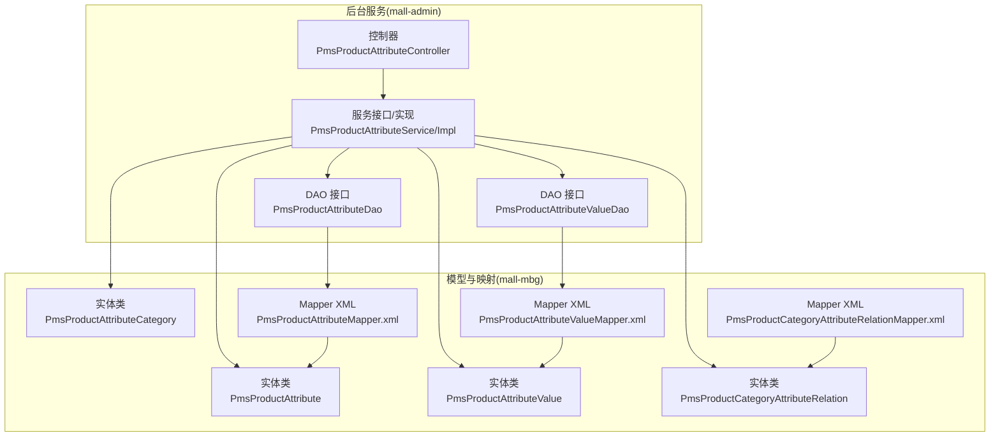
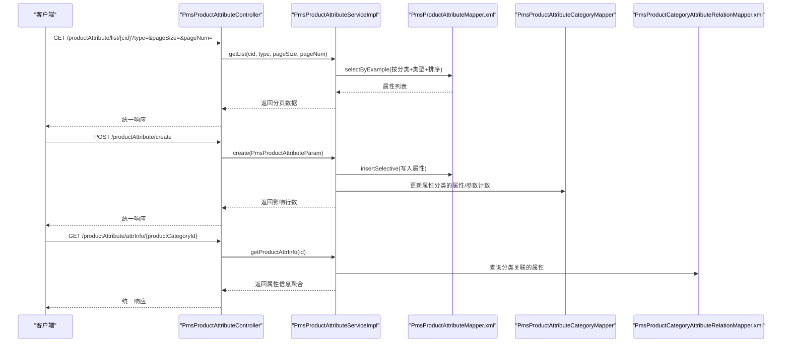
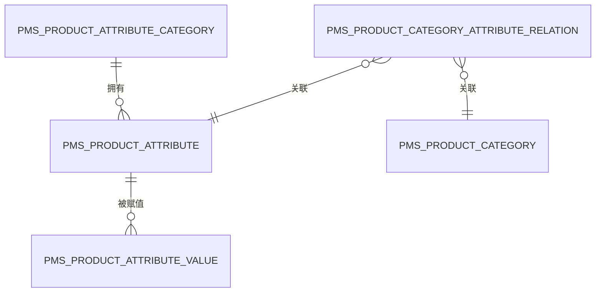
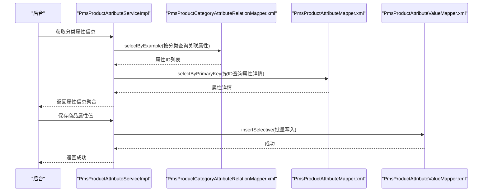
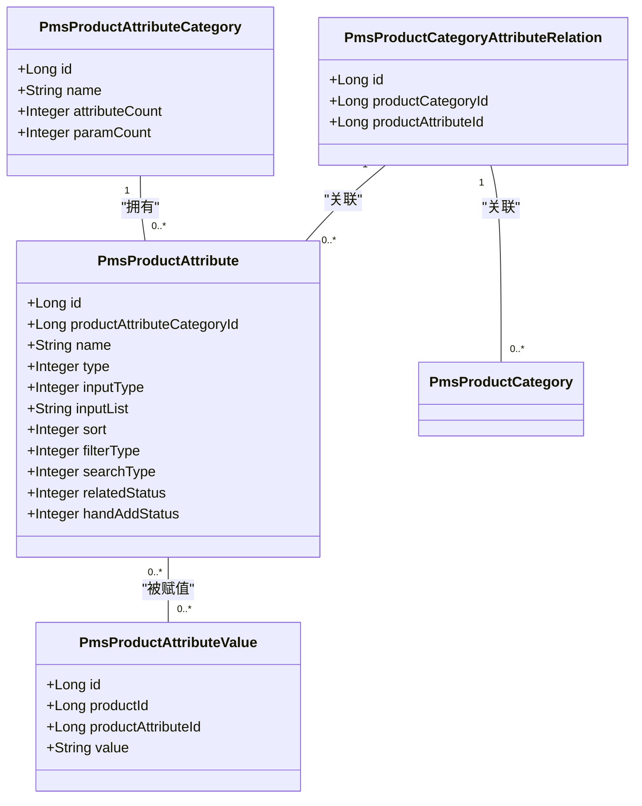

# 商品属性表 (PmsProductAttribute)

<cite>
**本文引用的文件**
- [PmsProductAttribute.java](file://mall-mbg/src/main/java/com/macro/mall/model/PmsProductAttribute.java)
- [PmsProductAttributeValue.java](file://mall-mbg/src/main/java/com/macro/mall/model/PmsProductAttributeValue.java)
- [PmsProductAttributeCategory.java](file://mall-mbg/src/main/java/com/macro/mall/model/PmsProductAttributeCategory.java)
- [PmsProductCategoryAttributeRelation.java](file://mall-mbg/src/main/java/com/macro/mall/model/PmsProductCategoryAttributeRelation.java)
- [PmsProductAttributeMapper.xml](file://mall-mbg/src/main/resources/com/macro/mall/mapper/PmsProductAttributeMapper.xml)
- [PmsProductAttributeValueMapper.xml](file://mall-mbg/src/main/resources/com/macro/mall/mapper/PmsProductAttributeValueMapper.xml)
- [PmsProductAttributeController.java](file://mall-admin/src/main/java/com/macro/mall/controller/PmsProductAttributeController.java)
- [PmsProductAttributeService.java](file://mall-admin/src/main/java/com/macro/mall/service/PmsProductAttributeService.java)
- [PmsProductAttributeServiceImpl.java](file://mall-admin/src/main/java/com/macro/mall/service/impl/PmsProductAttributeServiceImpl.java)
- [PmsProductAttributeParam.java](file://mall-admin/src/main/java/com/macro/mall/dto/PmsProductAttributeParam.java)
- [ProductAttrInfo.java](file://mall-admin/src/main/java/com/macro/mall/dto/ProductAttrInfo.java)
- [PmsProductAttributeDao.java](file://mall-admin/src/main/java/com/macro/mall/dao/PmsProductAttributeDao.java)
- [PmsProductAttributeValueDao.java](file://mall-admin/src/main/java/com/macro/mall/dao/PmsProductAttributeValueDao.java)
- [PmsProductCategoryAttributeRelationMapper.xml](file://mall-mbg/src/main/resources/com/macro/mall/mapper/PmsProductCategoryAttributeRelationMapper.xml)
</cite>

## 目录
1. [简介](#简介)
2. [项目结构](#项目结构)
3. [核心组件](#核心组件)
4. [架构总览](#架构总览)
5. [详细组件分析](#详细组件分析)
6. [依赖关系分析](#依赖关系分析)
7. [性能考量](#性能考量)
8. [故障排查指南](#故障排查指南)
9. [结论](#结论)
10. [附录](#附录)

## 简介
本文件围绕 PmsProductAttribute 商品属性表进行系统化说明，覆盖以下主题：
- 属性分类字段：属性分组（属性分类）、属性类型（规格/参数）等
- 属性基本信息字段：名称、输入类型、可选值等
- 属性展示字段：搜索类型、页面关联等
- 属性与商品的关联关系、属性值管理、属性组合规则
- 属性在商品详情页的展示逻辑、属性筛选功能实现、属性值的枚举管理和动态生成机制
- 属性配置的最佳实践与实际应用场景示例

## 项目结构
该模块位于 mall-admin 后台服务中，采用典型的分层架构：
- 控制器层：处理 HTTP 请求，返回统一响应
- 服务层：封装业务逻辑，事务控制
- 数据访问层：MyBatis 映射 XML 定义 SQL
- 模型层：MBG 自动生成的实体类

图表来源
- [PmsProductAttributeController.java:1-84](file://mall-admin/src/main/java/com/macro/mall/controller/PmsProductAttributeController.java#L1-L84)
- [PmsProductAttributeService.java:1-49](file://mall-admin/src/main/java/com/macro/mall/service/PmsProductAttributeService.java#L1-L49)
- [PmsProductAttributeServiceImpl.java:1-102](file://mall-admin/src/main/java/com/macro/mall/service/impl/PmsProductAttributeServiceImpl.java#L1-L102)
- [PmsProductAttributeDao.java:1-18](file://mall-admin/src/main/java/com/macro/mall/dao/PmsProductAttributeDao.java#L1-L18)
- [PmsProductAttributeValueDao.java:1-18](file://mall-admin/src/main/java/com/macro/mall/dao/PmsProductAttributeValueDao.java#L1-L18)
- [PmsProductAttribute.java:1-150](file://mall-mbg/src/main/java/com/macro/mall/model/PmsProductAttribute.java#L1-L150)
- [PmsProductAttributeValue.java:1-62](file://mall-mbg/src/main/java/com/macro/mall/model/PmsProductAttributeValue.java#L1-L62)
- [PmsProductAttributeCategory.java:1-62](file://mall-mbg/src/main/java/com/macro/mall/model/PmsProductAttributeCategory.java#L1-L62)
- [PmsProductCategoryAttributeRelation.java:1-51](file://mall-mbg/src/main/java/com/macro/mall/model/PmsProductCategoryAttributeRelation.java#L1-L51)
- [PmsProductAttributeMapper.xml:1-323](file://mall-mbg/src/main/resources/com/macro/mall/mapper/PmsProductAttributeMapper.xml#L1-L323)
- [PmsProductAttributeValueMapper.xml:1-196](file://mall-mbg/src/main/resources/com/macro/mall/mapper/PmsProductAttributeValueMapper.xml#L1-L196)
- [PmsProductCategoryAttributeRelationMapper.xml:104-140](file://mall-mbg/src/main/resources/com/macro/mall/mapper/PmsProductCategoryAttributeRelationMapper.xml#L104-L140)

章节来源
- [PmsProductAttributeController.java:1-84](file://mall-admin/src/main/java/com/macro/mall/controller/PmsProductAttributeController.java#L1-L84)
- [PmsProductAttributeService.java:1-49](file://mall-admin/src/main/java/com/macro/mall/service/PmsProductAttributeService.java#L1-L49)
- [PmsProductAttributeServiceImpl.java:1-102](file://mall-admin/src/main/java/com/macro/mall/service/impl/PmsProductAttributeServiceImpl.java#L1-L102)

## 核心组件
- 实体类与字段
  - PmsProductAttribute：商品属性主表，包含属性分类、名称、输入类型、可选值、排序、搜索类型、过滤类型、页面关联状态、是否手工录入、类型（规格/参数）等字段
  - PmsProductAttributeValue：商品属性值表，记录某商品针对某个属性的具体取值
  - PmsProductAttributeCategory：属性分类，维护属性数与参数数
  - PmsProductCategoryAttributeRelation：商品分类与属性的关联关系表
- 控制器与服务
  - PmsProductAttributeController：提供属性列表、创建、更新、删除、查询属性信息等接口
  - PmsProductAttributeService/Impl：实现分页查询、增删改、属性分类计数联动更新、属性信息聚合查询
- DAO 与 DTO
  - PmsProductAttributeDao：聚合查询商品分类对应的属性信息
  - PmsProductAttributeValueDao：批量插入属性值
  - PmsProductAttributeParam：属性入参校验与封装
  - ProductAttrInfo：属性信息聚合结果

章节来源
- [PmsProductAttribute.java:1-150](file://mall-mbg/src/main/java/com/macro/mall/model/PmsProductAttribute.java#L1-L150)
- [PmsProductAttributeValue.java:1-62](file://mall-mbg/src/main/java/com/macro/mall/model/PmsProductAttributeValue.java#L1-L62)
- [PmsProductAttributeCategory.java:1-62](file://mall-mbg/src/main/java/com/macro/mall/model/PmsProductAttributeCategory.java#L1-L62)
- [PmsProductCategoryAttributeRelation.java:1-51](file://mall-mbg/src/main/java/com/macro/mall/model/PmsProductCategoryAttributeRelation.java#L1-L51)
- [PmsProductAttributeController.java:1-84](file://mall-admin/src/main/java/com/macro/mall/controller/PmsProductAttributeController.java#L1-L84)
- [PmsProductAttributeService.java:1-49](file://mall-admin/src/main/java/com/macro/mall/service/PmsProductAttributeService.java#L1-L49)
- [PmsProductAttributeServiceImpl.java:1-102](file://mall-admin/src/main/java/com/macro/mall/service/impl/PmsProductAttributeServiceImpl.java#L1-L102)
- [PmsProductAttributeParam.java:1-37](file://mall-admin/src/main/java/com/macro/mall/dto/PmsProductAttributeParam.java#L1-L37)
- [ProductAttrInfo.java:1-17](file://mall-admin/src/main/java/com/macro/mall/dto/ProductAttrInfo.java#L1-L17)
- [PmsProductAttributeDao.java:1-18](file://mall-admin/src/main/java/com/macro/mall/dao/PmsProductAttributeDao.java#L1-L18)
- [PmsProductAttributeValueDao.java:1-18](file://mall-admin/src/main/java/com/macro/mall/dao/PmsProductAttributeValueDao.java#L1-L18)

## 架构总览
下图展示了属性管理从请求到数据库的端到端流程。

图表来源
- [PmsProductAttributeController.java:27-82](file://mall-admin/src/main/java/com/macro/mall/controller/PmsProductAttributeController.java#L27-L82)
- [PmsProductAttributeServiceImpl.java:32-100](file://mall-admin/src/main/java/com/macro/mall/service/impl/PmsProductAttributeServiceImpl.java#L32-L100)
- [PmsProductAttributeMapper.xml:80-99](file://mall-mbg/src/main/resources/com/macro/mall/mapper/PmsProductAttributeMapper.xml#L80-L99)
- [PmsProductCategoryAttributeRelationMapper.xml:104-140](file://mall-mbg/src/main/resources/com/macro/mall/mapper/PmsProductCategoryAttributeRelationMapper.xml#L104-L140)

## 详细组件分析

### 实体类与数据模型
- PmsProductAttribute 字段说明（节选）
  - 属性分类标识：productAttributeCategoryId
  - 基本信息：name、type（0 规格/1 参数）、sort
  - 输入与可选值：inputType（0 文本/1 单选）、inputList（可选值列表）
  - 展示与检索：searchType（0 不检索/1 检索/2 搜索）、filterType（0 不用于筛选/1 用于筛选）
  - 页面关联：relatedStatus（0 关联/1 不关联）
  - 手工录入：handAddStatus（0 允许/1 禁止）
- PmsProductAttributeValue 字段说明
  - 记录某商品对某属性的具体取值 value
- PmsProductAttributeCategory 字段说明
  - 维护 attributeCount、paramCount，用于统计分类下的规格与参数数量
- PmsProductCategoryAttributeRelation 字段说明
  - 连接商品分类与属性，决定分类下可用的属性集

图表来源
- [PmsProductAttribute.java:1-150](file://mall-mbg/src/main/java/com/macro/mall/model/PmsProductAttribute.java#L1-L150)
- [PmsProductAttributeValue.java:1-62](file://mall-mbg/src/main/java/com/macro/mall/model/PmsProductAttributeValue.java#L1-L62)
- [PmsProductAttributeCategory.java:1-62](file://mall-mbg/src/main/java/com/macro/mall/model/PmsProductAttributeCategory.java#L1-L62)
- [PmsProductCategoryAttributeRelation.java:1-51](file://mall-mbg/src/main/java/com/macro/mall/model/PmsProductCategoryAttributeRelation.java#L1-L51)

章节来源
- [PmsProductAttribute.java:1-150](file://mall-mbg/src/main/java/com/macro/mall/model/PmsProductAttribute.java#L1-L150)
- [PmsProductAttributeValue.java:1-62](file://mall-mbg/src/main/java/com/macro/mall/model/PmsProductAttributeValue.java#L1-L62)
- [PmsProductAttributeCategory.java:1-62](file://mall-mbg/src/main/java/com/macro/mall/model/PmsProductAttributeCategory.java#L1-L62)
- [PmsProductCategoryAttributeRelation.java:1-51](file://mall-mbg/src/main/java/com/macro/mall/model/PmsProductCategoryAttributeRelation.java#L1-L51)

### 属性分类字段与类型
- 属性分组：通过 productAttributeCategoryId 将属性归类到不同属性分类
- 属性类型：type=0 表示规格（如颜色、尺寸），type=1 表示参数（如品牌、材质）
- 属性分类计数：新增/删除属性时，同步更新 PmsProductAttributeCategory 的 attributeCount 与 paramCount

章节来源
- [PmsProductAttributeServiceImpl.java:46-54](file://mall-admin/src/main/java/com/macro/mall/service/impl/PmsProductAttributeServiceImpl.java#L46-L54)
- [PmsProductAttributeServiceImpl.java:72-94](file://mall-admin/src/main/java/com/macro/mall/service/impl/PmsProductAttributeServiceImpl.java#L72-L94)
- [PmsProductAttributeCategory.java:1-62](file://mall-mbg/src/main/java/com/macro/mall/model/PmsProductAttributeCategory.java#L1-L62)

### 属性基本信息字段
- 名称与排序：name、sort 决定属性在后台与前端的显示顺序
- 输入类型与可选值：inputType 与 inputList 配合，支持文本输入或单选枚举
- 手工录入：handAddStatus 控制是否允许手工添加属性

章节来源
- [PmsProductAttributeParam.java:15-36](file://mall-admin/src/main/java/com/macro/mall/dto/PmsProductAttributeParam.java#L15-L36)
- [PmsProductAttribute.java:1-150](file://mall-mbg/src/main/java/com/macro/mall/model/PmsProductAttribute.java#L1-L150)

### 属性展示字段与页面关联
- 搜索类型：searchType 决定属性是否参与检索与搜索
- 过滤类型：filterType 决定属性是否用于筛选
- 页面关联：relatedStatus 决定属性是否在页面上展示

章节来源
- [PmsProductAttributeParam.java:26-31](file://mall-admin/src/main/java/com/macro/mall/dto/PmsProductAttributeParam.java#L26-L31)
- [PmsProductAttribute.java:1-150](file://mall-mbg/src/main/java/com/macro/mall/model/PmsProductAttribute.java#L1-L150)

### 属性与商品的关联关系
- 商品分类与属性：通过 PmsProductCategoryAttributeRelation 建立分类与属性的绑定关系
- 商品与属性值：通过 PmsProductAttributeValue 记录具体商品的属性取值
- 属性信息聚合：通过 PmsProductAttributeDao 聚合商品分类对应的属性集合，供前台展示与筛选使用

图表来源
- [PmsProductAttributeServiceImpl.java:97-100](file://mall-admin/src/main/java/com/macro/mall/service/impl/PmsProductAttributeServiceImpl.java#L97-L100)
- [PmsProductAttributeDao.java:12-17](file://mall-admin/src/main/java/com/macro/mall/dao/PmsProductAttributeDao.java#L12-L17)
- [PmsProductCategoryAttributeRelationMapper.xml:104-140](file://mall-mbg/src/main/resources/com/macro/mall/mapper/PmsProductCategoryAttributeRelationMapper.xml#L104-L140)
- [PmsProductAttributeMapper.xml:94-99](file://mall-mbg/src/main/resources/com/macro/mall/mapper/PmsProductAttributeMapper.xml#L94-L99)
- [PmsProductAttributeValueMapper.xml:101-109](file://mall-mbg/src/main/resources/com/macro/mall/mapper/PmsProductAttributeValueMapper.xml#L101-L109)

章节来源
- [PmsProductAttributeDao.java:12-17](file://mall-admin/src/main/java/com/macro/mall/dao/PmsProductAttributeDao.java#L12-L17)
- [PmsProductAttributeValueDao.java:12-17](file://mall-admin/src/main/java/com/macro/mall/dao/PmsProductAttributeValueDao.java#L12-L17)
- [PmsProductCategoryAttributeRelationMapper.xml:104-140](file://mall-mbg/src/main/resources/com/macro/mall/mapper/PmsProductCategoryAttributeRelationMapper.xml#L104-L140)

### 属性值管理与动态生成
- 动态生成：属性值通过 inputList 提供可选值，支持单选
- 动态写入：商品上架后，根据属性与 SKU 组合，向 PmsProductAttributeValue 写入具体取值
- 批量操作：PmsProductAttributeValueDao 支持批量插入属性值，提升导入效率

章节来源
- [PmsProductAttributeParam.java:20-24](file://mall-admin/src/main/java/com/macro/mall/dto/PmsProductAttributeParam.java#L20-L24)
- [PmsProductAttributeValueDao.java:12-17](file://mall-admin/src/main/java/com/macro/mall/dao/PmsProductAttributeValueDao.java#L12-L17)
- [PmsProductAttributeValueMapper.xml:101-109](file://mall-mbg/src/main/resources/com/macro/mall/mapper/PmsProductAttributeValueMapper.xml#L101-L109)

### 属性组合规则
- 组合基础：同一商品分类下的属性集合由 PmsProductCategoryAttributeRelation 决定
- 组合策略：SKU 与属性值的组合遵循“属性集合 × 取值集合”的笛卡尔积扩展
- 展示策略：searchType 与 filterType 决定属性在搜索与筛选中的行为

章节来源
- [PmsProductCategoryAttributeRelation.java:1-51](file://mall-mbg/src/main/java/com/macro/mall/model/PmsProductCategoryAttributeRelation.java#L1-L51)
- [PmsProductAttribute.java:1-150](file://mall-mbg/src/main/java/com/macro/mall/model/PmsProductAttribute.java#L1-L150)

### 商品详情页展示逻辑
- 展示依据：relatedStatus 控制属性是否在详情页展示
- 分类维度：通过分类属性聚合接口返回属性信息，前端据此渲染
- 值绑定：PmsProductAttributeValue 中的值与属性 ID 绑定，用于展示当前商品的实际取值

章节来源
- [PmsProductAttributeParam.java:30-31](file://mall-admin/src/main/java/com/macro/mall/dto/PmsProductAttributeParam.java#L30-L31)
- [PmsProductAttributeServiceImpl.java:97-100](file://mall-admin/src/main/java/com/macro/mall/service/impl/PmsProductAttributeServiceImpl.java#L97-L100)
- [PmsProductAttributeValue.java:1-62](file://mall-mbg/src/main/java/com/macro/mall/model/PmsProductAttributeValue.java#L1-L62)

### 属性筛选功能实现
- 筛选入口：filterType=1 的属性进入筛选面板
- 检索入口：searchType=1 或 2 的属性参与搜索
- 前端交互：基于属性集合与可选值 inputList，生成多选项供用户选择

章节来源
- [PmsProductAttributeParam.java:26-29](file://mall-admin/src/main/java/com/macro/mall/dto/PmsProductAttributeParam.java#L26-L29)
- [PmsProductAttributeParam.java:20-24](file://mall-admin/src/main/java/com/macro/mall/dto/PmsProductAttributeParam.java#L20-L24)

### 属性配置最佳实践
- 类型划分清晰：规格用于差异化（颜色、尺寸），参数用于描述性（材质、产地）
- 可选值规范：inputList 使用明确分隔符，避免重复与歧义
- 排序与展示：合理设置 sort 与 relatedStatus，确保详情页信息层级清晰
- 筛选与检索：filterType 与 searchType 与业务需求匹配，避免过度筛选导致用户困惑
- 计数维护：新增/删除属性后，确保属性分类计数同步更新

章节来源
- [PmsProductAttributeServiceImpl.java:46-54](file://mall-admin/src/main/java/com/macro/mall/service/impl/PmsProductAttributeServiceImpl.java#L46-L54)
- [PmsProductAttributeServiceImpl.java:72-94](file://mall-admin/src/main/java/com/macro/mall/service/impl/PmsProductAttributeServiceImpl.java#L72-L94)

### 实际应用场景示例
- 场景一：手机商品分类
  - 规格：颜色（红/蓝/黑）、存储容量（128G/256G/512G）
  - 参数：操作系统版本、处理器型号
  - 展示：详情页展示参数；筛选页提供规格与部分参数
- 场景二：图书商品分类
  - 规格：开本、页数（可选）
  - 参数：作者、出版社、ISBN
  - 展示：详情页展示作者与出版社；搜索页按作者/出版社检索

章节来源
- [PmsProductAttributeParam.java:15-36](file://mall-admin/src/main/java/com/macro/mall/dto/PmsProductAttributeParam.java#L15-L36)
- [PmsProductAttribute.java:1-150](file://mall-mbg/src/main/java/com/macro/mall/model/PmsProductAttribute.java#L1-L150)

## 依赖关系分析
- 控制器依赖服务接口，服务实现依赖 Mapper 与 DAO
- 属性实体与属性值实体存在一对多关系（一个属性可有多个商品取值）
- 属性分类与属性为一对多关系，并通过中间表与商品分类建立关联

图表来源
- [PmsProductAttribute.java:1-150](file://mall-mbg/src/main/java/com/macro/mall/model/PmsProductAttribute.java#L1-L150)
- [PmsProductAttributeValue.java:1-62](file://mall-mbg/src/main/java/com/macro/mall/model/PmsProductAttributeValue.java#L1-L62)
- [PmsProductAttributeCategory.java:1-62](file://mall-mbg/src/main/java/com/macro/mall/model/PmsProductAttributeCategory.java#L1-L62)
- [PmsProductCategoryAttributeRelation.java:1-51](file://mall-mbg/src/main/java/com/macro/mall/model/PmsProductCategoryAttributeRelation.java#L1-L51)

章节来源
- [PmsProductAttribute.java:1-150](file://mall-mbg/src/main/java/com/macro/mall/model/PmsProductAttribute.java#L1-L150)
- [PmsProductAttributeValue.java:1-62](file://mall-mbg/src/main/java/com/macro/mall/model/PmsProductAttributeValue.java#L1-L62)
- [PmsProductAttributeCategory.java:1-62](file://mall-mbg/src/main/java/com/macro/mall/model/PmsProductAttributeCategory.java#L1-L62)
- [PmsProductCategoryAttributeRelation.java:1-51](file://mall-mbg/src/main/java/com/macro/mall/model/PmsProductCategoryAttributeRelation.java#L1-L51)

## 性能考量
- 分页查询：getList 使用分页插件，建议结合索引优化（按分类+类型+排序）
- 批量写入：属性值批量插入减少往返次数，提高导入效率
- 缓存策略：属性信息聚合结果可在缓存中短期缓存，降低重复查询成本
- 索引设计：建议在 product_attribute_category_id、type、sort 上建立复合索引以提升查询性能

## 故障排查指南
- 新增属性后分类计数未更新
  - 检查服务实现中对属性分类计数的更新逻辑
  - 确认 type 值是否正确（0 规格/1 参数）
- 删除属性后计数异常
  - 检查删除时的计数回减逻辑，确保不出现负数
- 属性值无法写入
  - 检查 productId 与 productAttributeId 是否正确
  - 确认属性值长度与字符集限制
- 属性筛选无效
  - 检查 filterType 与 searchType 设置
  - 确认属性是否已与商品分类正确关联

章节来源
- [PmsProductAttributeServiceImpl.java:46-54](file://mall-admin/src/main/java/com/macro/mall/service/impl/PmsProductAttributeServiceImpl.java#L46-L54)
- [PmsProductAttributeServiceImpl.java:72-94](file://mall-admin/src/main/java/com/macro/mall/service/impl/PmsProductAttributeServiceImpl.java#L72-L94)
- [PmsProductAttributeValueMapper.xml:101-109](file://mall-mbg/src/main/resources/com/macro/mall/mapper/PmsProductAttributeValueMapper.xml#L101-L109)

## 结论
PmsProductAttribute 商品属性体系通过“属性分类 + 属性 + 属性值 + 分类关联”的设计，实现了规格与参数的灵活配置、属性值的动态管理以及属性在搜索与筛选中的可控展示。配合服务层的计数维护与聚合查询，能够满足商品详情页与筛选页的多样化需求。建议在实际应用中严格区分规格与参数、规范可选值、合理设置展示与检索策略，并通过索引与缓存优化查询性能。

## 附录
- 接口一览（控制器）
  - GET /productAttribute/list/{cid}：按分类与类型分页查询属性
  - POST /productAttribute/create：创建属性
  - POST /productAttribute/update/{id}：更新属性
  - GET /productAttribute/{id}：获取单个属性
  - POST /productAttribute/delete：批量删除属性
  - GET /productAttribute/attrInfo/{productCategoryId}：获取分类属性信息聚合

章节来源
- [PmsProductAttributeController.java:27-82](file://mall-admin/src/main/java/com/macro/mall/controller/PmsProductAttributeController.java#L27-L82)