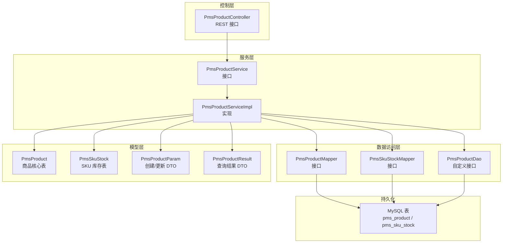
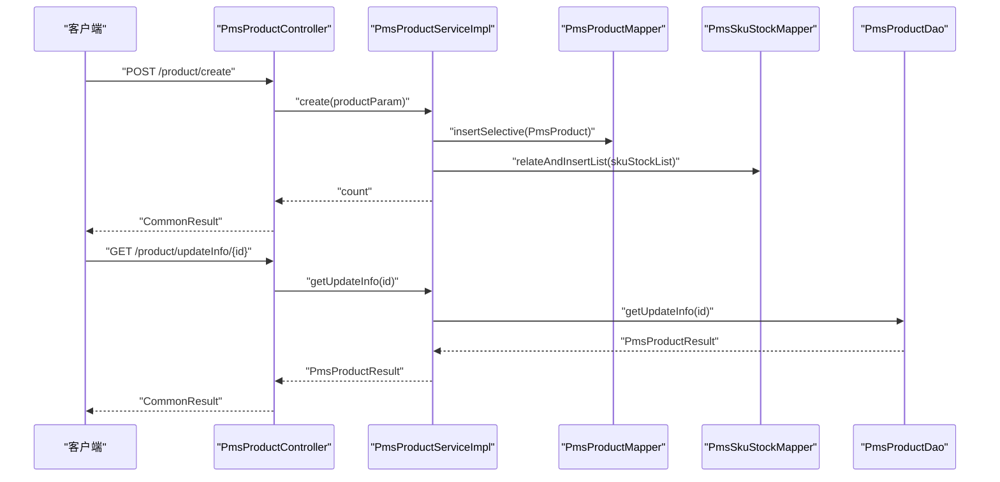
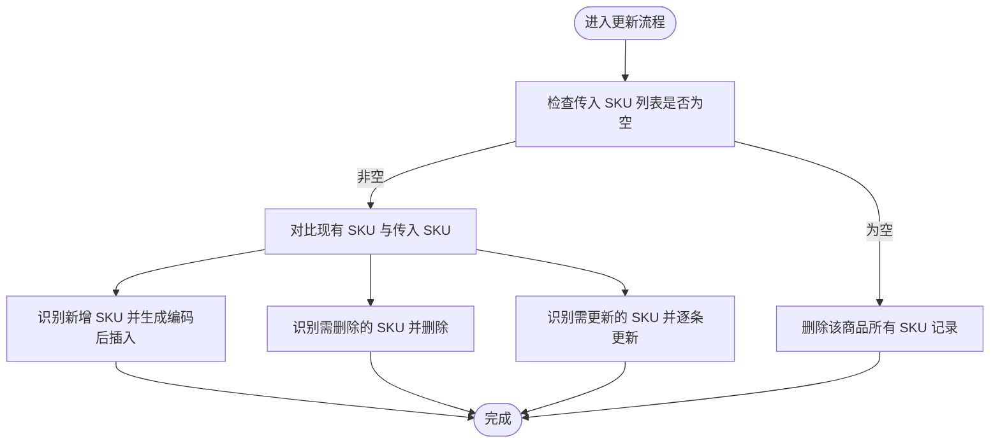
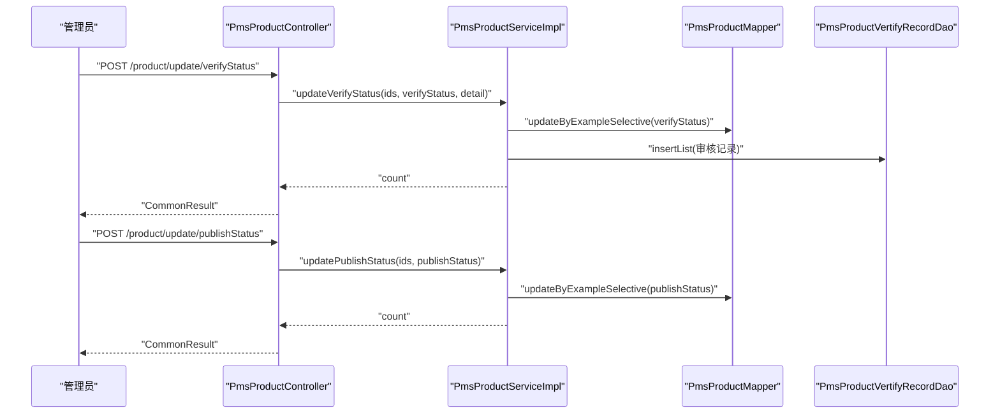
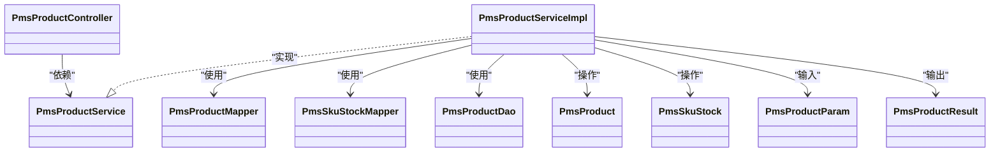

# 商品核心表 (PmsProduct)

<cite>
**本文引用的文件**
- [PmsProduct.java](file://mall-mbg/src/main/java/com/macro/mall/model/PmsProduct.java)
- [PmsProductMapper.java](file://mall-mbg/src/main/java/com/macro/mall/mapper/PmsProductMapper.java)
- [PmsProductMapper.xml](file://mall-mbg/src/main/resources/com/macro/mall/mapper/PmsProductMapper.xml)
- [PmsProductController.java](file://mall-admin/src/main/java/com/macro/mall/controller/PmsProductController.java)
- [PmsProductService.java](file://mall-admin/src/main/java/com/macro/mall/service/PmsProductService.java)
- [PmsProductServiceImpl.java](file://mall-admin/src/main/java/com/macro/mall/service/impl/PmsProductServiceImpl.java)
- [PmsProductParam.java](file://mall-admin/src/main/java/com/macro/mall/dto/PmsProductParam.java)
- [PmsProductResult.java](file://mall-admin/src/main/java/com/macro/mall/dto/PmsProductResult.java)
- [PmsSkuStock.java](file://mall-mbg/src/main/java/com/macro/mall/model/PmsSkuStock.java)
- [PmsSkuStockMapper.java](file://mall-mbg/src/main/java/com/macro/mall/mapper/PmsSkuStockMapper.java)
- [PmsSkuStockMapper.xml](file://mall-mbg/src/main/resources/com/macro/mall/mapper/PmsSkuStockMapper.xml)
- [PmsProductAttributeValue.java](file://mall-mbg/src/main/java/com/macro/mall/model/PmsProductAttributeValue.java)
- [PmsProductDao.java](file://mall-admin/src/main/java/com/macro/mall/dao/PmsProductDao.java)
- [mall.sql](file://document/sql/mall.sql)
</cite>

## 目录
1. [简介](#简介)
2. [项目结构](#项目结构)
3. [核心组件](#核心组件)
4. [架构总览](#架构总览)
5. [详细组件分析](#详细组件分析)
6. [依赖分析](#依赖分析)
7. [性能考虑](#性能考虑)
8. [故障排查指南](#故障排查指南)
9. [结论](#结论)
10. [附录](#附录)

## 简介
本文件围绕电商系统中的商品核心表 PmsProduct 进行全面、深入且可操作的技术文档编制，覆盖以下主题：
- 商品基本信息字段（名称、标题、副标题、货号、主图、相册等）
- 价格体系字段（价格、成本价、促销价、原价、积分与成长值等）
- 库存相关字段（库存、预警库存、销量、锁库等）
- 商品状态字段（上架、审核、推荐、新品、删除、预览等）
- 商品 SKU 管理机制与多规格实现
- 商品图片上传与展示逻辑
- 商品上下架流程与审核机制
- 搜索索引同步与业务联动
- 字段说明、业务规则与实际使用示例

## 项目结构
该模块采用典型的分层架构：
- 控制层：接收前端请求，封装响应
- 服务层：编排业务流程，事务控制
- 数据访问层：MyBatis 映射器与 XML SQL
- 模型层：实体类与数据库表映射
- DTO 层：接口入参/出参对象

图表来源
- [PmsProductController.java:21-134](file://mall-admin/src/main/java/com/macro/mall/controller/PmsProductController.java#L21-L134)
- [PmsProductService.java:17-74](file://mall-admin/src/main/java/com/macro/mall/service/PmsProductService.java#L17-L74)
- [PmsProductServiceImpl.java:30-328](file://mall-admin/src/main/java/com/macro/mall/service/impl/PmsProductServiceImpl.java#L30-L328)
- [PmsProductMapper.java:8-36](file://mall-mbg/src/main/java/com/macro/mall/mapper/PmsProductMapper.java#L8-L36)
- [PmsSkuStockMapper.java:8-30](file://mall-mbg/src/main/java/com/macro/mall/mapper/PmsSkuStockMapper.java#L8-L30)
- [PmsProductDao.java:11-16](file://mall-admin/src/main/java/com/macro/mall/dao/PmsProductDao.java#L11-L16)

章节来源
- [PmsProductController.java:21-134](file://mall-admin/src/main/java/com/macro/mall/controller/PmsProductController.java#L21-L134)
- [PmsProductService.java:17-74](file://mall-admin/src/main/java/com/macro/mall/service/PmsProductService.java#L17-L74)
- [PmsProductServiceImpl.java:30-328](file://mall-admin/src/main/java/com/macro/mall/service/impl/PmsProductServiceImpl.java#L30-L328)
- [PmsProductMapper.java:8-36](file://mall-mbg/src/main/java/com/macro/mall/mapper/PmsProductMapper.java#L8-L36)
- [PmsSkuStockMapper.java:8-30](file://mall-mbg/src/main/java/com/macro/mall/mapper/PmsSkuStockMapper.java#L8-L30)
- [PmsProductDao.java:11-16](file://mall-admin/src/main/java/com/macro/mall/dao/PmsProductDao.java#L11-L16)

## 核心组件
- PmsProduct：商品核心实体，承载商品基本信息、价格、库存、状态、SEO 与详情字段
- PmsSkuStock：SKU 实体，承载每个 SKU 的价格、库存、销售、促销与规格组合
- PmsProductParam / PmsProductResult：创建/更新与查询结果 DTO，扩展商品关联数据（会员价、阶梯价、满减、SKU、属性值、专题/优选关联）
- PmsProductController：商品管理对外接口，包括创建、更新、批量状态变更、列表查询等
- PmsProductService / Impl：业务编排，事务控制，SKU 编码生成与差异处理，状态变更与审核记录写入
- PmsProductMapper / XML：商品表的 CRUD 与条件查询映射
- PmsSkuStockMapper / XML：SKU 表的 CRUD 与条件查询映射
- PmsProductDao：自定义查询，如“获取商品编辑信息”

章节来源
- [PmsProduct.java:7-482](file://mall-mbg/src/main/java/com/macro/mall/model/PmsProduct.java#L7-L482)
- [PmsSkuStock.java:6-140](file://mall-mbg/src/main/java/com/macro/mall/model/PmsSkuStock.java#L6-L140)
- [PmsProductParam.java:15-23](file://mall-admin/src/main/java/com/macro/mall/dto/PmsProductParam.java#L15-L23)
- [PmsProductResult.java:10-14](file://mall-admin/src/main/java/com/macro/mall/dto/PmsProductResult.java#L10-L14)
- [PmsProductController.java:24-134](file://mall-admin/src/main/java/com/macro/mall/controller/PmsProductController.java#L24-L134)
- [PmsProductService.java:17-74](file://mall-admin/src/main/java/com/macro/mall/service/PmsProductService.java#L17-L74)
- [PmsProductServiceImpl.java:30-328](file://mall-admin/src/main/java/com/macro/mall/service/impl/PmsProductServiceImpl.java#L30-L328)
- [PmsProductMapper.java:8-36](file://mall-mbg/src/main/java/com/macro/mall/mapper/PmsProductMapper.java#L8-L36)
- [PmsProductMapper.xml:4-49](file://mall-mbg/src/main/resources/com/macro/mall/mapper/PmsProductMapper.xml#L4-L49)
- [PmsSkuStockMapper.java:8-30](file://mall-mbg/src/main/java/com/macro/mall/mapper/PmsSkuStockMapper.java#L8-L30)
- [PmsSkuStockMapper.xml:4-16](file://mall-mbg/src/main/resources/com/macro/mall/mapper/PmsSkuStockMapper.xml#L4-L16)
- [PmsProductDao.java:11-16](file://mall-admin/src/main/java/com/macro/mall/dao/PmsProductDao.java#L11-L16)

## 架构总览
下图展示了从接口到数据库的调用链路与关键业务节点。

图表来源
- [PmsProductController.java:28-44](file://mall-admin/src/main/java/com/macro/mall/controller/PmsProductController.java#L28-L44)
- [PmsProductServiceImpl.java:69-118](file://mall-admin/src/main/java/com/macro/mall/service/impl/PmsProductServiceImpl.java#L69-L118)
- [PmsProductMapper.java:15-17](file://mall-mbg/src/main/java/com/macro/mall/mapper/PmsProductMapper.java#L15-L17)
- [PmsSkuStockMapper.java:15-17](file://mall-mbg/src/main/java/com/macro/mall/mapper/PmsSkuStockMapper.java#L15-L17)
- [PmsProductDao.java](file://mall-admin/src/main/java/com/macro/mall/dao/PmsProductDao.java#L15)

## 详细组件分析

### 商品核心表 PmsProduct 字段说明与业务规则
- 基本信息
  - 名称、副标题、关键词、备注、描述、详情（HTML/移动端 HTML）、相册图片
  - 主图、货号、品牌与品类名称缓存字段
- 价格体系
  - 销售价、促销价、原价、积分与成长值、积分使用上限
  - 促销类型、促销时间区间、每人限购
- 库存与单位
  - 库存、预警库存、销量、单位、重量
- 状态与排序
  - 上架状态、审核状态、推荐/新品状态、删除状态、排序、预览状态
- SEO 与服务
  - SEO 标题、服务 ID 列表

业务规则要点
- 删除状态为 0 的商品才参与前台展示与搜索
- 上架状态为 1 的商品才允许购买
- 审核状态通过后方可上架
- 促销价在促销期内生效，否则按销售价计算

章节来源
- [PmsProduct.java:18-88](file://mall-mbg/src/main/java/com/macro/mall/model/PmsProduct.java#L18-L88)
- [PmsProductMapper.xml:4-49](file://mall-mbg/src/main/resources/com/macro/mall/mapper/PmsProductMapper.xml#L4-L49)
- [PmsProductServiceImpl.java:206-231](file://mall-admin/src/main/java/com/macro/mall/service/impl/PmsProductServiceImpl.java#L206-L231)

### 商品 SKU 管理机制与多规格实现
- 多规格商品通过 SKU 表进行扩展，每个 SKU 对应一组规格值（spData），并拥有独立的价格与库存
- SKU 编码生成策略：若未提供则按“日期 + 四位商品ID + 三位索引”自动生成
- 更新 SKU 时，对新增、更新、删除三类进行差异处理，保证与前端传入保持一致

图表来源
- [PmsProductServiceImpl.java:163-204](file://mall-admin/src/main/java/com/macro/mall/service/impl/PmsProductServiceImpl.java#L163-L204)
- [PmsSkuStock.java:11-27](file://mall-mbg/src/main/java/com/macro/mall/model/PmsSkuStock.java#L11-L27)

章节来源
- [PmsProductServiceImpl.java:83-86](file://mall-admin/src/main/java/com/macro/mall/service/impl/PmsProductServiceImpl.java#L83-L86)
- [PmsProductServiceImpl.java:163-204](file://mall-admin/src/main/java/com/macro/mall/service/impl/PmsProductServiceImpl.java#L163-L204)
- [PmsSkuStock.java:11-27](file://mall-mbg/src/main/java/com/macro/mall/model/PmsSkuStock.java#L11-L27)

### 商品图片上传与展示逻辑
- 主图字段 pic 与相册字段 albumPics 存储图片路径或 JSON 数组（依据业务约定）
- 图片上传建议通过统一存储服务（如 OSS/MinIO）生成访问链接，后端仅保存访问地址
- 前端展示时优先使用主图，相册作为补充

章节来源
- [PmsProduct.java:20-68](file://mall-mbg/src/main/java/com/macro/mall/model/PmsProduct.java#L20-L68)
- [PmsSkuStock.java](file://mall-mbg/src/main/java/com/macro/mall/model/PmsSkuStock.java#L19)

### 商品上下架流程与审核机制
- 审核流程：管理员批量更新审核状态，并写入审核记录表
- 上架流程：审核通过后，可批量更新上架状态；仅上架状态为 1 的商品可被购买
- 其他状态：推荐/新品状态可独立维护；删除状态为 1 的商品不参与前台展示

图表来源
- [PmsProductController.java:73-96](file://mall-admin/src/main/java/com/macro/mall/controller/PmsProductController.java#L73-L96)
- [PmsProductServiceImpl.java:234-262](file://mall-admin/src/main/java/com/macro/mall/service/impl/PmsProductServiceImpl.java#L234-L262)

章节来源
- [PmsProductController.java:73-120](file://mall-admin/src/main/java/com/macro/mall/controller/PmsProductController.java#L73-L120)
- [PmsProductServiceImpl.java:234-262](file://mall-admin/src/main/java/com/macro/mall/service/impl/PmsProductServiceImpl.java#L234-L262)

### 搜索索引同步（概念性说明）
- 商品上架/审核通过后，建议触发搜索服务的索引重建或增量更新
- 同步字段建议包含：名称、关键词、品牌、品类、价格、库存状态、审核/上架状态
- 若使用 Elasticsearch 或类似方案，可在服务层增加异步任务或消息队列进行解耦

[本节为概念性说明，不直接分析具体源码文件]

### 字段清单与示例用法
- 基本信息
  - name、subTitle、keywords、note、description、detailHtml、detailMobileHtml、pic、albumPics
  - 示例：创建商品时，填写基础信息与主图路径
- 价格体系
  - price、promotionPrice、originalPrice、giftPoint、giftGrowth、usePointLimit、promotionType、promotionStartTime、promotionEndTime、promotionPerLimit
  - 示例：设置促销价与促销时间窗口
- 库存与单位
  - stock、lowStock、sale、unit、weight
  - 示例：设置库存与预警库存，销量随订单变化
- 状态与排序
  - publishStatus、verifyStatus、recommandStatus、newStatus、deleteStatus、sort、previewStatus
  - 示例：批量设置审核状态与上架状态
- SKU 与规格
  - PmsSkuStock.skuCode、price、stock、lowStock、sale、promotionPrice、lockStock、spData
  - 示例：为多规格商品生成 SKU 并设置各自价格与库存

章节来源
- [PmsProduct.java:18-88](file://mall-mbg/src/main/java/com/macro/mall/model/PmsProduct.java#L18-L88)
- [PmsSkuStock.java:11-27](file://mall-mbg/src/main/java/com/macro/mall/model/PmsSkuStock.java#L11-L27)
- [PmsProductParam.java:16-22](file://mall-admin/src/main/java/com/macro/mall/dto/PmsProductParam.java#L16-L22)

## 依赖分析
- 控制器依赖服务接口，服务实现依赖多个 Mapper 与 DAO
- 服务实现通过反射与通用方法批量处理关联关系数据
- 商品与 SKU 通过 productId 关联，属性值与专题/优选通过外键关联

图表来源
- [PmsProductController.java:24-134](file://mall-admin/src/main/java/com/macro/mall/controller/PmsProductController.java#L24-L134)
- [PmsProductService.java:17-74](file://mall-admin/src/main/java/com/macro/mall/service/PmsProductService.java#L17-L74)
- [PmsProductServiceImpl.java:30-328](file://mall-admin/src/main/java/com/macro/mall/service/impl/PmsProductServiceImpl.java#L30-L328)
- [PmsProductMapper.java:8-36](file://mall-mbg/src/main/java/com/macro/mall/mapper/PmsProductMapper.java#L8-L36)
- [PmsSkuStockMapper.java:8-30](file://mall-mbg/src/main/java/com/macro/mall/mapper/PmsSkuStockMapper.java#L8-L30)
- [PmsProductDao.java:11-16](file://mall-admin/src/main/java/com/macro/mall/dao/PmsProductDao.java#L11-L16)
- [PmsProduct.java:7-482](file://mall-mbg/src/main/java/com/macro/mall/model/PmsProduct.java#L7-L482)
- [PmsSkuStock.java:6-140](file://mall-mbg/src/main/java/com/macro/mall/model/PmsSkuStock.java#L6-L140)
- [PmsProductParam.java:15-23](file://mall-admin/src/main/java/com/macro/mall/dto/PmsProductParam.java#L15-L23)
- [PmsProductResult.java:10-14](file://mall-admin/src/main/java/com/macro/mall/dto/PmsProductResult.java#L10-L14)

## 性能考虑
- 列表查询建议使用分页与条件过滤，避免全表扫描
- SKU 数据量较大时，建议按 productId 分页读取与更新
- 审核与上架状态变更使用批处理，减少多次往返
- 大字段（详情 HTML）仅在详情页加载，列表页避免传输

[本节提供通用指导，不直接分析具体源码文件]

## 故障排查指南
- 审核状态更新后未见记录
  - 检查是否正确调用审核状态接口并写入审核记录
  - 章节来源: [PmsProductServiceImpl.java:234-253](file://mall-admin/src/main/java/com/macro/mall/service/impl/PmsProductServiceImpl.java#L234-L253)
- SKU 更新后出现重复或缺失
  - 检查 SKU 差异处理逻辑与编码生成策略
  - 章节来源: [PmsProductServiceImpl.java:163-204](file://mall-admin/src/main/java/com/macro/mall/service/impl/PmsProductServiceImpl.java#L163-L204)
- 商品未出现在搜索结果
  - 确认商品已审核通过且上架状态为 1
  - 章节来源: [PmsProductServiceImpl.java:206-231](file://mall-admin/src/main/java/com/macro/mall/service/impl/PmsProductServiceImpl.java#L206-L231)
- 图片无法显示
  - 检查存储服务配置与访问链接生成
  - 章节来源: [PmsProduct.java:20-68](file://mall-mbg/src/main/java/com/macro/mall/model/PmsProduct.java#L20-L68)

## 结论
PmsProduct 作为商品核心表，通过清晰的状态机与完善的 SKU 体系支撑了多规格商品的灵活管理。结合服务层的事务编排与差异处理，能够稳定地支持商品的创建、更新、审核与上架流程。配合搜索索引同步与图片存储策略，可满足电商场景下的高可用需求。

## 附录
- 数据库表结构参考
  - 商品表：pms_product
  - SKU 表：pms_sku_stock
  - 章节来源: [mall.sql:1-200](file://document/sql/mall.sql#L1-L200)