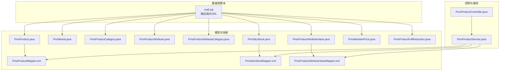
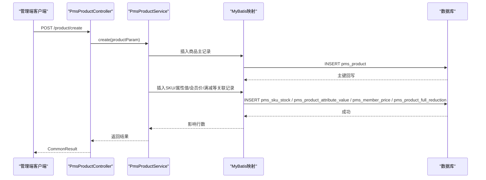
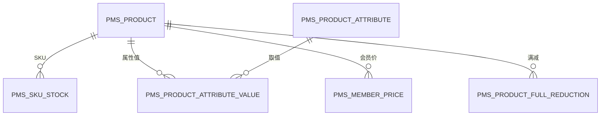
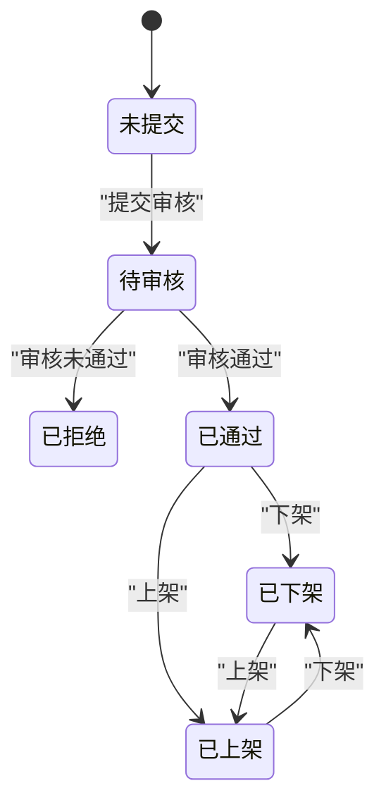
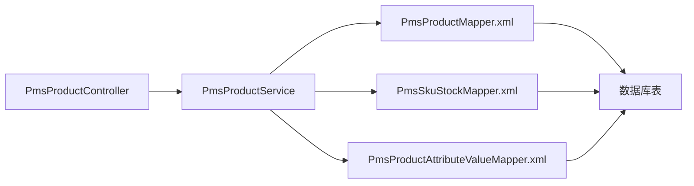

# 商品相关表

<cite>
**本文引用的文件**
- [mall.sql](file://document/sql/mall.sql)
- [PmsProduct.java](file://mall-mbg/src/main/java/com/macro/mall/model/PmsProduct.java)
- [PmsBrand.java](file://mall-mbg/src/main/java/com/macro/mall/model/PmsBrand.java)
- [PmsProductCategory.java](file://mall-mbg/src/main/java/com/macro/mall/model/PmsProductCategory.java)
- [PmsProductAttribute.java](file://mall-mbg/src/main/java/com/macro/mall/model/PmsProductAttribute.java)
- [PmsProductAttributeCategory.java](file://mall-mbg/src/main/java/com/macro/mall/model/PmsProductAttributeCategory.java)
- [PmsSkuStock.java](file://mall-mbg/src/main/java/com/macro/mall/model/PmsSkuStock.java)
- [PmsProductAttributeValue.java](file://mall-mbg/src/main/java/com/macro/mall/model/PmsProductAttributeValue.java)
- [PmsMemberPrice.java](file://mall-mbg/src/main/java/com/macro/mall/model/PmsMemberPrice.java)
- [PmsProductFullReduction.java](file://mall-mbg/src/main/java/com/macro/mall/model/PmsProductFullReduction.java)
- [PmsProductMapper.xml](file://mall-mbg/src/main/resources/com/macro/mall/mapper/PmsProductMapper.xml)
- [PmsSkuStockMapper.xml](file://mall-mbg/src/main/resources/com/macro/mall/mapper/PmsSkuStockMapper.xml)
- [PmsProductAttributeValueMapper.xml](file://mall-mbg/src/main/resources/com/macro/mall/mapper/PmsProductAttributeValueMapper.xml)
- [PmsProductController.java](file://mall-admin/src/main/java/com/macro/mall/controller/PmsProductController.java)
- [PmsProductService.java](file://mall-admin/src/main/java/com/macro/mall/service/PmsProductService.java)
</cite>

## 目录
1. [简介](#简介)
2. [项目结构](#项目结构)
3. [核心组件](#核心组件)
4. [架构概览](#架构概览)
5. [详细组件分析](#详细组件分析)
6. [依赖分析](#依赖分析)
7. [性能考虑](#性能考虑)
8. [故障排查指南](#故障排查指南)
9. [结论](#结论)
10. [附录](#附录)

## 简介
本文件聚焦于电商系统中的“商品相关表”，围绕商品核心表（PmsProduct）、品牌表（PmsBrand）、商品分类表（PmsProductCategory）、商品属性表（PmsProductAttribute）及其关联表进行系统化梳理。内容涵盖：
- 表结构与字段语义、数据类型与约束
- 商品SKU管理、价格体系、库存管理、规格属性
- 商品上下架与审核流程
- 搜索索引与查询策略
- 实际业务场景与SQL示例路径

## 项目结构
商品相关表位于数据库脚本与MyBatis模型/映射文件中，并通过Admin后端控制器与服务层对外提供能力。

**图表来源**
- [mall.sql](file://document/sql/mall.sql)
- [PmsProduct.java](file://mall-mbg/src/main/java/com/macro/mall/model/PmsProduct.java)
- [PmsSkuStock.java](file://mall-mbg/src/main/java/com/macro/mall/model/PmsSkuStock.java)
- [PmsProductAttributeValue.java](file://mall-mbg/src/main/java/com/macro/mall/model/PmsProductAttributeValue.java)
- [PmsProductController.java](file://mall-admin/src/main/java/com/macro/mall/controller/PmsProductController.java)
- [PmsProductService.java](file://mall-admin/src/main/java/com/macro/mall/service/PmsProductService.java)

**章节来源**
- [mall.sql](file://document/sql/mall.sql)
- [PmsProduct.java](file://mall-mbg/src/main/java/com/macro/mall/model/PmsProduct.java)
- [PmsSkuStock.java](file://mall-mbg/src/main/java/com/macro/mall/model/PmsSkuStock.java)
- [PmsProductAttributeValue.java](file://mall-mbg/src/main/java/com/macro/mall/model/PmsProductAttributeValue.java)
- [PmsProductController.java](file://mall-admin/src/main/java/com/macro/mall/controller/PmsProductController.java)
- [PmsProductService.java](file://mall-admin/src/main/java/com/macro/mall/service/PmsProductService.java)

## 核心组件
- 商品核心表（PmsProduct）
  - 字段要点：品牌ID、分类ID、货号、发布/审核/推荐/新品状态、排序、销量、价格、促销价、库存、预警库存、单位、重量、服务ID、关键词、相册、详情HTML等
  - 关键约束：主键自增；多状态位用于运营控制；价格类字段为数值型
- 品牌表（PmsBrand）
  - 字段要点：名称、首字母、工厂/展示状态、产品数量、评论数、LOGO、大图、品牌故事
- 商品分类表（PmsProductCategory）
  - 字段要点：父级ID、层级、名称、导航状态、展示状态、排序、图标、关键词、描述
- 商品属性表（PmsProductAttribute）
  - 字段要点：属性分类ID、名称、选择类型、输入类型、可选值列表、排序、筛选/检索/关联/手工添加标记、属性类型
- 属性分类表（PmsProductAttributeCategory）
  - 字段要点：名称、属性数量、参数数量
- SKU库存表（PmsSkuStock）
  - 字段要点：商品ID、SKU编码、价格、库存、预警库存、图片、销量、促销价、锁定库存、SP数据
- 属性值关联表（PmsProductAttributeValue）
  - 字段要点：商品ID、属性ID、取值
- 会员价格表（PmsMemberPrice）
  - 字段要点：商品ID、会员等级ID、会员价、等级名称
- 满减表（PmsProductFullReduction）
  - 字段要点：商品ID、满额、减免金额

**章节来源**
- [PmsProduct.java](file://mall-mbg/src/main/java/com/macro/mall/model/PmsProduct.java)
- [PmsBrand.java](file://mall-mbg/src/main/java/com/macro/mall/model/PmsBrand.java)
- [PmsProductCategory.java](file://mall-mbg/src/main/java/com/macro/mall/model/PmsProductCategory.java)
- [PmsProductAttribute.java](file://mall-mbg/src/main/java/com/macro/mall/model/PmsProductAttribute.java)
- [PmsProductAttributeCategory.java](file://mall-mbg/src/main/java/com/macro/mall/model/PmsProductAttributeCategory.java)
- [PmsSkuStock.java](file://mall-mbg/src/main/java/com/macro/mall/model/PmsSkuStock.java)
- [PmsProductAttributeValue.java](file://mall-mbg/src/main/java/com/macro/mall/model/PmsProductAttributeValue.java)
- [PmsMemberPrice.java](file://mall-mbg/src/main/java/com/macro/mall/model/PmsMemberPrice.java)
- [PmsProductFullReduction.java](file://mall-mbg/src/main/java/com/macro/mall/model/PmsProductFullReduction.java)

## 架构概览
商品模块采用“模型-映射-控制-服务”的分层设计：
- 数据访问层：MyBatis映射文件负责SQL与实体映射
- 业务服务层：封装商品创建、更新、批量状态变更等事务性操作
- 控制层：提供REST接口，支持商品列表、审核/上下架/推荐/新品状态变更等

**图表来源**
- [PmsProductController.java](file://mall-admin/src/main/java/com/macro/mall/controller/PmsProductController.java)
- [PmsProductService.java](file://mall-admin/src/main/java/com/macro/mall/service/PmsProductService.java)
- [PmsProductMapper.xml](file://mall-mbg/src/main/resources/com/macro/mall/mapper/PmsProductMapper.xml)
- [PmsSkuStockMapper.xml](file://mall-mbg/src/main/resources/com/macro/mall/mapper/PmsSkuStockMapper.xml)
- [PmsProductAttributeValueMapper.xml](file://mall-mbg/src/main/resources/com/macro/mall/mapper/PmsProductAttributeValueMapper.xml)

## 详细组件分析

### 商品核心表（PmsProduct）
- 字段与业务含义
  - 基础信息：名称、副标题、关键词、相册、主图
  - 价格与促销：单价、原价、促销价、促销起止时间、限购、促销类型
  - 库存与预警：库存、低库存阈值
  - 状态位：删除/发布/审核/推荐/新品/预览等
  - 其他：品牌名、分类名、单位、重量、服务ID、销量等
- 关键约束
  - 主键自增；价格/库存等数值字段需注意精度与范围
  - 多状态位用于运营流程控制（审核、上下架、推荐、新品）
- 查询与索引建议
  - 常用过滤：品牌ID、分类ID、审核状态、发布状态、关键字
  - 排序：销量、价格、权重、创建时间
  - 建议索引：品牌ID、分类ID、审核状态、发布状态、关键字全文索引

**章节来源**
- [PmsProduct.java](file://mall-mbg/src/main/java/com/macro/mall/model/PmsProduct.java)
- [PmsProductMapper.xml](file://mall-mbg/src/main/resources/com/macro/mall/mapper/PmsProductMapper.xml)

### 品牌表（PmsBrand）
- 字段与业务含义
  - 名称、首字母、工厂/展示状态、产品数量、评论数、LOGO、大图、品牌故事
- 业务意义
  - 作为商品的外键关联，支撑品牌维度的筛选与统计

**章节来源**
- [PmsBrand.java](file://mall-mbg/src/main/java/com/macro/mall/model/PmsBrand.java)

### 商品分类表（PmsProductCategory）
- 字段与业务含义
  - 父级ID、层级、名称、导航状态、展示状态、排序、图标、关键词、描述
- 业务意义
  - 支撑树形分类与前台导航

**章节来源**
- [PmsProductCategory.java](file://mall-mbg/src/main/java/com/macro/mall/model/PmsProductCategory.java)

### 商品属性表（PmsProductAttribute）与属性分类（PmsProductAttributeCategory）
- 字段与业务含义
  - 属性：名称、选择/输入类型、可选值列表、排序、筛选/检索/关联/手工添加标记、属性类型
  - 属性分类：名称、属性数量、参数数量
- 业务意义
  - 定义商品可配置的规格与参数，支撑SKU组合与搜索筛选

**章节来源**
- [PmsProductAttribute.java](file://mall-mbg/src/main/java/com/macro/mall/model/PmsProductAttribute.java)
- [PmsProductAttributeCategory.java](file://mall-mbg/src/main/java/com/macro/mall/model/PmsProductAttributeCategory.java)

### SKU库存表（PmsSkuStock）
- 字段与业务含义
  - 商品ID、SKU编码、价格、库存、预警库存、图片、销量、促销价、锁定库存、SP数据
- 业务意义
  - SKU级别的价格与库存管理，支持销售锁定与实时扣减

**章节来源**
- [PmsSkuStock.java](file://mall-mbg/src/main/java/com/macro/mall/model/PmsSkuStock.java)
- [PmsSkuStockMapper.xml](file://mall-mbg/src/main/resources/com/macro/mall/mapper/PmsSkuStockMapper.xml)

### 属性值关联表（PmsProductAttributeValue）
- 字段与业务含义
  - 商品ID、属性ID、取值
- 业务意义
  - 将商品与具体属性值绑定，形成SKU组合的基础

**章节来源**
- [PmsProductAttributeValue.java](file://mall-mbg/src/main/java/com/macro/mall/model/PmsProductAttributeValue.java)
- [PmsProductAttributeValueMapper.xml](file://mall-mbg/src/main/resources/com/macro/mall/mapper/PmsProductAttributeValueMapper.xml)

### 会员价格表（PmsMemberPrice）与满减表（PmsProductFullReduction）
- 字段与业务含义
  - 会员价格：商品ID、会员等级ID、会员价、等级名称
  - 满减：商品ID、满额、减免金额
- 业务意义
  - 支撑差异化定价与促销策略

**章节来源**
- [PmsMemberPrice.java](file://mall-mbg/src/main/java/com/macro/mall/model/PmsMemberPrice.java)
- [PmsProductFullReduction.java](file://mall-mbg/src/main/java/com/macro/mall/model/PmsProductFullReduction.java)

### 商品SKU管理、价格体系与库存管理
- SKU生成与绑定
  - 通过属性值关联表将多个属性值绑定到同一商品，形成SKU组合
  - SKU库存表维护每种SKU的独立价格与库存
- 价格体系
  - 单品价与促销价并存，支持促销时间段与限购
  - 会员价与满减叠加策略由业务规则控制
- 库存管理
  - 总库存与SKU库存分离，支持实时扣减与锁定库存
  - 低库存预警与报警联动

**图表来源**
- [PmsProduct.java](file://mall-mbg/src/main/java/com/macro/mall/model/PmsProduct.java)
- [PmsSkuStock.java](file://mall-mbg/src/main/java/com/macro/mall/model/PmsSkuStock.java)
- [PmsProductAttributeValue.java](file://mall-mbg/src/main/java/com/macro/mall/model/PmsProductAttributeValue.java)
- [PmsMemberPrice.java](file://mall-mbg/src/main/java/com/macro/mall/model/PmsMemberPrice.java)
- [PmsProductFullReduction.java](file://mall-mbg/src/main/java/com/macro/mall/model/PmsProductFullReduction.java)

### 商品上下架流程与审核机制
- 审核流程
  - 提交审核后，商品进入审核状态；审核通过后方可发布
  - 审核状态变更通过批量接口完成
- 上下架控制
  - 发布状态控制商品是否对消费者可见
  - 推荐/新品状态用于运营位展示与流量分配

**图表来源**
- [PmsProductController.java](file://mall-admin/src/main/java/com/macro/mall/controller/PmsProductController.java)
- [PmsProductService.java](file://mall-admin/src/main/java/com/macro/mall/service/PmsProductService.java)

### 搜索索引与查询策略
- 前台搜索
  - 基于商品名称、关键词、分类、品牌等维度进行过滤与排序
- 后台管理
  - 支持分页、多条件组合查询与状态筛选
- 建议
  - 对高频过滤字段建立索引；对全文检索使用专用索引或搜索引擎

**章节来源**
- [PmsProductController.java](file://mall-admin/src/main/java/com/macro/mall/controller/PmsProductController.java)
- [PmsProductMapper.xml](file://mall-mbg/src/main/resources/com/macro/mall/mapper/PmsProductMapper.xml)

## 依赖分析
- 控制层依赖服务层，服务层依赖MyBatis映射，映射依赖数据库表
- 商品主表与SKU、属性值、会员价、满减存在一对多关系
- 控制器提供批量状态变更接口，服务层封装事务边界

**图表来源**
- [PmsProductController.java](file://mall-admin/src/main/java/com/macro/mall/controller/PmsProductController.java)
- [PmsProductService.java](file://mall-admin/src/main/java/com/macro/mall/service/PmsProductService.java)
- [PmsProductMapper.xml](file://mall-mbg/src/main/resources/com/macro/mall/mapper/PmsProductMapper.xml)
- [PmsSkuStockMapper.xml](file://mall-mbg/src/main/resources/com/macro/mall/mapper/PmsSkuStockMapper.xml)
- [PmsProductAttributeValueMapper.xml](file://mall-mbg/src/main/resources/com/macro/mall/mapper/PmsProductAttributeValueMapper.xml)

**章节来源**
- [PmsProductController.java](file://mall-admin/src/main/java/com/macro/mall/controller/PmsProductController.java)
- [PmsProductService.java](file://mall-admin/src/main/java/com/macro/mall/service/PmsProductService.java)
- [PmsProductMapper.xml](file://mall-mbg/src/main/resources/com/macro/mall/mapper/PmsProductMapper.xml)
- [PmsSkuStockMapper.xml](file://mall-mbg/src/main/resources/com/macro/mall/mapper/PmsSkuStockMapper.xml)
- [PmsProductAttributeValueMapper.xml](file://mall-mbg/src/main/resources/com/macro/mall/mapper/PmsProductAttributeValueMapper.xml)

## 性能考虑
- 索引策略
  - 在品牌ID、分类ID、审核状态、发布状态、关键字上建立合适索引
  - SKU表按商品ID与SKU编码建立联合索引
- 查询优化
  - 后台管理使用分页与条件过滤；避免SELECT *
  - 对全文检索使用专用索引或搜索引擎
- 写入优化
  - 批量插入SKU与属性值时使用批量SQL
  - 价格/库存更新采用乐观锁或行级锁控制并发

## 故障排查指南
- 常见问题
  - 审核状态未生效：检查批量更新接口调用与事务提交
  - SKU库存不同步：核对SKU表与商品表库存字段一致性
  - 价格异常：检查促销价与会员价叠加逻辑
- 排查步骤
  - 核对数据库表结构与字段类型
  - 查看MyBatis映射文件与SQL执行计划
  - 检查服务层事务边界与异常处理

**章节来源**
- [PmsProductController.java](file://mall-admin/src/main/java/com/macro/mall/controller/PmsProductController.java)
- [PmsProductService.java](file://mall-admin/src/main/java/com/macro/mall/service/PmsProductService.java)

## 结论
商品相关表通过清晰的主从关系与丰富的状态位，支撑了从商品创建、SKU管理、价格与促销策略到库存与审核的完整业务闭环。结合合理的索引与查询策略，可在保证功能完整性的同时提升系统性能与可维护性。

## 附录
- 实际业务场景与SQL示例路径（仅提供路径，不展示具体SQL内容）
  - 创建商品（含SKU、属性值、会员价、满减）：[PmsProductService.java](file://mall-admin/src/main/java/com/macro/mall/service/PmsProductService.java)，[PmsProductMapper.xml](file://mall-mbg/src/main/resources/com/macro/mall/mapper/PmsProductMapper.xml)，[PmsSkuStockMapper.xml](file://mall-mbg/src/main/resources/com/macro/mall/mapper/PmsSkuStockMapper.xml)，[PmsProductAttributeValueMapper.xml](file://mall-mbg/src/main/resources/com/macro/mall/mapper/PmsProductAttributeValueMapper.xml)
  - 批量审核/上下架/推荐/新品状态变更：[PmsProductController.java](file://mall-admin/src/main/java/com/macro/mall/controller/PmsProductController.java)，[PmsProductService.java](file://mall-admin/src/main/java/com/macro/mall/service/PmsProductService.java)
  - 商品列表与分页查询：[PmsProductController.java](file://mall-admin/src/main/java/com/macro/mall/controller/PmsProductController.java)，[PmsProductMapper.xml](file://mall-mbg/src/main/resources/com/macro/mall/mapper/PmsProductMapper.xml)